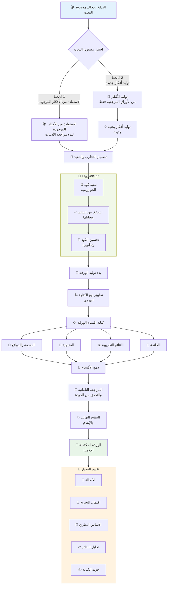

⏱️ **وقت القراءة المقدر**: 12 دقيقة

## مقدمة

يشهد نموذج البحث العلمي تحولًا جوهريًا. **AI-Researcher**، الذي طوّره فريق أبحاث جامعة هونغ كونغ لعلوم البيانات (HKUDS)، لا يقتصر على كونه أداةً بحثيةً بسيطة، بل يُجسّد **نظام بحث علمي مستقلًا بالكامل**. نُشر هذا النظام في الورقة البحثية [arXiv:2505.18705](https://arxiv.org/abs/2505.18705)، ويتيح للذكاء الاصطناعي تنفيذ العملية البحثية بأكملها باستقلالية تامة، من مراجعة الأدبيات حتى نشر الأوراق البحثية.

يُقدّم هذا التحليل نظرةً شاملةً على البنية التقنية للنظام، وعناصر الابتكار الجوهرية فيه، ومدى إمكانية تطبيقه في بيئات البحث المتنوعة.

## نظرة عامة على مشروع AI-Researcher

### 📄 الورقة البحثية والقيمة الجوهرية

تجمع ورقة **"AI-Researcher: Autonomous Scientific Innovation"** بين قدرات الاستدلال القوية لنماذج اللغة الكبيرة (LLMs) وأطر عمل الأتمتة متعددة المهام المعقدة، بهدف تسريع الاكتشاف العلمي.

**🔬 نقاط الابتكار الجوهرية:**

1. **الاستقلالية الكاملة**: يتولى الذكاء الاصطناعي تنفيذ العملية بأسرها، من توليد أفكار البحث إلى نشر الأوراق.
2. **تجاوز حدود الإدراك البشري**: استكشاف منهجي لفضاءات الحلول التي يصعب على الباحث البشري اجتيازها.
3. **تعاون متعدد الوكلاء**: يعمل وكلاء ذكاء اصطناعي متخصصون معًا لإنجاز مهام البحث المعقدة.
4. **نظام تقييم موضوعي**: تقييم للجودة بمستوى الخبراء في أربعة مجالات رئيسية.

### 🏗️ حالة مستودع GitHub

استقطب [مستودع GitHub](https://github.com/HKUDS/AI-Researcher) **أكثر من 2000 نجمة**، وترسّخ بوصفه مشروعًا مفتوح المصدر نشطًا:

- **دعم متعدد لنماذج اللغة الكبيرة**: تكامل مع Claude وOpenAI وDeepSeek وغيرها.
- **الحد الأدنى من التخصص المطلوب**: يمكن إجراء بحث فعّال حتى دون خبرة عميقة في المجال.
- **جاهز للاستخدام فورًا**: مصمَّم للاستخدام المباشر دون إعداد معقد.
- **مفتوح المصدر بالكامل**: كل شيء متاح للعموم، من منهجية بناء المعايير حتى النظام الكامل.

## تحليل بنية النظام

### 🎨 الهيكل العام للنظام


<!--
  animated-architecture-diagram — self-contained D3 embed template.
  HuggingFace research-article style: declarative NODES/EDGES/SEQ model,
  data(solid)/event(dashed) edges, hover-trace + tooltip, flow-dot animation
  along edge paths, replay button, scroll-into-view autoplay, reduced-motion +
  light/dark aware. The renderer injects window.__ARCH_SPEC__ at the marker.
  Format (D3 machinery + CSS) is owned by this committed template; the model
  only authors the JSON spec (content). See references/spec-schema.md.
-->



يتكوّن نظام AI-Researcher من ثلاثة مكوّنات جوهرية:

1. **Research Agent**: يتولى جميع مراحل تنفيذ البحث.
2. **Paper Agent**: يحوّل نتائج البحث إلى أوراق أكاديمية.
3. **Benchmark Suite**: نظام تقييم متعدد الأبعاد للجودة.

### 🔄 تدفق التنفيذ التفصيلي

```mermaid
flowchart TD
    START["🎬 البداية: إدخال موضوع البحث"] --> LEVEL{"اختيار مستوى البحث"}
    
    LEVEL -->|Level 1<br/>الاستفادة من الأفكار الموجودة| L1_SURVEY["📚 الاستفادة من الأفكار الموجودة<br/>لبدء مراجعة الأدبيات"]
    LEVEL -->|Level 2<br/>توليد أفكار جديدة| L2_PAPERS["📄 توليد الأفكار<br/>من الأوراق المرجعية فقط"]
    
    L1_SURVEY --> EXPERIMENT["🧪 تصميم التجارب والتنفيذ"]
    L2_PAPERS --> IDEA_GEN["💡 توليد أفكار بحثية<br/>جديدة"]
    IDEA_GEN --> EXPERIMENT
    
    EXPERIMENT --> CODE_IMPL["⚙️ تنفيذ كود<br/>الخوارزمية"]
    CODE_IMPL --> VALIDATION["✅ التحقق من النتائج<br/>وتحليلها"]
    VALIDATION --> REFINEMENT["🔧 تحسين الكود<br/>وتطويره"]
    
    REFINEMENT --> PAPER_GEN["📝 بدء توليد الورقة"]
    PAPER_GEN --> HIERARCHICAL["🏗️ تطبيق نهج الكتابة<br/>الهرمي"]
    
    HIERARCHICAL --> SECTIONS["📋 كتابة أقسام الورقة"]
    SECTIONS --> INTRO["🎯 المقدمة والدوافع"]
    SECTIONS --> METHODS["🔬 المنهجية"]
    SECTIONS --> RESULTS["📊 النتائج التجريبية"]
    SECTIONS --> CONCLUSION["🎉 الخاتمة"]
    
    INTRO --> INTEGRATE["🔗 دمج الأقسام"]
    METHODS --> INTEGRATE
    RESULTS --> INTEGRATE
    CONCLUSION --> INTEGRATE
    
    INTEGRATE --> REVIEW["👀 المراجعة التلقائية<br/>والتحقق من الجودة"]
    REVIEW --> POLISH["✨ التنقيح النهائي<br/>والإتمام"]
    
    POLISH --> FINAL["🎊 الورقة المكتملة<br/>للإخراج"]
    
    subgraph DOCKER["🐳 بيئة Docker"]
        CODE_IMPL
        VALIDATION
        REFINEMENT
    end
    
    subgraph BENCHMARK["📏 تقييم المعيار"]
        NOVELTY["🌟 الأصالة"]
        EXPERIMENTAL["🔬 اكتمال التجربة"]
        THEORETICAL["📖 الأساس النظري"]
        ANALYSIS["📈 تحليل النتائج"]
        WRITING["✍️ جودة الكتابة"]
    end
    
    FINAL --> BENCHMARK
    
    style START fill:#e3f2fd
    style DOCKER fill:#f1f8e9
    style BENCHMARK fill:#fff3e0
    style FINAL fill:#e8f5e8
```

يدعم النظام مستويين للبحث:

- **المستوى الأول**: بحث معمّق وتجارب مبنية على أفكار بحثية قائمة.
- **المستوى الثاني**: دورة كاملة من توليد الأفكار الجديدة حتى التجريب، بالاعتماد على الأوراق المرجعية فقط.

## مكدس التقنيات وبيئة الأدوات

### 🛠️ البنية التقنية المتكاملة

```mermaid
graph LR
    subgraph AI_MODELS["🤖 طبقة نماذج AI"]
        CLAUDE["🎭 Claude 3.5<br/>Sonnet/Haiku"]
        OPENAI["🧠 OpenAI<br/>GPT Models"]
        DEEPSEEK["🔍 DeepSeek<br/>Models"]
        OTHERS["⚡ مزود LLM<br/>آخر"]
    end
    
    subgraph CORE_SYSTEM["🎯 النظام الأساسي"]
        MAIN["🚀 main_ai_researcher.py<br/>(المنسق الرئيسي)"]
        GLOBAL["🌐 global_state.py<br/>(إدارة الحالة العامة)"]
        WEB["🌍 web_ai_researcher.py<br/>(واجهة الويب)"]
    end
    
    subgraph AGENTS["🤝 نظام العوامل"]
        RA["📚 Research Agent<br/>(تنفيذ البحث)"]
        PA["✍️ Paper Agent<br/>(كتابة الورقة)"]
        EA["📊 Evaluator Agent<br/>(تنفيذ التقييم)"]
    end
    
    subgraph EXECUTION["⚙️ بيئة التنفيذ"]
        DOCKER["🐳 Docker<br/>Container"]
        SCRIPTS["📜 Shell Scripts<br/>(run_infer_*.sh)"]
        PYTHON["🐍 Python<br/>Environment"]
        GPU["💾 GPU Support<br/>(CUDA)"]
    end
    
    subgraph BENCHMARK["📏 نظام المعيار"]
        EVAL_DATA["📊 Evaluation<br/>Datasets"]
        METRICS["📈 Performance<br/>Metrics"]
        DOMAINS["🎯 Multi-Domain<br/>Testing"]
        GROUND_TRUTH["✅ Expert<br/>Ground Truth"]
    end
    
    subgraph OUTPUT["📤 المخرجات"]
        PAPERS["📄 Academic<br/>Papers"]
        CODE["💻 Research<br/>Code"]
        RESULTS["📊 Experimental<br/>Results"]
        REPORTS["📝 Analysis<br/>Reports"]
    end
    
    AI_MODELS --> CORE_SYSTEM
    CORE_SYSTEM --> AGENTS
    AGENTS --> EXECUTION
    EXECUTION --> BENCHMARK
    BENCHMARK --> OUTPUT
    
    RA --> |"مراجعة الأدبيات<br/>تصميم التجارب"| EXECUTION
    PA --> |"كتابة الورقة<br/>الهيكلة"| EXECUTION
    EA --> |"تقييم الجودة<br/>التحقق"| BENCHMARK
    
    style AI_MODELS fill:#e3f2fd
    style CORE_SYSTEM fill:#f3e5f5
    style AGENTS fill:#e8f5e8
    style EXECUTION fill:#fff3e0
    style BENCHMARK fill:#ffebee
    style OUTPUT fill:#f1f8e9
```

## عناصر الابتكار الجوهرية

### 1. 🎯 خط أنابيب بحثي مؤتمت بالكامل

**تجاوز قيود العملية البحثية التقليدية:**

- **إزالة التحيز الإدراكي البشري**: يحدد الذكاء الاصطناعي اتجاه البحث بناءً على بيانات موضوعية.
- **البحث على مدار الساعة**: استمرارية البحث دون قيود زمنية.
- **معالجة الأدبيات على نطاق واسع**: تحليل متزامن لأحجام ضخمة من الأدبيات يتجاوز طاقة الباحث البشري.

### 2. 🤝 تعاون ذكي بين الوكلاء

**توزيع الأدوار بين الوكلاء المتخصصين:**

- **Research Agent**: يتولى مراجعة الأدبيات وتحليل الفجوات والتحقق من الفرضيات.
- **Paper Agent**: ينتج أوراقًا بحثية بجودة النشر الأكاديمي باستخدام أسلوب الكتابة الهرمي.
- **Evaluator Agent**: يُجري تقييمًا متعدد الأبعاد للجودة يشمل الأصالة والاكتمال التجريبي والأسس النظرية وغيرها.

### 3. 🌍 الشمولية وسهولة الوصول

**ديمقراطية البحث العلمي:**

- **الحد الأدنى من التخصص المطلوب**: يمكن إجراء بحث عالي الجودة دون تخصص عميق في المجال.
- **دعم متعدد لنماذج اللغة الكبيرة**: اختيار نماذج ذكاء اصطناعي مختلفة بحسب متطلبات المهمة.
- **بيئة تنفيذ مبنية على Docker**: بيئة تشغيل متسقة تضمن قابلية إعادة إنتاج البحث.

### 4. 📊 نظام تقييم موضوعي

**إطار تقييم جودة موحّد:**

- **4 مجالات رئيسية**: رؤية الحاسوب (CV)، ومعالجة اللغة الطبيعية (NLP)، والتنقيب في البيانات (DM)، واسترجاع المعلومات (IR).
- **معايير بمستوى الخبراء**: التقييم مقارنةً بأوراق بحثية كتبها خبراء بشريون.
- **مقاييس متعددة الأبعاد**: الأصالة والتصميم التجريبي والخلفية النظرية وتحليل النتائج وجودة الكتابة.

## إطار المعايير والتقييم

### 📏 إطار التقييم الشامل

أرسى نظام AI-Researcher بنية تقييم واسعة النطاق:

**أبعاد التقييم:**

1. **🌟 الأصالة (Novelty)**: ابتكار أفكار البحث وتفرّدها.
2. **🔬 الاكتمال التجريبي (Experimental Comprehensiveness)**: صرامة التصميم التجريبي وتنفيذه.
3. **📖 الأساس النظري (Theoretical Foundation)**: متانة الخلفية النظرية.
4. **📈 تحليل النتائج (Result Analysis)**: عمق تفسير النتائج ودقته.
5. **✍️ جودة الكتابة (Writing Quality)**: وضوح الورقة البحثية وبنيتها.

**تغطية المجالات:**

- **رؤية الحاسوب (CV)**: التعرف على الصور، والكشف عن الكائنات، والتجزئة.
- **معالجة اللغة الطبيعية (NLP)**: نماذج اللغة، وتصنيف النصوص، والترجمة الآلية.
- **التنقيب في البيانات (DM)**: اكتشاف الأنماط، والتجميع، وأنظمة التوصية.
- **استرجاع المعلومات (IR)**: خوارزميات البحث، والترتيب، وتحسين الاستعلامات.

## إمكانية التطبيق في البيئات البحثية

### 🔬 كيف يمكن لمؤسسات البحث تطبيق هذا النظام

**1. مختبرات البحث الأكاديمي**

- **تسريع بحث الدراسات العليا**: أتمتة مراجعة الأدبيات تقلّص الوقت المخصص للمهام التأسيسية.
- **البحث متعدد التخصصات**: يسدّ الثغرات الناجمة عن محدودية الخبرة في المجال.
- **توحيد جودة البحث**: تساعد معايير التقييم الموضوعية في الحفاظ على جودة متسقة.

**2. البحث والتطوير في الشركات**

- **رصد التقنيات الناشئة**: تحليل أحجام كبيرة من براءات الاختراع والأوراق البحثية لمتابعة الاتجاهات.
- **تسريع تطوير المنتجات**: أتمتة النمذجة الأولية للخوارزميات.
- **خفض تكاليف البحث والتطوير**: تقليص الجهد اليدوي في المراحل الأولى من البحث.

**3. دعم السياسات والبحث العام**

- **كفاءة البحث الوطني**: دعم تقييم البرامج البحثية وتحديد اتجاهاتها.
- **تطوير الباحثين**: أداة لبناء المهارات البحثية لدى العلماء في بداية مسيرتهم.
- **التنافسية العالمية**: تحليل فوري لاتجاهات البحث العالمية لإثراء صنع القرار.

### 🚀 اعتبارات التبني

**المتطلبات التقنية:**

- **موارد الحوسبة**: الحاجة إلى مجموعات GPU أو بيئات سحابية.
- **البنية التحتية للبيانات**: توافر قواعد بيانات واسعة للأوراق البحثية.
- **إطار الأمان**: حماية بيانات البحث وإدارة الملكية الفكرية.

**التغييرات التنظيمية:**

- **تحوّل ثقافة البحث**: بناء الوعي بأساليب البحث التعاوني مع الذكاء الاصطناعي.
- **برامج التدريب**: تثقيف الباحثين حول الاستخدام الفعّال لنظام AI-Researcher.
- **مراجعة معايير التقييم**: وضع معايير جديدة للبحث المدعوم بالذكاء الاصطناعي.

## آفاق المستقبل واتجاهات التطوير

### 🔮 التطور التقني

**1. توسع البحث متعدد الوسائط**

- **دمج الصور والنصوص**: تحليل مشترك للبيانات المرئية والنصية.
- **ربط الكلام باللغة**: توسيع نطاق البحث ليشمل البيانات الصوتية.
- **توظيف بيانات الاستشعار**: تحليل البيانات المتنوعة المجمَّعة من بيئات إنترنت الأشياء.

**2. التكيّف البحثي في الوقت الحقيقي**

- **تحديثات الأدبيات الديناميكية**: تعديل فوري لاتجاه البحث مع صدور أوراق جديدة.
- **التنبؤ بالاتجاهات**: التنبؤ بموضوعات البحث المستقبلية من خلال تحليل الاتجاهات.
- **شبكات التعاون**: منصات تعاون في الوقت الحقيقي بين الباحثين حول العالم.

### 🌏 الأثر الاجتماعي

**1. تحسين إمكانية الوصول إلى البحث**

- **تقليص الفجوات الإقليمية**: تعزيز القدرة البحثية في المناطق ذات البنية التحتية المحدودة.
- **إزالة الحواجز اللغوية**: توسيع المشاركة البحثية العالمية عبر دعم متعدد اللغات.
- **تخفيف الحواجز المالية**: الطابع مفتوح المصدر يخفّض تكاليف البحث بشكل ملحوظ.

**2. تسريع التقدم العلمي**

- **ديمقراطية الاكتشاف**: تهيئة البيئة لأي شخص للمساهمة في الاكتشافات العلمية.
- **التوليف بين التخصصات**: ربط المعرفة من مجالات مختلفة ودمجها آليًا.
- **تحسين قابلية الإعادة**: بيئات تجريبية موحّدة تضمن قابلية إعادة إنتاج البحث.

## خاتمة

يتجاوز AI-Researcher حدود أداة البحث، ليمثّل نظامًا يُحدث **تحولًا في نموذج البحث العلمي ذاته**. من خلال التنفيذ البحثي المستقل بالكامل، والتعاون الذكي بين الوكلاء، وإطار التقييم الموضوعي، يرفع النظام كفاءة البحث وجودته في آنٍ واحد.

على مستوى البيئات البحثية الأوسع، تبرز التغييرات الإيجابية التالية:

1. **إنتاجية البحث**: أتمتة خط الأنابيب الكامل، من مراجعة الأدبيات إلى كتابة الأوراق البحثية.
2. **توحيد الجودة**: جودة متسقة من خلال معايير تقييم موضوعية.
3. **تحسين إمكانية الوصول**: إزالة حواجز التخصص لتمكين مشاركة أعداد أكبر من الباحثين.
4. **استجابة أسرع للاتجاهات العالمية**: تكيّف أسرع مع المستجدات في مشهد البحث العالمي.

يُشير مستقبل AI-Researcher إلى عصر جديد يتعاون فيه الإنسان والذكاء الاصطناعي لتحقيق **اكتشافات علمية أكثر إبداعًا وأصالة**. ومن المتوقع أن يُحدث تبنّي هذه التقنية وتطويرها تغييرًا ذا معنى في مجتمعات البحث حول العالم.

## المراجع

- [مستودع AI-Researcher على GitHub](https://github.com/HKUDS/AI-Researcher)
- [الورقة البحثية: "AI-Researcher: Autonomous Scientific Innovation"](https://arxiv.org/abs/2505.18705)
- [الموقع الرسمي للمشروع](https://hkuds.github.io/AI-Researcher/)
- [قناة المجتمع على Slack](https://join.slack.com/t/ai-researcher/shared_invite/)
- [خادم Discord](https://discord.gg/ai-researcher)
