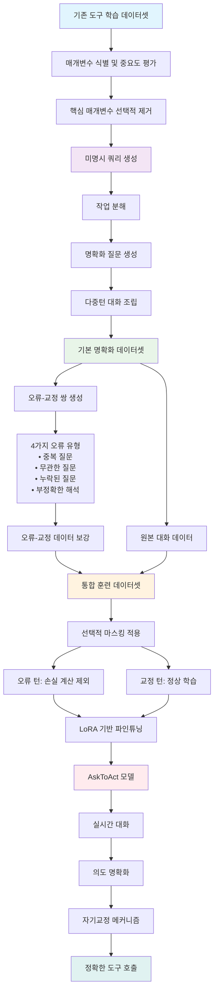

⏱️ **وقت القراءة المقدر**: 12 دقيقة

## مقدمة: التحدي الجوهري لاستخدام الأدوات في النماذج اللغوية الكبيرة ضمن البيئات الواقعية

أسهمت قدرة النماذج اللغوية الكبيرة (LLMs) على التفاعل مع الأدوات الخارجية وواجهات برمجة التطبيقات (APIs) في توسيع تطبيقات الذكاء الاصطناعي العملية توسيعاً ملحوظاً. أتاحت أطر عمل النماذج المعززة بالأدوات كـ Toolformer وToolLLaMA وGorilla للنماذج تجاوز مجرد توليد النصوص ومعالجة مهام بالغة التعقيد. غير أن أطر عمل تعلم الأدوات الحالية تعمل في ظل افتراض مثالي مفاده أن استفسارات المستخدمين دائماً صريحة وواضحة.

في البيئات الواقعية، كثيراً ما يقدم المستخدمون استفسارات منقوصة أو غامضة أو غير دقيقة. تُشكّل هذه الاستفسارات غير المحددة تحدياً استثنائياً في سيناريوهات استخدام الأدوات، إذ تستلزم استدعاءات API معاملات دقيقة ولا تحتمل الغموض. حين تواجه النماذج اللغوية الكبيرة استفسارات غير محددة، تميل إما إلى اختلاق قيم افتراضية للمعاملات المفقودة أو تركها دون تحديد، مما يُفضي إلى مخاطر محتملة في استدعاءات الأدوات.

## القيود الجوهرية للمقاربات الحالية

أدخلت الأبحاث الحديثة مقاربات للتوضيح الحواري، إلا أنها تصطدم بقيدين جوهريين. أولهما: الاعتماد المفرط على مجموعات بيانات مُنشأة يدوياً لأغراض التدريب. يستلزم إنتاج هذه المجموعات توظيف مُعلِّمين بشريين لصياغة الاستفسارات والتوضيحات، وهي عملية تحدّ بطبيعتها من النطاق والتنوع. ولا تلتقط مجموعات البيانات الناتجة سوى أنماط محدودة من الغموض، مما يُقلص فاعليتها أمام تنوع الاستفسارات الواقعية.

ثانيهما: افتقار النماذج القائمة إلى معالجة قوية للأخطاء خلال عملية التوضيح متعدد الأدوار. تُدرَّب هذه النماذج على مجموعات بيانات تحتوي على تسلسلات توضيح مثالية فحسب. بيد أنه في الواقع العملي، كثيراً ما تُعيد النماذج طلب معلومات أفصح عنها المستخدم سلفاً، أو تتبع مسارات لا صلة لها بالموضوع، أو تُغفل تفاصيل غير محددة. وفي غياب التدريب على التعافي من الأخطاء، تتراكم هذه الإشكاليات عبر الحوار مما يُدهور الكفاءة ويُضعف جودة استدعاءات الأدوات.

## الابتكارات الجوهرية لإطار عمل AskToAct

AskToAct إطار عمل للتوضيح التصحيحي الذاتي يعالج هذه القيود بصورة منهجية. الفكرة المحورية هي أن معاملات الأدوات تُجسّد بطبيعتها تمثيلاً صريحاً لنية المستخدم، وهو ما يُتيح فرصة لتوليد البيانات آلياً. طوّر فريق البحث خطوط أنابيب آلية تُزيل معاملات جوهرية بصورة استراتيجية من استفسارات مكتملة في مجموعات بيانات موجودة، لإنتاج استفسارات غير محددة بالغة التنوع. تحمل هذه الاستفسارات المولّدة إجابات صحيحة مُضمّنة فيها، مما يُمكّن من بناء حوارات توضيحية ثرية تُجسّد استخلاص النية بفاعلية.

لتمكين المعالجة القوية للأخطاء أثناء التفاعل، عزّز الفريق بيانات التدريب بأزواج مُصمَّمة بعناية من الأخطاء وتصحيحاتها تحاكي الأغلاط الواقعية وكيفية معالجتها. كما اعتمدت عملية التدريب الإخفاء الانتقائي للوقاية من تعلّم الأنماط السلبية مع تعزيز قدرة الكشف عن الأخطاء في آنٍ واحد.

## منهجية بناء مجموعة بيانات توضيح النية

### توليد الاستفسارات غير المحددة

ينطلق بناء مجموعة بيانات AskToAct من الحصول على أزواج واقعية من الاستفسارات الغامضة والنوايا المكتملة. تعتمد المقاربة على أسلوب هندسة عكسية مبتكر يستثمر مجموعات بيانات تعلم الأدوات الموجودة. يتضمن كل عنصر في هذه المجموعات استفساراً من المستخدم وحلاً موافقاً لاستدعاء الأداة. استناداً إلى الرؤية الجوهرية بأن معاملات الأدوات تُمثّل تعبيراً صريحاً عن نية المستخدم، يُزيل الفريق منهجياً معاملات جوهرية من الاستفسارات المكتملة لإنتاج نسخ غير محددة.

تتألف هذه العملية من ثلاث مراحل: (1) تحديد المعاملات: استخراج جميع المعاملات من حل استدعاء الأداة، (2) تقييم الأهمية: تقدير أهمية كل معامل استناداً إلى تأثيره على وظائف الأداة، (3) الحذف الانتقائي: اختيار المعاملات الأكثر أهمية واستراتيجية حذفها. تُتيح هذه المقاربة توليد كميات كبيرة من بيانات التدريب عالية الجودة بصورة آلية.

### خط أنابيب بناء الحوار

بعد توليد الاستفسارات غير المحددة، تكمن الخطوة التالية في بناء حوارات توضيحية فاعلة. تشمل هذه العملية ثلاثة مكونات جوهرية: تحليل المهام، وتوليد التوضيحات، وتجميع الحوار. في مرحلة تحليل المهام، تُجزَّأ الاستفسارات المعقدة إلى مهام فرعية تستلزم كل منها استدعاءً منفصلاً لـ API. في مرحلة توليد التوضيحات، تُنتَج أسئلة توضيحية طبيعية وملائمة سياقياً لكل معامل غير محدد. وفي مرحلة تجميع الحوار، تُدمَج هذه المكونات في حوار متماسك متعدد الأدوار.

## الآليات الجوهرية لنموذج التدريب التصحيحي الذاتي

### تعزيز بيانات أزواج الخطأ والتصحيح

لمحاكاة الأخطاء التي قد تقع في الحوارات الواقعية، يعتمد AskToAct استراتيجية منهجية لتعزيز بيانات أزواج الخطأ والتصحيح. تُعالَج أربعة أنواع من الأخطاء: (1) الأسئلة المكررة: إعادة طلب معلومات أفصح عنها المستخدم مسبقاً، (2) الأسئلة غير ذات الصلة: طلب معلومات لا علاقة لها بالمهمة، (3) الأسئلة المغفلة: إغفال معاملات غير محددة جوهرية، (4) التفسير الخاطئ للمعاملات: سوء فهم استجابة المستخدم.

لكل نوع من أنواع الأخطاء، يُنتج الفريق أزواجاً حوارية توضح كيفية وقوع هذه الأغلاط في الحوارات الواقعية وكيفية تصحيحها. تُمكّن هذه الأزواج النموذجَ من تعلّم التعرف على أخطائه الخاصة وتصحيحها في الوقت الفعلي.

### استراتيجية الإخفاء الانتقائي

للوقاية من تعلّم النموذج للأنماط السلبية خلال التدريب، يعتمد AskToAct استراتيجية الإخفاء الانتقائي. في إطار هذه المقاربة، لا يُحسَب الخطأ للأدوار الحوارية المحتوية على أخطاء، وتُجرى عملية التعلم على أدوار التصحيح فحسب. يُتيح ذلك للنموذج تعلّم السلوك الصحيح مع الاحتفاظ بالقدرة على التعرف على أنماط الأخطاء. والأهم أن الإخفاء يُطبَّق على رموز الأخطاء فقط مع الإبقاء على رموز السياق، مما يُمكّن النموذج من فهم مجرى الحوار بأكمله.

## تنسيق مجموعة البيانات وتحليل الأمثلة

### الهيكل الأساسي للبيانات

تتبع مجموعة بيانات AskToAct الهيكل التالي:

**مثال على الاستفسار الأصلي:**
```
User: "What regions are supported for a specific language? And can you check whether a given email address is valid?"
```

**بعد توليد الاستفسار غير المحدد:**
```
User: "What regions are supported for a language? And can you check whether an email address is valid?"
[Removed parameters: 'en' (language code), 'user@example.com' (email address)]
```

**مثال على الحوار التوضيحي:**
```
AI: [Task Decomposition] This task can be decomposed into 2 steps.
Step 1: Use the regions API to check which regions are supported for the specified language.
Step 2: Use the check_email API to validate the email address.

[Parameter Evaluation] Current information:
Step 1: The "language" parameter for the regions API lacks a clear value.
Step 2: The "email" parameter for the check_email API lacks a clear value.

[Question] What is the language code for which you want to check supported regions?

User: The language code is 'en'.

AI: [Parameter Evaluation] Confirmed that the "language" parameter for the regions API is "en".
[Question] What is the email address you want to validate?

User: I want to check whether 'user@example.com' is a valid email address.

AI: [Summary] All required information has been obtained and the relevant APIs can be called.
Solution: [{'task': 'regions', 'arguments': [{'name': 'language', 'value': 'en'}]}, {'task': 'check_email', 'arguments': [{'name': 'email', 'value': 'user@example.com'}]}]
```

### أمثلة على أزواج الخطأ والتصحيح

**خطأ السؤال المكرر وتصحيحه:**
```
[Error] AI: Could you confirm the language code once more?
User: I already told you it's 'en'.
[Correction] AI: I apologize. The language code 'en' is confirmed. Please provide the email address now.
```

**خطأ السؤال غير ذي الصلة وتصحيحه:**
```
[Error] AI: What operating system are you using?
User: Why is that relevant? All I need is email validation.
[Correction] AI: You are right. The operating system was not needed. Please provide the email address you want to validate.
```

## مخطط تدفق عملية التدريب



## النتائج التجريبية الشاملة وتحليل الأداء

### مقاييس الأداء الرئيسية

جرى تقييم أداء AskToAct على بُعدين جوهريين: جودة توضيح النية ودقة استدعاء الأدوات. على صعيد جودة توضيح النية، استحدث فريق البحث مقياسَي دقة التوضيح (Clarification Precision Score, CPS) وكفاءة التوضيح (Clarification Efficiency Score, CES). يقيس CPS مدى دقة النموذج في تحديد النية الجوهرية غير المحددة واستردادها، في حين يُقيّم CES كفاءة عملية التوضيح.

على صعيد دقة استدعاء الأدوات، اعتُمدت ثلاثة مقاييس: دقة الحل الكلية (Overall Solution Accuracy, OSA)، ودرجة اختيار الأداة (Tool Selection Score, TSS)، ودرجة تحليل المعاملات (Parameter Resolution Score, PRS). يقيس OSA نسبة الاستفسارات التي يُنتَج لها حل استدعاء أداة صحيح تماماً. ويُقيّم TSS دقة اختيار الـ API الصحيحة لكل استفسار. ويقيس PRS قدرة النموذج على تعبئة المعاملات المطلوبة لاستدعاء الأداة بشكل صحيح.

### مكاسب أداء جوهرية

أظهرت النتائج التجريبية أن AskToAct يتجاوز الأساليب القائمة بفارق كبير على جميع المقاييس الرئيسية. أبرز نتيجة هي أن النموذج يستطيع استرداد أكثر من 57% من النوايا الجوهرية غير المحددة بدقة، مقارنةً بمستوى 30 إلى 40% الذي تحققه الأساليب الحالية عادةً. كذلك حقق AskToAct تحسناً بمعدل 10.46% في كفاءة التوضيح مقارنةً بالنموذج الأساسي، أي أنه يجمع المعلومات الضرورية في عدد أقل من أدوار الحوار مع الحفاظ على الدقة ذاتها.

في أداء استدعاء الأدوات من البداية إلى النهاية، حقق النموذج دقة تزيد على 81% في اختيار الأدوات ودقة تزيد على 68% في تحليل المعاملات. ومما يستحق الإشارة تحديداً أن الأداء العالي يُحافَظ عليه حتى في سيناريوهات متعددة الأدوات بالغة التعقيد، وهو أمر بالغ الأهمية عملياً إذ كثيراً ما يطلب المستخدمون مهام متعددة في آنٍ واحد.

### مكاسب متسقة عبر بنى النماذج المختلفة

تتجلى متانة AskToAct أيضاً في تحقيقه تحسينات أداء متسقة عبر بنى نماذج متنوعة. أسفر تطبيق الإطار على ثلاثة نماذج أساسية تمثيلية، هي Mistral-7B-Instruct-v0.3 وLLaMA3-8B-Instruct وQwen2.5-7B-Instruct، عن تحسينات أداء ملموسة في جميع الحالات. ومن الملاحظات اللافتة أن النماذج ذات الأداء الابتدائي الأدنى تُظهر مكاسب نسبية أكبر.

حقق LLaMA3-8B-Instruct تحسناً بنسبة 27.83% في CPS و25.46% في PRS، في حين سجّل Qwen2.5-7B-Instruct الأقوى مكاسب لا تزال ذات دلالة بلغت 5.01% في CPS و11.18% في PRS. يُشير ذلك إلى أن AskToAct يرفع قدرات النماذج الأضعف رفعاً ملحوظاً مع تقديم تحسينات مستمرة في النماذج الأكثر قدرةً أصلاً.

### تعميم قوي على واجهات برمجة التطبيقات الجديدة

من أبرز خصائص AskToAct قدرته على التعميم إلى واجهات API جديدة كلياً. دون أي تدريب إضافي، حقق النموذج أداءً مقارناً بـ GPT-4o في مهام تستخدم واجهات API لم يسبق له مصادفتها. لهذا دلالة عملية بالغة الأهمية، إذ تظهر أدوات وواجهات API جديدة باستمرار في البيئات الواقعية.

تُشير هذه القدرة على التعميم إلى أن AskToAct قد تعلّم الأنماط الجوهرية لتوضيح النية واستخدام الأدوات، بدلاً من مجرد حفظ تفاصيل واجهات API بعينها. يستطيع النموذج، انطلاقاً من وصف الأداة الجديدة ومعلومات معاملاتها فحسب، صياغة استراتيجية توضيح فاعلة وإجراء استدعاءات دقيقة للأدوات.

### الكفاءة الحسابية والفاعلية من حيث التكلفة

يحقق AskToAct أداءً عالياً مع كفاءة حسابية متميزة في آنٍ واحد. إذ يقدم نتائج مقارنة بـ GPT-4o مع استلزامه موارد حسابية أقل بكثير، وذلك بفضل استراتيجية الضبط الدقيق الفعّالة القائمة على LoRA والتحسين في التدريب عبر الإخفاء الانتقائي. في بيئات النشر الفعلية، تتجلى هذه الكفاءة في خفض التكاليف التشغيلية وتقليص أوقات الاستجابة.

كشفت تجارب ضبط نسبة تعزيز بيانات أزواج الخطأ والتصحيح أن نسبة 30% تُقدم الأداء الأمثل، إذ حقق النموذج عند هذه النسبة أعلى درجاته بـ 60.41% في CPS و68.71% في PRS. ولوحظ أن رفع النسبة إلى 40 إلى 50% أضرّ بالأداء فعلياً، مما يُشير إلى أن التعرض المفرط لبيانات أزواج الخطأ والتصحيح قد يُفضي إلى الإفراط في التركيز على الكشف عن الأخطاء أو التكيف المفرط مع أنماطها.

## المتانة في سيناريوهات الحوار الواقعية

### التكيف مع أنماط استجابة متنوعة للمستخدمين

تتجلى القيمة العملية لـ AskToAct في قدرته على التكيف الفاعل مع أنماط استجابة متنوعة للمستخدمين. في دراسات الحالة التي قدمها فريق البحث، أجرى النموذج باستمرار تحديداً دقيقاً للنية وتوضيحاً فاعلاً متعدد الأدوار حتى حين واجه استجابات مستخدمين موجزة أو مطوّلة، أو متعاونة أو متهربة، بل وحتى متكررة أو خارجة عن الموضوع.

فعلى سبيل المثال، حين استجاب مستخدم بعبارة فكاهية متهربة من قبيل: "آه، هل تحاول إيقاعي لأجيب على أسئلتك؟ ذكي! لكن لنركز على سؤالك"، تمكّن النموذج من استخراج المعلومة الجوهرية (رمز اللغة 'en') بدقة والمضي قُدُماً في الخطوة التالية. تُعدّ هذه المتانة بالغة الأهمية في ضوء الطابع غير المتوقع للتفاعل البشري الواقعي.

### الموثوقية الوظيفية وتماسك التفاعل

أثبت AskToAct قدرته على الحفاظ على الموثوقية الوظيفية وتماسك التفاعل في سيناريوهات حوارية متنوعة. بصرف النظر عن أسلوب المستخدم أو نبرة ردوده، يُحافظ النموذج على مقاربة منهجية متسقة ([Task Decomposition], [Parameter Evaluation], [Question], [Summary]) مع توليد استجابات طبيعية وملائمة لكل موقف.

يكتسب هذا الاتساق أهمية بالغة من منظور تجربة المستخدم. يتوقع المستخدمون أن تعمل الأنظمة بطريقة متوقعة وجديرة بالثقة، مع الرغبة في تفاعل طبيعي في آنٍ واحد. ينجح AskToAct في الموازنة بين هذين المطلبين معاً.

## القيود واتجاهات البحث المستقبلية

### قيود المقاربة الحالية

على الرغم من المكاسب التي حققها AskToAct، تبقى ثمة قيود قائمة. أولاً: يعتمد الإطار الحالي بصفة رئيسية على واجهات API محددة صراحةً ومعاملات منظمة، ويستلزم الأداء في بيئات الأدوات الأكثر ديناميكية وتعقيداً بحثاً إضافياً. ثانياً: بما أن آلية الخطأ والتصحيح تستند إلى أنماط أخطاء محددة مسبقاً في مرحلة التدريب، فقد تبقى قدرة التكيف مع أنواع جديدة كلياً من الأخطاء محدودة.

ثالثاً: اقتصر التقييم بصفة رئيسية على مجموعات البيانات الإنجليزية، ولم تُعالَج بعد اعتبارات الأداء في البيئات متعددة اللغات واختلافات السياق الثقافي. وأخيراً، يستلزم الحفاظ على الذاكرة طويلة الأمد والتماسك في الحوارات البالغة الطول أو المهام متعددة الخطوات البالغة التعقيد مزيداً من البحث.

### اتجاهات واعدة للبحث المستقبلي

يمكن توسيع إطار العمل في عدة اتجاهات مثيرة للاهتمام. أولها: تطوير قدرات اكتشاف الأدوات الديناميكي والتكيف معها، ببناء أنظمة قادرة على تعلم أدوات جديدة ودمجها في وقت التشغيل. وثانيها: التوسع لمعالجة المدخلات متعددة الوسائط، بتطوير القدرة على توضيح النية من الصور والصوت والفيديو وغيرها من أشكال المدخلات إضافةً إلى النص.

وثالثها: إدخال آليات التوضيح التعاوني، ببناء أنظمة يعمل فيها عدة وكلاء ذكاء اصطناعي معاً لتوضيح نوايا المستخدمين المعقدة وحلها. ورابعها: تطوير استراتيجيات توضيح شخصية، بتعزيز القدرة على تعلّم تفضيلات المستخدمين الفردية وأنماط تواصلهم والتكيف معها.

## الخلاصة: تقدم ذو دلالة نحو أنظمة ذكاء اصطناعي عملية

يمثل AskToAct تقدماً ذا دلالة يُقرّب قدرات استخدام الأدوات في النماذج اللغوية الكبيرة خطوةً نحو القابلية التطبيقية الواقعية. تكمن القيمة الجوهرية لهذا البحث ليس في تحسين الأداء التقني وحسب، بل في المعالجة المنهجية للمشكلات الجذرية التي تنشأ في التفاعلات الواقعية مع المستخدمين.

يحل خط أنابيب توليد البيانات الآلي إشكالية قابلية التوسع في إنتاج بيانات تدريب عالية الجودة، في حين تُحسّن آلية التصحيح الذاتي الموثوقية العملية تحسيناً ملحوظاً عبر الكشف عن الأخطاء وتصحيحها في الوقت الفعلي. تُشكّل نسبة استرداد النية البالغة أكثر من 57% وتحسن الكفاءة بنسبة 10.46% مكاسب حقيقية يمكنها المساهمة مباشرةً في تحسين تجربة المستخدمين.

تُعزز قدرة الإطار على التعميم إلى واجهات API غير مسبوقة ومكاسب الأداء المتسقة عبر بنى النماذج المتنوعة قيمته العملية تعزيزاً ملحوظاً. يُشير ذلك إلى أن AskToAct ليس حلاً مقتصراً على نطاق بعينه أو نموذج محدد، بل مقاربة عامة قابلة للتطبيق على نطاق واسع.

مع توظيف أنظمة الذكاء الاصطناعي في بيئات واقعية أكثر تعقيداً وتنوعاً، ستتصاعد أهمية المقاربات القائمة على التوضيح كـ AskToAct. يُرسي هذا البحث أساساً متيناً للتواصل الطبيعي والفاعل بين الإنسان وأنظمة الذكاء الاصطناعي، ويُشير إلى اتجاه جديد لبناء أنظمة ذكاء اصطناعي أكثر ذكاءً وملاءمةً للمستخدم.
