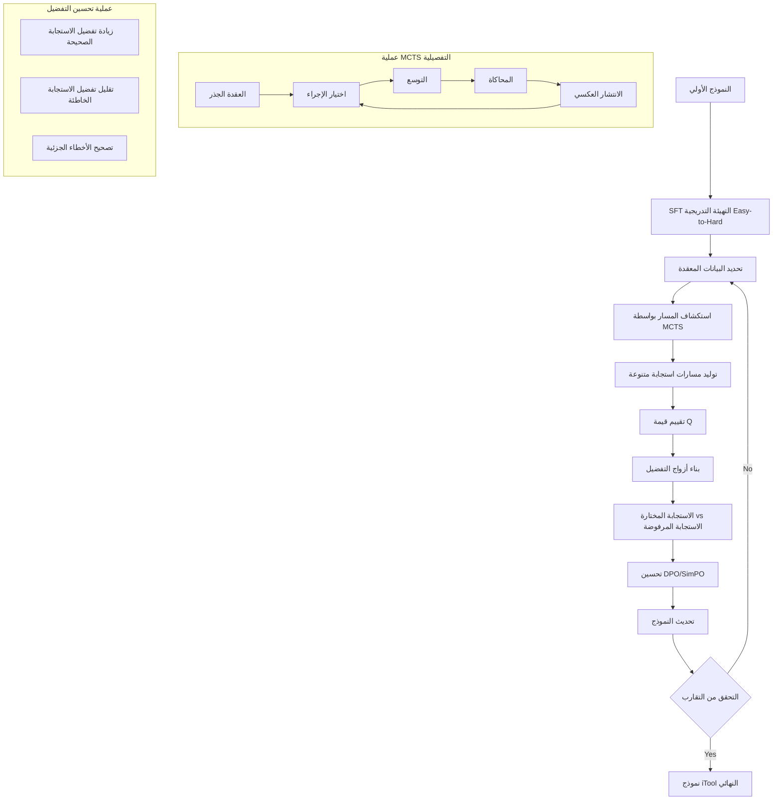

⏱️ **وقت القراءة المقدر**: 12 دقائق

## المقدمة

باتت قدرة النماذج اللغوية الكبيرة (LLMs) على استخدام الأدوات الخارجية إمكانية محورية لبناء أنظمة ذكاء اصطناعي عملية. فمن خلال استدعاء واجهات برمجة التطبيقات (APIs)، والاستعلام عن قواعد البيانات، والتفاعل مع الخدمات الخارجية، تستطيع النماذج تجاوز حدودها المعرفية الزمنية وحل المهام الواقعية التي يعجز عنها توليد النص الصرف.

اعتمد النهج السائد في تعليم استخدام الأدوات على الضبط الدقيق بالإشراف (SFT) باستخدام مجموعات بيانات مُوَلَّدة اصطناعياً. تقوم فرق البحث بجمع أو بناء أمثلة على السلوك الصحيح في استدعاء الأدوات، ثم تدرّب النماذج على محاكاة تلك الأمثلة. وعلى الرغم من النجاحات الأولية لهذا النهج، فإنه يصطدم بسقف أساسي: كلما كبرت بيانات التدريب، تضاءل التحسن الهامشي في قدرة النموذج. يصبح النموذج بارعاً في استنساخ الأنماط السطحية للبيانات الاصطناعية، بدلاً من بناء فهم راسخ وقابل للتعميم حول متى وكيف يستدعي الأدوات بصورة صحيحة.

هذه هي المشكلة التي يعالجها بحث iTool. طُوِّر هذا البحث بالتعاون بين مختبر SCIR في معهد هاربين للتكنولوجيا، وشركة هواوي للتكنولوجيا (Huawei Technologies)، ومختبر هواوي للسفينة نوح (Huawei Noah's Ark Lab). يقترح iTool إطاراً للضبط الدقيق المعزز يتجاوز التعلم بالمحاكاة. الورقة البحثية متاحة على arXiv تحت الرقم arXiv:2501.09766.

## المشكلات القائمة

### تناقص فعالية التدريب

يواجه SFT القياسي على بيانات استخدام الأدوات الاصطناعية ظاهرة التشبع. مع تنامي حجم مجموعة البيانات من عشرات الآلاف إلى مئات الآلاف من العينات، تتراجع مكاسب الأداء على مجموعات الاختبار تدريجياً. يقوم النموذج في الجوهر بحفظ توزيع التدريب بدلاً من اكتساب قدرة استدلالية حقيقية حول استخدام الأدوات.

تتجلى هذه الظاهرة بصورة أحدّ في السيناريوهات المركبة متعددة الخطوات. حين تستلزم مهمة ما تسلسل استدعاءات متعددة، أو التعامل مع معاملات غامضة، أو التعافي من أخطاء وسيطة، كثيراً ما تُخفق النماذج المدربة بـ SFT. تنتج هذه النماذج استدعاءات أدوات تبدو صحيحة شكلاً لكنها خاطئة مضموناً، لأنها تعلمت مطابقة الأنماط لا الاستدلال حول البنية الجوهرية للمهمة.

### مفهوم نقص الشظايا (Fragment Deficiency)

من أبرز الرؤى المحورية في ورقة iTool مفهوم نقص الشظايا (Fragment Deficiency). في SFT القياسي، يُدرَّب النموذج على إعادة إنتاج تسلسلات استدعاء الأدوات كاملةً وصحيحةً. غير أن النموذج الذي ينتج استدعاءً صحيحاً جزئياً، يُصيب اسم الدالة لكنه يُخطئ في قيم المعاملات، لا يحصل على أي ائتمان ولا يتلقى تغذية راجعة مُستهدَفة. تتعامل إشارة التدرج مع الاستجابة بأكملها باعتبارها خاطئة، حتى وإن أظهر النموذج كفاءة جزئية.

يُشير نقص الشظايا إلى هذه الفجوة: النموذج لديه نقاط ضعف موضعية في مكونات محددة من سلوك استدعاء الأدوات (توليد قيم المعاملات، استنتاج الأنواع، الربط الدلالي)، لكن إشارة التدريب خشنة للغاية لمعالجتها بصورة مستقلة. على مدار دورات التدريب المتعددة، تظل هذه النقاط الضعيفة الموضعية قائمة وتُقيّد سقف الأداء الكلي للنموذج.

### قيود السيناريوهات المركبة

علاوة على مشكلة نقص الشظايا، تُعاني النماذج المدربة بـ SFT من صعوبة في التعامل مع السيناريوهات التي تستلزم تأليف سلسلة متسقة من استدعاءات الأدوات. يتضمن استخدام الأدوات في العالم الواقعي كثيراً من المنطق الشرطي: استدعاء الأداة A، مراقبة النتيجة، ثم اتخاذ قرار باستدعاء الأداة B أو الأداة C. لا يستطيع التعلم بالمحاكاة الساكن تجهيز النماذج لهذا النوع من الاستدلال الديناميكي.

## منهجية iTool

يُعالج iTool هذه المشكلات عبر ثلاثة مكونات متشابكة: مرحلة إحماء SFT من السهل إلى الصعب، وآلية بحث مسار قائمة على MCTS، وحلقة ضبط دقيق معزز تكرارية مع تحسين التفضيل.

### إحماء SFT من السهل إلى الصعب

قبل الدخول إلى حلقة الضبط الدقيق المعزز، يمر النموذج بمرحلة إحماء باستخدام SFT التقليدي. والأهم أن هذا الإحماء مُنظَّم وفق منهج تدريجي من السهل إلى الصعب. تُرتَّب بيانات التدريب حسب مستوى تعقيد المهمة، ويُعرَّض النموذج أولاً لسيناريوهات الأداة الواحدة الأبسط قبل الانتقال إلى سلاسل الأدوات المتعددة الأكثر تعقيداً.

يخدم هذا التصميم المنهجي غرضين: أولاً يُرسي خطاً أساسياً كافي القوة للاستفادة من الضبط الدقيق المعزز اللاحق، وثانياً يضمن امتلاك النموذج أساساً متيناً في بناء جملة استدعاء الأدوات ودلالاتها قبل أن يُطلب منه استكشاف السيناريوهات الأصعب عبر MCTS.

### البحث عن المسار القائم على MCTS

جوهر نهج iTool هو استخدام بحث شجرة مونتي كارلو (MCTS) لتوليد مسارات استدعاء أدوات متنوعة للمهام المركبة. بالنظر إلى موجّه معقد، يستخدم النموذج MCTS لاستكشاف مسارات استجابة ممكنة متعددة. يتوافق كل عقدة في شجرة البحث مع تسلسل جزئي لاستدعاء الأدوات، وتُوسَّع الشجرة بأخذ عينات من الخطوات التالية الممكنة من التوزيع الحالي للنموذج.

تُسنَد إلى كل عقدة طرفية (تسلسل استدعاء أدوات مكتمل) قيمة Q استناداً إلى دالة مكافأة تُقيّم صحة استدعاء الأداة. هذه الدالة متعددة الأبعاد، وتلتقط دقة اسم الدالة، وصحة عدد المعاملات، ودقة أسماء المعاملات، وصحة قيم المعاملات وأنواعها. تُحسَب أيضاً درجة التشابه الدلالي لمعالجة الحالات التي ينتج فيها النموذج استجابات مكافئة دلالياً لكنها مختلفة تركيبياً.

ينتج البحث بـ MCTS مجموعة من المسارات المتنوعة لكل موجّه معقد، تتراوح بين الاستدعاءات الصحيحة عالية الجودة وأنواع مختلفة من الأخطاء. هذا التنوع هو بالضبط ما يجعل تحسين التفضيل اللاحق فعالاً.

### الضبط الدقيق المعزز التكراري

من المسارات التي يولدها MCTS، يُنشئ iTool أزواج التفضيل: استجابة مختارة (مسار ذو قيمة Q أعلى) واستجابة مرفوضة (مسار ذو قيمة Q أدنى). تُستخدم هذه الأزواج لتدريب النموذج بأساليب تحسين التفضيل، تحديداً DPO (التحسين المباشر للتفضيل) وSimPO (التحسين البسيط للتفضيل).

هذه العملية تكرارية. بعد كل جولة من تحسين التفضيل، يُستخدم النموذج المحدَّث لتوليد مسارات MCTS جديدة على المجموعة الفرعية من البيانات المركبة التي لم يتقنها النموذج بعد. تستمر الحلقة حتى التقارب، حيث يكون النموذج قد معاير بصورة منهجية على مجالات نقصه الخاصة بدلاً من التدريب بصورة موحدة على مجموعة البيانات بأكملها.

هذه المعايرة التكرارية هي الآلية التي تعالج نقص الشظايا. لأن مسارات MCTS تُظهر صراحةً الأخطاء الجزئية التي يرتكبها النموذج (قيم معاملات خاطئة، أنواع خاطئة، معاملات مفقودة)، توفر أزواج التفضيل إشارة تدرج دقيقة تستهدف تلك نقاط الضعف بالذات. يحصل النموذج على ائتمان لما يُصيبه وعلى إشارة تصحيحية لما يُخطئ فيه على مستوى المكونات.

## تصميم التجربة

### مجموعة بيانات ToolACE

تستخدم التجارب مجموعة بيانات ToolACE التي تحتوي على ما يصل إلى 100,000 عينة اصطناعية لاستخدام الأدوات، تغطي مجموعة واسعة من فئات API. تتضمن المجموعة أمثلة تتراوح بين استدعاءات الدالة الواحدة البسيطة وسلاسل الأدوات المتعددة الخطوات المركبة.

يوضح مثالان تمثيليان من مجموعة البيانات نطاق صعوبة المهام:

**Get Trending Result**: مهمة أبسط تطلب من النموذج استرجاع المحتوى الرائج من منصة محددة. يستلزم الاستدعاء الصحيح تحديد اسم الدالة وعدد محدود من المعاملات ذات الدلالة الواضحة.

**Complex Analysis Task**: مهمة أصعب تستلزم أن يجمع النموذج بين استدعاءات أدوات متعددة، ويتعامل مع نتائج وسيطة، ويطبق منطقاً شرطياً بناءً على المخرجات الملاحظة. تختبر هذه المهام قدرة النموذج على الاستدلال حول تأليف الأدوات والتعافي من الأخطاء.

### معيار BFCL

المعيار القياسي الأساسي للتقييم هو لوحة المتصدرين لاستدعاء الدوال في بيركلي (BFCL)، التي توفر مجموعة موحدة من مهام استخدام الأدوات عبر مستويات صعوبة متعددة وفئات API متنوعة. يُستخدم BFCL على نطاق واسع في مجتمع البحث لتقييم قدرة LLM على استدعاء الأدوات.

### معايير التقييم

يستخدم إطار التقييم خمسة أبعاد لتقييم جودة استدعاء الأداة:

1. **دقة اسم الدالة**: هل يختار النموذج الدالة الصحيحة للاستدعاء؟
2. **عدد المعاملات**: هل يتطابق عدد المعاملات في الاستدعاء مع العدد المتوقع؟
3. **أسماء المعاملات**: هل أسماء مفاتيح المعاملات صحيحة؟
4. **قيم المعاملات وأنواعها**: هل قيم المعاملات صحيحة ومن النوع المتوقع؟
5. **التشابه الدلالي**: مقياس أكثر مرونة يُقيّم ما إذا كانت استجابة النموذج مكافئة دلالياً للإجابة المرجعية حتى وإن اختلفت تركيبياً.

### درجات الجودة

استناداً إلى هذه الأبعاد الخمسة، تُصنَّف الاستجابات إلى أربع درجات جودة:

- **Excellent (ممتاز)**: جميع الأبعاد الخمسة صحيحة.
- **Acceptable (مقبول)**: تباينات طفيفة في بُعد أو بُعدين لا تؤثر على النتيجة الوظيفية.
- **Fair (مقبول بحدود)**: أخطاء في قيم المعاملات أو أنواعها قد تُسبب فشل استدعاء الأداة أو إنتاج نتائج غير صحيحة.
- **Poor (ضعيف)**: أخطاء جوهرية في اسم الدالة أو بنية المعاملات تجعل الاستدعاء غير صالح للاستخدام.

## النتائج التجريبية

### التحسن الكلي في الأداء

عبر المعيار الكامل BFCL، يحقق iTool تحسناً كلياً بنسبة 13.11% مقارنةً بنماذج SFT الخط الأساسي. هذا مكسب جوهري، لا سيما مع الأخذ بعين الاعتبار أن خطوط الأساس المقارنة تستخدم بيانات تدريب اصطناعية عالية الجودة.

التحسن متسق عبر مستويات صعوبة مختلفة في المعيار، لكنه أبرز في السيناريوهات المركبة متعددة الخطوات التي أخفقت فيها مناهج SFT السابقة.

### مكاسب السيناريوهات المركبة

على المجموعة الفرعية للمهام المركبة تحديداً، يحقق iTool تحسناً إضافياً بنسبة 6.5% فوق المكسب الكلي المتوسط. هذا يُؤكد أن الاستكشاف القائم على MCTS والمعايرة التكرارية للنقص هما الأكثر فعالية تحديداً في السيناريوهات التي تُقصِّر فيها SFT القياسية أكثر.

تضيق الهوة بين أداء المهام البسيطة والمركبة بصورة ملحوظة مع iTool مقارنةً بخطوط أساس SFT، مما يدل على أن النموذج طوّر استدلالاً تأليفياً أكثر رسوخاً حول استخدام الأدوات.

### نموذج 8B ينافس النماذج الأكبر

من أبرز النتائج أن نموذجاً بحجم 8 مليار معامل مدرباً بـ iTool يستطيع مضاهاة أداء نماذج أكبر بكثير مدربة بـ SFT التقليدي أو التفوق عليها. تُشير هذه النتيجة إلى أن جودة إشارة التدريب، لا كمية المعاملات، هي القيد الأساسي على قدرة استخدام الأدوات.

لهذا تداعيات عملية مهمة: المؤسسات التي لا تستطيع تحمّل تكلفة نشر النماذج الكبيرة يمكنها تحقيق أداء مماثل في استخدام الأدوات بالاستثمار في منهجية تدريب أفضل بدلاً من سعة نموذج أكبر.

### أداء مزيج SimPO

من بين أساليب تحسين التفضيل المُقيَّمة، ينتج SimPO بالتزامن مع توليد مسار iTool القائم على MCTS أفضل النتائج. تجعل بساطة SimPO واستقراره أثناء التدريب منه خياراً ملائماً لحلقة الضبط الدقيق المعزز التكرارية، حيث يتحول توزيع بيانات التفضيل مع كل جولة من تحديثات النموذج.

### دراسة الاستئصال

تُؤكد دراسة الاستئصال مساهمة كل مكون:

- إزالة إحماء SFT من السهل إلى الصعب والبدء مباشرةً بالضبط الدقيق المعزز القائم على MCTS يُدهور الأداء، مما يُظهر أن خطاً أساسياً قوياً ضروري للاستكشاف الفعال.
- إزالة MCTS واستخدام أخذ عينات عشوائي فحسب لتوليد المسار يُقلل من تنوع أزواج التفضيل وجودتها، مما يُفضي إلى مكاسب أداء أصغر.
- استخدام جولة واحدة من تحسين التفضيل بدلاً من التكرار حتى التقارب يُخفض الأداء أيضاً، مما يُؤكد قيمة حلقة المعايرة التكرارية.

## مسار عملية التعلم

يوضح المخطط التالي خط أنابيب تدريب iTool الكامل:

يبدأ خط الأنابيب بدخول النموذج الأولي في مرحلة إحماء SFT من السهل إلى الصعب. بعد هذا الإحماء، يحدد النظام نقاط البيانات المركبة ويطبق البحث عن المسار القائم على MCTS لتوليد مسارات استجابة متنوعة. تُقيَّم هذه المسارات باستخدام قيم Q، وتُنشأ أزواج التفضيل من الاستجابات المختارة والمرفوضة. ثم يُحدِّث تحسين DPO أو SimPO النموذج، وتتكرر العملية حتى التقارب.

تُظهر العملية الفرعية لـ MCTS (أسفل يسار) العمليات الأربع القياسية: اختيار الإجراء، والتوسيع، والمحاكاة، والانتشار الخلفي. تُظهر العملية الفرعية لتحسين التفضيل (أسفل يمين) أهداف المعايرة الثلاثة: زيادة التفضيل للاستجابات الصحيحة، وتخفيض التفضيل للاستجابات الخاطئة، وتصحيح نقاط الضعف الجزئية للشظايا.

## الابتكارات التقنية

### مفهوم نقص الشظايا (Fragment Deficiency)

يُعد إدخال مفهوم Fragment Deficiency إسهاماً مفاهيمياً ذا قيمة. لم تمتلك الأبحاث السابقة حول استخدام LLM للأدوات مصطلحات دقيقة لوصف الأخطاء الموضعية على مستوى المكونات التي تُحدّ من أداء النموذج. من خلال تسمية هذه الظاهرة وإضفاء الطابع الرسمي عليها، يوفر بحث iTool إطاراً أوضح لتشخيص سبب توقف SFT عند سقف الأداء وما هو نوع إشارة التدريب المطلوبة للتخطي ذلك السقف.

### مزيج MCTS والتعلم التعزيزي

تطبيق MCTS لتوليد بيانات التدريب لتحسين التفضيل هو أسلوب مستعار من أدبيات الألعاب والتخطيط، معدَّل هنا لمجال استخدام الأدوات. التكيف الأساسي هو تصميم دالة المكافأة: بدلاً من إشارة فوز/خسارة ثنائية، يستخدم iTool درجة جودة متعددة الأبعاد تتوافق مباشرةً مع تصنيف Fragment Deficiency.

تصميم دالة المكافأة هذا هو ما يجعل مسارات MCTS مفيدة للمعايرة المستهدفة. ستُنتج دالة مكافأة ثنائية أزواج تفضيل تُخبر النموذج "هذه الاستجابة أفضل من تلك" دون تحديد السبب. تُنشئ دالة المكافأة متعددة الأبعاد أزواج تفضيل تُشفِّر أي مكونات بالضبط من استدعاء الأداة كانت صحيحة أو خاطئة، مما يتيح تحديثات تدرجية أكثر دقة.

### التحسين التكراري المنهجي

البنية التكرارية لحلقة التدريب، حيث تُركز كل جولة على البيانات التي لا يزال النموذج الحالي يُخفق في التعامل معها، هي شكل من أشكال التكيف المنهجي. مع تحسّن النموذج، يتحول توزيع التدريب الفعلي نحو حالات أصعب. هذا يتجنب مشكلة إهدار موارد الحوسبة التدريبية على أمثلة أتقنها النموذج بالفعل، ويضمن أن النموذج يعمل دائماً عند حافة قدرته الحالية.

## القيود

### التكلفة الحسابية العالية لـ MCTS

MCTS مُكلف حسابياً. يستلزم كل استدعاء تشغيل مرورات أمامية كثيرة عبر النموذج لتوسيع شجرة البحث وتقييم المسارات. عند الحجم المطلوب للتدريب على 100,000 عينة، تكون التكلفة الحسابية الإجمالية أعلى بكثير من SFT القياسي. تُقرّ الورقة بهذا لكنها لا تقترح حلاً ملموساً، موضعةً إياه كعمل مستقبلي.

بالنسبة للممارسين، هذا يعني أن iTool كما هو موصوف يُناسب أكثر خطوط أنابيب التدريب غير المتصلة (offline) حيث لا تكون موازنة الحوسبة القيد الأساسي. ستستلزم إعدادات التعلم المتصل أو المستمر تقريبات بحث شجري أكثر كفاءة.

### التقييم مُركَّز على دقة استدعاء الدوال

يُقيِّم معيار BFCL استخدام الأدوات أساساً على مستوى صحة استدعاء الدالة: هل يُنتج النموذج اسم الدالة الصحيح بالمعاملات الصحيحة؟ هذا معيار محدد وقابل للقياس، لكنه لا يلتقط كل ما يهم في سيناريوهات استخدام الأدوات العملية.

في النشر الفعلي، يتضمن استخدام الأدوات وقت الاستجابة، ومعالجة الأخطاء، والتعافي من النجاح الجزئي، والتفاعل متعدد الأدوار. قد يُخفق النموذج الذي يُنتج استدعاءات أدوات صحيحة تركيبياً في الممارسة إذا كان غير قادر على التعامل مع استجابات API غير متوقعة، أو إذا لم يستطع الاستدلال حول متى يُعيد محاولة استدعاء فاشل. لا يُعالج إطار تقييم iTool هذه الأبعاد العملية.

### غياب الجوانب العملية

مرتبطاً بنقطة التقييم السابقة، تُركز الورقة على منهجية التدريب غير المتصلة وتقييم المعيار بدلاً من اعتبارات النشر العملية. أسئلة حول أداء iTool في بيئات الإنتاج، وكيفية تعامله مع الانتقال التوزيعي بين واجهات برمجة التدريب وواجهات برمجة النشر، وكيفية تكاملها مع أطر تنفيذ الأدوات الواقعية، تبقى مفتوحة.

## الاتجاهات المستقبلية

تنبثق عدة اتجاهات بحثية مستقبلية بصورة طبيعية من منهجية iTool وقيودها الحالية:

**كفاءة الحوسبة**: الحاجة الأكثر إلحاحاً هي جعل توليد المسار القائم على MCTS أكثر قابلية للتنفيذ حسابياً. يمكن لأساليب مثل تقريبات بحث الشعاع (beam search)، أو تسريع نموذج المسودة (draft-model)، أو دوال القيمة المُتعلَّمة التي تُقلل من عدد عمليات المحاكاة، أن تُخفض تكلفة التدريب بصورة ملحوظة.

**التوسع في مجالات متنوعة**: تغطي مجموعة بيانات ToolACE نطاقاً تمثيلياً لكن غير شامل من أنواع API. سيختبر توسيع إطار iTool إلى مجالات إضافية، بما في ذلك واجهات برمجة التطبيقات العلمية المتخصصة بالمجال، وخطوط أنابيب معالجة البيانات، وبيئات تنفيذ الكود، عمومية النهج وقد يكشف عن تحديات معايرة خاصة بالمجال.

**آليات السلامة والموثوقية**: مع نشر LLMs بوصول حقيقي للأدوات، تصبح عواقب استدعاءات الأدوات الخاطئة أكثر خطورة. يمكن لأبحاث مستقبلية دمج قيود السلامة في دالة المكافأة، وعقوبة استدعاءات الأدوات التي قد يكون لها آثار جانبية ضارة حتى وإن كانت صحيحة تقنياً. آليات الموثوقية، مثل تقدير الثقة لاستدعاءات الأدوات المُولَّدة والامتناع المبدئي حين تكون الثقة منخفضة، مهمة أيضاً للنشر العملي.

## الخلاصة

يُقدم iTool حلاً مبدئياً لمشكلة تناقص العوائد التي تؤثر على مناهج SFT في تعليم LLM استخدام الأدوات. من خلال إدخال مفهوم Fragment Deficiency، وتطبيق MCTS لتوليد مسارات تدريب متنوعة ومفيدة، واستخدام تحسين التفضيل في حلقة معايرة تكرارية، يحقق الإطار تحسناً كلياً بنسبة 13.11% ومكسباً إضافياً بنسبة 6.5% على السيناريوهات المركبة.

النتيجة التي تُظهر أن نموذجاً بحجم 8 مليار معامل مدرباً بـ iTool يستطيع منافسة النماذج الأكبر المدربة بـ SFT جديرة بالاهتمام بصفة خاصة. تُشير إلى أن التركيز الحالي في هذا المجال على توسيع حجم النموذج قد يكون جزئياً في غير محله: بالنسبة لقدرة استخدام الأدوات تحديداً، تهم جودة إشارة التدريب وبنيتها بالقدر ذاته على الأقل من عدد المعاملات.

القيد العملي الرئيسي هو التكلفة الحسابية لـ MCTS، التي تحصر iTool في خطوط أنابيب التدريب غير المتصلة في الوقت الحالي. معالجة هذه التكلفة هي الأولوية البحثية قصيرة الأجل الأهم إذا كانت المنهجية ستحظى باعتماد عملي واسع.

بالنسبة للفرق التي تبني أنظمة LLM تعتمد على استخدام الأدوات الخارجية، يوفر إطار iTool مساراً واضحاً ومُتحقَّقاً منه لتحسين قدرة النموذج إلى ما هو أبعد مما يستطيع SFT القياسي تحقيقه. المنهجية مستقلة عن النموذج وعن مجموعة البيانات، مما يجعلها قابلة للتطبيق عبر مجموعة واسعة من سياقات النشر.

## المراجع

- ورقة iTool: arXiv:2501.09766
- مختبر SCIR في معهد هاربين للتكنولوجيا، Huawei Technologies، Huawei Noah's Ark Lab
- معيار BFCL: Berkeley Function Calling Leaderboard
- مجموعة بيانات ToolACE: حتى 100,000 عينة اصطناعية لاستخدام الأدوات
- DPO: Direct Preference Optimization
- SimPO: Simple Preference Optimization
- MCTS: Monte Carlo Tree Search
