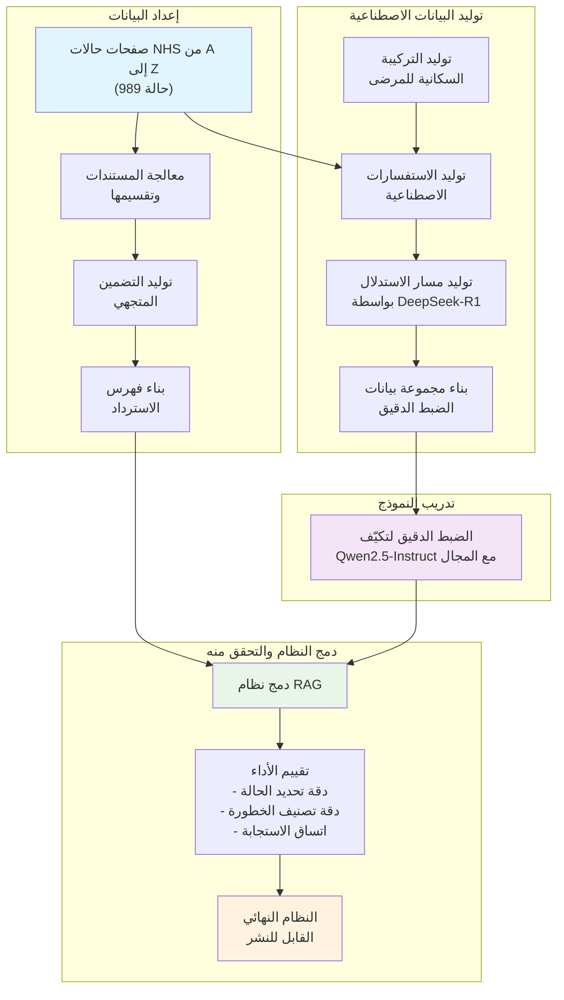

⏱️ **وقت القراءة المقدر**: 15 دقائق

## مقدمة

بينما يتقدم أداء النماذج اللغوية الكبيرة في الذكاء الاصطناعي بوتيرة مذهلة، يواجه المجال في الوقت ذاته تحديات عملية تتعلق بالخصوصية والأمان وقيود الموارد. تتنامى الحاجة إلى أنظمة ذكاء اصطناعي قابلة للنشر محليًا بأداء عالٍ دون الاعتماد على واجهات برمجية خارجية، لا سيما في القطاعات الحساسة كالرعاية الصحية والمال والحكومة.

تقدم ورقة "الاستدلال المعزز بالاسترداد مع النماذج اللغوية الخفيفة"، التي نشرها باحثون في معهد آلان تورينج مؤخرًا، نهجًا مبتكرًا يلبي هذه المتطلبات العملية. يطور البحث منهجية تجمع بفاعلية بين الاستدلال والتوليد المعزز بالاسترداد ضمن هندسة نموذج لغوي خفيف واحد، متجاوزًا قيود أنظمة RAG الحالية التي تعتمد على نماذج ضخمة وواجهات برمجية خارجية.

يتميز النظام بالتحقق منه باستخدام بيانات حقيقية خاصة بمجال معين، مستمدة من صفحات حالات NHS (هيئة الخدمات الصحية الوطنية) من A إلى Z. يمثل هذا إنجازًا بارزًا يثبت قابلية التطبيق في بيئات الرعاية الصحية الفعلية، متجاوزًا نطاق البحث الأكاديمي البحت.

## خلفية البحث والدوافع

### أهمية التوسع في وقت الاستدلال

أحد الاتجاهات الرئيسية في تحسين أداء النماذج اللغوية الأخيرة هو التوسع في وقت الاستدلال. تُحسّن هذه الاستراتيجية الأداء من خلال توظيف موارد حسابية إضافية خلال الاستدلال بدلًا من زيادة الحوسبة أثناء التدريب المسبق.

تنقسم المنهجيات الرئيسية للتوسع في وقت الاستدلال إلى فئتين: التوليد المتوازي الذي يولد فيه النموذج استجابات مرشحة متعددة ثم يستخلص الإجابة المثلى عبر آليات اختيار كالتصويت الأغلبي أو الاتساق الذاتي، والتوسع التسلسلي الذي يزيد عدد خطوات الاستدلال الوسيطة قبل الوصول إلى الإجابة النهائية.

### تقدم أنظمة RAG وقيودها

أدت أنظمة التوليد المعزز بالاسترداد (RAG) دورًا مهمًا في معالجة الهلوسة في النماذج اللغوية وتحسين دقتها. تبرز فاعلية RAG بشكل خاص في المجالات المعقدة التي تتطلب معرفة متخصصة. غير أن الأنظمة الحالية تُظهر قيودًا واضحة عند التعامل مع المعلومات الحساسة أو السرية، حيث يصعب تطبيقها في سيناريوهات لا يمكن فيها أو لا يجب مشاركة البيانات مع جهات خارجية.

### الحاجة إلى النشر المحلي

أفضت هذه القيود إلى تصاعد الحاجة لنشر النماذج اللغوية على بنية تحتية محلية، بما يشمل البيئات الآمنة أو المعزولة عن الشبكة. وعلى الرغم من نضج النماذج اللغوية مفتوحة المصدر وأطر RAG تدريجيًا، ظل دمج قدرة الاستدلال بفاعلية ضمن قيود النماذج الخفيفة تحديًا بحثيًا قائمًا.

## هندسة النظام وفلسفة التصميم

### المفهوم الأساسي للهندسة الموحدة

يرتكز النظام المقترح في هذا البحث على هندسة موحدة تجمع بفاعلية بين الاستدلال والتوليد المعزز بالاسترداد ضمن نموذج لغوي خفيف واحد. تتمثل فلسفة التصميم الجوهرية في تعظيم التآزر بين مكون الاستدلال ومكون الاسترداد.

يستهدف النظام تطبيقات تعالج استفسارات معقدة عبر قواعد معرفة خاصة بمجال محدد. ينبثق التركيز على النماذج اللغوية الخفيفة من دافع عملي: السماح للمنظمات الصغيرة أو الأقسام الحكومية بضبط دقيق للنماذج ونشرها في بيئات محدودة الموارد الحوسبية أو حرجة أمنيًا.

### تكوين المكونات الرئيسية

تتألف هندسة النظام من ثلاثة مكونات رئيسية: مسترد كثيف مسؤول عن استرداد المستندات ذات الصلة بكفاءة، ونموذج Qwen2.5-Instruct المضبوط دقيقًا بوصفه محرك الاستدلال الأساسي، ووحدة لتوليد الاستفسارات الاصطناعية ومسارات الاستدلال المشتقة من نماذج حدودية كـ DeepSeek-R1.

### خط أنابيب معالجة البيانات

يتمحور خط أنابيب معالجة بيانات النظام حول ثلاثة عناصر محورية: ضغط المستندات القائم على الملخصات، وتصميم البيانات الاصطناعية الذي يحاكي أنماط الاستفسار المتنوعة في المجالات الحقيقية، والضبط الدقيق الواعي بالاستدلال.

## بناء مجموعة البيانات والتصميم التجريبي

### استخدام صفحات حالات NHS من A إلى Z

اختار فريق البحث صفحات حالات NHS من A إلى Z لتجاربه. توفر مجموعة البيانات هذه معلومات شاملة عن 989 حالة طبية مميزة، تتضمن كل صفحة أوصافًا تفصيلية للأعراض والأسباب وطرق العلاج والوقاية. اختيرت بيانات NHS لأن مجال الرعاية الصحية يستلزم دقةً عالية وموثوقية، فضلًا عن كونه ميدانًا بالغ الأهمية لخصوصية المرضى.

### منهجية توليد الاستفسارات الاصطناعية

نظرًا لصعوبة استخدام بيانات المرضى الفعلية، طوّر فريق البحث منهجية متطورة لتوليد الاستفسارات الاصطناعية. تمر العملية بالخطوات التالية:

أولًا، **توليد التركيبة السكانية للمرضى**: إنشاء ملفات تعريف افتراضية للمرضى بخصائص ديموغرافية متنوعة تشمل العمر والجنس والتاريخ الطبي.

ثانيًا، **تطوير سيناريوهات الأعراض**: بناءً على محتوى صفحات حالات NHS، تطوير سيناريوهات تعبر بلغة طبيعية عن الأعراض التي قد يعانيها مريض مصاب بتلك الحالة فعلًا. مثال على استفسار الشقيقة:

```
"عانيت من صداع شديد على مدار اليومين الماضيين.
أشعر بإحساس بالضغط والشد حول رأسي، وأعاني من غثيان خفيف.
يتشوش بصري قليلًا حين أقف بسرعة.
لا أصاب عادةً بهذا الصداع الشديد، لذا بدأ قلقي يتصاعد."
```

ثالثًا، **تصنيف مستوى الخطورة**: تُصنَّف كل استفسار إلى أحد مستويات الخطورة الثلاثة:
- **الرعاية الذاتية**: يمكن إدارتها في المنزل أو بالدواء المتاح دون وصفة طبية
- **الرعاية الأولية العاجلة**: تستلزم استشارة طبيب عام أو مركز رعاية عاجلة في أقرب وقت ممكن
- **الطوارئ**: تستدعي العلاج في غرفة الطوارئ

### عملية توليد مسارات الاستدلال

لتعزيز قدرة الاستدلال لدى النموذج، استخدم فريق البحث نماذج حدودية كـ DeepSeek-R1 لتوليد مسارات استدلال عالية الجودة. يتضمن قالب التعليمات المستخدم في هذه العملية العناصر التالية:

```
استخدم السياق المسترد ودرجات التشابه أدناه
(الدرجات الأدنى تشير إلى تشابه أعلى مع استفسار المريض):
{context}

وصف المريض أعراضه على النحو التالي:
"{question}"

فيما يلي ملخص للمعلومات الديموغرافية للمريض:
{demographics}

باستخدام المصادر والسياق المقدمَين، أرسل الحالة ومستوى الخطورة بالصيغة "(الحالة، الخطورة)".
لا تقدم تفسيرًا لإجابتك، قدّم الإجابة النهائية فحسب.
```

### تحليل أمثلة مجموعة البيانات

يؤكد النظر في الأمثلة الفعلية المقدمة في الورقة تعقيد الاستفسارات وتنوعها التي يجب على النظام معالجتها:

**مثال 1 - حالة ألم صدر عالي الخطورة**:
```json
{
  "query": "منذ الليلة الماضية أشعر بضغط وألم شديد في صدري.
           الألم يمتد إلى ذراعي اليسرى، وأتعرق بغزارة ويصعب علي التنفس.
           هذه المرة الأولى التي أعاني فيها من هذه الأعراض.",
  "demographics": {
    "age": 58,
    "sex": "ذكر",
    "medical_history": ["ارتفاع ضغط الدم", "السكري"]
  },
  "expected_condition": "الاحتشاء القلبي",
  "expected_severity": "الطوارئ"
}
```

**مثال 2 - حالة عسر الهضم الخفيف**:
```json
{
  "query": "أشعر منذ أيام بانتفاخ بعد الوجبات وغثيان خفيف.
           شهيتي أقل من المعتاد لكن ذلك لا يتعارض كثيرًا مع حياتي اليومية.",
  "demographics": {
    "age": 32,
    "sex": "أنثى",
    "medical_history": []
  },
  "expected_condition": "عسر الهضم",
  "expected_severity": "الرعاية الذاتية"
}
```

تُظهر هذه الأمثلة أن النظام يجب أن يتجاوز المطابقة البسيطة للكلمات المفتاحية ليفهم السياقات الطبية المعقدة.

## عملية التدريب واستراتيجية الضبط الدقيق

### خط أنابيب التدريب التدريجي

تتضمن عملية تدريب النظام خط أنابيب تدريجي متعدد المراحل. في المرحلة الأولى يجري تكيّف النموذج مع مجال NHS. في المرحلة الثانية يتعلم النموذج توظيف المستندات المسترجعة بفاعلية. وفي المرحلة الثالثة يُعزَّز بمسارات استدلال عالية الجودة مولَّدة بواسطة DeepSeek-R1.

### نهج التعلم متعدد المهام

اعتمد فريق البحث نهج التعلم متعدد المهام الذي يتيح لنموذج واحد أداء عدة مهام ذات صلة في آنٍ واحد:

1. **تصنيف الحالة**: تحديد أنسب حالة من بين 989 حالة NHS بناءً على وصف المريض
2. **تقييم الخطورة**: تحديد مستوى الرعاية المناسب (الرعاية الذاتية، الرعاية الأولية العاجلة، الطوارئ)
3. **التعامل مع حالات عدم اليقين**: القدرة على الحكم بـ"غير حاسم" حين لا يمكن تشخيص واضح من المعلومات المتاحة وحدها

## منهجية التقييم والنتائج التجريبية

### إطار التقييم الشامل

بنى فريق البحث إطار تقييم شامل لتقييم أداء النظام من زوايا متعددة، يغطي بُعدَي الدقة والاتساق.

### المقارنة مع النماذج الأساسية

قورنت في التجارب نماذج أساسية متعددة:

**نماذج بلا استدلال**:
- Qwen2.5-32B-Instruct الأساسي
- GPT-4o (بلا استرداد)
- نماذج خفيفة للأغراض العامة

**نماذج استدلال للأغراض العامة**:
- DeepSeek-R1
- o3-mini
- s1.1-32B

**النظام المقترح**:
- t0-1.1-k5-32B (النموذج المطور في هذا البحث)

### مؤشرات الأداء الرئيسية

أظهرت النتائج التجريبية تحسينات أداء ملموسة على مؤشرات رئيسية متعددة.

**دقة تحديد الحالة**: حقق نموذج t0-1.1-k5-32B المضبوط دقيقًا لمجال NHS دقةً أعلى بنحو 23% مقارنةً بـ Qwen2.5-32B-Instruct الأساسي.

**دقة تصنيف الخطورة**: سجّل النظام المقترح أداءً أعلى بنحو 35% مقارنةً بنماذج الأغراض العامة، مما يدل على أن أثر التدريب الخاص بمجال الرعاية الصحية يبلغ ذروته في صنع القرار السريري.

**اتساق الاستجابة**: في التقييمات المتكررة لسيناريوهات الأعراض ذاتها، أبدى النظام المقترح اتساقًا يتجاوز 95%.

## إمكانيات التطبيق العملي

### سيناريوهات التطبيق في البيئات الصحية

يُظهر النظام المقترح إمكانات تطبيق فوري في عدة بيئات رعاية صحية حقيقية. أولًا، بوصفه **نظام دعم للرعاية الأولية** يمكن لأطباء الأسرة استخدامه أداةً مساعدة خلال التقييم الأولي للمريض. ثانيًا، بوصفه **أداة لدعم التشخيص الذاتي للمريض** تساعد عامة الناس على تحديد مستوى الخدمة الطبية المناسبة عند ظهور الأعراض. ثالثًا، بوصفه **منصة تعليمية طبية** لكليات الطب وتدريب المهنيين الصحيين.

### القابلية للتوسع إلى مجالات أخرى

المنهجية المُتبَعة في هذا النظام، التي جرى التحقق منها ببيانات NHS الطبية، قابلة للتوسع إلى مجالات متخصصة أخرى: الاستشارة القانونية، والمشورة المالية، وأنظمة الدعم التقني.

### مزايا الخصوصية والأمان

يُعدّ إمكان النشر المحلي الكامل أبرز مزايا هذا النظام. يتيح هذا الالتزامَ بلوائح حماية البيانات الصارمة كـ **GDPR** و**HIPAA**، إذ لا تُرسَل أي معلومات صحية أو شخصية حساسة إلى خوادم خارجية. كما يمكنه العمل في **بيئات معزولة عن الشبكة**، مما يتيح استخدامه الآمن في الجهات الحكومية والمنظمات الدفاعية.

## القيود واتجاهات البحث المستقبلية

### القيود الرئيسية للنظام الحالي

تشمل القيود التي يُقرّ بها فريق البحث بصراحة: **التحيز اللغوي والثقافي الأحادي** نتيجة التدريب على بيانات NHS الإنجليزية، **صعوبة التحديث الفوري** في ظل التطور المستمر للمعرفة الطبية، و**القيود في معالجة المعلومات متعددة الوسائط** مع اقتصار النظام على الأوصاف النصية.

### اتجاهات التحسين على المدى القريب

تشمل اتجاهات التحسين المطروحة: **التوسع متعدد اللغات**، و**تحسين التعامل مع الحالات النادرة** عبر التعلم بأمثلة قليلة أو التعلم الميتا، و**تحسين واجهة المستخدم** لضمان سهولة الاستخدام من قِبَل العاملين الصحيين والمستخدمين العامين.

### التحديات البحثية على المدى المتوسط والبعيد

تشمل التحديات الأبعد مدى: **دمج الذكاء الاصطناعي متعدد الوسائط** بما يتجاوز النص، و**دمج التعلم الفيدرالي** الذي يتيح لكل مؤسسة صحية تحسين الأداء الكلي دون مشاركة بياناتها خارجيًا، و**قدرة التعلم والتكيف الفوري** بناءً على تغذية راجعة الاستخدام.

## الخلاصة والإسهامات

### الإسهامات الجوهرية للبحث

يُقدم هذا البحث إسهامات مهمة في مجال الذكاء الاصطناعي. أولًا، تحقيق **دمج الاستدلال والاسترداد في نماذج خفيفة** بوصفه ابتكارًا تقنيًا. ثانيًا، إثبات قيمة عملية تتجاوز البحث الأكاديمي من خلال **التحقق في مجال حقيقي** ببيانات NHS. ثالثًا، ضمان إمكانية إعادة إنتاج البحث ونشره عبر **الإصدار مفتوح المصدر**.

### الأثر على الصناعة

في ظل تصاعد اتجاه **الذكاء الاصطناعي المحوري للخصوصية**، يُقدم هذا البحث حلًا تقنيًا يضمن أمان البيانات مع الحفاظ على الأداء العالي. يُتوقع أن يُسهم في تخفيض عوائق اعتماد الذكاء الاصطناعي في القطاعات ذات الخصوصية العالية كالرعاية الصحية والمال والقانون.

يُثبت هذا البحث أيضًا إمكانية **الذكاء الاصطناعي الاقتصادي في الموارد** الذي يوفر خدمات عالية الجودة دون الاعتماد على بنية تحتية سحابية ضخمة، مما يُفتح الباب أمام الشركات الصغيرة والمتوسطة والمنظمات محدودة الموارد للاستفادة من تقنيات الذكاء الاصطناعي المتقدمة.

## مخطط تدفق عملية التعلم

يمكن تلخيص عملية تطوير النظام الكلية المقدمة في البحث في المخطط التالي:



## قوالب التعليمات التفصيلية وأمثلة مجموعة البيانات

### قالب توليد الاستفسارات الاصطناعية

قالب التعليمات المحدد الذي استخدمه فريق البحث لتوليد الاستفسارات الاصطناعية:

```
أنشئ استفسارًا بناءً على التفاصيل التالية:

نوع الاستفسار: {query_type}
مستوى الخطورة: {severity_level}
الجنس: {sex}
محتوى صفحة الحالات: {conditions_content}

استخدم لغةً طبيعية كما يصف المريض أعراضه.
تجنب المصطلحات الطبية؛ استخدم تعابير يستخدمها غير المتخصصين.

صيغة الإخراج (JSON):
{
  "query": "اكتب وصفًا تفصيليًا للأعراض هنا.",
  "demographics": {
    "age": العمر,
    "sex": "الجنس",
    "medical_history": ["الحالات الموجودة"]
  }
}
```

### تعليمات توليد مسار الاستدلال

التعليمات المستخدمة لتوليد مسارات الاستدلال باستخدام نموذج DeepSeek-R1:

```
استخدم السياق المسترد ودرجات التشابه التالية
(الدرجات الأدنى تشير إلى تشابه أعلى مع استفسار المريض):
{context}

وصف المريض أعراضه على النحو التالي:
"{question}"

فيما يلي ملخص للمعلومات الديموغرافية للمريض:
{demographics}

باستخدام المصادر والسياق المقدمَين، أرسل الحالة ومستوى الخطورة بالصيغة
"(الحالة، الخطورة)".
لا تقدم تفسيرًا لإجابتك، قدّم الإجابة النهائية فحسب.

يجب أن تكون الحالة إحدى {sources}، أو
"غير حاسم" إن قررت أن الحالة ليست في القائمة.
يجب أن يكون مستوى الخطورة أحد ["الرعاية الذاتية"، "الرعاية الأولية العاجلة"، "الطوارئ"].
```

### تعليمات التقييم

قالب التعليمات القائم على الأداة المستخدم لتقييم النظام:

**تعليمات النظام:**
```
أنت مساعد طبي بالذكاء الاصطناعي.
ستستقبل وصف مريض لأعراضه، والسياق المسترد ذو الصلة، ودرجة تشابه كل سياق.

يجب أن تقترح الحالة الأكثر احتمالًا ومستوى الخطورة.
يجب اختيار الخطورة من الخيارات التالية:

* الطوارئ: تستدعي العلاج في غرفة الطوارئ
* الرعاية الأولية العاجلة: تستلزم استشارة طبيب عام أو مركز رعاية عاجلة في أقرب وقت
* الرعاية الذاتية: يمكن إدارتها في المنزل أو بالدواء المتاح دون وصفة طبية

استخدم الأداة المقدمة لإرسال الحالة ومستوى الخطورة.
استخدم "غير حاسم" إن قررت أن الحالة ليست في القائمة.
```

**قالب تعليمات المستخدم:**
```
استخدم السياق المسترد ودرجات التشابه التالية:
{context}

وصف المريض أعراضه على النحو التالي:
"{question}"

المعلومات الديموغرافية للمريض:
{demographics}

باستخدام المصادر والسياق المقدمَين،
أرسل الحالة ومستوى الخطورة عبر أداة "submit_condition_recommendation".

يجب أن تكون الحالة إحدى {sources} أو "غير حاسم".
يجب أن تكون الخطورة إحدى ["الرعاية الذاتية"، "الرعاية الأولية العاجلة"، "الطوارئ"].
```

### آلية ضمان جودة البيانات

نفّذ فريق البحث عمليات التحقق التالية لضمان جودة البيانات الاصطناعية:

1. **مراجعة الخبراء الطبيين**: التحقق من الاحتمالية الطبية لسيناريوهات الأعراض المولَّدة
2. **ضمان التنوع**: التأكد من التوزيع المتوازن للعمر والجنس والتاريخ الطبي
3. **التحقق من الواقعية**: التأكد من استخدام تعابير طبيعية يستخدمها المريض الفعلي
4. **اتساق الخطورة**: التأكد من الاتساق في أحكام الخطورة للحالة ذاتها

شكّلت هذه العملية المنهجية لبناء مجموعة البيانات والتحقق منها العامل الرئيسي في تحسين موثوقية النظام وعمليته بشكل ملحوظ.
