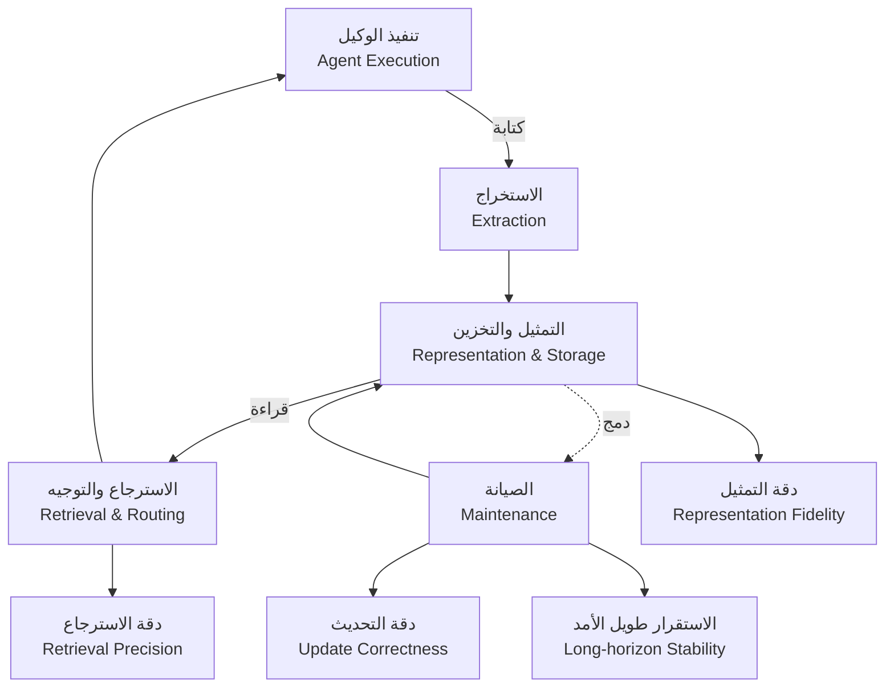

## نظرة عامة

من عمل مع وكلاء LLM لفترة كافية، يصطدم حتماً بالجدار ذاته: الوكيل يُجيب بكفاءة على الاستفسارات الفردية، لكنه حين يواجه مهام ممتدة لأيام أو سياقات تتقاطع عبر جلسات متعددة، ينسى ما فعله. من هنا ظهر مفهوم "ذاكرة الوكيل"، الذي بدأ في صورته الأولى مجرد تنويع على RAG: تخزين المحادثة في مخزن متجهي ثم استرجاعها.

غير أن ورقة arXiv المنشورة في 23 يونيو 2026 بعنوان [Are We Ready For An Agent-Native Memory System?](https://arxiv.org/abs/2606.24775) تطرح منظوراً يمكن تلخيصه في جملة واحدة: ذاكرة الوكيل لم تعد أداةً للتعزيز بالاسترجاع، بل تطورت لتصبح **نظام إدارة بيانات متكاملاً (data management system)** يتولى التخزين الدائم والاسترجاع والتحديث والدمج وإدارة دورة الحياة الديناميكية معاً. هذه الورقة هي التي لخّصها dair_ai بالقول: "ذاكرة الوكيل أصبحت الآن نظام بيانات".

أهمية هذا المنظور بالنسبة لمن يُشغّل وكلاء متعددي المستأجرين فوق Kubernetes كما تفعل ThakiCloud، أن الذاكرة تتحول من "ميزة" إلى "نظام تشغيلي"، وهذا يستتبع فوراً قرارات تتعلق بالتكلفة والمتانة والهندسة المعمارية. تستند هذه المقالة إلى الملخص الرسمي للورقة و[الكود المنشور](https://github.com/OpenDataBox/MemoryData) لاستخلاص الحجج الجوهرية وما يمكن أن تُفيد به منصتنا.

> 📄 **المراجعة المتعمقة الكاملة (DOCX)**: [نزّل المراجعة التفصيلية من Google Drive](https://drive.google.com/file/d/1wLivKobOMtAKQ1zwCmG-O8wdebyZRbcz/view).

## ما الذي تبحثه هذه الدراسة؟

إشكالية الورقة بسيطة لكنها حادة: كانت طرق تقييم ذاكرة الوكيل حتى الآن تقتصر في معظمها على **مقاييس النجاح الشامل من طرف إلى طرف (end-to-end)**. درجات مثل F1 أو BLEU تُجيب فقط على "هل أجاب الوكيل بصورة صحيحة؟"، فيما يبقى النظام الداخلي للذاكرة التي أنتجت تلك الإجابة صندوقاً أسود مغلقاً.

ينتج عن ذلك غياب الإجابات عن أسئلة جوهرية يحتاجها المشغّل: ما **التكلفة التشغيلية** للحفاظ على الذاكرة؟ ما **مقايضات البنية المعمارية** التي تترتب على طريقة تركيب الوحدات؟ وما مستوى **المتانة** حين تتبدل المعرفة باستمرار؟ لا تستطيع درجة واحدة الإجابة عن أي من هذه التساؤلات.

لذلك أجرى المؤلفون، وهم Wei Zhou وXuanhe Zhou وGuoliang Li وZhiyu Li وFeiyu Xiong وآخرون، ولافتٌ أن في صفوفهم باحثين متخصصين في أنظمة قواعد البيانات مما يشكّل هوية الورقة، تجارب منهجية على الذاكرة **من منظور إدارة البيانات**. ويتجسد هذا في إطار تحليلي يُفكّك ذاكرة الوكيل إلى أربع وحدات جوهرية.

*البنية المعمارية للوحدات الأربع لنظام الذاكرة الأصيل للوكيل وتدفقات بياناتها. انقر المخطط لتكبيره.*

الوحدات الأربع هي:

1. **التمثيل والتخزين (Representation & Storage)**: بأي شكل تُحفظ الذكريات وأين تُخزّن؟ طريقة التمثيل، متجهات أو رسوم بيانية أو أشجار أو نص عادي، تُحدد مباشرةً **دقة التمثيل (representation fidelity)**.
2. **الاستخراج (Extraction)**: مرحلة انتقاء ما يستحق التذكر خلال تنفيذ الوكيل. لا يمكن تخزين كل الرموز، فهنا يُفرز الإشارة من الضجيج.
3. **الاسترجاع والتوجيه (Retrieval & Routing)**: مرحلة الوصول إلى الذكرى الصحيحة في اللحظة المناسبة وإعادتها عبر المسار الملائم. يتجلى هنا مقياس **دقة الاسترجاع (retrieval precision)**.
4. **الصيانة (Maintenance)**: مرحلة دمج الذكريات القديمة وتحديثها وتنظيفها. هنا تُحدَّد **دقة التحديث (update correctness)** و**الاستقرار طويل الأمد (long-horizon stability)**.

من يعرف قواعد البيانات لن يجد هذا الإطار غريباً: التمثيل والتخزين يوازيان محرك التخزين، والاستخراج يوازي خط أنابيب الاستيعاب، والاسترجاع والتوجيه يوازيان مخطط الاستعلام، والصيانة توازي الضغط وجمع البيانات المهملة. في هذا التوازي تكمن الدلالة التي تُسمّيها الورقة "منظور إدارة البيانات".

## الاكتشافات الجوهرية

تُقيّم الورقة على هذا الإطار **12 نظام ذاكرة تمثيلياً و2 خطوط أساسية مرجعية** عبر **5 أعباء عمل معيارية و11 مجموعة بيانات**. قياس أنظمة متعددة بمقياس موحّد، لا نموذج واحد ولا مجموعة بيانات واحدة، هو ما يمنح هذه الدراسة ثقلها. ثمة ثلاثة استنتاجات يمكن استخلاصها مباشرةً من الملخص.

**أولاً، لا توجد بنية واحدة تُهيمن على جميع الحالات.** الإجابة عن سؤال "أيّ بنية ذاكرة هي الأفضل؟" هي "يتوقف الأمر". والأدق: تكمن الفاعلية في مدى توافق بنية الذاكرة مع **عنق الزجاجة في عبء العمل (workload bottleneck)**. البنية المثلى لعبء عمل يُشكّل فيه الاسترجاع عنق الزجاجة تختلف عنها في عبء عمل تكون فيه عمليات التحديث هي العائق. هذا يدحض مباشرةً الوصفات المبسّطة من قبيل "ذاكرة الرسم البياني هي الأفضل دائماً" أو "يكفي مخزن المتجهات".

**ثانياً، تفكيك الوحدات يكشف مواطن المسؤولية بدقة.** يُكمّي المؤلفون عبر تجارب استئصال (ablation) دقيقة الأثرَ المنفرد لكل وحدة على دقة التمثيل ودقة الاسترجاع ودقة التحديث والاستقرار طويل الأمد. ما كان مختبئاً في درجة شاملة واحدة، "أيّ الوحدات تُفسد ماذا"، يصبح ظاهراً للعيان. من منظور التشغيل، هذه هي القيمة الحقيقية: حين تُعطي الذاكرة إجابة خاطئة، يجب أن نتمكن من تحديد ما إذا كانت المشكلة في الاستخراج أم في الاسترجاع حتى يمكن الإصلاح.

**ثالثاً، تُبرز الصيانة مقايضات واضحة بين التكلفة والأداء.** في أعباء العمل الواقعية، تُظهر النتائج أن **الصيانة المحلية (localized maintenance) أكثر كفاءةً من الإعادة الشاملة للتنظيم (global reorganization)**. معالجة الأجزاء المتغيرة فقط أقل تكلفةً من إعادة بناء الذاكرة بأكملها دورياً، وهي الحدسية ذاتها التي تجعل الضغط التدريجي في قواعد البيانات أرخص من إعادة البناء الكاملة. في الخدمات الحساسة للتكلفة، يمكن لهذا السطر الواحد أن يُغيّر قرارات التصميم.

خلاصة القول: لا تقدّم هذه الورقة وصفةً لـ"كيفية بناء ذاكرة وكيل أفضل"، بل تضع **إطاراً لقياس ذاكرة الوكيل ومقارنتها بوصفها نظاماً**. وعلى هذا الإطار تُثبت غياب الحل الواحد الأمثل، وتكشف أن توافق عبء العمل وتكاليف الصيانة هما الرافعتان الحقيقيتان.

## الدلالات والتطبيقات على منصة ThakiCloud K8s AI/ML SaaS

تُشغّل منصة ThakiCloud للذكاء الاصطناعي وكلاء متعددي المستأجرين فوق Kubernetes، وثمة نقاط اتصال مباشرة بين منظور هذه الورقة وواقع منصتنا.

**اعتبار الذاكرة نظام بيانات يُدار لكل مستأجر.** إذا كانت ذاكرة الوكيل نظام إدارة بيانات، فهذا يعني أن لكل مستأجر تكاليف تخزين ومواعيد استجابة وأحمال تحديث مستقلة تستوجب الإدارة. في بيئة متعددة المستأجرين، ضمان ألا تمتص صيانة ذاكرة مستأجر واحد موارد GPU أو I/O مستأجرين آخرين هو مشكلة من الطراز ذاته الذي نُعالجه بـKueue حين نُجدوّل أحمال GPU ونعزلها. الذاكرة أيضاً ينبغي أن تُعامَل بوصفها "عبء عمل له ميزانية موارد" لا "ميزة".

**تصميم لا يفرض بنية ذاكرة واحدة.** خلاصة "لا توجد بنية واحدة تُهيمن على جميع الحالات" تعني أن المنصة ينبغي ألا تُثبّت واجهة خلفية واحدة للذاكرة، بل توفر **تجريداً يتيح استبدال بنية الذاكرة وإعادة تكوينها بحسب عبء العمل**. حسب ما إذا كان وكيل العميل يتعامل مع محادثات طويلة الأمد أو تحديثات معرفية متكررة، يجب إمكانية التبديل بين بنية تُركّز على الاسترجاع وأخرى تُركّز على الصيانة. التفكيك إلى أربع وحدات يُشكّل حدود التجريد القابلة للاستبدال بصورة طبيعية.

**أصول من منظور التشغيل المحلي وكفاءة التكلفة.** نتيجة أن الصيانة المحلية أرخص من إعادة التنظيم الشاملة بالغة الأهمية خاصةً للعملاء الذين يستضيفون بنيتهم محلياً. إنها توفر مبدأ تصميم يُمكّنهم من التحكم في تكاليف صيانة الذاكرة ضمن ميزانية GPU وتخزين محدودة دون التبعية لخدمات الذاكرة الخارجية المُدارة. في بيئات العملاء التي تحول فيها متطلبات السيادة الرقمية أو أمن البيانات دون استخدام واجهات API خارجية، تُصبح القدرة على "التنبؤ بتكاليف الذاكرة والتحكم فيها داخل المجموعة الخاصة" ميزةً تنافسية قائمة بذاتها.

ثمة خطوتان عمليتان يمكننا اتخاذهما الآن: الأولى اتخاذ تفكيك الوحدات الأربع وتصنيف أعباء العمل من [كود MemoryData](https://github.com/OpenDataBox/MemoryData) نقطةَ انطلاق لقياس ذاكرة المستأجرين بمقاييس لكل وحدة (دقة التمثيل / دقة الاسترجاع / دقة التحديث / الاستقرار طويل الأمد) بدلاً من درجة شاملة واحدة. الثانية تصميم سياسة الصيانة بحيث تُعطى الأولوية للتحديث المحلي على إعادة التنظيم الشاملة، مما يُرسّخ سقفاً للتكلفة في مرحلة التصميم ذاتها.

## القيود والانتقادات

للموضوعية، ثمة نقاط ينبغي مراعاتها قبل تبنّي هذا البحث على علّاته.

أولاً، **هذه ورقة قياسية وليست اقتراحاً لنظام ذاكرة جديد.** من يتوقع خارطة طريق لـ"كيفية بناء ذاكرة أفضل" قد يخيب ظنه؛ ما يُقدَّم هو إطار مقارنة وتشخيص، وتُشار إلى "اتجاهات واعدة نحو ذاكرة أصيلة للوكيل" لكن التنفيذ يبقى مهمةً لأبحاث لاحقة.

ثانياً، **محدودية التعميم في المعيار.** 5 أعباء عمل و11 مجموعة بيانات ليست قليلة، لكن النطاق الذي يواجهه الوكيل فعلياً أوسع بكثير. خلاصة "يتفاوت الأمثل بحسب عنق الزجاجة في عبء العمل" تعني ضمنياً أنه إذا اختلف توزيع أعباء عمل عملائنا الفعلية عن توزيع هذا المعيار، فلن تنتقل التصنيفات الواردة في الورقة مباشرةً إلى سياقنا. القياس في كل بيئة نشر على حدة يبقى ضرورياً.

ثالثاً، **التحيز المحتمل الناجم عن تركيبة المؤلفين.** ميل المؤلفين نحو أنظمة قواعد البيانات يُقوّي إطار "رؤية الذاكرة كإدارة بيانات"، لكنه قد يُضعف الإضاءة على المنظورات الأخرى كالذاكرة الإبيسودية أو إدارة الذاكرة القائمة على تعلم السياسات. إدارة البيانات عدسة قوية، لكنها ليست العدسة الوحيدة.

بالرغم من ذلك، رسالة الورقة الجوهرية، "اقيس ذاكرة الوكيل بوصفها نظاماً"، لا يسهل دحضها بالنسبة لمنصة كمنصتنا تضطر فعلاً إلى تشغيل هذه الذاكرة. حين تبدأ برؤية الذاكرة بمنظور الوحدات والتكاليف لا الدرجات، يصبح ما يمكن إصلاحه مرئياً للمرة الأولى.

## المصادر

- الورقة: [Are We Ready For An Agent-Native Memory System? (arXiv 2606.24775)](https://arxiv.org/abs/2606.24775)
- HF Papers: [hf.co/papers/2606.24775](https://hf.co/papers/2606.24775)
- الكود المنشور: [github.com/OpenDataBox/MemoryData](https://github.com/OpenDataBox/MemoryData)
- السياق الأصلي: dair_ai، "Agent memory is a data system now"

> 📄 **المراجعة المتعمقة الكاملة (DOCX)**: [نزّل المراجعة التفصيلية من Google Drive](https://drive.google.com/file/d/1wLivKobOMtAKQ1zwCmG-O8wdebyZRbcz/view).
