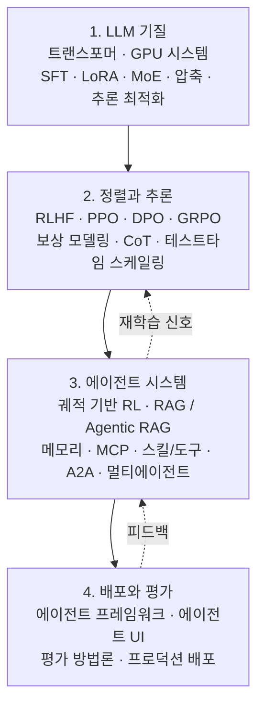

## نظرة عامة

يصطدم كل من يدرس الذكاء الاصطناعي الوكيل بحقيقة مبكرة: المادة العلمية مبعثرة. بنية المحول في مكان، ومحاذاة التعلم المعزز في مكان آخر، والتعاون بين الوكلاء وبروتوكول MCP في مدونة ثالثة. كل قطعة متماسكة بذاتها، لكن الموارد التي تُري كيف تتصل هذه القطع في نظام واحد نادرة.

[The Hitchhiker's Guide to Agentic AI: From Foundations to Systems](https://arxiv.org/abs/2606.24937) المنشور على arXiv في يونيو 2026 يملأ هذه الفجوة تحديدًا. ليس استعراضًا موجزًا، بل مرجعًا عمليًا يتتبع المسار كاملًا: من طبيعة نموذج اللغة الكبير، عبر المحاذاة والاستدلال، إلى بناء أنظمة وكلاء ونشرها في بيئة الإنتاج. كل فصل يجمع الأسس النظرية مع إرشادات التنفيذ وأمثلة الكود وإحالات المصادر الأولية.

بالنسبة لمنصة مثل ThakiCloud تعتبر الوكلاء موارد من الدرجة الأولى، لا يبدو هذا الدليل غريبًا. المهارات والأدوات والذاكرة وتنسيق الوكلاء المتعددين -- هذه المواضيع التي تشغل النصف الثاني من الوثيقة -- هي بالضبط ما نعمل عليه يوميًا داخل Paxis، السحابة الأصيلة للوكلاء. هذه المقالة ترسم الدليل عبر أربع طبقات وتستخلص ما يمكن أخذه لمنتجاتنا.

## ما هذا الدليل

يفترض الدليل أن قارئه ممارس يريد بناء وكلاء. لا يكتفي بسرد المفاهيم؛ يسير مع الكدسة كاملة من المبادئ الأولى حتى النشر في الإنتاج. محور التركيز هو العلاقات التبعية بين الطبقات. الوكلاء الجيدون لا يظهرون من العدم. لا بد أولًا من نموذج مُدرَّب جيدًا، ثم تُضاف قدرات المحاذاة والاستدلال فوقه، وعندها فقط تتراكم استخدام الأدوات والذاكرة والتعاون لتكوّن نظامًا.

نطاق الدليل، مضغوطًا في أربع طبقات:

نتناول كل طبقة بالترتيب فيما يلي.

## الأساس: طبيعة نموذج اللغة الكبير

ينطلق الدليل من بنية المحول وأنظمة GPU، ثم ينتقل إلى التدريب والضبط الدقيق: الضبط الدقيق الخاضع للإشراف (SFT)، والتقنيات الموفرة للمعاملات مثل LoRA، وبنيات مزج الخبراء (MoE). ويختتم بضغط النماذج وتحسين الاستنتاج.

في هذا الترتيب معنى. جودة سلوك الوكيل مرتبطة في نهاية المطاف بقدرات النموذج الأساسي، وتكلفة تشغيل ذلك النموذج فعليًا تتحدد بالضغط وتحسين الاستنتاج. إذا لم تنخفض تكاليف الاستنتاج، ينهار الجدوى الاقتصادية في اللحظة التي يبدأ فيها الوكيل باستدعاء الأدوات مرات عدة وسلوك مسارات طويلة. كفاءة الطبقة الأدنى هي ما يحدد إمكانية تحقق الطبقة الأعلى.

## طبقة المحاذاة والاستدلال

تتناول الطبقة الثانية المحاذاة والاستدلال. تبدأ بالتعلم المعزز من ردود الفعل البشرية (RLHF)، وتمر بـ PPO وDPO وتوابعها، وGRPO مع نمذجة المكافآت. ثم تنتقل إلى التعلم المعزز لنماذج الاستدلال الكبيرة، متناولة سلسلة الأفكار والتوسع في وقت الاختبار.

تحدث هنا نقلة نوعية مهمة. ينتقل مركز الثقل من مجرد إنتاج إجابات يفضلها البشر، إلى قدرة الاستدلال -- القدرة على التفكير لفترة أطول والوصول إلى إجابات أفضل باستقلالية. للوكيل الذي يخطط عبر خطوات متعددة ويتحقق من النتائج الوسيطة، هذه الطبقة يجب أن تكون راسخة. إذا كانت المحاذاة تتكفل بالسلامة، فإن الاستدلال يتكفل بالاستقلالية.

## أنظمة الوكلاء: MCP والمهارات والذاكرة ومتعدد الوكلاء

النصف الثاني من الدليل مكرس بأكمله لهذه الطبقة، وهو ما يدل على أين يقع ثقل الذكاء الاصطناعي الوكيل فعليًا. المواضيع المطروحة أسماء نتعامل معها يوميًا.

- **التعلم المعزز القائم على المسارات**: إشارة التعلم هي مسار العمل الكامل -- تسلسل من استدعاءات الأدوات والملاحظات -- لا استجابة واحدة.
- **RAG وAgentic RAG**: الجيل المعزز بالاسترجاع يُرفع من خط أنابيب ثابت إلى شكل يقرر فيه الوكيل بفاعلية استراتيجية استرجاعه.
- **أنظمة الذاكرة**: هياكل لتراكم المعرفة واسترجاعها عبر الجلسات.
- **MCP (بروتوكول سياق النموذج)**: القناة الموحدة التي يتصل من خلالها الوكيل بالأدوات والبيانات الخارجية.
- **مهارات الوكلاء واستخدام الأدوات**: قدرات مُعبَّأة كوحدات قابلة لإعادة الاستخدام يمكن اختيارها وتنفيذها.
- **بروتوكولات A2A (وكيل إلى وكيل) وبنيات متعدد الوكلاء**: الوكلاء يتفويض ويُنسق العمل فيما بينها.

هذه القائمة هي في الواقع مواصفات مكونات منصة أصيلة للوكلاء. كيف تختار المهارات؟ كيف تستدعي الأدوات بأمان؟ كيف تُوجه الذاكرة؟ كيف تُركب عمل وكلاء متعددين في رسم بياني موجه لا دوري؟ يعالج الدليل هذه الأسئلة بوصفها مسألة تصميم نظام موحدة، لا مجموعة تقنيات متفرقة.

## النشر والتقييم

تغطي الطبقة الأخيرة العمليات الفعلية: أطر تطوير الوكلاء، وتصميم واجهة مستخدم الوكلاء، ومنهجية التقييم المناسبة للمهام الوكيلية، والنشر في الإنتاج.

اللافت أن التقييم حصل على طبقة مستقلة. المقاييس المبنية لقياس دقة استجابة واحدة لا تستطيع قياس وكيل يستدعي الأدوات مرارًا ويسلك خطوات متعددة. يجب النظر في معدل نجاح المسار والسلامة في الخطوات الوسيطة والفعالية من حيث التكلفة معًا. جعل التقييم موضوعًا مستقلًا لا ذيلًا للتنفيذ يعكس مدى صعوبة الإجابة على "كيف نعرف أن هذا يعمل؟" لأنظمة الوكلاء.

## التداعيات على منتجات ThakiCloud

النصف الثاني من هذا الدليل يتداخل كثيرًا مع تصميم **Paxis** من ThakiCloud. Paxis هي مستوى تحكم السحابة الأصيلة للوكلاء الذي يعمل فوق ai-platform، معاملًا المهارات والأدوات والسياسات وسجلات التدقيق كموارد من الدرجة الأولى. مقابلة مكونات الدليل بطبقاتنا:

- **مهارات الوكلاء واستخدام الأدوات -- Skill Harness**: يختار Paxis من أكثر من 960 مهارة باستخدام BM25 وينفذها في بيئات معزولة. هذا هو مبدأ "عبئ القدرات كوحدات قابلة لإعادة الاستخدام" الذي يؤكد عليه الدليل على نطاق إنتاجي.
- **MCP -- موصل MCP**: يتصل Paxis بالأدوات والبيانات الخارجية عبر موصلات MCP مع إعادة اتصال OAuth تلقائية. القناة الموحدة في الدليل تصبح في المنتج بنية تحتية تتعافى من الأعطال بنفسها.
- **أنظمة الذاكرة -- محرك معرفة HKE**: المعرفة المتراكمة والمسترجعة عبر الجلسات تُعالج من خلال محرك معرفة قائم على الويكي.
- **متعدد الوكلاء وA2A -- متعدد الوكلاء DAG**: تُركب المهام في رسوم بيانية DAG للتفويض والتنسيق، مع NL Cron للجدولة الزمنية.
- **النشر والتقييم والسلامة -- بوابة السياسات + سجل التدقيق + المهارات المتطورة ذاتيًا**: تمر كل إجراءات الوكيل عبر بوابة سياسة وسجل تدقيق. الأنماط المتكررة تُستوعب في مهارات تتطور ذاتيًا. هذا يعالج بالضبط نفس الهاجس الذي دفع الدليل لجعل التقييم طبقة مستقلة.

طبقة الأساس تحمل دلالات أيضًا. تحسين الاستنتاج والضغط المُغطَّيان في الطبقة الأولى من الدليل يقابلان مباشرة عمل **ai-platform**. توفر منصة ThakiCloud ai-platform البنية التحتية للاستنتاج -- Kubernetes مع جدولة GPU المستندة إلى Kueue، وخدمة vLLM، والعزل متعدد المستأجرين -- التي تحافظ على الجدوى الاقتصادية حتى حين يُجري وكيل ما استدعاءات أدوات متعددة. انخفاض تكلفة الخدمة (ai-platform) يخلق الجدوى الاقتصادية للوكيل (Paxis). الطبقة الأدنى والطبقة الأعلى في الدليل تتصلان في خط واحد داخل منتجنا.

## حدود وتحفظات

قبول هذه الوثيقة كمرجع نهائي أمر ينبغي تجنبه. أولًا، الميدان سريع التغير. معايير الذكاء الاصطناعي الوكيل تتبدل شهريًا. تفاصيل تنفيذ MCP وA2A الدقيقة اليوم قد تبدو مختلفة بعد ستة أشهر، وأمثلة الكود في الدليل مرتبطة بإصدارات محددة. كخريطة مفاهيمية يحتفظ بقيمته طويلًا؛ أما تفاصيل التنفيذ فلا بد دائمًا من التحقق منها بالرجوع إلى المصادر الأولية.

ثانيًا، تغطية كل شيء تعني حتمًا عدم الغوص في أي شيء حتى أعماقه. ضم كل طبقة في وثيقة واحدة يكسب الاتساع لكنه يُضحي بالعمق. رفع أي تقنية بعينها إلى مستوى الإنتاج لا يزال يستلزم أدبيات متخصصة وتجارب عملية. القيمة الحقيقية للدليل ليست الإجابات التي يقدمها، بل الخريطة التي يرسمها -- كيف تجد كل قطعة مبعثرة مكانها داخل نظام موحد. قراءة الخريطة والقيادة الفعلية عملان مختلفان.

## المصادر

- [The Hitchhiker's Guide to Agentic AI: From Foundations to Systems (arXiv:2606.24937)](https://arxiv.org/abs/2606.24937)
- [صفحة alphaXiv](https://www.alphaxiv.org/abs/2606.24937)
