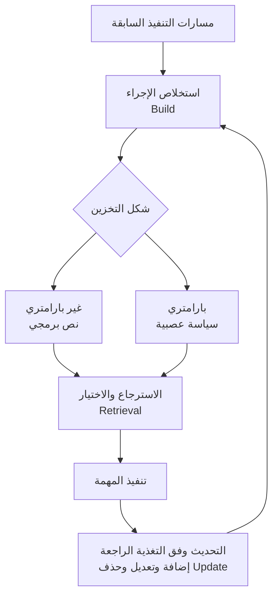

## نظرة عامة

من يُشغّل عملاء LLM لفترات طويلة يصطدم بالعقبة نفسها مراراً. يعيد الوكيل الاستدلال من الصفر في كل مرة، ويتلمس طريقه من جديد عبر إجراء سبق أن حلّه في الأسبوع الماضي. الحل الشائع هو دفع المهارات المستخدمة بكثرة كاملةً داخل المطالبة. غير أن هذا الأسلوب هشّ لسببين. أولاً، كلما زاد عدد المهارات ازداد استهلاك نافذة السياق، فتقلّ المساحة المتبقية للمهمة نفسها. ثانياً، تنكسر قوالب المطالبات بسهولة عند أي تغيّر طفيف في الظرف.

تعيد أبحاث ذاكرة الوكلاء الحديثة النظر في هذه المشكلة من زاوية **الذاكرة الإجرائية (procedural memory)**. فكما تحمل الذاكرة الإجرائية عند الإنسان حركات ماهرة تُنفَّذ دون وعي، مثل ركوب الدراجة، تختزل الذاكرة الإجرائية لدى الوكيل إجراءات تنفيذ المهام المتكررة في صورة قابلة لإعادة الاستخدام. جوهر هذا التوجه هو نقل المعرفة الإجرائية إلى **ما وراء استرجاع المطالبات**، أي إلى بنية منفصلة للتخزين والاسترجاع والتحديث، بل والانتقال إلى سياسات عصبية داخل بارامترات النموذج نفسه.

تستعرض هذه المقالة خريطة هذا التحول بالاعتماد على أبحاث موثّقة، وتُختتم بربط هذا التوجه البحثي بأسلوب Paxis، السحابة الأصيلة للوكلاء (Agent-Native Cloud) التابعة لـThakiCloud، التي تتعامل مع المهارات بوصفها موارد من الدرجة الأولى وتُجسّد بذلك هذا التوجه البحثي عملياً.

## ما هي الذاكرة الإجرائية

من منظور معرفي، تُقسَّم الذاكرة عادة إلى ثلاثة أنواع: الذاكرة الدلالية (semantic) التي تحفظ الحقائق، والذاكرة العرضية (episodic) التي تحفظ الأحداث، والذاكرة الإجرائية (procedural) التي تحفظ الطرق. وفي أدبيات الوكلاء، تتولى الذاكرة الإجرائية مسؤولية الإجابة عن سؤال "كيف يُنفَّذ الأمر"، إذ تُجرّد تسلسلات الحركة المعقّدة إلى أنماط قابلة لإعادة الاستخدام، بما يتيح التنفيذ دون تخطيط من الصفر في كل مرة.

المشكلة أن هذه المعرفة الإجرائية توجد حالياً، في معظم الوكلاء، في واحد من ثلاثة أشكال: إما مكتوبة يدوياً، أو محشورة في قوالب مطالبات هشّة، أو متشابكة ضمنياً في بارامترات النموذج بتكلفة تحديث باهظة. وما تستهدفه الأبحاث هو رفع هذه المعرفة إلى مرتبة **كائن من الدرجة الأولى قابل للتعلّم والتحديث**.

## ما وراء استرجاع المطالبات: فصل التخزين والاسترجاع والتحديث

أبرز الأبحاث التي تناولت هذا التوجه بشكل مباشر هي **Memp: Exploring Agent Procedural Memory** (arXiv 2508.06433). يضع Memp الذاكرة الإجرائية كهدف تحسين من الدرجة الأولى، ويقطّر المسارات السابقة إلى طبقتين: تعليمات دقيقة خطوة بخطوة من جهة، وإجراءات عالية المستوى أشبه بنص برمجي من جهة أخرى. كما يفصل حلقة الذاكرة إلى ثلاث مراحل هي **البناء (build) والاسترجاع (retrieval) والتحديث (update)**. وفي مرحلة التحديث، تُضاف العناصر أو تُعدَّل أو تُحذف وفق التغذية الراجعة من التنفيذ.

تكمن أهمية هذا الفصل في كونه مختلفاً جذرياً عن أسلوب حشو المهارات داخل المطالبة. ففي أسلوب المطالبة، يندمج التخزين والاسترجاع في خطوة واحدة، ويكاد مفهوم التحديث ينعدم. أما فصل المراحل الثلاث فيجعل من توقيت إدراج الإجراء أو إزالته، وما ينبغي تصحيحه من الإخفاقات، هدفاً تصميمياً صريحاً. وتشير المصادر إلى أن الاتجاه العام لهذا التوجه يمكن تلخيصه بالانتقال **من قوالب صريحة غير بارامترية إلى سياسات عصبية بارامترية ضمنية** (مسح الذاكرة في Foundation Agents، arXiv 2602.06052). أي أن التوجه يتجاوز مرحلة تخزين الإجراء نصياً واسترجاعه، نحو صهر الخبرة داخل سياسة النموذج نفسها.

## لماذا يهم هذا الآن: صعوبة التقييم

لم يُفهم بعد بشكل كافٍ ما إذا كانت الذاكرة الإجرائية تُنتج فعلاً مهارات صالحة للاستخدام. والبحث الذي يستهدف هذه الفجوة هو **Managing Procedural Memory in LLM Agents** (arXiv 2606.23127)، الذي يقترح معياراً بعنوان **AFTER**. يتألف هذا المعيار من 382 مهمة مؤسسية واقعية موزعة على 6 أدوار وظيفية، و22 مهارة إجرائية، ويقيس مدى قابلية انتقال المهارات عبر المهام والأدوار وبنية النماذج الأساسية.

السؤال الذي يطرحه هذا المعيار هو الجوهر: هل يصلح الإجراء المتعلَّم في موقف معيّن لموقف آخر؟ وهل تبقى المهارة صالحة عند تغيير النموذج؟ فبمجرد تبنّي الذاكرة الإجرائية، نحتاج إلى وسيلة لقياس "هل هذه المهارة قابلة لإعادة الاستخدام فعلاً"، لأن المهارة التي لا تنتقل، حتى لو امتلكت بنية تخزين واسترجاع وتحديث كاملة، لا تختلف في النهاية عن قالب مطالبة باهظ التكلفة.

## دلالات التطبيق على منتجات ThakiCloud

يتخذ هذا التوجه البحثي شكله العملي بالكامل في **Paxis** التابعة لـThakiCloud. Paxis سحابة أصيلة للوكلاء (Agent-Native Cloud) تتعامل مع **المهارات والأدوات والسياسات وسجلات التدقيق** بوصفها موارد من الدرجة الأولى. وهنا تُعد بيئة المهارات (Skill Harness) بمثابة الذاكرة الإجرائية الإنتاجية فعلياً.

- **المقابل العملي للبناء والاسترجاع والتحديث**: تختار بيئة مهارات Paxis أكثر من 960 مهارة عبر BM25 (الاسترجاع)، وتنفّذها ضمن صناديق رمل معزولة، وتحسّنها عبر حلقة تطوّر ذاتي (التحديث). وبذلك يتجسّد فصل المراحل الثلاث الذي طرحه Memp في صورة نظام تشغيلي فعلي.
- **بنية تتجاوز استرجاع المطالبات**: بدلاً من حشو المهارات في المطالبة في كل مرة، يجري استدعاء مهارات موثّقة انتقائياً، مما يوفّر ميزانية السياق ويحافظ على اتساق الإجراء. وهذا يتطابق تماماً مع التوجه الذي تناولته هذه المقالة تحت عنوان "ما وراء استرجاع المطالبات".
- **التقييم والتدقيق**: تدير Paxis مفهوم "القابلية للانتقال" الذي شدّد عليه معيار AFTER من خلال بوابات السياسات وسجلات التدقيق. وبما أن كل مهارة تُتتبَّع من حيث توقيت اختيارها وما نفّذته، يبقى أساس بيانات واضح للتمييز بين الإجراءات القابلة لإعادة الاستخدام وتلك غير القابلة لذلك.

من منظور البنية التحتية، فإن ai-platform هي التي تسند تنفيذ هذه المهارات. ولأن الوكيل ينفّذ المهارات فوق جدولة GPU عبر Kueue وخدمة متعددة المستأجرين، فإن تكلفة تنفيذ الذاكرة الإجرائية تتحول مباشرة إلى مسألة كفاءة في الخدمة. وبذلك يشكّل تقديم الخدمة منخفض التكلفة (ai-platform) الركيزة التي تسند جدوى الوكلاء الاقتصادية (Paxis).

## القيود والاعتراضات

لنقل الذاكرة الإجرائية إلى سياسات عصبية بارامترية ثمن واضح. فالنصوص البرمجية يمكن للبشر قراءتها وتعديلها، أما الإجراءات المنصهرة داخل البارامترات فيصعب تدقيقها وتحديثها. إذ يصعب معرفة ما المخزَّن فعلياً، كما يصعب انتقاء الإجراءات الخاطئة وحذفها. وفي البيئات التي تكون فيها قابلية التفسير أمراً جوهرياً، مثل البيئات الخاضعة للتنظيم أو ذات السيادة الرقمية، يتحول هذا الغموض مباشرة إلى مخاطرة.

كذلك ليس أسلوب الاسترجاع غير البارامتري حلاً شاملاً. فقد يستدعي الاسترجاع إجراءات خاطئة، وقد تتدهور جودة الاختيار كلما اتسع المستودع. وكما تُظهر معايير مثل AFTER، لا تزال قابلية انتقال المهارات في مرحلة تحقق مبكرة، ولا ضمان أن الإجراء الناجح في مجال معيّن سينجح في مجال آخر. الذاكرة الإجرائية اتجاه واعد يجنّب الوكيل البدء من ورقة بيضاء في كل مرة، لكن نضج شكل التخزين وجودة الاسترجاع وسلامة التحديث ومنهجية التقييم معاً هو ما يجعلها أصلاً موثوقاً في الاستخدام العملي.

## المصادر

- [Memp: Exploring Agent Procedural Memory (arXiv 2508.06433)](https://arxiv.org/abs/2508.06433)
- [Managing Procedural Memory in LLM Agents: Control, Adaptation, and Evaluation (arXiv 2606.23127)](https://arxiv.org/abs/2606.23127)
- [Rethinking Memory Mechanisms of Foundation Agents in the Second Half: A Survey (arXiv 2602.06052)](https://arxiv.org/abs/2602.06052)
