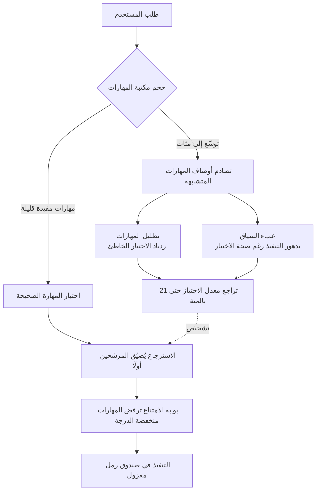

## نظرة عامة

يبدو أن منح الوكيل مزيدًا من المهارات ينبغي أن يجعله أكثر كفاءة، لكن الأبحاث الحديثة تُبلّغ بالعكس. فكلما كبرت مكتبة المهارات، قد ينخفض فعليًا معدل نجاح الوكيل في المهام نفسها. تواجه الورقة arXiv 2605.24050 بعنوان "More Skills, Worse Agents?" هذه المفارقة مباشرة، وتُبلّغ بأن معدل اجتياز المهام يتراجع بنسبة تصل إلى 21% عند التوسع من مجموعة صغيرة من المهارات المفيدة إلى مكتبة من 202 مهارة.

هذه حقيقة تشغيلية لا فضول أكاديمي. فسحابة ThakiCloud الموجَّهة للوكلاء Paxis تُدير بالفعل أكثر من 960 مهارة، وعليها أن تقرر في كل طلب أيها تُحمِّل. إضافة المهارات سهلة، أما انتقاء المهارة الصحيحة من مكتبة متضخمة فيزداد صعوبة باطراد. يستخدم هذا المقال تظليل المهارات عدسةً لتسمية عنق الزجاجة هذا، ثم يوضح كيف يمنعه Skill Harness في Paxis عمليًا عبر الاسترجاع وبوابة امتناع، مدعومًا بقياسات حقيقية.

## ما هو تظليل المهارات

تتيح مكتبة المهارات لوكيل نموذج اللغة تحميل تعليمات خاصة بالمهمة عند الطلب. والهدف تمكين مستخدم غير خبير من حل مهام في مجاله بلغة طبيعية دون معرفة أي المهارات موجودة أو كيف تعمل داخليًا. تبدأ المشكلة كلما كبرت المكتبة.

المساهمة الجوهرية في arXiv 2605.24050 هي تفكيك تراجع الأداء إلى أثرين. الأول هو **تظليل المهارات (skill shadowing)**: مع كبر المكتبة تتصادم المهارات المتشابهة في وصفها فيختار الوكيل المهارة الخاطئة أكثر. والثاني هو **عبء السياق (context overhead)**: تملأ أوصاف المهارات السياق فتتدهور جودة التنفيذ حتى حين يكون الاختيار صحيحًا.

خلاصة الورقة تخالف الحدس. فالمُسبِّب الرئيسي ليس السياق المنتفخ بل **اختيار المهارة الخاطئة نفسه**. بعبارة أخرى، عنق الزجاجة ليس "على النموذج قراءة نصوص كثيرة" بل "لا يستطيع النموذج انتقاء المهارة الصحيحة بين أوصاف متشابهة". هذا التشخيص يغيّر الاستجابة. فضغط السياق وحده لا يكفي؛ نحتاج خطوة استرجاع تُضيّق المرشحين وتختار بدقة من البداية.

يتطابق هذا المسار تمامًا مع مشكلة واجهناها من قبل. فحشو قائمة المهارات كاملةً في المُوجِّه ينهار لحظة تجاوز العدد بضع مئات. وبدل تكبير المكتبة بلا نهاية، لا بد من التحول إلى استرجاع المرشحين الأعلى فقط لكل طلب.

## لماذا يهم هذا الآن

مشكلة الحجم لا تقتصر على ورقة واحدة. فمعيار SkillRet (arXiv 2605.05726) الصادر في الفترة نفسها يجمع 17,810 مهارة وكيل عامة في معيار استرجاع واسع النطاق منظَّم ضمن تصنيف من مستويين يضم 6 فئات رئيسية و18 فئة فرعية. صارت المهارات تتراكم بمقياس عشرات الآلاف، وأصبح استرجاع المهارة الصحيحة من هذا المجمع مسألة بحثية قائمة بذاتها.

باختصار، تتسع فجوة بين وتيرة إضافة المجتمعات للمهارات والقدرة على اختيارها بدقة. تُظهر أبحاث التظليل كميًّا أن هذه الفجوة تتحول إلى خسارة أداء حقيقية، بينما توفر معايير مثل SkillRet مسطرة مشتركة لقياسها. وكلاهما يشير إلى وصفة عملية واحدة: **عاملْ الاسترجاع والاختيار كمسألتين من الدرجة الأولى، منفصلتين عن تكبير المكتبة.**

## الأثر على منتجات ThakiCloud

يتطابق اتجاه هذا البحث تمامًا مع تصميم يُطبّقه Skill Harness في Paxis بالفعل. فـ Paxis هي سحابة ThakiCloud الموجَّهة للوكلاء وتعامل المهارات كموارد من الدرجة الأولى. وبدل دفع قائمة المهارات كاملةً في كل طلب، تُضيّق المرشحين إلى الأعلى مطابقةً عبر استرجاع BM25 المعجمي وتُحمّل هؤلاء فقط. هذا هو خط الدفاع الأول ضد تظليل المهارات. فحين تنكمش مجموعة المرشحين من مئات إلى قلة، ينكمش معها مجال تصادم الأوصاف المتشابهة.

خط الدفاع الثاني هو **بوابة الامتناع (abstain gate)**. فحين تقل أعلى درجة استرجاع عن عتبة معيّنة، لا تُفرض أي مهارة، بل يتحول الطلب إلى المعالجة الأصلية. وإذا كان جوهر تظليل المهارات هو "انتقاء مهارة خاطئة معقولة عند عدم اليقين"، فبوابة الامتناع هي الآلية التي تمنع تلك المطابقة غير المؤكدة حتميًّا في الشيفرة. فبدل الوثوق بحكم النموذج على "الغموض"، تملك عتبةُ الدرجة القرار.

تُظهر قياسات Skill Harness الفعلية أن التصميم يعمل. ففي معيارنا الداخلي SRA (63 حالة) بلغ Recall@5 نسبة 82.2%، وبلغت الدقة المُبوَّبة مع تطبيق بوابة الامتناع 66.7%، وبلغ Top-1 نسبة 40.0%، وكانت الهلوسة (اختلاق مهارة غير موجودة للمطابقة) 0%. وتحديدًا فإن الهلوسة 0% أثر مباشر لبوابة الامتناع: فمهما كبرت المكتبة، لا تختلق مهارة غائبة ولا تفرض مطابقة دون العتبة.

يعلو ذلك التنفيذُ المعزول في صندوق رمل، وبوابات السياسة، وسجلات التدقيق في Paxis. فحتى لو اختير أحيانًا مهارة خاطئة، يجري تنفيذها في بيئة معزولة ويُسجَّل كل فعل في سجل التدقيق. وحتى حين لا يزول تظليل المهارات كليًّا، يُحتوى مداه عند حدود التنفيذ. هكذا يُمنع عنق الزجاجة الذي يشخّصه البحث (فشل الاختيار) وخطره اللاحق (التنفيذ الخاطئ) في ثلاث طبقات: الاسترجاع والبوابة والعزل.

## الحدود والاعتراضات

للبحث ولتصميمنا حدود واضحة. أولًا، نسبة التراجع 21% في arXiv 2605.24050 قيمة ضمن إعداد محدد (مكتبة من 202 مهارة) وتتباين كثيرًا بحسب جودة أوصاف المهارات وتداخلها ومجال المهمة. فإذا وُصفت المهارات جيدًا وحُفظت من التداخل، تقلّ نسبة التراجع عند المقياس نفسه. الدرس الدقيق ليس "لا تُضِف مهارات" بل "أدِر جودة الوصف والاسترجاع معًا".

ثانيًا، استرجاع BM25 المعجمي ليس دواءً لكل داء. فمع الاستعلامات بمصطلحات كورية صرفة تفتقر إلى مفردات توسعة إنجليزية، قد يعجز عن إظهار المهارة الصحيحة، ونسبة Top-1 البالغة 40.0% في معيارنا تترك مجالًا واسعًا للتحسين. وثمة تعزيزات مثل مجاميع التضمين مطروحة، لكن هل تبرر التخلي عن حتمية إشارة واحدة وكلفتها المنخفضة فمسألة منفصلة. وقبل تثقيل الاسترجاع، غالبًا ما يمنح تحسين أوصاف المهارات نفسها المكسب الأكبر.

ثالثًا، تختزل بوابة الامتناع إلى مسألة ضبط عتبة. فعتبة عالية جدًّا تستبعد مهارات مفيدة وتضر بالتغطية، وعتبة منخفضة جدًّا تعجز عن منع التظليل. ونتيجة الهلوسة 0% ثمرة عتبة مضبوطة بحذر، وتأتي بكلفة إغفال بعض المطابقات المشروعة. في النهاية، إدارة مكتبة مهارات ليست سؤال "كم نُكبّرها" بل "كيف نوازن بين الاسترجاع والبوابة وجودة الوصف"، وأبحاث التظليل تحذير كمّي بأن هذا التوازن يبدأ بالاختلال عند مقياس أصغر مما تتوقع.

## المصادر

- More Skills, Worse Agents? Skill Shadowing Degrades Performance When Expanding Skill Libraries, arXiv 2605.24050 (<https://arxiv.org/abs/2605.24050>)
- SkillRet: A Large-Scale Benchmark for Skill Retrieval in LLM Agents, arXiv 2605.05726 (<https://arxiv.org/abs/2605.05726>)
