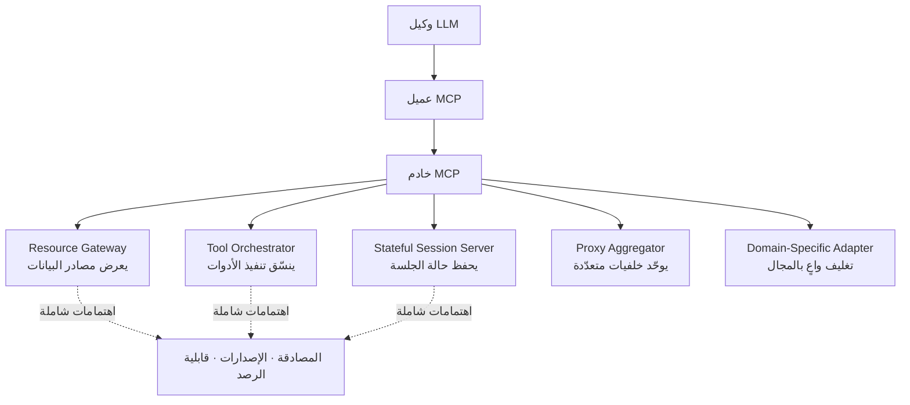

## نظرة عامة

بروتوكول Model Context Protocol (MCP) هو واجهة قياسية أطلقتها Anthropic في نوفمبر 2024. يوفّر طريقة موحّدة لربط نماذج اللغة الكبيرة بالأدوات ومصادر البيانات والخدمات الخارجية. وخلال أشهر ظهرت مئات خوادم MCP التي بنتها المجتمعات على GitHub. ومع ذلك لم يوجد أدب في صيانة البرمجيات يصف كيف تُبنى هذه الخوادم فعليًّا في الإنتاج.

تسدّ هذه الفجوة ورقة [MCP Server Architecture Patterns for LLM-Integrated Applications](https://arxiv.org/abs/2606.30317) لـ Carson Rodrigues وزملائه، المنشورة على arXiv في 29 يونيو 2026. باستخدام مجموعة من 15 خادم MCP طُوِّرت بشكل مستقل، تصنّف الورقة خمسة أنماط معمارية متكرّرة وأربعة أنماط مضادّة، إلى جانب اهتمامات شاملة تتعلّق بالمصادقة وإدارة الإصدارات وقابلية الرصد.

ولمن يشغّل بنية الوكلاء، يبرز جزء واحد بوضوح. فقد قاست الورقة فعليًّا عدد الأدوات التي يمكن إرفاقها، وجاءت الإجابة أقلّ بكثير ممّا يفترضه معظم الفرق. ولأنّ هذا يتقاطع مباشرة مع كيفية تعامل ThakiCloud مع أكثر من 960 مهارة في Paxis، سحابتنا الأصيلة للوكلاء (Agent-Native Cloud)، يستعرض هذا المقال النتائج المقيسة جنبًا إلى جنب مع خياراتنا التصميمية.

## ما هي الدراسة

النهج تجريبي. فبدلًا من وصف ما ينبغي أن تكون عليه الخوادم، فكّك الباحثون 15 خادمًا قيد التشغيل واستخلصوا بنيتها المشتركة استقرائيًّا. وتنقسم الأنماط الخمسة الناتجة وفق محورين: ما الذي يعرضه الخادم لنموذج LLM، وكيف يتعامل مع الحالة.

قيمة هذا التصنيف أنّه يجبرك على تحديد "أيّ نوع من الخوادم هذا" قبل البناء. فإذا حشرت منطق التنفيذ المعقّد لنمط Tool Orchestrator داخل Resource Gateway، جمعت عيوب النمطين معًا. اختيار النمط صراحةً هو بحدّ ذاته انضباط تصميمي.

## الأنماط المعمارية الخمسة

**Resource Gateway** يعرض مصادر البيانات مثل قواعد البيانات وأنظمة الملفّات وواجهات API بأسلوب يركّز على القراءة. الأدوات نفسها بسيطة، والسؤال الحقيقي هو أيّ الموارد تفتحها وبأيّ صلاحيات.

**Tool Orchestrator** يجمع عدّة أدوات وينسّق تدفّق تنفيذ. غالبًا ما ينفّذ الاستدعاء الواحد خطوات داخلية متعدّدة، لذا تصبح معالجة الأخطاء والتراجع الجزئي هي الصعوبة الأساسية.

**Stateful Session Server** يحفظ الحالة عبر محادثة أو جلسة عمل. استدعاءات LLM بلا حالة في جوهرها، فيحمل الخادم الحالة نيابةً عن النموذج وعليه أن يحدّد عمر الجلسة وسياسة التنظيف بوضوح.

**Proxy Aggregator** يدمج عدّة خلفيات أو خوادم MCP أخرى خلف واجهة واحدة. مريح، لكن مع تكاثر الأدوات خلفه يقود سريعًا إلى مشكلة إرباك الأدوات التي نناقشها أدناه.

**Domain-Specific Adapter** يغلّف مفاهيم مجال محدّد (المال، الرعاية الصحّية، الأنظمة الداخلية) في شكل يتعامل معه LLM جيّدًا. فيدمج مصطلحات المجال وقيوده في مخطّط الأداة كي لا يحاول النموذج تركيبات غير منطقية.

## إرباك الأدوات: لماذا يتعثّر النموذج مع تعدّد الأدوات

أهمّ جزء عمليًّا في الورقة يقيس العلاقة بين عدد الأدوات ودقّة اختيار الأداة. النتيجة واضحة: بمجرّد تجاوز عدد الأدوات في السياق حدًّا معيّنًا، تنخفض دقّة النموذج في اختيار الأداة الصحيحة إلى ما دون 90%.

على وجه التحديد، تفيد الورقة بأنّ دقّة Claude Haiku 4.5 تنخفض دون 90% بين 10 و15 أداة، وبالنسبة لـ Sonnet 4 بين 20 و30 أداة. تتحمّل النماذج الأكبر عددًا أكبر من الأدوات، لكن لا توجد نقطة يصحّ عندها "أرفق ما شئت". فمع تكاثر الأدوات وغموض أوصافها، يرتبك النموذج.

يقلب هذا القياس حدسًا شائعًا. إذ كثيرًا ما يبدأ من يضيف MCP لأوّل مرّة بـ"عرض كلّ واجهة API نملكها كأداة". وبدمج عدّة خلفيات عبر Proxy Aggregator يصل عدد الأدوات بسرعة إلى العشرات، فتسقط من على حافّة الدقّة. عدد الأدوات ليس مجّانيًّا، بل يستهلك ميزانية حكم النموذج.

## الأنماط المضادّة والاهتمامات الشاملة

تصنّف الورقة أيضًا أربعة أنماط مضادّة. الأسماء الدقيقة غير مؤكّدة على مستوى الملخّص، لكنّ الاتّجاه يتّصل بالقياس أعلاه. فزيادة الأدوات دون تمييز، وترك أوصاف الأدوات غامضة كي يستنتج النموذج النيّة، وترك الجلسات تنجرف دون إدارة حالة، ومعالجة المصادقة والإصدارات بشكل غير متّسق لكلّ خادم، هي أنماط الفشل النموذجية.

أمّا الاهتمامات الشاملة فتُبرز المصادقة وإدارة الإصدارات وقابلية الرصد. الثلاثة مطلوبة أيًّا كان النمط الذي تختاره. وقابلية الرصد خصوصًا كثيرًا ما تُؤجَّل في أنظمة الوكلاء، ومع ذلك عندما يفشل استدعاء أداة ولا تستطيع تتبّع السبب، يصبح تصحيح الأخطاء مستحيلًا عمليًّا.

## الآثار على منتجات ThakiCloud

يتطابق استنتاج الورقة حول إرباك الأدوات تمامًا مع سبب بناء ThakiCloud لـ **Paxis**. فـ Paxis هو مستوى تحكّم Agent-Native Cloud يعمل فوق ai-platform، ويتعامل مع المهارات (Skills) والأدوات (Tools) والسياسات (Policies) وسجلّات التدقيق (Audit Logs) كموارد من الدرجة الأولى. والعنصر الجوهري هو **Skill Harness**.

يملك Paxis أكثر من 960 مهارة، لكنّه لا يصبّها كلّها في سياق النموذج كأدوات أبدًا. بل يختار لكلّ طلب مستخدم مجموعة صغيرة من المهارات ذات الصلة عبر بحث BM25 ويعرضها. وبإسقاط ذلك على قياس الورقة، فهذا تصميم يتفادى حافّة الدقّة. يواجه النموذج دائمًا حفنة قابلة للإدارة من الأدوات، بينما تُستدعى المئات المتبقّية من القدرات عند الحاجة. "قدرات كثيرة، عرض قليل" هو جوابنا على مشكلة إرباك الأدوات.

نُدير خطر Proxy Aggregator بالعدسة نفسها. فموصّلات MCP في Paxis تربط خدمات خارجية كثيرة، لكن بدلًا من عرض كلّ أداة موصولة، تصفّيها بوّابة سياسات كي لا يصل إلى مسار التنفيذ في الصندوق المعزول سوى ما يلزم فعلًا. ويترك كلّ استدعاء أداة سجلّ تدقيق، ما يلبّي متطلّب قابلية الرصد. فالمصادقة والإصدارات وقابلية الرصد التي أشارت إليها الورقة كاهتمامات شاملة مبنيّة افتراضيًّا في Paxis، لا اختيارية.

وتجدر الإشارة أيضًا إلى الطبقة التحتية **ai-platform**. فمع تكاثر خوادم MCP، يعمل كلّ منها في النهاية كعملية في مكان ما. يخدم ai-platform هذه الخوادم بموثوقية على K8s وجدولة GPU المبنية على Kueue مع عزل متعدّد المستأجرين، ويمتدّ إلى البيئات المحلّية والسيادية. وبالنسبة للخوادم الحافظة للحالة مثل Stateful Session Server، يهمّ التوضيع وإدارة دورة الحياة، وهنا يصبح نضج تشغيل K8s ميزة مباشرة.

## القيود والاعتراضات

تستند الورقة إلى مجموعة صغيرة نسبيًّا من 15 خادمًا. ونظام MCP البيئي ينمو بسرعة بحيث يبقى السؤال قائمًا حول ما إذا كانت هذه الأنماط الخمسة ستظلّ ممثِّلة. فقد تظهر أنماط جديدة، أو تخفّ الأنماط المضادّة الحالية بأدوات أفضل.

كما يعتمد قياس دقّة اختيار الأداة على النموذج وتصميم المُوجِّه (prompt). فالأوصاف الجيّدة والتسمية الواضحة ترفع الدقّة عند العدد نفسه من الأدوات. بعبارة أخرى، لا يوجد خطّ مطلق بأنّ "N أداة آمنة"، بل عدد الأدوات متغيّر من بين عدّة متغيّرات. ومع ذلك يبقى الاتّجاه واضحًا: الأدوات ليست مجّانية، وانضباط عرض ما يلزم فقط هو أساس موثوقية الوكلاء.

## المصادر

- Carson Rodrigues et al., [MCP Server Architecture Patterns for LLM-Integrated Applications](https://arxiv.org/abs/2606.30317), arXiv:2606.30317 (2026-06-29)
- [مقدّمة Model Context Protocol الرسمية](https://modelcontextprotocol.io/)
