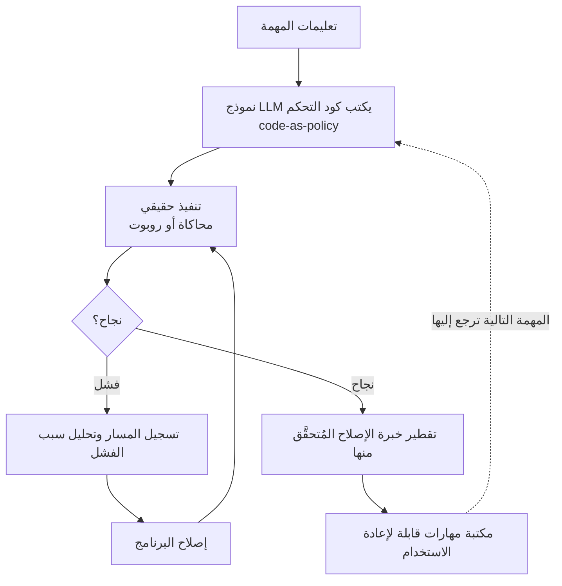

## نظرة عامة

من شغّل الروبوتات مدة طويلة يرى هدرًا مألوفًا. حتى عندما ينجح الروبوت في مهمة بشقّ الأنفس، يُلقى معظم ما مرّ به من محاولة وخطأ في سلة المهملات. وفي المهمة التالية يتعثّر من الصفر مجددًا. أمّا المعرفة الدقيقة المكتسبة من الفشل، مثل كيفية التعافي حين تنزلق الماسكة أو زاوية الاقتراب الصحيحة لجسم بعينه، فلا تبقى في أي مكان من النظام. الإنسان يعيد استخدام حيلة تعلّمها مرة، أمّا الروبوت فلا.

عالج فريق GEAR في NVIDIA هذا الأمر تحديدًا عبر **ASPIRE** (Agentic /Skills Discovery for Robotics، arXiv 2607.00272)، الذي أُطلق في 30 يونيو 2026. الفكرة بسيطة لكنها قوية. فبدلًا من حقن سياسة ثابتة في الروبوت، **يكتب نموذج لغوي كبير (LLM) كود تحكّم الروبوت بنفسه**، ويشغّل ذلك الكود في بيئة التنفيذ الحقيقية، ويراقب حالات الفشل، ويصلحه تكراريًا، ثم يقطّر خبرة الإصلاح المُتحقَّق منها في **مهارات (Skills) قابلة لإعادة الاستخدام**. الخبرة لا تُهدر بل تتراكم.

يعرض هذا المقال بنية ASPIRE ونتائجها المقيسة استنادًا إلى الورقة المُتحقَّق منها وصفحة المشروع. ثم يبيّن أن هذه ليست قصة روبوتات فحسب: النمط نفسه ينطبق على وكلاء البرمجيات، ونختم بربطه بكيفية تعامل منصة ThakiCloud السحابية الأصيلة للوكلاء، Paxis، مع المهارات بوصفها موارد من الدرجة الأولى.

## ما هو ASPIRE

يضع ASPIRE حلقة تعلّم مستمر فوق نمط **code-as-policy**. غالبًا ما يدرّب تعلّم الروبوتات التقليدي سياسةً عصبية على كميات كبيرة من بيانات العرض، ثم يعيد جمع البيانات وإعادة التدريب كلما ظهر موقف جديد. وهذا يحمل عبأين: جمع البيانات مكلف، والمعرفة المكتسبة مرة تنهار بسهولة أمام تغيّرات جديدة.

يمثّل ASPIRE السياسة لا بوصفها أوزان شبكة عصبية بل بوصفها **كودًا قابلًا للتنفيذ**. حين يتلقّى النموذج اللغوي مهمة ويكتب برنامج تحكّم، يُشغَّل ذلك البرنامج في المحاكاة أو على روبوت حقيقي. وإذا فشل التنفيذ، يسجّل ASPIRE مسار التنفيذ، ويحلّل سبب الفشل، ويصلح البرنامج، ثم يعيد المحاولة. وحين تبلغ هذه الحلقة النجاح، تُخزَّن معرفة الإصلاح المُتحقَّق منها في مكتبة المهارات. فتبدأ المهمة التالية لا بيدين فارغتين بل بالرجوع إلى تلك المكتبة.

المفتاح هو ذلك السهم الأخير. فمع رجوع مكتبة المهارات إلى كتابة المهمة التالية، يكتب النظام كودًا أفضل وأسرع مع مرور الوقت. تصف الورقة كيف تنتقل هذه المعرفة المتراكمة عبر المهام في صورة قواعد استرشادية للتعافي من الإمساك، واستراتيجيات ملاحة، ووصفات توجيه (prompting)، وإصلاحات إجرائية. الأمر ليس حلّ مهمة بعينها جيدًا، بل إن القدرة على حلّ المهام نفسها هي ما يتراكم.

## تقطير الفشل إلى مهارات

ما يميّز ASPIRE عن غيره من أنظمة تعلّم الروبوتات هو طريقة تعامله مع الفشل. ففي معظم المسارات، الفشل شيء يُطرح جانبًا، أو في أحسن الأحوال إشارة سلبية تقلّص مكافأة. أمّا ASPIRE فيعامل الفشل بوصفه **مادة تعلّم**. فمسار التنفيذ الفاشل يحمل معلومة "ماذا اختلّ ولماذا"، والنموذج اللغوي يقرأها ليستدلّ على أين وكيف يصلح الكود.

لو انتهى ذلك الإصلاح عند ارتجال لمرة واحدة، لكانت قيمته محدودة. مساهمة ASPIRE هي **تقطير الإصلاح المُتحقَّق منه إلى مهارة قابلة للتعميم**. فمثلًا، إذا أُصلح انزلاقٌ أثناء التقاط جسم بعينه ليصبح نجاحًا، يُجرَّد إجراء التعافي إلى صيغة غير مقيّدة بذلك الجسم وحده بل يمكن إعادة تطبيقها على مواقف إمساك مشابهة. ولأن المهارة قطعة كود مُعبَّر عنها نصًّا، يستطيع الإنسان قراءتها ومراجعتها، ويمكن إدارتها وترقيمها كمكتبة. وهذه ميزة كبيرة مقارنةً بالسياسات العصبية ذات الصندوق الأسود.

بفضل هذه البنية، يرفع ASPIRE الأداء **دون أي بيانات تدريب إضافية**. فبدلًا من جمع عروض جديدة لإعادة تدريب النموذج، يكفي تكرار حلقة التنفيذ والفشل والإصلاح والتقطير لرفع معدّل النجاح. وفي الروبوتات، حيث يكون جمع البيانات هو عنق الزجاجة، تُعدّ هذه خاصية مهمة عمليًا.

## النتائج التجريبية الفعلية

تُظهر الأرقام المُبلَّغ عنها في الورقة وصفحة المشروع أن هذه الحلقة أكثر من مجرد مفهوم. أبرز نتيجة هي مهمة تسليم الجسم بذراعين في Robosuite. فبدءًا من معدّل نجاح أساسي بلغ **20%**، ارتفع إلى **92%** عبر التنقيح التكراري وحده، وهو رقم بُلغ بصفر بيانات عرض إضافية، باستخدام حلقة التنفيذ والإصلاح فقط.

وتظلّ الميزة قائمة مع اتّساع أنواع المهام. تُبلّغ الورقة بأن ASPIRE يتفوّق على الطرق السابقة بما يصل إلى **77%** على LIBERO-Pro (مهمة تلاعب تحت اضطراب)، وبـ**72%** على تسليم Robosuite بذراعين، وبما يصل إلى **32%** على BEHAVIOR-1K (مهمة منزلية طويلة الأفق). وعلى وجه الخصوص، في تجارب التعميم طويلة الأفق، ارتفع معدّل النجاح باطّراد مع نمو مكتبة المهارات. وكون نمو المكتبة وارتفاع الأداء يسيران معًا يدعم الادّعاء المركزي لهذا النظام بأن الخبرة تتراكم فعلًا.

يضمّ الفريق البحثي مختبر GEAR في NVIDIA إلى جانب باحثين من جامعة ميشيغان (UMich) وجامعة إلينوي (UIUC) وجامعة كاليفورنيا في بيركلي وجامعة كارنيغي ميلون (CMU). وقد أفادت NVIDIA بأن مكتبة مهارات ASPIRE ستكون مفتوحة المصدر عند الإطلاق، مع التفاصيل على صفحة المشروع (research.nvidia.com/labs/gear/aspire). ومع ذلك، لم يتأكّد بوضوح رخصة مستودع الكود وقت الإطلاق، لذا يُستحسن التحقق مباشرةً من شروط رخصة المستودع الفعلي قبل تبنّيه.

## الأثر على منتجات ThakiCloud

يستهدف ASPIRE ذراع روبوت، لكن الرسالة التي تبعثها بنيته تنتقل مباشرةً إلى وكلاء البرمجيات. خذ جملة "يكتب الوكيل كودًا، ويتعلّم من الفشل، ويقطّر الخبرة المُتحقَّق منها إلى مهارات قابلة لإعادة الاستخدام مكدّسة في مكتبة"، واستبدل "الروبوت" بـ"الوكيل السحابي"، فتحصل تحديدًا على البنية التي تتّجه نحوها منصة ThakiCloud السحابية الأصيلة للوكلاء، **Paxis**.

تعامل Paxis المهارات والأدوات والسياسات وسجلّات التدقيق (Skills وTools وPolicies وAudit Logs) بوصفها موارد من الدرجة الأولى. فمكتبة مهارات ASPIRE تقابل في Paxis منصة مهارات تضمّ نحو 960 مهارة تُنتقى عبر BM25، وتنفيذ ASPIRE بنمط code-as-policy يقابل تنفيذ Paxis في صندوق رمل معزول. وكما يسجّل ASPIRE مسارات الفشل ويحلّلها، تمرّر Paxis كل فعل للوكيل عبر بوابة سياسة وسجلّ تدقيق حتى يمكن تتبّع ما فشل ولماذا بأثر رجعي. وأمّا التحسّن الذاتي الذي تهدف إليه حلقة تقطير ASPIRE فيتحقّق في Paxis بوصفه مهارات ذاتية التطوّر: تعود الدروس المستخلصة من التنفيذ إلى مهارات جديدة أو تنقيحات للمهارات، فلا يبدأ التشغيل التالي بيدين فارغتين.

من منظور البنية التحتية، توفّر **ai-platform** من ThakiCloud الأساس لهذه الحلقة. فحلقة التنفيذ والإصلاح المتكرّرة بأسلوب ASPIRE عليها تشغيل المحاكاة والاستدلال بكثافة، ما يفترض جدولة مرنة لموارد GPU. وقد صُمّمت ai-platform لاستيعاب مثل هذه الأحمال المتكرّرة بكفاءة في التكلفة فوق جدولة GPU المبنية على Kueue وعزل متعدّد المستأجرين. فالخدمة منخفضة التكلفة تجعل تكرار التنفيذ والإصلاح لدى الوكيل اقتصاديًا، والمهارات المتراكمة بهذه الطريقة ترفع بدورها استقلالية الوكيل، في دورة فاضلة. وللعملاء الذين يحتاجون بيئات محليّة وسيادية، تُعدّ القدرة على تشغيل هذه الحلقة كاملةً داخل بنيتهم التحتية أمرًا ذا مغزى خاص.

## القيود والاعتراضات

على إثارة نتائج ASPIRE للإعجاب، ثمة تحفّظات في محلّها. أولًا، تأتي الأرقام المُبلَّغ عنها في معظمها من معايير محاكاة (Robosuite وLIBERO-Pro وBEHAVIOR-1K). فالتنقيح التكراري في المحاكاة رخيص وآمن، لكن على العتاد الحقيقي تحمل كل محاولة وقتًا وتآكلًا ومخاطر سلامة. وما إذا كانت اقتصاديات حلقة التنفيذ والفشل والإصلاح تصمد على الروبوتات المادية يحتاج إلى تحقّق منفصل.

ثانيًا، نمط code-as-policy قوي في المهام التي يستطيع فيها النموذج اللغوي كتابة كود تحكّم صالح، لكن للتحكم المستمر الدقيق أو الأفعال التي تحتاج تغذية راجعة عالية التردّد، يبقى مجالٌ يصعب التعبير عنه كودًا. ويبدو أن ASPIRE يفوّض هذا التحكم منخفض المستوى إلى مهارات أو أوّليّات موجودة، وقد تحدّ جودة تلك الأوّليّات من سقف الأداء الإجمالي.

ثالثًا، مع نمو مكتبة المهارات يزداد عبء الاسترجاع والانتقاء. النتيجة القائلة إن نمو المكتبة يواكب مكاسب الأداء مشجّعة، لكن ما إذا كان انتقاء مهارة خاطئة أو مهارة قديمة تُطلق إجابات خاطئة سيصبح مشكلة على نطاق أكبر يستحقّ متابعة مستمرة. وهذا تحدٍّ واجهته منصة مهارات Paxis فعلًا، وانتقاء BM25 وبوابة السياسة وسجلّات التدقيق هي بالضبط آليات إدارة ذلك الخطر.

ومع ذلك، فالاتجاه الذي يشير إليه ASPIRE، أي عدم التخلّص من الفشل بل تراكمه كمهارات مُتحقَّق منها، يرجّح أن يصبح معيارًا على جانبي الروبوتات ووكلاء البرمجيات معًا. المساهمة الحقيقية لهذا العمل هي تحوّل المنظور: تنمية القدرة عبر المهارات المتراكمة بدلًا من البيانات.

## المصادر

- ASPIRE: Agentic /Skills Discovery for Robotics، arXiv 2607.00272: <https://arxiv.org/abs/2607.00272>
- صفحة المشروع (NVIDIA GEAR): <https://research.nvidia.com/labs/gear/aspire/>
- صفحة الورقة (Hugging Face): <https://huggingface.co/papers/2607.00272>
