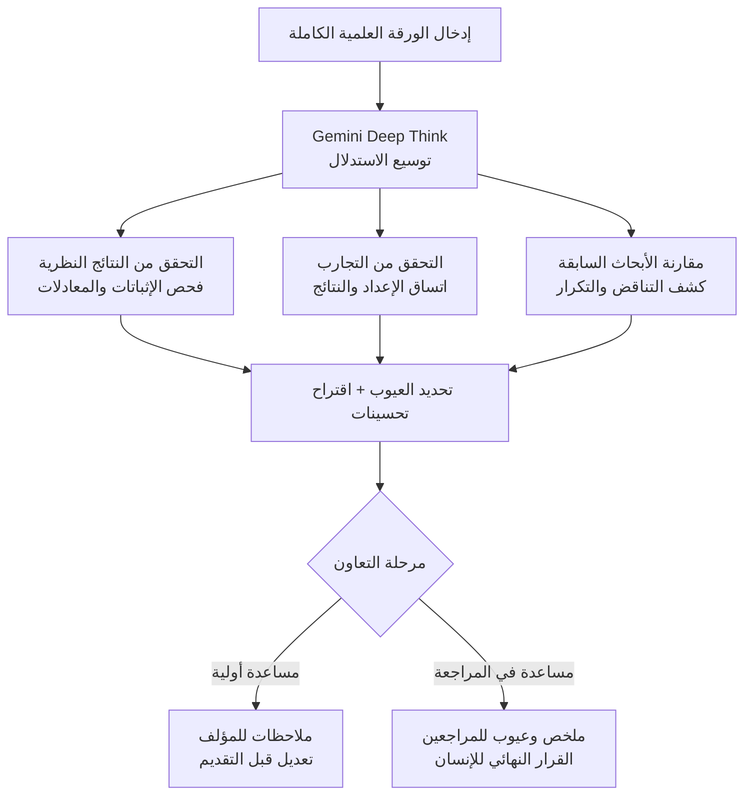

## نظرة عامة

تُعد المراجعة العلمية من الأقران (peer review) عنق زجاجة منذ زمن طويل. حجم الأبحاث المقدمة يتضخم كل عام، بينما لا يزداد الوقت المتاح للمراجعين. والنتيجة أن أخطاء مهمة تمر عبر المراجعة وتُنشر، ثم يُصار لاحقا إلى تصحيحها أو سحبها. أداة Paper Assistant Tool (PAT) التي كشفت عنها جوجل مؤخرا تستهدف هذه المشكلة مباشرة. تستقبل PAT الورقة العلمية الكاملة بعد اكتمالها، وتفحص النتائج النظرية، وتتحقق من التجارب، وتقترح تحسينات، وتشير إلى العيوب المحتملة، ضمن إطار مراجعة قائم على العملاء (agentic).

ما يجعل هذا البحث مثيرا للاهتمام هو أنه يتجاوز مجرد "تلخيص الورقة بواسطة نموذج لغوي كبير". فقد صُممت PAT وهي تدرك حدود الطلب الواحد أو أخذ العينات البسيط، واختارت التوجه نحو توسيع الاستدلال نفسه. تُشغّل ThakiCloud منصة SaaS للذكاء الاصطناعي وتعلم الآلة قائمة على كوبرنيتس، ولديها بالفعل خط أنابيب داخلي لأتمتة مراجعة الأبحاث. لذلك فإن هذا البحث ليس شأنا خارجيا بالنسبة لنا، بل مرجع مباشر لتصميم حلقات التحقق التي نتعامل معها يوميا. يستعرض هذا المقال ماهية PAT وكيفية عملها، وما الذي اكتشفته فعليا في النشر الحقيقي، وما الذي يعنيه هذا التصميم لمنتجات ThakiCloud.

## ما هو هذا البحث

الخيار التصميمي الجوهري في PAT هو توسيع الاستدلال (inference scaling). وبشكل ملموس، تستخدم الأداة Gemini Deep Think لتقوم باستدلال عميق عبر مراحل متعددة بدلا من إعطاء إجابة من طلب واحد. مراجعة الأبحاث في جوهرها عملية تحليل معقدة تمتد لوقت طويل. فللحكم على ما إذا كان إثبات نظرية (theorem) صحيحا فعلا، وما إذا كان إعداد التجربة يدعم النتائج، وما إذا كانت هناك تناقضات مع الأبحاث السابقة المستشهد بها، لا تكفي استجابة واحدة. تنفذ PAT هذا الحكم عبر تقسيمه إلى مراحل استدلال متعددة.

كما صُممت PAT لتكون أكثر من مجرد أداة حكم بالقبول أو الرفض، بل مساعدا يقرأ الورقة ويحدد عيوبا محددة ويقترح تحسينات. فهي تعمل كمساعد أولي للمؤلفين، يرفع من وضوح الورقة ويرصد الأخطاء قبل التقديم، وتعمل كمساعد للمراجعين، يكتب الملخصات ويشير إلى العيوب المحتملة مع ترك القرار النهائي للإنسان. بعبارة أخرى، تحدد الأداة موقعها بوضوح كمساعد للحكم البشري وليس بديلا عنه.

## النتائج الأساسية

قيست أداء PAT على معيار SPOT، وهو مجموعة بيانات مكونة من أوراق علمية سُحبت أو تأكد وجود أخطاء فيها. في هذا المعيار، سجلت PAT دقة كشف بلغت 89.7% للأخطاء الرياضية والمنطقية، وهو تحسن بنحو 34% مقارنة بخط الأساس بدون تدريب مسبق (zero-shot). وهذا يعني أن توسيع الاستدلال التقط جزءا كبيرا من الأخطاء التي كانت تفوت الطلب الواحد.

الأكثر إثارة للإعجاب هو نتائج النشر الفعلي. استُخدمت PAT في تجربتين تجريبيتين ضمن مؤتمري STOC 2026 وICML 2026، وراجعت أكثر من 4,700 ورقة مقدمة. وخلال هذه العملية، اكتُشفت أخطاء نظرية ذات دلالة في أكثر من ثلث أوراق ICML، ويُذكر أن 31% من المؤلفين دُفعوا لإجراء تجارب جديدة [تقديري: بحسب ما أعلنته الورقة البحثية]. إذا صحت هذه الأرقام، فهذا يعني أن المراجعة الآلية تجاوزت بالفعل مرحلة العرض التجريبي في المختبر وبدأت تؤثر في عمليات المؤتمرات الفعلية.

بطبيعة الحال، هذه الأرقام مقدمة من جهة مؤلفي الورقة نفسها، لذا ينبغي قراءتها بحذر إلى أن تُؤكد بإعادة إنتاج مستقلة. ومع ذلك، فإن تقديم كل من المعيار (SPOT) والنشر الفعلي (STOC/ICML) معا، إضافة إلى قياس ليس فقط اكتشاف الأخطاء بل أيضا تغيّر سلوك المؤلفين (إجراء تجارب جديدة)، يعكس منهجية جادة.

## تصنيف التعاون بين الذكاء الاصطناعي والإنسان في أربع مراحل

من الإسهامات الأخرى التي يقدمها هذا البحث تصنيف طريقة تعاون الذكاء الاصطناعي مع الإنسان في التقييم العلمي إلى أربع مراحل متدرجة. تختلف كل مرحلة بحسب مقدار الحكم الذي يُفوَّض للذكاء الاصطناعي، ويناقش المؤلفون المفاضلات (trade-offs) في كل مرحلة.

الموقع الحالي للتجربتين التجريبيتين يقع في مرحلة محافظة نسبيا. يعمل الذكاء الاصطناعي كمساعد أولي يرفع وضوح الورقة ويرصد الأخطاء قبل التقديم، وكمساعد يكتب ملخصات للمراجعين ويحدد العيوب المحتملة مع ترك سلطة القرار النهائي للإنسان. تكمن فائدة هذا التصنيف في أنه يجعلنا ننظر إلى المراجعة الآلية لا كثنائية "كل شيء أو لا شيء"، بل كطيف يمكن ضبط مستوى التفويض فيه. يمكن تصميم المراحل بحيث يبقى القرار النهائي عالي المخاطر بيد الإنسان، بينما تُفوَّض المهام التكرارية والآلية للذكاء الاصطناعي.

## الدلالات على تطبيقات منتجات ThakiCloud

ترتبط فلسفة التصميم في هذا البحث ارتباطا مباشرا بـ Paxis من ThakiCloud. Paxis هي مستوى تحكم للسحابة الأصلية للعملاء (Agent-Native Cloud) يعمل فوق ai-platform، ويتخذ من إغلاق تفرع المهام (fan-out) بالتحقق مبدأ جوهريا. رفض PAT للطلب الواحد ورفعها لمعدل كشف الأخطاء عبر توسيع الاستدلال ينبع من نفس الوعي الذي يقوم عليه أسلوب Paxis في عدم دمج نتائج العملاء الفرعيين المتوازيين مباشرة، بل تصفيتها عبر مرحلة تحقق خصومية (adversarial). فبنية إطلاق عدة مدققين متشككين من زوايا مختلفة ثم حسم العيوب بالتصويت تتطابق تماما مع فحص PAT المتقاطع للإثباتات والتجارب عبر مراحل استدلال متعددة.

عمليا، تُشغّل ThakiCloud بالفعل خط أنابيب لأتمتة مراجعة الأبحاث. يستقبل هذا الخط أوراق arXiv، وينتج مراجعة أقران عميقة، ويحوّل النتائج إلى مستندات يمكن للفريق الاطلاع عليها، ويربط بنود العمل المستخلصة من المراجعة بمهام تحسين النظام. تقدم نتائج PAT اتجاهين لهذا الخط. أولا، لرفع جودة الكشف قد يكون توسيع مراحل الاستدلال أكثر فعالية من رفع فئة النموذج نفسه. ثانيا، لا تكون مخرجات المراجعة الآلية مفيدة فعليا إلا إذا كانت تحديدا لعيوب محددة واقتراحات تحسين، لا مجرد حكم بالقبول أو الرفض.

من الناحية البنيوية، تكمل عدسة ai-platform هذه الصورة. توسيع الاستدلال يعني بالضرورة زيادة تكلفة الاستدلال. فمراجعة ورقة واحدة بعمق عبر مراحل متعددة تتطلب كما أكبر من الرموز (tokens) والحوسبة. تستوعب ai-platform هذا الحمل الاستدلالي المتكرر بكفاءة اقتصادية عبر جدولة وحدات معالجة الرسوميات (GPU) القائمة على كوبرنيتس وKueue، وخدمة النماذج عبر vLLM، والعزل متعدد المستأجرين. تشغيل حمل عمل يراجع كميات كبيرة من الأبحاث بشكل مستمر واقتصادي يتطلب هذه البنية التحتية للخدمة كشرط مسبق. وبالنسبة للمؤسسات البحثية ذات المتطلبات المحلية (on-premises) والسيادية، فإن القدرة على مراجعة الأبحاث الحساسة غير المنشورة داخل بنيتها التحتية الخاصة دون إرسالها إلى جهة خارجية تشكل ميزة تنافسية مهمة أيضا.

## القيود والحجج المضادة

قراءة هذا البحث بتفاؤل مطلق أمر محفوف بالمخاطر. أولا، معظم الأرقام المُبلغ عنها تستند إلى إعلانات جهة المؤلفين أنفسهم. من الأسلم فهم أرقام مثل نسبة الكشف البالغة 89.7% أو اكتشاف الأخطاء في ثلث أوراق ICML كحد أعلى إلى أن تُؤكد بإعادة إنتاج مستقلة. وعلى وجه الخصوص، كون معيار SPOT مكونا من أوراق مسحوبة أو بها أخطاء يعني أنه قد يختلف عن توزيع الأبحاث المقدمة فعليا، مما يستدعي الحذر عند التعميم.

ثانيا، هناك خطر الإيجابيات الزائفة (false positives) في المراجعة الآلية. فإذا كان ما حدده الذكاء الاصطناعي كخطأ هو في الواقع منهج مشروع، فقد يفرض عبئا غير ضروري على المؤلف أو يثبط بحثا مشروعا. لذلك يُعد تصميم إبقاء القرار النهائي بيد الإنسان أمرا لا غنى عنه، وإذا انهار هذا الخط الفاصل، فقد تخفض الأتمتة من جودة المراجعة بدلا من رفعها.

ثالثا، كلما تعمقت أتمتة المراجعة، قد ينشأ تراخ إدراكي (cognitive complacency) لدى المراجعين يجعلهم يقبلون حكم الذكاء الاصطناعي دون تمحيص. الموقف القائل "الذكاء الاصطناعي راجعه بالفعل، فلا بد أنه سليم" هو نمط الفشل الأكثر خفاء. المراجعة الآلية أداة تساعد الحكم البشري ولا تحل محله، ويبقى الحكم الجوهري مسؤولية الإنسان في نهاية المطاف. يبدو أن إبقاء PAT مرحلة التعاون محافظة وترك سلطة القرار النهائي للإنسان تصميم واعٍ لهذا الخطر.

باختصار، تُعد PAT مثالا مهما يُظهر أن المراجعة العلمية الآلية بدأت تتجاوز مرحلة العرض التجريبي لتدخل عمليات المؤتمرات الفعلية. غير أن قوتها لا تأتي من نموذج واحد لامع، بل من تصميم حذر يوسّع الاستدلال عبر مراحل متعددة ويترك الحكم النهائي للإنسان. وهذا يتفق مع الدرس الذي تعلمته ThakiCloud من خط أنابيب مراجعة الأبحاث وحلقة التحقق في Paxis. التحقق الجيد ينبع من البنية الجيدة.

## المصادر

- Towards Automating Scientific Review with Google's Paper Assistant Tool، arXiv:2606.28277: [arxiv.org/abs/2606.28277](https://arxiv.org/abs/2606.28277)
- Hugging Face Papers: [huggingface.co/papers/2606.28277](https://huggingface.co/papers/2606.28277)
