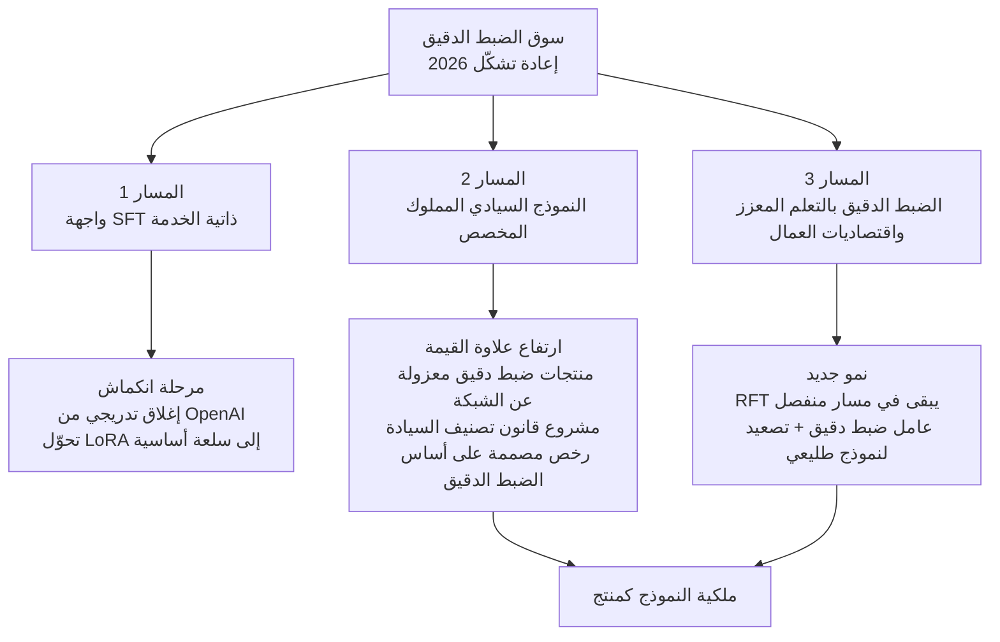

## مدخل: "ألا يكفي الآن أن نستغني عن الضبط الدقيق؟"

كل من يبني منصة ذكاء اصطناعي أو يبيعها اليوم لا بد أنه سمع هذا السؤال مرة على الأقل. بما أن النماذج الطليعية أصبحت بهذا القدر من الجودة، وبما أنه يمكن حقن المعرفة الخاصة بالمجال عبر المهارات (skills) وسقالات الوكلاء (agentic scaffolding)، فهل يستحق الأمر إنفاق المال والوقت لتدريب نموذج مستقل؟ طرحنا على أنفسنا السؤال ذاته. لذلك تحققنا منه بالاعتماد حصرا على مصادر نُشرت خلال شهر واحد بالضبط، من 5 يونيو إلى 5 يوليو 2026.

المنهجية بسيطة. قسّمنا البحث إلى أربعة محاور: أدلة انتفاء الحاجة إلى الضبط الدقيق، أدلة استمرار بقائه، تحركات السوق والموردين، ونقاشات الممارسين الميدانيين. ثم أعدنا التحقق من ستة ادعاءات محورية تؤثر في اتجاه القرار عبر تدقيق تفنيدي (adversarial) مستقل. من أصل ستة، تأكدت أربعة ادعاءات بالكامل وتأكد ادعاءان جزئيا، ولم يُفنَّد أي منها. هذا المقال مبني حصرا على الحقائق التي اجتازت هذا التحقق.

الخلاصة المسبقة هي التالية: منتج الضبط الدقيق يحتضر بالفعل، لكن الذي يحتضر هو قطاع محدد هو واجهة SFT ذاتية الخدمة، بينما تُعاد صياغة التقنية ذاتها ضمن منتج مختلف تماما هو ملكية النموذج واقتصاديات عمال الوكلاء (agent workers)، بل تزداد قيمتها العلاوية في هذا الاتجاه.

## ما الذي يموت فعلا

الحدث الأكثر دلالة هو قرار OpenAI. أعلنت الشركة في 7 مايو 2026 حظر إنشاء مهام ضبط دقيق جديدة للمؤسسات الجديدة، وابتداء من 2 يوليو انتقلت إلى مرحلة منع وصول المؤسسات غير النشطة لأكثر من 60 يوما، وفي 6 يناير 2027 ستُنهي بالكامل إمكانية إنشاء مهام ضبط دقيق جديدة حتى للعملاء النشطين الحاليين. يبقى الاستدلال (inference) على النماذج المضبوطة دقيقا سابقا متاحا إلى أن يُلغى النموذج الأساسي، لكن مسار تشغيل تدريب جديد يُغلق.

اللافت هو البند الاستثنائي. الضبط الدقيق القائم على التعلم المعزز، أي RFT، يُفصل في مسار منفصل ويستمر رغم هذا الإغلاق. أوقفت OpenAI الضبط الدقيق المُوجَّه (SFT) بينما أبقت على التخصيص عالي القيمة الذي يمتلك مكافأة قابلة للتحقق. أما Anthropic فلم تفتح أصلا واجهة ضبط دقيق ذاتية الخدمة في واجهتها العامة، وتدفع باتجاه Agent Skills كمسار قياسي يحمّل المعرفة الخاصة بالمجال ديناميكيا من بنية مجلدات. وهكذا فإن أكبر موردَي نماذج يشيران إلى الاتجاه ذاته.

إشارات الأسعار تحمل الرسالة نفسها. منافسة الأسعار على الضبط الدقيق بتقنية LoRA بين Together AI وFireworks AI تعني أن هذا القطاع أصبح سلعة أساسية (commodity) وتقلّصت هوامشه. أصبح تشغيل الضبط الدقيق المُوجَّه بخفة وذاتيا أمرا سهلا تقنيا، وبالتالي فقد جاذبيته كمشروع تجاري.

## لكن لا يوجد دليل على أن المهارات حل شامل أيضا

على عكس الشعور السائد، الأدلة الأكاديمية على أن المهارات تحلّ محل الضبط الدقيق بشكل عام لا تزال ضعيفة. أظهرت دراسة SkillJuror، المقدَّمة ضمن هذه النافذة الزمنية، أن تقديم المهارات بصيغة مُهيكَلة يرفع معدل اجتياز التحقق بمقدار 4.1 نقطة مئوية مقارنة بالصيغة المسطّحة. الأثر حقيقي لكنه ليس كبيرا. أما الدراسة الخلفية الأسبق قليلا، SkillsBench، فتحمل نتيجة أكثر إثارة للاهتمام: المهارات المُنسَّقة (curated) بعناية ترفع معدل الاجتياز بمعدل 16.2 نقطة مئوية في المتوسط، لكن التباين بين المجالات متطرف، إذ يتراوح بين سلبي وحتى +51.9 نقطة مئوية، وفي 16 من أصل 84 مهمة تراجع الأداء فعليا. والأهم أن المهارات التي كتبها النموذج بنفسه لم تُحدث أثرا إيجابيا في المتوسط.

بمعنى آخر، فرضية "المهارات تكفي" فرضية مشروطة تصح فقط عند تطبيق مهارات نسّقها إنسان بعناية على المجال المناسب. تكلفة تنسيق المهارات ليست مجانية، ولا يوجد ما يضمن أنها أرخص دائما من الضبط الدقيق. وللإشارة، لم نجد ضمن هذه النافذة الزمنية أي معيار قياس (benchmark) يقارن مباشرة نموذجا مضبوطا دقيقا مقابل نموذج طليعي مزوَّد بمهارات على نفس مجموعة المهام. هذه الفجوة تبقى واجبا معلّقا على الطرفين.

## إشارات معاكسة تماما خلال شهر يونيو

في الشهر نفسه، تدفقت أيضا إشارات قوية في اتجاه الضبط الدقيق وملكية النموذج. جميعها أحداث تم التحقق منها عبر مصادر مستقلة.

أولا، تحوّلت مخاطر الاعتماد الجيوسياسي على واجهات النماذج الطليعية إلى حدث واقعي مُقاس. في 12 يونيو 2026، وبناء على توجيه من ضوابط التصدير الأمريكية، عطّلت Anthropic نموذجَي Fable 5 وMythos 5 على مستوى العالم بأكمله. تعذّر تطبيق فلترة الجنسية في الزمن الحقيقي، فتأثر عمليا جميع المستخدمين وليس فقط العملاء خارج الولايات المتحدة، واستغرق رفع التعطيل 19 يوما. أي شركة وضعت أعمالها الجوهرية على واجهة نموذج طليعي واحدة، تكون قد تلقّت في يونيو درسا مدته 19 يوما.

ثانيا، منظومة الأوزان المفتوحة تُصمَّم اليوم على أساس الضبط الدقيق. أعلنت NVIDIA في 4 يونيو عن Nemotron 3 Ultra، وهو نموذج خليط خبراء (MoE) بحجم إجمالي 550 مليار معلمة ونشِط منها 55 مليارا، ويأتي مزودا افتراضيا بوصفات LoRA SFT وSFT الكامل وتعلم معزز GRPO. رخصة OpenMDW-1.1 تسمح صراحة بتسويع وإعادة توزيع النماذج المشتقة من الضبط الدقيق. الهدف من تصميم هذه الرخصة هو أن تملك الشركات وتبيع النموذج الذي دربته على بياناتها الخاصة. وفي 29 يونيو، أطلقت Palantir وNVIDIA معا منتجا مدمجا للذكاء الاصطناعي السيادي يتيح ضبط الأوزان المفتوحة دقيقا وتشغيلها داخل بيئة معزولة عن الشبكة (air-gapped). في الاتحاد الأوروبي، طُرح مشروع قانون لتصنيف أحمال العمل العامة وفق درجات ضمان السيادة، وفي كوريا كذلك مشاريع الذكاء الاصطناعي السيادي قيد التنفيذ.

ثالثا، ظهرت حالة انتصار عملي لعامل الضبط الدقيق. في معيار قياس نشرته شركة الذكاء الاصطناعي القانوني Harvey بالتعاون مع Fireworks، حقق نموذج Kimi K2.6 المضبوط بتقنية SFT فقط، ودون أي مساعدة من نموذج طليعي، معدل اجتياز إجمالي بلغ 15% على 100 مهمة، متجاوزا نموذج Claude Opus 4.7 المستقل الذي حقق 14%، وبتكلفة أقل بنحو 11.4 مرة. أما التركيبة الهجينة التي تستدعي نموذجا طليعيا انتقائيا إلى جانب عامل الضبط الدقيق، فحققت أعلى معدل اجتياز عند 18%. رغم أن هذا معيار قياس صادر عن المورّد نفسه، فإنه دليل عملي على أن الجمع بين عامل مضبوط دقيقا وتصعيد انتقائي إلى نموذج طليعي، في مجال ضيق، يحقق الجودة والتكلفة معا.

رابعا، تفوق النماذج الصغيرة في مجالات ضيقة لا يزال يتكرر. في ورقة بحثية نُشرت في 11 يونيو، أظهر نموذج Mistral-7B المضبوط دقيقا بتقنية QLoRA تفوقا في التحقق من الادعاءات الطبية الحيوية على GPT-4o وGPT-5، بفارق يصل إلى 12 نقطة مئوية في مقياس F1. وقد استُخدم لهذا التدريب 1,008 عينة فقط.

## السوق ينقسم إلى ثلاثة مسارات

عند تراكب هذه الإشارات معا، يتضح أن السوق لا ينقسم بين "الموت أو البقاء" فحسب، بل ينقسم إلى ثلاثة مسارات.

المسار الأول، واجهة SFT ذاتية الخدمة، في مرحلة انكماش. طول السياق الكبير للنماذج الطليعية، ودعمها الأصلي لاستدعاء الأدوات، والمخرجات المُهيكَلة، استوعبت جزءا كبيرا من مشكلتَي الالتزام بالصيغة ومفردات المجال، اللتين كانتا سبب وجود الضبط الدقيق في الأصل. المسار الثاني، النموذج المخصص المملوك، يُعاد تشكيله كخدمة علاوية (premium). عصر الضبط الدقيق الخفيف عبر الواجهة البرمجية ينتهي، لكن التخصيص الثقيل الذي تملك فيه الشركة نموذجها وتتحكم فيه يزداد قيمة. المسار الثالث طلب جديد يخلقه عصر الوكلاء. كلما تحسّنت أدوات التنسيق (orchestrators)، تزداد استدعاءات العمال منخفضي التكلفة المسؤولين عن المهام الفرعية المتكررة، ولا يمكن تحمّل استدعاء نموذج طليعي في كل شريحة من هذه الاستدعاءات.

## الشروط الخمسة التي يفوز فيها الضبط الدقيق بوضوح

عند تلخيص الحالات الموثّقة كنمط، يتضح أن احتمال فوز الضبط الدقيق وعائده على الاستثمار يرتفعان كلما تجمّعت الشروط التالية.

1. عندما تكون المهمة ضيقة ومتكررة وصيغة المخرجات ثابتة. التصنيف والتحقق والاستخراج المُهيكَل أمثلة نموذجية، والحالة التي حققت تفوقا بـ12 نقطة مئوية بـ1,008 عينة فقط من هذا النوع.
2. عندما توجد مكافأة قابلة للتحقق. إذا توفرت تغذية راجعة من البيئة تسمح بتطبيق GRPO أو RFT، فهذا أفضل من التعلم المُوجَّه، وهو السبب الذي جعل OpenAI تُبقي على RFT وحده بعد إيقاف SFT.
3. عندما يكون تكرار الاستدعاء مرتفعا والتكلفة والزمن هما القيد المُهيمن. شرائح عمال الوكلاء تندرج هنا، وفارق التكلفة بمقدار 11.4 مرة يصبح حاسما كلما ازداد الحجم.
4. عند وجود متطلبات سيادة بيانات أو تنظيم أو شبكة معزولة. المجالات العامة والمالية والدفاعية تكون فيها خيارات الواجهة الخارجية محدودة أصلا.
5. عندما تشكّل واجهة النموذج الطليعي نفسها مخاطرة في سلسلة التوريد. كما أظهر حادث التعطيل لمدة 19 يوما، لم تعد ضوابط التصدير وتغيرات السياسات سيناريو افتراضيا.

في المقابل، لم نجد ضمن هذه النافذة الزمنية أي دليل على أن النموذج المضبوط دقيقا تفوّق على النموذج الطليعي في الاستدلال المفتوح المجال، أو المعرفة الحديثة، أو معالجة الذيل الطويل (long-tail). في هذه المجالات، التقييم الصادق هو ترك الساحة للمهارات وللنماذج الطليعية.

## دلالات هذا التحليل من منظور منتجات ThakiCloud

يتقاطع هذا الانقسام تماما مع اتجاه منتجَينا الرئيسيَّين.

من منظور ai-platform، ما يتطلبه المساران 2 و3 هو في النهاية بنية تحتية للتدريب والخدمة تعمل داخل شبكة العميل المعزولة. تُشغّل منصة ai-platform لدى ThakiCloud خمسة أنابيب تدريب هي SFT وCPT وDPO وGRPO وGKD، فوق جدولة وحدات معالجة الرسوميات (GPU) القائمة على Kubernetes وKueue. من المهم بالنسبة لنا أن هذا البحث أكد أن المحورين اللذين بدأ السوق يعترف بعلاوة قيمتهما هما GRPO المبني على مكافأة قابلة للتحقق، والتقطير (distillation) الذي ينقل مخرجات النموذج الطليعي إلى نموذج صغير. وكلما تزايدت متطلبات النشر الداخلي والسيادة، يتحوّل الضبط الدقيق من ميزة في واجهة برمجية إلى قضية قدرة بُنى تحتية، وهذا هو الموقع الذي نقف فيه.

من منظور Paxis، يوضّح هذا الاستنتاج بجلاء تقسيم الأدوار بين المهارات والضبط الدقيق. Paxis هو مستوى التحكم السحابي الأصلي للوكلاء (Agent-Native Cloud) لدى ThakiCloud، يختار من بين أكثر من 960 مهارة عبر خوارزمية BM25 وينفذها داخل صندوق رملي معزول، بحيث يمر كل سلوك عبر بوابات سياسة وسجلات تدقيق. الدرس الذي كشفته معايير قياس المهارات، وهو أن المهارات فعّالة فقط عند تنسيقها بعناية، وأن المهارات ذاتية التوليد غير موثوقة، يؤكد أن استثمار Paxis في تنسيق المهارات وحلقات التحقق كان الاتجاه الصحيح. وفي الوقت ذاته، يوضّح نمط حالة Harvey أن عامل الضبط الدقيق اقتصادي في المهام الفرعية المتكررة لأسطول الوكلاء، وأن التنسيق القائم على المهارات وعمال الضبط الدقيق ليسا في علاقة تنافس، بل طبقتان لبنية واحدة. إنه تصميم لا يتخلى عن النموذج الطليعي بل يستخدمه باقتصاد.

## الحدود وحجج مضادة

يجب أيضا وضع سيناريوهات قد تُبطل هذا التحليل. أقوى حجة مضادة هي سرعة تطور تحسين فضاء النص. صنّفناها كدراسة خلفية، لكن SkillOpt من Microsoft Research حقق تحسنا في الأداء بمقدار 19 إلى 25 نقطة مئوية بالاعتماد فقط على تحسين وثائق المهارات عبر آلية rollout، دون المساس بأوزان النموذج إطلاقا. إذا نضج هذا المسار، فقد يزحف حتى على آخر معاقل الضبط الدقيق، وهي دقة المهام الضيقة. حتى في هذا السيناريو، ما يبقى حيا ليس وظيفة التدريب بل عقد البنية التحتية الخاص بخدمة وتشغيل نموذج مملوك للعميل داخل شبكة معزولة. وقد لوحظ فعلا ضمن إشارات السوق في هذه النافذة الزمنية أن القيمة المضافة تنتقل من طبقة التدريب إلى طبقة الخدمة.

حد آخر يكمن في البيانات ذاتها. معيار قياس Harvey إعلان صادر عن المورّد نفسه، ولم نتمكن من الحصول ضمن هذه النافذة الزمنية على بيانات سوق كمية مباشرة تُظهر تراجع أو ازدياد الطلب على الضبط الدقيق. كما ينبغي التمييز بين قرار OpenAI بإغلاق الخدمة، الذي هو قرار من جانب العرض، وبين أي دليل مباشر على تراجع الطلب.

## خاتمة

الشعور القائل بأن "الضبط الدقيق لم يعد ضروريا" صحيح فقط بنسبة النصف. صحيح أن SFT كسلعة أساسية يتراجع فعلا، لكن الأحداث الموثّقة خلال شهر يونيو 2026 تُظهر أن الضبط الدقيق يُعاد تشكيله في اتجاهين هما ملكية النموذج واقتصاديات عمال الوكلاء. حان وقت تغيير السؤال. لم يعد السؤال "هل نُجري ضبطا دقيقا أم لا"، بل "في أي الشروط نملك النموذج"، وهذا هو السؤال الصحيح للنصف الثاني من عام 2026.

## المراجع

- [NVIDIA Debuts Nemotron 3 Family of Open Models (NVIDIA Newsroom, 2026-06-04)](https://nvidianews.nvidia.com/news/nvidia-debuts-nemotron-3-family-of-open-models)
- [تقرير Nemotron 3 Ultra التقني (arXiv:2606.15007)](https://arxiv.org/pdf/2606.15007)
- [Small LLMs for Biomedical Claim Verification (arXiv:2606.12854, 2026-06-11)](https://arxiv.org/abs/2606.12854)
- [US orders Anthropic to disable AI models for all foreign nationals (Al Jazeera, 2026-06-13)](https://www.aljazeera.com/news/2026/6/13/us-orders-anthropic-to-disable-ai-models-for-all-foreign-nationals)
- [Anthropic says Trump admin has lifted export controls (CNBC, 2026-06-30)](https://www.cnbc.com/2026/06/30/anthropic-says-trump-admin-has-lifted-export-controls-on-claude-fable-5-and-mythos-5.html)
- [SAGE-OPD: تقطير انتقائي قائم على السياسة (arXiv:2606.19659, 2026-06-17)](https://arxiv.org/abs/2606.19659v1)
- [SkillJuror (arXiv:2606.11543, 2026-06)](https://arxiv.org/abs/2606.11543)
- [How Harvey & Fireworks Beat Closed Source on Cost + Quality (Fireworks AI Blog)](https://fireworks.ai/blog/open-source-agents-frontier-advisors)
- [OpenAI is winding down the fine-tuning API (OpenAI Developer Community)](https://community.openai.com/t/openai-is-winding-down-the-fine-tuning-api-and-platform-discussion-thread/1380522)
- [Linux Foundation Releases OpenMDW-1.1 (Linux Foundation, 2026-05-28)](https://www.linuxfoundation.org/press/linux-foundation-releases-openmdw-1.1-nvidia-adopts-openmdw-for-cosmos-isaac-gr00t-ising-and-nemotron-ai-model-families)
- [SkillsBench (arXiv:2602.12670, دراسة خلفية)](https://arxiv.org/abs/2602.12670)
- [SkillOpt: Agent skills as trainable parameters (Microsoft Research, دراسة خلفية)](https://www.microsoft.com/en-us/research/blog/skillopt-agent-skills-as-trainable-parameters/)
