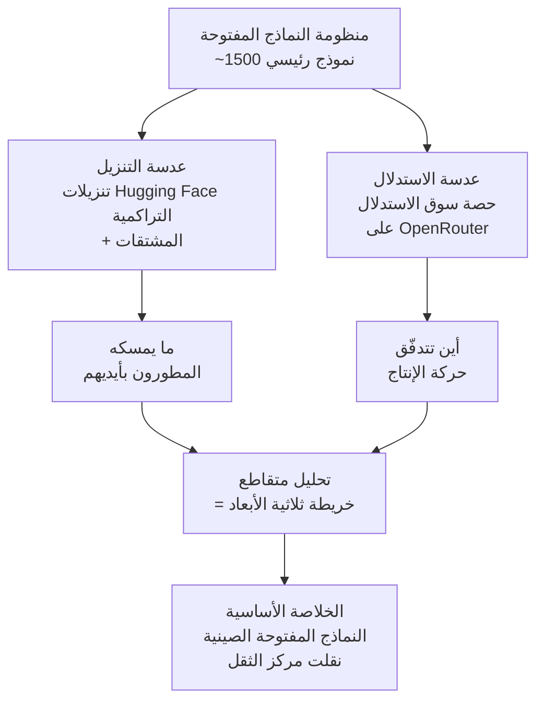

## لمن هذه المقالة

هذه المقالة موجّهة إلى المهندسين والقادة التقنيين الذين عليهم أن يقرّروا أي نموذج مفتوح يُشغّلونه على بنيتهم التحتية. إنها لمن يريد تجاوز الانطباعات من نوع "سمعت أن Llama جيد هذه الأيام" والتأكّد بالبيانات مما يُنزّله الناس فعلًا وما يُشغّلون عليه الاستدلال فعلًا. تقرير ATOM عمل نادر يقيس هذين المحورين في مكان واحد، وخلاصته أن مركز ثقل النماذج المفتوحة قد انتقل بوضوح خلال العام الماضي.

## نظرة عامة: لماذا خريطة لمشهد النماذج المفتوحة الآن

حين نتحدّث عن النماذج اللغوية المفتوحة، ننظر عادةً إلى جداول المعايير. لكن لوحة النتائج تخبرنا بما يؤدّي جيدًا لا بما يُستخدَم فعلًا. من الشائع أن يكون النموذج المتصدّر نموذجًا لا ينشره أحد تقريبًا، ومن الشائع بالقدر نفسه أن يكون نموذج بدرجات عادية هو الأكثر تبنّيًا في الميدان. بالنسبة لأي مُشغّل بنية تحتية، فإن الأخير هو الإشارة الحقيقية. فما يمسكه المجتمع بيديه ويضعه في الإنتاج هو ما يحدّد أي منظومة يجب أن نراهن عليها.

يجيب تقرير ATOM (arXiv 2604.07190، نُشر في 8 أبريل 2026) عن هذا السؤال مباشرة. أعدّته Interconnects، ويغطّي نحو 1500 نموذج مفتوح رئيسي، ويربط بين تنزيلات Hugging Face وعدد النماذج المشتقة وحصة سوق الاستدلال ومقاييس الأداء لرسم لقطة للمنظومة بأكملها. تكمن قيمته في كونه خريطة للمنظومة من أعلى إلى أسفل بدلًا من كونه تفاخر منظّمة واحدة بنجاح نموذجها.

## ماذا قاس تقرير ATOM

تبدأ المنهجية بمحاولة تجنّب فخّ المقياس الواحد. فمحاولات اختزال نجاح نموذج مفتوح في رقم واحد تُشوّه دائمًا تقريبًا. إذا نظرت إلى تنزيلات Hugging Face وحدها بولغ في تقدير النماذج ذات مجتمعات الضبط الدقيق النشطة، وإذا نظرت إلى استدعاءات واجهة الاستدلال وحدها بولغ في تقدير النماذج التي استقرّت جيدًا على الاستضافة التجارية. يفصل تقرير ATOM بين الاثنين ويضعهما جنبًا إلى جنب. الأول عدسة تنزيل تُظهر ما يسحبه المطورون ويعبثون به بأنفسهم، والثاني عدسة استدلال تُظهر أين تتدفّق حركة الإنتاج الفعلية.

النقطة الجوهرية أن هاتين العدستين تُظهران صورتين مختلفتين. على مقاييس التنزيل، تتقدّم عائلات النماذج ذات المنظومات المشتقة الكبيرة، وعلى مقاييس الاستدلال يتوزّع الاستخدام بشكل أكثر تساويًا عبر المنظّمات. لا تصبح المنظومة ثلاثية الأبعاد إلا بتراكب الصورتين الملتقطتين من زاويتين مختلفتين. وهذا الموقف المنهجي أمر يؤكّده التقرير مرارًا.

## النتيجة الأساسية: النماذج المفتوحة الصينية أعادت تشكيل المشهد

أثقل نتائج التقرير هي انقلاب في التوازن الإقليمي. تجاوزت النماذج المفتوحة الصينية المعسكر الأمريكي في صيف 2025، ووسّعت الفجوة منذ ذلك الحين بدلًا من إغلاقها. ليس هذا إصدارًا لامعًا واحدًا يتقدّم لفترة وجيزة، بل تحوّل بنيوي يُلاحَظ على محوري التنزيل والاستدلال معًا.

على محور التنزيل، الاسم الذي يرمز إلى هذا التحوّل هو Qwen. عائلة Qwen من Alibaba هي أكثر عائلة نماذج مفتوحة استخدامًا، إذ بلغت نحو مليار تنزيل تراكمي حتى مارس 2026. ويتجاوز عدد مشتقّاتها 100 ألف. تتبعها عائلات أخرى مثل Llama وDeepSeek وKimi، لكن الفجوة مع Qwen كبيرة. حمل عائلة واحدة لمنظومة مشتقة بهذا الحجم يعني أن طبقة المطورين الذين يُجرون الضبط الدقيق ويعيدون التوزيع فوقها أكثر سماكة بكثير. تعمل المنظومات بهذا النوع من الزخم. فالاستخدام الكثيف يُراكم الأدوات والوصفات، ووفرة الأدوات تدفع مزيدًا من الاستخدام.

يبدو محور الاستدلال مختلفًا قليلًا. على قياسات OpenRouter، يتوزّع الاستخدام عبر المنظّمات أكثر من تركّزه في عائلة واحدة، وضمن هذا التوزّع يتصدّر DeepSeek. يتقدّم Qwen في التنزيلات بينما يحمل DeepSeek حضورًا قويًا في الحركة الفعلية، وهذا التباين هو بالضبط سبب استحقاق العدستين قراءة منفصلة. فالنماذج التي يُنزّلها الناس للتجريب ليست بالضرورة النماذج التي يضعونها في الخدمة ويدفعون لتشغيلها.

لا يغطّي التقرير النماذج التي في مركز الاهتمام فقط. بل يتتبّع أيضًا صعود GPT-OSS، عائلة OpenAI المفتوحة الأوزان؛ والنفوذ المتنامي لمنظّمات صينية من الفئة الوسطى مثل Moonshot وZ.ai وMiniMax؛ وإشارات إلى إحراز المعسكر الأمريكي تقدّمًا متجدّدًا في النماذج المفتوحة. الملاحظة بأن المشهد تصنعه هذه الطبقة الوسطى السميكة لا بضعة أسماء في القمة تُحذّر بهدوء من خطورة استراتيجية تتّكئ على نموذج نجم واحد.

## التنزيلات والاستدلال، عدستان مختلفتان

تستحق هذه النقطة نظرة أعمق، لأن الفرق بين هاتين العدستين بالنسبة لمن يصمّم بنية تحتية ليس مسألة إحصاء بل قرار عملي.

مقاييس التنزيل مفيدة لقراءة حيوية المنظومة واتجاهها المستقبلي. فإذا انفجر عدد مشتقّات عائلة ما، فهذا يعني أن البناءات المكمّمة وتحسينات الخدمة وسكربتات الضبط الدقيق والمهايئات لتلك العائلة تتدفّق جنبًا إلى جنب. وتنمو تبعًا لذلك الأدوات ودعم المجتمع الذي يمكننا الاتّكاء عليه عند تبنّي تلك العائلة. أما مقاييس الاستدلال فمفيدة لقراءة اقتصاديات اللحظة الراهنة. فأين تتدفّق الحركة الفعلية دليل اجتماعي على أن نسبة السعر إلى الأداء لنموذج ما تنجح في الميدان، وإشارة إلى أن بنية الاستضافة على الأرجح مضبوطة له بالفعل.

أي عدسة نصدّق عند تباعد الاثنتين يعتمد على الهدف. إذا كنت تختار نموذجًا أساسيًا ليحمل خط أنابيب ضبط دقيق داخلي لفترة طويلة، فسماكة منظومة التنزيل والمشتقات أهم. وإذا كنت تختار هدف خدمة فعّال التكلفة الآن، فالحصة الفعلية في سوق الاستدلال هي البوصلة الأدق. ولهذا بالضبط يُبقي تقرير ATOM المحورين منفصلين حتى النهاية.

## دلالات لـ ThakiCloud

يتداخل هذا التحوّل في المشهد تمامًا مع المشكلة التي تستهدفها منصة ai-platform من ThakiCloud. تجدول ai-platform موارد GPU باستخدام Kueue فوق Kubernetes، وتخدم مجموعة متنوّعة من النماذج المفتوحة في بيئة متعددة المستأجرين باستخدام vLLM. منظومة نماذج مفتوحة تتّسع ويتحرّك مركز ثقلها تعني أن قائمة النماذج التي يريد عملاؤنا خدمتها تتغيّر باستمرار.

أولًا، تزداد قيمة تجريد الخدمة الذي لا يرتبط بأي عائلة نماذج واحدة. فإذا كان التباين الحالي، مع تصدّر Qwen في التنزيلات وDeepSeek في الاستدلال، قد يتغيّر مجددًا خلال ستة أشهر، فإن على البنية التحتية أن تكون قادرة على نشر وتوسيع أي عائلة تصعد بالطريقة نفسها. هذه التقلّبية هي بالضبط سبب تعامل ai-platform مع النماذج كموارد من الدرجة الأولى وتوحيدها لخط أنابيب الخدمة.

ثانيًا، يعزّز صعود الأوزان المفتوحة الحجّة الاقتصادية للنشر الداخلي والسيادي. فمع أن نماذج مفتوحة تقترب من الفئة العليا صارت قابلة للتشغيل على عنقودك الخاص دون الاعتماد على واجهات تجارية، يحصل عملاء القطاع العام والمالي والدفاعي الذين لا يمكنهم إرسال البيانات إلى الخارج على خيار حقيقي. تستهدف ThakiCloud النقطة التي تتحقّق فيها تكلفة الخدمة المنخفضة وسيادة البيانات في آنٍ معًا في مثل هذه البيئات. وكلما اتّسع مشهد النماذج المفتوحة، صار هذا الموقع أكثر إقناعًا.

ثالثًا، تقدّم منهجية تقرير ATOM ذاتها في قراءة التنزيلات والاستدلال منفصلين درسًا تشغيليًا. فحين يطلب عميل نموذجًا لأن "هذا رائج"، ينبغي أن نكون قادرين على التمييز بين ضجيج التنزيل واقتصاديات الاستدلال الحقيقية. على مزوّد البنية التحتية مسؤولية أن يوصي بأهداف الخدمة استنادًا إلى بيانات الاستخدام الفعلية لا إلى الموضة.

## الحدود والاعتراضات

ثمة تحفّظات ينبغي مراعاتها أثناء قراءة هذا التقرير. فكلٌّ من التنزيلات واستخدام الاستدلال مقياس بديل. يمكن أن تتضخّم التنزيلات بخطوط أنابيب آلية أو نسخ متطابق، وتُشوّه الزواحف وإعادة التوزيع الأرقام. وتعكس حصة الاستدلال على OpenRouter الحركة التي تمرّ عبر ذلك الموجّه فقط، فالاستخدام الهائل الذي يُشغّله كبار المُشغّلين مباشرة على بنيتهم الخاصة خارج نطاق القياس من البداية. تبقى النقاط العمياء حتى بعد تراكب العدستين.

مساواة انقلاب التوازن الإقليمي مباشرة بانقلاب في القدرة متسرّعة أيضًا. فالتبنّي نتيجة للسعر والترخيص وسهولة الوصول وزخم المنظومة معًا، لا للأداء وحده. واستخدام النماذج المفتوحة الصينية على نطاق واسع يعود إلى استراتيجيات انفتاح جريئة وحواجز دخول منخفضة بقدر ما يعود إلى أداء قوي. "واسع الاستخدام" قضية مختلفة عن "الأفضل"، وما قاسه التقرير هو الأولى.

أخيرًا، تتقادم هذه اللقطة بسرعة. ففي مجال يترنّح على مقياس الأشهر، قد تختلف خريطة أبريل 2026 قليلًا عن تضاريس اليوم بالفعل. ومع ذلك، تكمن قيمة التقرير لا في الترتيبات الفردية بل في منهجية قراءة التنزيلات والاستدلال منفصلين وفي التيار العريض بأن مركز الثقل قد انتقل. من المرجّح أن يصمد هذا التيار لفترة، وما علينا نحن المُعِدّين للبنية التحتية إلا أن نُبقي مكدّس الخدمة مفتوحًا في ذلك الاتجاه.

## المصادر

- ATOM Report: Measuring the Open Language Model Ecosystem, arXiv:2604.07190 (2026-04-08). <https://arxiv.org/abs/2604.07190>
- Interconnects, "What I've been building: ATOM Report". <https://www.interconnects.ai/p/what-ive-been-building-atom-report>
