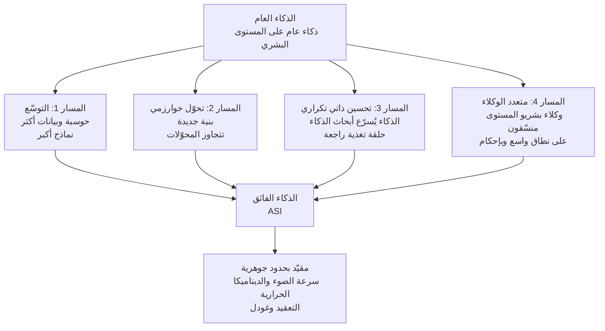

## لمن هذه المقالة

هذه المقالة موجّهة إلى المهندسين والقادة التقنيين الذين يريدون خريطة منظّمة جيدًا بدلًا من قلق غامض أو تفاؤل مبالغ فيه بشأن وجهة الذكاء الاصطناعي. تُستهلَك كلمة "الذكاء الفائق" عادةً بوصفها مفردة من الخيال العلمي، لكن الأمر مختلف حين يبدأ مختبر رائد عالميًا بالتعامل معها جديًا كمشكلة تخطيط. نقرأ معًا ماذا تتوقّع DeepMind وعلى أي أساس، وماذا يعني ذلك التوقّع لنا نحن من نبني بنية تحتية ومنصّات وكلاء حقيقية.

## نظرة عامة: الذكاء الفائق كمشكلة تخطيط لا كتجربة فكرية

يرسم تقرير Google DeepMind بعنوان From AGI to ASI (arXiv 2606.12683)، البالغ نحو 57 صفحة، الطريق من الذكاء العام على المستوى البشري إلى الذكاء الفائق، تمامًا كما يقول عنوانه. كتبه باحثون في DeepMind من بينهم Tim Genewein، ووفقًا للتغطية فهو الجزء الثالث في سلسلة متعمّدة من المختبر. بعبارة أخرى، بدأ هذا المختبر يتعامل مع الذكاء الفائق لا كموضوع يُناقَش يومًا ما بل كأمر ينبغي التخطيط له بدءًا من الآن.

هذا التحوّل في الموقف هو السبب الأول لقراءة الوثيقة. لا يؤكّد التقرير أن الذكاء الفائق سيصل حتمًا. بل يصنّف برصانة عبر أي مسارات قد يصل إن وصل، وما الذي يعيق كل مسار. هذا التصنيف، الذي لا هو متحمّس ولا خائف، هو الجزء الأكثر فائدة للممارِس. فالتوقّعات الغامضة لا تُنتِج استعدادًا، لكن حين تتّضح المسارات والاختناقات، يصبح جليًّا أين ينبغي أن ننظر وما ينبغي أن نُعِدّ له.

## المسارات الأربعة

ينظّم التقرير الطريق من الذكاء العام إلى الذكاء الفائق في أربعة مسارات. وهي ليست متعارضة، وقد تعمل عدة مسارات في آنٍ معًا متداخلة في الواقع.

الأول هو التوسّع. المسار المألوف لدفع القدرة أعلى بمزيد من الحوسبة والبيانات ونماذج أكبر. الثاني هو تحوّل النموذج الخوارزمي. بنية جديدة تتجاوز محوّلات اليوم تظهر وتستخرج قدرة أعلى بكثير من الموارد نفسها. الثالث هو التحسين الذاتي التكراري. ذكاء اصطناعي ذكي بما يكفي يبدأ بتحسين بنيته وطرق تدريبه واستدلاله، وكل تحسين يجعل التالي أسهل، فيدخل في حلقة تغذية راجعة. الرابع هو تشكّل مجموعات متعددة الوكلاء. فمن دون بناء نموذج خارق واحد، قد يبلغ تنسيق وكلاء بشريي المستوى بعدد وسرعة وقُرب كافٍ قدرةً تعادل الذكاء الفائق.

هذا المسار الرابع مثير للاهتمام بوجه خاص لأنه يعيد تعريف الذكاء الفائق لا كمشكلة نموذج عملاق واحد بل كمشكلة تنسيق وتنظيم. فحتى لو لم يتجاوز كل عضو المستوى البشري، قد يفوق الناتج الفكري للمجموعة التي يشكّلونها مجموع الأفراد بكثير. إنه المنطق نفسه الذي بنت به المجتمعات البشرية حضارة لا يفسّرها الذكاء الفردي وحده.

## التحسين الذاتي التكراري: المسار الأكثر سخونة

من بين المسارات الأربعة، الأشدّ جدلًا هو التحسين الذاتي التكراري. الفكرة الجوهرية أنه في اللحظة التي يبدأ فيها الذكاء الاصطناعي بمساعدة أبحاث الذكاء وتطويره ذاته، يساعد نظام محسّن الجولة التالية من الأبحاث بشكل أفضل، ويُسرّع النظام الأكثر تحسّنًا الجولة التي تليها، فتنفتح دورة. وإذا كانت هذه الدورة سريعة بما يكفي، فقد يحدث الانتقال من الذكاء العام إلى الفائق لا تدريجيًا بل انفجاريًا، وهذا هو سيناريو هذا المسار.

ما يثير الإعجاب في طريقة تناول التقرير لهذا المسار أنه لا يعلنه حتميًا ولا مستحيلًا. فلكي تُحدِث حلقة تحسين ذاتي انتقالًا انفجاريًا فعلًا، يجب أن تتوافق عدة شروط في آنٍ واحد، ولكل شرط اختناقه الخاص. هل تجعل كل خطوة التحسين التالي أسهل فعلًا، أم أن العوائد تتناقص؟ هل تتجاوز سرعة التحسين سرعة التحقّق وفحوص السلامة؟ تحكم هذه الأسئلة الميل الفعلي للانفجار. وبتعداد هذه الاختناقات، يسحب التقرير التحسين الذاتي التكراري من الأسطورة إلى سيناريو هندسي قابل للفحص.

## حتى الذكاء الفائق مقيّد بالقانون الفيزيائي

أكثر مقاطع هذا التقرير توازنًا هو الادّعاء بأن حتى الذكاء الفائق ليس غير محدود. لا يمكن لأي ذكاء أن يفلت من حدود فيزيائية وحسابية جوهرية. فالإشارات لا يمكن أن تسافر أسرع من الضوء، وتحمل الحوسبة كلفة طاقة دنيا تفرضها الديناميكا الحرارية، وبعض المسائل لا يمكن حلّها بكفاءة مهما بلغ ذكاء الحلّال بحسب نظرية التعقيد، وكما يُظهر عدم اكتمال غودل، بعض العبارات الصحيحة لا يمكن إثباتها داخل نظام صوري معطى.

تُنزِل حجّة الحدود هذه نقاش الذكاء الفائق إلى الأرض. فالذكاء الفائق ليس سحرًا بل لا يزال نظامًا حاسوبيًا يعمل في العالم الفيزيائي، وعلى ذلك النظام أن يعمل ضمن ميزانيات حقيقية من الطاقة والكمون وتعقيد الحوسبة. وهذا المقطع مرحّب به خصوصًا لمن يبني بنية تحتية، لأنه يوضّح أن سقف القدرة يُختزَل في النهاية إلى مسألة موارد فيزيائية. فمهما كانت الخوارزمية بارعة، فإنها تعمل على واقع فيزيائي من الطاقة والتبريد وعرض نطاق الربط البيني.

## دلالات لـ ThakiCloud

تبدو المسارات الأربعة في هذا التقرير مستقبليات مجرّدة، لكنها تتداخل بدرجة ملموسة مدهشة مع محاور تصميم المنتجات التي نبنيها. Paxis من ThakiCloud هي مستوى تحكّم من نوع Agent-Native Cloud يعمل فوق ai-platform، ويتعامل مع المهارات والأدوات والسياسات وسجلات التدقيق كموارد من الدرجة الأولى. يرتبط مساران من مسارات التقرير هنا مباشرة.

أولًا، التحسين الذاتي التكراري. يختار هيكل المهارات في Paxis من بين أكثر من 960 مهارة باستخدام BM25، ويشغّلها في صندوق رمل معزول، ويتأمّل النتائج ليحسّن المهارات ذاتها في حلقة ذاتية التطوّر. هذا ليس نسخة مصغّرة من التحسين الذاتي الانفجاري الذي يصفه التقرير، بل ممارسة تحمل الدرس المعاكس. فنحن نصمّم التحسين الذاتي لا كجموح غير قابل للسيطرة بل كتكرار قابل للتحقّق يمرّ عبر بوابات السياسة وسجلات التدقيق. وبربط كل خطوة تحسين بالمرور عبر بوابة حتمية قبل الانتقال إلى التالية، يمكننا هيكليًا سدّ الاختناق الذي يشير إليه التقرير، حيث تتجاوز سرعة التحسين سرعة التحقّق.

ثانيًا، تشكّل مجموعات متعددة الوكلاء. تعالج Paxis الأعمال المعقّدة لا بوكيل عملاق واحد بل بتنسيق وكلاء متعدد على شكل DAG يفكّكها. يركّز كل وكيل على أدوار محدّدة، ويُنتج الرسم الذي يشكّلونه ناتجًا يتجاوز مجموع القدرات الفردية. قوة التنسيق التي يتحدّث عنها المسار الرابع في التقرير أمر نتعامل معه فعلًا كنموذج تنفيذ للمنتج. والنقطة أننا نتعامل مع تنسيق الوكلاء المتعدد لا كقصة كبرى نحو الذكاء الفائق بل كطريقة لحلّ مشكلات اليوم العملية بشكل أفضل.

وحجّة الحدود ليست بلا صلة أيضًا. فحدود الديناميكا الحرارية والكمون والربط البيني التي يؤكّدها التقرير هي بالضبط مشكلات جدولة GPU والطاقة والتبريد وعرض نطاق الشبكة التي تواجهها ai-platform كل يوم. والبصيرة بأن سقف القدرة يُختزَل إلى موارد فيزيائية تعني أن من ينظّم تلك الموارد بكفاءة أكبر يصبح صاحب الميزة التنافسية. وجدولة GPU المستندة إلى Kueue وتحسين الخدمة عبر vLLM وعزل الموارد متعدد المستأجرين هي بالضبط الآليات لإنفاق تلك الميزانية الفيزيائية باقتصاد قدر الإمكان.

## الحدود والاعتراضات

ثمة أمور ينبغي ملاحظتها كي لا نبالغ في تقدير هذا التقرير. أولًا، هذه خريطة مفاهيمية لا نتائج تجريبية. فهي لا تتضمّن تنبّؤات مُتحقَّقًا منها بأي من المسارات الأربعة سيُنتِج الذكاء الفائق فعلًا، أو متى. تكمن قيمة التقرير في إطار تصنيفه لا في الإجابات، والإطار مفيد لكنه لا يكشف المستقبل بذاته.

الشكّ في فرضية الذكاء الفائق ذاتها مشروع أيضًا. فإلى أي مدى يمتدّ منحنى القدرة الحالي سؤال مفتوح، وحتى بلوغ الوجهة المسمّاة بالذكاء العام ليس مستقبلًا محسومًا. وقبل مناقشة المسارات الأربعة، فإن وصول الذكاء العام، نقطة انطلاقها، بالصورة التي نتخيّلها هو ذاته محلّ جدل. لقد رسم التقرير خريطة مشروطة لا ضمانًا للوصول.

أخيرًا، الفائدة الحقيقية لمثل هذا الخطاب للممارسة لا تكمن في التنبّؤ بالذكاء الفائق بل في شحذ مبادئ التصميم اليوم. فتخيّل خطر التحسين الذاتي الانفجاري مسبقًا يوضّح لماذا تحتاج الحلقات ذاتية التطوّر التي نبنيها اليوم إلى بوابات تحقّق. وأخذ قوة تنسيق الوكلاء المتعدد على محمل الجدّ يمنحنا سببًا لبناء تنسيق اليوم بمتانة أكبر. واستخلاص أسسٍ لممارسة قريبة المدى من وثيقة عن المستقبل البعيد هو الطريقة الأكثر عملية لقراءة هذا التقرير.

## المصادر

- From AGI to ASI, arXiv:2606.12683 (2026). <https://arxiv.org/abs/2606.12683>
- Google DeepMind, "From AGI to ASI" publication page. <https://deepmind.google/research/publications/239142/>
