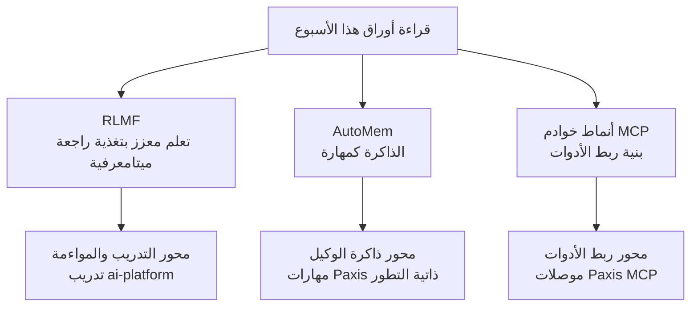

## نظرة عامة

من الصعب متابعة كل الأوراق البحثية التي تصدر في مجال الذكاء الاصطناعي أسبوعياً. لهذا السبب تُعد التجميعات الأسبوعية مثل "أبرز أوراق الذكاء الاصطناعي هذا الأسبوع" الصادرة عن dair.ai مفيدة جداً. تضمنت قائمة هذا الأسبوع (28 يونيو حتى 5 يوليو) عدة أوراق أبرزها RLMF و AutoMem وأنماط خوادم MCP.

بدلاً من سرد القائمة كما هي، نختار في هذا المقال ثلاث أوراق ذات دلالة خاصة من منظور البنية التحتية للذكاء الاصطناعي التي تشغّلها ThakiCloud (ai-platform) ومنصة Agent-Native Cloud الخاصة بها (Paxis)، ونتعمق في قراءتها. تتناول الأوراق الثلاث محاور مختلفة هي التدريب (التعلم المعزز)، وذاكرة الوكيل، وربط الأدوات (MCP)، لكنها تشترك جميعاً في معالجة مسألة "جعل الوكيل أكثر جدارة بالثقة". سنستعرض جوهر كل ورقة إلى جانب دلالاتها بالنسبة لمنتجاتنا.

يمكن تلخيص المحاور الثلاثة في الرسم التالي.

## RLMF: تعلم معزز يتعلم من التغذية الراجعة الميتامعرفية

الورقة الأولى هي RLMF، التي تُدخل مفهوم الميتامعرفة (metacognition) إلى التعلم المعزز. يعتمد التعلم المعزز القياسي على منح المكافأة بناءً على صحة النتيجة فقط. أما RLMF فيضيف إلى ذلك قدرة النموذج على تقييم حدود قدراته الذاتية والتعبير عنها، أي التغذية الراجعة الميتامعرفية، وذلك لتحسين ترتيب النتائج المكتملة أثناء عملية تحسين التفضيلات.

تفيد الورقة بأن هذا الأسلوب يتفوق على التعلم المعزز القياسي بنسبة تصل إلى 63% في مهام متنوعة مع الحفاظ على الدقة. والأهم من مجرد رفع معدل الإجابات الصحيحة هو أن النموذج يصبح أكثر صدقاً في التعبير عن "أنا لست متأكداً من هذا". فالقدرة على الإفصاح عن عدم اليقين بصدق ترتبط مباشرة بالمواءمة (alignment)، وتشكل أساساً يمكن الاعتماد عليه في خطوط الأتمتة لتحديد متى ينبغي على النموذج تسليم القرار إلى إنسان.

هذه النقطة تتقاطع مع منظور ai-platform الخاص بـ ThakiCloud. تدير ai-platform مراحل التدريب اللاحق (post-training) مثل SFT و DPO و GRPO فوق بنية جدولة GPU قائمة على K8s و Kueue. ونهج مثل RLMF، الذي يدمج الميتامعرفة مع إشارة المكافأة، يشير إلى إمكانية توسيع وصفات التدريب بحيث تُنتج، عند قيام العملاء بمواءمة النماذج ببياناتهم الخاصة، نموذجاً "يعرف حدوده" بدلاً من نموذج "دقيق لكنه مفرط الثقة".

## AutoMem: الذاكرة كمهارة قابلة للتعلم

الورقة الثانية، AutoMem، حققت أكثر النتائج إثارة للاهتمام في قائمة هذا الأسبوع. يتعامل باحثو ستانفورد مع إدارة ذاكرة الوكيل ليس كقواعد ثابتة بل **كمهارة قابلة للتعلم**. المنظور هنا هو أن معرفة ما ينبغي تذكره (encode)، ومتى يُستدعى (retrieve)، وكيفية تنظيم المعرفة، هي في حد ذاتها خبرة يمكن تدريبها.

الأرقام مثيرة للإعجاب. رفع AutoMem أداء وكيل Qwen2.5-32B-Instruct بمقدار مرتين إلى أربع مرات تقريباً حسب المهمة. فيما يلي نتائج معايير الوكلاء التي أوردتها الورقة (جميع الأرقام كما وردت في الورقة نفسها).

| المعيار | AutoMem (Qwen2.5-32B) | Claude Opus 4.5 |
|---|---|---|
| Crafter | 51.36 | 49.5 |
| MiniHack | 30.00 | 27.5 |
| NetHack | 1.85 | 2.0 |

الجوهر هنا هو أن تدريب مهارة واحدة هي إدارة الذاكرة يمكّن نموذجاً مفتوحاً بحجم 32B من مضاهاة نموذج تجاري أكبر بكثير أو حتى تجاوزه. وهذا يُظهر أن "إدارة ذاكرة أفضل"، وليس "نموذجاً أكبر"، قد تكون العنق الزجاجي الحقيقي لأداء الوكيل.

تتقاطع AutoMem تماماً مع منظور Paxis. فـ Paxis هي منصة Agent-Native Cloud تتعامل مع المهارات كمورد من الدرجة الأولى، وتدير من خلال المهارات ذاتية التطور ومحرك المعرفة (HKE) ما يجب على الوكيل تذكره وكيفية تنظيمه. وأطروحة AutoMem القائلة بأن "الذاكرة مهارة" تسير في نفس اتجاه تصميم Paxis الذي يتعامل مع الذاكرة كقدرة يتم تعلمها وتوجيهها، لا كمخزن منفصل. وبالنسبة للعملاء الذين يشغّلون نماذج مفتوحة عبر الاستضافة الذاتية، تحمل هذه النتيجة دلالة عملية كبيرة: يمكن رفع جودة الوكيل عبر تحسين مهارة الذاكرة وحدها دون الحاجة لتكبير حجم النموذج.

## أنماط خوادم MCP: خمس بنيات معمارية لربط الأدوات

الورقة الثالثة هي ورقة خبرة صناعية تستعرض أنماط البنية المعمارية لخوادم MCP (بروتوكول سياق النموذج) المخصصة للتطبيقات المدمجة مع نماذج اللغة الكبيرة. MCP هو واجهة موحدة كشفت عنها Anthropic في نوفمبر 2024 لربط نماذج اللغة الكبيرة بالأدوات والبيانات والخدمات الخارجية. تجمع هذه الورقة خمسة أنماط لخوادم MCP تتكرر باستمرار في الممارسة العملية.

- **بوابة الموارد (Resource Gateway)**: بوابة تكشف مصادر البيانات الخارجية بتركيز على القراءة.
- **منسق الأدوات (Tool Orchestrator)**: منسق ينظم استدعاءات أدوات متعددة.
- **خادم الجلسات ذات الحالة (Stateful Session Server)**: خادم يحافظ على حالة الجلسة.
- **مجمّع الوكلاء (Proxy Aggregator)**: وكيل يجمع عدة خوادم MCP في خادم واحد.
- **المهايئ الخاص بمجال معين (Domain-Specific Adapter)**: مهايئ متخصص في مجال محدد.

توفر هذه الأنماط الخمسة مفردات مشتركة للسؤال العملي "ما البنية التي ينبغي اعتمادها عند تصميم الخادم" حين يُدمج MCP في بيئة الإنتاج. فمع تزايد عدد اتصالات الأدوات، يصبح دور كل خادم ضبابياً وتصعب المراقبة والأمان، وهنا تساعد لغة الأنماط في تنظيم الأمور.

تتعامل Paxis مع موصلات MCP كمورد من الدرجة الأولى، وتدير الاتصال بالخدمات الخارجية بما في ذلك إعادة الاتصال التلقائي عبر OAuth. ومن بين الأنماط الخمسة أعلاه، يتوافق نمطا Proxy Aggregator و Tool Orchestrator مباشرة مع بنية Paxis التي تجمع خوادم MCP متعددة خلف بوابات سياسة وسجلات تدقيق، وتقدمها في بيئة متعددة المستأجرين. وهكذا يتوسع نمط ربط خادم MCP واحد محلياً من قبل مطور فردي، ليصبح مستوى تحكم يجمّع بأمان عدداً كبيراً من الموصلات لمستأجرين متعددين.

## تركيب من منظور ThakiCloud

إذا جمعنا الأوراق الثلاث في جملة واحدة، فإن طريق جعل الوكيل أكثر جدارة بالثقة ينفتح على ثلاثة مسارات. RLMF يجعل النموذج يعرف حدوده في مرحلة التدريب، و AutoMem يتعامل مع الذاكرة كمهارة في مرحلة التنفيذ بحيث يمكن استخدام نموذج صغير بفعالية كبيرة، وأنماط خوادم MCP تنظّم دمج الأدوات في مرحلة الاتصال.

يتقاسم منتجا ThakiCloud هذه المسارات الثلاثة. تدعم ai-platform مراحل التدريب اللاحق مثل RLMF بتكلفة منخفضة فوق البنية التحتية لوحدات معالجة الرسوميات، بينما تدير Paxis مهارة الذاكرة التي تتحدث عنها AutoMem وربط الأدوات الذي تتناوله أنماط MCP كموارد من الدرجة الأولى ضمن منصة Agent-Native Cloud. بدلاً من الاعتماد على نموذج واحد كبير، يتجه المسار نحو تحسين التدريب والذاكرة والاتصال كل على حدة لبناء اقتصاديات فعالة للوكيل.

## القيود والاعتراضات

هناك بعض النقاط التي تستحق التوضيح. أولاً، جميع الأرقام المرجعية أعلاه هي قيم أوردتها الأوراق نفسها، وليست نتائج أعدنا إنتاجها بأنفسنا. ومعايير الوكلاء مثل Crafter و MiniHack و NetHack حساسة تجاه البذرة العشوائية وإعدادات البيئة، لذا يلزم إعادة إنتاج مستقلة قبل أي تطبيق فعلي على المنتج.

ثانياً، نتيجة "الذاكرة مهارة" التي توصلت إليها AutoMem جاءت من بيئة وكيل محددة (معايير على شكل ألعاب). ويحتاج الأمر إلى تحقق منفصل لمعرفة ما إذا كان التحسن بنفس الحجم سيظهر في مجالات ذات خصائص ذاكرة مختلفة، مثل الحوارات الطويلة الأمد أو البحث في المستندات أو استكشاف قواعد الشيفرة في الممارسة العملية.

ثالثاً، ورقة أنماط MCP هي تجميع لخبرة صناعية وليست تقييماً كمياً. الأنماط الخمسة مفردات مشتركة مفيدة، لكن الأنسب من بينها لكل موقف يختلف باختلاف حمل الفريق ومتطلبات الأمان ومستوى المراقبة. من الأسلم استخدام الأنماط كنقطة انطلاق لا كمعيار قاطع.

تكمن قيمة القراءة الأسبوعية للأوراق البحثية في النهاية في القدرة على الاستشعار السريع لما يتحرك الآن. شهد هذا الأسبوع محاولات في محاور التدريب والذاكرة والاتصال جميعها لرفع موثوقية الوكيل، وتتقاطع كثير منها مع مسائل تتعامل معها ThakiCloud بالفعل ضمن منتجاتها.

## المصادر

- [dair.ai AI Papers of the Week (GitHub)](https://github.com/dair-ai/ML-Papers-of-the-Week)
- [RLMF: Reinforcement Learning with Metacognitive Feedback (arXiv 2606.32032)](https://arxiv.org/abs/2606.32032)
- [AutoMem: Automated Learning of Memory as a Cognitive Skill (arXiv 2607.01224)](https://arxiv.org/abs/2607.01224)
- [MCP Server Architecture Patterns for LLM-Integrated Applications (arXiv 2606.30317)](https://arxiv.org/abs/2606.30317)
