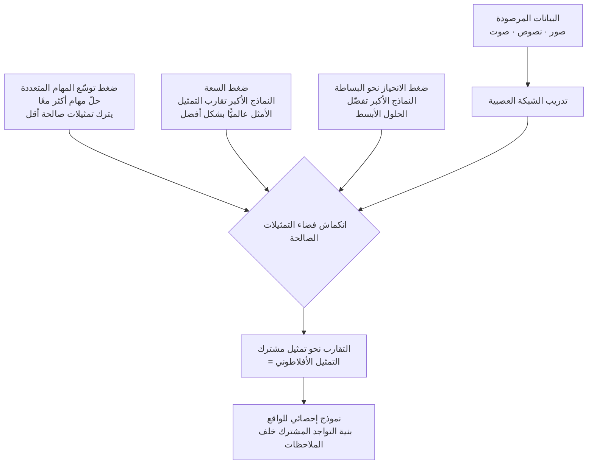

## لمن هذه المقالة

هذه المقالة موجَّهة للمهندسين وعلماء البيانات الذين يخدمون أنواعًا متعددة من النماذج الأساسية على منصّة واحدة، أو يصمّمون خطوط البحث والتوصية والمعالجة متعددة الوسائط القائمة على التضمين. تتناول النظرية الكامنة خلف أسئلة عملية مثل: "لماذا ينجح فرض محاذاة تضمينَي نموذجين أكثر مما نتوقّع؟" و"لماذا لا ينهار الأداء اللاحق عند استبدال النماذج؟". نقرأ فرضية التمثيل الأفلاطوني التي قدّمها باحثو MIT في مؤتمر ICML 2024 مع أدلّتها، ونتابعها حتى دلالاتها في تصميم المنصّات الفعلي.

## نظرة عامة

لماذا تتشابه الشبكات العصبية المدرَّبة من فرق مختلفة، على بيانات مختلفة، وبأهداف مختلفة، أكثر فأكثر مع الوقت؟ يبدأ السؤال من ملاحظة قديمة. درِّب نموذجَي رؤية بطريقتين مختلفتين، ومع ذلك يتقارب حكمهما على أي أزواج الصور قريبة وأيها بعيدة كلما كبرا. والأكثر إثارة أن هذا التشابه يعبر الوسائط. نموذج لغوي لم يرَ صورة قط ونموذج رؤية لم يرَ نصًّا قط يبدآن في إعادة إنتاج بنية المسافة بين نقاط البيانات بالطريقة نفسها.

تربط مقالة «فرضية التمثيل الأفلاطوني» لمينيونغ هوه، وبراين تشيونغ، وتونغجو وانغ، وفيليب إيسولا (arXiv:2405.07987, ICML 2024 Oral) هذه الملاحظة في ادّعاء واحد: تمثيلات الشبكات العصبية تتقارب، عبر البنى والأهداف، نحو نموذج إحصائي مشترك واحد للواقع. واستعارةً من مُثُل أفلاطون، يسمّي المؤلفون النهاية المثالية لهذا التقارب "التمثيل الأفلاطوني". تعرض هذه المقالة ما هي الأدلة، وكيف قيست، ولماذا تحمل الفرضية ثقلًا عمليًّا لكل من يشغّل نماذج كثيرة فعلًا.

## ما الذي تقوله فرضية التمثيل الأفلاطوني

الجملة الجوهرية بسيطة. سواء أكانت صورة أم نصًّا أم صوتًا، فإن البيانات التي نرصدها إسقاطات مختلفة لواقع أساسي مشترك. النموذج الكبير والكفء بما يكفي يعكس تلك الإسقاطات، فيعيد بناء البنية الإحصائية للواقع الأساسي بدقة متزايدة. ونتيجة لذلك، تتقارب النماذج المدرَّبة بمعزل عن بعضها نحو الوجهة نفسها.

هنا لا تعني عبارة "التمثيلات متطابقة" أن الأوزان متطابقة أو أن الخلايا العصبية تتناظر واحدة لواحدة. تعني أن نواة المسافة (kernel) التي يحدّثها التمثيل فوق البيانات، أي أي العينات جيران وأيها بعيدة، تصبح واحدة. حتى لو استخدم تمثيلان نظامَي إحداثيات مختلفين، فإذا تطابقت العلاقات النسبية بين نقاط البيانات، حمل التمثيلان الهندسة نفسها جوهريًّا.

يقلب هذا حدسًا قديمًا حول تعلّم التمثيل. كثيرًا ما نتوقّع أنه بمزيد من البيانات ونماذج أكبر تصبح التمثيلات أكثر تنوّعًا وتخصّصًا. تقول الفرضية العكس: كلما كبر الحجم، ضاق فضاء التمثيلات الصالحة، وانضغط كل شيء نحو تمثيل أمثل واحد.

## الأدلة: ماذا قيس وكيف

كون الادّعاء مثيرًا للاهتمام ليس كونه صحيحًا. يضع المؤلفون مقياسًا يكمّم التقارب، ويتحقّقون مما إذا كان هذا المقياس يرتفع فعلًا عبر عائلات النماذج.

الأداة المركزية هي محاذاة الجار الأقرب المتبادل (mutual nearest-neighbor). مرِّر مجموعة البيانات نفسها عبر نموذجين، واحصل على تضمين كلٍّ منهما، ثم عُدّ مقدار تداخل مجموعة الجيران الأقرب لعيّنة عبر فضاءَي التمثيل. كلما زاد التداخل، رأى النموذجان بنية الجيران في البيانات بالطريقة نفسها، فيرتفع درجة المحاذاة. وإلى جانب هذا المقياس، تشير طرق مكمّلة مثل محاذاة النواة المركزية (CKA) وخياطة النماذج (model stitching) إلى النتيجة نفسها.

الدليل الأول هو التقارب داخل الرؤية. يقارن المؤلفون 78 نموذج رؤية على مجموعة بيانات Places-365. النتيجة واضحة: النماذج الأكفأ على المعايير اللاحقة (VTAB, Visual Task Adaptation Benchmark) تتحاذى بقوّة أكبر فيما بينها. تشكّل النماذج عالية القدرة كتلة واحدة متراصّة، بينما تتبعثر النماذج منخفضة القدرة. ومع ارتفاع الأداء، تتجمّع التمثيلات معًا.

الدليل الثاني أكثر استفزازًا: المحاذاة عبر الوسائط. باستخدام أزواج صورة-نص لمقارنة تمثيل الصورة في نموذج رؤية بتمثيل النص في نموذج لغوي، كلما زادت كفاءة النموذج اللغوي، تحاذى تمثيله النصّي بشكل أفضل مع تمثيل الصورة في نموذج رؤية قوي. نموذج نصّي فقط ونموذج صور فقط يتحرّكان نحو بنية المسافة نفسها كلما تحسّنا. هنا تكتسب الفرضية اسمها. التقارب ليس صدفة داخل وسيط واحد بل اتجاه يعبر الوسائط.

## الضغوط الثلاثة التي تقود التقارب

إلى جانب الملاحظة، يفسّر المؤلفون سبب حدوث هذا التقارب عبر ثلاث فرضيات فرعية. يلخّص المخطّط أدناه كيف تصبّ الضغوط الثلاثة في تمثيل مشترك واحد.

الأولى هي فرضية توسّع المهام المتعددة. كلما وجب على النموذج حلّ مهام أكثر في آنٍ واحد، قلّت التمثيلات التي تُرضيها جميعًا. التمثيلات التي تحلّ مهمة واحدة لا تُحصى، أما التي تحلّ المئات في آنٍ واحد فقليلة جدًّا. ومع نموّ البيانات والمهام، يضيق التقاطع الباقي، وتتزاحم نماذج مختلفة في ذلك التقاطع الضيّق.

الثانية هي فرضية السعة. النماذج الأكبر، بأمثلة أفضل وفضاء دوال أوسع، تقارب التمثيل الأمثل عالميًّا بشكل أدقّ بغضّ النظر عن اختلافات البنية أو طريقة التدريب. تستقرّ النماذج الصغيرة في نقاط مثلى محلّية مختلفة، لكن مع نموّ السعة تنجذب جميعها نحو النقطة المثلى العالمية نفسها.

الثالثة هي فرضية الانحياز نحو البساطة. تميل الشبكات العصبية، سواء عبر التنظيم الصريح أو الطبيعة الضمنية للأمثلة، إلى تفضيل الحلول الأبسط بين الكثير مما يفسّر البيانات. ومع نموّ النماذج يشتدّ هذا الانحياز. فحتى مع ظهور حلول أعقد قابلة للتمثيل، تشتدّ القوّة الدافعة نحو الأبسط والأعمّ. ونتيجةً لذلك، تتجمّع النماذج الأكبر عند أوجز بنية مشتركة تفسّر البيانات.

## النهاية المثالية: نموذج إحصائي للواقع

ما النهاية التي تصوّبها الضغوط الثلاثة؟ يصوغها المؤلفون نظريًّا. عُدّ العالم سلسلة من أحداث منفصلة، والصور والنصوص التي نرصدها إسقاطات مختلفة لتلك الأحداث؛ عندئذٍ ينتهي التمثيل الأمثل بنواة تتقارب نحو المعلومات المتبادلة النقطية (pointwise mutual information, PMI) على الأحداث المتواجدة معًا. بعبارة بسيطة، يلتقط التمثيل المثالي إحصاءات التواجد المشترك لـ"ما يميل إلى الظهور معًا في الواقع".

وهذا أيضًا سبب عبور التقارب للوسائط. فإذا كانت الصورة والنص هما الواقع نفسه مرئيًّا عبر نوافذ مختلفة، فإن بنية التواجد المشترك خلف النافذة واحدة. النموذج الكفء بما يكفي يصل إلى البنية نفسها بغضّ النظر عن النافذة التي يدخل منها. اسم التمثيل الأفلاطوني يشير إلى هذا الواقع الإحصائي المشترك خلف الملاحظات.

## دلالات لمنصّة ThakiCloud

مجرّدةً كما تبدو، تحمل الفرضية دلالات ملموسة جدًّا لمنصّة تخدم نماذج كثيرة. تخدم منصّة ai-platform من ThakiCloud أنواعًا كثيرة من النماذج لبيئات عملاء متنوّعة فوق جدولة GPU القائمة على Kubernetes وKueue. تتعايش مشفّرات رؤية مختلفة، ونماذج تضمين مختلفة، وأجيال LLM مختلفة على منصّة واحدة.

الدلالة الأولى هي قابلية التشغيل البيني بين النماذج. إذا تقاربت تمثيلات النماذج الكفؤة نحو هندسة مشتركة، قلّت الحاجة إلى عزل كل فضاء تضمين تمامًا لكل نموذج. عند استبدال مخزن متجهات مفهرس بنموذج تضمين بنموذج أحدث، إذا شارك التمثيلان بنية جيران جوهرية، أمكن إدارة تكلفة إعادة الفهرسة وتراجع الأداء اللاحق ضمن نطاق متوقَّع. الافتراض بأن استبدال نموذج يعني إعادة بناء خطّ التضمين بأكمله يخفّ حيث يكون التقارب قويًّا.

الدلالة الثانية هي اقتصاد المحاذاة متعددة الوسائط. إذا كانت نماذج الرؤية القوية ونماذج اللغة القوية تتحرّك أصلًا نحو المحاذاة، أمكن لمهايئ (adapter) رفيع بين الوسيطين التقاط محاذاة كبيرة. يصبح تصميمٌ يحدّث بشكل مستقلٍّ أحدث نموذج لكل وسيط ويضع فوقه طبقة محاذاة خفيفة خيارًا واقعيًّا يجمع كفاءة الموارد وسرعة التحديث معًا في بيئة متعددة المستأجرين.

الدلالة الثالثة تخصّ المقارنة المعيارية. الادّعاء بأن التمثيلات تتقارب مع ارتفاع الكفاءة يوحي بأنه عند تقييم عدّة نماذج مرشّحة في بيئات محلّية أو سيادية، يمكن استخدام محاذاة التمثيل إشارة تشخيصية واحدة. إذا كانت محاذاة الجار الأقرب المتبادل لنموذجين منخفضة، فقد يشير ذلك إلى أن أحدهما ما زال أقلّ كفاءة أو أن المجالات غير متطابقة. تصبح المحاذاة إشارة منخفضة التكلفة تكمّل معايير الدقّة.

## القيود والحجج المضادة

كلما زادت جاذبية الفرضية وجب أن نبني الحجّة المعاكسة بأمانة. الحجّة الأولى أن التقارب قد ينبع من تجانس اجتماعي لا من واقع أفلاطوني. تشترك نماذج اليوم إلى حدّ كبير في البيانات نفسها بمقياس الويب، وبنى عائلة transformer نفسها، وممارسات الأمثلة نفسها. يصعب استبعاد أن تتشابه التمثيلات لمجرّد أن الجميع يطبخ بالمكوّنات نفسها، لا بسبب التقارب نحو واقع أساسي.

الحجّة الثانية هي الفروق غير القابلة للاختزال بين الوسائط. توجد معلومات لا توجد إلا في الرؤية ولا تُلتقط أبدًا في اللغة، والعكس صحيح. الادّعاء القوي بأن كل التمثيلات تتقارب في واحد يخاطر بالتقليل من شأن ما يحمله كل وسيط تحديدًا. وبالفعل، لا تتقارب النماذج المدرَّبة لأهداف متخصّصة أو التمثيلات المصمّمة للحفاظ على معلومات مختلفة.

الحجّة الثالثة هي اعتماد القياس على التأويل. مقاييس مثل الجار الأقرب المتبادل وCKA تفترض مفهومًا محدَّدًا للمسافة، وقد تتغيّر صورة المحاذاة تبعًا للمقياس المختار. النتيجة القائلة بأن "التمثيلات تتقارب" تعتمد إلى حدّ ما على اختيار المقياس وتوزيع البيانات، وهي مسألة مفتوحة تواصل دراسات إعادة الإنتاج اختبارها.

ومع ذلك، تكمن القيمة العملية لهذه الفرضية لا في ميتافيزيقا النهاية بل في الاتجاه. الاتجاه نحو بنية مشتركة كلما نمت الكفاءة يُلاحَظ مرارًا عبر المقاييس، ولكل من يصمّم بنية متعددة النماذج، يكفي هذا الاتجاه وحده ليكون بوصلة عملية.

## المصادر

- Minyoung Huh, Brian Cheung, Tongzhou Wang, Phillip Isola, "The Platonic Representation Hypothesis", ICML 2024 (arXiv:2405.07987): [arxiv.org/abs/2405.07987](https://arxiv.org/abs/2405.07987)
- الكود والمشروع: [github.com/minyoungg/platonic-rep](https://github.com/minyoungg/platonic-rep)
