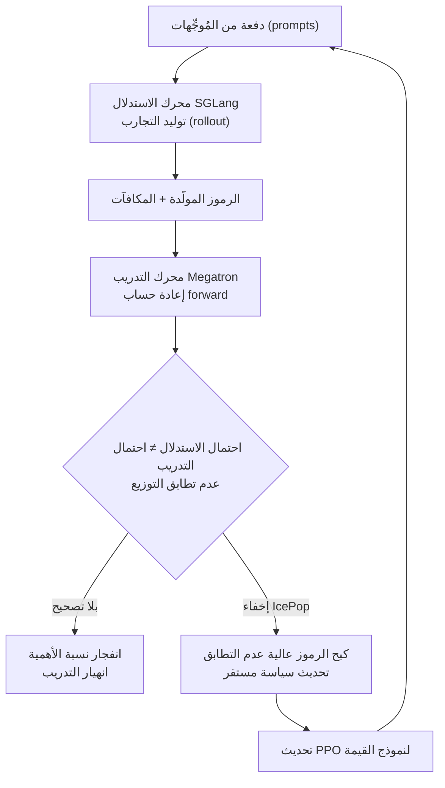

أي فريق خاض تجربة تشغيل التعلم المعزز (RL) الفعلي كتدريب لاحق للنماذج اللغوية الكبيرة يعرف أن اتجاه العام أو العامين الماضيين كان منحازًا لجهة واحدة. منذ أن كشفت DeepSeek عن GRPO، أصبح التخلص من نموذج القيمة (critic) المنفصل وتقدير الأفضلية (advantage) بالاعتماد فقط على المكافأة النسبية داخل المجموعة أشبه بالمعيار الفعلي. بما أن الـ critic لم يعد بحاجة إلى تدريب، توفَّرت الذاكرة والحوسبة، وأصبح التنفيذ أبسط. وقد شاع القول بأن «الـ critic لم يعد ضروريًا» كأنه حقيقة شبه مسلَّم بها.

لكن GLM-5.2 الذي كشفت عنه Zhipu يسير عكس هذا التيار تمامًا. تخلى هذا النموذج عن الأسلوب النسبي الجماعي وعاد إلى PPO باستخدام نموذج قيمة مدرَّب من جديد، وعالج بدلاً من ذلك عدم التطابق بين توزيعي التدريب والاستدلال، وهو أحد أكبر مصادر عدم الاستقرار المزمنة في التعلم المعزز، عبر تقنية تُسمى IcePop. والمثير أن هذا الاختيار ليس مجرد رجوع بسيط، بل يحمل طابع الدحض العملي للفكرة الشائعة مؤخرًا بأن «GRPO هو الحل الشامل».

*تصوير لتحول الاتجاه في التدريب اللاحق بالتعلم المعزز، من التخلي عن الـ critic إلى استعادته مجددًا.*

## نظرة عامة

GLM-5.2 نموذج مفتوح الأوزان بنافذة سياق تصل إلى مليون رمز (token)، ويُظهر أداءً قويًا في اختبارات المعايير الطويلة النفَس للبرمجة والوكلاء (agents). ما يتناوله هذا المقال ليس أرقام أداء النموذج نفسه، بل قرارات التصميم في التدريب اللاحق بالتعلم المعزز التي أنتجت هذا الأداء. والجوهر هنا نقطتان. الأولى، العودة إلى PPO باستخدام نموذج قيمة مدرَّب بدلاً من الأسلوب النسبي الجماعي (GRPO). والثانية، تخفيف عدم التطابق بين التدريب والاستدلال الناتج عن ذلك عبر IcePop، مع إزالة حد التنظيم KL الذي كان موجودًا في الصياغة الأصلية لـ IcePop من أجل رفع سرعة تحسّن التعلم المعزز.

هذا الموضوع مهم من منظور ThakiCloud لسبب واضح. خط أنابيب تدريب النماذج اللغوية الكبيرة الذي نشغّله يدعم عدة أساليب للتدريب اللاحق مثل SFT وCPT وDPO وGRPO وGKD. اختيار منهجية التعلم المعزز ليس مجرد تفضيل خوارزمي، بل قرار بنيوي يؤثر مباشرة في ميزانية وحدات معالجة الرسوميات (GPU) واستقرار التدريب وقابلية إعادة الإنتاج. حالة GLM-5.2 تدفعنا إلى إعادة طرح السؤال، ليس «ماذا نستخدم» بل «لماذا نستخدمه».

## الجدار الذي اصطدم به GRPO: ثمن التخلي عن الـ critic

لنبدأ أولاً بسبب انتقال هذا العدد الكبير من الفرق إلى GRPO. الـ PPO التقليدي بنية actor-critic. السياسة (actor) تولّد الرموز، ونموذج قيمة منفصل (critic) يقدّر المكافأة المتوقعة لكل حالة. من هذا التقدير تُحسب الأفضلية (advantage، غالبًا عبر GAE)، وتُحدَّث السياسة عبر دالة هدف بديلة (surrogate) مقصوصة (clipped). المشكلة هي تكلفة تدريب هذا الـ critic. يجب إضافة نموذج آخر بحجم يقارب حجم السياسة نفسها، وإذا تقارب الـ critic بشكل خاطئ، يهتز التدريب بأكمله.

يتخلى GRPO عن هذا الـ critic تمامًا. بعد أخذ عينات من عدة استجابات لنفس المُوجِّه (prompt)، يُطبَّع المكافأة داخل تلك المجموعة، فتُبنى الأفضلية اعتمادًا فقط على التفوق النسبي. باختفاء الـ critic، تنخفض الذاكرة المستخدمة، ويختفي معه عدم استقرار تدريب نموذج القيمة. وبفضل أناقته الرياضية أيضًا، انتشر بسرعة.

لكن لا توجد وجبة مجانية. تتلاشى إشارة الأفضلية في الأسلوب النسبي الجماعي عندما يكون التباين داخل المجموعة صغيرًا، أي عندما تكون الاستجابات متقاربة في الجودة سواء كانت جيدة أو سيئة. كذلك يصعب إسناد الفضل (credit assignment) الدقيق على مستوى الرمز في التسلسلات الطويلة. لو وُجد نموذج قيمة، لأمكن تقدير «مدى إسهام هذا الرمز في المكافأة النهائية» لكل حالة، لكن التطبيع الجماعي وحده لا يوفر هذه الدقة. تبرز هذه المحدودية بوضوح في المسائل ذات المسارات الطويلة والمكافآت النادرة، كأعمال البرمجة والوكلاء طويلة النفَس. وهذا بالضبط المجال الذي استهدفه GLM-5.2.

## اختيار GLM-5.2: PPO بإحياء نموذج القيمة

هنا يستعيد فريق GLM-5.2 نموذج القيمة المدرَّب. أي أنهم يستعيدون الـ critic الذي تخلى عنه GRPO، لاستعادة دقة تقدير الأفضلية على مستوى الرمز. وعلى عكس التصور السائد بأن «ضجة PPO مبالغ فيها»، راهن الفريق على أن نموذج قيمة مدرَّبًا جيدًا يمنح إشارة أكثر استقرارًا في المسارات الطويلة.

المشكلة أن استعادة الـ critic تعيد معها أيضًا عدم استقرار التدريب المذكور سابقًا. وهنا تضاف مشكلة جديدة خاصة ببنى التعلم المعزز الحديثة، وهي عدم التطابق بين توزيعي التدريب والاستدلال.

## IcePop: كيفية معالجة عدم التطابق بين التدريب والاستدلال

يتنقل التدريب اللاحق الحديث بالتعلم المعزز بين محركين مختلفين. يتولى توليد التجارب (rollout) محرك استدلال عالي الإنتاجية مثل SGLang، بينما يتولى حساب forward الفعلي لتحديث السياسة محرك تدريب مثل Megatron. المشكلة أن هذين المحركين، حتى لو استخدما نفس أوزان النموذج، يختلفان في تنفيذ النواة (kernel) والدقة العددية وترتيب العمليات، فينتجان احتمالات مختلفة قليلاً لنفس الرمز.

يصحّح التعلم المعزز عادةً هذه الفجوة عبر أخذ العينات بالأهمية (importance sampling)، أي ضرب نسبة احتمال السياسة وقت الاستدلال إلى احتمالها وقت التدريب. لكن عند الرموز التي يتباعد فيها التوزيعان، تنفجر هذه النسبة صعودًا أو هبوطًا بشكل حاد. وإذا سيطرت بضعة رموز ذات نسبة متطايرة على التدرّج (gradient)، يهتز التدريب بأكمله، وقد ينهار في الحالات الشديدة. وكلما طال المسار، أي زاد عدد الرموز، ارتفع احتمال تراكم هذا التطاير. وكان هذا تحديًا حاسمًا بالنسبة لـ GLM-5.2 الذي استهدف الأعمال طويلة النفَس.

يتصدى IcePop لهذا التطابق المفقود مباشرة. فهو يحدد الرموز التي يتباعد فيها توزيع الاستدلال عن توزيع التدريب بشكل كبير، ويكبح إسهام تلك الرموز أو يخفيها، بحيث لا ينجرف التدرّج خلف عدد قليل من الرموز غير المستقرة. والنتيجة أن إشارة الرموز المستقرة فقط هي التي تنعكس على تحديث السياسة. بهذه الطريقة يمكن الاستفادة من مزايا PPO بإحياء نموذج القيمة، مع تجنب الانهيار الناتج عن عدم التطابق بين التدريب والاستدلال.

النقطة التي يختلف فيها GLM-5.2 عن IcePop الأصلي هي إزالة حد التنظيم KL. تفرض كثير من وصفات التعلم المعزز عقوبة KL لمنع السياسة من الابتعاد كثيرًا عن السياسة المرجعية. يرفع هذا الحد الاستقرار، لكنه في الوقت نفسه يكبح المدى الذي يمكن أن تتحسن فيه السياسة. رأى فريق GLM-5.2 أن إخفاء IcePop لعدم التطابق في التوزيع يعالج بالفعل جزءًا كبيرًا من عدم الاستقرار، فأزالوا حد KL للسماح للسياسة بالتحسن بجرأة أكبر. وبذلك استغنوا عن أداة استقرار واحدة، وأوكلوا دورها إلى انتقاء الرموز في IcePop.

## البنية التحتية: slime وMegatron وSGLang

لكي لا تبقى هذه الخوارزمية مجرد فكرة على الورق وتعمل فعليًا، لا بد من بنية تحتية تتحمل توسّع التعلم المعزز. جرى التدريب اللاحق لـ GLM-5.2 على إطار عمل لتوسيع التعلم المعزز يُسمى slime، ويستخدم Megatron-LM للتدريب الموزَّع وSGLang لتوليد التجارب عالي الإنتاجية. وعدم التطابق بين التدريب والاستدلال الذي شرحناه سابقًا ينبع بالضبط من هذا التكوين. تتباعد الاحتمالات لأن Megatron (التدريب) وSGLang (الاستدلال) يستخدمان كل منهما نواة محسَّنة خاصة به، ويستهدف IcePop تحديدًا هذه الفجوة البنيوية.

بعبارة أخرى، IcePop ليس تحسينًا خوارزميًا بحتًا، بل أقرب إلى تصميم مشترك بين النظام والخوارزمية يستجيب لمشكلة على مستوى النظام تنشأ حتمًا في بنى التعلم المعزز الحديثة التي تفصل بين محرك التدريب ومحرك الاستدلال. والدرس الذي يقدمه هذا للممارسين واضح: عند اختيار منهجية التعلم المعزز، لا يكفي النظر إلى الخوارزمية وحدها، بل يجب النظر أيضًا إلى مجموعة محركي التدريب والاستدلال التي تعمل عليها.

## دلالات التطبيق على منتجات ThakiCloud

منصة ai-platform لدى ThakiCloud بنية تحتية للذكاء الاصطناعي وتعلم الآلة قائمة على K8s، تشغّل خط أنابيب تدريب يدعم جدولة وحدات معالجة الرسوميات عبر Kueue وأساليب متعددة للتدريب اللاحق (SFT وCPT وDPO وGRPO وGKD). حالة GLM-5.2 تحمل دلالات مباشرة لتصميم هذا الخط.

أولاً، منهجية التعلم المعزز ليست خيارًا يُثبَّت مرة واحدة، بل اختيارًا يُحدَّد بحسب طبيعة المسألة. في محاذاة التفضيلات ذات المسارات القصيرة، يظل GRPO بلا critic خيارًا اقتصاديًا. لكن في المسائل التي يهم فيها إسناد الفضل على مستوى الرمز، كمسارات البرمجة والوكلاء الطويلة، قد يمنح PPO بنموذج قيمة إشارة أكثر استقرارًا. في بنية مثل بنيتنا التي تدعم عدة أساليب على منصة واحدة، فإن إتاحة هذا الاختيار للمستخدم بحسب طبيعة مسألته يخلق قيمة عملية حقيقية.

ثانيًا، عدم التطابق بين التدريب والاستدلال ليس أمرًا بعيدًا عنا. عند تشغيل تعلم معزز مُقسَّم (يُستخرج فيه التجريب من محرك استدلال من عائلة vLLM/SGLang بينما يجري التحديث في محرك التدريب) في بيئة متعددة المستأجرين، تنشأ فجوة الاحتمالات نفسها. وإذا جهّزنا تصحيحًا لانتقاء الرموز على غرار IcePop كخيار في بيئة التشغيل التدريبية، يمكن أن نرفع بشكل كبير استقرار التدريب لدى العملاء الذين يريدون صقل نماذجهم الخاصة بالتعلم المعزز في بيئات محلية (on-premise) أو سيادية. تكلفة خدمة منخفضة وخط أنابيب تدريب مستقر ميزتان تنافسيتان حاسمتان لأي فريق يدرس الاستضافة الذاتية.

من منظور الوكلاء (agents)، ترتبط هذه الحالة أيضًا بـ Paxis. Paxis سحابة أصيلة الوكلاء (Agent-Native Cloud) تعمل فوق ai-platform، تتعامل مع المهارات والأدوات والسياسات كموارد من الدرجة الأولى. تدريب مسارات الوكلاء طويلة النفَس الذي شدّد عليه GLM-5.2 هو في جوهره تعزيز لقدرة الوكيل على إنجاز المهام عبر استدعاء الأدوات على مدى خطوات متعددة. والدرس المستفاد من هذه الحالة، وهو أن نموذج قيمة مدرَّبًا جيدًا يمنح إشارة دقيقة في المسارات الطويلة، مرجع يستحق الاعتبار عند التفكير في استراتيجية تدريب ترفع جودة تدفقات عمل الوكلاء متعددة الخطوات التي تتعامل معها Paxis.

## القيود والاعتراضات

يجب توخي الحذر عند تعميم هذه الحالة. أولاً، لا ينبغي قراءتها كخلاصة مبسطة مفادها أن «PPO أفضل من GRPO». اختيار GLM-5.2 حكمٌ في سياق مسألة محددة تتسم بالمسارات الطويلة والمكافآت النادرة. في المسائل ذات المكافآت القصيرة وعالية الكثافة، قد تفوق تكلفة الحفاظ على الـ critic فائدتَه، وفي هذه الحالة يبقى GRPO خيارًا معقولاً. كما أن القيد الواقعي المتمثل في عودة ميزانية ذاكرة وحدات معالجة الرسوميات إلى الارتفاع بمجرد إحياء نموذج القيمة يظل قائمًا كما هو.

إزالة حد KL في IcePop ليست حلاً شاملاً أيضًا. تنظيم KL آلية أمان تمنع السياسة من الانفلات بعيدًا عن السياسة المرجعية. والاعتماد الكلي على إخفاء عدم تطابق التوزيع بعد إزالة هذا الحد لا يصح إلا في ظل افتراض أن الإخفاء يعمل بشكل جيد. وقد ينهار هذا الافتراض في توزيعات بيانات مختلفة أو تركيبات محركات استدلال مختلفة، لذا فإن التحقق من الاستقرار في البيئة الخاصة إجراء ضروري لا غنى عنه، بدلاً من نقل الأسلوب كما هو.

أخيرًا، الشرح التقني في هذا المقال توليف من تحليلات منشورة وورقة بحثية (على arXiv بعنوان "GLM-5: from Vibe Coding to Agentic Engineering") وشروحات ثانوية. يجب التحقق من المعاملات الفائقة (hyperparameters) الدقيقة والأرقام الفعلية لاختبارات المعايير من المصدر الأصلي مباشرة، وقد تكون تفاصيل تنفيذية لم يتطرق إليها هذا المقال حاسمة في إعادة الإنتاج الفعلية. التدريب اللاحق بالتعلم المعزز مجال يصعب فيه إعادة الإنتاج بشكل خاص، لذا من الأسلم تلقّي هذا المقال باعتباره «اتجاهًا يستحق التفكير فيه» لا «وصفة مضمونة النجاح».

## المصادر

- arXiv, "GLM-5: from Vibe Coding to Agentic Engineering" (arXiv:2602.15763)
- "Why is GLM-5.2 So Good: The GRPO to PPO Switch", Medium (Coding Nexus)
- "Zhipu's GLM-5.2: A Usability Breakthrough for Chinese Open-Source Models?", Weijin Research
