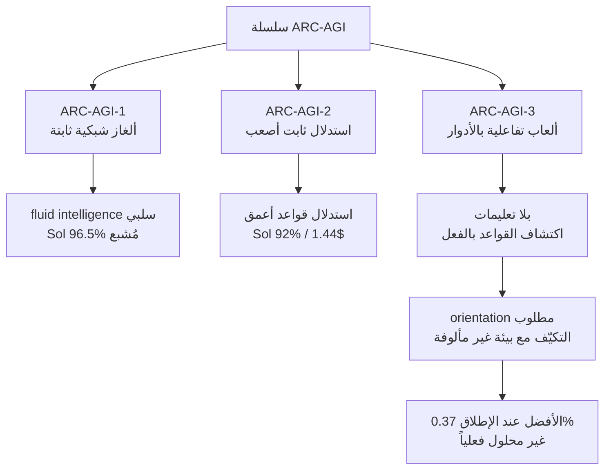

الفرق التي شغّلت عملاء ذكاء اصطناعي فعلياً في الإنتاج لا تتحمّس بسهولة لرقم واحد في اختبار قياسي. رأينا حالات كثيرة لنموذج يتجاوز 90% في حل مسائل ثابتة، ثم يفقد اتجاهه أمام أداة غير مألوفة، أو واجهة مستخدم يراها لأول مرة، أو بيئة بلا أي تعليمات. لذلك حين أعلنت ARC Prize أنها تحقّقت من نتائج GPT-5.6 Sol على ARC-AGI-3، لم يكن الرقم نفسه هو الأمر اللافت، بل الطريقة التي تحقق بها هذا الرقم.

الحقيقة الأساسية هي التالية: سجّل GPT-5.6 Sol نسبة 7.78% على مجموعة ARC-AGI-3 شبه الخاصة (semi-private)، محققاً رقماً قياسياً جديداً (SOTA)، وأصبح أول نموذج طليعي تم التحقق منه ينهي إحدى ألعاب ARC-AGI-3 بالكامل من البداية للنهاية. لكن اللافت هو تفسير ARC Prize لسبب هذا التفوق: لم ينجح Sol لأنه ينفّذ كل خطوة بدقة أكبر، بل لأنه كان أفضل في orientation، أي القدرة على تحديد اتجاهه بنفسه في موقف لم يره من قبل.

*تجسّد اللحظة التي تتقارب فيها الفوضى المتناثرة في بيئة غريبة بلا تعليمات نحو اتجاه واحد، وهي جوهر ما يُعرف بـ orientation.*

## نظرة عامة

هذا المقال لا يتناول ترتيب GPT-5.6 Sol العام بين النماذج. بل يتناول لماذا حقق هذا النموذج تقدماً ملموساً تحديداً في ARC-AGI-3 دون غيره من الاختبارات، وماذا يعني هذا التقدم لمن يبني عملاء ذكاء اصطناعي ويشغّلها فعلياً في الإنتاج، كما هو حالنا.

تنقسم سلسلة ARC-AGI إلى نوعين مختلفين جوهرياً من المسائل. تقيس ARC-AGI-1 وARC-AGI-2، وهما ألغاز شبكية ثابتة، ما يُسمى fluid intelligence السلبي، أي القدرة على استنتاج قاعدة وإنتاج الشبكة الصحيحة. أما ARC-AGI-3 فهي مسألة من نوع مختلف تماماً: بيئة لعبة تفاعلية تُلعب بالأدوار (turn-based) بلا أي تعليمات، يتوجّب على العميل فيها أن يتصرف بنفسه ليكتشف القواعد ويحقق الهدف. بعبارة أخرى، انتقل المحور من مسألة إصابة الإجابة الصحيحة إلى مسألة التكيّف مع عالم غير مألوف.

هذا الفرق مهم من منظور ThakiCloud. معظم أعباء العمل الخاصة بالعملاء الذكيين التي نتعامل معها أقرب إلى الحالة الثانية. مدى سرعة إدراك العميل للموقف وتحركه بأمان أمام موصل MCP يتصل به لأول مرة، أو واجهة API داخلية لم يرها من قبل، أو مصدر بيانات تغيّر مخططه (schema). هذا هو ما يحدد فعلياً نجاح العميل الذكي في الإنتاج من فشله. وARC-AGI-3 يقيس هذه القدرة بالتحديد ضمن ظروف مخبرية.

## ما هو ARC-AGI-3 ولماذا هو بهذه الصعوبة

صُمم ARC-AGI-3 ليكون مقاوماً لنوع التقدم الذي أشبع الجيل السابق. فARC-AGI-1 بات الآن مُشبعاً فعلياً؛ يتقارب Sol وTerra عند نحو 96.5%، بينما يصل حتى النموذج منخفض التكلفة Luna إلى 88%. الاستدلال الثابت بات اليوم قريباً من مسألة محلولة بالنسبة للنماذج الطليعية.

عند الانتقال إلى ARC-AGI-2، تتّسع الفجوة: يسجل Sol نسبة 92% (بتكلفة نحو 1.44 دولار لكل مهمة)، وTerra 83.9% (1.09 دولار)، وLuna 59.5% (0.67 دولار). وحتى هذا المستوى لا يزال يقع ضمن نطاق مدى إتقان حل مسألة معطاة.

المشكلة تكمن في ARC-AGI-3. عند إطلاق هذا المقياس في مارس 2026، لم يتجاوز حتى أفضل نموذج آنذاك نسبة 0.37%. والسبب أن على العميل، داخل لعبة تفاعلية، أن يكتشف بنفسه وبلا أي معلومة مسبقة أي فعل يُحدث أي أثر، وما الهدف، وماذا يعني الفشل. أمر سهل بالنسبة للإنسان، لكنه بالنسبة للنموذج منطقة مجهولة تماماً تقع خارج توزيع بيانات تدريبه.

يوضح هذا التركيب أن ARC-AGI-3 يقيس محوراً مختلفاً جذرياً عن باقي الاختبارات. فإذا كان الجيلان الأولان يتعلقان برفع دقة الذكاء (resolution)، فإن الجيل الثالث يتطلب قدرة الذكاء على التكيّف (adaptability). وهذه القدرة لا تُبنى بدقة التنفيذ وحدها.

## نتائج GPT-5.6 Sol بالأرقام

سجّل GPT-5.6 Sol، عند أقصى إعداد لجهد الاستدلال (max reasoning effort)، متوسط 13.33% على مجموعة ARC-AGI-3 العامة (public) و7.78% على المجموعة شبه الخاصة. ورقم 7.8% الذي يتصدّر العناوين هو هذا الرقم شبه الخاص تحديداً. وإذا أخذنا بعين الاعتبار أن الرقم القياسي السابق كان لـ Claude Opus 4.8 بنسبة 1.5%، فهذه قفزة تفوق خمسة أضعاف.

الحدث الأكثر دلالة هو أن Sol أصبح أول نموذج طليعي مُتحقق منه ينهي فعلياً إحدى ألعاب ARC-AGI-3 العامة (ft09). وكانت نسبة نجاح Sol في هذه اللعبة 87%. لم ينهِ أي نموذج لعبة واحدة بالكامل منذ إطلاق هذا المقياس مباشرة، لذا فهذا ليس مجرد تحديث لرقم قياسي، بل أول حالة تتجاوز عتبة نوعية.

لكن يجب النظر إلى التكلفة بصراحة. تصل تكلفة تقييم ARC-AGI-3 الكامل عند أقصى جهد استدلال إلى ما يقارب 20,000 دولار إجمالاً. هذه القدرة لا تزال قدرة تنفتح بالكاد عند أغلى إعداد ممكن. رقم 7.78% إشارة اختراق، وليس إعلاناً بأن المسألة قد حُلّت. وبمقارنته بنسبة 92% في ARC-AGI-2، يتضح أن التكيّف التفاعلي لا يزال متأخراً جيلاً كاملاً عن الاستدلال الثابت.

## الاختراق جاء من orientation لا من التنفيذ

أهم نقطة هنا هي تفسير ARC Prize. فسبب أداء Sol الجيد في ARC-AGI-3، بحسب هذا التفسير، ليس أنه نفّذ كل فعل بدقة أكبر، بل أنه تمكّن أولاً من توجيه نفسه (orient) بشكل صحيح داخل بيئة غير مألوفة.

الـ orientation والتنفيذ قدرتان مختلفتان. التنفيذ هو أداء الفعل بدقة عندما تكون تعرف ما يجب فعله في هذا الموقف. أما orientation فهو إدراك بنية الموقف عبر الملاحظة والمحاولة عندما لا يكون واضحاً أصلاً ماذا يجب فعله. تقيس معظم الاختبارات القياسية التنفيذ، لأن المسألة والهدف يُعطيان بوضوح. أما ARC-AGI-3 فيخفي حتى الهدف نفسه، ويقيس orientation بدلاً من ذلك.

هذا التمييز يمسّ مباشرة تصميم العملاء الذكيين في الواقع العملي. اللحظة التي يفشل فيها عميل ذكي في الإنتاج هي غالباً مرحلة orientation، لا مرحلة التنفيذ. نادراً ما ينهار لأنه استدعى الدالة الخطأ؛ بل ينهار لأنه أخطأ منذ البداية في تحديد أي دالة يجب استدعاؤها ولماذا في هذا الموقف بالذات. تشير نتيجة Sol إلى أن orientation محور يمكن أن يتوسّع (scale) بشكل مستقل، وأن اختباراً يقيس هذا المحور قد يكون أكثر ارتباطاً بجودة العميل الذكي الفعلية.

## دلالات التطبيق على منتجات ThakiCloud

هذا الموضوع يمسّ منتجَي ThakiCloud كليهما.

**عدسة Paxis (orientation العملاء الذكيين).** Paxis هي Agent-Native Cloud الخاصة بـ ThakiCloud، حيث تُعامَل Skills وTools وPolicies وAudit Logs كموارد من الدرجة الأولى. هنا لا يكون orientation مفهوماً مجرداً بل مسألة تصميم بحتة. في كل مرة يتصل فيها عميل ذكي بموصل MCP جديد لأول مرة، أو يختار من بين نحو 960 مهارة (skill) عبر BM25، فهو في الواقع يحل مسألة تحديد الاتجاه داخل فضاء قدرات غير مألوف من جديد. والدرس المستفاد من ARC-AGI-3 هو ألا تُترك خطوة orientation هذه للنموذج وحده، بل يجب أن يساعد فيها الـ harness. وحين تُنظّم Paxis فضاء الأفعال عبر أوصاف المهارات وبوابات السياسات وسجلات التدقيق، فإنها تعمل كأداة مساعدة على orientation، تتيح للعميل الذكي أن يجد اتجاهه داخل هيكل مُتحقق منه، بدلاً من أن يتخبّط في بيئة مجهولة. وبدون الاعتماد على استدلال مكلف بأقصى طاقته كما فعل Sol، فإن harness يقلّل عبء orientation يمكن أن يجعل التكيّف المستقر ممكناً حتى مع نماذج أرخص.

**عدسة ai-platform (اقتصاديات الاستدلال).** في الوقت نفسه، تكلفة التقييم البالغة 20,000 دولار هي أيضاً مسألة بنية تحتية للخدمة (serving). فالاستدلال المرتكز على orientation يتطلب عادة مسارات تفكير طويلة ومحاولات كثيرة، وهو ما يترجم مباشرة إلى استهلاك أكبر للـ tokens. تركّز منصة ai-platform الخاصة بـ ThakiCloud على تشغيل أعباء الاستدلال المكلفة هذه بكفاءة من حيث التكلفة في بيئة متعددة المستأجرين (multi-tenant)، عبر K8s وجدولة Kueue للـ GPU وخدمة vLLM. ولكي يُنقل عميل ذكي يتكيّف مع بيئات غير مألوفة إلى الإنتاج فعلياً، لا بد من طبقة خدمة (serving layer) قادرة على خفض تكلفة أقصى جهد استدلال إلى مستوى يمكن تحمّله. وهذا يؤكد مجدداً أن الخدمة الرخيصة هي ما يصنع اقتصاديات العميل الذكي.

باختصار، لا يتحوّل العميل الذكي المتكيّف إلى شيء يمكن تشغيله فعلياً، بدلاً من أن يبقى عرضاً طليعياً مكلفاً، إلا حين توزّع Paxis عبء orientation على الـ harness، وتخفض ai-platform تكلفة ذلك الاستدلال.

## القيود والحجج المضادة

لتجنّب المبالغة في تفسير هذه النتيجة، نضع هنا بعض الحجج المضادة.

أولاً، لا تزال نسبة 7.78% رقماً مطلقاً منخفضاً جداً. فالإنسان يُنهي معظم ألعاب ARC-AGI-3 دون عناء يُذكر، بينما بالكاد أنهى أفضل نموذج لعبة واحدة. القول بأن هذا اختراق وصف عادل، لكنه بعيد عن القول بأن المسألة محلولة. ومدى قوة تعميم قدرة orientation هذه لم يُثبت بعد.

ثانياً، تُقابل مشكلة التكلفة جزءاً كبيراً من ادعاء القدرة. فقدرة لا تنفتح إلا عند أقصى جهد استدلال مسألة منفصلة عن إمكانية النشر الفعلي. والسؤال الحقيقي عن القيمة هو: هل تتكرر نفس قدرة orientation بعُشر هذه التكلفة؟ والبيانات الحالية لا تجيب عن هذا السؤال.

ثالثاً، هذه نتيجة تحقّق منها اختبار قياسي واحد فقط. لم يُختبر Fable 5 بعد على ARC-AGI-3، وما إذا كانت قدرة orientation هذه تنتقل إلى مهام عملاء ذكيين فعلية خارج مجموعة ألعاب ARC-AGI-3 يحتاج إلى تحقق منفصل. ولا تتوفر أدلة كافية بعد لاستبعاد احتمال أن يكون النموذج قد بالغ في التكيّف مع هذا الاختبار تحديداً (overfitting).

مع ذلك، يبقى الاتجاه العام واضحاً. في عصر تتشبّع فيه دقة التنفيذ، تصبح orientation عنق الزجاجة التالي، وسيكون قياسها ومساعدتها عبر harness هو الميزة التنافسية التالية للعملاء الذكيين في الواقع العملي. ورقم 7.78% الذي حققه Sol هو الإحداثية الأولى لتلك النقطة الفاصلة.

## المصادر

- [نتائج GPT-5.6 Sol على ARC-AGI (ARC Prize)](https://arcprize.org/results/openai-gpt-5-6-sol)
- [إعلان ARC Prize (X/Twitter)](https://x.com/arcprize/status/2075270869992264003)
- [لوحة صدارة ARC Prize](https://arcprize.org/leaderboard)
- [GPT 5.6 Sol يتصدر ARC-AGI-3 بنسبة 7.8% (OfficeChai)](https://officechai.com/ai/gpt-5-6-sol-tops-arc-agi-3-with-7-8-becomes-first-model-to-make-meaningful-progress-on-benchmark/)
