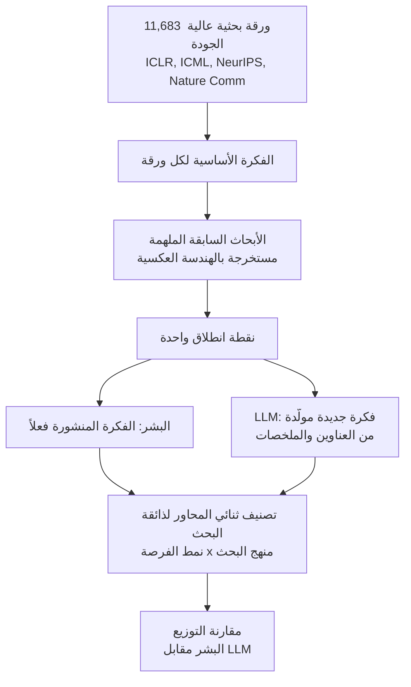

عندما نسمع عبارة "وكيل بحثي"، يتخيل معظمنا المشهد نفسه: قراءة الأوراق البحثية، اكتشاف ثغرة، اقتراح فكرة، تشغيل تجارب، ثم كتابة ورقة بحثية. لكن الباحثين في جامعتي Yale وChicago طرحوا سؤالاً أعمق من ذلك. ما مدى الاختلاف بين الأفكار البحثية التي يولّدها LLM وتلك التي حوّلها الباحثون البشريون فعلاً إلى أوراق منشورة، وما حجم هذا الاختلاف؟

خلاصة الورقة البحثية "Measuring the Gap Between Human and LLM Research Ideas" (arXiv 2607.01233) تتعارض مع الحدس السائد. نقطة ضعف أفكار LLM لم تكن ما نسميه عادة "الجودة". الفجوة الحقيقية كانت في الاتساع (range). فكّر LLM ضمن مساحة أضيق بكثير من الباحثين البشريين، وتركّز هذا الضيق بشكل شبه كامل في نمط واحد، وهو فكرة "ربط الأبحاث القائمة ببعضها".

*تصوير بصري يقابل بين التوزيع الواسع لأفكار البشر والتكتل الضيق لأفكار LLM حول نمط واحد.*

## نظرة عامة

أهمية هذا البحث تنبع من أن وكلاء البحث المستقل لم تعد فكرة بعيدة المنال. تدير فرق عديدة بالفعل حلقات (loops) تُولّد فيها LLM فرضيات، ويُختار جزء منها لتشغيل تجارب تلقائياً. تشغّل ThakiCloud أيضاً حلقة بحثية خاصة بها تسحب فرضيات تجريبية ليلاً من نشاط الوحدات الفرعية (submodules) والاتجاهات، وتضعها في قائمة انتظار، ثم تنفّذها تلقائياً. جودة حلقة كهذه تعتمد في النهاية على مدى تنوّع وجودة البذور التي ينتجها مولّد الأفكار.

هذه الورقة تحلّل بالضبط خصائص تلك البذور بشكل تجريبي. تتجاوز الحكم البسيط بأن "أفكار LLM جيدة" أو "سيئة"، وترسم بدلاً من ذلك موضع كل من البشر وLLM في مساحة الأفكار الممكنة. وما تخبرنا به هذه الخريطة هو ما سنخسره إن استمررنا في الاعتماد على مولّد فرضيات واحد قائم على LLM كما هو حالياً.

## ماذا تم قياسه: تجربة أفكار محكومة

أبرز ما يميز هذه الورقة هو الصرامة المنهجية. الحكم على الأفكار بأنها "جيدة" أو "سيئة" أمر ذاتي ويصعب قياسه مباشرة. تجاوز الباحثون هذه المشكلة عبر تجربة محكومة.

اختاروا أولاً 11,683 ورقة بحثية عالية الجودة من ICLR وICML وNeurIPS وNature Communications. ولكل ورقة، أعادوا هندسة مجموعة صغيرة من الأبحاث السابقة الوثيقة الصلة التي يُرجَّح أنها ألهمت فكرتها الأساسية. ثم أعطوا LLM عناوين وملخصات تلك الأبحاث السابقة فقط، وطلبوا منه توليد فكرة جديدة انطلاقاً من هذه النقطة. بمعنى آخر، أُعطي الباحثون البشريون وLLM نقطة انطلاق واحدة تماماً، وهي المجموعة نفسها من الأبحاث السابقة، والمقارنة تسأل إلى أين يتجه كلٌّ منهما من هناك.

معيار المقارنة كان تصنيفاً يقسّم "ذائقة البحث" إلى محورين. الأول هو نمط الفرصة، أي نوع الثغرة التي تحفّز العمل البحثي. والثاني هو منهج البحث، أي المنهجية التي تعالج بها تلك الثغرة. رسم الباحثون أفكار البشر وLLM على هذا النظام الإحداثي، وقاسوا كمياً مدى تداخل التوزيعين ونقاط تباعدهما. شملت النماذج التي جرى تقييمها عائلات LLM الرئيسية بما فيها Claude وGemini وGPT وDeepSeek وQwen.

## الاكتشاف الجوهري: الفجوة في الاتساع لا في الجودة

يمكن تلخيص النتيجة بجملة واحدة. أفكار LLM المولَّدة شغلت مساحة أضيق بكثير من أفكار البشر ضمن النظام الإحداثي لذائقة البحث.

يظهر هذا الضيق بأوضح صوره في نمط "الربط" (connection). نمط الربط يؤطّر دافعه بأن "أدبيات أو أساليب أو أدلة متفرقة تحتاج إلى ربطها ببعضها"، ويطوّر منهجه عبر دمج مقاربات قائمة أو التوفيق بينها أو توحيدها. بعبارة بسيطة، هي أفكار من نوع "ماذا لو جمعنا بين A وB".

الأرقام تُظهر الفجوة بوضوح تام. لم تتجاوز نسبة أفكار البشر التي كان دافعها نمط الربط 12.1%، ولم تتجاوز نسبة من استخدم الدمج أو التوحيد كمنهج أساسي 5.1%. في المقابل، تراوحت هذه النسب عبر تسعة نماذج LLM رئيسية بين 47.1% و64.2% وبين 22.5% و38.7% على التوالي، أي بمعدل يفوق 4 إلى 5 أضعاف الاعتماد على هذا النمط.

كانت أفكار الباحثين البشريين موزّعة على اتساع أكبر بكثير. أفكار تسعى لتفسير آلية ما، وأفكار تتعمّق في حالات الفشل، وأفكار تحاول قياس أدلة، وأفكار تبني أنظمة، وأفكار تحسّن الكفاءة، جميعها ظهرت بنسب متقاربة نسبياً. أما LLM، فبدلاً من الانتشار عبر هذا الطيف، استمر في الاستقرار داخل الوادي الضيق نفسه لأفكار "الربط" الآمنة والمقنعة ظاهرياً.

## لماذا تنجذب LLM إلى "الربط"

هذا التركّز ليس صدفة، بل هو بنيوي. فكرة "ادمج A وB القائمين" هي الخطوة التالية الأكثر أماناً التي يمكن اشتقاقها من مجموعة معطاة من الأبحاث السابقة، حتى على مستوى التنبؤ بالرمز التالي (next token). فهي منخفضة المخاطر، ومقنعة دائماً، وتبدو جديدة على السطح. أما فكرة من نوع "ما هي الآلية الخفية وراء هذه الظاهرة"، فتتطلب قفزة تتجاوز النص المعطى. تميل LLM إحصائياً إلى التقارب نحو الخيار الأول.

المشكلة أن الاختراقات العلمية الحقيقية غالباً ما تأتي من الخيار الثاني. الأفكار التي تصل بين أشياء قائمة تميل إلى إنتاج تحسّن تدريجي، بينما الاكتشافات التي تغيّر قواعد اللعبة تبدأ عادة من نوع مختلف من الأسئلة. إذا اعتمدنا على مولّد فرضيات واحد قائم على LLM كما هو، سننحبس دون وعي داخل واد واحد من مساحة الأفكار.

## تداعيات على منتجات ThakiCloud

يمنحنا هذا الاكتشاف توجيهاً تصميمياً مباشراً للوكلاء المستقلين الذين نشغّلهم.

**عدسة Paxis: فرض التنوّع عبر الـharness.** Paxis هو Agent-Native Cloud الخاص بـThakiCloud، ويتعامل مع تنسيق متعدد الوكلاء قائم على DAG ومهارات ذاتية التطور كموارد من الدرجة الأولى. درس هذه الورقة واضح: ترك توليد الأفكار لنموذج واحد يحصره داخل وادي "الربط"، لذا يجب ألا نترك التنوّع للصدفة، بل يجب فرضه عبر الـharness. عملياً، يعني هذا ثلاثة أمور. أولاً، اعتماد نهج mixture-of-agents يجمع مرشحين من عائلات نماذج مختلفة (Claude وGemini وGPT وDeepSeek وQwen) لتقليل تحيّز النموذج الواحد. ثانياً، تخصيص عدسات مختلفة صراحةً للمشكلة نفسها، كالتفسير الآلي وتحليل الفشل وتحسين الكفاءة، بحيث لا تتقارب الأفكار على نمط الربط وحده. ثالثاً، عدم الوثوق بالأفكار المولَّدة كما هي، بل تصفيتها عبر مرحلة تحقق عدائي (adversarial verify)، بما يمنع الأفكار المقنعة ظاهرياً لكنها ضيقة من عبور خط الأنابيب.

عندما تسحب ThakiCloud فرضياتها من حلقتها البحثية الليلية، يتحوّل هذا المبدأ إلى انضباط تشغيلي فعلي. فبدلاً من الحصول على فرضية واحدة من موجّه (prompt) واحد، يمنع التفرّع عبر عدسات متعددة والتقارب لاحقاً عبر مرحلة التحقق نمط الفشل "الاتساع الضيق" الذي قاسته هذه الورقة مباشرة.

**عدسة ai-platform: تكلفة البنية التحتية لتنوّع النماذج.** تشغيل عدة عائلات نماذج في آن واحد لضمان تنوّع الأفكار يتطلب طبقة قادرة على خدمة نماذج مفتوحة الأوزان غير متجانسة بكفاءة عبر عدة مستأجرين (tenants). تشغّل منصة ai-platform الخاصة بـThakiCloud مجموعة نماذج غير متجانسة بكفاءة من حيث التكلفة عبر Kubernetes وجدولة GPU بواسطة Kueue وخدمة عبر vLLM. ما يكشفه هذا هو أن تنوّع الأفكار، وهو هدف نوعي، لا يتحقق إلا فوق بنية تحتية للخدمة قادرة على تشغيل نماذج متنوعة بتكلفة منخفضة وبالتوازي.

## قيود وحجج مضادة

نقبل هذه النتيجة، لكن مع بعض التحفظات.

أولاً، التصنيف نفسه هو زاوية نظر واحدة. تقسيم "ذائقة البحث" إلى نمط فرصة ومنهج بحث مفيد، لكنه ليس التفكيك الوحيد الممكن. تصنيف مختلف قد يُظهر شكلاً مختلفاً لهذه الفجوة. استنتاج "الاتساع ضيق" نسبي إلى هذا النظام الإحداثي تحديداً.

ثانياً، اتساع الأفكار الأكبر ليس بالضرورة أمراً أفضل. جزء كبير من تنوّع أفكار البشر قد ينتهي في اتجاهات فاشلة في النهاية، وميل LLM نحو أفكار "الربط" قد يكون في الواقع خياراً أكثر أماناً بمعدل نجاح تنفيذي أعلى. قاست هذه الورقة توزيع الأفكار، لا الأفضلية النسبية لنتائج تنفيذها. تبقى العلاقة بين الاتساع والنتائج سؤالاً منفصلاً.

ثالثاً، هناك حساسية تجاه تصميم الموجّه (prompt). لو طُلب من LLM صراحةً "أنتج نوعاً من الأفكار مختلفاً تماماً عمّا هو قائم"، ربما كان التوزيع أوسع. بمعنى آخر، جزء من هذه الفجوة قد يكون نتاج الموجّه الافتراضي وليس قيداً جوهرياً في النموذج، وكون هذا الأمر قابلاً على الأرجح للتصحيح بدرجة كبيرة عبر الـharness هو، من الناحية العملية، الجانب المشجّع في هذه القصة.

ومع ذلك، التوجيه العملي واضح. بناء خط أنابيب للبحث المستقل أو توليد الأفكار على نموذج واحد وموجّه واحد يحصره داخل وادٍ ضيق. فرض التنوّع عبر الـharness وإغلاق الحلقة بمرحلة تحقق هو الطريق المباشر لتجنّب نمط الفشل الذي قاسته هذه الورقة.

## المصادر

- [Measuring the Gap Between Human and LLM Research Ideas (arXiv 2607.01233)](https://arxiv.org/abs/2607.01233)
- [الورقة الكاملة (HTML)](https://arxiv.org/html/2607.01233v1)
- [مراجعة أدبية (The Moonlight)](https://www.themoonlight.io/en/review/measuring-the-gap-between-human-and-llm-research-ideas)
