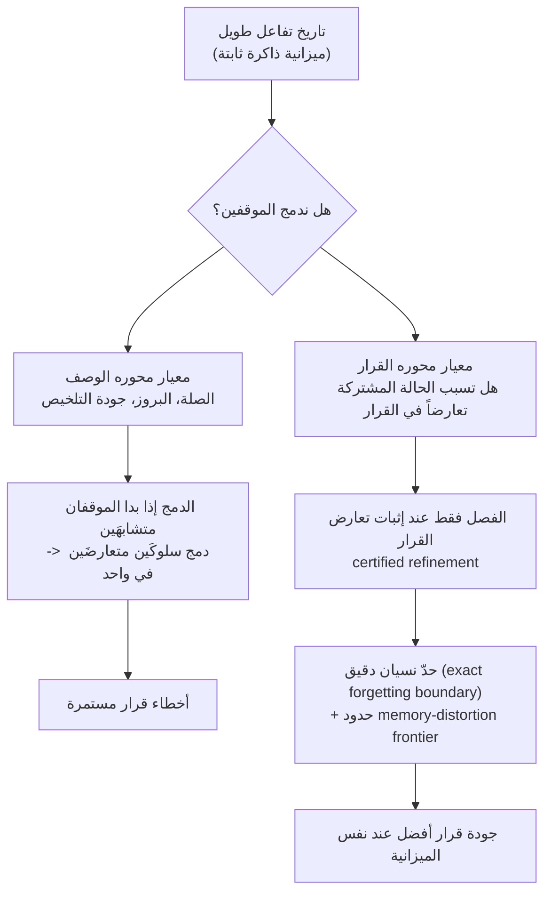

> 📄 **المراجعة المتعمقة الكاملة (DOCX)**: [نزّل المراجعة التفصيلية من Google Drive](https://drive.google.com/file/d/1oxsADQALTfdn7I_mmZbaZfMnmqoCMF9o/view).

## نظرة عامة

كل من شغّل وكيلاً حوارياً لفترة طويلة رأى هذا الفشل من قبل. تفضيل أو قرار أعلنه المستخدم بوضوح قبل أيام ينساه الوكيل في لحظة ما، ويتصرف على عكسه. نافذة السياق محدودة، وعندما تطول المحادثة بما يكفي، يجب ضغط جزء من الماضي أو التخلص منه. السؤال الحقيقي هو: ماذا نتخلص منه؟

أجابت ذاكرة الوكلاء حتى الآن على هذا السؤال في الغالب بمعايير **وصفية**: هل هذا مرتبط بالموضوع؟ هل هو بارز؟ هل يُلخَّص بشكل جيد؟ تجادل هذه الورقة، "Remember the Decision, Not the Description" (arXiv 2605.10870)، التي شارك في تأليفها باحث من Meta AI، بأن هذا المعيار نفسه خاطئ. هذا المقال موجّه للمهندسين والباحثين الذين يصممون وكلاء الذكاء الاصطناعي، وللفرق التي تحتاج إلى وضع ذاكرة طويلة المدى في الإنتاج. نلخّص هنا إعادة الصياغة الجوهرية للورقة والنتائج التجريبية الداعمة لها، ونستعرض كيف ينطبق هذا المبدأ على Paxis، منصة الوكلاء لدى ThakiCloud.

## أين تكمن المشكلة

ينطلق المؤلفون من رؤية بسيطة. الذاكرة قيّمة للوكيل ليس لأنها تصف الماضي بأمانة، بل لأنها **تحافظ على الفصل بين تاريخَين يتطلبان سلوكَين مختلفَين حتى ضمن ميزانية ثابتة**.

لنأخذ مثالاً بسيطاً. قال المستخدم بالأمس: "يجب ألا يتم هذا النشر إلا بعد موافقة يدوية". واليوم، في سياق مشابه، قال: "يمكن تشغيل هذا السكربت تلقائياً". العبارتان متشابهتان جداً في ظاهرهما. تتقاطعان في كلمات مثل النشر والتنفيذ والموافقة، وعند تلخيصهما تصبحان تقريباً نفس الجملة. من السهل أن تدمج الذاكرة القائمة على الصلة هاتين الحالتين في كتلة واحدة توصف بـ"تعليمات متعلقة بالنشر". في تلك اللحظة يفقد الوكيل القدرة على تمييز أي تعليمة تنطبق على أي موقف، ويرتكب خطأ دفع نشر يتطلب موافقة يدوية بشكل تلقائي. الملخّص صحيح وصفياً، لكن الدمج قاتل من حيث القرار.

نمط الفشل الملموس هو كالتالي. موقفان يبدوان متشابهَين نصياً لكنهما في الواقع يتطلبان إجراءَين متعارضَين. عندما تكون ميزانية الذاكرة ضيقة، يصبح الضغط ضرورياً، والضغط يستدعي حتماً الدمج. إذا نظرنا فقط إلى التشابه الوصفي، سيُدمج هذان الموقفان في واحد. والنتيجة أن الوكيل يتخذ قراراً خاطئاً باستمرار كلما وصل إلى تلك الحالة. الصلة أو جودة التلخيص لا تجيبان عن السؤال الحقيقي، وهو: هل يمكن دمج هذين حقاً؟ المعيار يجب ألا يكون ما يبدو متشابهاً، بل ما يتطلب سلوكاً مختلفاً.

## الفكرة الجوهرية: rate-distortion محوره القرار

ينقل المؤلفون هذه المشكلة إلى إطار نظرية المعلومات الخاص بـ rate-distortion. تتناول نظرية rate-distortion أصلاً مقدار التشويه (distortion) الناتج عن قدر معين من الضغط (rate)، والخطوة المحورية هنا هي إعادة تعريف التشويه نفسه. بدلاً من أن يكون التشويه خطأ إعادة بناء الإشارة، يُعرَّف كـ **الخسارة في جودة القرار القابلة للتحقيق نتيجة الضغط (decision loss)**.

إليكم تشبيهاً. عند ضغط الصوت، نتخلص أولاً من الترددات التي لا تسمعها الأذن البشرية، لأن معيار التشويه هو "ما يسمعه الإنسان". يرى المؤلفون أن ذاكرة الوكلاء يجب أن تعمل بالطريقة نفسها. ما يجب التخلص منه ليس "الذكرى التي تبدو أقل صلة"، بل "الذكرى التي لن يتغير أي قرار مستقبلي لو حذفناها". هنا، rate هو ميزانية الذاكرة، وdistortion هو خسارة القرار التي يسببها هذا الضغط. إذا لم يؤدِّ دمج موقفَين في نفس الخانة إلى أي قرار خاطئ مستقبلاً، فإن هذا الدمج مجاني. وعلى العكس، إذا كان الدمج يطمس سلوكَين متعارضَين، فهو تشويه باهظ الثمن.

يترتب على هذا التعريف أمران. أولاً، **حد النسيان الدقيق (exact forgetting boundary)**، الذي يحدد بدقة حدود ما يمكن نسيانه بأمان دون الإضرار بجودة القرار. ثانياً، **حدود memory-distortion frontier**، التي تصف منحنى المفاضلة الأمثل بين ميزانية الذاكرة وجودة القرار. بعبارة أخرى، تضع الورقة نظرياً حداً أدنى مفاده: "إذا خفّضت الميزانية بهذا القدر، فستنخفض جودة القرار حتماً بمقدار لا يقل عن كذا".

## DeMem: تحويل النظرية إلى خوارزمية

DeMem هي التي تنقل هذه النظرية إلى ذاكرة وكيل فعلية قائمة على الخانات (slots). DeMem خوارزمية تعلّم ذاكرة عبر الإنترنت (online)، وتعمل وفق مبدأ واحد: **لا تُقسِّم قسمة الذاكرة (partition) إلا عندما تُثبت البيانات (certify) أن حالة مشتركة تسبب تعارضاً في القرار.**

كلمة "تُثبت" هنا مهمة. لا يُفصل الموقفان بمجرد أن يبدوا مختلفَين، بل يُفصلان فقط بعد أن تتراكم أدلة فعلية على أن نفس حالة الذاكرة تتطلب قرارَين مختلفَين. وعلى العكس، إذا لم تتوفر مثل هذه الأدلة، يُبقى على الدمج توفيراً للميزانية. هذا التحفظ هو جوهر الطريقة. الفصل المتسرع يهدر الميزانية ولا يترك مكاناً للتمييزات المهمة فعلاً، بينما الدمج المتسرع يطمس سلوكيات متعارضة. certified refinement هو الانضباط الذي ينتظر، بين هذين الحدين، حتى تتحدث البيانات. يثبت المؤلفون أن هذا الإجراء يحقق ضماناً من نوع near-minimax regret، أي أن الندم (regret) بالمقارنة مع الأمثل يظل، حتى في أسوأ الحالات، مقيداً قريباً من الحد النظري.

يتحقق المؤلفون من هذه الآلية على مستويَين. أولاً، في بيئة تشخيصية اصطناعية، يصممون مهاماً يتعمدون فيها جعل التشابه الوصفي والتشابه القراري متباعدَين. هنا، تستمر المعايير الوصفية فقط في دمج المواقف المتشابهة ظاهرياً، مما يراكم الندم، بينما يتجنب DeMem هذا الفخ بالفصل فقط عند إثبات تعارض القرار. بعد ذلك، يتحققون مما إذا كانت هذه الأفضلية تنتقل إلى معايير قياس محادثات طويلة المدى فعلية، عبر نماذج تجارية ونماذج مفتوحة الأوزان على حد سواء. هذا البناء الذي ينطلق من النظرية، ويمر عبر تحقق آلي مضبوط، وينتهي عند معايير قياس واقعية، يحوّل النتائج إلى تفسير لـ"لماذا يفوز"، لا مجرد جدول أداء.

## نتائج التجارب

في التشخيص الاصطناعي، سجّل DeMem أدنى ندم تراكمي (cumulative regret) بين جميع الأساليب المتساوية في الميزانية، واتسعت الأفضلية كلما زادت الفجوة بين التشابه الوصفي والتشابه القراري. بينما استمرت المعايير الوصفية فقط في دمج المواقف المتعارضة منتجةً أخطاء مستمرة، تجنّب DeMem ذلك بالفصل فقط عند إثبات تعارض القرار.

استمرت النتائج في معايير القياس الفعلية أيضاً. فيما يلي القيم المقاسة للدرجة الإجمالية على LoCoMo (بنموذج GPT-4.1-mini الأساسي).

| الطريقة | Overall | Temporal |
|---|---|---|
| **DeMem** | **0.921** | **0.908** |
| Mnemis | 0.891 | 0.858 |
| EMem-G | 0.757 | 0.660 |
| Nemori | 0.731 | 0.454 |
| RAG | 0.710 | 0.634 |
| FullContext | 0.692 | 0.511 |
| Zep | 0.554 | 0.383 |
| Mem0 | 0.514 | 0.428 |

حقق DeMem أفضل درجة إجمالية، وكان قوياً بشكل خاص في فئات Temporal وOpen-Domain وMulti-Hop، حيث يكون الحفاظ على التمييز بين تفاعلات بعيدة زمنياً أمراً حاسماً. أما في فئة Single-Hop، التي تتعلق باسترجاع حقيقة واحدة، فقد تفوّق Mnemis (0.940) على DeMem (0.935) بفارق ضئيل، وهو ما يتفق مع تفسير أن فائدة الفصل المحوري بالقرار تكون أصغر في الاسترجاع أحادي الخطوة. وفي LongMemEval أيضاً، حقق DeMem أفضل متوسط درجات على كلا النموذجَين الأساسيَين، وكانت أكبر المكاسب في الفئات التي تتطلب دمجاً عبر جلسات متعددة. والأهم أن الأفضلية استمرت حتى على النموذج مفتوح الأوزان Llama-3.1-70B، مما يدل على أن هذه الميزة ليست مرتبطة بنموذج تجاري معين.

## دلالات على منتجات ThakiCloud

تلتقي رؤية هذه الورقة تماماً مع تصميم الذاكرة في Paxis، مستوى التحكم لمنصة Agent-Native Cloud لدى ThakiCloud. Paxis هو مستوى تحكم يعمل فوق ai-platform ويتعامل مع المهارات (skills) والأدوات والسياسات وسجلات التدقيق كموارد من الدرجة الأولى، وضمن ذلك يحدد محرك المعرفة وطبقة الذاكرة يومياً ما الذي يُدمج وما الذي يُفصل.

أولاً، يمكن نقل معيار الدمج في محرك معرفة HKE Wiki ليصبح محورياً بالقرار. إذا دُمجت العناصر المتشابهة بمجرد التشابه النصي، فهناك خطر أن تُدمج حالتان تتطلبان إجراءَين متعارضَين في واحدة. وضع بوابة قبل الدمج مباشرة تسأل "هل يسبب هذان الأمران سلوكَين مختلفَين؟" هو نقل مباشر لمبدأ certified refinement في هذه الورقة.

ثانياً، يمنح هذا أساساً نظرياً لإدارة ميزانية الذاكرة الساخنة المقيمة في الجلسة (session-resident hot memory). الذاكرة الساخنة تفرض بالفعل ميزانيتها بحد أقصى من الأحرف، ومحاذاة معيار ما يُبقى وما يُحذف مع مبدأ "الحفاظ على التمييزات المؤثرة في القرار" يرفع جودة التقليم (pruning). أي إعطاء الأولوية للعناصر التي تفرّق بين القرارات، لا العناصر التي تُلخَّص بسلاسة.

ثالثاً، تُعد بوابات السياسات وسجلات التدقيق التي يخلّفها Paxis مصدر بيانات طبيعياً لإثبات لاحقاً أن "نفس الحالة أفضت إلى قرار مختلف". إذا كان تشغيل certified refinement عبر الإنترنت لدى DeMem في الوقت الفعلي صعباً، يمكن اتباع مسار عملي بتحليل سجلات التدقيق هذه على دفعات غير متصلة (offline) وتحديث سياسة الدمج والفصل بشكل دوري. وهنا يلتقي مبدأ الذاكرة المحورية بالقرار مع التنسيق (orchestration) القائم على التدقيق الذي يجعل هذا المبدأ قابلاً للتكرار بأمان.

## القيود والاعتراضات

لا بد من توضيح بعض النقاط.

أولاً، الإثبات (certify) له تكلفة. إثبات تعارض القرار من البيانات يتطلب تراكم ملاحظات، وفي بيئات البداية الباردة (cold start) أو التفاعل النادر، يتأخر الفصل، ولذلك يصعب الحكم من نص الورقة وحده على مصير جودة القرار في المراحل المبكرة.

ثانياً، تقدير "خسارة جودة القرار" عبر الإنترنت في بيئة الإنتاج يتطلب إشارة مكافأة أو حكماً (judge). تملك معايير القياس إجابات صحيحة تجعل الحصول على هذه الإشارة سهلاً، لكن كيفية تأمين هذه الإشارة في محادثات فعلية بلا إجابة صحيحة تبقى مهمة قادمة. قد يكون استخدام سجلات التدقيق المقترح أعلاه أحد الحلول، لكن ذلك خارج نطاق الورقة.

ثالثاً، يتضمن الملحق إثباتاً لصعوبة حسابية (computational hardness)، وهو ما يعني أن إيجاد القسمة (partition) المثلى صعب بشكل عام. DeMem هو تقريب عملي لذلك، وتلزم حدود إضافية حول الشروط التي ينهار عندها هذا التقريب.

ومع ذلك، فإن المبدأ نفسه، وهو نقل ذاكرة الوكيل من الوصف إلى القرار، بسيط وقوي، ويستحق النظر في تبنّيه الآن. إذا كان الوكيل ينسى باستمرار قراراته السابقة، فقد لا تكون المشكلة أن ذاكرته صغيرة، بل أن ذاكرته تحتفظ بالشيء الخطأ.

> 📄 **المراجعة المتعمقة الكاملة (DOCX)**: [نزّل المراجعة التفصيلية من Google Drive](https://drive.google.com/file/d/1oxsADQALTfdn7I_mmZbaZfMnmqoCMF9o/view).

## المصادر

- الورقة: [Remember the Decision, Not the Description: A Rate-Distortion Framework for Agent Memory (arXiv 2605.10870)](https://arxiv.org/abs/2605.10870)
- معايير القياس: LoCoMo، LongMemEval / النماذج الأساسية: GPT-4o-mini، GPT-4.1-mini، Qwen2.5-14B-Instruct، Llama-3.1-70B
- الأرقام في الجدول مقتبسة من الجدول 1 (LoCoMo، GPT-4.1-mini) في الورقة.
