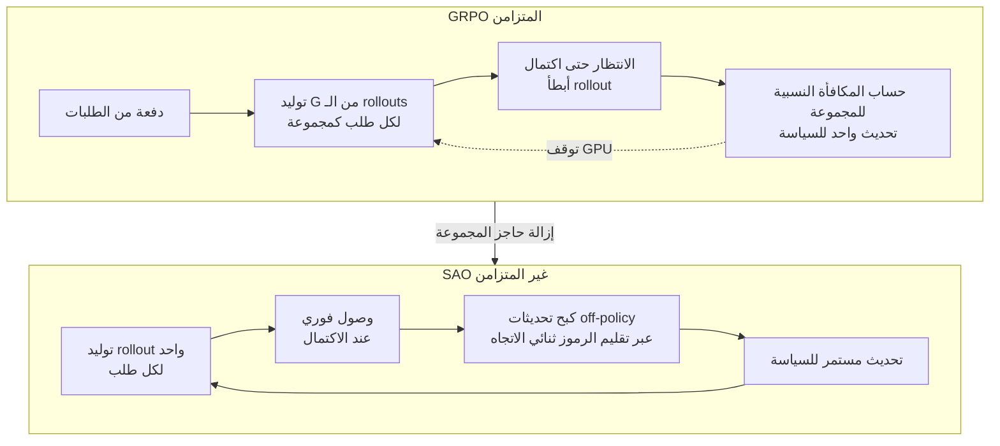

لم يعد الحديث عن صقل الوكلاء عبر التعلّم المعزز مصطلحاً مختبرياً بحتاً. فالنماذج التي تُتقن مهاماً مثل إصلاح قواعد الأكواد على مدى عشرات الجولات كما في SWE-Bench، أو حل البراهين الرياضية عبر خطوات متعددة، لا تُبنى في الغالب بالتدريب المسبق وحده. جوهر الأمر يكمن في مرحلة ما بعد التدريب (post-training)، حيث يُشغَّل الوكيل فعلياً باستخدام الأدوات والتفاعل مع البيئة عبر rollout يُمنح على أساسه المكافأة. لكن كلما طال هذا الـ rollout، بدأ أسلوب التدريب الذي كان يُستخدم كمعيار قياسي حتى الآن في الانهيار.

تتناول الورقة البحثية "Single-Rollout Asynchronous Optimization for Agentic Reinforcement Learning" (arXiv 2607.07508)، التي نشرها باحثون من جامعة تسينغهوا وشركة Z AI في 8 يوليو 2026، هذه النقطة مباشرة. والخلاصة أن الباحثين تخلّوا عن "أخذ العينات الجماعي" (group sampling)، وهو جوهر GRPO الشائع الاستخدام. ولم يقتصر الأمر على تجربة هذا الأسلوب في تجارب الورقة فحسب، بل طبّقوه فعلياً في خط أنابيب حقيقي لتدريب النموذج المفتوح GLM-5.2 البالغ حجمه 750B.

## نظرة عامة

سبب أهمية هذه الورقة الآن هو أن عنق الزجاجة في تكلفة التدريب انتقل من الخوارزمية إلى معدل استغلال البنية التحتية. فدوال الخسارة التي تجعل النموذج أكثر ذكاءً موجودة بالفعل بأشكال متعددة. المشكلة الحقيقية هي أنه حتى مع تشغيل مئات وحدات GPU معاً، يُنفَق معظم الوقت في "الانتظار" لإنتاج خطوة تدريب واحدة فقط.

تُشغّل ThakiCloud أيضاً خمس تقنيات لما بعد التدريب، هي SFT وCPT وDPO وGRPO وGKD، ضمن نظام تدريب نماذج اللغة الكبيرة المبني على kubeflow. لذلك فإن الثمن الذي يدفعه أخذ العينات الجماعي في GRPO عند التعامل مع rollouts طويلة، والمخاطر الجديدة التي قد يجلبها أي بديل يُزيل هذا الثمن، ليست قضية بعيدة عنا. يستعرض هذا المقال ما غيّرته SAO، وما تعنيه هذه التغييرات لمؤسسة مثلنا تسعى لتدريب وكلاء على عناقيد GPU متعددة المستأجرين (multi-tenant).

*تصوير تخيلي يقابل بين rollout واحد يصل تباعاً بشكل مستمر، وrollouts تتجمّد في قائمة الانتظار إلى أن تكتمل المجموعة بأكملها.*

## ما هي هذه التقنية؟

يجمع اسم SAO، كما هو، بين مفهومين: "rollout واحد" (single-rollout) و"التحسين غير المتزامن" (asynchronous optimization).

كانت خطوط أنابيب التعلّم المعزز التقليدية متزامنة (synchronous). تُحدَّد دفعة من الطلبات، ويُولَّد لكل طلب عدد من الـ rollouts، وعندما تكتمل جميعها تُحسَب المكافأة ويُنفَّذ تحديث واحد للسياسة. نجح هذا الأسلوب جيداً في المهام التي تُنتج إجابات قصيرة، لأن أطوال الـ rollouts كانت متقاربة.

لكن المشكلة تظهر في مهام الوكلاء. فمهمة برمجية واحدة قد تنتهي خلال 3 جولات فقط، بينما تستمر مهمة مجاورة في استدعاء الأدوات عبر 40 جولة. وفي خط الأنابيب المتزامن، تبقى بقية وحدات GPU عاطلة حتى ينتهي أبطأ rollout في الدفعة. ظهر التعلّم المعزز غير المتزامن أصلاً لإزالة هذا الهدر: يُحدَّث النموذج فور اكتمال كل rollout، بينما يستمر المولّد (generator) دون توقف في إنتاج الـ rollout التالي.

هنا ينشأ التعارض الجوهري. فاسم GRPO (Group Relative Policy Optimization) يحمل معنى "النسبية الجماعية" منذ البداية. تُجمَع عدة rollouts لطلب واحد في مجموعة واحدة، وتُقارَن داخل هذه المجموعة الـ rollouts الأفضل نسبياً بالأسوأ لحساب الأفضلية (advantage). وميزة GRPO، التي هي في الوقت نفسه قيدها، أنها تُنتج إشارة التدريب من المقارنة داخل المجموعة فقط دون الحاجة إلى دالة قيمة (critic) منفصلة. فإن لم تكتمل المجموعة، يستحيل حساب الأفضلية. وهكذا يتعارض جوهرياً البناء غير المتزامن الذي يتعلّم فور وصول كل rollout مع GRPO الذي يفرض الانتظار حتى تكتمل المجموعة.

## لماذا لا يتناسب GRPO مع التعلّم غير المتزامن؟

لنتأمل هذا التعارض بمزيد من التفصيل. فللحفاظ على المجموعة داخل خط أنابيب غير متزامن، لا مفر من أحد خيارين سيئين.

الأول هو الانتظار على مستوى المجموعة، وحينها تتلاشى ميزة اللاتزامن، وينتهي الأمر بالعودة فعلياً إلى النمط المتزامن الذي ينتظر أبطأ rollout.

والثاني هو توليد rollouts المجموعة الواحدة بسياسات (policies) مختلفة زمنياً. فإذا أنتجت سياسة قديمة بعض rollouts المجموعة، وأنتجت سياسة مُحدَّثة بعد بضع خطوات rollouts أخرى ضمن المجموعة نفسها، فإن تجميعها ومقارنتها نسبياً كمجموعة واحدة يصبح ملوّثاً إحصائياً من الأساس. فحين تتفاوت درجة off-policy من rollout إلى آخر، لكنها تُعامَل كأنها baseline واحد متجانس، يصبح التدريب غير مستقر.

إجابة SAO بسيطة: إلغاء المجموعة تماماً. يُولَّد rollout واحد فقط لكل طلب، وحالما يصل يُستخدَم مباشرة في التدريب. وبزوال حاجز المجموعة، لا يضطر المولّد إلى الانتظار إطلاقاً، فيتقلّص وقت خمول GPU بشكل كبير.

## ركيزتا SAO: rollout واحد وتقليم الرموز ثنائي الاتجاه

لكن إلغاء المجموعة يعني فقدان ما كانت GRPO تحصل عليه مجاناً. فالمقارنة داخل المجموعة كانت تلعب بحد ذاتها دور baseline يُقلّل التباين. وحين يكون هناك rollout واحد فقط، يختفي معيار المقارنة القائم على "هل تفوّق هذا الـ rollout على متوسط المجموعة؟". فضلاً عن ذلك، في البنية غير المتزامنة تنشأ فجوة زمنية بين السياسة التي أنتجت الـ rollout والسياسة التي يُراد تحديثها الآن. وهذه الفجوة، أي مشكلة off-policy، هي الخطر الثاني الذي يهدد استقرار التدريب.

تتصدى SAO لمشكلة الاستقرار هذه عبر "تقليم صارم ثنائي الاتجاه على مستوى الرمز" (strict double-side token-level clipping). فالتقليم (clipping) الذي كانت تستخدمه عائلة PPO أصلاً هو آلية تقصّ التدرّج (gradient) عندما تخرج نسبة الأهمية (importance ratio) عن نطاق محدد. وتُطبّق SAO هذا التقليم على مستوى كل رمز (token) على حدة، وبصرامة في الاتجاهين الأعلى والأسفل معاً. فعند الرموز التي تباعدت فيها rollout السياسة القديمة كثيراً عن السياسة الحالية، يُكبَح التحديث بقوة، مما يمنع الإشارات ذات الفجوة الزمنية الكبيرة من إفساد التدريب.

ونتيجة هذا المزيج، تُفيد الورقة بأن SAO واصلت التدريب باستقرار على مدى 1,000 خطوة. وإذا أخذنا بعين الاعتبار أن حالات التباعد أو الانهيار شائعة في التعلّم المعزز غير المتزامن بعد تجاوز بضع مئات من الخطوات، فإن استقرار التدريب لـ 1,000 خطوة يُعدّ دليلاً داعماً للمزاعم الأساسية لهذه الطريقة.

## النتائج الفعلية والتحقق

قارنت الورقة SAO بـ GRPO ومتغيراتها، وأفادت بتفوّقها باستمرار في معايير قياس الترميز والاستدلال الخاصة بالوكلاء. والمعايير المذكورة هي SWE-Bench Verified (حل مشكلات GitHub الحقيقية)، وBeyondAIME (رياضيات عالية الصعوبة)، وIMOAnswerBench (رياضيات بمستوى الأولمبياد). وتشترك المعايير الثلاثة في كونها مهام متعددة الخطوات وطويلة النَفَس، وليست إجابات قصيرة مباشرة، وهو بالضبط المجال الذي تستهدفه SAO.

أما التحقق الأكثر إقناعاً فليس في جداول المعايير، بل في واقعة النشر ذاتها. فقد استُخدِمت SAO في خط أنابيب فعلي للتعلّم المعزز للوكلاء لتدريب النموذج المفتوح GLM-5.2 (نموذج MoE بحجم إجمالي 750B وحجم فعّال 40B من المعاملات النشطة، 750B-A40B). وكون طريقة بحثية لم تبقَ حبيسة الورقة العلمية، بل استُخدِمت في تدريب إنتاجي لنموذج بحجم مئات المليارات، إشارة قوية على أن هذه الطريقة تصمد عند المقياس الحقيقي، لا في إعدادات تجريبية صغيرة فقط.

غير أن هذا المقال لا يقتبس الأرقام التفصيلية للمعايير. فإن تعذّر إعادة إنتاج الأرقام الدقيقة التي تحقّق منها النص الأصلي في هذا المكان، فالأمانة تقتضي نقل بنية الطريقة وأسماء المعايير المذكورة صراحة دون اختلاق أي رقم. ومن يحتاج إلى الدرجات الدقيقة، فليرجع إلى النص الأصلي أدناه مباشرة.

## دلالات التطبيق على منتجات ThakiCloud

لا يقتصر درس SAO على كونه ورقة خوارزمية واحدة، بل يمسّ مباشرة طريقة تشغيل عناقيد GPU.

**عدسة ai-platform (البنية التحتية لتدريب GPU).** تجدول منصة ai-platform التابعة لـ ThakiCloud تدريب GPU متعدد المستأجرين فوق Kubernetes وKueue. ونظام تدريب نماذج اللغة الكبيرة المبني على kubeflow يدعم بالفعل GRPO كأحد تقنيات ما بعد التدريب. والسؤال الذي تطرحه SAO واضح: كم يتراجع معدل استغلال GPU في مهام تدريبنا بسبب التفاوت في أطوال الـ rollouts؟ ففي المهام المتفاوتة الطول كـ rollouts الوكلاء، يتحوّل انتظار المجموعة المتزامن إلى تكلفة مباشرة. وفصل توليد الـ rollouts غير المتزامن عن التدريب يتيح استخلاص خطوات تدريب فعّالة أكثر من العدد نفسه من وحدات GPU، وهو ما يشكّل رافعة مباشرة لخفض تكلفة التدريب لكل مستأجر في بيئة متعددة المستأجرين. كما أن التحقق مما إذا كانت جدولة gang scheduling وإدارة الطوابير في Kueue تفرض نمط "الانتظار حتى تكتمل المجموعة" يُعدّ نقطة تحسين عملية أخرى.

**عدسة Paxis (نتاج تدريب الوكلاء).** Paxis، وهي منصة Agent-Native Cloud التابعة لـ ThakiCloud، مستوى تحكّم يُشغّل المهارات (skills) في صناديق رملية معزولة (sandbox) ويمرّر كل سلوك عبر بوابات سياسات وسجلات تدقيق. والوكيل الذي تسعى SAO لتدريبه جيداً، أي وكيل يستدعي الأدوات عبر جولات متعددة ويُصلح قواعد الأكواد، هو بالضبط عبء العمل الذي تُشغّله Paxis. بل إن آثار الوكلاء (agent traces) الفعلية التي تُولّدها Paxis داخل الصناديق الرملية المعزولة يمكن أن تكون بحدّ ذاتها مصدر rollouts للتعلّم المعزز غير المتزامن على غرار SAO. وبذلك تكتمل حلقة: تُنتج ai-platform الـ rollouts وتدرّب عليها بتكلفة منخفضة، وتُشغّل Paxis الوكيل الناتج بأمان، لتُولّد بدورها بيانات تدريب جديدة. إنها بنية تقوم فيها بنية التدريب منخفضة التكلفة (ai-platform) بدعم جدوى الوكلاء الاقتصادية (Paxis).

## القيود والاعتراضات

قبل تبنّي هذه الطريقة دون تمحيص، ينبغي التوقف عند بضع نقاط.

أولاً، يتخلّى الـ rollout الواحد عن تقليل التباين الذي كانت توفّره المجموعة. وتُعوّض SAO عن ذلك بالتقليم، لكن التقليم بطبيعته آلية تقصّ إشارة التدريب. فالتقليم الصارم أكثر مما ينبغي قد يُلقي حتى بالتدرّجات الصالحة، مما يُبطئ التدريب. ونقطة التوازن بين "الاستقرار" و"سرعة التعلّم" قابلة للتغيّر بشكل كبير تبعاً للمهمة والمقياس.

ثانياً، التحقق عبر تدريب نموذج بحجم 750B مثير للإعجاب، لكن نجاحه عند هذا المقياس لا يعني أنه الأمثل بالضرورة في إعدادات المؤسسات الصغيرة. فخط الأنابيب غير المتزامن يتطلّب تعقيداً إضافياً في البنية التحتية لفصل المولّد عن المدرّب. وبالنسبة للفرق التي تُجري ضبطاً دقيقاً قصيراً بعدد محدود من الـ rollouts، قد يكون GRPO المتزامن أبسط وكافياً.

ثالثاً، توجد مقاربات نشطة في الاتجاه المعاكس أيضاً. فقد ظهرت في الفترة نفسها دراسة تتناول العلاقة بين staleness ومعدل التعلّم في RLHF غير المتزامن عبر قوانين تحجيم (scaling laws) (arXiv 2607.01083)، كما ظهرت مقاربات تُثبّت التدريب غير المتزامن عبر محاذاة التدرّجات (gradient alignment). ولذلك فالأدق أن نعتبر مبدأ SAO القائم على "إلغاء المجموعة وكبح ذلك بالتقليم" واحداً من عدة إجابات قوية محتملة على مسألة مفتوحة هي التعلّم المعزز غير المتزامن للوكلاء، لا الإجابة الوحيدة الصحيحة.

ومع ذلك، فإن إسهام SAO واضح. فقد حدّدت المشكلة بدقة (عدم كفاءة أخذ العينات الجماعي عند طول الـ rollouts)، وتحقّقت من الحل (rollout واحد مع تقليم ثنائي الاتجاه) عبر تدريب إنتاجي فعلي بمقياس مئات المليارات من المعاملات. وأي مؤسسة يمثّل فيها معدل استغلال GPU تكلفة التدريب مباشرة، لديها سبب وجيه لحساب المبلغ الذي يُهدَر في خط أنابيبها بسبب "انتظار المجموعة".

## المصادر

- Zhenyu Hou, Yujiang Li, Jie Tang, Yuxiao Dong. "Single-Rollout Asynchronous Optimization for Agentic Reinforcement Learning." arXiv 2607.07508 (2026-07-08). <https://arxiv.org/abs/2607.07508>
- ذو صلة: "Staleness-Learning Rate Scaling Laws for Asynchronous RLHF." arXiv 2607.01083. <https://arxiv.org/abs/2607.01083>
