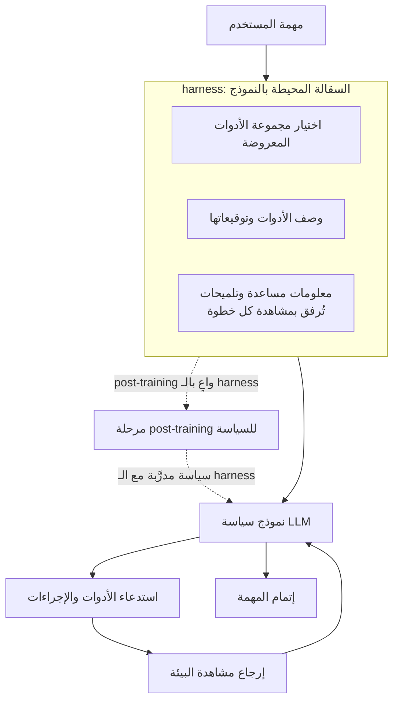

كل مهندس شغّل وكيلاً (agent) بنفسه، أو ربط سير عمل يعتمد بكثافة على استدعاء الأدوات، يعرف تجربة مشتركة: مع أن النموذج الأساسي واحد، يختلف أداء الوكيل بشكل ملحوظ بحسب السقالة (scaffolding) التي يُبنى فوقها - قائمة الأدوات، وصف هذه الأدوات، والتلميحات الملحقة بالمشاهدات. أصبحت هذه السقالة تُعرف مؤخراً باسم الـ harness. تستند هذه المقالة إلى ورقة بحثية نُشرت في يونيو 2026 بعنوان [The Interplay of Harness Design and Post-Training in LLM Agents](https://arxiv.org/abs/2606.25447)(arXiv:2606.25447)، وتشرح لماذا لا يمكن فصل تصميم الـ harness الجيد عن تدريب النموذج، وما الذي تعنيه هذه النتيجة للسحابات التي تُشغّل الوكلاء فعلياً في بيئة الإنتاج. والخلاصة مقدَّماً: الـ harness ليس قطعة تُستبدل بعد انتهاء التدريب، بل عنصر يجب تصميمه مع مرحلة التدريب منذ البداية.

## نظرة عامة: لماذا الـ harness الآن

في الأشهر الأخيرة، بات يتكرر الطرح القائل إن "الكود المحيط بالنموذج أهم من النموذج نفسه". فبالنسبة للوكلاء الذين يستخدمون الأدوات، لا يقل أسلوب عرض الأدوات ووصفها، وما يُعاد كمشاهدة (observation) في كل خطوة، أهمية عن أوزان النموذج ذاتها في تحديد الأداء النهائي. وتتناول ورقة استقصائية أخرى تعالج الموضوع نفسه، [From Question Answering to Task Completion](https://arxiv.org/abs/2606.20683)، تصميم الـ harness باعتباره محوراً بحثياً مستقلاً في أنظمة الوكلاء.

تكمن المشكلة في أن هذين الجانبين - تصميم الـ harness والـ post-training - كانا يُعاملان حتى الآن وكأنهما عمل فريقين مختلفين. فريق البحث يصقل السياسة (policy) عبر التعلم المعزّز، بينما يتولى فريق المنصة ضبط الأدوات والمحفزات (prompts). وتكمن مساهمة هذه الورقة في إثبات خطأ هذا التقسيم؛ فمقدار المعلومات في الـ harness والـ post-training متشابكان بعلاقة ضربية، بحيث يؤدي تحسين أحدهما فقط إلى تبديد معظم مكاسب الآخر. وبالنسبة لمنصة مثل ThakiCloud التي تتعامل مع الـ harness كمورد من الدرجة الأولى، تُترجَم هذه النتيجة مباشرة إلى مبدأ تشغيلي.

## ما هو الـ harness وأين يتحدد الأداء

تُعرّف الورقة الـ harness بأنه "السقالة التي تحيط بالنموذج". وبتحديد أدق، هو الطبقة التي تقرر أي الأدوات تُعرض، وكيف تُوصف هذه الأدوات، وما المعلومات المساعدة التي تُرفق بمشاهدة كل خطوة. ويمكن تمثيل دورة واحدة لوكيل يستدعي الأدوات كما يلي:

المتغير الجوهري هنا هو مقدار المعلومات (informativeness) في الـ harness. فالـ harness ذو المعلومات الغنية يصف الأدوات بتفصيل ويرفق بالمشاهدات تلميحات مفيدة، ما يساعد النموذج على اختيار الأداة الصحيحة دون الاعتماد الكامل على معرفته المسبقة. أما الـ harness منخفض المعلومات فيكتفي بتوقيعات (signatures) دنيا ويترك الباقي لاستدلال النموذج. وهذا الفارق هو ما يحدد النتيجة عند التقائه بالتدريب.

## الافتراض الذي يقلبه هذا البحث

لدى من تعامل مع الوكلاء افتراض ضمني شائع: يكفي إضافة harness جيد قبيل النشر مباشرة. النموذج يُدرَّب جيداً بمعزل عن ذلك، ثم يُضبط الـ harness لاحقاً بتنقيح وصف الأدوات، ويُتوقّع أن يرتفع الأداء تبعاً لذلك. وتدحض الورقة هذا الافتراض بشكل مباشر.

أولاً، حتى في وضع zero-shot (بالاعتماد على المحفزات فقط دون تدريب إضافي)، يتحسّن الأداء بشكل مطّرد كلما زاد مقدار المعلومات في الـ harness، ويكون هذا الأثر أوضح في النماذج ذات القدرة الأعلى. وهذا يعني أن المعرفة المسبقة المضمّنة في harness غني بالمعلومات تُترجم مباشرة إلى أداء.

ثانياً، وهذا الاكتشاف الأهم، يكمن في التفاعل مع الـ post-training. فعند مقارنة نموذج دُرِّب مع الـ harness مدمجاً منذ مرحلة التدريب، بنموذج أُضيف إليه الـ harness نفسه بعد انتهاء التدريب، يستعيد النموذج الثاني جزءاً ضئيلاً فقط من المكاسب التي حظي بها الأول. بعبارة أخرى، الـ post-training الواعي بالـ harness (harness-aware post-training) ليس إضافة تُحسّن الأداء، بل شرط أساسي لتحقيق أداء متين. أما نهج استبدال الـ harness بعد التدريب فهو مقاربة ناقصة.

## يظهر الفرق الحقيقي عند تغيّر بيئة الأدوات

تأتي النتيجة الأكثر عملية من تجارب خارج التوزيع (OOD). ويُقصد بـ OOD هنا بيئة أدوات لم يرها النموذج أثناء التدريب - كأن تُضاف أدوات جديدة أو تُستبدل، أو تتغيّر توقيعات واجهات API. وفي التشغيل الفعلي، هذا النوع من التغيّر ثابت لا يتوقف؛ فالأدوات تتزايد باستمرار، والإصدارات تتحدّث، ومجموعة الأدوات المعروضة تختلف من مستأجر (tenant) إلى آخر.

تقارن الورقة بين مسارين. فالوكيل الذي خضع لـ post-training واعٍ بـ harness غني بالمعلومات يصمد بمتانة حتى عند تغيّر بيئة الأدوات بشكل كبير، ويُعمِّم عبر مجموعات المهام المختلفة. في المقابل، الوكيل الذي دُرِّب مع harness بُذل في تصميمه جهد محدود ينهار أداؤه سريعاً كلما اشتد تغيّر بيئة الأدوات، ويعجز عن الانتقال إلى بيئات جديدة. بعبارة أخرى، تلعب المعرفة المسبقة المضمّنة في الـ harness دور المرساة (anchor) للتعميم. فالسياسة المدرَّبة مع harness مصمَّم جيداً تحتفظ بحسّها حول ماذا وكيف تستدعي حتى أمام أدوات غير مألوفة، بينما تفقد السياسة المدرَّبة مع harness هزيل ذلك الحسّ بالكامل.

هذه النقطة مؤلمة بشكل خاص لمشغّلي السحابة. فالسبب النمطي وراء انهيار وكيل حقق نتائج جيدة في المعايير القياسية (benchmarks) عند وصوله إلى بيئة الإنتاج هو تحديداً تحوّل بيئة الأدوات. وتقول هذه الورقة إن جزءاً كبيراً من هذا الضعف يتحدد أصلاً في مرحلة تصميم الـ harness.

## دلالات التطبيق على منتجات ThakiCloud

يتقاطع هذا الاكتشاف مع محوري منتجات ThakiCloud كليهما، بحيث تفوّت النظرة من زاوية واحدة نصف الصورة.

الزاوية الأولى هي **زاوية Paxis**. فـ Paxis هي لوحة تحكم Agent-Native Cloud تعمل فوق ai-platform، وتتعامل مع الـ Skills والـ Tools والـ Policies وسجلات التدقيق (Audit Logs) كموارد من الدرجة الأولى. وبلغة هذه الورقة، فإن Skill Harness الخاص بـ Paxis هو تحديداً الـ harness المقصود هنا. فاختيار مجموعة الأدوات المعروضة من بين نحو 960 مهارة (skill) عبر BM25، وتنسيق وصف كل مهارة وتوقيعها، وإعادة نتائج التنفيذ في sandbox معزول كمشاهدة - كل هذه العمليات مجتمعة هي ما يحدد مقدار المعلومات في الـ harness. وتدعم استنتاجات الورقة مبادئ تصميم Paxis: فبناء harness غني بالمعلومات عبر اختيار المهارات بما يناسب المهمة، بدلاً من عرضها جميعاً دون تمييز، ثم تطوير ذلك الـ harness مع حلقة التدريب والتقييم، هو ما يقود إلى المتانة أمام بيئات أدوات غير مألوفة. كما أن البنية التي تُمرِّر كل إجراء عبر بوابات السياسات (policy gates) وسجلات التدقيق تندرج ضمن الهمّ نفسه: إبقاء الـ harness موضوعاً للتجريب وخاضعاً لإدارة الإصدارات.

الزاوية الثانية هي **زاوية ai-platform**. فاستنتاج أن الـ post-training الواعي بالـ harness شرط أساسي يرفع قيمة إبقاء التدريب والتقديم (serving) داخل بنية تحتية واحدة. وتُشغِّل ai-platform أعباء الـ post-training مثل الـ fine-tuning والـ RLVR جنباً إلى جنب مع تقديم الاستدلال عبر vLLM، فوق جدولة GPU قائمة على K8s وKueue. ولكي يُدمَج الـ harness عند لحظة التدريب، يجب أن يكون بإمكان خط أنابيب التدريب الرجوع مباشرة إلى مخطط الأدوات (tool schema) وصيغة المشاهدات المستخدَمة في التقديم. فإذا انفصل التدريب عن التقديم في منظمتين أو مكدّسين تقنيين مختلفين، ينحرف الـ harness عن مساره، ويقع المرء في فخ المكسب الناقص الذي حذّرت منه الورقة، أي "استبدال الـ harness بعد التدريب". أما التصميم الذي يعرض مجموعات أدوات مختلفة لكل مستأجر في بيئة متعددة المستأجرين، مع الحفاظ في الوقت ذاته على متطلبات on-premise والسيادة عبر self-hosting يجمع التدريب والتقديم داخل سياج واحد، فهو موقع مؤاتٍ للحفاظ على هذا التوافق بين الـ harness والتدريب.

وتتكامل الزاويتان: تدير Paxis الـ harness كمورد من الدرجة الأولى فتضبط مقدار معلوماته وإصداراته، بينما تُدخِل ai-platform ذلك الـ harness في حلقة التدريب فتُحوّل الـ post-training الواعي بالـ harness إلى واقع ملموس.

## القيود والاعتراضات المحتملة

لتجنّب المبالغة في تفسير نتائج هذه الورقة، ينبغي مراعاة عدة نقاط.

أولاً، تحمل فرضية "كلما زاد مقدار المعلومات في الـ harness كان أفضل" تكلفة مصاحبة. فكلما زادت التلميحات المرفقة بالمشاهدات طال السياق (context)، وكلما ازداد ثراء وصف الأدوات ارتفع عدد رموز المحفز (prompt tokens) والتأخير (latency). ومن منظور التقديم (serving)، مقدار المعلومات ليس مجانياً، ويجب موازنته دائماً مع الإنتاجية (throughput). ولذلك يُستحسَن قراءة مفهوم "مقدار المعلومات" في الورقة لا على أنه "المزيد دائماً أفضل"، بل بمعنى أقرب إلى "هل يحمل معرفة مسبقة مفيدة للمهمة".

كذلك، يتطلب الـ post-training الواعي بالـ harness تكلفة دخول تتمثل في إعادة ضبط خط أنابيب التدريب. وفي كثير من الممارسات العملية التي تستخدم نماذج open-weight جاهزة كما هي، يظل تحسين الـ harness وحده في وضع zero-shot خطوة أولى واقعية. وبما أن الورقة نفسها تؤكد أن مقدار المعلومات يرفع الأداء في وضع zero-shot أيضاً، فهذا يبقى نقطة انطلاق معقولة للفرق التي لا تملك موارد كافية للتدريب.

وأخيراً، من الصعب الجزم بأن تحوّلات بيئة الأدوات التي تتناولها تجارب OOD في الورقة تُمثِّل كامل نطاق التغيّر في بيئة الإنتاج الفعلية. فثمة فجوة بين استبدال الأدوات في المعايير القياسية وبين بيئة تشغيل يحدّث فيها عشرات المستأجرين واجهات API الخاصة بهم كلٌّ على حدة. ومع ذلك، فإن الاتجاه العام - أي أن "الوكيل المصمَّم مع الـ harness منذ التدريب أكثر متانة أمام التغيّر" - يُرجَّح أن يعمل بقوة أكبر كلما كانت السحابة الفعلية أكثر تغيّراً مستمراً في أدواتها.

وخلاصة القول، تدعو هذه الورقة إلى معاملة الـ harness لا كلمسة تشطيب تُضاف قبيل النشر، بل كبنية تُصمَّم مع مرحلة التدريب منذ خطوتها الأولى. والاتجاه القائم على إدارة الـ harness كمورد من الدرجة الأولى، وإبقاء التدريب والتقديم داخل بنية تحتية واحدة، يشير بالضبط إلى الوجهة نفسها التي توصي بها هذه التوصية.

## المصادر

- The Interplay of Harness Design and Post-Training in LLM Agents, arXiv:2606.25447: <https://arxiv.org/abs/2606.25447>
- From Question Answering to Task Completion: A Survey on Agent System and Harness Design, arXiv:2606.20683: <https://arxiv.org/abs/2606.20683>
