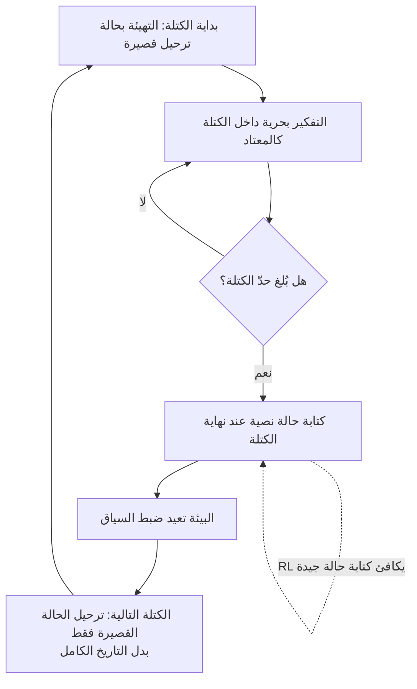

إذا بلغت النقطة التي يصبح فيها جعل نموذج الاستدلال يفكر لمدة أطول باستمرار أمراً لا يُحتمل كلفةً، فهذا المقال موجّه إليك. إليك الخلاصة أولاً. الكلفة الحقيقية لسلسلة التفكير (chain of thought) الطويلة هي أن الحالة (state) تنمو بلا حدود بينما يفكر النموذج، فتتناسب الكلفة مع مربع طول التفكير، ويخفض التفكير الماركوفي (Markovian Thinking) تلك الكلفة إلى خطية بجعل السياسة (policy) تُقدّم الاستدلال معتمدةً على حالة ثابتة الحجم فقط. في Delethink، وهي البيئة التي تجسّد هذه الفكرة، يفكر نموذج بحجم 1.5B دُرّب بكتل من 8K رمز حتى 24K رمز، ويضاهي أو يتفوق على خط الأساس بالميزانية نفسها، وعند طول تفكير يبلغ 96K تنخفض كلفة التدريب من 27 H100-شهر إلى 7.

*تصوير تجريدي للتفكير الماركوفي: تقسيم الاستدلال الطويل إلى كتل ثابتة الحجم وتمرير حالة قصيرة فقط إلى الأمام.*

## لماذا يستحق هذا المقال القراءة

كُتب هذا المقال للمهندس الذي يخدم أو يدرّب نماذج الاستدلال الطويل باستخدام التعلّم المعزّز (RL)، ولمسؤول المنصة المسؤول عن كلفة الاستدلال تلك. القرار الذي تواجهه هو التالي: تريد أن يفكر النموذج لمدة أطول، لكن كيف تستوعب الحوسبة والذاكرة اللتين تقفزان تربيعياً مع ذلك الطول؟ يجيب التفكير الماركوفي (arXiv:2510.06557، McGill-NLP) بفصل طول التفكير عن حجم السياق (context size). باختصار، إذا قسّمت الاستدلال إلى كتل ثابتة الحجم وأبقيت على حالة نصية قصيرة فقط لنقلها عبر كل حدّ كتلة، فمهما طال التفكير تنمو الكلفة خطياً فقط وتبقى الذاكرة ثابتة.

## نظرة عامة

على مدى السنوات القليلة الماضية، ارتفع أداء نماذج الاستدلال عبر إطالة سلسلة التفكير. والفرضية أن التفكير الأطول يتيح حل مسائل أصعب. لكن هذا التفكير المتطاول يحمل ثمناً خفياً. في بيئة التفكير القياسية لـ RL، تُعرَّف الحالة بأنها الموجّه (prompt) مضافاً إليه كل رمز استدلال وُلِّد حتى الآن. وكلما واصل النموذج التفكير، تضخّمت الحالة، وكان على سياسة قائمة على الانتباه (attention) أن تعيد قراءة تلك الحالة المتنامية في كل مرة، فتتناسب الحوسبة مع مربع طول التفكير. وتنمو الذاكرة معها. ضاعِف التفكير، تتضاعف الكلفة أربع مرات.

يعيد التفكير الماركوفي النظر في تلك الفرضية نفسها. فبدلاً من ترك الحالة تنمو بلا حدود، يجعل السياسة تُقدّم الاستدلال معتمدةً على حالة ثابتة الحجم فقط. إنه يقطع الرابط الذي ربط طول التفكير بحجم السياق، بحيث تبقى الحوسبة خطية والذاكرة ثابتة مع إطالة التفكير. وكما أن الحالة التالية في عملية ماركوف تعتمد فقط على الحالة الثابتة السابقة مباشرة، تعتمد قطعة التفكير التالية فقط على الحالة الثابتة التي جرى تسليمها للتو، لا على كل الرموز السابقة.

## ما هي هذه التقنية

التجسيد الملموس للتفكير الماركوفي هو بيئة تعلّم معزّز تُدعى Delethink. تُنظّم Delethink الاستدلال في كتل ثابتة الحجم. داخل كل كتلة يفكر النموذج بحرية كالمعتاد. وعندما يبلغ حدّ الكتلة، تعيد البيئة ضبط السياق وتعيد تهيئة الموجّه بترحيل (carryover) قصير. والمفتاح هو ما تتعلمه السياسة عبر RL. فقرب نهاية كل كتلة، تتعلم السياسة أن تكتب لنفسها حالة نصية تكفي لمواصلة الاستدلال بسلاسة بعد إعادة الضبط. وترث الكتلة التالية هذه الحالة القصيرة فقط، لا الكتلة السابقة بأكملها.

يوضّح المخطط أدناه هذا التدفق.

الفرق عن مقاربة سلسلة التفكير الطويلة القياسية (LongCoT) هنا بالضبط. فـ LongCoT يواصل تكديس كل رمز مُولَّد في السياق، فتنمو الحالة بلا حدود. أما Delethink فيُفرغ السياق عند كل كتلة ويمرّر حالة قصيرة فقط، فيبقى حجم الحالة ثابتاً. أنت تُطيل التفكير بخياطة مزيد من الكتل معاً، لكن المقدار المُحمَّل في السياق في أي لحظة محدود بكتلة واحدة.

## ما الذي تقرّره الورقة البحثية

تُظهر الأرقام التي تبلّغ عنها الورقة أن الفكرة تنجح فعلاً. فنموذج R1-Distill 1.5B المُدرَّب في Delethink بكتل من 8K رمز يفكر حتى 24K رمز ويضاهي أو يتفوق على نموذج LongCoT-RL مُدرَّب بميزانية 24K. لقد أدار استدلالاً أطول بثلاث مرات من نافذة 8K التي يراها دفعةً واحدة.

ويتّسع فارق الكلفة مع الحجم. تُبلغ الورقة أنه عند متوسط طول تفكير يبلغ 96K، تكلّف LongCoT-RL 27 H100-شهر من التدريب مقابل 7 لـ Delethink. هذا هو الفارق الذي يصنعه الخطي مقابل التربيعي.

| البند | LongCoT-RL | Delethink (التفكير الماركوفي) |
|---|---|---|
| حجم الحالة | ينمو بلا حدود مع طول التفكير | ثابت عند حجم الكتلة |
| تدرّج الحوسبة | تربيعي مع طول التفكير | خطي مع طول التفكير |
| كلفة التدريب عند 96K تفكير | 27 H100-شهر | 7 H100-شهر |
| التوسّع وقت الاختبار (test-time scaling) | يميل إلى الثبات | يواصل التحسّن |

ويُظهر التوسّع وقت الاختبار فارقاً أيضاً. فحين تدفع بالتفكير إلى الأطول عند الاستدلال، يواصل Delethink التحسّن حيث يثبت LongCoT. وثمة ملاحظة مثيرة أخرى من التحليل عند تهيئة RL: كثيراً ما تعاين نماذج الاستدلال الجاهزة من 1.5B إلى 120B مسارات ماركوفية دون تدريب مسبق عبر معايير متنوعة. هذه العيّنات الإيجابية الطبيعية هي ما يجعل RL فعّالاً على نطاق واسع.

وملاحظة صادقة هنا أيضاً. جميع الأرقام أعلاه قيم تبلّغ عنها الورقة، لا شيء أعدنا إنتاجه وقِسناه بأنفسنا. ونشجعك على التحقق من الشروط التجريبية المحددة مباشرةً في المصدر ومستودع الشيفرة العام.

## ماذا يعني هذا لـ ThakiCloud

يمتد الأثر العملي للتفكير الماركوفي إلى كلا منتجَي ThakiCloud.

زاوية ai-platform مباشرة على نحو خاص. فما يرفع فعلاً كلفة خدمة الاستدلال الطويل هو ذاكرة KV (KV cache) وحوسبة الانتباه اللتان تنموان مع إطالة التفكير. فإذا نما السياق بلا حدود، انخفض عدد الطلبات المتزامنة التي يمكن وضعها على وحدة H200 واحدة، واشتدّ ضغط ذاكرة GPU في بيئة متعددة المستأجرين. وتحديد المقدار المُحمَّل في السياق عند حجم الكتلة، كما في التفكير الماركوفي، يُبقي بصمة ذاكرة KV ثابتة بغضّ النظر عن طول التفكير. وهذا يعني استيعاب مزيد من الاستدلال المتزامن على العتاد نفسه في ظل جدولة GPU القائمة على Kueue، حتى لأحمال تتطلب تفكيراً أطول. وكلما ضاقت ميزانية GPU، كما في النشر داخل المؤسسة والنشر السيادي (sovereign)، كبر مردود الكلفة الخطية.

وثمة زاوية Paxis أيضاً. Paxis هي سحابة ThakiCloud الأصيلة للوكلاء (Agent-Native Cloud)، تُشغّل سير العمل في صناديق رمل معزولة حيث يستدل الوكلاء لمدد طويلة عبر خطوات كثيرة ويستدعون الأدوات. وكلما طال استدلال الوكيل، تضخّم السياق وارتفعت الكلفة والزمن معاً؛ ويقدّم ترحيل الحالة الثابتة في التفكير الماركوفي سبيلاً لإبقاء حلقات الوكيل الطويلة عند ذاكرة ثابتة. وحين يسلسل مُسخّر المهارات (skill harness) عدة مهارات معاً لمهمة طويلة، فإن تصميماً ترث فيه كل خطوة حالة مضغوطة فقط بدل التاريخ الكامل يحسّن اقتصاديات الوكيل مباشرةً.

## الحدود والاعتراضات

أكبر سؤال هو فقدان المعلومات. فإعادة ضبط السياق عند حدّ الكتلة وتمرير حالة قصيرة فقط يعني أن أي تفصيل من الكتلة السابقة لم تلتقطه تلك الحالة القصيرة يضيع إلى الأبد. على السياسة أن تتعلم فعلاً ضغط ما يهم في الحالة، وضبط حجم الحالة وحجم الكتلة على نحو خاطئ قد يضرّ الأداء في مسائل تتطلب تبعيات بعيدة المدى. وليس كل نوع من الاستدلال يتقسّم بنظافة إلى صيغة ماركوفية.

كما أن المقاربة لا تعمل إلا بعد أن يدرّب RL عادة كتابة الحالة. طبّقها كما هي على نموذج لم يتعلم بعد كتابة الحالات فتتفكك الكتل. ومع ذلك، فإن ملاحظة الورقة أن النماذج الجاهزة تعاين مسارات ماركوفية إلى حدّ ما تخفف عبء التمهيد هذا. وأخيراً، فإن المكاسب المُبلَّغ عنها هي لإعداد الورقة التجريبي ومعاييرها، وما إذا كانت تنتقل سليمة إلى استدلال إنتاجي حقيقي في مجالات مختلفة جداً يحتاج إلى تحقق منفصل.

## الخلاصة

قبل محاولة حل كلفة الاستدلال الطويل بتوسيع النموذج، يقول التفكير الماركوفي بتغيير تعريف المشكلة نفسه: لا تدع الحالة تنمو بلا حدود، بل ثبّتها. إذا كنت تخدم أو تدرّب الاستدلال الطويل، فالأمر الوحيد الذي تأخذه اليوم واضح. إطالة التفكير وتنمية السياق بلا حدود ليسا الشيء نفسه، وفصلهما يفتح متسعاً لبلوغ الأداء نفسه بكلفة أقل بكثير. وجعل السياسة تتعلم بنفسها ما تحتفظ به وما تطرحه عند حدّ الكتلة رافعةٌ رخيصة تستحق النظر أولاً، في واقع خدمة تكون فيه كلفة الاستدلال كلفةً للأعمال.

المصدر: [The Markovian Thinker: Architecture-Agnostic Linear Scaling of Reasoning (arXiv:2510.06557)](https://arxiv.org/abs/2510.06557) · [مستودع الشيفرة (McGill-NLP/the-markovian-thinker)](https://github.com/McGill-NLP/the-markovian-thinker)
