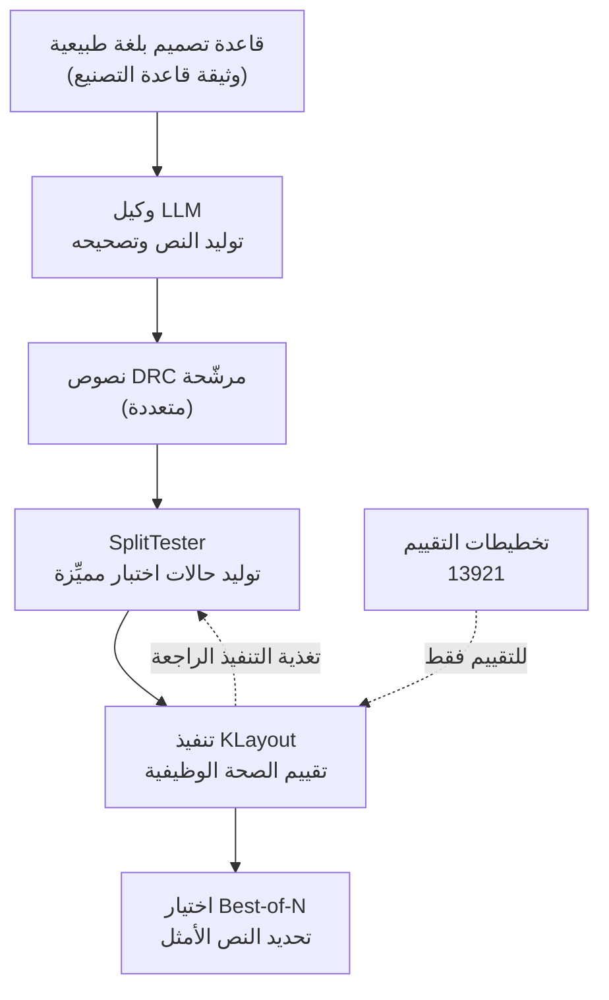

إذا كنت مهندسًا يريد أتمتة التحقق من آلاف قواعد التصميم التي يجب أن تستوفيها الرقاقة قبل الإنتاج الكمي، فهذه المقالة لك. لنبدأ بالخلاصة. إن Rule2DRC (arXiv:2605.15669، من فريق البروفيسور هيون أوه سونغ في جامعة سيول الوطنية ومركز سامسونج للذكاء الاصطناعي، ICML 2026) هو معيار واسع النطاق يقيّم وكلاء LLM الذين يترجمون قواعد التصميم المكتوبة بلغة طبيعية إلى نصوص تحقق DRC قابلة للتنفيذ، عبر ما إذا كانت النصوص تعمل وتنجح فعليًا في محرك تحقق، لا عبر مدى تشابه الشيفرة مع مرجع. علاوة على ذلك، بنى الفريق تطبيق واجهة رسومية لوكيل يعمل على التخطيطات مباشرةً ويمكن نشره داخل الشبكة الداخلية الآمنة لسامسونج. وهو جدير بالمتابعة كإشارة إلى دخول الوكلاء المتخصصين إلى بيئات صناعية صارمة التنظيم والأمان.

*تصوير لأنماط شبكة التخطيط وهي تتدفق إلى منطق تحقق منظّم.*

## لماذا تقرأ هذا

هذه المقالة موجّهة للمهندسين الذين ينشرون وكلاء LLM متخصصين في بيئات منظّمة وآمنة، ولمسؤولي المنصات الراغبين في أتمتة أعمال متخصصة مثل التحقق في EDA وأشباه الموصلات عبر الوكلاء. السؤال الذي تواجهه هو: حين تسند عملًا للتحقق كان يتطلب خبيرًا إلى وكيل، كيف تثق أنه يؤديه بصورة صحيحة فعلًا؟ جواب Rule2DRC واضح. تُشغّل النصوص التي ينتجها الوكيل في محرك تحقق حقيقي وتقيّمها بالصحة الوظيفية. فالشيفرة التي تبدو معقولة والشيفرة التي تعمل فعلًا شيئان مختلفان، والصناعة تحتاج الثانية.

## نظرة عامة

قبل أن تدخل رقاقة أشباه الموصلات الإنتاج الكمي، يجب التحقق من استيفائها لآلاف قواعد التصميم الهندسية. يُسمّى هذا التحقق DRC أي فحص قواعد التصميم. المشكلة أن القواعد نفسها مكتوبة كوثائق بلغة طبيعية. فجملة مثل «يجب ألّا تقل المسافة الدنيا بين الأسلاك المعدنية عن قيمة معيّنة» يجب تحويلها إلى نص بلغة تحقق مخصّصة مثل KLayout أو SVRF قبل أن يتمكن المحرك من فحص التخطيط فعليًا.

هذه الترجمة ليست هيّنة. فمع كل تغيّر في عقدة التصنيع أو في المسبك، كان الخبراء يترجمون آلاف القواعد يدويًا إلى نصوص. ولأن العمل متكرر ويتطلب خبرة عميقة في آن واحد، جاءت محاولات أتمتته بوكلاء LLM بصورة طبيعية. الفكرة بناء وكيل يقرأ وثيقة قاعدة، ويولّد نص تحقق، بل ويصحّح أخطاءه عند وجودها.

تبيّن أن العنق الحقيقي للزجاجة هو تقييم الوكيل بصورة سليمة أكثر من بنائه. حملت المعايير السابقة قيدين. الأول أن مجموعات التقييم صغيرة. والثاني أنها تقيّم النصوص المولّدة بتشابهها مع شيفرة مرجعية لا بتشغيلها فعليًا. علاوة على ذلك، كثيرًا ما تطلبت الطرق السابقة التي استخدمت تغذية التنفيذ الراجعة تخطيطات الاختبار المرجعية كمدخل للوكيل من أجل التقييم. بينما في الواقع لا تُعطى لك مثل هذه التخطيطات.

## ما هو هذا المعيار

يواجه Rule2DRC هذين القيدين مباشرةً. إنه معيار واسع النطاق مكوّن من 1000 مهمة تحويل قاعدة إلى نص، و13921 تخطيط رقاقة لتقييم تلك النصوص. طريقة التقييم هي الجوهر. فهو يشغّل النصوص المولّدة بالذكاء الاصطناعي في محرك التحقق KLayout، ويقيس الصحة الوظيفية بمدى صحة فحصها للتخطيطات. ولا ينظر إلى ما إذا كانت الشيفرة تشبه مرجعًا.

اللافت أن تخطيطات الإجابة لا تُعطى للوكيل كمدخل. فالطرف المقيِّم يملك مخزونًا ضخمًا من تخطيطات التقييم، لكن على الوكيل كتابة النصوص من وثيقة القاعدة وحدها. وهذا يعيد إنتاج الموقف الواقعي بدقة. وهنا يفترق عن الأساليب السابقة التي أظهرت للوكيل مفتاح الإجابة مسبقًا ثم قيّمته.

يوضّح المخطط أدناه مسار التقييم في Rule2DRC.

هنا تأتي المساهمة الثانية، SplitTester. فحين ينتج الوكيل عدة نصوص مرشّحة، يكون اختيار الأفضل أصعب مما يبدو، لأن المرشّحين كثيرًا ما يتصرفون بصورة متشابهة ويتعذّر تمييزهم ظاهريًا. وSplitTester وكيل اختبار يستخدم تغذية التنفيذ الراجعة لتوليد حالات اختبار مميِّزة بنفسه. فهو ينشئ اختبارات تجعل المرشّحين المتعذّر تمييزهم يعطون نتائج مختلفة، فيتضح أيّ مرشّح صحيح فعلًا. وفصل المرشّحين بهذه الطريقة يحسّن بوضوح أداء اختيار Best-of-N، أي مهمة انتقاء نص واحد من بين عدة.

في النتائج الكمية للورقة، كانت الفجوة بين النماذج المتقدمة والنماذج مفتوحة المصدر واضحة، وأدى إلحاق SplitTester إلى تحسين أداء اختيار المرشّحين. أما معدلات النجاح الدقيقة لكل نموذج فننصح بمراجعتها مباشرةً في جداول الورقة. قُبل المعيار في ICML 2026، وذُكر أنه نال جائزة البحث المتميّز وجائزة أفضل ملصق في ورشة NPRC بمركز سامسونج للذكاء الاصطناعي.

## لماذا يهم التقييم القائم على التنفيذ

الانتقال من التقييم بتشابه الشيفرة إلى التقييم القائم على التنفيذ هو مركز الثقل الحقيقي لهذا العمل. فتقييم التشابه يقيس «كم يشبه الإجابة»، والتقييم بالتنفيذ يقيس «هل ينجح فعلًا». والسؤالان مختلفان تمامًا. فالشيفرة التي تبدو مطابقة للإجابة قد تفشل عند تشغيلها، والشيفرة التي تبدو مختلفة تمامًا قد تعمل بإتقان. وما دام جوهر التحقق يكمن في «هل يلتقط مخالفات القواعد فعلًا»، فينبغي أن يتم التقييم بالتنفيذ أيضًا.

وهذا الاتجاه ليس قصة محصورة في تحقق أشباه الموصلات. فنموذج التقييم عبر وكلاء البرمجة عمومًا يتجه إلى المكان نفسه. إنه اتجاه التقييم بالنتائج القابلة للفحص الحتمي: شيفرة تجتاز الاختبارات، وشيفرة تعيد نقاط نهايتها الاستجابات المتوقعة، وشيفرة تترك الصفوف الصحيحة في قاعدة بيانات. فبدلًا من تصديق تقرير النموذج الذاتي بأنه «يبدو أنه نجح»، تدع نتيجة التنفيذ تصدر الحكم.

وما يجعل هذا العمل ذا مغزى خاص هو أنه لم يتوقف عند ذلك. فبالتكامل مع LLM داخلي في بيئة سامسونج الآمنة، بُني تطبيق واجهة رسومية يتعامل مع التخطيطات وشيفرة التحقق في شاشة واحدة. فتجاوز كونه معيارًا وورقة إلى أداة قابلة للنشر في الميدان. وهنا يمكنك قراءة الإشارة إلى أن الوكلاء المتخصصين يدخلون فعلًا صناعات صارمة التنظيم والأمان.

## دلالات على منتجات ThakiCloud

الصورة التي يرسمها Rule2DRC تتقاطع تمامًا مع ما تستهدفه ThakiCloud بمنتجيها. ولأن الموضوع هو تشغيل وكلاء متخصصين في بيئة معزولة أمنيًا، فإن عدسة Paxis مركزية وعدسة ai-platform تسندها.

من منظور الوكلاء، يتلقّى Paxis هذا الطلب مباشرةً. فـ Paxis هو مستوى التحكم Agent-Native Cloud من ThakiCloud الذي يعمل فوق ai-platform، ويتعامل مع Skills وTools وPolicies وAudit Logs كموارد من الدرجة الأولى. وحالة سامسونج المتمثلة في تطبيق واجهة رسومية يعمل على التخطيطات مباشرةً مع تكامل LLM داخلي هي تحديدًا نموذج Agent Builder والنشر داخل المؤسسة لدى Paxis. وعلى وجه الخصوص، يشترك التقييم القائم على التنفيذ في Rule2DRC في الفلسفة نفسها مع تصميم التحقق في Paxis. فحين يقيّم Paxis مهارة، فإنه يميل بالفعل إلى التقييم بنتائج التنفيذ الحتمية، أي التأكيدات وصفوف قاعدة البيانات ومخرجات نقاط النهاية، لا بالتشابه مع مرجع. وطريقة SplitTester في فصل المرشّحين بتغذية التنفيذ الراجعة لرفع Best-of-N جديرة بالاقتباس كمنطق يميّز به المقيِّم في منسّق الوكلاء المتعدد لدى Paxis المخرجات المرشّحة عبر نتائج تنفيذها.

من منظور البنية التحتية، تسند ai-platform هذه الصورة. فخدمة LLM داخلي كخلفية لوكيل تحقق تتطلب مكدس استدلال يعمل بثبات داخل المؤسسة. توفّر ai-platform خدمة vLLM وscale-to-zero فوق جدولة GPU المبنية على K8s وKueue، وتشغّل النماذج في بيئات معزولة متعددة المستأجرين. ولا يمكن لواجهة برمجة سحابية بنظام العدّ بالرمز أن تفي بمتطلبات العزل الشبكي مثل شبكة سامسونج الداخلية. فالاستدلال داخل المؤسسة الذي ينافس بتكلفة خدمة منخفضة هو ما يجعل اقتصاديات مثل هذه الوكلاء المتخصصة ممكنة. فالخدمة منخفضة التكلفة تفتح إمكانية تشغيل الوكلاء باستمرار، وفوق ذلك تتولى بوابات السياسات وسجلات التدقيق في Paxis مسؤولية الامتثال التنظيمي.

باختصار، هذه الحالة دليل على أن الصناعة تحتاج لا إلى روبوتات محادثة عامة بل إلى وكلاء متخصصين يعملون في بيئات معزولة أمنيًا. وSandbox Runtime ومستويات الاستقلالية وPolicy Engine وسجلات التدقيق داخل المؤسسة لدى Paxis تشير تحديدًا إلى هذا الطلب.

## القيود والاعتراضات

تجنّبًا للمبالغة في تقدير هذا العمل، أشير إلى الجانب الآخر. أولًا، مساهمة Rule2DRC الأساسية هي المعيار ومنهجية التقييم، لا الادعاء بأن أتمتة التحقق باتت مكتملة. فحتى النماذج المتقدمة لم تترجم كل قاعدة إلى نص بإتقان، ووجود فجوة يعني أيضًا أننا لسنا بعد في مرحلة إحلال الخبراء البشر.

ثانيًا، التقييم القائم على التنفيذ ممكن فقط حين يتوفر محرك التحقق وتخطيطات التقييم. أعدّ Rule2DRC 13921 تخطيطًا، لكن بناء مجموعة تقييم قابلة للتنفيذ بالحجم نفسه لعملية تصنيع جديدة أو مجال مختلف هو بحد ذاته كلفة كبيرة. فكون التقييم بالتنفيذ أصح من التقييم بالتشابه، وكون إعداد بيئة التنفيذ تلك ممكنًا بثمن زهيد في كل مكان، أمران منفصلان.

ثالثًا، ظهور تطبيق واجهة رسومية داخل المؤسسة، ومقدار ما قلّصه فعليًا من العمل اليدوي للخبراء في الممارسة، سؤالان مختلفان. فلا تزال هناك مسافة بين إثبات في مرحلة الورقة وموثوقية التشغيل الميداني، وما يجسر تلك المسافة ليس معيارًا بل بيانات تشغيل متراكمة عبر الزمن.

## الخلاصة

إذا اختصرنا رسالة Rule2DRC في جملة واحدة، فهي: ينبغي تقييم الوكلاء المتخصصين بالشيفرة التي تنجح فعلًا لا بالشيفرة التي تبدو معقولة، وفقط حين تستطيع تقييمهم بهذه الطريقة يمكنك نشرهم في بيئات منظّمة وآمنة. يمتد خيط واحد من معيار يقيّم العمل المتخصص لتحويل القواعد بلغة طبيعية إلى نصوص تنفيذ بنتائج التنفيذ حتى بلا تخطيطات إجابة، إلى SplitTester الذي يميّز المرشّحين فوق ذلك، إلى تطبيق واجهة رسومية داخل المؤسسة.

إذا كنت تصمّم وكيلًا متخصصًا، فالخطوة التالية واضحة. أنشئ أولًا بوابة تقيّم المخرجات بنتائج التنفيذ لا بالتشابه، وعند تعدّد المرشّحين ألحِق اختبارات مميِّزة تفصل بينهم. وتدمج ThakiCloud هذين بالفعل في الممارسة عبر المقيِّم في Paxis وخدمة الاستدلال داخل المؤسسة في ai-platform. إذا أردت أتمتة التحقق، فدَع التنفيذ يصدر الحكم.

## المصادر

- الورقة: [Rule2DRC (arXiv:2605.15669)](https://arxiv.org/abs/2605.15669)
- أخبار كلية الهندسة بجامعة سيول الوطنية: [SNU Engineering News](https://eng.snu.ac.kr/en/communication/promotion/news?md=v&bbsidx=8189&sc=y)
