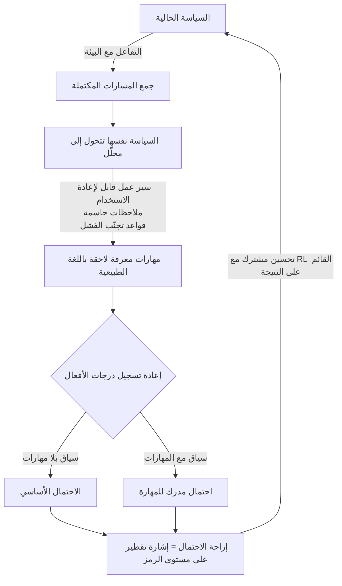

إذا كنت تدرّب وكلاء نماذج لغوية كبيرة (LLM agents) تتحرك عبر استخدام الأدوات متعدد الأدوار (multi-turn tool use) وتغذية البيئة الراجعة باستخدام التعلّم المعزّز (RL)، فهذا المقال موجّه إليك. إليك الخلاصة أولاً. السبب الأكثر شيوعاً في ضعف أداء agentic RL ليس أن النموذج ضعيف، بل أن المكافأة تصل مرة واحدة فقط في نهاية المسار، وSEED يحوّل تلك الإشارة النادرة الوحيدة إلى إشراف كثيف على مستوى الرمز عبر جعل الوكيل يحلّل مساراته الخاصة، ويستخرج مهارات باللغة الطبيعية، ويقطّرها عائدةً إلى نفسه. رفعت هذه الطريقة كلاً من الأداء وكفاءة العيّنة (sample efficiency) عبر مهام الوكلاء النصية والبصرية على حد سواء.

*تصوير تجريدي لحلقة SEED ذاتية التطور: استخراج المهارات من المسارات المكتملة وتغذيتها عائدةً إلى السياسة (policy) نفسها.*

## لماذا يستحق هذا المقال القراءة

كُتب هذا المقال للمهندس الذي يجري التدريب اللاحق (post-training) للوكلاء باستخدام التعلّم المعزّز، ولمسؤول المنصة الذي يصمم البنية التحتية للتدريب من تحته. أنت أمام قرار واحد: كيف تدفع بإشراف إضافي إلى خط أنابيب RL يكافئ حالياً النتيجة فقط؟ يجيب SEED (Self-Evolving On-Policy Distillation، arXiv:2607.14777) بمسار لا يستخدم نموذج معلّم قوياً منفصلاً ولا نموذج مكافأة بشري الصنع، بل السياسة نفسها بوصفها معلّمة لذاتها. باختصار، إن حلقة تحليل المسار، واستخراج مهارات قابلة لإعادة الاستخدام، واستخدام مقدار ما تحدثه تلك المهارات من إزاحة في احتمالات الأفعال بوصفه إشارة التدريب، تصنع إشرافاً على القرارات الوسيطة دون أي تسميات (labels) إضافية.

## نظرة عامة

قادت السنوات القليلة الماضية من تدريب نماذج الاستدلال التعلّمُ المعزّز القائم على النتيجة، أي عائلة RLVR التي تستخدم مكافآت قابلة للتحقق. تمنح مكافأة على مستوى المسار مثل 1 للصحيح و0 للخطأ وتدفع السياسة إلى الأعلى. في مسائل الرياضيات أو البرمجة ذات الاستجابة الواحدة، ينجح هذا جيداً. المشكلة هي الوكلاء. في مسار طويل يستدعي الأدوات مراراً، ويتلقى ملاحظات، ثم يتصرف مجدداً، لا يخبرك نجاح الإجابة النهائية بشيء يُذكر عن جودة كل قرار من عشرات القرارات الوسيطة بينهما. تنفتح فجوة إشراف (supervision gap) بين النتيجة على مستوى الحلقة (episode) والتعلّم على مستوى الرمز. تلك الفجوة هي العائق الجوهري الذي يقضم كفاءة العيّنة في agentic RL.

يقترح SEED طريقة لسدّها. الفكرة الجوهرية أن المسار المكتمل يحتوي أصلاً على ما يستحق التعلّم. المسار الناجح يحمل سير عمل (workflow) قابلاً لإعادة الاستخدام، والفاشل يحمل فخاً يجب تجنّبه. يجعل SEED هذه المعرفة اللاحقة (hindsight) صريحة على هيئة مهارات باللغة الطبيعية، ثم يقطّرها عائدةً إلى السياسة. والمحلّل الذي يستخرج هذه المهارات ليس نموذجاً خارجياً بل السياسة الحالية نفسها. إنها بنية ذاتية التطور تقوم فيها السياسة بجمع المسارات واستخراج المهارات منها في آن واحد.

## ما هو SEED

في جملة واحدة، SEED إطار ذاتي التطور يحوّل المسارات المكتملة على السياسة (on-policy) إلى مهارات معرفة لاحقة في زمن التدريب ويقطّر أثرها السلوكي عائداً إلى نموذج السياسة. قسّمه إلى ثلاث خطوات تتضح البنية.

أولاً، يُضبط النموذج بدقة (fine-tuned) ليحلل المسارات المكتملة ويولّد مهارات باللغة الطبيعية. تلتقط هذه المهارات سير العمل القابل لإعادة الاستخدام، أو الملاحظات الحاسمة، أو قواعد تجنّب الفشل. فبدلاً من أن يحقن إنسانٌ القواعد عبر موجّه (prompt)، يستخرج النموذج القواعد من تجربته الخاصة ويصوغها لغةً.

ثانياً، أثناء RL تؤدي السياسة الحالية دورين في وقت واحد. أحدهما التفاعل مع البيئة وجمع المسارات كالمعتاد، والآخر أن تكون المحلّل الذي يستخرج مهارات المعرفة اللاحقة من تلك المسارات. ولأنه لا يوجد معلّم منفصل، لا ينشأ عدم توافق في التوزيع بين المعلّم والطالب، وتبقى المهارات متوائمة مع توزيع المسارات الذي تسلكه السياسة فعلاً في هذه اللحظة.

ثالثاً، وهنا الأداة الجوهرية في SEED، يعيد تسجيل درجات الأفعال المُعاينة (sampled actions) ضمن سياقين. أحدهما سياق عادي دون مهارات، والآخر سياق مُعزَّز بالمهارات المستخرجة. مقدار ارتفاع أو انخفاض احتمال فعل معيّن عند إرفاق المهارة، تلك الإزاحة في الاحتمال، يصبح إشارة تقطير كثيفة على مستوى الرمز وعلى السياسة (on-policy). ثم تُحسَّن هذه الإشارة بالاشتراك مع RL القائم على النتيجة. إنها تدفع السياسة نحو الأفعال التي كانت ستختارها باحتمال أعلى لو كانت المهارة حاضرة، والأهم أن هذا الإشراف المساعد يبقى متوائماً مع توزيع المسارات الحالي.

يوضّح المخطط أدناه الحلقة.

التباين مع المقاربات السابقة واضح. التقطير من معلّم خارجي قوي يتطلب إيجاد ذلك المعلّم، وإذا انحرف توزيعا المعلّم والطالب تلوّثت الإشارة. وبناء نموذج مكافأة بشري باهظ التسميات. يتجنّب SEED كليهما. المعلّم هو السياسة نفسها، والتسميات تُستخرج آلياً من المسارات، والإشارة متوائمة مع السياسة الحالية في كل خطوة.

## ما الذي تقرّره الورقة البحثية

تُبلغ الورقة عن تجارب واسعة على مهام الوكلاء النصية والبصرية معاً. اتجاه النتائج متسق. حسّن SEED كلاً من الأداء وكفاءة العيّنة، وكان تعميمه على سيناريوهات لم تُرَ أثناء التدريب متيناً. ومقارنةً بطرائق أساس قوية، حقق أقوى متوسط أداء عبر ثلاثة معايير قياس (benchmarks) تمثيلية للوكلاء، وهو الادعاء المركزي للورقة.

تجدر هنا ملاحظة صادقة. كُتب هذا المقال استناداً إلى مُلخّص الورقة وملخّصها العام، ونشجعك على التحقق من الأرقام لكل معيار مباشرةً في المصدر. هذه ليست قيماً قِسناها عبر إعادة إنتاج منفصلة، لذا بدلاً من اقتباس أرقام مطلقة ركّزنا على نقل بنية النتائج واتجاهها. حتى الاتجاه وحده يحمل دلالة واضحة. كفاءة عيّنة أعلى تعني بلوغ الأداء نفسه بعدد أقل من المسارات، أي ساعات GPU أقل، وهذا يقابل مباشرةً توفير أغلى مورد لأي جهة تُشغّل agentic RL فعلاً.

## ماذا يعني هذا لـ ThakiCloud

تمسّ الفكرة التي يطرحها SEED كلا المنتجين اللذين تشغّلهما ThakiCloud.

زاوية Paxis مباشرة على نحو خاص. Paxis هي سحابة ThakiCloud الأصيلة للوكلاء (Agent-Native Cloud)، وتعامل المهارات والأدوات والسياسات وسجلات التدقيق (audit logs) بوصفها موارد من الدرجة الأولى. وفي داخلها طبقة مهارات ذاتية التطور يستخرج فيها الوكلاء المهارات من التجربة ويتحسّنون من تلقاء أنفسهم. ما أثبته SEED أكاديمياً هو هذه الفكرة بالضبط: أن حلقةً تجعل المسارات المكتملة صريحة على هيئة مهارات باللغة الطبيعية وتغذيها عائدةً إلى السلوك تُحسّن السياسة فعلاً. وإذا كان مُسخّر المهارات (skill harness) في Paxis يختار من أكثر من 960 مهارة عبر BM25، وينفّذها في صناديق رمل (sandboxes) معزولة، ويمرّر كل فعل عبر بوابات السياسة وسجلات التدقيق، فإن SEED يقدم السند النظري في زمن التدريب لكيفية ولادة تلك المهارات من التجربة وصقلها. والمهارات المعبّر عنها باللغة الطبيعية يمكن للبشر قراءتها وتدقيقها، وهو ما يتلاءم جيداً مع فلسفة تصميم Paxis التي تُعلي شأن بوابات السياسة وسجلات التدقيق.

وثمة زاوية ai-platform أيضاً. إن تشغيل طريقة مثل SEED فعلياً يتطلب خط أنابيب تدريب لاحق يحسّن بالاشتراك RL القائم على النتيجة وإشارة تقطير، وهذا يستهلك موارد GPU كبيرة. تُشغّل منصة ai-platform لدى ThakiCloud تدريباً لاحقاً مثل SFT وDPO وGRPO فوق جدولة GPU القائمة على Kueue والخدمة متعددة المستأجرين (multi-tenant serving). ويتحول تحسين كفاءة العيّنة الذي يؤكده SEED مباشرةً إلى تكلفة على هذه البنية التحتية. فبلوغ جودة الوكيل نفسها بعدد أقل من المسارات يعني استيعاب مزيد من مهام التدريب على مجمع GPU مشترك، أو التدريب بعمق أكبر ضمن الميزانية نفسها.

## الحدود والاعتراضات

بنية SEED ذاتية التطور قوية، لكن كون السياسة تؤدي دور المحلّل أيضاً سيف ذو حدين. ففي المرحلة المبكرة حين تكون السياسة ما تزال ضعيفة، تكون جودة المهارات التي تستخرجها منخفضة بالضرورة كذلك، وإشارة تقطير مبنية على مهارات منخفضة الجودة قد تدفع التعلّم في الاتجاه الخطأ. وثمن عدم استخدام معلّم خارجي قوي هو أن تأمين جودة الإشارة خلال طور التمهيد (bootstrap) المبكر يصبح المعضلة العملية.

كما أن استخراج المهارات وإعادة تسجيل درجات الأفعال ضمن سياقين يضيف حسابات فوق RL القائم على النتيجة الصرف. والمقايضة بين مكسب تقليل عدد المسارات بفضل كفاءة عيّنة أفضل وكلفة إضافة التحليل وإعادة التسجيل لكل مسار ستعتمد على المهمة والحجم. وأخيراً، فإن النتائج التي يستند إليها هذا المقال هي لثلاثة معايير اختارتها الورقة، وما إذا كان المكسب ينتقل سليماً إلى مجالات أخرى، ولا سيما وكلاء الإنتاج الحقيقيين ذوي منظومات أدوات مختلفة جداً، يحتاج إلى تحقق منفصل.

## الخلاصة

إن تشخيص عائق التعلّم المعزّز للوكلاء بوصفه فجوة إشراف لا نقصاً في قدرة النموذج يشير إلى اتجاه: قبل توسيع النموذج، اجعل الإشارة أكثر كثافة. يُظهر SEED مساراً إلى تلك الإشارة الأكثف لا يشتريها من الخارج بل يستخرجها، على هيئة مهارات باللغة الطبيعية، من مسارات أنتجها الوكيل بالفعل ويعيدها إلى نفسه. إذا كنت تُشغّل خط أنابيب agentic RL، فالأمر الوحيد الذي تأخذه اليوم واضح. إن كنت تكافئ النتيجة فقط، فلا تُلقِ المسار جانباً؛ تحقق أولاً مما إذا كان ثمة متسع لاستخراج مهارات معرفة لاحقة وإعادة تدويرها إشرافاً على مستوى الرمز. فقد يكون ذلك الرافعة الأرخص للتجربة قبل نموذج أكبر أو معلّم أقوى.

المصدر: [SEED: Self-Evolving On-Policy Distillation for Agentic Reinforcement Learning (arXiv:2607.14777)](https://arxiv.org/abs/2607.14777)
