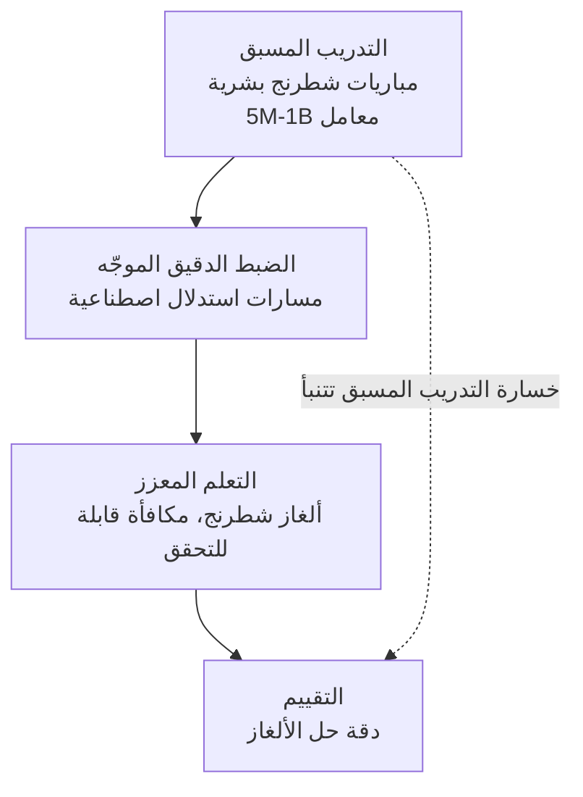

إذا كنت مهندساً يحاول تحسين نموذج استدلال عبر مرحلة ما بعد التدريب بالتعلم المعزز (RL)، وتتساءل عن كيفية توزيع ميزانية GPU بين التدريب المسبق وRL، فإن هذا البحث يقدّم إجابة واضحة. الخلاصة الأساسية هي التالية: السقف الذي يمكن أن يصل إليه أداء الاستدلال عبر RL محدد مسبقاً بواسطة التدريب المسبق، والعلاقة بينهما منتظمة إلى درجة يمكن التنبؤ بها من رقم واحد فقط، هو خسارة التدريب المسبق. توصل فريق بحثي من NYU وModal Labs وUCLA، مستخدماً الشطرنج كمنصة تجريبية مضبوطة، إلى قانون تحجيم موحد يمتد عبر خط الأنابيب بأكمله، من التدريب المسبق وصولاً إلى مرحلة ما بعد التدريب بـRL.

*يشكّل التدريب المسبق الأساس الذي يحدد سقف أداء RL لاحقاً.*

## لماذا تستحق هذه المقالة القراءة

هذا القسم موجّه للمهندسين الذين يديرون خطوط أنابيب تدريب نماذج اللغة الكبيرة بأنفسهم، ولفرق المنصات التي عليها توزيع ميزانية GPU محدودة بين التدريب المسبق وSFT وRL. الخلاصة الجوهرية هي أن RL ليست سحراً يجعل النموذج ذكياً من العدم، بل هي مرحلة ترفع الأداء ضمن سقف رسمه التدريب المسبق سلفاً، ويمكن تقدير هذا السقف مسبقاً من خسارة التدريب المسبق. معرفة هذه الحقيقة تجنّبنا هدر الجهد في محاولات مثل "لنشغّل RL طويلاً على نموذج صغير ونرى النتيجة"، وتتيح لنا اتخاذ قرار مبني على دليل بشأن أين ننفق موارد الحوسبة أولاً.

## نظرة عامة

على مدى العامين الماضيين، أصبحت مرحلة ما بعد التدريب بـRL أداة أساسية لتحسين نماذج اللغة الكبيرة في مهام الاستدلال المعقدة، عبر تنقيح النموذج بمكافآت قابلة للتحقق باستخدام طرق مثل GRPO وDPO. غير أن معظم الأبحاث تعاملت مع RL بمعزل عن التدريب المسبق الذي يسبقها، وحسّنت كل مرحلة على حدة.

يربط هذا البحث المرحلتين في خط أنابيب واحد، ويطرح سؤالين جوهريين. أولاً، كيف تحدد خيارات التدريب المسبق (حجم النموذج وكمية البيانات) العائد على موارد حوسبة RL؟ ثانياً، ماذا تفعل RL فعلياً بالنموذج؟ للإجابة عن هذين السؤالين، لا بد من تكرار خط الأنابيب بأكمله، من التدريب المسبق إلى RL، ضمن ظروف مضبوطة، وهو أمر مكلف للغاية مع نماذج اللغة الكبيرة الحقيقية. لهذا السبب لجأ الفريق إلى الشطرنج.

## ما الذي فعلته هذه الدراسة

الشطرنج منصة تجريبية جيدة لدراسة الاستدلال. القواعد واضحة، وجودة أي نقلة يمكن التحقق منها بواسطة محرك شطرنج، ويمكن ضبط الصعوبة بدقة على مستوى كل لغز. نقل الفريق خط أنابيب تدريب نماذج اللغة القياسي إلى الشطرنج مباشرة.

في البداية درّب الفريق نماذج لغوية تتراوح بين 5 ملايين ومليار معامل مسبقاً على مباريات شطرنج بشرية. تلاه ضبط دقيق موجّه على مسارات استدلال اصطناعية، وهي بيانات صُممت لمحاكاة عملية التفكير التي يمر بها الشخص عند اختيار نقلة. أخيراً، شغّل الفريق RL على ألغاز شطرنج، حيث يمكن التحقق من صحة الحل وتُمنح المكافأة دون غموض.

ميزة هذا الإعداد أن الفريق تمكّن من تغيير عدد المعاملات وكمية بيانات التدريب المسبق بحرية، وتكرار خط الأنابيب بأكمله. عملياً، أجرى الفريق على العالم المصغّر للشطرنج تجربة مضبوطة بنطاق كان سيكون غير قابل للتصور مع نماذج اللغة الكبيرة الفعلية.

## النتائج الرئيسية

تنقسم النتائج إلى محورين رئيسيين.

أولاً، قانون تحجيم موحد. عند مستوى معين من موارد حوسبة RL، يمكن التنبؤ بأداء النموذج بعد RL بدقة جيدة من خسارة التدريب المسبق. بعبارة أخرى، مدى جودة التدريب المسبق، قبل أن تلمس RL النموذج، يخبرنا بدقة كبيرة إلى أين ستصل RL في النهاية. وعلاوة على ذلك، يتحسن ميل منحنى مكافأة RL بشكل شبه خطي مع زيادة عدد رموز التدريب المسبق. النموذج الذي خضع لتدريب مسبق أكثر شمولاً يتحسن بوتيرة أسرع لكل وحدة من موارد حوسبة RL.

الأثر العملي لهذه النتيجة يخص توزيع موارد الحوسبة. تشغيل RL لفترة أطول لا يرفع الأداء بلا حدود. فإذا كان التدريب المسبق ضعيفاً، يكون ميل منحنى RL نفسه ضحلاً، وبالتالي فإن ضخ موارد حوسبة Rل نفسها ينتج تحسناً أقل. يُحدد البحث هذه العلاقة كمياً، ويوفر أساساً لتحديد كيفية توزيع ميزانية إجمالية ثابتة بين التدريب المسبق وRL.

ثانياً، ما تفعله RL فعلياً بالسياسة. تبيّن أن RL لا تكتفي بشحذ سياسة SFT. ففي الألغاز السهلة، تعزّز RL النقلات الصحيحة التي كانت سياسة SFT تفضّلها أصلاً، ما يجعل ما كان النموذج بارعاً فيه أصلاً أكثر موثوقية. أما في الألغاز الصعبة، فإن RL تُظهر إلى السطح نقلات صحيحة لم تكن سياسة SFT تفضّلها، فتكتشف نقلات لم يكن النموذج معتاداً على لعبها. هذه الملاحظة، أن RL تعمل بشكل مختلف نوعياً بحسب مستوى الصعوبة، تتحدى الفهم الشائع الذي يرى RL مجرد عملية تُحدّ من انتشار التوزيع الاحتمالي.

## الآثار على منتجات ThakiCloud

يتصل هذا البحث اتصالاً مباشراً بالمشكلات التي تتعامل معها منصة ai-platform التابعة لـThakiCloud يومياً. تشغّل ai-platform خط أنابيب تدريب فوق جدولة موارد GPU عبر K8s وKueue، وتدعم طرق تدريب متعددة منها SFT وCPT وDPO وGRPO وGKD. عندما يريد عميل تنقيح نموذج استدلال باستخدام ميزانية GPU الخاصة به، فإن أول سؤال يواجهه هو بالضبط هذا السؤال: أين ينبغي إنفاق موارد الحوسبة؟

يمنح قانون التحجيم الموحد في هذا البحث مبدأً للإجابة عن هذا السؤال. زيادة ميزانية RL بينما لا يزال التدريب المسبق أو التدريب المستمر (CPT) ضعيفاً يعني محاولة الصعود بالقوة على منحنى ذي ميل ضحل. في المقابل، خفض خسارة التدريب المسبق أولاً يعني أن نفس ساعات GPU المنفقة في مرحلة RL اللاحقة تشتري تحسناً أكبر. من منظور المنصة، هذا يعني أننا نستطيع تقديم نصيحة قائمة على البيانات حول توزيع الميزانية مرحلة بمرحلة عند جدولة مهام التدريب، باستخدام خسارة التدريب المسبق كمؤشر لتقدير العائد المتوقع من مهمة RL مسبقاً، وضبط أولويات طوابير Kueue وفقاً لذلك.

النتيجة القائلة إن RL تعمل بشكل مختلف بحسب الصعوبة مفيدة أيضاً من الناحية العملية. تشغيل RL على بيانات تميل نحو المهام السهلة قد يعزّز نقاط القوة الحالية فقط دون إظهار قدرات جديدة. مزج قدر كافٍ من المهام الصعبة هو ما يدفع النموذج لاكتشاف سلوكيات صحيحة لم يكن يفضّلها من قبل. بالنسبة لعملائنا الذين يشغّلون GRPO بمكافآت قابلة للتحقق، هذا درس عملي: يجب تصميم توزيع صعوبة الألغاز بشكل متعمّد، لا تركه للصدفة.

الشطرنج، بالطبع، عالم مصغّر، ويختلف عن الاستدلال باللغة الطبيعية في نواحٍ كثيرة. ومع ذلك، فإن شكل قانون التحجيم المكتشف في هذه التجربة المضبوطة مفيد كبوصلة لتحديد اتجاه توزيع موارد الحوسبة في خطوط الأنابيب الحقيقية.

## القيود والحجج المضادة

قبل قبول استنتاجات هذا البحث كما هي، هناك بعض النقاط الجديرة بالتنويه.

أولاً، الشطرنج مجال مغلق بتحقق شبه كامل. يحكم المحرك على جودة أي نقلة بدقة تامة، ما يجعل إشارة المكافأة نظيفة. أما في الاستدلال الحقيقي باللغة الطبيعية، فقد تكون المكافأة نفسها مشوبة بالضجيج والتحيّز. مسألة ما إذا كان قانون التحجيم النظيف الذي يصمد في الشطرنج يحافظ على الشكل نفسه في ظل مكافآت العالم الحقيقي الفوضوية سؤال منفصل.

ثانياً، يتراوح حجم النموذج هنا بين 5 ملايين ومليار معامل، وهو حجم صغير مقارنة بالنماذج الرائدة. الاستقراء في قوانين التحجيم أمر محفوف بالمخاطر. لا يوجد ما يضمن أن العلاقة الخطية الملحوظة عند هذا الحجم تستمر في الصمود عند حجم عشرات المليارات من المعاملات. البحث نفسه يقدّم هذه النتيجة باعتبارها اكتشافاً من منصة تجريبية مضبوطة، لا ادعاءً مؤكداً على نطاق النماذج الرائدة.

ثالثاً، التنبؤ بأداء النموذج بعد RL من مؤشر واحد هو خسارة التدريب المسبق أمر قوي، لكنه قد يعجز عن التمييز بين العوامل التي خفضت الخسارة فعلياً. فعندما تنتج جودة البيانات وكميتها الخسارة نفسها بطرق مختلفة، تبقى مسألة ما إذا كان سلوك Rل اللاحق متطابقاً فعلاً تحتاج إلى مزيد من التحقق.

## الخلاصة

يقلب هذا البحث الممارسة المعتادة بمعاملة RL بمعزل عن التدريب المسبق، ويربط المرحلتين في قانون تحجيم موحد واحد. يمكن التنبؤ بأداء الاستدلال بعد RL من خسارة التدريب المسبق، ويتحسن ميل منحنى RL بشكل شبه خطي مع عدد رموز التدريب المسبق. تدعم هذه النتيجة الاستنتاج المطروح في البداية: السقف الذي يمكن أن يصل إليه أداء RL محدد مسبقاً بواسطة التدريب المسبق.

الدرس العملي واضح. قبل زيادة ميزانية RL لتنقيح نموذج استدلال، تحقق أولاً من أن التدريب المسبق أو التدريب المستمر بلغ مستوى كافياً. خسارة التدريب المسبق مؤشر يتيح لك تقدير العائد المتوقع من RL مسبقاً. واحرص على أن تمزج بيانات RL قدراً كافياً من المهام الصعبة كي يكتشف النموذج سلوكيات صحيحة لم يكن يفضّلها أصلاً. تدمج منصة ai-platform التابعة لـThakiCloud هذا المبدأ في جدولة مهام التدريب، لمساعدة العملاء على توزيع ميزانية GPU بحكمة في كل مرحلة.

## المصادر

- [Understanding Reasoning from Pretraining to Post-Training (arXiv:2607.16097)](https://arxiv.org/abs/2607.16097)
- [النص الكامل للبحث بصيغة HTML (arXiv)](https://arxiv.org/html/2607.16097)
- [خيط تعريف المؤلف Pavel Izmailov (X)](https://x.com/Pavel_Izmailov/status/2079268684317508020)
</content>
