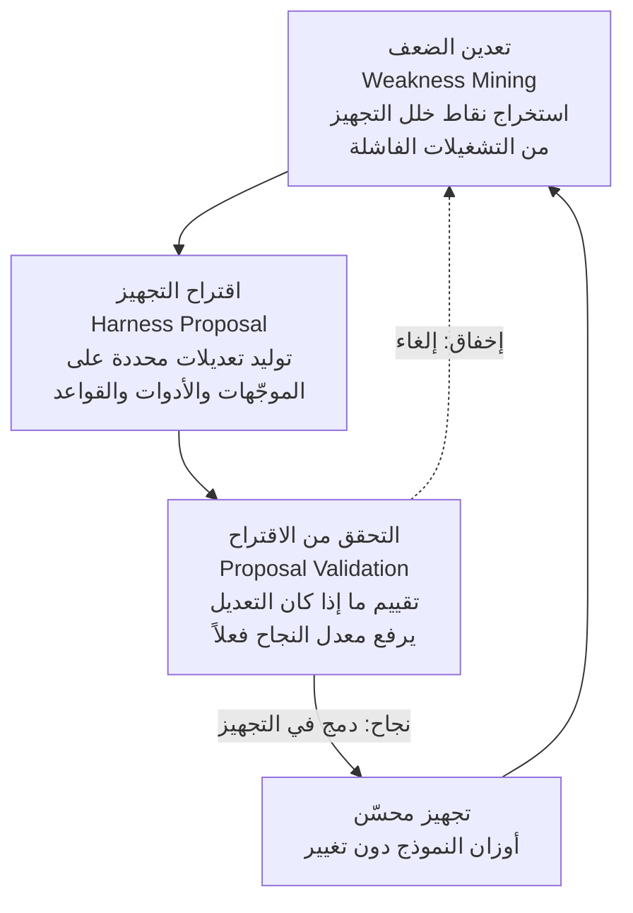

إن كنت تُشغّل تجهيز وكيل في الإنتاج، فأنت على الأرجح تتساءل دائماً أين يختبئ الهامش المتاح لرفع معدلات النجاح بعد أن تتوقف عن استبدال النموذج بآخر أكبر. خلاصة Self-Harness (arXiv 2606.09498) هي أن هذا الهامش لا يقع في النموذج بل في التجهيز، والمدهش أن الوكيل يستطيع استعادة جزء كبير منه بإصلاح تجهيزه بنفسه من دون تدخل بشري. أما مدى ارتفاع حلقة التحسين الذاتي هذه فيعتمد لا على المُولّد بل على مدى صرامة المُقيّم. يعرض هذا المقال الآلية وحدودها.

## لماذا تقرأ هذا

هذا المقال موجّه للمهندسين الذين يُشغّلون تجهيز وكيل مباشرة، ولمسؤولي المنصات الراغبين في تصميم حلقة تحسين ذاتي. نقصد بالتجهيز كامل الهيكل المحيط بالنموذج: موجّه النظام وتعريفات الأدوات وقواعد التوجيه وبوابات التحقق من المخرجات. الخلاصة الجوهرية أن رافعة رفع أداء الوكيل ليست فقط استبدال النموذج بل تحسين التجهيز، وأن الوكيل يستطيع تكرار ذلك التحسين بنفسه. غير أن السقف يحدده جودة المُقيّم. معرفة هذا تتيح لك تأجيل القرار الانعكاسي "الأداء ضعيف فلننتقل إلى نموذج أكبر" وإصلاح التجهيز والمُقيّم أولاً.

## نظرة عامة

خلال العامين الماضيين انتقل مركز ثقل أبحاث الوكلاء من النموذج نفسه إلى الهيكل المحيط به. تأكد مراراً أن النتائج تتغير كثيراً بالنموذج ذاته تبعاً لكيفية كتابة موجّه النظام والأدوات المقدَّمة وطريقة تغذية الإخفاقات عكسياً. ومع ذلك ظل تحسين هذا التجهيز مهمة مهندس بشري: العمل اليدوي الممل في جمع حالات الفشل وقراءتها وتنقيح الموجّهات وصقل الأدوات.

يُسلّم Self-Harness هذا العمل اليدوي إلى الوكيل. من دون جلب مهندس بشري أو وكيل خارجي أقوى، يجعل الوكيل يُصلح تجهيزه بنفسه. السؤال الذي تطرحه الورقة بسيط: كم يرتفع الأداء إذا تركت أوزان النموذج دون مساس وأصلحت التجهيز وحده مراراً، وأين يتوقف ذلك التحسين؟

## ما هو هذا البحث

عمود Self-Harness حلقة من ثلاث مراحل متشابكة: تعدين الضعف (Weakness Mining)، واقتراح التجهيز (Harness Proposal)، والتحقق من الاقتراح (Proposal Validation).

المرحلة الأولى، تعدين الضعف، تنقّب في التشغيلات الفاشلة لتجد أي جزء من التجهيز سبّب المشكلة. النقطة ليست مجرد "كان خطأً" بل تحديد أي ملف أو أي إجراء قاد الوكيل في الاتجاه الخطأ. المرحلة الثانية، اقتراح التجهيز، تستهدف ذلك الضعف وتُنتج تعديلات محددة لكيفية تغيير موجّه النظام وتعريفات الأدوات وقواعد التوجيه. المرحلة الثالثة، التحقق من الاقتراح، تتحقق مما إذا كان ذلك التعديل يرفع معدل النجاح فعلاً. التعديلات التي تجتاز هنا فقط تُدمج في التجهيز، وما لا يجتاز يُلغى.

النقطة الحاسمة في هذا الهيكل أن أوزان النموذج لا تُدرَّب إطلاقاً. الشيء الوحيد الذي يتحسن هو الهيكل خارج النموذج. وهذا يترك مجالاً للفرق التي لا تملك ميزانية لإعادة تدريب الأوزان، وللفرق التي تستخدم نماذج مغلقة عبر واجهة برمجية فقط، لتطبيق هذه الطريقة مباشرة.

## النتائج التجريبية الفعلية

شغّلت الورقة Self-Harness على معيار اسمه Terminal-Bench-2.0 بثلاثة نماذج أساس. النتائج ملخّصة أدناه.

| النموذج الأساس | معدل النجاح قبل | معدل النجاح بعد | التحسن النسبي |
|---|---|---|---|
| MiniMax M2.5 | 40.5% | 61.9% | نحو +53% |
| Qwen3.5-35B-A3B | 23.8% | 38.1% | نحو +60% |
| GLM-5 | 42.9% | 57.1% | نحو +33% |

أظهرت النماذج الثلاثة جميعها مكاسب واضحة في معدل النجاح على مسائل محجوزة (لم تُستخدم في التحسين)، رغم أن الأوزان لم تُمسّ. بلغ التحسن النسبي لـ Qwen3.5-35B-A3B نحو 60%. ومن اللافت أيضاً أن النموذج الأضعف بدايةً تحسّن بأكبر هامش بالقيم المطلقة، ما يفتح قراءة مفادها أن كلما كان التجهيز أهشّ زاد المجال المتاح لإصلاح نفسه.

تنبيه هنا: هذه الأرقام قيم أكدناها من ملخص الورقة ومقدمتها، لا أرقام أعدنا إنتاجها بأنفسنا. يقيس Terminal-Bench-2.0 القدرة على تنفيذ مهام حقيقية في بيئة طرفية، لذا فإن ما إذا كانت التقنية ذاتها تنتقل بالهامش نفسه إلى مجالات أخرى (كتوليد المستندات أو تحليل البيانات) يجب التحقق منه على حدة.

## العنق الحقيقي لحلقة التحسين الذاتي: المُقيّم

أجدر مقطع بالتأمل في هذه الورقة ليس أرقام الأداء بل أين تتوقف تلك الأرقام. المرحلة الثالثة، التحقق من الاقتراح، هي مُقيّم هذه الحلقة. وحلقة التحسين الذاتي تميل إلى التوقف لحظة يكفّ المُقيّم عن أن يصير أصعب. إذا كان معيار قبول الاقتراح متساهلاً، يظل الوكيل يقبل تغييرات لا تجعله أفضل فعلاً، وتدور الحلقة في مكانها.

يتطابق هذا تماماً مع نظام داخلي شددنا عليه مراراً: قبل دمج النتائج المتفرّعة يجب إغلاقها بمرحلة تحقق، وأن يكون ذلك التحقق تخاصمياً بمنظور مختلف عن المُولّد، وأن السبب الأشيع لضعف الجودة ليس "النموذج ضعيف" بل "لا توجد مرحلة تحقق أو أنها ضعيفة". يدعم Self-Harness هذا المبدأ بأرقام معيارية. أي إن أردت رفع سقف التحسين الذاتي فاجعل المُقيّم أكثر صرامة قبل أن تكبّر المُولّد.

## دلالات لمنتجات ThakiCloud

هذه الورقة مباشرة بوجه خاص من منظور Paxis لدينا. Paxis هو Agent-Native Cloud من ThakiCloud، مستوى تحكّم يتعامل مع Skills وTools وPolicies وAudit Logs كموارد من الدرجة الأولى. يختار من أكثر من 960 مهارة عبر BM25، ويشغّلها في صناديق رمل معزولة، ويمرّر كل فعل عبر بوابات السياسة وسجلات التدقيق. التجهيز الذي يتحدث عنه Self-Harness، أي مجموعة الموجّهات والأدوات وقواعد التوجيه، هو بالضبط تجهيز مهارات Paxis.

تنطبق حلقة المراحل الثلاث في Self-Harness طبيعياً على طبقة المهارات ذاتية التطور في Paxis. تعدين الضعف الذي يسحب نقاط الضعف من سجلات التشغيل الفاشلة تتولاه روتينات الاستعادة والتعدين لدينا، واقتراح التجهيز يقابل مرحلة التطور التي تنقّح المهارات والقواعد، والتحقق من الاقتراح يقابل البوابات الحتمية والتصويت التخاصمي. خلاصة الورقة أن "المُقيّم هو العنق" تلامس مباشرة نظامنا في امتلاك البوابات بالشيفرة وفصل مرحلة التحقق عن المُولّد واعتبار المُقيّم الذي لا يرفض شيئاً معطوباً.

من زاوية البنية التحتية تعمل عدسة ai-platform جنباً إلى جنب. تحسين الأداء بإصلاح التجهيز وحده يعني التحسين بتغيير هيكل زمن الاستدلال فقط، من دون إعادة تدريب مكلفة. في بيئة خدمة متعددة المستأجرين قائمة على K8s، يفتح هذا مساراً لتحسين تجهيزات كل عميل تكرارياً من دون دفع تكاليف إعادة تدريب GPU. الخدمة منخفضة التكلفة تصنع اقتصاديات الوكلاء، وفوقها يرفع التحسين الذاتي للتجهيز الجودة.

## القيود والحجج المضادة

لـ Self-Harness حدود واضحة أيضاً. أولاً، سقف هذه الطريقة مرتبط في النهاية بجودة المُقيّم. إن عجزت مرحلة التحقق عن فصل الأداء الحقيقي بشكل صحيح، تتوقف الحلقة أو، أسوأ، تفرط في المواءمة مع أنماط خاصة بالمعيار. ثانياً، هذه أرقام من معيار واحد محدد، Terminal-Bench-2.0، لذا لم يتأكد ما إذا كان الهامش نفسه يتكرر تحت توزيع مهام مختلف. ثالثاً، ثمة خطر أن ينمو التجهيز في اتجاهات يصعب ضبطها كلما كبر وتعقّد بنفسه. إن تُرك يُصلح نفسه بلا حدود دون مراجعة بشرية، قد يبلغ حالاً لا يستطيع أحد فيها تفسير سبب تصرفه.

لذا عند إدخال هذه التقنية في نظام حقيقي، الأوقع إضافة ضمانات، بأن يراجع البشر عينات دورياً ويقووا المُقيّم نفسه باستمرار، بدلاً من ترك التحسين الذاتي يعمل بذاتية كاملة. مبدأ أن الأتمتة أداة لمساعدة التفكير لا لاستبداله ينطبق هنا أيضاً.

## الخلاصة

اختصاراً في جملة واحدة، الدرس العملي من Self-Harness هو: حين يصطدم أداء الوكيل بجدار، أول ما يجب لمسه ليس نموذجاً أكبر بل التجهيز والمُقيّم الذي يقيّمه. نتيجة رفع معدلات النجاح بأكثر من 60% نسبياً من دون المساس بأوزان النموذج تُظهر أن قدراً كبيراً من الأداء غير المستعاد لا يزال داخل الهيكل. لكن سقف تلك الاستعادة يحدده المُقيّم. إن كنت تُشغّل حلقة تحسين ذاتي، نقترح أن تجعل المُقيّم أكثر صرامة قبل المُولّد في سبرينتك القادم. تلك هي الرافعة الأوثق التي أثبتتها هذه الورقة بالأرقام.

## المصادر

- Self-Harness: Harnesses That Improve Themselves، arXiv 2606.09498 (<https://arxiv.org/abs/2606.09498>)
