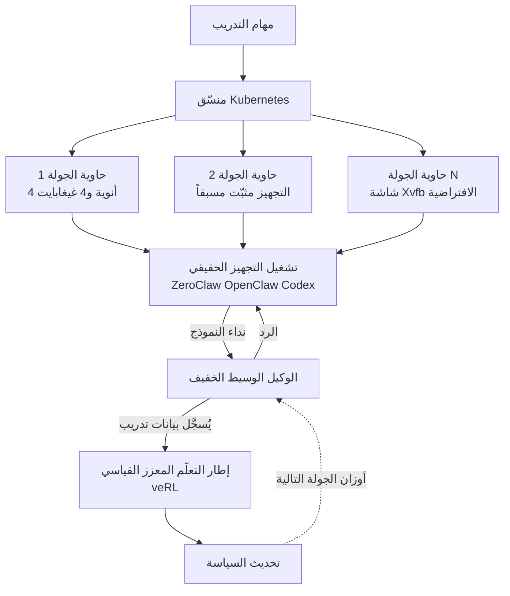

إن سبق أن ضبطت وكيلاً بالتدريب الدقيق فقد عشت هذا على الأرجح: تدرّب على حلقة ReACT بسيطة، ثم تنشر فوق تجهيز معقّد مثل Claude Code أو Codex. خلاصة ورقة OpenForgeRL (arXiv 2607.21557) أن هذا التنافر يمكن سدّه بوكيل وسيط واحد ومنسّق Kubernetes واحد، من دون إعادة كتابة إطار التعلّم المعزز لديك إطلاقاً. ونموذج بحجم 8 مليارات معامل مدرَّب بهذه الطريقة ينافس نماذج أكبر منه بكثير مستخدماً 2,500 مهمة فقط.

## لماذا تقرأ هذا

هذا المقال موجّه لمهندسي تعلّم الآلة الذين يدرّبون نماذج الوكلاء بعد التدريب الأساسي، ولكل من يصمم بنية التدريب في منصة وكلاء داخلية. الخلاصة الجوهرية هي التالية: عنق الزجاجة في أداء الوكلاء ليس خوارزمية التعلّم، بل اختلاف بيئة التنفيذ وقت التدريب عنها وقت النشر، وهذه الفجوة لا تُسدّ إلا بإدخال التجهيز نفسه في حلقة التدريب. وحين تقبل هذا تتغيّر استراتيجية بياناتك: بدلاً من جمع مهام أكثر، تربح بتشغيل مهام أقل داخل التجهيز الذي ستنشر به فعلاً. تعرض الورقة حالة تتفوق فيها 2,500 مهمة على نموذج دُرِّب بـ 200,000.

## نظرة عامة

الورقة من جامعة كولومبيا وكلية دارتموث ومايكروسوفت ريسيرش، ونُشرت على arXiv في 23 يوليو 2026 مع نسخة منقّحة في اليوم التالي. مؤلفوها عشرة، منهم Xiao Yu وBaolin Peng، ويستهدف عنوان الورقة مؤتمر ICLR 2027.

طرح المشكلة نابع من الميدان. كل وكيل ذي قدرة اليوم يعمل فوق تجهيز استدلال متطور. فـ Claude Code وCodex وOpenClaw تدير الاستدلال متعدد الأدوار واستخدام الأدوات والوصول إلى الأنظمة الخارجية. والمشكلة أن هذه التجهيزات معقّدة بقدر ما هي قوية: يحمل التجهيز حالة، ويمتد عبر عمليات متعددة، ويستدعي داخلياً أدوات ويلمس ملفات ويشغّل أصدافاً. وأطر SFT وRL المفتوحة لا تستطيع التعبير عن هذا النوع من الاستدلال في نموذج بياناتها، لأن معظمها مبني على افتراض توليد أحادي العملية يدخل فيه نص ويخرج رد.

لذا كانت المساومات حتى الآن اثنتين. الأولى التخلي عن التجهيز والتدريب على حلقة بسيطة ثم تركيب التجهيز المعقّد وقت النشر فقط، فيصير التدريب والنشر بيئتين مختلفتين ويتسرب الأداء. والثانية إعادة تنفيذ التجهيز داخل إطار التعلّم المعزز، وهذا مكلف في التنفيذ وينتهي بنسخة تختلف اختلافاً دقيقاً عن التجهيز الحقيقي.

يسلك OpenForgeRL طريقاً ثالثاً: يترك التجهيز كما هو، ويترك إطار التعلّم المعزز كما هو، ويضع بينهما مترجماً.

## ما هذا العمل

هناك أداتان أساسيتان.

الأولى وكيل وسيط خفيف. يعمل التجهيز وهو يظن أنه ينادي واجهة نموذج كالمعتاد. يتلقى الوسيط تلك النداءات ويعيد الردود، ويسجّل في الوقت نفسه ما جرى تبادله بصيغة بيانات التدريب. لا يتغير شيء من منظور التجهيز، وتتراكم العينات من منظور إطار التعلّم المعزز بالصيغة التي يعرفها أصلاً. ويُستخدم إطار قياسي مثل veRL خلفية للتدريب. هنا بالضبط لم يعد إطار التعلّم المعزز بحاجة إلى فهم تعقيد التجهيز.

والثانية منسّق Kubernetes. تحصل كل جولة على حاوية بعيدة خاصة بها. ولتدريب استخدام الحاسوب تُبنى الصور من ملفات Dockerfile خاصة بكل مهمة مع تثبيت التجهيز المستهدف مسبقاً، ويُحدّ كل جراب بأربع أنوية معالجة و4 غيغابايت ذاكرة. وتعرض بيئات الواجهة الرسومية شاشة افتراضية عبر Xvfb ليقود النموذج الجهاز بنقرات فأرة وإدخال لوحة مفاتيح محاكاة. وفي بيئات المتصفح أضافوا خدمة متصفح متخفٍّ، وهذا وحده خفّض نسبة الحجب بالعنوان وبأنظمة كابتشا من 40 بالمئة إلى ما يقارب الصفر. ومن جرّب هذه التجارب يعرف حجم هذا السطر الواحد عملياً.

ميزة هذه البنية أن التدريب والاستدلال ينفصلان تماماً. يستطيع الباحثون التدريب والدراسة والتحسين مباشرة داخل التجهيز والبيئة اللذين سيُنشر بهما الوكيل. ولتغيير التجهيز تغيّر صورة الحاوية، ولتغيير خوارزمية التعلّم المعزز تمسّ جانب veRL وحده.

وثمة تفصيل آخر لافت. فـ OpenClaw وCodex غنيان بالأدوات المدمجة لكنهما لا يقبلان أدوات مخصصة بسهولة. ولعرض أدوات خاصة بمعيار القياس على هذين التجهيزين استخدم الباحثون ملفات SKILL.md. أي أن مستند المهارة نفسه عمل واجهةً لعرض الأدوات. ولمن يشغّل تجهيز مهارات فهذه ليست قصة غيره.

## نتائج التجارب

يخرج من هذا العمل خطان من النماذج.

أما OpenForge-Claw فنموذج خليط خبراء بحجم 30 مليار معامل مبني على Qwen3-30B-A3B-Thinking، بنحو 3 مليارات معامل نشط. دُرِّب على ZeroClaw وOpenClaw وCodex إضافة إلى حلقة ReACT القياسية. والنتائج 31.7 (pass^3) و55.9 (pass@3) على ClawEval، و33.7 على QwenClawBench، و28.1 على MCPAtlas.

وأما OpenForge-GUI فنموذج بحجم 8 مليارات معامل على أساس Qwen3-VL-8B-Thinking، دُرِّب على نسختين معدّلتين من تجهيزَي Kimi-Agent وMolmo-Web. ويسجّل 37.7 على OSWorld-Verified، و63.0 على Online-Mind2Web، و72.3 على WebVoyager. وتذكر الورقة أن هذه النتائج تتفوق على خطوط الأساس المفتوحة المماثلة في الحجم على جميع المعايير تقريباً، وتضاهي في إعداد الواجهة الرسومية نماذج أكبر منها بأضعاف أو تتجاوزها.

الدرجات المذكورة في الورقة وميزانية المهام المستخدمة لتدريب الواجهة الرسومية. الأزرق للخط المعتمد على الأدوات والأخضر لخط الواجهة الرسومية.

أكثر ما يلفت هو كفاءة البيانات. فـ MolmoWeb، وهو مرجع المقارنة، دُرِّب على أكثر من 200,000 مهمة، بينما استخدم OpenForge-GUI عدد 2,500 مهمة وتفوّق عليه رغم ذلك على Online-Mind2Web وبقي منافساً على WebVoyager. وفي مرحلة SFT شغّلوا ثلاث جولات لكل مهمة بنموذج معلّم أقوى واحتفظوا بالمسارات الناجحة فقط، ثم أزالوا التكرار بتشابه التمثيلات ليكوّنوا مجموعة مرشحة من 2,500 مهمة، وانتهوا بـ 1,496 مساراً للتقطير. ويُقرأ ذلك نتيجةَ رفع أمانة البيئة المنتجة للبيانات لا رفع حجم البيانات.

تستحق طريقة بناء المهام التنويه أيضاً. فأخطاء البيئة وغموض التعليمات نادراً ما تظهر قبل تشغيل المهمة فعلاً. لذلك أضاف الباحثون نصاً برمجياً للتحقق يستدعي نموذجاً مفتوحاً منفصلاً ليحاول حل المهمة داخل البيئة المبنية. فيُحكم على قابلية المهمة للحل أصلاً وعلى سلامة إقلاع البيئة بالتنفيذ لا بحكم بشري. وإغلاق بوابة جودة البيانات بالتنفيذ لا بالتصريح هو المنطق نفسه الذي نلتزم به في انضباط التحقق لدينا.

وتحمل الورقة تحليلاً يتجاوز المعايير. إذ تفحص على حدة أثر اختيار التجهيز في التعلّم، وتلاحظ أن بعض التجهيزات أصعب تعلّماً من غيرها بوضوح. وقيّم الباحثون النموذج نفسه عبر أربعة تجهيزات متدرجة التعقيد: صيغة من ReACT وZeroClaw وOpenClaw وCodex. بل ذهبوا أبعد فقارنوا نموذجين بُنيا من مهام متطابقة ووصفة تدريب متطابقة، ولا يختلفان إلا في التجهيز الذي وّلد الجولات: أحدهما دُرِّب على ZeroClaw وحده، والآخر على ZeroClaw وOpenClaw وCodex معاً. والتصميم يستقصي سلوك النموذج على تجهيز لم يتدرب عليه قط. ولأنه يسأل إن كان خلط التجهيزات يعمل عمل عشوَأة المجال، فهو يخاطب مباشرة المؤسسات التي تشغّل عدة تجهيزات داخلياً.

وهناك تحليل على مستوى السلوك كذلك. فبمقارنة 100 مسار من نقطة تفتيش SFT وحدها ومثلها من نقطة SFT مع التعلّم المعزز، نقل النموذج المعزَّز نداءات كانت تطرق أداة الصدفة العامة إلى أدوات خدمة مخصصة، وزاد سلوكيات أعلى مستوى مثل التحقق الذاتي. أي أن عادة التقاط أي أداة والالتفاف حول المشكلة تراجعت لصالح المسار الرسمي الذي يوفره التجهيز. وفي المقابل تذكر الورقة صراحة أن التعافي من الأخطاء يبقى ضعيفاً حتى بعد التعلّم المعزز. وهذه الصراحة ترفع مصداقية الورقة.

## ما يعنيه هذا لـ ThakiCloud

تمسّ هذه الورقة منتجينا معاً.

لنبدأ بـ Paxis. وهي سحابة ThakiCloud الأصيلة للوكلاء، ومستوى تحكم يعامل المهارات والأدوات والسياسات وسجلات التدقيق كموارد من الدرجة الأولى. تختار من أكثر من 960 مهارة باستخدام BM25، وتنفّذها في صناديق رمل معزولة، وتمرر كل فعل عبر بوابات السياسة وسجلات التدقيق. والتجهيز الذي تصفه الورقة هو تجهيز المهارات هذا بعينه. وعليه تُترجم الرسالة هكذا: إن دربنا نموذجاً لتحسين وكلائنا فإن ذلك التدريب مكانه داخل تجهيز Paxis لا داخل حلقة تجريبية مبسّطة. وبخاصة أن عرض الباحثين لأدوات مخصصة عبر SKILL.md يعني أن صيغة مهاراتنا مهيأة أصلاً لتكون واجهة تدريب.

ومن زاوية ai-platform يبدو التوافق البنيوي جيداً. فإطلاق حاوية معزولة لكل جولة وتحديد سقف للمعالج والذاكرة لكل جراب هو تماماً أسلوبنا في تنسيق أحمال التدريب على Kubernetes. وكون تنفيذ الورقة استخدم سحابة عامة بعينها لحاويات الجولات يمثّل، بالمقلوب، فرصة. فالعملاء ذوو متطلبات التشغيل داخل المنشأة أو السيادة الرقمية لا يستطيعون وضع حاويات الجولات على سحابة خارجية أصلاً، وما يحتاجونه حينها منصة مثل منصتنا توفّر جولات معزولة وطوابير معالجات رسومية من عنقودها الخاص. كما أن توزيع الجولات على أجربة معالجات مركزية مع إبقاء خلفية التدريب وحدها في طابور المعالجات الرسومية معقول من ناحية كفاءة الموارد.

ويتفرع عن ذلك بندان عمليان. الأول أن تسجيل حركة التجهيز عبر وكيل وسيط يتداخل كثيراً مع طبقة سجلات التدقيق لدينا. وبما أننا نمرر الأفعال أصلاً عبر بوابات السياسة وسجلات التدقيق، فيستحق الأمر فحص مدى قِصَر المسار من تلك السجلات إلى صيغة بيانات التدريب. والثاني مستوى عزل الجولات. فقد شغّلت الورقة بسقف متواضع قدره 4 أنوية و4 غيغابايت لكل جراب. أما إلى أي حد يمكن دفع الجولات المتزامنة على عنقودنا فرقم لا نعرفه إلا بالقياس.

## الحدود والاعتراضات

أولاً، لا يحل هذا الإطار كل شيء. فالورقة نفسها تذكر أن التعافي من الأخطاء يبقى ضعيفاً بعد التعلّم المعزز. يتحسن التحقق الذاتي وتغطية الأدوات وإتمام الخطط متعددة المراحل، لكن القدرة على الخروج من حالة فاشلة تبقى مفتوحة. وهذه بالضبط أكثر النقاط إيلاماً حين تربط الوكلاء بعمل حقيقي، فقراءة درجات المعايير على أنها جاهزية للإنتاج سابقة لأوانها.

ثانياً، كلفة البنية التحتية ليست هيّنة. فحاوية لكل جولة تعني جدولة آلاف الحاويات في تشغيلة تدريب واحدة. وهذا طبيعي لمؤسسة تستطيع تشغيل عنقود Kubernetes، لكنه يرفع حاجزاً جديداً أمام فرق كانت تضبط نماذجها على جهاز معالج رسومي واحد. والمستفيد الحقيقي من هذه المنهجية من يملك عنقوداً أصلاً.

ثالثاً، تبقى التبعية للتجهيز. فالتدريب داخل تجهيز يعني أيضاً التحسين من أجله. صحيح أن الورقة تقيّم على تجهيزات لم تُستخدم في التدريب، لكن مدى صمود السياسة المتعلَّمة حين يرتقي إصدار التجهيز وتتغير مجموعة أدواته وتدفق تحكمه سؤال لا يجيب عنه إلا الزمن. وكلما زادت وتيرة تطوير المؤسسة لتجهيزها وجب عليها حساب دورة إعادة تدريب بالتوازي.

رابعاً، كل رقم أوردناه هنا رقم تذكره الورقة، لا نتيجة أعدنا إنتاجها بتشغيل الإطار بأنفسنا. وتظهر درجات خطوط الأساس المفردة في جداول الورقة، لكن هذا المقال لا يحمل إلا القيم التي أمكننا التثبت منها.

## الخلاصة

إن ضغطنا الدرس العملي في جملة واحدة: إن أردت وكلاء أفضل فمطابقة بيئة التدريب لبيئة النشر تسبق تغيير الخوارزمية. وبأداتين فقط، وكيل وسيط يعترض نداءات النموذج الصادرة عن التجهيز ويسجّلها، وKubernetes يعزل الجولات، انفتح طريق للتدريب داخل التجهيز الحقيقي مع الإبقاء على إطار التعلّم المعزز القائم. والنتيجة كفاءة بيانات تتفوق فيها 2,500 مهمة على 200,000.

إن كنت تدرس تدريب الوكلاء بعد التدريب الأساسي، فجرّب إدخال تجهيز النشر إلى حلقة التدريب قبل أن تبسّط الحلقة. وعند قراءة مؤشرات التحسن، افصل معدل التعافي من الأخطاء بدل الاكتفاء بمتوسط النجاح. فذلك الفراغ الذي تركته الورقة بصدق هو أثمن مشكلة في هذا المجال الآن.

## المصادر

- OpenForgeRL: Train Harness-native Agents in Any Environment، arXiv 2607.21557 (<https://arxiv.org/abs/2607.21557>)
- نسخة HTML من الورقة v2، إعداد التجارب والملحق (<https://arxiv.org/html/2607.21557v2>)
