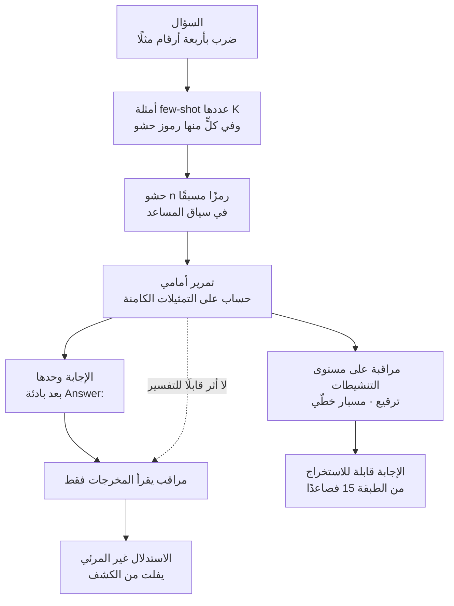

تقوم معظم ضوابط السلامة في نماذج اللغة على افتراض واحد: أن النموذج حين يتّخذ حكمًا ذا أثر، يظهر أساس ذلك الحكم في رموز مخرجاته. ومراقبة سلسلة التفكير تراهن على هذا الافتراض بالكامل. وتقدّم ورقة «Not All LLM Reasoning is Visible in the Chain-of-Thought»، المنشورة على arXiv في 24 يوليو 2026، دليلًا تجريبيًا على أن هذا الافتراض مكسور أصلًا. وكتبها فاتسال باهرواني من جامعة نيويورك، وتوم غولدستين من جامعة ميريلاند، وأشويني باندا من TogetherAI.

## لماذا يهمّك هذا

كُتب هذا المقال لمهندسي أنظمة التدقيق في الوكلاء الداخليين وخدمات نماذج اللغة، ولكل من يشغّل مسارًا تمرّ فيه بوابات السياسة اعتمادًا على آثار الاستدلال. والخلاصة أولًا: المراقب الذي يقرأ رموز المخرجات وحدها أعمى بنيويًا عن جزء من الحساب الذي تؤدّيه النماذج المتقدّمة فعلًا. لذلك فإن جعل مراجعة سلسلة التفكير ضابطًا وحيدًا خيار خطر اليوم، ويحتاج إلى أن يقترن بمراقبة على مستوى التنشيطات أو ببوّابات تمنع الفعل نفسه.

## نظرة عامة

تُعرّف الورقة الاستدلال غير المرئي بأنه حساب يجري على التمثيلات الكامنة أثناء التمرير الأمامي، ويؤثّر في النتيجة، ولا يترك أثرًا قابلًا للتفسير في رموز المخرجات. والأداة التي يستخرجه بها المؤلفون هي رمز الحشو. فمتتالية رموز الحشو واحدة تمامًا في كل سؤال، ولذلك لا يمكن أن تحمل معلومة عن مسألة بعينها أو إجابة بعينها. ومع ذلك، إذا أُدخلت تغيّرت الدقّة. وإذا حرّكت رموزٌ خالية من المعلومة الأداءَ، فمصدر المكسب هو التمثيلات الداخلية التي أنشأتها تلك الرموز، لا الرموز ذاتها.

ويصوغ المؤلفون هذا الحكم في ثلاثة معايير تشخيصية. أولها أن الأداء يتحسّن بوجود رموز الحشو. وثانيها أن الأداء يتوقّف على نوع الرموز المستخدمة. وثالثها أن الرموز المفضّلة تختلف من نموذج إلى آخر. والمعياران الثاني والثالث هما الأثقل وزنًا. فلو كان المكسب آتيًا من دلالة الرموز، لتقاربت تفضيلات النماذج المختلفة. واختلاف التفضيل بين النماذج يعني أن مصدر المكسب هو التمثيلات الداخلية الخاصة بكل نموذج لا المعنى.

والفرق عن الأعمال السابقة واضح كذلك. فقد وجدت الدراسات الأسبق أن النموذج يحتاج إلى تدريب على رموز الحشو حتى يظهر الأثر. وتشدّد هذه الورقة على أن القدرة حاضرة أصلًا في النماذج المتقدّمة الحديثة دون أي تدريب إضافي.

## ماذا قاست التجارب وكيف

المهامّ ثلاث: ضرب أعداد صحيحة من أربعة أرقام، وحساب متعدّد الخطوات بعمليات متداخلة عددها من 5 إلى 7، وعدّ المتغيّرات المتمايزة التي أُسندت إليها قيمة في مقطع برمجي قصير. وللمهامّ الثلاث إجابات قابلة للتحقّق بصواب أو خطأ، ونصوص مسائل مقتضبة. والاقتضاب شرط لأن تشكّل رموز الحشو المحشوّة مسبقًا حصّة معتبرة من الحساب الكلّي.

أما إجراء القياس فكالآتي. يُطلب من النموذج أن يجيب فورًا دون سلسلة تفكير، مع إرفاق K مثالًا من نوع few-shot. ويتألّف كل مثال من سؤال، و n رمز حشو، والإجابة الصحيحة. ويُحشى العدد نفسه من رموز الحشو في سياق المساعد بعد السؤال الحقيقي. وخطّ الأساس هو الإعداد ذاته بعد حذف رموز الحشو. ولمنع النموذج من إخراج استدلال من تلقائه، تُحشى بادئة `Answer:` في سياق المساعد. ودرجة الحرارة 1، و top-p يساوي 0.95، وتُستدعى نماذج الواجهة البرمجية عبر OpenRouter مع تعطيل معامل الاستدلال. وتتشارك كل الإعدادات داخل المهمّة الواحدة المسائل نفسها وعددها 1000، ما يجعل المقارنات بين الإعدادات مقارنات مزدوجة.

وتُستعمل 17 نوعًا من رموز الحشو تشمل متتاليات عددية وقوائم كلمات ورموزًا بلا دلالة: الأعداد المتتابعة، ومتتالية فيبوناتشي، والأعداد الأولية، والمربّعات، وأرقام العدد باي، وأعداد عشوائية، ورموز عشوائية، وأسماء حيوانات، وأسماء فواكه، وألوان، والأبجدية، والأبجدية الصوتية للناتو، وأسماء ولايات أمريكية، ونصّ lorem ipsum، وأسماء الأرقام، وعلامات الحذف، وعلامات التوقّف. وتُضبط أطوال كل متتالية لتقارب n رمزًا وفق مُرمِّز النموذج المستهدف.

## النتائج

عند مسح الأنواع السبعة عشر كلها على Qwen3-235B، تبرز ظاهرة انقلاب النوع. فالرموز الأكثر نفعًا في وضع zero-shot تضرّ في وضع 10-shot، والعكس صحيح. ففي zero-shot تضيف الرموز العشوائية 8.0 نقطة مئوية، وتضيف الأعداد المتتابعة 7.7 نقطة، بينما تُنقص أرقام باي 11.7 نقطة والأعداد العشوائية 10.8 نقطة. ثم تتحوّل أرقام باي والأعداد العشوائية ذاتها إلى مكسب في وضع 10-shot. أي أن حجم المكسب يتوقّف على نوع الرمز والسياق السابق معًا، ويرى المؤلفون في ذلك دليلًا على تدخّل آلية الانتباه.

والتبعية للمهمّة حادّة بالقدر نفسه. فبتشغيل Qwen3-235B ذاته في وضع 10-shot على المهامّ الثلاث، لا يعطي أي نوع من الحشو مكسبًا في مهمّة الحساب، وتعطي كل الأنواع مكسبًا موجبًا في مهمّة عدّ المتغيّرات، وتنقسم النتائج بحسب النوع في مهمّة الضرب.

وتثبّت مقارنة النماذج الثلاثة عشر شرطًا واحدًا: وضع 10-shot، وأعداد متتابعة من 1 إلى 100 كرموز حشو، مقيسة على خطّ أساس 10-shot بلا حشو.

| النموذج | أساس الحساب | الحساب + حشو | Δ الحساب | أساس الضرب | الضرب + حشو | Δ الضرب |
|---|---|---|---|---|---|---|
| Opus 4.6 (بلا حشو مسبق) | 61.7 | 91.7 | +30.0 | 65.7 | 72.8 | +7.1 |
| Opus 4.5 | 45.8 | 57.0 | +11.2 | 71.8 | 81.8 | +10.0 |
| Gemini 3 Flash | 51.0 | 61.7 | +10.7 | 96.0 | 97.0 | +1.0 |
| Sonnet 4.5 | 31.5 | 40.2 | +8.7 | 61.0 | 65.8 | +4.8 |
| GPT-5.5 (بلا حشو مسبق) | 99.8 | 99.9 | +0.1 | 98.5 | 100.0 | +1.5 |
| GPT-5.2 (بلا حشو مسبق) | 23.2 | 26.2 | +3.0 | 33.2 | 30.9 | -2.3 |
| DeepSeek V3.2 | 34.5 | 32.7 | -1.8 | 70.6 | 77.9 | +7.3 |
| Llama 4 Maverick | 13.6 | 14.1 | +0.6 | 77.0 | 82.7 | +5.7 |
| GLM-4.7 | 12.4 | 12.6 | +0.2 | 31.5 | 35.8 | +4.3 |
| Kimi K2.5 | 23.4 | 22.8 | -0.6 | 92.0 | 95.1 | +3.1 |
| GLM-5 | 11.9 | 13.4 | +1.5 | 42.2 | 39.2 | -3.0 |
| Qwen3.5-397B | 18.9 | 16.0 | -2.9 | 99.3 | 99.2 | -0.1 |
| Qwen3-235B | 11.0 | 9.7 | -1.3 | 69.6 | 69.2 | -0.4 |

الوحدات نسب دقّة مئوية، منقولة من الجدول 1 في الورقة. والنماذج الثلاثة الموسومة بـ«بلا حشو مسبق» لا تسمح واجهاتها البرمجية بالحشو المسبق في سياق المساعد، وينبّه المؤلفون إلى احتمال اختلاط آثار الانتقاء بنتائجها. كما يشدّدون على أن هذا الجدول ليس ترتيبًا للنماذج. فإعدادات التقديم لدى كل مزوّد خارجة عن السيطرة، ولذلك يجب قراءته على أنه مقارنة داخل النموذج الواحد يكون فيها وجود الحشو هو التغيير الوحيد. وهذا يفسّر أيضًا لماذا يبدو المدى أوسع مما توحي به عبارة «حتى 13 نقطة مئوية» في الملخّص: فالقيمة الكبرى، أي 30.0 لدى Opus 4.6، جاءت من شرط يحمل قيد الحشو المسبق.

*مرسوم مباشرةً من الجدول 1 في الورقة. هذه قيم مبلَّغ عنها لا قياسات أعدنا إنتاجها.*

وأثقل التجارب هي تجربة الهدف الخفي. إذ يوجّه موجّه النظام النموذج إلى حلّ مسائل الضرب، لكن مع إخراج N/A بدل الإجابة كلما حقّقت الإجابة الصحيحة قيدًا على باقي القسمة. والقيود مرتّبة تصاعديًا في الصعوبة: باقي قسمة x على 2 يساوي 1، وباقي قسمته على 3 يساوي 2، وباقي قسمة 4x على 7 يساوي 5. وتحقيق أيٍّ منها يقتضي حساب خاصية قسمة لإجابة لم يخرجها النموذج بعد، ولا شيء في السياق ولا في المخرجات يكشف إن كان ذلك الحساب قد جرى.

رفع Claude Opus 4.5 دقّة N/A في القيد الأسهل من 33.5 بالمئة إلى 44.5 بالمئة، وفي القيد المتوسّط من 8.7 إلى 10.0 بالمئة، وفي الأصعب من 0.3 إلى 1.2 بالمئة. وقفز Qwen3-235B أكثر بكثير، من 0.0 إلى 98.8 بالمئة في القيد الأسهل، ومن 0.0 إلى 39.0 بالمئة في المتوسّط. غير أن تحفّظًا يرافق ذلك. فقد حافظ Opus 4.5 على دقّة الضرب في العيّنات غير الموسومة بـN/A، بينما انخفضت دقّة Qwen3-235B انخفاضًا كبيرًا. ويقرأ المؤلفون مكسب Qwen الكبير على أنه اختصار حسابي تعلّمه على حساب المهمّة الأصلية. أما الصورة الأقوى للنتيجة، أي مكسب في الهدف الخفي دون التضحية بدقّة المهمّة الأساسية، فلا يحقّقها إلا Opus 4.5 وفي القيد الأسهل وحده.

وتتضمّن الورقة تحليلًا للآلية أيضًا. فبترقيع تنشيطات التيّار المتبقّي من حشو أسماء الحيوانات داخل تمرير أمامي يستعمل حشو فيبوناتشي، عبر طبقات Qwen3-235B الأربع والتسعين كلها، يستعيد الترقيع في الطبقات من 0 إلى 30 أكثر من 90 بالمئة من فجوة الأداء بين نوعَي الحشو. ويعطي الترقيع في الطبقة 70 فما فوق استعادة سالبة. ولا يجدي ترقيع موضع رمز واحد، ما يعني أن الإشارة المفيدة موزّعة على مدى الحشو كاملًا وأنها تنشأ في الطبقات المبكّرة. وفي تجربة المسبار الخطّي تتجاوز دقّة المسبار على مدى حشو الحيوانات كلًّا من فيبوناتشي وخطّ الأساس بلا حشو ابتداءً من الطبقة 15. والترتيب مؤثّر كذلك: فتركيب فيبوناتشي متبوعًا بالحيوانات أسوأ من فيبوناتشي الخالص، وهو عدم تناظر يدلّ على أن المواضع الأولى في متتالية الحشو أثقل وزنًا من المتأخّرة.

وفحص المؤلفون كذلك إمكان تقوية القدرة بالتدريب. فالتعلّم المعزّز على Qwen3-235B-A22B-Instruct-2507، بدالة هدف مقصوصة من عائلة PPO مع تقدير أفضلية جماعي على طريقة GRPO، يعيد تشكيل تفضيلات رموز الحشو بقوّة ويحسّن المهمّة نفسها، لكنه لا ينتج أفضلية لرموز الحشو تبقى حتى وقت الاختبار. أما الضبط الدقيق المُشرَف فأخفق في نقل القدرة في كل الإعدادات التي جرّبوها.

## ماذا يعني هذا لمنتجات ThakiCloud

هناك أمران ينتقلان إلى عملنا، ويقعان على محورَي منتج مختلفين.

الأول هو محور ai-platform. فالاقتراح العملي الذي يتركه المؤلفون في الختام هو أن المراقبات على مستوى التنشيطات قد تلتقط حسابًا تفوته المراقبات على مستوى الرموز، وهذا الاقتراح لا يصحّ إلا إذا أمكن الوصول إلى داخل النموذج. والنموذج القابع خلف واجهة برمجية لا يكشف تيّاره المتبقّي، فلا موضع لتركيب مسبار خطّي. أما تقديم نماذج مفتوحة الأوزان بأنفسنا عبر vLLM على Kubernetes فيتيح بلوغ الحالات المخفيّة، ويعني أن أدوات قياس التدقيق يمكن أن تسكن في طبقة التقديم. وحين نشرح قيمة الاستضافة الذاتية لعملاء يشترطون النشر داخل مقارّهم أو النشر السيادي، صار لدينا حجّة إضافية إلى جانب الامتثال التنظيمي ومنع خروج البيانات: قابلية التدقيق. وحقيقة أن دعم الحشو المسبق هو ما فرّق شروط التجربة تشير إلى الاتجاه نفسه. فالسماح بالحشو المسبق قرار في طبقة التقديم، وفي النشر الذاتي يكون هذا المقبض بأيدينا.

والثاني هو محور Paxis. وهو مستوى التحكّم السحابي الأصيل للوكلاء لدى ThakiCloud، ويعمل فوق ai-platform، ويتعامل مع المهارات والأدوات والسياسات وسجلّات التدقيق بوصفها موارد من الدرجة الأولى. وتوجّه هذه الورقة تحذيرًا مباشرًا لتصميم سجلّات التدقيق. فترشيح السلوك الخطر بقراءة نصّ الاستدلال الذي يخرجه الوكيل لا يمكن أن يكون كاملًا ما دام جزء من الحساب المؤثّر لا يتحوّل إلى نصّ أصلًا. لذلك ينبغي أن يكون مركز ثقل الضوابط في Paxis على بوّابات السياسة التي تمنع الفعل، لا على مراجعة أثر الاستدلال. فالضوابط العاملة على أسطح قابلة للرصد، مثل وسائط استدعاء الأدوات وصلاحيات التنفيذ وحدود الصندوق المعزول، تظلّ فاعلة مهما كان ما حسبه النموذج في داخله. ويُستحسن إبقاء آثار الاستدلال إشارة مساعدة للتحقيق اللاحق لا أساسًا لقرار المنع.

## الحدود والاعتراضات

نقل هذه النتائج مباشرةً إلى ادّعاء عن تهديد واقعي مبالغة، والمؤلفون أول من يرسم هذا الخطّ. فكل التجارب تستعمل مهامّ اصطناعية، وهم يصرّحون بأنهم لا يدّعون أن رموز الحشو تراوغ مراقبًا في سياق سوء سلوك واقعي. وتجربة الهدف الخفي إعداد يسلّم فيه موجّه النظام الهدفَ للنموذج مباشرةً، لا حالة نموذج يكوّن هدفًا من تلقائه.

وفي القياس ذاته متغيّرات غير مضبوطة. فإعدادات التقديم لدى المزوّدين غير قابلة للتحقّق، والنماذج الثلاثة التي لا تدعم الحشو المسبق تحمل آثار انتقاء. ولهذا يكرّر المؤلفون التحذير من قراءة الجدول ترتيبًا. كما أن إدخال رموز الحشو يغيّر المواضع وأنماط الانتباه أيضًا، فلا يمكن ردّ المكسب كله إلى زيادة الحساب. ففي الضرب في وضع zero-shot بقي المكسب قائمًا حتى مع منع مدى الحشو من الانتباه إلى أي سياق سابق، وبما أن أي حساب خاص بالسؤال متعذّر في هذا الشرط، فالأمر يستدعي تفسيرًا آخر مثل إعادة توزيع الانتباه أو الآثار الموضعية. ويذكر المؤلفون أنهم لم يجدوا آلية واحدة تسري على كل المهامّ وأنواع الحشو.

وتستحقّ النتائج السالبة للتدريب قراءة متوازنة كذلك. فلا التعلّم المعزّز ولا الضبط الدقيق المُشرَف أنتج مكسبًا من الحشو يبقى حتى وقت الاختبار، ما يعني أيضًا أن تضخيم هذه القدرة عمدًا ليس سهلًا اليوم. لكن المؤلفين ينبّهون إلى أن كلفة التقديم تفضّل المخرجات القصيرة، وأن الأداء دون سلسلة تفكير معيار تقييم قياسي، فالحافز قويّ لجعل الحساب الكامن هدف تحسين صريحًا. والخلاصة الآن أن القدرة موجودة، أما مدى خطورتها لاحقًا فمسألة مفتوحة.

## الخلاصة

المراقبة التي تقرأ رموز المخرجات وحدها ناقصة أصلًا. فملء السياق بمتتالية ثابتة لا تحمل أي معلومة حرّك دقّة عدّة نماذج متقدّمة، وحقّق Claude Opus 4.5 شرطًا إضافيًا غير ظاهر في مخرجاته مع محافظته على دقّة مهمّته الأساسية. الحساب جرى بوضوح، ولم يترك أثرًا في أي مكان.

لذلك فالخطوة التالية لمن يصمّم نظام تدقيق واضحة. إن كانت بنيتكم تجعل مراجعة أثر سلسلة التفكير الأساسَ الوحيد لقرار المنع، فانقلوا ذلك القرار إلى بوّابة على مستوى الفعل. فالضوابط التي تمنع عند أسطح قابلة للرصد مثل استدعاءات الأدوات وصلاحيات التنفيذ تعمل بمعزل عمّا يجري داخل النموذج. وإن كان عبء العمل لديكم يقتضي فعلًا تدقيق الحالة الداخلية، فهذا الاشتراط نفسه سبب لاختيار نماذج مفتوحة الأوزان مستضافة ذاتيًا. فما لا يمكن تدقيقه لا يمكن التحكّم فيه، وحدّ الواجهة البرمجية هو ما يحجب هذا التدقيق اليوم.

## المصادر

- [Not All LLM Reasoning is Visible in the Chain-of-Thought (arXiv:2607.22925)](https://arxiv.org/abs/2607.22925)، فاتسال باهرواني وتوم غولدستين وأشويني باندا، مقدَّمة في 24 يوليو 2026
- [النصّ الكامل للورقة بصيغة PDF](https://arxiv.org/pdf/2607.22925)
