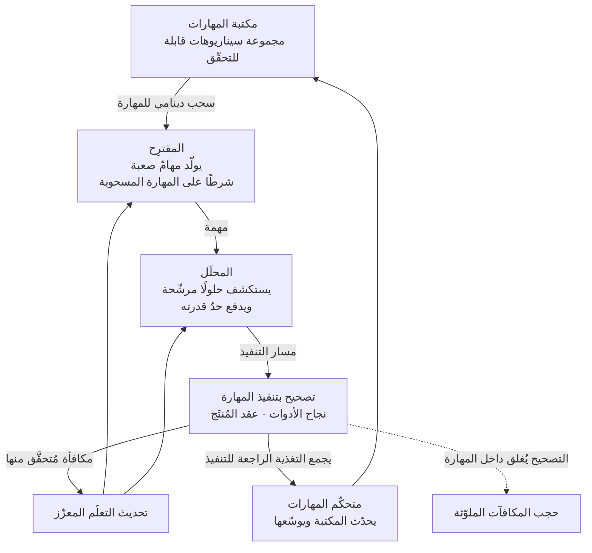

ترك النموذج يخترع مسائله ويتحسّن بحلّها فكرةٌ جاذبة، لكنها تحمل نقطة ضعف قديمة: لا يمكنكم الوثوق بالتصحيح. وورقة من فريق Qwen في Alibaba، نُشرت على arXiv في 24 يوليو 2026، تواجه هذا الضعف مباشرة، وتجد علاجه في موضع غير متوقّع قليلًا. مهارات الوكيل.

## لماذا يستحقّ هذا القراءة

كُتب هذا المقال لمهندسي التعلّم الآلي الذين يصمّمون مسارات تدريب الوكلاء، ولمالكي المنصّات الذين يتساءلون كيف يجعلون رصيد المهارات الداخلي يستحقّ كلفته. باختصار: إسهام هذه الورقة ليس خوارزمية لعب ذاتي جديدة، بل إعادة تعريف المهارة كوحدة لإشارة التعلّم. فلأن المهارة الواحدة تعرّف سيناريو ضيّقًا قابلًا للتنفيذ، يكون التصحيح داخلها جديرًا بالثقة، بينما يحفظ الانتقال بين المهارات جدّة المهام. ونتيجة لذلك تخفّ المقايضة التي طال احتمالها في التدريب ذاتي التطوّر بين التنوّع والتحقّق. وإن كنتم تتعاملون مع المهارات كأصل من الدرجة الأولى، فاقرأوا هذه الورقة كإشارة إلى أن هذا الأصل يمكن أن يعمل مولّدًا للمنهج التدريبي، لا أداة تشغيل فحسب.

## نظرة عامة

عنوان الورقة `Skill Self-Play: Pushing the Frontier of LLM Capability with Co-Evolving Skills`، ومعرّفها على arXiv هو 2607.22529. والإطار المقترَح اسمه Skill Self-Play ويُختصر إلى Skill-SP.

له ثلاثة مكوّنات: مقترِح يولّد المهام، ومحلِّل يجيب عنها، ومتحكّم مهارات دينامي يدير مكتبة المهارات. وهذه ليست مراحل منفصلة بل تتطوّر معًا داخل حلقة لعب ذاتي واحدة قائمة على التعلّم المعزّز. والكلمة التي تستخدمها الورقة لهذا هي التطوّر المشترك.

والادّعاء المركزي كالتالي: تواجه الطرائق الحالية ذاتية التطوّر معضلة جوهرية بين تنوّع المهام وموثوقية التحقّق، ومهارات الوكيل تشكّل أرضًا وسطى قويّة توفّق بين الاثنين.

## المشكلة التي تُحلّ

انقسم التدريب ذاتي التطوّر في الغالب إلى فرعين، يتنازل كل منهما عن شيء.

الأول يقيّد التعلّم ببيئة: منفّذات الشيفرة، ومدقّقات الرياضيات، ومحاكيات الألعاب، أي مواضع يمكن الحكم فيها على الصواب حكمًا آليًا. التغذية الراجعة دقيقة. فإما أن تُترجم الشيفرة وينجح الاختبار ويصحّ البرهان، أو لا. والكلفة أن التعلّم يبقى داخل أسوار تلك البيئة، فيقتصر التحسّن على نطاق ضيّق.

والثاني يفتح الباب للتوليد الذاتي. يخترع النموذج المهام بحرّية فيتّسع فضاء المهام. لكن يبقى سؤال: من يحكم على أجوبة مهامّ اختُرعت بحرّية؟ فحين يصحّح النموذج مخرجاته يعتمد أجوبة خاطئة كصحيحة، وتتدفّق تلك المكافأة المغلوطة إلى حلقة التدريب. وتصف الورقة هذا بأنه مكافآت مُضلِّلة تلوّث حلقة التدريب. وهذا التلوّث صعب المعالجة على وجه الخصوص لأنه يتراكم بهدوء.

وبعبارة صريحة: إن حصلتم على تصحيح دقيق ضاق نطاقكم، وإن حصلتم على مهام واسعة لم تستطيعوا الوثوق بالتصحيح. ولم يحسم أي من الفرعين هذه المقايضة.

## لماذا المهارات أرض وسطى

جوهر إدراك Skill-SP هو رؤية المعضلة كمشكلة في الوعاء الحامل للمهام، لا في المهام نفسها.

تصوّروا مهارة وكيل واحدة. المهارة عادةً إجراء يعالج سيناريو معيّنًا: ما تستقبله مدخلًا، وأي أدوات تنادي وبأي ترتيب، وما تنتجه، كلّها معرّفة. فالمهارة إذن بيئة ضيّقة قابلة للتنفيذ سلفًا. والمهمة المُنشأة داخل مهارة يمكن تصحيحها بنتيجة تنفيذ تلك المهارة: هل نجحت الأدوات، وهل يستوفي المُنتَج عقده، أمور قابلة للحكم. وهنا تُؤمَّن فضيلة الفرع الأول، أي موثوقية التحقّق.

وفي الوقت نفسه لا توجد مهارة واحدة أبدًا. تحوي المكتبة عشرات أو مئات تغطّي نطاقات مختلفة. وإذا سحبت حلقة التدريب مهارة مختلفة في كل مرّة وبنت توليد المهام شرطًا عليها، اتّسع فضاء المهام بسعة المكتبة. وهنا تُؤمَّن فضيلة الفرع الثاني، أي التنوّع.

وبصيغة الورقة: كل مهارة تضمن تنفيذًا عميقًا قابلًا للتحقّق داخل سيناريو محدّد، بينما يحفظ التوجيه الدينامي بين المهارات تنوّعًا مفتوحًا للمهام. التحقّق يأتي من داخل المهارة، والتنوّع من بينها. ووضع الخاصّيتين على محورين مختلفين بدل مقايضتهما على محور واحد هو تصميم هذه الورقة.

## كيف يعمل Skill-SP

الأدوار وسير الحلقة كالتالي.

يولّد المقترِح مهامّ صعبة شرطًا على مهارة مسحوبة ديناميًا. وكون الشرط مهارةً أمر مهمّ: فهو لا يخترع مهامّ عشوائية بل مهامّ صعبة داخل سيناريو قابل للتصحيح.

ويستكشف المحلِّل حلولًا مرشّحة، مختبرًا حدّ قدرته. وفي ترتيب اللعب الذاتي يكون المقترِح والمحلِّل خصمين لبعضهما، فكلّما قوي المحلِّل وجب على المقترِح إنتاج مهامّ أصعب، والعكس صحيح كذلك. وما ينشأ منهجٌ تتبع صعوبته الخصم بدل أن تُثبَّت مقدّمًا.

ويجمع متحكّم المهارات التغذية الراجعة للتنفيذ فيحدّث مكتبة المهارات ويوسّعها. وهذا ما يفصل الإطار عن معيار ساكن. فالمكتبة الثابتة تثبّت سقف فضاء المهام، والمتحكّم الذي ينمّي المكتبة يرفع ذلك السقف معها. ومن ثمّ تجعل الورقة المهارات مشاركًا يتطوّر معها، لا نتاجًا عرضيًا للتعلّم.

## النتائج المُبلَّغة ونطاق ما تحقّقنا منه

تذكر الورقة أنها أجرت التقييم على معايير استخدام الأدوات ومعايير الاستدلال، وتُبلِّغ عن نتيجتين مختلفتي الطابع. الأولى أنها دفعت باستمرار سقف أداء نماذج أساس مقتدرة سلفًا. والثانية أنها أحدثت انقلابات لافتة في نماذج لم تكن في البداية متوائمة مع السلوك الهدف. وتصف الورقة Skill-SP بأنه محرّك تطوّر متين.

وهنا ينبغي أن نذكر حدودنا بصراحة. حتى وقت كتابة هذا المقال لم نفتح جداول نتائج الورقة مباشرة. ولذلك لم ننقل أي أرقام محدّدة إلى هذا المقال، لا درجات لكل معيار ولا مقادير تحسّن مُبلَّغة. والجملتان أعلاه هما النتائج النوعية كما يصفها ملخّص الورقة، ومن يحتاج تحقّقًا رقميًا فعليه قراءة قسم التجارب في المصدر. وقد بدا لنا ترك الأرقام فارغة أفضل من ملئها بما يبدو معقولًا.

ومع ذلك يستحقّ الفرق بين النتيجتين التنبيه. رفع سقف نموذج أساس مقتدر وإنقاذ نموذج غير متوائم أثران مختلفان. فإن صحّ الثاني، فإن Skill-SP أداةٌ تجرّ النموذج نحو توزيع سلوك مرغوب أكثر من كونها أداة تضيف قدرة. ولأن المهارة نفسها مواصفةٌ للسلوك المرغوب، فمن المعقول أن يعمل التصحيح المتكرّر داخل المهارات عمل المواءمة.

## ما يعنيه هذا لـThakiCloud

تتعلّق هذه الورقة بمهارات الوكيل وتنظيمها، لذا تنطبق عدسة Paxis. Paxis هي مستوى التحكّم Agent-Native Cloud في ThakiCloud، وتتعامل مع Skills وTools وPolicies وAudit Logs كموارد من الدرجة الأولى. وتهمّنا الورقة لأنها تعيد تسعير تلك المعاملة من جهة التدريب.

كانت أسبابنا لمعاملة المهارات كموارد من الدرجة الأولى أسباب تشغيل حتى الآن: فالمهارة المعرّفة يمكن أن يختارها مُوجِّه، وتُنفَّذ في صندوق رمل معزول، وتمرّ عبر بوّابات السياسة وسجلّات التدقيق. وتضيف هذه الورقة مدخلًا آخر: إن كانت المهارة وحدة تنفيذ قابلة للتحقّق، فإن مكتبة المهارات نفسها يمكن أن تعمل مولّدًا للمنهج في وقت التدريب. فتصبح أصول التشغيل وأصول التدريب متشاركة في مخزن واحد.

وتظهر ثلاث نقاط تلاقٍ بنيوية. الأولى توجيه المهارات. فالسحب الدينامي للمهارات في الورقة يعالج المشكلة التي تعالجها طبقة اختيار المهارات في Paxis، لغرض مختلف: ففي التشغيل تختارون المهارة الملائمة للمهمة الحالية، وفي التدريب تختارون المهارة التي ستولّد المهمة التالية. ويصبح السؤال العملي هو ما إذا كان مُنتقٍ واحد يخدم الغرضين.

والثانية تصحيح التنفيذ. فأساس المكافأة الجديرة بالثقة في الورقة هو أن نتائج تنفيذ المهارة قابلة للحكم آليًا. وهذا ينعكس مباشرة على أن عقود مهاراتنا مصمّمة سلفًا لتحمل بوّابات حتمية. فإن كانت بوّابة تقرّر بالشيفرة إن كان المُنتَج ناجحًا، فتلك البوّابة مرشّحة لتكون دالّة مكافأة. وثمّة مجال لتوسيع نظرة تعاملت مع البوّابات كأدوات جودة للقارئ البشري فقط.

والثالثة تطوّر المهارات. فمتحكّم المهارات في الورقة يحدّث المكتبة ويوسّعها من التغذية الراجعة للتنفيذ. ونحن نشغّل أيضًا مسارًا يطوّر المهارات ذاتيًا، فالاتّجاه متوافق. والفرق في مصدر الإشارة: فمسارنا يعتمد أساسًا على مراجعات الإخفاق وتاريخ الاستخدام، والورقة تعتمد على مكافأة حلقة اللعب الذاتي. وتبنّي الثاني يستلزم مولّد مهامّ قابلًا للتصحيح آليًا لكل مهارة، ولا ينطبق ببساطة على المهارات التي تفتقر إليه.

والتحفّظ واضح بالقدر نفسه. فحلقة الورقة حلقة تدريب بالتعلّم المعزّز، وتكلّف ميزانية معالجات رسومية. ومعظم عملنا مع المهارات اختيار وتنفيذ في وقت الاستدلال، ولا يحمل كلفة تدريب. لذا فالأفضل قراءة هذه الورقة لا كمرشّح للتبنّي بل كمسوّغ للعمل التحضيري المتمثّل في جرد عائلات المهارات القابلة للتصحيح آليًا. وإن كان ذلك الجرد فارغًا فلا موضع للإطار كي يعمل.

## الحدود والاعتراضات

أكبر سؤال هو مدى اعتماد النتائج على جودة مكتبة المهارات. فالمقدّمة القائلة إن المهارات توفّر سيناريوهات قابلة للتحقّق تسند الإطار بأكمله. وإذا كان الأمر كذلك فلا بدّ من السؤال إلى أين ذهبت كلفة بناء مكتبة مهارات جيّدة. فإن كانت مشكلة التحقّق قد نُقلت إلى مشكلة تصميم مهارات، فيبقى شرط أن يعرّف البشر المهارات تعريفًا جيّدًا. وحتى مع تسليمنا بأن المتحكّم يوسّع المكتبة، فلا تزال بذرة أولية لازمة.

وينبغي كذلك قراءة ادّعاء التنوّع قراءة مشروطة. فالانتقال بين المهارات يجدّد المهام فعلًا، لكن سقف ذلك التنوّع هو اتّحاد النطاقات التي تغطّيها المكتبة. والنطاق الغائب عن المكتبة يبقى غير قابل للوصول حتى حيث كان يمكن للتوليد الذاتي المفتوح أن يصله. فهذه الطريقة تشتري التحقّق بثمن ربط سقف التنوّع بالمكتبة. إنها لم تحصل على تنوّع غير محدود وتحقّق موثوق في الوقت نفسه، بل نقلت المقايضة إلى شروط أفضل. وقراءة عبارة الأرض الوسطى في الورقة بهذا المعنى هي القراءة الدقيقة.

وتبقى أنماط الإخفاق الشائعة في ترتيبات اللعب الذاتي قائمة أيضًا. فقد يحسّن المقترِح والمحلِّل أداءهما تجاه بعضهما وحده فينهارا إلى الدوران في منطقة ضيّقة. ويبدو أن سحب المهارات يعمل كابحًا لهذا الانهيار، لكن إن نمّى المتحكّم المكتبة نحو المهارات ذات نسب النجاح المرتفعة فقد يُعزَّز الانحياز بدلًا من ذلك. والحكم في هذا يستلزم مراجعة تصميم التجارب في المصدر.

وأخيرًا، حدود هذا المقال مرة أخرى. جمّعنا هذا العرض من أوصاف بمستوى الملخّص دون فتح الجداول أو الشيفرة للمقارنة. والاعتراضات أعلاه مستنبطة من بنية الإطار، وقد تكون الورقة أجابت عن بعضها تجريبيًا بالفعل.

## الخلاصة

رسالة Skill Self-Play أن العائق في التدريب ذاتي التطوّر لم يكن الخوارزمية بل الوحدة الحاملة لإشارة التعلّم. فمقيَّدًا ببيئة كان التصحيح دقيقًا لكنه ضيّق، ومفتوحًا كان واسعًا لكنه غير جدير بالثقة. وقد وضع فريق Qwen مهارات الوكيل بينهما: داخل المهارة تصحّحون بالتنفيذ، وبين المهارات تحصلون على التنوّع بالتوجيه. ويتطوّر المقترِح والمحلِّل ومتحكّم المهارات معًا في حلقة واحدة، فيصعد المنهج مع قدرة الخصم.

وإن كنتم تديرون المهارات كأصل بالفعل، فإن السؤال العملي الذي تتركه هذه الورقة يضيق إلى واحد: كم من مهاراتنا يمكن تصحيح نتائج تنفيذها بالشيفرة؟ ذلك العدد هو حجم السطح الذي يمكن تطبيق هذا الإطار عليه، وهو في الوقت نفسه حجم السطح الذي يمكن إلحاق تحقّق آلي موثوق به الآن، بلا أي تدريب. وخطوتنا التالية ليست إقامة حلقة تدريب بل بناء تلك القائمة. لا شيء هنا يبرّر تشغيل معالج رسومي بعد، لكن ثمّة الآن ما يبرّر صقل عقود المهارات لتصبح قابلة للتصحيح.

## المصادر

- [Skill Self-Play: Pushing the Frontier of LLM Capability with Co-Evolving Skills، arXiv 2607.22529](https://arxiv.org/abs/2607.22529)
- [صفحة الورقة نفسها على Hugging Face](https://huggingface.co/papers/2607.22529)
- [شرح Skill Self-Play، CCTest](https://cctest.ai/en/articles/skill-self-play-co-evolving-skills-for-stronger-llms)
