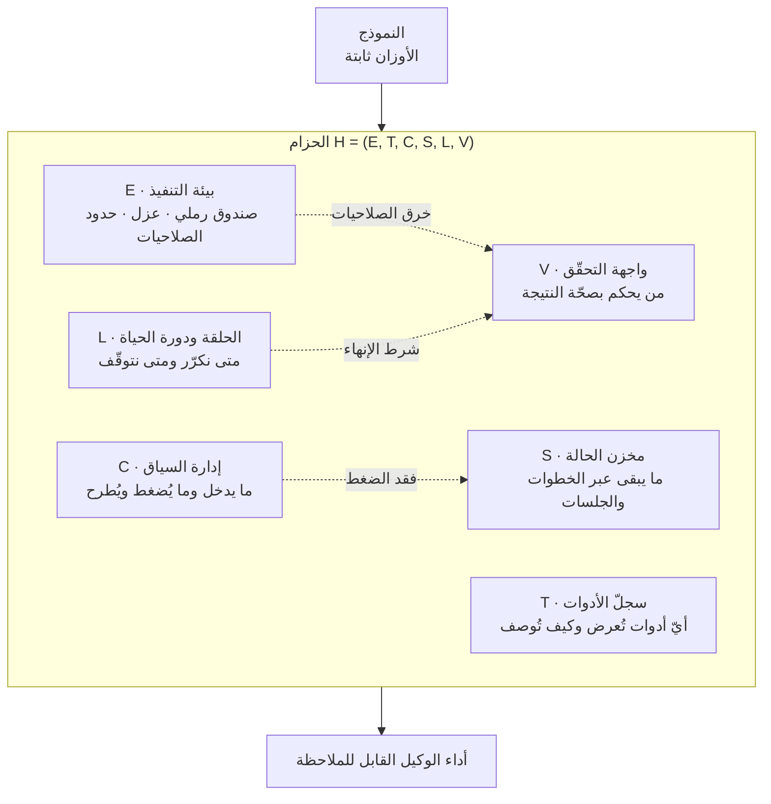

حين يقصّر الوكيل عن التوقّعات يشكّ معظم الفرق في النموذج أولًا. ترفع الفئة، وتعيد كتابة الموجّه، وإن لم ينفع ذلك تنتظر الإصدار التالي. غير أنّ التقارير المتراكمة خلال 2026 تشير إلى مكان آخر. ضع النموذج نفسه داخل قشور مختلفة وستتباعد النتائج بمضاعفات. لهذه القشرة اسم: الحزام. ومسح صدر حديثًا هو أوّل عمل يمنحه شكلًا رسميًا وقائمة أجزاء.


*يمكن أن يبقى المركز فارغًا ويظلّ الهيكل هو ما يحدّد الشكل. هذه هي حجّة الحزام في صورة واحدة.*

## لماذا يستحقّ هذا القراءة

كُتب هذا النصّ لمهندسي المنصّات الذين عليهم إدخال الوكلاء إلى الإنتاج لا إلى العروض التوضيحية، ولقادة الفرق الذين يقرّرون بين ترقية النموذج وإصلاح الحزام حين تقصّر النتائج. الخلاصة أولًا: **الإسهام الحقيقي لهذا المسح ليس الادّعاء بأنّ الأحزمة مهمّة، بل مصفوفة الاكتمال التي تقسّم الحزام إلى ستة أجزاء بحيث يمكنك عدّ ما ينقص.** الادّعاء كان قريبًا من المعرفة الشائعة أصلًا، والناقص كان أداة القياس. نستعرض فيما يلي المحاور الستّة ثمّ نطبّق المسطرة ذاتها على حزام الوكلاء الذي تشغّله ThakiCloud، وننشر الأرقام والثغرتين اللتين كشفتهما.

## نظرة عامة

الورقة المقصودة هي [Agent Harness for Large Language Model Agents: A Survey](https://github.com/Gloriaameng/Awesome-Agent-Harness) بقلم Qianyu Meng وعشرة مؤلّفين مشاركين. إلى جانب الورقة نفسها نشر الفريق مجموعة بيانات موسومة للأوراق وجدول مقارنة للأنظمة في مستودع GitHub. النسخة الأوّلية مسجّلة تحت [preprints.org DOI 10.20944/preprints202604.0428](https://sciety.org/articles/activity/10.20944/preprints202604.0428.v3).

يكشف الحجم طبيعة العمل. جُمع أكثر من 110 مصادر بين أوراق ومدوّنات وتقارير تقنية، ووُضع 23 نظام وكلاء يعمل فعليًا على جدول واحد. وسُجّلت تسع تحدّيات تقنية مفتوحة. هذه ليست ورقة تقترح تقنية جديدة واحدة، بل محاولة لفرض نظام إحداثيات على ممارسة هندسية متناثرة.

أمّا سبب الحاجة إلى نظام الإحداثيات هذا الآن فتشرحه الأدبيات المحيطة. تصوغ [ورقة SemaClaw (arXiv:2604.11548)](https://arxiv.org/abs/2604.11548) انتقال هندسة الذكاء الاصطناعي من هندسة الموجّهات إلى هندسة السياق ثم إلى هندسة الحزام، وتذهب إلى أنّ موضع التمايز المعماري ينتقل إلى طبقة الحزام كلّما تقاربت قدرات النماذج. حين تتشابه النماذج يبقى كلّ ما يحيط بها.

والأرقام تدعم ذلك. تعرّف [الورقة المتعلّقة بالتفاعل بين تصميم الحزام والتدريب اللاحق (arXiv:2606.25447)](https://arxiv.org/abs/2606.25447) الحزام بأنّه تركيبة من الأدوات المعروضة وطريقة وصفها والمعلومات المساعدة المرافقة لكلّ ملاحظة في كلّ خطوة. وتُظهر أنّ مكاسب التدريب اللاحق تنهار بحدّة تحت حزام بُني بأدنى جهد تصميمي بمجرّد أن تتغيّر بيئة الأدوات قليلًا. وتستشهد الأعمال المرتبطة بحالات تباعدت فيها الدقّة قرابة ستة أضعاف بتبديل الحزام وحده، وهي فجوة تعادل تخطّي جيل من النماذج أو تفوقه.

ويتبع ذلك استنتاج غير مريح: يصعب الوثوق بمقارنات معايير الوكلاء التي لا تفصح عن الحزام. تضع ورقة [Stop Comparing LLM Agents Without Disclosing the Harness (arXiv:2605.23950)](https://arxiv.org/abs/2605.23950) هذه المشكلة بالذات في عنوانها. وعادة قراءة لوحة النتائج باسم النموذج وحده تبدأ بالاهتزاز هنا.

## ماذا يعني تقسيم الحزام إلى ستة أجزاء

الأداة المركزية في المسح هي صياغة الحزام رسميًا كصفّ من ستة عناصر. يُكتب الحزام H بوصفه تركيبة من بيئة التنفيذ E وسجلّ الأدوات T وإدارة السياق C ومخزن الحالة S والحلقة ودورة الحياة L وواجهة التحقّق V.



تسمية الأجزاء وحدها لا تصنع ورقة بحثية. يمضي المسح خطوة أبعد بإضافة دلالات نظام الانتقالات الموسومة إلى البنية، فاصلًا بين السلامة والحيوية. تقول السلامة إنّ أمرًا سيّئًا يجب ألّا يحدث أبدًا، وتقول الحيوية إنّ أمرًا جيّدًا يجب أن يحدث في نهاية المطاف.

تتّضح أهمّية هذا التمييز بمثال. اشتراط ألّا ينشر الوكيل شيئًا دون موافقة هو خاصّية سلامة. خرق واحد ينهي الأمر، ولا يعوّضه سلوك جيّد لاحق. واشتراط أن يبلغ الوكيل شرط إنهاء في النهاية هو خاصّية حيوية. الحلقة اللانهائية ليست خرق سلامة بل خرق حيوية، وإن دافعت عن الاثنين بالطريقة نفسها فسيُخترق أحدهما. بوّابة الموافقة لا توقف حلقة لانهائية، وسقف التكرار لا يمنع تجاوز الصلاحيات. ونقاشات تصميم الحزام تدور في حلقة مفرغة غالبًا لأنّها تجمع الاثنين تحت مسمّى واحد هو الاستقرار.

المحور الأكثر خلوًّا بين الأجزاء الستّة هو V. تنجح معظم الأنظمة في ربط الأدوات وتدوير الحلقة، لكنّ عددًا أقلّ بكثير يحتفظ بواجهة حتمية منفصلة تحكم بصحّة المخرَج. وإدراج المسح للتحقّق التركيبي ضمن تحدّياته التسعة المفتوحة يشير إلى الاتّجاه نفسه: التحقّق من كلّ جزء على حدة لا يعني التحقّق من الحزام المجمَّع.

## ما تفعله مصفوفة الاكتمال فعليًا

يُسمّى الجدول الذي يضمّ تلك الأنظمة الثلاثة والعشرين مصفوفة اكتمال الحزام. الأنظمة على الصفوف والأجزاء الستّة على الأعمدة، وكلّ خانة توسم بأنّها مملوءة أو لا. أداة بسيطة بأثر واضح.

أولًا، تصبح الفراغات مرئية. يتحوّل سؤال غامض عن سبب انهيار الوكيل في حالات بعينها إلى سؤال عن أيّ خانة من الستّ فارغة. ينزل التشخيص من السرد إلى العدّ.

ثانيًا، تظهر قابلية المقارنة. عند مناقشة فارق أداء بين نظامين يمكنك الإشارة إلى الجزء المختلف بدل الإشارة إلى أسماء النماذج. وهذا ردّ عملي على مشكلة المقارنات غير المفصحة عن الحزام.

ثالثًا، تنطبق المصفوفة على نظامك أنت دون تعديل. يمكنك أن تكتفي بقراءة الورقة، أو أن تضع حزامك على الجدول نفسه. وهذا ما فعلناه.

## قسنا حزامنا على المحاور الستّة

المسح عمل مفاهيمي لا أداة تُثبَّت وتُشغَّل. لذلك جاءت التجربة هنا تدقيقًا ذاتيًا لا قياسًا لمكتبة. مرّرنا المحاور الستّة على مستودع حزام الوكلاء الذي تشغّله ThakiCloud في الإنتاج. كلّ رقم أدناه التُقط بأمر حقيقي، ولا شيء منه تقدير.

```bash
# T · سجلّ الأدوات والمهارات
ls .claude/skills | wc -l          # 1914
ls .claude/agents/*.md | wc -l     # 80

# C · القواعد المحقونة في السياق كلّ دور
ls .claude/rules/*.md | wc -l      # 60

# E · الخطّافات على حدّ التنفيذ
ls .claude/hooks/*.py | wc -l      # 14

# L · سجلّ الحلقات غير المراقَبة
python3 scripts/loops/build_loop_registry.py --check
# loops=51 edges=12 missing_run_script=2 warnings=2
```


*خمسة من المحاور الستّة سميكة، ومحور التحقّق وحده رفيع.*

بإسقاط ذلك على المحاور:

**T، سجلّ الأدوات**، هو الأسمك بواقع 1914 مهارة و80 وكيلًا متخصّصًا. وليس هذا موضعًا للانتقال مباشرة إلى المباهاة. بلغة المسح، يُحكم على T بطريقة العرض والوصف لا بالعدد، وعطبه المزمن أنّ دقّة الاختيار تتراجع كلّما زاد العدد. لذا فمقياسنا الحقيقي ليس الرقم 1914 بل معدّل استرجاع موجّه البحث.

**C، إدارة السياق**، تحملها 60 قاعدة دائمة موزّعة بين طبقة تُحقن كلّ دور وطبقة تُحمّل عند الطلب فقط. وعلى هذا المحور يهمّ ما تتركه خارجًا أكثر ممّا تضعه داخلًا.

**E، بيئة التنفيذ**، تتّخذ شكل 14 خطّافًا تراقب حدود استدعاء الأدوات، تضع بوّابات أمام العمليات الخطرة وتطلب تأكيدًا منفصلًا للعمليات المدمّرة بالجملة. وهذا هو المحور الحامل لخصائص السلامة.

**L، الحلقة ودورة الحياة**، تضمّ 51 حلقة مسجّلة و12 حافّة إشارة تصل بينها. وهنا ظهرت ثغرة حقيقية. أعاد أمر الفحص `missing_run_script=2`، أي حلقتان معلَنتان في السجلّ دون سكربت تنفيذ موصول. ورافقهما تحذيران. ولولا القياس على ستة محاور لمرّ هذان البندان دون انتباه.

**V، واجهة التحقّق**، تنقسم إلى فرعين. مخرجات الشيفرة يحكم عليها بوّابة تعتمد رمز الخروج، ومخرجات المحتوى والحكم تحكم عليها بوّابة تفنيد بالأغلبية. والمبدأ القائل إنّ إبلاغ النموذج بأنّه أنجز ليس شرط إنهاء يعيش على هذا المحور.

**S، مخزن الحالة**، ينقسم إلى موجز مقيم في الجلسة وطبقة معرفة طويلة الأمد وملفّات حالة الحلقات.

النتيجة في جملة واحدة: الأجزاء الستّة موجودة كلّها، وT وL سميكان بوجه خاصّ، والعطب الذي كشفه هذا التدقيق كان على L، أسمك المحاور جميعًا. زيادة الأجزاء لا ترفع الاكتمال بل توسّع السطح الذي عليك صيانته.

## ماذا يعني ذلك لـ ThakiCloud

تتطابق محاور المسح الستّة إلى حدّ بعيد مع الطريقة التي قسّمت بها ThakiCloud منتجاتها.

من عدسة **Paxis** يبدو التداخل أوضح. Paxis هو مستوى التحكّم لسحابة أصيلة الوكلاء يعمل فوق ai-platform، ويتعامل مع المهارات والأدوات والسياسات وسجلّات التدقيق بوصفها موارد من الدرجة الأولى. وبلغة المسح تقابل المهارات والأدوات محور T، وتقابل السياسات خصائص السلامة على محور E، وتقابل سجلّات التدقيق أدلّة التحقّق البعدي على محور V. أي أنّه ترقية لأجزاء الحزام من شيفرة متناثرة إلى موارد تديرها المنصّة. واختيار المهارات عبر BM25 وتشغيلها في صندوق رملي معزول وتمرير كلّ فعل عبر بوّابة سياسة وسجلّ تدقيق أقرب إلى تنفيذ مصفوفة الاكتمال بوصفها خصائص منتج.

ومن عدسة **ai-platform** يصبح محور E هو الجوهر. فعزل تنفيذ الوكلاء فعليًا يستلزم في النهاية حاويات ومجدولًا، وحفظ حدود الصلاحيات في بيئة متعدّدة المستأجرين يستلزم عزلًا على مستوى Kubernetes. ومهما بدا نقاش الحزام أشبه بمعمارية برمجية، فإنّ الطبقة التي تفرض خصائص السلامة حقًّا هي البنية التحتية. ولدى العملاء ذوي المتطلّبات المحلّية أو السيادية يتوقّف هذا عن كونه قابلًا للتفاوض ويصير شرطًا مسبقًا.

والعدستان تكمّلان بعضهما. توفّر ai-platform الحدّ المادّي لمحور E، وتدير Paxis فوقها T وV بوصفهما موارد. ومشكلة التحقّق التركيبي التي يشير إليها المسح، أي التحقّق من المجمَّع لا من الأجزاء، هي بالضبط نوع المشكلات التي لا تُغلق إلّا بوجود الطبقتين معًا.

## الحدود والاعتراضات

من الأفضل عدم المبالغة في تقدير هذه الورقة. لها حدود واضحة.

أولًا، المسح تصنيف لا وصفة. يخبرك بماهية الأجزاء الستّة لا بكيفية تصميم كلّ منها جيّدًا. وملء الخانات الستّ كلّها في مصفوفة الاكتمال لا يصنع حزامًا جيّدًا. إنّها أداة لإيجاد الفراغات لا لقياس الجودة.

ثانيًا، المحاور الستّة ليست متعامدة. يبدو ضغط السياق مشكلة على محور C، غير أنّ ما يمكنك طرحه يتوقّف على ما يحتفظ به S، وإنهاء الحلقة يقع على L بينما الحكم يجري على V. وفي الأنظمة الواقعية يهزّ إصلاح محور واحد محورًا آخر. الجدول أنظف من الواقع.

ثالثًا، التدقيق الذاتي القائم على العدّ يحمل فخًّا. عددنا أعلاه 1914 مهارة، لكنّ احتمال أن يختار الموجّه المهارة الخطأ يكبر بكبر ذلك الرقم. وخلط عدد الأجزاء بالاكتمال يدفع التحسين في الاتّجاه الخاطئ. المقياس الأمين على ذلك المحور هو دقّة الاختيار لا عدد التسجيلات.

رابعًا، ادّعاء أوّلية الحزام نفسه قابل للطعن. فملاحظة أنّ الأداء يتأرجح بشدّة مع الحزام تعني أيضًا أنّ المعايير شديدة الحساسية لتفاصيل الحزام. ولا يمكن استبعاد أنّ ما يُقاس هو هشاشة الأداة لا الإنتاجية الواقعية. وما إذا كانت فجوة الستّة أضعاف فجوة إنتاجية أم أثرًا قياسيًا يبقى دون حسم.

## الخلاصة

ترقية فئة النموذج عند تقصير الوكيل هي أغلى الوصفات وأكثرها خطأً في الوقت ذاته. ويمنحك هذا المسح أداة تقطع ردّ الفعل: قسّم الحزام إلى تنفيذ وأدوات وسياق وحالة وحلقة وتحقّق، ثمّ عُدّ أيّ خانة فارغة.

وبالعودة إلى الخلاصة المذكورة في المقدّمة، تكمن قيمة هذه الورقة في أداة القياس لا في الادّعاء. فلم نعثر على بندين في سجلّ الحلقات ينقصهما سكربت تنفيذ، إضافة إلى تحذيرين، إلّا بعد أن رفعنا المسطرة نفسها. وحتى تلك اللحظة لم تكن تلك الثغرات تُصدر أيّ عرض.

في المرّة القادمة التي يقصّر فيها خطّ أنابيب الوكلاء عن التوقّعات، اكتب المحاور الستّة سطرًا لكلّ منها قبل أن تفتح كتالوج النماذج. عدّ الخانة الفارغة يستغرق خمس دقائق، وتلك الدقائق الخمس تصنع فارقًا أكبر من فئة نموذج إضافية أكثر ممّا تتوقّع.

## المصادر

- [Agent Harness for Large Language Model Agents: A Survey (مستودع GitHub)](https://github.com/Gloriaameng/Awesome-Agent-Harness)
- [سجلّ النسخة الأوّلية للمسح (DOI 10.20944/preprints202604.0428.v3)](https://sciety.org/articles/activity/10.20944/preprints202604.0428.v3)
- [SemaClaw: A Step Towards General-Purpose Personal AI Agents through Harness Engineering (arXiv:2604.11548)](https://arxiv.org/abs/2604.11548)
- [The Interplay of Harness Design and Post-Training in LLM Agents (arXiv:2606.25447)](https://arxiv.org/abs/2606.25447)
- [Stop Comparing LLM Agents Without Disclosing the Harness (arXiv:2605.23950)](https://arxiv.org/abs/2605.23950)
- [Architectural Design Decisions in AI Agent Harnesses (arXiv:2604.18071)](https://arxiv.org/abs/2604.18071)
- [Agentic Harness Engineering: Observability-Driven Automatic Evolution of Coding-Agent Harnesses (arXiv:2604.25850)](https://arxiv.org/abs/2604.25850)
- [Code as Agent Harness (arXiv:2605.18747)](https://arxiv.org/abs/2605.18747)
- [Co-Harness: Co-Evolving Harnesses and Model Weights for LLM Agents (arXiv:2607.22688)](https://arxiv.org/abs/2607.22688)
