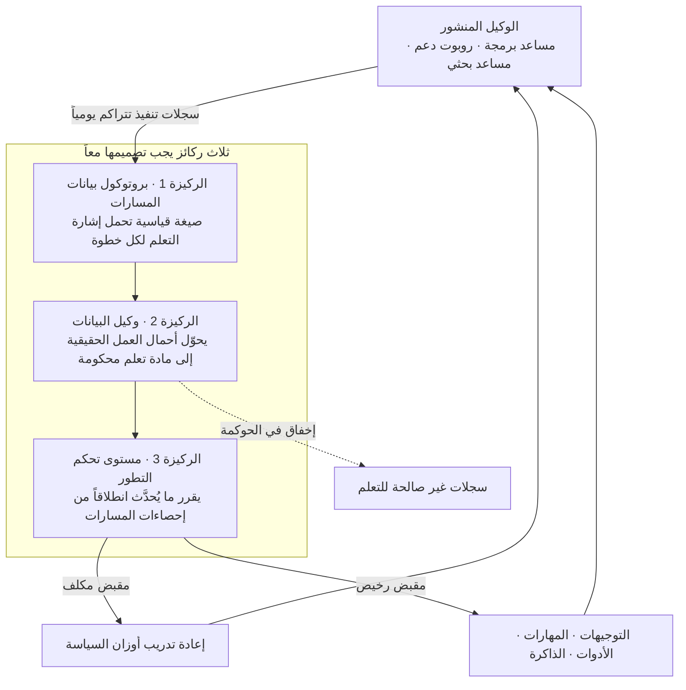

يبدأ شيء غريب في اليوم التالي لنشر الوكيل في بيئة الإنتاج. يستخدمه المستخدمون يومياً، ويعالج الوكيل آلاف المهام، ومع ذلك لا يتقدم الوكيل نفسه خطوة واحدة عن يوم نشره. الأوزان ثابتة، وتوجيه النظام ثابت، وقائمة الأدوات ثابتة. الشيء الوحيد الذي يتراكم هو السجلات، وهذه السجلات تمر عادة عبر لوحة مراقبة مرة واحدة ثم تختفي. ورقة بحثية نُشرت على arXiv في الأول من يوليو 2026 تشير إلى مصدر غير متوقع قليلاً لهذا الجمود. ليس النموذج ولا الخوارزمية، بل البنية الأنبوبية للبيانات.

*السجلات التي تتراكم يومياً ولا تتدفق إلى أي مكان هي نقطة انطلاق هذه الورقة.*

## لماذا يستحق هذا القراءة

هذا المقال موجّه لمن نشر وكيلاً بالفعل ولم يتحسن مع مرور الوقت، فصار ينتظر إصدار النموذج التالي. الخلاصة أولاً: ما تنتظرونه ليس نموذجاً أفضل، بل خط أنابيب بيانات لم تبنوه بعد. سجلات التنفيذ التي ينتجها وكيلكم يومياً ليست في صيغة قابلة للتعلم منها، وتحويلها إلى صيغة قابلة للتعلم مسألة أنظمة لا مسألة خوارزميات.

## نظرة عامة

عنوان الورقة هو «Next-Generation Agentic Reinforcement Learning Systems Enable Self-Evolving Agents» ورقمها على arXiv هو 2607.01120. نُشرت في الأول من يوليو 2026 وصدرت نسخة منقحة في اليوم التالي. ينتمي المؤلفون إلى Ant Group وجامعة هونغ كونغ للعلوم والتكنولوجيا وجامعة تسينغهوا. يوحي العنوان بأنها ورقة خوارزمية تعلم معزز أخرى، لكنها ليست كذلك. لا تقترح خوارزمية جديدة ولا تتباهى بدرجة قياس جديدة، بل ترسي موقفاً.

الموقف هو التالي. أكبر عنق زجاجة أمام الوكلاء ذاتيي التطور على مستوى المؤسسات ليس غياب نماذج لغوية أقوى ولا غياب خوارزميات تعلم معزز أكثر فاعلية، بل غياب ركيزة نظامية قادرة على تحويل خبرة الوكيل المنشور إلى مادة تعلم محكومة وقابلة لإسناد الفضل وقابلة لإعادة التشغيل.

ما يجعل هذا الادعاء مثيراً للاهتمام أنه يقف في صيغة قابلة للدحض. لو كان عنق الزجاجة هو الخوارزمية لتحسن الوكلاء المنشورون كلما ظهرت خوارزمية أفضل. الواقع لا يسير هكذا. تحسنت خوارزميات التعلم المعزز وتحسنت النماذج خلال العامين الماضيين، ومع ذلك ما زال معظم الوكلاء المنشورين في المؤسسات يتحسنون فقط عبر إنسان يقرأ السجلات بعينه ويعدّل التوجيه بيده ثم يعيد النشر. ترى الورقة أن هذه الحلقة اليدوية البطيئة تستمر لا بسبب الكسل بل لأن البنية الأنبوبية غير موجودة.

## الفجوات الثلاث التي تحددها الورقة

ترى الورقة أن أنظمة التعلم المعزز الوكيلية الحالية وطبقة المراقبة المحيطة بها قاصرة في ثلاثة جوانب جوهرية. هذه الثلاثة هي العمود الفقري للحجة، فلنأخذها واحدة تلو الأخرى.

أولاً، لا يوجد بروتوكول موحّد لبيانات مسارات الوكيل قادر على حمل إشارات التعلم المعزز بدقة الخطوة الواحدة عبر أنماط وكلاء غير متجانسة. العبارة المفتاحية هنا هي دقة الخطوة. السجلات التي نحتفظ بها عادة تقع على مستوى الطلب والاستجابة. لكن حين ينتج الوكيل إجابة خاطئة بعد عشر استدعاءات أدوات، فإن المعلومة التي يحتاجها التعلم ليست أن النتيجة كانت خاطئة، بل أي خطوة من الخطوات العشر انحرفت. والادعاء هو أن لا وعاء قياسياً يحتوي هذه المعلومة.

ثانياً، لا يوجد وكيل بيانات شامل بمستوى المؤسسات يحوّل أحمال العمل الحقيقية إلى ركائز تعلم محكومة. هذا الجانب أقرب إلى الحوكمة منه إلى التقنية. لا يمكن إدخال سجلات تنفيذ مختلطة ببيانات العملاء مباشرة في التدريب. يجب تنقيتها والتحقق من صلاحياتها وإتاحة إعادة تشغيلها عند الحاجة، وتكاد لا توجد جهة تقدّم هذه الطبقة كمنتج.

ثالثاً، لا يوجد مستوى تحكم موحّد لتطور الوكيل يقرر تلقائياً، استناداً إلى إحصاءات المسارات، ما إذا كان ينبغي تحديث أوزان السياسة أم تطوير الغلاف السياقي. هذه الفجوة هي الأكثر واقعية على صعيد التشغيل. حين لا يؤدي الوكيل أداءً جيداً تتوفر لديكم مقابض عدة. يمكن تعديل التوجيه أو إضافة مهارة أو تحديث الذاكرة أو إعادة تدريب النموذج. ويختلف كل منها في الكلفة بمقدار رتبتين أو أكثر. ومع ذلك فإن قرار أي مقبض يُسحب يُتخذ اليوم بحدس بشري في معظم الحالات.

تقترح الورقة ثلاث ركائز مصممة معاً تقابل هذه الفجوات الثلاث: بروتوكول موحّد لبيانات المسارات، ووكيل بيانات بمستوى المؤسسات، ومستوى تحكم موحّد للتطور. وتشدد على أن الثلاثة لا يمكن بناؤها منفصلة، بل يجب تصميمها معاً.

## كيف تتشابك الركائز الثلاث

*إن انقطعت السلسلة مرّت السجلات عبر لوحة المراقبة واختفت. وإن اتصلت صارت حلقة.*

الجزء الجدير بالتأمل في هذا الرسم هو الخط المتقطع الهابط إلى أسفل اليمين. إن لم يتمكن وكيل البيانات من اجتياز الحوكمة فلا يمكن استخدام تلك السجلات للتعلم. لهذا تجعل الورقة وكيل البيانات ركيزة مستقلة. فمجموعة البيانات القابلة للجمع تقنياً ومجموعة البيانات المسموح التدريب عليها قانونياً مجموعتان مختلفتان، والثانية أصغر بكثير في بيئة المؤسسات.

## AReaL بوصفه التطبيق السابق

الحجة ليست تجربة ذهنية خالصة. هناك نظام حقيقي من المعسكر نفسه. AReaL، الذي بناه مختبر التعلم المعزز في Ant Research بالاشتراك مع معهد علوم المعلومات متعددة التخصصات في تسينغهوا، وتصف نسخته الموسومة boba² نفسها بأنها نظام تعلم معزز غير متزامن بالكامل.

قرار التصميم الجوهري في AReaL هو الفصل التام بين التوليد والتدريب. في التعلم المعزز المتزامن التقليدي تُجمع عمليات الطرح ثم يُشغَّل التدريب، ما يترك وحدات المعالجة الرسومية عاطلة بالتناوب. وبفصل الجانبين بشكل غير متزامن يمكن لكل منهما أن يعمل بوتيرته الخاصة. يدّعي المشروع أن هذه البنية تحقق نحو 2.77 ضعف سرعة التدريب مقارنة بالنهج المتزامن، وأبلغ عن نتائج هي الأفضل حينها على LiveCodeBench وCodeforces وCodeContests. من الأفضل قراءة هذه الأرقام مع ملاحظة أنها قياسات المشروع نفسه.

الجانب الأهم عملياً يقع في موضع آخر. يتيح AReaL تخصيص مجموعة البيانات وسلوك الطرح وخوارزمية التدريب كلٌّ على حدة، ورسم الحدود بحيث لا يتطلب ذلك المساس بشيفرة النظام الثقيلة. هذه هي إحدى ركائز الورقة في صورة ملموسة. يجب أن تكون صيغة مادة التعلم منفصلة عن آلية تشغيل النظام قبل أن يمكن التطور عبر تبديل المادة. وقد نُشرت نماذج بأحجام 8B و14B و32B، ما يتيح فتح البنية مباشرة.

## تطبيق المسطرة ذاتها على ملف سياستنا

أوجعت هذه الورقة لأن الركيزة الثالثة لم تكن مشكلة الآخرين. تمتلك مهارات الأتمتة في ThakiCloud بالفعل شيئاً يشبه مستوى التحكم. فملف `scripts/skills/skill_model_policy.json` يدير مستوى النموذج لثماني عشرة مهارة مجدولة، ويسجّل `skill_retro.py` النتيجة عند نهاية كل تشغيل ويحدّث السياسة.

القاعدة بسيطة. تبدأ المهارة على مستوى رخيص، وتُرقّى تلقائياً حال تراكم تشغيلين سيئين متتاليين، ويُصفَّر عدّاد الإخفاق المتتالي عند تشغيل نظيف. ولا يوجد تخفيض تلقائي. وبمفردات الورقة فإن هذا مستوى تحكم مصغّر يقرر ما يُحدَّث انطلاقاً من إحصاءات المسارات. ومن بين الثماني عشرة الحالية هناك عشر مثبّتة على مستواها وست تعمل على المستوى الأعلى.

لكن قراءة هذا الملف بعدسة الورقة تُظهر إخفاقين. وقع كلاهما فعلاً وكلاهما مسجّل في الملف.

الإخفاق الأول يتعلق بجودة إحصاءات المسارات. تحمل عدة مدخلات في ملف السياسة ملاحظات تفيد بأن إخفاقات ناجمة عن بلوغ الحد الأسبوعي لاستخدام الحساب صُنّفت خطأً كإخفاقات جودة، فارتفع المستوى بلا مبرر. رُقّيت بهذه الطريقة مهارتان ذات طابع تنسيقي ثم أُعيدتا يدوياً بعد فهم السبب. وتشير الفجوة الأولى في الورقة إلى هذه النقطة بالضبط. فإن لم تكن الإشارة مفصّلة بدقة الخطوة تعذّر تمييز نوع الإخفاق، والقرارات المبنية على إحصاءات لا تميّز الأنواع تخرج خاطئة. استنفاد الحصة وقصور الجودة يظهران بالرمز نفسه، لكن العلاج متعاكس.

الإخفاق الثاني هو وجود مقبض واحد فقط. رُقّي أحد مدخلات ملف السياسة إلى المستوى الأعلى في الحادي عشر من يوليو 2026، ومع ذلك ارتفع عدّاد إخفاقه المتتالي إلى واحد وعشرين منذ ذلك الحين. أي أن الترقية لم تحل المشكلة. ولأن المقبض الوحيد الذي كان بوسع مستوى التحكم لدينا سحبه هو مستوى النموذج، لم يبق ما يمكن فعله حين كان السبب في مكان آخر. ولهذا تحديداً تعرّف الورقة مستوى التحكم بوضع تحديث الأوزان وتطوير الغلاف السياقي جنباً إلى جنب. المقبض الواحد لا يصنع مستوى تحكم، بل يصنع مفتاح ترقية تلقائية.

## ماذا يعني هذا لـ ThakiCloud

**بعدسة Paxis** تُقرأ هذه الورقة كخارطة طريق. Paxis هو مستوى تحكم Agent-Native Cloud الذي يعمل فوق ai-platform، ويتعامل مع المهارات والأدوات والسياسات وسجلات التدقيق كموارد من الدرجة الأولى. وبمطابقة هذه الأربعة على ركائز الورقة الثلاث تتضح الصورة. سجلات التدقيق هي المكان الذي تولد فيه بيانات المسارات، والسياسات هي القواعد التي يطبقها وكيل البيانات عند الحكم بما يُسمح بمروره، والمهارات والأدوات هي المقابض الرخيصة التي يمكن لمستوى التحكم سحبها بدل الأوزان.

وفصل ما نملكه عمّا لا نملكه يجعل المهمة التالية واضحة. لدينا سجلات تدقيق، لكنها ليست بصيغة تحمل إشارة تعلم على مستوى الخطوة. ولدينا بوابات سياسات، لكنها لا تتصل بمسار يرقّي سجلات التنفيذ إلى مادة تعلم. وتعريف سجلات تنفيذ المهارات كصيغة مسارات قابلة لإعادة التشغيل هو أولى الركائز الثلاث، ولا يمكن بناء الركيزتين الأخريين إلا فوقها. ومعرفة الترتيب هي أنفع ما تقدّمه هذه الورقة.

**بعدسة ai-platform** تصبح الركيزة الثانية متطلباً بنيوياً. فتحويل سجلات التنفيذ إلى مادة تعلم يعني تخزينها وتنقيتها وإعادة تشغيلها في مكان ما، وحين تختلط بها بيانات العملاء يصير هذا العمل سؤالاً عن الحدود الفيزيائية التي تبقى البيانات داخلها. وللعملاء ذوي متطلبات التشغيل المحلي والسيادة الرقمية ليست هذه نقطة تفاوض بل شرطاً مسبقاً. وإضافة خطوط جمع المسارات وإعادة تشغيلها فوق العزل متعدد المستأجرين المبني على K8s وجدولة وحدات المعالجة الرسومية عبر Kueue لن تكون بيع ميزة مراقبة، بل بيع الشرط المسبق للتطور الذاتي.

تشير العدستان إلى الاتجاه نفسه. يضمن ai-platform فيزيائياً الحد الذي تبقى البيانات داخله، وداخله يطبّق Paxis السياسة التي ترقّي المسارات إلى مادة تعلم. وإصرار الورقة على تصميم الركائز الثلاث معاً يظهر مجدداً في العلاقة بين هاتين الطبقتين.

## الحدود والاعتراضات

تجدر تسمية بضعة أمور قبل أخذ هذه الورقة على علاتها.

أولاً، هذه ورقة موقف لا تقرير نظام مُتحقق منه. الحجة بأن الركائز الثلاث ضرورية مقنعة، لكن لا يوجد داخل الورقة قياس يبيّن أن نظاماً يملكها جميعاً حقق فعلاً تطوراً ذاتياً على مستوى المؤسسات. الفجوة واسعة بين اقتراح معماري وبرهان على أنه يعمل، وما زالت هذه الورقة على الضفة القريبة.

ثانياً، البروتوكول القياسي لا يحل عنكم مسألة إسناد الفضل. فبناء وعاء يحمل الإشارة لكل خطوة والحكم بأي خطوة من العشر سببت الإخفاق مسألتان مختلفتان. والثانية صعبة بحد ذاتها ولا تُحل تلقائياً بمجرد وجود الوعاء. تشدد الورقة على الوعاء الغائب لكنها تتناول بقدر أقل الصعوبة التي تبدأ بعد امتلائه.

ثالثاً، قد تتجاوز كلفة الحوكمة المكاسب. فتحويل سجلات العمل الحقيقية إلى مادة تعلم يعني الاحتفاظ ببيانات العملاء مدة طويلة، وهذا في القطاعات المنظمة أمر شبه غير قابل للتفاوض بذاته. يُطرح وكيل البيانات بوصفه الطبقة التي تحل هذا، لكن في الواقع كثيراً ما يكون قرار عدم استخدام البيانات أصلاً أرخص من بناء الوكيل.

رابعاً، قرارات التحديث التلقائي محفوفة بالمخاطر بذاتها. وكما تُظهر حالتانا في ملف السياسة، فإن قراراً يُتخذ تلقائياً على إحصاءات سيئة يرفع الكلفة بصمت ويحجب السبب. وكلما ازداد مستوى التحكم ذكاءً صعب على الإنسان تتبع أساس حكمه. ويجب حساب مكسب الأتمتة وخسارة القابلية للتتبع معاً.

خامساً، أرقام أداء AReaL مبلَّغ عنها ذاتياً من المشروع. أن تتفوق البنية غير المتزامنة على المتزامنة أمر معقول بنيوياً، لكن مضاعف 2.77 تحديداً يأتي من المطورين لا من إعادة إنتاج مستقلة. والأسلم الاستشهاد به مع ذكر المصدر.

## الخلاصة

قيمة هذه الورقة لا تكمن في تقنية جديدة بل في إعادة تموضع للمشكلة. فهي تحوّل النظرة التي كانت تبحث عن سبب عدم تحسن الوكلاء في النماذج والخوارزميات نحو سجلات التنفيذ التي تتراكم يومياً ولا تتدفق إلى أي مكان.

هذه كانت الخلاصة المذكورة في المقدمة: ما تنتظرونه ليس نموذجاً أفضل بل خط أنابيب بيانات لم تبنوه بعد. ولم نتأكد إلا بعد تطبيق المسطرة ذاتها على أنفسنا أن مستوى التحكم الذي ظننا أننا نملكه كان في الحقيقة مفتاح ترقية بمقبض واحد، وأن ذلك المفتاح دار مرتين على إشارة خاطئة. قبل ذلك كان يبدو أتمتة تعمل على ما يرام.

إن بقي الوكيل الذي نشرتموه على حاله شهوراً، فجرّبوا سؤالاً واحداً قبل مراجعة موعد إصدار النموذج التالي. أين هي سجلات التنفيذ التي أنتجها ذلك الوكيل أمس، وما الذي يمكنكم تغييره بها؟ إن انتهت الإجابة عند لوحة مراقبة فعنق الزجاجة ليس النموذج.

## المصادر

- [Next-Generation Agentic Reinforcement Learning Systems Enable Self-Evolving Agents (arXiv:2607.01120)](https://arxiv.org/abs/2607.01120)
- [النسخة المنقحة من الورقة (arXiv:2607.01120v2)](https://arxiv.org/abs/2607.01120v2)
- [مستودع AReaL مفتوح المصدر (inclusionAI/AReaL)](https://github.com/inclusionAI/AReaL)
- [بطاقة نموذج AReaL-boba-2-32B (Hugging Face)](https://huggingface.co/inclusionAI/AReaL-boba-2-32B)
- [AReaL: A Large-Scale Asynchronous Reinforcement Learning System for Language Reasoning (arXiv:2505.24298)](https://arxiv.org/abs/2505.24298)
- [تغطية إطلاق AReaL-boba² من Ant Group وتسينغهوا (DeepNewz)](https://deepnewz.com/china/ant-group-tsinghua-launch-open-source-areal-boba2-async-rl-system-2-77x-faster-24c514e7)
