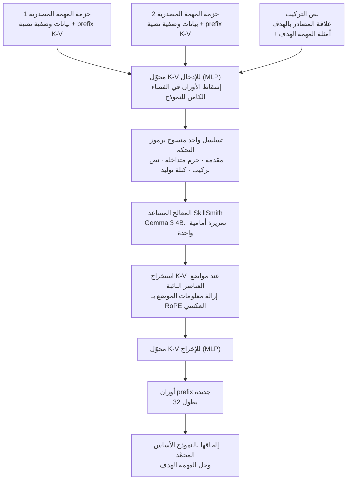

ظل هناك مساران لمنح الوكيل مهارة. الأول أن تكتبها. تحتفظ بوصف المهمة وبعض الأمثلة وملاحظة عن سبب فشل المحاولة السابقة، ثم تحمّل هذا المستند في السياق عند الحاجة. والثاني أن تخبزها في الأوزان. لكل هدف فرعي متكرر تدرّب وحدة LoRA أو prefix، وتحفظها في درج المحوّلات، وتخرجها عند الطلب. نوقش المساران في جلسات مؤتمرات منفصلة لأكثر من عقد، وفي الممارسة تعامل الفرق الأمر عادة كاختيار بين اثنين. ورقة من Google DeepMind نُشرت على arXiv في 29 يوليو 2026 تعيد النظر في الاختيار نفسه.


*ما الذي يحدث حين تضع المهارات المكتوبة والمهارات المخبوزة في الفرن نفسه؟ هذا هو سؤال الورقة.*

## لماذا يهمك هذا

هذا المقال لمن يدير مكتبة مهارات خلف وكيل: راكمت مئات المهارات المستندية مثل ملفات SKILL.md، أو تدير محوّلات LoRA لكل مهمة. الخلاصة أولًا: الطريقتان ليستا بديلتين بل مكمّلتان لا تغطي إحداهما الأخرى، وثمة نطاق أداء حقيقي لا يظهر إلا حين تُغذّى الاثنتان لنموذج واحد معًا. في تجربة الحذف بالورقة، كانت الفجوة بين النص وحده وبين الوسيطين معًا أكثر حسمًا من الفجوة بين النص وحده والأوزان وحدها.

## نظرة عامة

عنوان الورقة «SkillSmith: Learning to Compose Parametric Skills and Textual Knowledge»، ورقمها على arXiv هو 2607.27497. Lucio M. Dery وBenedict Aaron Tjandra مؤلفان أولان مشتركان، ومعهما Adhiguna Kuncoro وArthur Szlam وآخرون بمجموع سبعة مساهمين. التصنيف cs.CL، والكلمات المفتاحية التي اختارها المؤلفون هي model merging وkv-caches وcontinual learning وprefix tuning.

الوضع الذي تصفه الورقة كالآتي. يتعلم الوكلاء المدفوعون بالنماذج اللغوية من التجربة السابقة عبر مسارين: أحدهما يركّب المعرفة بلغة طبيعية عبر التأمل الذاتي والذاكرة المهيكلة وتحسين المطالبات، والآخر يجمّد سلوك المهام المتكررة في أوزان وحدات عبر PEFT. ولا جسر بينهما. المسار النصي مرن لكنه محكوم بحدود السياق وقت الاستدلال. ومسار الأوزان كفؤ في الاستدلال، لكن الدمج يبقى عمليات حسابية كالمتوسط أو الوصل، ولا يستفيد إطلاقًا من العلاقات الدلالية بين المهام.

المثال الذي تسوقه الورقة بديهي. لنفترض أن وكيلًا درّب في جلسة ذاكرة prefix لترجمة الإنجليزية إلى التْوِيَّة، وفي جلسة أخرى جمّع ملاحظات عن تحليل الوثائق القانونية الإنجليزية. الآن تصل مهمة جديدة: حلّل وثيقة قانونية مكتوبة بالتْوِيَّة. يستطيع الوكيل أن يقول بالكلمات إن هذه المهمة مزيج من قدرة الترجمة ونمذجة لغة التْوِي وتحليل الوثائق القانونية. لكنه لا يستطيع تحويل هذا القول إلى أوزان فعلية. المعرفة بالكلمات والفعل بالأوزان منفصلان.

## ما هذه التقنية

تُختصر فكرة SkillSmith في جملة واحدة: عامِل الأوزان كوسيط آخر يعرف النموذج اللغوي قراءته أصلًا.

عمليًا، تُجسَّد المهارات البارامترية عبر prefix-tuning. ولاختيار prefix بدل LoRA سبب واضح. أي مقطع نصي يصبح ذاكرة K-V بمجرد تمريرة أمامية واحدة عبر النموذج الأساس، ما يضع الذواكر المشتقة من النص والذواكر المدرَّبة في الفضاء نفسه. ولهدف يقوم على وصل وسيطين، لا يوجد تمثيل أطبع من هذا.

يتلقى SkillSmith حزم مهام مصدرية. كل حزمة هي ذاكرة prefix K-V مدرَّبة واحدة مع بيانات وصفية نصية تصف تلك المهمة. ويُضاف إلى ذلك نص التركيب الذي يصف علاقة المهام المصدرية بالقدرة الهدف. تُنسج هذه المكوّنات في تسلسل واحد برموز تحكّم وتُمرَّر مرة واحدة عبر نموذج معالج مساعد.



للتسلسل قواعد. تأتي أولًا مقدمة تصف هدف التركيب. ثم لكل حزمة مصدرية يبدأ النص برمز `<src_start>` ويقع K-V المُسقط بين `<kv_start>` و`<kv_end>`. وبعد الحزم يأتي نص التركيب، وبعد `<gen_start>` تتوالى رموز نائبة بطول ثابت. وبعد التمريرة الأمامية يُستخرج K-V عند تلك المواضع النائبة فقط، وتُنزع منه معلومات الموضع عبر RoPE العكسي، ويمر بمحوّل الإخراج لتنتج أوزان prefix الجديدة.

التدريب طرف إلى طرف. تُلحق الذاكرة المولَّدة بالنموذج الأساس المجمَّد، وتُحسب خسارة الإنتروبيا المتقاطعة على المهمة الهدف، وتُعاد هذه الخسارة انتشارًا عبر النموذج الأساس إلى SkillSmith. تبقى أوزان النموذج الأساس ثابتة طوال الوقت.

يستحق إعداد التقييم الانتباه. تُسحب أطوال prefix للمهام المصدرية عشوائيًا من 32 و64 و128 لإدخال التنوّع، والمعالج المساعد والنموذج النهائي كلاهما Gemma 3 4B. وعدد المهام المصدرية مثبّت عند اثنتين. ويُدرَّب prefix K-V على طبقات الانتباه الشاملة فقط، لأن prefix الملحق بطبقة انتباه محلية ينزلق في النهاية خارج السياق.

## التثبيت والتكامل

لم تنشر الورقة شيفرة ولا نقاط تحقق، فلم نتمكن من إعادة إنتاج SkillSmith نفسه. بدلًا من ذلك حسبنا كم يكلّف فعليًا حمل مهارة واحدة ضمن الشروط التي ثبّتتها الورقة: نموذج أساس Gemma 3 4B، الطبقات الشاملة فقط، وطول prefix يساوي 32. تشغيليًا، هذا الرقم ربما يسبق في أهميته أرقام Elo في الورقة.

أولًا اسحب إعدادات Gemma 3 4B الفعلية.

```bash
curl -s https://huggingface.co/unsloth/gemma-3-4b-it/raw/main/config.json | jq '.text_config'
# num_hidden_layers: 34, num_key_value_heads: 4, head_dim: 256,
# sliding_window_pattern: 6, torch_dtype: "bfloat16"
```

بما أن `sliding_window_pattern` يساوي 6، فإن طبقة من كل ست طبقات هي انتباه شامل. ومن 34 طبقة، خمس شاملة والتسع والعشرون الباقية محلية. وتثبّت الورقة تدريب prefix على الطبقات الشاملة وحدها، فالبارامترات المدرَّبة فعليًا تغطي خمس طبقات.

سكربت الحساب موجود في مستودع ThakiCloud.

```bash
.venv/bin/python scripts/experiments/skillsmith_prefix_budget.py
```

يقيس السكربت أمرين معًا. الأول عدد بارامترات ذاكرة prefix K-V واحدة وحجمها بالبايت ضمن الإعدادات أعلاه. والثاني الحجم الحقيقي لمجموعة المهارات المحلية. تحتوي مساحة عمل ThakiCloud حاليًا على 1,911 ملف SKILL.md تحت `.claude/skills/`. وتحميل مهارة نصية في السياق يعني أن رموزها تصبح كذلك K-V مقيمة، ما يتيح مقارنة الطريقتين بالوحدة نفسها.

## النتائج المقيسة

ميزانيتنا أولًا.

| البند | القيمة |
|---|---|
| الطبقات الشاملة في Gemma 3 4B | 5 (من أصل 34) |
| طول prefix 32، الطبقات الشاملة فقط | 327,680 بارامتر |
| الحجم نفسه بدقة bf16 | 640 KiB |
| النسبة من النموذج الأساس | 0.0076 بالمئة |
| عند طول prefix يساوي 128 | 1,310,720 بارامتر (2,560 KiB) |
| للمقارنة، الطبقات الـ34 كلها | 2,228,224 بارامتر (4,352 KiB) |

أما جانب النص: وسيط ملفات SKILL.md المحلية الـ1,911 هو 6,173 حرفًا، وبتحويل متحفظ بمعدل 4 أحرف لكل رمز يصبح نحو 1,543 رمزًا. وإبقاء هذا المقدار مقيمًا في سياق Gemma 3 4B يضع K-V على الطبقات الـ34 كلها، أي نحو 205 MiB. وبمقابل 640 KiB للمهارة نفسها محمولة بارامتريًا، الفارق 328 ضعفًا. وبمقياس مواضع التسلسل هو 1,543 مقابل 32، أي 48 ضعفًا.


*اليسار تجربة الحذف من الجدول 1 في الورقة، واليمين تكلفة الإقامة التي حسبها السكربت أعلاه.*

والآن أرقام الورقة. للتحقق مما إذا كان SkillSmith يستخدم ذواكر K-V فعلًا، حذف المؤلفون المدخلات واحدًا تلو الآخر. قيم Elo المقيسة على مهام التقييم الفوقي في Composite-SNI:

| تكوين المدخلات | Elo |
|---|---|
| بلا مدخلات | 1209 |
| ذواكر K-V فقط | 1455 |
| كل شيء عدا ذواكر K-V | 1622 |
| المدخلات كاملة | 1714 |

طريقة القراءة مهمة. النص وحده (1622) يتفوق على الأوزان وحدها (1455)، أي أن النص إشارة أغنى. لكن الاثنين معًا يبلغان 1714، أي 92 نقطة فوق النص وحده. وهذه النقاط الـ92 المكتسبة بإضافة الأوزان هي جوهر دعوى الورقة. وكما يشير المؤلفون، فإن إعداد K-V وحده يكافئ عمليًا منهج ATTEMPT القائم على دمج وحدات PEFT بدالة بارامترية بدل العمليات الحسابية. فالجدول إذن يضع سقف طرق دمج الأوزان القائمة في الأسفل ويُظهر المكسب الناتج عن إضافة النص.

كما اختبر المؤلفون الاعتراض البديهي بأن المكسب مجرد نتيجة لمزيد من النص. استخرجوا كل النص المصدري ونص التركيب المُغذّى لـSkillSmith، وألصقوه مباشرة أمام مدخلات المهمة الهدف، ودرّبوا ذاكرة prefix عادية. حسّن النص المساعد خط الأساس فعلًا، لكنه لم يلحق بـSkillSmith. فوجود النص شيء وتركيبه مع الأوزان شيء آخر.

وهناك فحص للتعميم أيضًا. أُعيد تسجيل مهام التقييم الفوقي الخمس عشرة مقسّمة بحسب ظهور أي من المهمتين الأصليتين في التدريب الفوقي، وتصدّر SkillSmith في الأقسام الثلاثة. والفوز بفارق كبير حتى حيث لم يرَ المهام الأصلية قط هو الجزء اللافت.

لكنه لم يفز على كل مجموعة بيانات. على مجموعة SNI الحقيقية، وبمجرد السماح بالضبط الدقيق النهائي، تقارب معدل الفوز بين الطرق الثلاث الأولى عند 0.5. ويعزو المؤلفون ذلك إلى أن SNI تحوي نحو 1,000 نموذج لكل مهمة، وأنها بُنيت عام 2022 وتتكوّن غالبًا من أعمال بدائية كتصنيف المشاعر ووصل المحارف، وهي تافهة لنماذج اليوم. أما على MMLU-ProX، بنحو 250 مهمة فقط وصعوبة أعلى، فاتسعت الفجوة من جديد. وهناك بلغ المتغيّر المدرَّب على MMLU-ProX وحدها دون انطلاق من نقطة تحقق Composite-SNI مستوى 1736 فقط في Elo الصفري.

## ماذا يعني هذا لمنتجات ThakiCloud

تمس هذه الورقة منتجَي ThakiCloud معًا.

**عدسة Paxis** أولًا. Paxis هو مستوى التحكم Agent-Native Cloud لدى ThakiCloud، ويعامل Skills وTools وPolicies وAudit Logs كموارد من الدرجة الأولى. وفي قلبه، يختار Skill Harness حاليًا المهارات النصية عبر BM25 وينفّذها في صندوق رملي معزول. وهذه الورقة تمس منحنى تكلفة تلك البنية بالضبط، وفارق الـ328 ضعفًا المقيس أعلاه هو السبب. فما دامت المهارات محمولة كنص، فإن ميزانية السياق هي ما يحدد عدد ما يمكن تفعيله معًا. ولهذا يلزم موجّه، وحين يخطئ الموجّه تفشل تلك الدورة ببساطة.

تنقل المهارات البارامترية هذا القيد إلى محور آخر. فبـprefix بطول 32 موضعًا، تصبح ثماني مهارات نشطة 256 موضعًا و5 MiB. لكن بأمانة، هذا تكامل لا استبدال. فتجربة الحذف في الورقة نفسها تقول إن النص وحده يتفوق على الأوزان وحدها، فالتخلي عن المهارات النصية لصالح الأوزان اتجاه لا تدعمه هذه الورقة. ما تدعمه هو وضع نظير بارامتري بجوار المهارة النصية التي اختارها الموجّه. وبما أن خط أنابيب المهارات ذاتية التطور في Paxis ينشئ المهارات ويعدّلها ويقيّمها أصلًا، فإن إضافة ذاكرة prefix إلى مخرجات ذلك الخط توسيع لقائمة مخرجات قائمة لا بنية جديدة.

**عدسة ai-platform** تخص التقديم. ذاكرة prefix محوّل لكل طلب لا نموذج. وحفظ آلاف الكائنات بحجم 640 KiB لكل مستأجر وإلحاق واحد منها عند الطلب مكافئ بنيويًا لتقديم LoRA متعدد المحوّلات. وتشغّل منصة ai-platform لدى ThakiCloud أصلًا تقديم vLLM متعدد المستأجرين فوق K8s وKueue، فمشاركة نموذج أساس واحد مع إلحاق مجموعة مهارات مختلفة لكل مستأجر لا تبتعد كثيرًا عن التصميم الحالي. وهذا أهم ما يكون في البيئات المحلية والسيادية. فبدل ضبط نموذج منفصل لكل عميل واستهلاك وحدات معالجة رسومية لكل منها، تشارك نموذج أساس واحد وتدير مهارات كل عميل ككائنات بمقياس الكيلوبايت، فلا يعود إشغال المعالجات يتناسب مع عدد العملاء.

تتصل العدستان. فحين تصير المهارات رخيصة الحمل (ai-platform) يستطيع الوكيل حمل عدد أكبر منها (Paxis)، وحين يحمل عددًا أكبر يقل ثمن الخطأ في اختيار إحداها.

## الحدود والاعتراضات

أكبر قيد هو قابلية إعادة الإنتاج. لم تُنشر شيفرة ولا نقاط تحقق، ويتطلب SkillSmith تدريبًا فوقيًا طرفًا إلى طرف يعيد الانتشار عبر النموذج الأساس. عليك أولًا بناء مكتبة prefix لكل مهمة، ويجب توليد نص التركيب بـGemini 2.5. ووصف نحو 350 ألف مهمة اصطناعية أولية يوحي بأن التحضير وحده استثمار كبير. من المبكر توقع النتائج نفسها في مجالك.

ثانيًا، حجم التجربة صغير. المعالج المساعد والنموذج النهائي كلاهما نموذج 4B واحد، وأعداد مهام التقييم الفوقي هي 15 و10 و6. وElo مقياس نسبي لا يقول شيئًا عن الأداء المطلق، وتتغير قيمه بتغير مجموعة المرشحين. وعدد المهام المصدرية مثبّت عند اثنتين، فلا تكفي هذه الورقة وحدها لمعرفة ما إذا كان المنهج يمتد إلى تركيبات المهارات المتعددة التي يواجهها الوكلاء فعليًا.

ثالثًا، يضيّق التقارب الملاحظ على SNI نطاق التطبيق. فحين تكون البيانات وفيرة والمهام سهلة، يصل التدريب المباشر إلى المكان نفسه. ويستحق SkillSmith كلفته حيث تكون المهام صعبة والنماذج شحيحة. وكثير من العمل المجالي الداخلي ينطبق عليه هذا الوصف، لكن لا داعي لتمرير كل مهمة عبر هذا المنهج.

أخيرًا، فارق الـ328 ضعفًا المحسوب أعلاه فارق في التخزين والإقامة لا في القدرة. وهو لا يعني إطلاقًا أن prefix بحجم 640 KiB يؤدي عمل سياق نصي بحجم 205 MiB. تجربة الحذف في الورقة تقول العكس تمامًا، والحساب هنا موجود لوضع الطريقتين على مسطرة واحدة لا لتبرير استبدال.

## الخلاصة

طويلًا كان منح الوكيل مهارة يعني الاختيار بين المستندات والأوزان. وتضع هذه الورقة إجابة ثالثة على الطاولة. اجعل الأوزان قابلة للقراءة من النموذج اللغوي، فتتحول أوصاف العلاقات التي كتبتها إلى تعليمات تنتج أوزانًا فعلية. والنقاط الـ92 في تجربة الحذف دليل على أن تلك التعليمات لم تكن كلامًا فارغًا.

إن كنت تدير مكتبة مهارات اليوم، فتحقق من أمر واحد. هل تتضمن مستندات مهاراتك جملة تصف كيف ترتبط هذه المهارة بالمهارات الأخرى؟ ما استهلكه SkillSmith فعليًا لم يكن وصف المهمة بل وصف العلاقات بين المهام. فإن غابت تلك الجملة، سيغيب أهم المكوّنات حين تحاول لاحقًا إلحاق التركيب البارامتري. وإن كانت موجودة أصلًا، فخبز ذاكرة prefix إضافية في خط أنابيب مهاراتك خطوة تالية أقرب مما تبدو.

## المصادر

- الورقة: [SkillSmith: Learning to Compose Parametric Skills and Textual Knowledge (arXiv:2607.27497)](https://arxiv.org/abs/2607.27497)
- المؤلفون: Lucio M. Dery وBenedict Aaron Tjandra وSiavash Samiei وAdhiguna Kuncoro وZohar Yahav وJiajun Shen وArthur Szlam (Google DeepMind)، مُقدَّمة في 29 يوليو 2026
- إعدادات النموذج الأساس: [Gemma 3 4B config.json](https://huggingface.co/unsloth/gemma-3-4b-it/raw/main/config.json)
- سكربت الحساب لهذا المقال: `scripts/experiments/skillsmith_prefix_budget.py` (مستودع ThakiCloud الداخلي)
