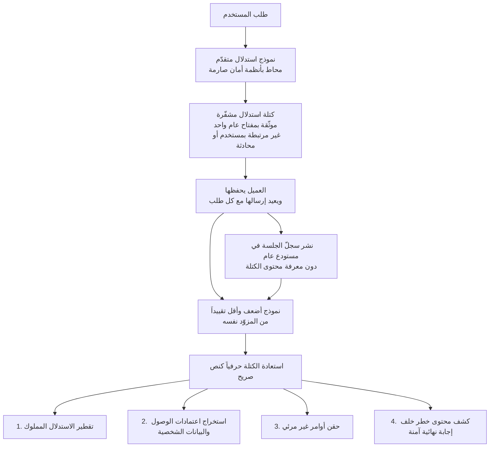

*تبيّن أن كون الشيء مختوماً لا يعني أنه غير قابل للقراءة.*

## لماذا تقرأ هذا

هذا المقال موجّه للفرق التي تشغّل وكلاء نماذج لغوية كبيرة وتحفظ سجلات الجلسات والمسارات أو تنشرها، ولمسؤولي الأمن الذين يضعون سياسة الاحتفاظ بتلك السجلات. الخلاصة أولاً: كتل الاستدلال المشفّرة التي تعيدها الواجهة البرمجية كان يمكن إعادتها إلى نص صريح خارج نطاق سيطرتكم، ما يعني أن تلك السجلات كان ينبغي التعامل معها لا بوصفها نصاً مشفّراً بل بوصفها **نصاً صريحاً مؤجّلاً**.

الخلل ليس في النموذج بل في طريقة التعامل مع الكتل. لذا لا تسدّه هندسة الأوامر مهما أتقنتها، وفي المقابل يسدّ جزءاً كبيراً منه سطر واحد في سياسة الاحتفاظ بالسجلات. فيما يلي نوضّح كيف وصلت البنية إلى هذا الحال، وما الضرر الذي قيس فعلياً، وما الذي ينبغي لفريق يشغّل وكلاء أن يفحصه اليوم.

> 📄 **المراجعة المتعمقة الكاملة (DOCX)**: [نزّل المراجعة التفصيلية من Google Drive](https://drive.google.com/file/d/1DCVHFJwh5UFaZYob2gZksfn9vK8Bm91y/view).

## نظرة عامة

في العاشر من أغسطس نُشرت على arXiv ورقة بعنوان «Stealing Reasoning Traces from Proprietary LLM APIs» برقم arXiv:2608.09867. شارك في تأليفها ثمانية باحثين هم Alexander Panfilov وDavid Schmotz وIlia Shumailov وLuca Beurer-Kellner وJoachim Schaeffer وAmeya Prabhu وJonas Geiping وMaksym Andriushchenko، وصُنّفت ضمن cs.CR وcs.AI وcs.LG.

الخلفية كالتالي. تولّد نماذج الاستدلال المتقدّمة سلاسل تفكير داخلية طويلة قبل إنتاج الإجابة المرئية. ويخفي المزوّدون هذا التفكير حمايةً للملكية الفكرية وحدّاً لتسرّب المعلومات. لكن طريقة الإخفاء هي المهمة هنا. فبدلاً من تخزين المسارات على الخادم وإعادة معرّف فقط، يغلّفونها في **كتل نصية مشفّرة تُعاد إلى العميل، ويعيدها العميل مع كل طلب لاحق**. وعدم الاحتفاظ بحالة على الخادم خيار معقول من ناحية قابلية التوسّع.

المشكلة في مدى انتقال تلك الكتل. فالخلل البنيوي الذي تحدّده الورقة هو أن هذه الكتل المشفّرة **متوافقة وقابلة للتبادل بالكامل عبر الجلسات وعبر المستخدمين وعبر النماذج المختلفة داخل منظومة المزوّد نفسها**. وبتعبير الورقة، يبدو أن المزوّدين يستخدمون مفتاحاً عاماً واحداً لتشفير كل كتلة استدلال والمصادقة عليها. فلا شيء يربط الكتلة بمستخدم أو بمحادثة.

## كيف يعمل الهجوم

يتحوّل التوافق نفسه إلى سطح هجوم. تأخذ كتلة أنتجها نموذج قوي محاط بأنظمة أمان صارمة، وتدخلها إلى نموذج أضعف وأقل تقييداً من المزوّد نفسه. فيفكّ النموذج الأضعف ترميزها ويطبع المسار حرفياً بنص صريح. ولا يجري اختراق النموذج القوي إطلاقاً. وقد أثبتت الورقة نجاح ذلك لدى Anthropic وOpenAI وGoogle.

ويستحق الجانب الاقتصادي الإشارة. فبالاعتماد على تسعيرة Claude Haiku 4.5 آنذاك، وبنافذتَي إدخال وإخراج بحجم 12,000 رمز لكل منهما، تقدّر الورقة أن فكّ تشفير مجموعة من عشرة آلاف مسار يكلّف نحو 720 دولاراً بالأسعار القياسية للواجهة. أي أن السعر ليس ما يمنع الاستخراج واسع النطاق.

## أربعة مسارات للهجوم

تتتبّع الورقة أربعة فروع تنبثق من هذا الخلل الواحد.

**أولاً، تعطّل آليات منع التقطير.** فالسبب الرئيس لإخفاء المزوّدين للاستدلال هو منع المنافسين من تقطيره، وهذا المسار يهزم ذلك الهدف مباشرةً. فبينما استعادت الأبحاث السابقة تقريبات بديلة ورفعت دقة نموذج Qwen2.5-7B-Instruct المضبوط من 68.4 إلى 76.0 بالمئة، يستعيد هذا المسار الاستدلال الأصلي حرفياً.

**ثانياً، استخراج البيانات الخاصة على نطاق واسع.** وهذا الجزء هو الأكثر التصاقاً بالممارسين. فالمطوّرون ينشرون سجلات الجلسات بشكل روتيني لأغراض التنقيح أو التقييم أو إصدار مجموعات البيانات، وهم لا يرون ما بداخل الكتل المشفّرة. وحين فكّ الباحثون تشفير 315,320 كتلة جُمعت من مستودعات عامة، استعادوا 367 عنصراً من البيانات الشخصية و182 اعتماد وصول. ومن جلسات المستخدمين الحقيقية وحدها شمل ذلك 62 مفتاح واجهة برمجية و33 كلمة مرور و30 بريداً إلكترونياً شخصياً. والتفصيل الأكثر إزعاجاً أن بعض البيانات الشخصية المستعادة **لم يظهر في مدخلات المستخدم إطلاقاً**، بل تسرّب إلى الاستدلال من ذاكرة النموذج.

**ثالثاً، محتوى خطر خلف إجابة آمنة.** فقد يرفض النموذج طلباً خبيثاً رفضاً سليماً في مخرجاته النهائية المرئية بينما يظل الاستدلال الذي قاده إلى الرفض محتوياً على تلك المادة. وأنظمة الأمان التي تفحص ما يراه المستخدم فقط لا تغطّي هذه القناة.

**رابعاً، حقن أوامر غير مرئي.** فبوضع حمولة خبيثة كاملة داخل كتلة مشفّرة، لا يرى أحد في المراحل اللاحقة شيئاً بالعين المجرّدة. ويصبح ذلك مساراً لتسميم عمليات تشغيل الوكلاء المنشورة. وهكذا تتحوّل ممارسة مشاركة المسارات لأغراض قابلية إعادة الإنتاج إلى سلسلة توريد.

كما تترك الورقة ملاحظة جانبية لافتة. فتمرير جزء قصير من استدلال Opus 4.8 المفكوك إلى Kimi-K3 وGLM-5.2 يحوّل أسلوب استدلالهما اللاحق وإجابتهما المرئية نحو Opus، بينما لا يظهر DeepSeek-V3.1 وInkling تغيّراً مماثلاً. غير أن المؤلفين يصفون هذه النتائج صراحةً بأنها "موحية لكن غير حاسمة". فمن السابق لأوانه الاستشهاد بها دليلاً على تدريب نموذج بعينه على بيانات بعينها.

## الدفاعات المقترحة

أبلغ الباحثون مزوّدي الواجهات البرمجية الكبار وMicrosoft وHugging Face قبل النشر، ونشر المزوّدون إجراءات تخفيف من جهة الخادم. وتقترح الورقة خمسة اتجاهات.

**المراجعة البنيوية** هي الأكثر جذريةً. فتخزين الاستدلال على الخادم وإعطاء العميل معرّفاً عشوائياً فقط يلغي حمولة الاستخراج تماماً. والتكلفة هي أعباء قواعد البيانات والتخزين وزيادة كبيرة في تعقيد الواجهة.

**الربط السياقي التشفيري** هو الخيار إن أردت الإبقاء على بنية عديمة الحالة. أي وضع معرّف المستخدم ومعرّف المحادثة مباشرةً داخل حمولة AEAD بحيث يرتبط المظروف بسياقه الأصلي. وتشير الورقة، بشيء من الاستغراب، إلى أنه ليس واضحاً لماذا لم يكن ذلك موجوداً منذ البداية.

**الإبطال من جهة المزوّد** هو الدفاع التشغيلي: رصد أنماط إعادة التشغيل الشاذة وإبطال التوقيع أو المفتاح المرتبط بها. لكن التراجع عن التواقيع المنشورة سلفاً يستلزم تدوير مفاتيح التوقيع بالكامل، وهو ما يكسر أيضاً الاستئناف المشروع للجلسات السابقة. ونظراً لحاجة عملاء المؤسسات إلى استئناف سير عمل الوكلاء المتوقّف، تقترح الورقة نافذة زمنية محدودة تُقبل خلالها المظاريف القديمة والجديدة معاً، إضافةً إلى نقطة نهاية اختيارية لإعادة التوقيع بالجملة.

أما الاتجاهان المتبقيان فهما ضوابط البنية التحتية والدفاعات على مستوى النموذج.

## ما يعنيه هذا لـ ThakiCloud

تختبر هذه الورقة أحد الافتراضات التي بنينا عليها Paxis اختباراً مباشراً.

**من منظور Paxis**، جوهر هذه الحادثة أن أثر تنفيذ الوكيل هو بحدّ ذاته أصل حسّاس. فـ Paxis هو مستوى التحكّم لدينا في السحابة الأصلية للوكلاء، ويتعامل مع المهارات والأدوات والسياسات وسجلات التدقيق بوصفها موارد من الدرجة الأولى، وترك سجلات التدقيق أمر محوري في التصميم. لكن هذا الخلل يفرض سؤال من يستطيع قراءة السجلات التي نتركها. فإذا حفظنا كتلة معتمة أعادتها واجهة خارجية كما هي داخل سجلاتنا، فإننا نراكم داخل مخزننا بيانات لا تستطيع بوابة سياساتنا فحصها. والدلالة العملية واضحة. ينبغي تصنيف الكتل المعتمة الواردة من مزوّدين خارجيين تصنيفاً منفصلاً بمدة احتفاظ قصيرة، وإزالتها افتراضياً في أي مسار يشارك المسارات إلى الخارج. فالبيانات التي لا تستطيع بوابة السياسات إجازتها أقرب إلى بيانات ينبغي لها منعها.

**ومن منظور Metis** تظهر زاوية أخرى. فجذر هذه الثغرة تصميم عديم الحالة دفع الاستدلال إلى العميل، وقد اختير لأن إدارة الحالة على الخادم مكلفة. وهذه المقايضة ببساطة غير قائمة في الاستدلال المستضاف ذاتياً. فحين يقع النموذج وخادم الاستدلال داخل حدودنا، لا يوجد سبب لتشفير الاستدلال وإرساله إلى الخارج، ولا حاجة أصلاً لرحلة ذهاب وإياب. والعملاء الذين يشترطون النشر المحلي والسيادي يستندون عادةً إلى سيادة البيانات، وتُظهر هذه الحالة أن تلك الحجة لم تكن قلقاً نظرياً بل تسرّباً مقيساً. فالاستدلال الذي يعمل داخل حدود التحكّم لا ينشئ هذا الصنف من أسطح الهجوم إطلاقاً.

ويلتقي المنظوران عند نقطة واحدة. كلما طال تشغيل الوكلاء تراكم الأثر، وموضع ذلك الأثر هو تصميمك الأمني.

## الحدود والاعتراضات

أولاً، استجاب المزوّدون بالفعل. فقد مرّ الأمر بإجراءات إفصاح مسؤول ونُشرت إجراءات تخفيف من جهة الخادم، لذا لا تتوقّع إعادة إنتاج الأسلوب انطلاقاً من هذا المقال. وما يبقى خطراً عملياً ليس الهجمات المستقبلية بل **السجلات القديمة المنشورة سلفاً**. فالمادة المنشورة لا تُستعاد، والإبطال بأثر رجعي يكسر الجلسات المشروعة معها.

وللقياس حدوده أيضاً. فالكتل البالغة 315,320 عيّنة جُمعت من مستودعات عامة، ويشير الباحثون أنفسهم إلى أن نصوص الوكلاء المحلية والخدمات الداخلية أرجح في التعامل مع مواد أكثر حساسية من المسارات العامة. فرقم 182 اعتماداً من عيّنة عامة أقرب إلى حدّ أدنى.

ولم تكن جودة فكّ الترميز متجانسة كذلك. فتفيد الورقة بأن الاستدلال المموّه يظهر أكثر في نماذج عائلة GPT مع معدّلات خطأ أعلى في فكّ الترميز. فليست كل كتلة تعود نصاً صريحاً نظيفاً.

أخيراً، تستحق الحجة المقابلة الإنصات. إذ يمكن القول إن الأفضل ألّا يُشفَّر الاستدلال أصلاً. فوجود قناة مخفية هو تحديداً سبب إفلاتها من ترشيح الأمان، وكشفها بشفافية يتيح المراقبة. وتخصّص الورقة قسماً لمسألة ما إذا كان ينبغي تشفير مسارات الاستدلال، وما إذا كان ينبغي أن تكون عابرة. وهذا السؤال لا يزال مفتوحاً.

## الخلاصة

لم تكن كتل الاستدلال المشفّرة سرّكم. فلا شيء يربط المظروف بمستخدم أو محادثة، ولذلك تنقّلت الكتل بحرية داخل منظومة المزوّد، ما يعني أن أي كتلة بقيت في سجلّ منشور كان يمكن دوماً إعادتها إلى نص صريح. وكانت الاعتمادات البالغة 182 هي النتيجة.

أمران تفعلونهما الآن. أولاً، تحقّقوا مما إذا كانت سجلات الجلسات ومسارات التقييم التي نشرتها مؤسستكم أو أودعتها تحتوي على كتل استدلال من المزوّدين. فإن وُجدت، فالأسلم تدوير المفاتيح واعتمادات الوصول التي لامستها تلك الجلسات. ثانياً، أضيفوا خطوة تزيل الكتل المعتمة إلى أي مسار يحفظ المسارات أو يشاركها مستقبلاً. وهذا خط تحرسونه من جانبكم بمعزل عمّا يصلحه المزوّدون.

وعلى نطاق أوسع، تستحق إعادة تصنيف واحدة أن تُجرى. فسجلات الوكلاء ليست مخرجات تنقيح بل بيانات حسّاسة. صنّفوها كذلك، فيجدكم الخلل التالي من هذا الشكل وأنتم مستعدّون سلفاً.

## المصادر

- [Stealing Reasoning Traces from Proprietary LLM APIs (arXiv:2608.09867)](https://arxiv.org/abs/2608.09867)
- [النص الكامل للورقة بصيغة HTML](https://arxiv.org/html/2608.09867v1)
- [صفحة الورقة على HuggingFace Papers](https://huggingface.co/papers/2608.09867)
- [صفحة النقاش على alphaXiv](https://www.alphaxiv.org/abs/2608.09867)

جرى التحقّق من الأرقام والاقتباسات في الثالث عشر من أغسطس 2026 مباشرةً من بيانات واجهة arXiv ومن النص الكامل للورقة.

> 📄 **المراجعة المتعمقة الكاملة (DOCX)**: [نزّل المراجعة التفصيلية من Google Drive](https://drive.google.com/file/d/1DCVHFJwh5UFaZYob2gZksfn9vK8Bm91y/view).
