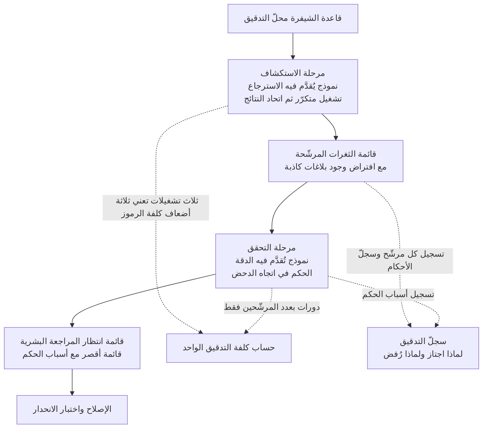

*الضوء الذي يمسح على اتساع والضوء الذي يُبيّن بوضوح ليسا الضوء نفسه.*

## لماذا تقرأ هذا

هذا المقال موجّه لمهندسي الأمن ومسؤولي المنصّات الذين يعتزمون ربط نماذج اللغة بمسار تدقيق أمني للشيفرة المصدرية. الخلاصة أولاً: في هذا المعيار لم يكن النموذج الأكثر عثوراً على الثغرات هو النموذج الأجدر بالثقة في بلاغاته، ولذلك فالسؤال العملي ليس أي نموذج هو الأفضل بل أي نموذج يوضع في أي مرحلة.

تصميم يختار نموذجاً واحداً ويوكل إليه التدقيق كلّه لا يصمد أمام هذه الأرقام. فاختيار النموذج الأعلى استرجاعاً يجلب معه البلاغات الكاذبة، واختيار الأعلى دقة يزيد ما يفوتك من ثغرات. فيما يلي نضع الأرقام المنشورة كما هي ونعرض كيف يُستوعب هذا التعارض في التصميم.

## نظرة عامة

نشر الباحث الأمني Philippe Dourassov في الثالث عشر من أغسطس نتيجة تشغيل DeepSeek V4 Pro 0813 على معيار الأمن السيبراني الخاص بفريقه. تفوّق هذا النموذج على جميع النماذج الأخرى في اكتشاف الثغرات. فقد أعاد اكتشاف 87.5% من ثغرات CVE المضمّنة في المعيار وفق مقياس pass@3، بينما سجّل Opus 5 وQwen 3.8 معاً 81.3% في الظروف نفسها.

الاقتباس إلى هنا يصنع خبراً نظيفاً عن مركز أول. لكن في الإعلان نفسه رقمين آخرين. فما كان صحيحاً فعلاً من الثغرات التي أبلغ عنها هذا النموذج لم يتجاوز 65.6%، وفي الدقة تقدّم GPT-5.6-Sol بنسبة 86.4%. أما على أساس التشغيل الواحد فيعثر النموذج على 58.3% من الثغرات في المتوسط.

وضع الأرقام الثلاثة معاً يغيّر الصورة كلياً. فعنوان 87.5% قيمة اتحاد ثلاث تشغيلات، والقيمة المتوقّعة عند تشغيل واحد تقارب ثلثيها، وثلث ما يأتي به ليس صحيحاً.

يجدر ذكر النموذج محلّ القياس أيضاً. فـ DeepSeek V4 Pro 0813 نسخة محدّثة صدرت رسمياً في الثاني عشر من أغسطس، ببنية Mixture-of-Experts تضمّ 1.6 تريليون معامل يُفعَّل منها 49B لكل رمز. أعلن المطوّر ارتفاع درجة Terminal Bench 2.1 من 72.1 إلى 87.9 وDeepSWE من 12.8 إلى 62.7، وارتفع مؤشر Artificial Analysis Intelligence Index الخارجي من 45 إلى 53. غير أن ثمة ملاحظات تدعو إلى تحقق مستقل من هذه الأرقام المعلَنة، وتفيد بعض التقارير بأن الأداء على المعايير العامة جاء دون التوقّعات. وفي هذا السياق تكتسب نتيجة المجال الأمني الصادرة عن طرف ثالث بمعياره الخاص وزناً مختلفاً، لأنها ليست مقياساً اختاره المطوّر.

*ينقلب المركز الأول بين مقياسي المعيار نفسه. ولا تعرض كل لوحة إلا النماذج التي نُشر لها ذلك المقياس.*

## ما الذي جرى قياسه

قبل تفسير الأرقام يجب الفصل بين ما يقيسه كل مؤشّر.

الاسترجاع ينظر إلى عدد ثغرات CVE الحقيقية المزروعة في المعيار التي عثر عليها النموذج مجدداً. وهو من منظور المدقّق نقيض الإغفال. فانخفاض هذه القيمة يعني بقاء ثغرات رغم إجراء التدقيق.

الدقة هي نسبة ما كان ثغرة فعلاً بين ما أبلغ عنه النموذج كثغرة. وانخفاض هذه القيمة يطيل قائمة المرشّحين التي يجب أن يراجعها إنسان. وقيمة 65.6% تعني أن بلاغاً من كل ثلاثة وهم، وكلما كبر نطاق التدقيق ازدادت هذه الكلفة خطياً.

ولا يمكن تجاوز شرط pass@3 أيضاً. فهو أسلوب يشغّل النموذج ثلاث مرات على الهدف نفسه ويُحتسب النجاح إن عثر عليه في إحداها. وكون متوسط التشغيل الواحد 58.3% بينما pass@3 يبلغ 87.5% يعني أن ما يُعثر عليه يختلف كثيراً بين تشغيل وآخر. وهذا التباين نفسه هو طبيعة هذا النموذج. وقد أوضح ناشر النتيجة أن هذا النموذج أكثر استكشافاً بكثير من غيره وأنه يتعمّق أكثر عند تفحّص وظائف بعينها. فهو يحفر عميقاً لكنه لا يحفر في الموضع نفسه في كل مرة.

ومن منظور التشغيل يترجم هذا الشرط إلى كلفة مباشرة. فالحصول فعلياً على 87.5% يستلزم ثلاث عمليات استدلال، وترتفع بذلك كلفة الرموز وزمن التدقيق. ففي جدول المعيار يشغل pass@3 خانة واحدة، أما في جدول الميزانية فثلاثة أضعاف.

وكِبَر التباين يعني بالمقابل أن عدد التشغيلات مقبض قابل للضبط. فالنموذج الذي يعثر على الشيء نفسه في كل مرة تتساوى نتيجته سواء شغّلته مرتين أو عشراً، وتكون الكلفة الإضافية هدراً خالصاً. أما النموذج الذي يحفر في مواضع مختلفة كل مرة فيتّسع اتحاد نتائجه كلما زاد العدد. والفارق بين 58.3% عند تشغيل واحد و87.5% عند ثلاثة دليل على ذلك. غير أن هذا التراكم يخفت عادة كلما تقدّمنا، فيجب قياس ما يضيفه التشغيلان الرابع والخامس على حدة. والمنشور لا يتضمّن سوى pass@1 وpass@3، فلا سبيل لمعرفة شكل ذلك المنحنى.

وعملياً يُستحسن ضبط هذا المقبض بحسب أهمية الهدف. فتزاد التشغيلات على وحدات مثل الدفع أو المصادقة حيث ثمن الثغرة الواحدة كبير، ويُكتفى بتشغيل واحد في المناطق كثيرة التغيير قليلة الخطورة. أما تطبيق العدد نفسه على كل الشيفرة فيخسر في الكلفة والإغفال معاً.

وأخيراً يجب تذكّر أن ما يقيسه هذا المعيار هو إعادة الاكتشاف. أي قدرة النموذج على العثور مجدداً على ثغرات سبق اكتشافها ومُنحت أرقام CVE. والغرض من التدقيق عملياً هو غالباً العثور على ثغرات لا يعرفها أحد بعد، فالمهمّتان ليستا متطابقتين تماماً. فالثغرات المعروفة أنماطها منتشرة في الوثائق العامة والرقع والمدوّنات التقنية، ويصعب استبعاد أن يكون النموذج قد رأى أثرها أثناء التدريب. ولا يصحّ الجزم بأن جودة إعادة الاكتشاف تستتبع قدرة مماثلة على كشف الثغرات غير المكتشفة بالنسبة نفسها.

ومع ذلك فالقياس ليس بلا معنى. فالنموذج العاجز حتى عن إعادة الاكتشاف يقلّ احتمال عثوره على ثغرة جديدة، فهو صالح كحدّ أدنى، وهو قبل ذلك كافٍ لترتيب عدّة نماذج في الظروف نفسها. وما يتناوله هذا المقال ليس المستوى المطلق بل الترتيب النسبي بين النماذج وانقلاب ذلك الترتيب بتغيّر المؤشّر.

## تصميم لا يحمّل نموذجاً واحداً الاسترجاع والدقة

حين تنقسم الأرقام هكذا يكون الحلّ تقسيم المسار لا اختيار النموذج. أي فصل مرحلة المسح الواسع عن مرحلة الترشيح، ووضع النموذج القوي في ذلك المؤشّر في كل مرحلة.

في مرحلة الاستكشاف يوضع النموذج عالي الاسترجاع. ولا ضير من اختلاط البلاغات الكاذبة. فغرض هذه المرحلة ألا يفوتها مرشّح، ونموذج استكشافي مثل DeepSeek V4 Pro 0813 مناسب لها فعلاً. وعند الحاجة يُشغَّل عدّة مرات على الهدف نفسه ويؤخذ اتحاد النتائج.

وفي مرحلة التحقق يوضع النموذج عالي الدقة. ويُطلب منه الحكم على كل مرشّح ورد من المرحلة السابقة في اتجاه دحض كونه ثغرة. وتكفي هذه المرحلة دورات بعدد المرشّحين فقط، فهي أرخص بكثير من إعادة مسح قاعدة الشيفرة كاملة.

وفي النهاية يراجع إنسان. فبعد المرحلتين تقصر القائمة الواصلة إليه، ويرافق كل بند سبب اجتيازه.

المهم في هذا البناء أن النموذجين يخفقان بطرق مختلفة. فاستخدام النموذج نفسه مرتين يمرّر النقطة العمياء نفسها مرتين. ويجب وضع نموذجين مختلفي الطبع في الاستكشاف والتحقق ليُرشَّح شيء فعلاً.

وما يُغفَل كثيراً عند تصميم مرحلة التحقق هو اتجاه السؤال. فإذا أُرسل المرشّح مع سؤال عمّا إذا كان ثغرة فعلاً، مال النموذج غالباً إلى الموافقة. ويزداد ذلك إذا تضمّن السياق أن المرحلة السابقة قد حكمت بأنه ثغرة وأرسلته. ولذلك يجب أن يُطلب من المحقّق الدحض. أي أن يشرح لماذا هذا البلاغ كاذب، ولا يُمرَّر إلا حين يعجز عن الدحض. فحتى النموذج الواحد تتغيّر نسبة تمريره بتغيّر اتجاه السؤال.

وعدم توريث المحقّق أسباب حكم المرحلة السابقة مهمّ للسبب نفسه. فإرسال شرح مطوّل لسبب حكم نموذج الاستكشاف يختزل دور المحقّق إلى تتبّع ذلك المنطق والتأكّد منه. والأفضل إرسال موقع المرشّح والشيفرة فقط وترك الحكم يُبنى من جديد حفاظاً على الاستقلال. فالغرض من فصل المرحلتين تلقّي حكمين لا اعتماد حكم واحد مرتين.

ويبقى أن نضيف أن هذا البناء لا يرفع الاسترجاع النهائي فوق استرجاع مرحلة الاستكشاف. فالتحقق يرشّح فقط، وما فات في البداية لا يعود في النهاية. ولذلك يهمّ وضع النموذج الأعلى استرجاعاً في مرحلة الاستكشاف، وصاحب هذا الموضع في هذا المعيار هو DeepSeek V4 Pro 0813. فعدم التماثل بين دقة يمكن استردادها لاحقاً واسترجاع لا يمكن استرداده هو ما يحدّد ترتيب الوضع.

## ما يعنيه هذا لـ ThakiCloud

تضع ThakiCloud منصة Paxis في المركز لأتمتة أعمال المؤسسات بالوكلاء، وتوفّر معها الاستدلال والبنية التحتية اللازمين للتنفيذ. والتدقيق الأمني عمل يناسب هذا البناء بوجه خاص.

من منظور Paxis، فإن مسار المرحلتين أعلاه هو بعينه تصميم لتنسيق الوكلاء. فـ Paxis يعامل المهارات والأدوات والسياسات كموارد من الدرجة الأولى ويمرّر كل فعل عبر بوابة سياسات وسجلّ تدقيق. وربط وكيل استكشاف ووكيل تحقق كلٍّ بنموذج مختلف، وترك قائمة المرشّحين وأسباب الأحكام في سجلّ التدقيق، يصير سلوكاً افتراضياً لا تنفيذاً منفصلاً. وهذا السجلّ في التدقيق الأمني ليس ميزة إضافية. فإن تعذّر لاحقاً تتبّع سبب إغفال ثغرة أو سبب رفض بلاغ، لا تقوم للتدقيق نفسه ثقة. كما أن إلزام مرحلة التحقق باتجاه الدحض بند يمكن تثبيته بالسياسة.

من منظور Aegis، يتّضح لماذا يجب أن يجري هذا العمل داخل المؤسسة. فمُدخل التدقيق الأمني هو الشيفرة المصدرية بأكملها، وهي غالباً أثمن أصول الشركة حساسية. وخيار تمرير قاعدة الشيفرة إلى واجهة برمجية خارجية لأجل التدقيق مستحيل من البداية في قطاعات المال والقطاع العام والدفاع. ولا يقوم هذا المسار إلا إذا أمكن تشغيل النموذج مباشرة داخل شبكة مغلقة، ولذلك يصبح شرط كون أوزان النموذج منشورة بأهمية أرقام الأداء نفسها.

ويكمل هذان المنظوران أحدهما الآخر. فقيد التشغيل داخل المؤسسة يعني أن النماذج القابلة للاستخدام تنحصر في المنشورة الأوزان، وأن يظهر ضمن هذه المجموعة الضيّقة نموذج في صدارة الاسترجاع هو القيمة العملية لهذه النتيجة. فالنموذج الذي لا يمكن تشغيله في شبكة مغلقة لا يدخل مسار تدقيق عميل مالي أو حكومي مهما ارتفعت درجاته. فجدول الأداء وجدول قابلية النشر جدولان مختلفان، وما يُستخدم عملياً هو تقاطعهما.

من منظور Metis، التحدّي هو تصميم الكلفة. فـ pass@3 يعني ثلاث عمليات استدلال، وكلفة تشغيل نموذج MoE يُفعَّل منه 49B من أصل 1.6 تريليون معامل ثلاث مرات ليست هيّنة. وبما أن Metis هو طبقة إدارة كلفة الرموز عبر توجيه النماذج والتكميم، يمكن توزيع غير متماثل: خفض مستوى التكميم في مرحلة الاستكشاف لتحتمل التكرار، ورفعه في مرحلة التحقق حفاظاً على الدقة. فلا داعي لاستخدام إعداد الخدمة نفسه في المرحلتين.

من منظور Signum، المسألة هي وجهة نتائج التدقيق. فقائمة الثغرات المرشّحة وسجلّ الأحكام معلومات حساسة بذاتها، ويجب أن يُسجَّل من اطّلع عليها ومتى وعلى ماذا. وإلحاق ضبط الوصول وأحداث التدقيق بمخرجات هذا المسار عمل يستحق الوزن نفسه الذي يستحقه بناء المسار.

## الحدود والاعتراضات

ثمة ما يجب ذكره تفادياً للمبالغة في تأويل هذه النتيجة.

أولاً وقبل كلّ شيء، إنه معيار واحد. نتيجة صادرة عن معيار لإعادة اكتشاف CVE بناه فريق بحثي واحد ولم تُعَد إنتاجها بشكل مستقل. ويمكن للترتيب أن يتغيّر تماماً بحسب أنواع الثغرات المضمّنة وطبيعة قاعدة الشيفرة. وعلى وجه الخصوص يصعب في تقييم إعادة الاكتشاف استبعاد احتمال أن تكون تلك الثغرات ضمن بيانات التدريب.

ثانياً، لا تزال ادّعاءات DeepSeek V4 Pro 0813 على المعايير المنشورة عموماً تنتظر تحققاً مستقلاً. فقد أعلن المطوّر ارتفاع Terminal Bench 2.1 من 72.1 إلى 87.9 وDeepSWE من 12.8 إلى 62.7، وارتفع مؤشر Artificial Analysis من 45 إلى 53. غير أن ثمة من يشير إلى الحاجة إلى تحقق خارجي من هذه الأرقام، وتفيد بعض التقارير بأن هذا النموذج جاء دون التوقّعات في المعايير العامة. ولا يصحّ نقل التفوّق في المجال الأمني إلى تفوّق في النموذج إجمالاً.

ثالثاً، إن كنت تدرس نشراً داخل المؤسسة فثمة بند يستوجب التحقق. فعائلة DeepSeek دأبت على نشر الأوزان برخصة MIT، لكن نشر أوزان نقطة التحقق 0813 غير مؤكّد في المستودع الرسمي. إذ يظهر في ذلك المستودع أوزان معاينة أبريل دون أي إيداع في أغسطس ودون وسم 0813. وتوجد نسخ GGUF حوّلها المجتمع، لكن معاملتها معاملة التوزيع الرسمي أمر محفوف بالمخاطر. فاحسم هذا البند قبل وضع خطة استضافة ذاتية.

رابعاً، هل نسبة دقة قدرها 65.6% محتملة عملياً سؤال يتوقّف على حجم التدقيق. فإن كان المرشّحون عشرات أمكن للإنسان ترشيحهم، وإن كانوا آلافاً جاء إرهاق الإنذارات أولاً. ومسار المرحلتين يخفّف هذه المشكلة ولا يزيلها بذاته.

خامساً، البناء المقترح في هذا المقال تصميم مستنتج من الأرقام أعلاه لا نتيجة قِسناها. فمقدار ارتفاع الدقة النهائية فعلياً عند فصل الاستكشاف عن التحقق يجب قياسه مباشرة على قاعدة الشيفرة المستهدفة.

## الخلاصة

ما خلّفه هذا المعيار ليس صدارة جديدة بل انقسام الصدارة إلى اثنتين. فـ DeepSeek V4 Pro 0813 كان الأفضل في العثور على الثغرات، وكان النموذج الأجدر بالثقة في بلاغاته نموذجاً آخر. ثم إن الرقم في العنوان اتحاد ثلاث تشغيلات ينزل إلى ثلثيه عند تشغيل واحد.

وبالعودة إلى سؤال المقدّمة، فإن اختيار نموذج واحد فقط في مسار التدقيق هو ذاته مسألة مصاغة صياغة خاطئة. فموضع المسح الواسع وموضع الترشيح يطلبان صفتين متعاكستين، ولا تقدّم هذه الأرقام أساساً لتوقّع أن يتقن نموذج واحد الموضعين معاً.

وإن اخترت إجراءً واحداً تالياً، فأحصِ نسبة البلاغات الكاذبة في مخرجات أداة التدقيق التي تستخدمها اليوم. فإن قاربت تلك القيمة 65.6% الواردة في هذا المعيار أو ساءت عنها، فإضافة مرحلة تحقق أولى من تبديل النموذج. فكلفة إضافة مرحلة أرخص عادة من كلفة تبديل نموذج.

## المصادر

- [منشور Philippe Dourassov بنتائج المعيار](https://x.com/pilvar222/status/2087691659953815783)
- [إطلاق DeepSeek نسخة V4 Pro المحسّنة وفتح مصدر برمجيات الوكيل، The Decoder](https://the-decoder.com/deepseek-launches-an-improved-v4-pro-model-raises-api-prices-and-makes-its-agent-software-open-source/)
- [الإطلاق الرسمي لـ DeepSeek V4 Pro 0813 وادّعاءات المعايير التي تنتظر التحقق، TechTimes](https://www.techtimes.com/articles/324241/20260813/deepseek-v4-pro-0813-goes-ga-benchmark-claims-await-independent-proof.htm)
- [تحليل مؤشرات DeepSeek V4 Pro، Artificial Analysis](https://artificialanalysis.ai/models/deepseek-v4-pro)
- [تقرير عن النسخة المحدّثة من DeepSeek V4 Pro، South China Morning Post](https://www.scmp.com/tech/big-tech/article/3363895/deepseeks-updated-v4-pro-ai-model-struggles-benchmarks-shines-cybersecurity)
