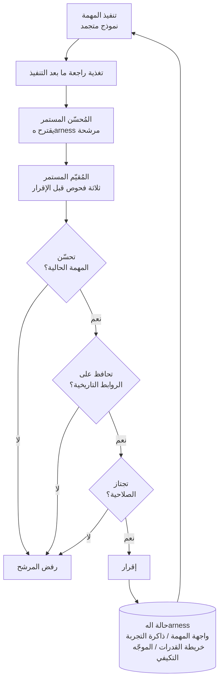

> 📄 **المراجعة المتعمقة الكاملة (DOCX)**: [نزّل المراجعة التفصيلية من Google Drive](https://drive.google.com/file/d/1rVrbakfFrzsAn6bIxcOzUdST8qiemxw5/view).

## لماذا تقرأ هذا

إذا كنت تشغّل وكلاء في بيئة إنتاجية وتتركهم يحدّثون مهاراتهم وذاكرتهم ومؤشراتهم وقواعد توجيههم بأنفسهم، فالمشكلة التي تعالجها هذه الورقة هي مشكلة نظامك غداً. 'Harness Continual Learning: Continual Adaptation Beyond Model Parameters' (arXiv 2608.19013)، من كتابة ستة باحثين في جامعة نانجينغ، ترمي نمط تعلم جديد تتطور فيه الهarness على تجارب متتابعة بينما لا تُلمس أوزان النموذج أبداً. الاستنتاج الجوهري أمامك: تحديث الهarness وحدها حول نموذج متجمد يمنح تحسينات نسبية تتجاوز 10% مقابل خطوط الأساس في عدة إعدادات، وتكلفة ذلك، النسيان على مستوى الهarness، قابلة للتحكم الصريح عبر التطور المُدار (فصل الترشيح عن الإقرار) زائد رقم واحد لسماحية الخسارة التاريخية.

## نظرة عامة

معظم أدبيات التعلم المستمر مركزة على النموذج. الحالة التي تتغير هي معلمات النموذج، تُحدّث الأوزان مع التجارب المتتابعة، ودرجة بقاء أداء المهام السابقة هي التي تعرف النسيان. لكن الوكلاء الحديثين يتكيفون خارج النموذج أيضاً. تُعدّل المؤشرات، تتراكم الذاكرة، تكبر قوائم الأدوات والمهارات، تتحول قواعد التوجيه. هذه المحتويات تشكّل التنفيذ اللاحق معاً، فحدوث تحديث في الهarness قد يعطل سلوكاً كان موثوقاً من قبل حتى مع نموذج متجمد.

الورقة تضع سؤالاً جديداً عند تلك النقطة: كيف تكمل تحسين الحالة خارج النموذج مع الاحتفاظ بالسلوك الذي اكتسبته سابقاً؟ HCL هي النمط المبني للإجابة عنه. الهarness تتطور حول نموذج أساس متجمد، وفقدان السلوك السابق الناتج عن ذلك يُسمى "النسيان على مستوى الهarness". التسمية هي أول مساهمة. حين كانت الهarness رقيقة، كان هذا النوع من الانحدار يُجمع تحت "النموذج نسي". الآن الشيء المتغير ليس النموذج، فيمكن نسب الانحدار إلى تحديثات الهarness وقياسه كذلك.

## ما الورقة

Treat HCL أربعة مكونات تواجه التنفيذ كحالة متطورة واحدة. واجهة المهمة (Task Interface) تحدد كيف يقرأ الوكيل المهمة والبيئة، ذاكرة التجربة (Experience Memory) تراكم تغذية راجعة ما بعد التنفيذ، خريطة القدرات (Capability Map) تفهرس الإجراءات القابلة لإعادة الاستخدام، والموجّه التكيفي (Adaptive Router) يقرر ما يُجمّع وكيف في التنفيذ التالي. الورقة تعامل هذه الأربعة كأصل واحد قابل للتغيير لا كأجهزة مستقلة، وتتتبع أي مكون يُعدّل عند وقوع فشل.

آلية التطور مصممة كفصل بين الترشيح والإقرار. بعد انتهاء التنفيذ، يقترح محسّن مستمر (Continual Optimizer) هarness مرشحة بناءً على التغذية الراجعة. الترشيح مرشح فقط. موقيع باستمرار (Continual Evaluator) يأمر المرشح بالحالة فقط بعد اجتياز ثلاثة فحوص. أولاً، هل يحسّن المهمة الحالية فعلاً. ثانياً، هل يحافظ على أداء مجموعة الروابط (anchor set) المحفوظة من الماضي والتي تم التحقق منها. ثالثاً، هل المرشح نفسه صالح. إذا فشل أي بوابة، يُرفض المرشح وتبقى الهarness على حالتها السابقة.

البوابة الثانية هي التي تحمل الوزن الحقيقي. سماحية الخسارة التاريخية، أي الحد الأقصى لانخفاض الأداء المقبول فوق مجموعة الروابط، موضوعة كمعلمة واحدة. ضعها عند صفر وتصبح القاعدة "احفظ كل رابط محلول حالياً"، فيقارب متوسط النسيان صفراً لكن التكيّف ينكمش بقوة. ادفعها إلى ما لا نهاية فيُقبل أكثر التحديثات جرأة، وتنمو الانحدارات على المهام السابقة. الورقة تؤكد عبر عدة تدفقات أن هذه المعيار الواحد يتيح اختيار نقطة التوازن بين الاستقرار اللدونة مقصوداً.

## البنية

حلقة التطور المُدار كاملة كمخطط. التنفيذ يقوم به النموذج المتجمد؛ التغيير يُمرَّر فقط إلى حالة الهarness.

مضغوطة في سطر: "افصل الجهة التي تتعلم عن الجهة التي تقبل، وضع فحص احتفاظ عند الجهة المقبلة". مهما كان إصلاح المُحسّن جيداً، إذا لم يعبر بوابات المُقيع الثلاث فلا تتغير حالة النظام. هذا الفصل نادر في أنظمة الوكلاء. عادةً التعلم والنشر مرتبطان في تدفق واحد، والرجوع يحدث بعد اكتشاف الانحدار فقط. HCL تنقل الرجوع من إجراء بعد الوقوع إلى شرط قبل الإقرار.

## النتائج (كما أوردتها الورقة)

كل الأرقام أدناه كما أوردتها الورقة؛ هذا المقال لا يعيدها بشكل مستقل. الإعداد ينقسم إلى أربعة مسارات حسب النموذج المتجمد. بيئات ALFWorld النصية تستخدم Qwen3.5-9B، ومنهج Minecraft وتدفق الوسائط المتعددة يستخدمان Qwen3.6-27B، وتدفق الاستدلال النصي يستخدم DeepSeek-V4-Flash، وتفكيك المكونات يستخدم Qwen3.5-4B. داخل كل إعداد، كل المقارنات تشارك النموذج نفسه.

مدى التطور يظهر أوضح في تجارب العالم المفتوح طويلة المدى.

| البيئة (النموذج المتجمد) | Static | RAG | MemP | MemRL | Stability-HCL | Plasticity-HCL |
|---|---|---|---|---|---|---|
| ALFWorld متوسط نهائي لست فئات (Qwen3.5-9B) | 47.12 | 55.56 | 53.15 | 51.51 | **61.74** (Fgt 2.64) | **62.98** (Fgt 10.94) |
| إتمام 50 مهمة في Minecraft (Qwen3.6-27B) | يتوقف عند 15 | - | 91 حركة | 88 حركة | **50/50، 83 حركة** | - |

ALFWorld يدرّب ست فئات بالتسلسل (Pick, Look, Clean, Heat, Cool, Two-object) ويُقيّم في نهاية الأمر على 134 حلقة تقييم رسمية. خطوط الأساس المعتمدة على الذاكرة (MemP, MemRL) ترفع فئات فردية لكنها تتفاوت بشدة عبر التدفق، وRAG تصطدم بسقف لأن الاسترجاع وحده لا يعدّل الإجراءات القابلة لإعادة الاستخدام ولا قواعد التوجيه. Plasticity-HCL حلت كل حلقات Two-object لكن حملت نسياناً 10.94؛ Stability-HCL بلغت 61.74 قريبة خلفها بينما خفّضت النسيان إلى 2.64. في Minecraft، توقفت الهarness الثابتة عند 15 مهمة بينما أكملت HCL الخمسين كلها، مستخدمة 83 حركة تراكمية في البيئة مقابل 88 لـMemRL و91 لـMemP. المنهج نفسه، حُلّ بحركات مهدرة أقل.

تجارب التدفق المضبوط تقيس سماحية b. تحت تخصيص مطابق بـ250 مثال للتكيف و50 للتحقق و500 للاختبار لكل مهمة، يُنفذ تدفق النص (MuSiQue, ProofWriter, GSM8K, HotpotQA) وتدفق الوسائط المتعددة (COCO detection, COCO captioning, RefCOCO grounding, VQAv2) بالتسلسل.

| التدفق (النموذج المتجمد) | Zero-shot | DGG | Stability-HCL | Plasticity-HCL |
|---|---|---|---|---|
| متوسط نهائي للاستدلال النصي (DeepSeek-V4-Flash) | 45.50 | - | 52.20 (Fgt 0.00) | **64.70** (Fgt 0.07) |
| متوسط نهائي للإدراك متعدد الوسائط (Qwen3.6-27B) | 39.40 | 42.73 (Fgt 0.26) | **68.92** (Fgt 0.22) | 67.96 (Fgt 0.81) |

في تدفق النص، رفع Plasticity-HCL المتوسط النهائي من 45.50 بدون تدريب إلى 64.70، أي تحسين نسبي يقارب 42%. في تدفق الوسائط المتعددة، تصدّت Stability-HCL المتوسط النهائي بـ68.92، وقفزت الفحص (detection) من 4.27 إلى 65.34. VQAv2 كانت الاستثناء الوحيد الذي بقي فيه Zero-shot أقوى، لأن النموذج المتجمد كان جيداً أصلاً في الإجابة المباشرة على أسئلة الصور. طريقة التعلم التسلسلي الحديثة DGG أيضاً خلف HCL. مسح b يبقى متسقاً في الاتجاه: مع تثبيت b عند 0 و1 و3 وما لا نهاية، يسير المتوسط النهائي 61.25 و63.46 و62.04 و60.13 بينما يصعد متوسط النسيان بشكل وحيد من 0.39 إلى 3.45. السماحية المتوسطة هي حيث يعيش توازن الأداء والنسيان.

لخصاً للتفكيك: تعطيل تحديثات ذاكرة التجربة أو واجهة المهمة ينتج أكبر انخفاضات في الأداء النهائي، وتجميد الذاكرة يرفع النسيان أيضاً إلى 0.83. الذاكرة المتطورة تدعم الاكتساب والاحتفاظ معاً. لكن الورقة صريحة: المتغيرات الأقل نسياناً في التفكيك ليست هarness أفضل، فهي تكيفت ببساطة أقل.

## ما يعني ذلك لـ ThakiCloud

مكان ملامسة الورقة لـPaxis مباشرةً هو السؤال: "هل الأصول الوكيلية التي تحدّث نفسها تمتلك بوابة إقرار؟" Paxis سحابة وكلاء تجعل المهارات والأدوات والسياسات وسجلات التدقيق موارد من الدرجة الأولى. المهارات تصعد بعد تسلسلات فشل، ملاحظات التغذية الراجعة تهبط كمهام تحسين، تعلم الجلسات يُوجَّه إلى الجلسة التالية كسجل ساخن. هذا البناء كله، حيث تتغير الهarness فقط، هو تحديث هarness على نمط HCL. أوزان النموذج تبقى ثابتة؛ ما يتغير هو أجسام المهارات والذاكرة وحالة التوجيه.

ترجمة التطور المُدار الذي رمّته الورقة إلى ممارسة Paxis تعطي ثلاثة بنود. أولاً، الفصل بين الترشيح والإقرار. مرشح تطور مهارة يولد كـ"ترشيح من تغذية راجعة التنفيذ"، ولا يبقى مرشحاً حتى يُقَر. الورقة تسمي البوابات الثلاث التي يجب أن يعبرها المرشح: تحسين الحالي، احتفاظ الروابط التاريخية، الصلاحية. ثانياً، اختبار الانحدار لفحص الاحتفاظ. الشرط "إذا تغيّرت هذه المهارة، فالمهام التي كانت تعمل يجب أن تكمل العمل" يمكن تنفيذه كمجموعة روابط تُنفَّذ فعلياً قبل الإقرار. هذا بالضبط ما هو 2.64 نسيان Stability-HCL على ALFWorld في جوهره. ثالثاً، السماحية رقماً. حدود تسلسل skill-retro لدينا ومعايير التصعيد تؤدي اليوم دور السماحية. HCL ترفع تلك السماحية إلى معيار لضبط مقصود لتجارة الاستقرار اللدونة. السؤال يتحول من "بعد كم فشل نصعّد" إلى "كم أداء سابق نتقبل خسره من أجل التطور".

وهناك عدسة ai-platform أيضاً. إذا بقي النموذج المُقدَّم في مكانه وتطورت أصول الوكيل وحدها، فبنية تكلفة الاستدانة وحمل إدارة إصدارات النموذج يبقى سليماً بينما سلوك الوكيل يكمل التحسن. تكلفة التعلم تنتقل من تحديث الأوزان إلى التحقق من أصول الهarness. تعلم مستمر لا يحرق وحدات معالجة رسومية. هذه هي اقتصاديات التنفيذ التي تفتحها HCL.

## الحدود والحجج المضادة

أولاً، محدودية مجموعة الروابط. حتى مع وضع السماحية عند صفر، الورقة تذكر نسياناً متبقياً 0.39 في تدفق النص. الروابط التي يجب الحفاظ عليها هي مجموعة تحقق محدودة، بينما يُقاس النسيان على اختبارات تاريخية منفصلة. "كل رابط محلول محفوظ" لا تضمن "كل سلوك سابق غير متغير". منطقة انحدار لا تغطيها بوابة الإقرار تبقى بنيوياً.

ثانياً، تكلفة تقييم الاحتفاظ. كل إقرار مرشح يتطلب تشغيل مجموعة الروابط فعلياً. الورقة تذكر هذا التكلفة كمشكلة مفتوحة في ختامها. كلما كبر الروابط وصارت البيئات غير حتمية، تصبح البوابة الثانية أكثر المراحل تكلفة. السقف العملي لـHCL سيقيد غالباً بـ"بأي رخص يمكنك إعادة التحقق من الماضي".

ثالثاً، نطاق التقييم يبقى داخل علامات مرجعية أكاديمية. ALFWorld وMinecraft وأسرة COCO وأسئلة الاستدلال. التحقق في بيئات تتناثر فيها الحالة وتكون الفشل غير قابل للعكس وصعبة فيها تعريف الروابط، وهي البيئات التي تكون فيها سير العمل المؤسسية فعلاً، لم يُفعل بعد. حالة VQAv2 التي كسبها Zero-shot أيضاً تظهر أن الهarness لا تكسب دائماً.

رابعاً، هل هذا النمط يحل محل التعلم المستمر المركزي على النموذج أو يكملها مسألة تجربة لا منطاقة. HCL تعالج التعلم "حين لا تلمس النموذج". في اللحظة التي ينزاح فيها المجال بسرعة تكفي لتبرير التدريب مجدداً، لتحديثات المعلمات مكانها. الورقة تضع HCL كمحور جديد، تعلم الحالة خارج النموذج، لا كبديل لتعلم النموذج.

## الخلاصة

في نظام تشغّل فيه وكلاء طويلاً، الشيء الذي يجب أن يتغير هو الهarness لا النموذج، وعندما تتغير الهarness يتمايل السلوك السابق. هذا متوقع. مساهمة الورقة هي ترميز هذا كنمط، وجعل الاحتفاظ بالسلوك السابق شرط إقرار عبر تطور مُدار يفصل الترشيح عن الإقرار، وإتاحة معيار سماحية واحد لضبط نقطة توازن الاستقرار اللدونة مقصوداً. التجارب تظهر أن هذا التصميم ينتج تراكم قدرات واستعادة من الفشل حتى مع نموذج متجمد، ويحول النسيان إلى كمية قابلة للقياس وضبطها.

المغزى لنا واضح. إذا كنت تشغّل مهارات وذاكرة وتوجيهاً تتطور ذاتياً، تحقق أولاً مما إذا كان ذلك التطور يملك بوابة "تحقق من الاحتفاظ السابق قبل الإقرار". ثم اجعل سماحية تلك البوابة قابلة للتعبير كرقم. تحديث هarness يمر بـ"سيكون على الأرجح بخير" سيُنتج يوماً ما أنعم انحدار على أقدم مهمة لديك. HCL هي الورقة التي سمّت ذلك الانحدار، وضعت الانحدار المسّمى خلف بوابة، وجعلت توتر تلك البوابة قابلاً للضبط بمعيار واحد.

## المصادر

- [arXiv 2608.19013: Harness Continual Learning: Continual Adaptation Beyond Model Parameters](https://arxiv.org/abs/2608.19013) (Borui Kang, Jinrui Gu, Junhan Lv, Wenbin Li, Lei Wang, Yang Gao. State Key Laboratory for Novel Software Technology, Nanjing University; University of Wollongong. v1, 2026-08-19, cs.LG/cs.AI)
- تغريدة التعريف: [@omarsar0 (elvis, D.AI)](https://x.com/hjguyhan/status/2090841745793982600)
- 📄 المراجعة المتعمقة الكاملة (DOCX): [نزّل من Google Drive](https://drive.google.com/file/d/1rVrbakfFrzsAn6bIxcOzUdST8qiemxw5/view)