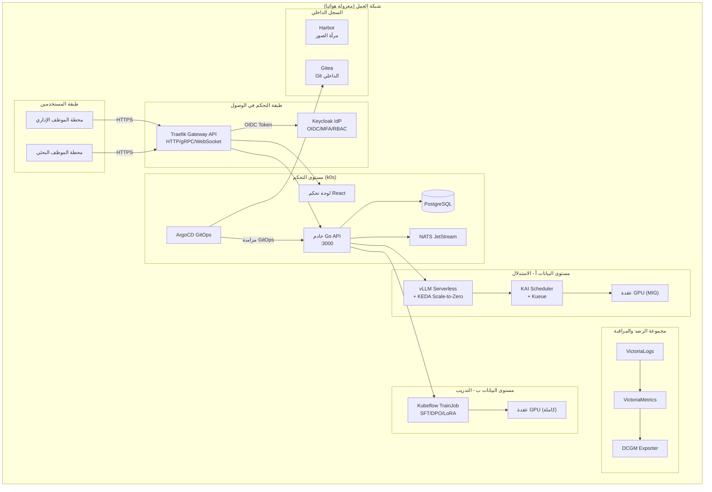

## نظرة عامة: لماذا يهم الذكاء الاصطناعي السيادي للقطاع العام الآن

منذ عام 2024، تسارعت نقاشات تبني الذكاء الاصطناعي التوليدي في المؤسسات الحكومية والجهات العامة الكورية. غير أن كثيرا من هذه المؤسسات تواجه عقبات جوهرية تحول دون استخدام خدمات نماذج اللغة الكبيرة التجارية المستضافة على السحابة العامة، وذلك بسبب متطلبات الأمان والأطر التشريعية النافذة. فمتطلبات مراقبة الأمن الصادرة عن جهاز الاستخبارات الوطني، والتزامات التخزين المحلي للبيانات بموجب قانون شبكات المعلومات والاتصالات وقانون حماية المعلومات الشخصية، فضلا عن سياسات العزل الشبكي الراسخة، تحول جميعها دون إمكانية إجراء طلبات API إلى جهات خارجية.

في هذا السياق، يتقارب مطلب "الاستفادة من الذكاء الاصطناعي دون السماح للبيانات بمغادرة المنشأة" نحو حل وحيد: تشغيل نماذج اللغة الكبيرة مباشرة على البنية التحتية الداخلية لوحدات معالجة الرسومات، وهو ما يُعرف بـ **الذكاء الاصطناعي السيادي (Sovereign AI)**.

ThakiCloud منصة SaaS للذكاء الاصطناعي والتعلم الآلي قائمة على Kubernetes، صُمِّمت لتدعم النشر الكامل في البيئات المحلية والمعزولة (Air-Gap). يعرض هذا المقال، من خلال حالة افتراضية لجهة حكومية، بنية مرجعية مفصلة لبناء خدمات نماذج اللغة الكبيرة بصورة آمنة في بيئة شبكية منفصلة.

---

## القيود التي تواجهها مؤسسات القطاع العام

### العزل الشبكي والفجوة الهوائية

السمة الأبرز لبيئات تكنولوجيا المعلومات في القطاع العام الكوري هي الفصل التام بين شبكة الإنترنت والشبكة الوظيفية الداخلية. وتتجاوز كثير من الجهات الفصل المنطقي لتشترط إعدادات عزل هوائي حيث تنقطع الشبكة فيزيائيا. في هذه الحالات، لا يمكن إجراء طلبات API للسحابة العامة فحسب، بل يصبح الوصول الخارجي إلى سجلات صور الحاويات (Container Registries) أمرا مستحيلا أيضا. يستلزم ذلك النسخ المسبق لجميع الصور والحزم اللازمة للنشر في سجل داخلي.

### متطلبات أمان جهاز الاستخبارات الوطني

يُلزم برنامج ضمان أمان الحوسبة السحابية (CSAP) وإرشادات مراقبة الأمن الصادرة عن جهاز الاستخبارات الوطني بالاحتفاظ بسجلات تدقيق لتاريخ الوصول إلى الأنظمة، وتطبيق المصادقة متعددة العوامل (MFA)، والتحكم في الوصول القائم على الأدوار (RBAC)، وتخزين جميع البيانات الحساسة داخل الأراضي الكورية. ونظرا لأن طلبات الاستدلال الموجهة إلى نماذج اللغة الكبيرة قد تتضمن محتوى استفسار يُصنَّف في حد ذاته معلومة حساسة، فإن نقاط نهاية الاستدلال (Inference Endpoints) تخضع هي الأخرى لنطاق هذه الضوابط.

### قيود الشبكة في البيئات المحلية

يفرض تصميم عناوين URL للخدمات في البيئات المحلية قيودا متميزة. فمن الثابت في هذا السياق أن بيئات الاشتغال المحلي كثيرا ما لا تتيح استخدام نطاقات DNS البديلة (Wildcard DNS) وشهادات SSL البديلة (Wildcard SSL) معا. لذا يتعين إما التحديد المسبق لمجموعة ثابتة من النطاقات الفرعية (مثل: `api.aiplatform.agency.go.kr`، `console.aiplatform.agency.go.kr`)، أو اعتماد نهج رقم المنفذ للتمييز بين الخدمات على اسم مضيف واحد. ينبغي أخذ هذه القيود بعين الاعتبار منذ مرحلة تصميم المنصة.

### إلزامية التخزين المحلي للبيانات

بموجب قانون إدارة البيانات العامة وقانون حماية المعلومات الشخصية، يجب تخزين البيانات التي تعالجها الجهات العامة على خوادم داخل كوريا الجنوبية. وقد يُعدّ إرسال استفسارات نماذج اللغة الكبيرة إلى مزودي السحابة العامة خارج البلاد انتهاكا لهذا الالتزام في حد ذاته.

---

## البنية المرجعية: تكوين النشر في البيئات المعزولة

فيما يلي بنية مرجعية لجهة حكومية مركزية افتراضية (أ) تنشر ThakiCloud AI Platform في بيئة معزولة هوائيا على البنية التحتية المحلية.

### المكونات الرئيسية

**الفصل بين مستوى التحكم ومستوى البيانات**

وفقا لوثائق ThakiCloud AI Platform (انظر البنية المنطقية لتقييم شركاء KSA)، تفصل المنصة بصرامة بين مستوى التحكم ومستوى البيانات. يتولى مستوى التحكم إدارة خدمات API والحالة ومنطق التنسيق، بينما يتولى مستوى البيانات تنفيذ أحمال عمل GPU وخدمة نقاط نهاية الاستدلال. يضمن هذا الفصل استمرار خدمات الاستدلال في مستوى البيانات دون انقطاع حتى خلال أعمال صيانة مستوى التحكم.

**السجل الداخلي للنشر في البيئات المعزولة**

في البيئات المنقطعة عن الإنترنت الخارجي، يجب إعداد سجل حاويات داخلي مثل Harbor ونسخ جميع صور الحاويات مسبقا. يُستخدم k0s، وهو أداة نشر خفيفة الوزن، بدلا من kubeadm القياسي لنشر مجموعات Kubernetes، مع دعم رسمي للتثبيت في البيئات المعزولة. يتيح الجمع بين مخططات Helm ونمط App-of-Apps في ArgoCD إدارة حالة المجموعة بأكملها بصورة تصريحية، مع اتخاذ مستودع Gitea الداخلي مصدرا وحيدا للحقيقة.

**الاستدلال بدون خادم عبر vLLM ومعدوم الحجم عند الخمول**

تُبنى أحمال عمل الاستدلال على vLLM وتُدمج مع KEDA (موسع أتوماتي تحرّكه الأحداث في Kubernetes) لتحقيق التوسع إلى الصفر (Scale-to-Zero). تُحرَّر موارد GPU في فترات الخمول وتتوسع تلقائيا عند ورود الطلبات، مما يتيح مشاركة موارد GPU المحدودة محليا بكفاءة.

---

## الأمان والحوكمة

### RBAC رباعي المستويات عبر Keycloak OIDC

توفر منصة ThakiCloud AI Platform هيكلا رباعي المستويات للتحكم في الوصول القائم على الأدوار يشمل: المنظمة، والمشروع، والمجموعة، والمستخدم، مع استخدام Keycloak موفرا للهوية (IdP). وفقا لوثائق واجهة الويب، يتوفر نظام لتعيين أدوار Admin وDeveloper وViewer مع دمج الأذونات القائم على خوارزمية Union+Deny، كما يتضمن رمز JWT معلومات المجموعة للتحقق الفوري من الأذونات.

في بيئات القطاع العام، يُعدّ العزل على مستوى المشروع بين الأقسام أمرا بالغ الأهمية. فحتى حين يشترك قسم التخطيط والتنسيق وقسم تكنولوجيا المعلومات في استخدام المنصة ذاتها، يُعزل تاريخ استفسارات كل قسم لنماذج اللغة الكبيرة وبيانات الضبط الدقيق على مستوى مساحة اسم المشروع (Project Namespace) لمنع أي تسرب بين الأقسام.

يمكن أن يستوفي إعداد المصادقة متعددة العوامل (MFA) في Keycloak متطلبات المصادقة المعززة الواردة في إرشادات مراقبة الأمن الصادرة عن جهاز الاستخبارات الوطني. كما يُدعم التكامل مع أنظمة الموارد البشرية أو Active Directory عبر اتحاد LDAP.

### ArgoCD GitOps وإدارة سجل التغييرات

تُدار جميع تغييرات تكوين المنصة على شكل مخططات Helm في مستودع Git داخلي، وتتولى ArgoCD مزامنتها مع المجموعة. يوفر نمط GitOps هذا سجل تدقيق كاملا عبر سجلات Git لمعرفة "من غيّر ماذا ومتى". كما يحول دون وقوع تغييرات ارتجالية عبر `kubectl apply` المباشر (انجراف التكوين)، مما يعزز موثوقية سجل التغييرات اللازم للاستجابة لمتطلبات التدقيق.

### سجلات التدقيق ومجموعة الرصد

تُجمَّع في VictoriaLogs جميع طلبات API الاستدلالية، وأحداث بدء وانتهاء مهام الضبط الدقيق، وتسجيلات دخول المستخدمين وأحداث تغيير الأذونات. يجمع DCGM Exporter بيانات تتبع GPU ويرسلها إلى VictoriaMetrics. ولأن جميع بيانات السجل تُخزَّن على خوادم داخلية، يتحقق الامتثال لإلزامية التخزين المحلي للبيانات بصورة تلقائية.

تحديدا لتلبية متطلبات الاحتفاظ بسجلات الوصول الواردة في إرشادات مراقبة الأمن لدى جهاز الاستخبارات الوطني، يضطلع خادم Python Admin API (FastAPI) بدور مجمع سجلات التدقيق بشكل منفصل. يخزّن هذا المكون -- المحدد صراحة في وثيقة البنية المنطقية لمستوى التحكم -- الجهة والوقت والمورد المستهدف ونتيجة كل طلب API في PostgreSQL، مع البث المتزامن إلى VictoriaLogs. تُضبط سجلات التدقيق وفق سياسة احتفاظ لا تقل عن ستة أشهر، قابلة للتعديل وفقا للوائح الداخلية للمؤسسة.

ميزة بارزة أخرى لمجموعة الرصد هي قابلية رؤية موارد GPU، إذ يجمع DCGM Exporter درجة حرارة GPU واستخدام الذاكرة ومعدل استغلال الحوسبة في الوقت الفعلي، ويعرضها على لوحة تحكم VictoriaMetrics. يُمكّن ذلك فرق التشغيل من اكتشاف التحميل الزائد على عقد GPU المحددة مبكرا واتخاذ إجراءات استباقية كإعادة توزيع أحمال العمل أو اتخاذ تدابير التبريد.

### استيفاء إلزامية التخزين المحلي للبيانات

بما أن جميع مكونات المنصة تعمل على خوادم داخل المؤسسة، لا تُرسَل أي بيانات -- بما فيها محتوى استفسارات نماذج اللغة الكبيرة -- إلى الخارج. كما تُخزَّن ملفات أوزان النماذج وتُدار في التخزين الداخلي (Longhorn أو NFS).

---

## دلالات تبني ThakiCloud AI Platform

### دعم كامل للبيئات المعزولة

صُمِّمت منصة ThakiCloud AI Platform منذ مرحلة التصميم الأولى لدعم البيئات المحلية والمعزولة. تتوفر وثيقة بنية منطقية للنشر السيادي السحابي في المملكة العربية السعودية (KSA)، وثمة مرجع لتشغيل المنصة بأكملها على مجموعة محلية بحتة تشمل خوادم عارية (Bare-Metal) وعقد GPU وشبكة InfiniBand. يتجاوز هذا مجرد "دعم التثبيت المحلي" ليمثل تكوينا كاملا للمكدس يتيح التشغيل المستقل دون أي اعتماد على السحابة العامة.

### ستة خطوط أنابيب للضبط الدقيق

كثيرا ما تحتاج مؤسسات القطاع العام إلى نماذج مضبوطة بدقة على وثائق وبيانات لوائح خاصة بالمؤسسة بدلا من نماذج اللغة الكبيرة للأغراض العامة. تدعم منصة ThakiCloud AI Platform ست طرق للضبط الدقيق -- SFT وDPO وGRPO وCPT وGKD وLoRA -- عبر Kubeflow TrainJob. يُشكّل توفير هذه الطرق المتنوعة ضمن منصة واحدة ميزة تنافسية مقارنة بالحلول المنافسة.

### كفاءة موارد GPU عبر Kueue ومجدول KAI

لا تستطيع مؤسسات القطاع العام ببساطة شراء وحدات GPU إضافية عند الطلب كما هو متاح في السحابة العامة. يغدو التوزيع العادل للموارد المحدودة عبر الأقسام أمرا بالغ الأهمية. يدعم Kueue ومجدول KAI المخصص قوائم الانتظار العادلة وجدولة العصابة (Gang Scheduling)، مع استرداد موارد GPU الخاملة لتحسين معدل الاستغلال (30-50% استرداد [تقديري] وفقا لعرض تقديمي للشركة). يتيح التقسيم المنطقي لوحدة GPU واحدة باستخدام MIG (Multi-Instance GPU) توزيعا أكثر دقة لطلبات الاستدلال الصغيرة.

### أساس تقني للامتثال لمتطلبات أمان جهاز الاستخبارات الوطني

يوفر Keycloak OIDC MFA والتحكم في الوصول الرباعي المستويات وسجل التغييرات القائم على ArgoCD وسجلات التدقيق في VictoriaLogs وتخزين أحداث التدقيق في PostgreSQL الأساس التقني للمتطلبات الجوهرية لإرشادات مراقبة الأمن لدى جهاز الاستخبارات الوطني. غير أن الحصول على شهادة CSAP يتطلب، إضافة إلى التكوين التقني، عناصر غير تقنية كالإجراءات التشغيلية والتوظيف والأمن المادي -- لذا لا تُحقَّق الشهادة تلقائيا بمجرد تبني المنصة. تمثل المنصة نقطة انطلاق تُوفي بمتطلبات الضوابط التقنية.

### الإدارة المركزية لمتعدد المجموعات

في حال وجود وزارات كبيرة أو جهات تابعة متعددة، تُتيح إمكانية الإدارة المركزية لمتعدد المجموعات القائمة على NATS وgRPC تشغيل مجموعات GPU الموزعة من لوحة تحكم واحدة. يتولى مدير ArgoCD إدارة متكاملة لحالة مزامنة GitOps عبر المجموعات، مما يُيسّر الحفاظ على تكوين موحد عند تشغيل مواقع متعددة.

---

## القيود واعتبارات التبني

### تكاليف البناء الأولية والكوادر المتخصصة

على خلاف SaaS للسحابة العامة، يستلزم النشر المحلي المعزول شراء خوادم مسبقا وتكوين الشبكة والحصول على موظفين داخليين أو شركاء يتمتعون بخبرة تشغيل Kubernetes. تحديدا، يتطلب نسخ الصور في البيئات المعزولة وإصدار شهادات TLS من CA داخلي عبر cert-manager وتصميم DNS الداخلي كوادر مهندسين ذوي خبرة.

### إدارة تحديثات النماذج وتصحيحات الأمان

في البيئات المعزولة، لا يمكن تنزيل إصدارات جديدة لنماذج اللغة الكبيرة أو تصحيحات أمان المنصة تلقائيا من مصادر خارجية. يجب وضع إجراءات دورية لنسخ الصور وعمليات التحقق من التغييرات مسبقا، مما ينتج عنه عبء تشغيلي مستمر.

### تسوية قيود DNS/SSL المحلية مسبقا

كما أشرنا، كثيرا ما لا تتيح البيئات المحلية استخدام DNS وSSL البديلَين (Wildcard). قبل تبني المنصة، يجب اتخاذ قرار بشأن مجموعة نطاقات فرعية ثابتة لكل خدمة أو اعتماد سياسة وصول قائمة على رقم المنفذ. يُصعّب تأخير هذا القرار إعادة هيكلة URL بعد النشر.

### شهادة CSAP تستدعي مبادرة مستقلة

رغم أن منصة ThakiCloud AI Platform توفر أساسا يستوفي متطلبات الضوابط التقنية، فإن الحصول على شهادة CSAP في حد ذاته عملية تقييم شاملة تتضمن عناصر غير تقنية كالإجراءات التشغيلية والأمن المادي وأمن الأفراد. إن كانت شهادة CSAP هي الهدف، فيُنصح بالتنسيق مع فريق أمن المعلومات في مؤسستك أو شريك استشاري متخصص لوضع خطة سعي مستقلة للحصول على الشهادة.

### يُوصى بالتبني التدريجي

بدلا من نشر المنصة بأكملها دفعة واحدة، يُعدّ الأكثر عملية البدء بخدمات نقطة نهاية الاستدلال ثم التوسع تدريجيا نحو الضبط الدقيق وخطوط أنابيب التعلم الآلي. نوصي باكتساب الخبرة التشغيلية ابتداء من مجموعة تجريبية صغيرة، ثم التوسع نحو تكوين متعدد المجموعات.

---

قد تبدو قيود العزل الشبكي والبيئات المعزولة كحواجز أمام تبني الذكاء الاصطناعي. غير أن هذه القيود توفر في الواقع حدودا واضحة من منظور السيادة على البيانات والأمان، ويمكن أن تكون فرصة لإدارة البنية التحتية الداخلية لـ GPU واستثمارها بصورة منهجية. منصة ThakiCloud AI Platform حل متكامل المكدس صُمِّم لهذه البيئة تحديدا، ويوفر الأساس التقني الذي يُمكّن مؤسسات القطاع العام من تشغيل الذكاء الاصطناعي السيادي بأمان وكفاءة.

إن كنت تدرس التبني، يُرجى التواصل مع فريق ThakiCloud التقني للحصول على دعم تصميم معماري مفصل يتناسب مع بيئة مؤسستك.
