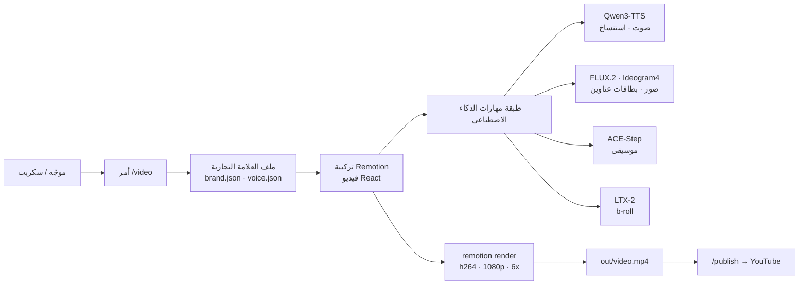

*خط إنتاج فيديو مؤتمت، مصوّر كجسيمات ضوء تتجمّع في إطارات منظّمة.*

## نظرة عامة

طالما تطلّب إنتاج الفيديو محرّرات مخصّصة ولمسة بشرية. لكن مؤخرًا ترسّخ نمط حيث يُوصَف الفيديو بالشيفرة ويُعرَض، تمامًا كما تكتب وكلاء البرمجة الشيفرة. يضع `digitalsamba/claude-code-video-toolkit` هذا النمط فوق Claude Code. عند إصداره يُظهر نحو 1.6 ألف نجمة على GitHub و268 تفريعة و182 إيداعًا، برخصة MIT.

الفكرة الأساسية بسيطة. تصف مشروع فيديو باستخدام Remotion، وهو إطار قائم على React؛ وتفوّض توليد الأصول مثل الصوت والصور والموسيقى ولقطات الـ b-roll إلى نماذج ذكاء اصطناعي مفتوحة المصدر؛ وتربط العملية كلها بأوامر الشرطة المائلة ومهارات Claude Code. ينشئ المستخدم مشروعًا من قالب بأمر `/video` واحد، ويهيّئ وحدة GPU السحابية والتخزين والصوت بأمر `/setup`، ثم ينتقل إلى العرض.

تشغّل ThakiCloud منصة SaaS للذكاء الاصطناعي والتعلّم الآلي قائمة على Kubernetes وتتعامل مع أحمال GPU يوميًا. عرض الفيديو وتركيب الأصول التوليدية مهام نموذجية مرتبطة بوحدة GPU، وفي بيئة متعددة المستأجرين فإن كيفية توزيع الموارد هي التكلفة نفسها. لذلك تستحق هذه الأداة القراءة لا كأداة محتوى فحسب، بل كمثال على نوع الحمل الذي تتعامل معه منصتنا. في هذه التدوينة أعرض أولًا ما حدث حين استنسخت الأداة وشغّلتها فعليًا، ثم أناقش معناها من منظور المنصة.

## ما هذه الأداة

تحوّل claude-code-video-toolkit بيئة Claude Code إلى محطة عمل لإنتاج الفيديو. من المفيد فهمها في ثلاث طبقات.

الأولى هي طبقة أوامر الشرطة المائلة. يرشدك `/setup` تفاعليًا عبر التهيئة الأولى مثل GPU السحابية ونقل الملفات والصوت. ينشئ `/video` المشاريع ويفتحها، ويساعد `/scene-review` في المراجعة مشهدًا مشهدًا داخل Remotion Studio. وإلى جانب ذلك توجد أوامر لكل مرحلة من مراحل الإنتاج: `/brand` و`/template` و`/generate-voiceover` و`/voice-clone` و`/redub` و`/record-demo` و`/publish` وغيرها. يرفع `/publish` الفيديو المكتمل إلى YouTube ويملأ البيانات الوصفية تلقائيًا من `project.json`.

الثانية هي طبقة المهارات. تجمّع هذه المعرفة المجالية كي يتعامل معها Claude Code بعمق: remotion (إطار فيديو قائم على React)، وelevenlabs (الصوت)، وffmpeg (معالجة الوسائط)، وplaywright-recording (تسجيل العروض في المتصفح)، وfrontend-design (التصميم البصري)، وqwen-edit (تحرير الصور)، وideogram4 (توليد صور بنص داخلي قوي)، وacestep (الموسيقى)، وltx2 (مقاطع فيديو مدفوعة بالنص والصورة)، وmoviepy (تركيب فيديو بلغة بايثون)، وrunpod (وحدة GPU سحابية)، بإجمالي إحدى عشرة مهارة.

الثالثة هي طبقة القوالب والعلامة التجارية. يتضمّن `templates/` قوالب sprint-review وsprint-review-v2 وproduct-demo وconcept-explainer-short للمقاطع العمودية بنسبة 9:16. ويعرّف `brands/` ملفات علامة تجارية تحمل الألوان والخطوط وإعدادات الصوت، وتُطبَّق تلقائيًا عند إنشاء مشروع بأمر `/video`. يوضّح المخطط أدناه كيف تتصل هذه الطبقات الثلاث في خط إنتاج واحد.



تبرز بنية التكلفة على نحو خاص. صُمّمت الأداة كي تعتمد الأصول التوليدية مثل الصوت (Qwen3-TTS) والصور (FLUX.2) والموسيقى (ACE-Step) على نماذج مفتوحة المصدر بدلًا من واجهات API تجارية. تنشر النماذج على حساب GPU السحابي الخاص بك وتشغّلها بسعر التكلفة. للتخزين تشير إلى الطبقة المجانية من Cloudflare R2 (10 غيغابايت، دون رسوم خروج)، وللحوسبة إلى خطة Modal Starter برصيد مجاني 30 دولارًا شهريًا. هذا الخيار القائم على الاستضافة الذاتية يتطابق تمامًا مع منظور المنصة الذي سنناقشه لاحقًا.

## التثبيت والتكامل

البدء السريع الموثّق كالتالي: استنساخ المستودع، وتثبيت اعتماديات بايثون اختياريًا، وفتح Claude Code.

```shell
git clone https://github.com/digitalsamba/claude-code-video-toolkit.git
cd claude-code-video-toolkit
python3 -m pip install -r tools/requirements.txt   # اختياري: التعليق الصوتي وتوليد الصور والموسيقى وأمثلة moviepy
claude                                              # تشغيل Claude Code داخل الأداة
```

ثم داخل Claude Code، تهيّئ GPU السحابية والتخزين والصوت تفاعليًا لنحو خمس دقائق بأمر `/setup`، وتنشئ مشروعك الأول بأمر `/video`. المتطلبات هي Node.js 18+ وClaude Code؛ ويُنصح ببايثون 3.9+ لأدوات الذكاء الاصطناعي. أما FFmpeg فاختياري.

الأهم هنا أن ثمة مسارًا منفصلًا للتحقق من العرض فورًا دون أي تهيئة. `examples/hello-world` مثال مصغّر لا يحتاج أي مفاتيح API. اتّبعت هذا المسار بالضبط وشغّلته فعليًا.

```shell
cd examples/hello-world
npm install
npm run render
```

بالنظر إلى `package.json` الخاص بـ `hello-world`، يكون سكربت العرض `npx remotion render src/index.ts SprintReview out/video.mp4`، والاعتماديات هي إصدار Remotion 4.0.425 وReact 18. أي إنه يحوّل تركيبة React مباشرة إلى فيديو دون أي استدعاءات نماذج خارجية.

## نتائج التجربة الفعلية

أجريت التحقق داخل شجرة عمل git معزولة، وكل رقم مأخوذ مباشرة من سجل التشغيل. كانت البيئة Apple Silicon (arm64) وNode.js 24.1.0 وnpm 11.3.0.

أولًا، تثبيت الاعتماديات. أضاف `npm install` نحو 230 حزمة واستغرق قرابة 3.5 ثانية. لكن التدقيق أبلغ عن 10 ثغرات (7 متوسطة و3 عالية)، وهو ما أعود إليه في قسم القيود.

في خطوة العرض، ينزّل Remotion مرة واحدة عند التشغيل الأول Chrome Headless Shell. في هذا التشغيل نزّل نحو 90.2 ميجابايت، وهي تكلفة لمرة واحدة. ثم تلت ذلك عملية التجميع والتركيب. كانت التركيبة `SprintReview`، والترميز h264، والتزامن 6x، وعرض كامل الإطارات البالغة 750 إطارًا. ترك السجل الملاحظة "Cached bundle. Subsequent renders will be faster"، موضحًا أن عمليات العرض اللاحقة أسرع بفضل ذاكرة التجميع المؤقتة.

من حالة باردة، بلغ الزمن الفعلي لأمر `npm run render`، شاملًا التنزيل والتجميع والعرض والترميز، 18.4 ثانية. كان الناتج النهائي فيديو h264 بدقة 1920x1080 و30 إطارًا في الثانية وطول 25.0 ثانية وحجم 2.15 ميجابايت (2,152,829 بايت)، متضمنًا مسار صوت AAC. لم يُستخدم أي مفتاح API على الإطلاق.


*الزمن الفعلي لكل مرحلة في خط عرض hello-world بدقة 1080p، مقاسًا دون أي مفاتيح API.*

باختصار، ودون أي تهيئة منفصلة، صار فيديو 1080p واحد في متناول اليد خلال نحو 30 ثانية من الاستنساخ. كان ذلك أسرع حتى من وصف المثال "يُعرَض في دقيقتين"، لكن بما أن هذا يتفاوت بحسب العتاد وظروف الشبكة فلا ينبغي اعتبار الرقم مطلقًا. المهم أن حاجز الدخول منخفض إلى هذا الحد.

## التطبيق على منصة ThakiCloud السحابية للذكاء الاصطناعي على Kubernetes

تكمن جاذبية هذه الأداة في أنها تشبه بنيويًا الأحمال التي تتعامل معها منصتنا. عرض الفيديو وتركيب الأصول التوليدية كلاهما مهام دفعية مرتبطة بوحدة GPU، بنمط استخدام الموارد في دفعات قصيرة وكثيفة قبل العودة إلى الخمول. تصفّ ThakiCloud مهام GPU وتمنحها الأولوية باستخدام Kueue فوق Kubernetes وتخدم النماذج عبر vLLM وغيره. إن الاستمرارية اللاخادمية بأسلوب Modal/Daytona التي توصي بها الأداة، حيث تدخل البيئة في سبات عند الخمول وتستيقظ عند الطلب، تحل المشكلة نفسها لكفاءة الموارد التي نسعى إليها عبر Kueue، لكن في طبقة مختلفة.

النقاط الجديرة بالإبراز هي التكلفة والاستضافة الذاتية. صُمّمت الأداة لتشغيل نماذج مفتوحة الأوزان مثل Qwen3-TTS وFLUX.2 وACE-Step على وحدة GPU الخاصة بك بسعر التكلفة بدلًا من واجهات API تجارية. يتوافق هذا تمامًا مع توجّه ThakiCloud في اعتبار التشغيل المحلي والاستضافة الذاتية نقاط قوة. حين يرغب عميل في تشغيل أحمال توليدية متعددة المستأجرين في بيئة عالية الأمان دون إرسال بيانات أو نماذج إلى الخارج، يمكن لمنصتنا أن تستوعب بطبيعتها خط إنتاج الفيديو والوسائط هذا أيضًا.

زاوية الاستخدام الداخلي واضحة كذلك. قالبا sprint-review وproduct-demo من المخرجات التي تنتجها فرق الهندسة بشكل متكرر. وإذا غلّفت هذا التوليد للفيديو كمهام Kubernetes ووضعتها في طابور Kueue، أمكنك نقل العرض الثقيل من حواسيب المطورين المحمولة إلى مجمّع GPU مشترك يُعالج بحسب الأولوية. كون الأداة نفسها مرتبطة بـ Claude Code قيدٌ، لكن فصل مرحلة عرض Remotion وحدها وتحويلها إلى حاوية يجعل وضعها على بنيتنا الدفعية أمرًا مباشرًا.

## القيود والاعتراضات

ثمة نقاط ضعف واضحة إلى جانب نقاط القوة. أولًا، أمان الاعتماديات. حتى `npm install` للمثال المصغّر أبلغ عن 10 ثغرات (منها 3 عالية). لطرحها في الإنتاج تحتاج أولًا إلى تدقيق الاعتماديات وتثبيتها، والأأمن فرض ذلك كبوابة في خط الأتمتة لديك.

ثانيًا، نطاق كلمة "مجاني". ما يعمل فورًا دون مفاتيح API هو العرض القائم على القوالب. ولاستخدام الأصول التوليدية مثل الصوت والصور والموسيقى وb-roll، عليك في النهاية نشر النماذج على وحدة GPU السحابية الخاصة بك، ومن تلك اللحظة تظهر تكلفة الحوسبة وعبء التشغيل. "مجاني" تعني التشغيل بنفسك بسعر التكلفة، لا أن لا تكلفة هناك.

ثالثًا، الارتباط بالأداة. يرتبط سير العمل هذا ارتباطًا وثيقًا بـ Claude Code. وبقدر ما تكون تجريدات أوامر الشرطة المائلة والمهارات مريحة، ثمة جانب من الاعتماد على بيئة وكيل بعينها. لحسن الحظ يتولّى العرض الأساسي إطار Remotion المستقل، فإذا لزم الأمر يمكنك فصل ذلك الجزء ونقله إلى تنسيق آخر.

رابعًا، يصف Remotion الفيديو بلغة React. وقد يكون هذا حاجزًا للمصممين وغير المطورين، كما أن التعامل مع رسوميات الحركة المعقّدة بالشيفرة قد يستلزم جهدًا أكبر من محرّر مخصّص. في النهاية تناسب هذه الأداة أكثر الفرق المعتادة على التعامل مع الفيديو بالشيفرة.

خلاصة القول، يُعدّ claude-code-video-toolkit نقطة انطلاق جيدة لأتمتة الفيديو الصديقة للشيفرة. تجربة إنتاج فيديو 1080p خلال 30 ثانية دون مفاتيح API نقطة قوة واضحة، وفلسفته القائمة على النماذج مفتوحة المصدر والاستضافة الذاتية تتوافق جيدًا مع توجّه منصتنا. ومع ذلك، تحتاج إلى موازنة التكلفة الحقيقية لمرحلة الأصول التوليدية وأمان الاعتماديات والارتباط بالأداة معًا للوصول إلى حكم متوازن.

## المصادر

- GitHub: [digitalsamba/claude-code-video-toolkit](https://github.com/digitalsamba/claude-code-video-toolkit)
- Remotion: [remotion.dev](https://www.remotion.dev/)
- بيئة الاختبار: Apple Silicon (arm64)، Node.js 24.1.0، npm 11.3.0 / جميع الأرقام مستخرجة مباشرة من سجلات التشغيل.
