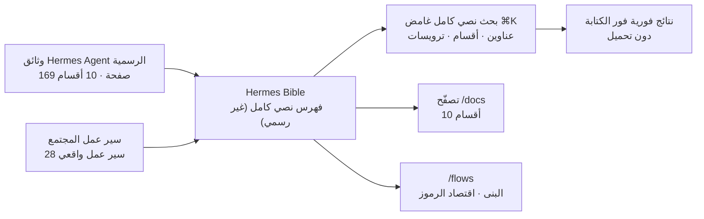

*بحث مفهرس، مصوّر كعقد مستندات كثيرة تتقارب نحو نقطة مضيئة واحدة.*

## نظرة عامة

كلما ازداد إطار الوكيل قوة، ازدادت وثائقه عرقلةً على نحو متناقض. فمع نمو الميزات بسرعة تنتفخ صفحات الوثائق إلى المئات، ويصبح العثور على السطر الذي تحتاجه فعلًا أصعب فأصعب. وHermes Agent الذي أطلقته Nous Research في فبراير 2026 ليس استثناءً. فالوثائق الرسمية منظّمة جيدًا لكنها ضخمة، وفوق ذلك تتناثر المعرفة العملية التي يتشاركها المجتمع على X (تويتر) وغيره.

`Hermes Bible` (hermesbible.com) موقع مجتمعي غير رسمي يواجه هذه المشكلة مباشرة. يفهرس كل صفحة من وثائق Hermes Agent الرسمية إلى جانب سير عمل واقعية بناها المجتمع في مكان واحد، ويوفّر بحثًا نصيًا كاملًا بضغطة مفتاح واحدة. ويذكر الموقع نفسه بوضوح أنه "غير رسمي، من بناء المجتمع، وغير تابع لـ Nous Research".

تشغّل ThakiCloud منصة SaaS للذكاء الاصطناعي والتعلّم الآلي قائمة على Kubernetes، وتتعامل داخليًا مع أكثر من 1000 مهارة والعديد من قواعد التشغيل. لذا فإن سؤال "كيف تجعل كمًّا هائلًا من معرفة الوكلاء قابلًا للبحث" شاغل يومي لنا أيضًا. في هذه التدوينة نطّلع على ما يحتويه Hermes Bible وكيف، وكيف يختلف عن الوثائق الرسمية، وانعكاساته من منظور منصتنا.

## ما هذا الموقع

الوظيفة الأساسية لـ Hermes Bible هي الفهرسة والبحث. يحتوي الموقع على 169 صفحة من وثائق Hermes Agent مقسّمة إلى 10 أقسام: Getting Started (6 صفحات تشمل التثبيت والبدء السريع ومسار التعلّم)، وCore Features (45 صفحة تشمل نظرة عامة على الميزات والأدوات ونظام المهارات والمنسّق)، وMessaging Platforms (30 صفحة تشمل بوابة المراسلة وتيليجرام وديسكورد وسلاك)، وSecrets (صفحتان)، وSkills، وUsing Hermes (15 صفحة تشمل CLI وTUI والإعداد وتهيئة النماذج)، وغيرها.

يُستدعى البحث بضغطة ⌘K، وهو بحث نصي كامل غامض يمسح كل عنوان صفحة وقسم وترويسة. ووفقًا للموقع تظهر النتائج فور الكتابة دون تحميل أو انتظار. والهدف هو تجربة العثور على الموضع الدقيق في وثائق ضخمة خلال ثوانٍ بكلمة مفتاحية واحدة. يوضّح المخطط أدناه كيف يوحّد الموقع الوثائق الرسمية وسير عمل المجتمع في سطح بحث واحد.

عامل التمييز هو مكتبة Flows. فإلى جانب الوثائق الرسمية، تجمع 28 سير عمل واقعيًا لأتمتة متعددة الوكلاء بناها المجتمع فعلًا. ويُنظَّم كل سير عمل بحيث يمكنك البحث فيه ودراسته وتكييفه، شاملًا البنية الكاملة واقتصاد الرموز وأنماط التنسيق. فمثلًا تقدّم إحدى المقالات لوحة Hermes (localhost:9119) التي "لا يتحدث عنها أحد لكنني أفتحها كل يوم" بوصفها سطح تشغيل للحفاظ على صحة وكيل يعمل على مدار الساعة، وتغطي Sessions وMCP وSkills وCron وAnalytics وLogs وSystem. وأخرى بعنوان "المستويات الخمسة عشر لاستخدام Hermes Agent" تعرض كل شيء من أول موجّه بضربة واحدة إلى أتمتة عمل تجاري عبر ملفات متعددة، مع اقتصاد الرموز، وتذكر أنها جرى التحقق منها مقابل Hermes Agent v0.17.0.

للمرجع، Hermes Agent نفسه مشروع برخصة MIT من Nous Research، يُظهر نحو 200 ألف نجمة على GitHub و35.7 ألف تفريعة وأكثر من 12 ألف إيداع حتى كتابة هذه السطور. ويعلن عن "حلقة تعلّم مغلقة" يصنع فيها الوكيل مهارات من التجربة ويحسّنها أثناء الاستخدام ويبني نموذجًا للمستخدم عبر الجلسات. ويمكن النظر إلى Hermes Bible بوصفه استجابة المجتمع لمواكبة هذا المشروع السريع التطوّر.

## انعكاسات من منظور منصة ThakiCloud

النظر إلى Hermes Bible لا كموقع بحث فحسب بل كنمط يجعله درسًا مباشرًا لنا. تشغّل ThakiCloud داخليًا أكثر من 1000 مهارة وقاعدة تشغيل، وهي بالضبط المشكلة نفسها لـ "قابلية بحث المعرفة الهائلة" التي تواجهها وثائق Hermes Agent. وفي الواقع تمتلك منصتنا بالفعل بوابة بحث مهارات قائمة على BM25 تُبرز المرشحين في كل دورة عمل. ويوضّح بحث ⌘K النصي الفوري في Hermes Bible جيدًا، من جانب تجربة المستخدم، الطرح نفسه القائل إنه "كلما نمت المعرفة، صار البحث إنتاجية".

مفهوم Flows مثير للاهتمام بوجه خاص. فإذا كانت الوثائق الرسمية تشرح الميزات، فإن Flows تتشارك وصفات عملية تنسج تلك الميزات معًا، مكتملة بالبنية واقتصاد الرموز. وهذه هي الفكرة نفسها لـ ThakiCloud في معاملة المهارات والقواعد بوصفها "منتجات قدرة مغلّفة مع حالات الفشل والمزالق والهياكل المتحقَّق منها". فحين تراكم المعرفة كسير عمل قابل لإعادة الاستخدام يربط المدخل والمعالجة والمخرج والتعافي من الأخطاء بدلًا من موجّهات مفردة، تتضاعف قيمة البحث والمشاركة أخيرًا.

ثمة نقطة تماس تشغيلية أيضًا. فكما تجمع لوحة Hermes بين Sessions وCron وSkills وAnalytics وLogs في شاشة واحدة لإدارة وكيل يعمل على مدار الساعة، نصمّم نحن كذلك التشغيل نحو جعل الحلقات غير المراقَبة والمهام المجدولة مرئية عبر سجلّ مركزي. ففي نظام وكلاء سريع التطوّر، تُعدّ رؤية "ما الذي يعمل الآن وما الذي يقرؤه ويكتبه" بنظرة واحدة شرطًا أساسيًا للتشغيل المستقر.

## القيود والاعتراضات

أوضح القيود أنه غير رسمي. فـ Hermes Bible مشروع مجتمعي غير تابع لـ Nous Research، لذا لا ضمان بأن المحتوى المفهرس يطابق دائمًا أحدث الوثائق الرسمية. وHermes Agent مشروع سريع الحركة بأكثر من 12 ألف إيداع. والفهرس غير الرسمي يتأخّر بطبيعته، وخاصة في مجالات مثل الإعداد الحسّاس أمنيًا أو إدارة الأسرار يجب أن تعامل الوثائق الرسمية بوصفها المرجع النهائي.

ثانيًا، عليك مراعاة أن الوثائق الرسمية توفّر بالفعل نقاط دخول صديقة للآلة. إذ تقدّم وثائق Hermes Agent الرسمية ملف `/llms.txt` (نحو 17 كيلوبايت) الذي يفهرس كل صفحة بوصف قصير، وملف `/llms-full.txt` (نحو 1.8 ميجابايت) الذي يدمج كل شيء في ملف واحد. ولتحميل الوثائق دفعةً واحدة في نموذج لغوي كبير، يكون هذا المسار الرسمي أكثر موثوقية واستقرارًا. أي إن قوة Hermes Bible تكمن خالصةً في تجربة بحث الإنسان بسرعة وتصفّح سير عمل المجتمع.

ثالثًا، ثمة خطر عام من الاعتماد الخارجي. فإذا جذبت مدونة شركة أو وثيقة تشغيل موقعًا من طرف ثالث إلى مسارها الأساسي، فقد تنكسر الروابط حين يختفي ذلك الموقع أو يغيّر وجهته. والأفضل استخدام Hermes Bible كأداة مساعدة للاكتشاف والتعلّم، ولا يصح معاملته كمصدر الحقيقة الوحيد لعملياتنا الداخلية.

خلاصة القول، يُعدّ Hermes Bible أصلًا مجتمعيًا متقنًا يساعد الناس على مواكبة معرفة إطار وكيل سريع التطوّر. ومع ذلك، تحتاج إلى توازن الإقرار بتأخّره غير الرسمي المتأصل واعتماده الخارجي مع إبقاء الوثائق الرسمية نقطةً مرجعية. وقبل كل شيء، فإن النمط الذي يجسّده، "اجعل معرفة الوكلاء الهائلة قابلة للبحث، وقابلة للمشاركة كسير عمل عملي"، هو أثمن انعكاس لمنصة مثل منصتنا تشغّل مهارات وقواعد واسعة النطاق.

## المصادر

- Hermes Bible: [hermesbible.com](https://www.hermesbible.com/)
- Hermes Agent (Nous Research): [github.com/NousResearch/hermes-agent](https://github.com/NousResearch/hermes-agent)
- الوثائق الرسمية: [hermes-agent.nousresearch.com/docs](https://hermes-agent.nousresearch.com/docs/)
