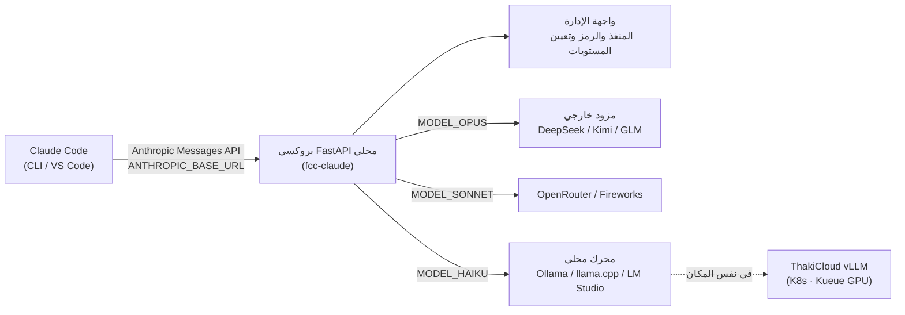

## نظرة عامة

في الأيام القليلة الماضية، اجتاحت منصات التواصل الاجتماعي موجة من التدوينات التي تتحدث عن "مستودع GitHub يتيح استخدام Claude Code مجاناً إلى الأبد". بمجرد تجاوز هذا العنوان المثير والنظر في الحقيقة، يتضح أن هذا ليس اختراقاً مجانياً، بل هو **بروكسي يُوجّه حركة بيانات النموذج في وكيل الترميز**. بالتحديد، يعترض مستودع `Alishahryar1/free-claude-code` طلبات Anthropic Messages API الصادرة من واجهة سطر أوامر Claude Code وامتداد VS Code، ويُعيد توجيهها محلياً نحو مزودين خارجيين كـ DeepSeek وKimi وQwen وGLM (Z.ai) وFireworks، أو نحو محركات محلية مثل Ollama وllama.cpp وLM Studio.

السبب الذي يجعل هذا الموضوع جديراً بالنشر على مدونة ThakiCloud ليس "المجانية". السبب الحقيقي هو أن وكيل الترميز لم يعد مقيداً بمورّد نموذج بعينه، بل **بات بإمكانه العمل فوق نماذج مفتوحة الأوزان يتحكم فيها العميل مباشرة**. من منظور منصة SaaS للذكاء الاصطناعي والتعلم الآلي المبنية على Kubernetes، التي تضع السيادة على البيانات والاستضافة الداخلية في صميم قيمها، يكشف هذا النمط من البروكسي أكثر المسارات واقعية لتشغيل وكيل ترميز فوق النماذج التي نخدمها عبر vLLM.

في هذا المقال، نتخلى عن إطار "المجانية"، ونحلل البنية التقنية الفعلية للبروكسي وآلية إعداده، ثم نستعرض بصدق كيف يمكن تطبيق هذا النمط على منصتنا وما تكتنفه من حدود ومخاطر.

## ما هذه الأداة؟

جوهر free-claude-code بسيط. يتيح Claude Code تغيير نقطة نهاية API عبر متغير البيئة `ANTHROPIC_BASE_URL`. تستغل هذه الأداة تلك الإمكانية بتشغيل **بروكسي FastAPI** صغير محلياً، ثم تُعيد توجيه طلبات Claude Code نحوه. يستقبل البروكسي الطلبات الواردة بصيغة Anthropic Messages ويحوّلها إلى صيغة المزود المستهدف، ثم يُعيد الاستجابات بصيغة Anthropic مجدداً.

بمعنى آخر، يعتقد العميل (Claude Code) أنه يتواصل مع Anthropic، غير أن الاستدلال الفعلي يُنجزه نموذج مختلف كلياً. تظل بروتوكول العميل على حاله دون أي تعديل على Claude Code ذاته. يُعدّ هذا "البروكسي المتوافق بروتوكولياً" النمطَ الذي تشترك فيه أدوات من قبيل claude-code-router، وقد أضاف free-claude-code فوق ذلك واجهة إدارة وعدة إعدادات مسبقة للمزودين.

المزودون المدعومون هم من يستخدمون أسلوب إرسال متوافقاً مع Anthropic Messages، وتشمل القائمة المُعلنة في README: OpenRouter وDeepSeek وKimi (Moonshot) وFireworks AI وZ.ai (عائلة GLM)، إضافة إلى المحركات المحلية: LM Studio وllama.cpp وOllama. لكل مزود عنوان URL لقائمة النماذج واتفاقيات إرسال تختلف قليلاً، يمتص البروكسي تلك الفوارق.

أبرز ما يميز هذه الأداة هو **التوجيه متعدد المستويات**. يميّز Claude Code داخلياً بين ثلاثة مستويات، هي Opus وSonnet وHaiku، ويستدعي كلاً منها لأغراض مختلفة: Opus للاستدلال الثقيل، وSonnet للمهام العامة، وHaiku للمهام الخفيفة. تتيح واجهة إدارة free-claude-code تعيين `MODEL_OPUS` و`MODEL_SONNET` و`MODEL_HAIKU` لمزودين ونماذج مختلفة. يمكن مثلاً توجيه المهام الثقيلة نحو نموذج استدلال DeepSeek، والمهام الخفيفة نحو نموذج صغير في Ollama المحلي، مما يُتيح فصل التكاليف عن الأداء. هذا المبدأ بالذات يتطابق مع مبدأ توجيه الوكلاء الفرعيين بين Haiku وSonnet وOpus الذي نعتمده.

## البنية التقنية: أين يعترض البروكسي الطلبات؟

يسير التدفق الكامل على النحو التالي: تدير واجهة الإدارة إعدادات البروكسي، وتُعيد تشغيل الخادم عند تغيير الإعداد أثناء التشغيل. يقرأ مُشغِّل `fcc-claude` في كل مرة يُستدعى فيها المنفذَ الحالي ورمز المصادقة اللذين تديرهما واجهة الإدارة. إذا تُركت مصادقة البروكسي فارغة، يُحقن المُشغِّل `ANTHROPIC_AUTH_TOKEN=fcc-no-auth` فحسب لاجتياز فحص تسجيل الدخول المحلي لـ Claude Code، ويتعامل البروكسي مع المصادقة الفارغة باعتبارها معطّلة.

يوضح المخطط التالي أين تُعترض الطلبات:



المحور الأساسي هو طبقة التحويل. تتبع الطلبات الصادرة من Claude Code مخطط Anthropic Messages (موجه النظام ومصفوفة messages وكتل tool_use وغيرها). حين يكون المستهدف نموذجاً كـ DeepSeek أو Qwen يستخدم تنسيق OpenAI المتوافق أو تنسيقاً خاصاً به، يتعين على البروكسي تعيين بنية الرسائل واتفاقيات استدعاء الأدوات لذلك التنسيق. إذا فشل هذا التعيين، تتعطل استدعاءات الأدوات (تحرير الملفات وتنفيذ الأوامر وهي الوظائف الأساسية في Claude Code) بصمت. تكشف المشكلات المسجّلة في متعقب المشكلات حالاتٍ تجاهل فيها Claude Code في إصدارات بعينها متغير `ANTHROPIC_BASE_URL` أو رُفض الاتصال فيها، مما يكشف أن طبقة التحويل وتوافق الإصدارات هما الحلقة الأضعف في هذا النمط.

## التثبيت والتكامل

يسير تدفق التثبيت الذي يصفه README العام على النحو التالي: استنساخ المستودع، وتهيئة النموذج المراد استخدامه، وحل تعارضات المنافذ الشائعة، ثم الحصول على مُشغِّل موحد (`claude.bat` أو `fcc-claude`) يمكن إسقاطه في أي مجلد مشروع لتشغيل Claude Code فوراً. يبدو التدفق المفاهيمي على هذا النحو:

```bash
# 1) استنساخ المستودع
git clone https://github.com/Alishahryar1/free-claude-code.git
cd free-claude-code

# 2) تشغيل البروكسي + واجهة الإدارة (خادم FastAPI محلي)
#    يُعيَّن مفتاح API الخاص بالمزود والنماذج لكل مستوى عبر واجهة الإدارة.
#    مثال: MODEL_OPUS=deepseek/..., MODEL_SONNET=..., MODEL_HAIKU=ollama/...

# 3) تعيين متغيرات البيئة لتوجيه Claude Code نحو البروكسي المحلي
export ANTHROPIC_BASE_URL="http://127.0.0.1:<المنفذ_الذي_تديره_واجهة_الإدارة>"
export ANTHROPIC_AUTH_TOKEN="fcc-no-auth"   # لاجتياز تسجيل الدخول المحلي عند تعطيل المصادقة

# 4) تشغيل Claude Code كالمعتاد - الاستدلال يُنجزه النموذج الموجَّه إليه
claude
```

أكثر ما يستوقفنا من منظور الاستضافة الذاتية هو التكامل مع المحركات المحلية. يضرب README مثلاً بـ llama.cpp، حيث يُحتفظ بـ `LLAMACPP_BASE_URL` في واجهة الإدارة أو يُحدَّث، ثم يُعيَّن `MODEL` إلى صيغة اسم نموذج محلي بادئة `llamacpp/`. يمكن بالأسلوب ذاته الإشارة إلى نقاط نهاية Ollama وLM Studio. خطوة واحدة إضافية تكفي لاستبدال تلك النقاط المحلية بـ **نقطة نهاية متوافقة مع OpenAI نُخدِّمها عبر vLLM فوق K8s**.

> إفصاح صريح: لم نتمكن في البيئة التي كُتب فيها هذا المقال، بسبب قيود مفاتيح API للمزودين الخارجيين وقيود البيئة المعزولة، من توجيه جلسة ترميز كاملة وقياس أرقام التأخير والتكلفة. لذا لن تجد في قسم "التجربة" أدناه أرقام أداء مختلقة. ما تحققنا منه هو بنية المستودع وقائمة المزودين وآلية الإعداد وأنماط الفشل المعروفة المستخرجة من المشكلات المُعلنة.

## ما تحققنا منه وما لم نتحقق منه

الوقائع التي تحققنا منها: أولاً، هذه الأداة ليست اختراقاً مجانياً، بل هي بروكسي متوافق مع Anthropic Messages API ولا تُعدِّل Claude Code ذاته. ثانياً، تتضمن مجموعة المزودين محركات محلية (Ollama وllama.cpp وLM Studio)، مما يتيح إعداداً للاستضافة الذاتية الكاملة دون الحاجة إلى مزودين خارجيين. ثالثاً، يمكن توجيه مستويات Opus وSonnet وHaiku بصورة مستقلة نحو نماذج مختلفة.

ما لم نتحقق منه هو الجودة والتأخير في أعباء عمل الترميز الفعلية. مدى التزام النماذج مفتوحة الأوزان باتفاقيات استدعاء أدوات Claude Code، واستقرار إدارة السياق في حلقات الوكيل الطويلة، يتوقفان كثيراً على جودة النموذج وطبقة التحويل. أرقام من قبيل "أكثر من 20,000 مستخدم" التي يذكرها بعض التقارير مصدرها مصادر ثانوية (تغريدات تعريفية) وهي [تقديري] وليست قيماً مُتحقَّقاً منها مباشرة.

## التطبيق على منصة ThakiCloud للذكاء الاصطناعي على K8s والدلالات

الجانب الذي يمنح هذا النمط معناه بالنسبة إلى منصتنا واضح. يُعدّ وكيل الترميز من أقوى حالات استخدام نماذج اللغة الكبيرة، غير أنه يتعامل في الوقت ذاته مع أكثر البيانات حساسيةً (الكود المصدري والإعدادات الداخلية والأسرار). لا تُجيز عملاء القطاعات المُنظَّمة والقطاع العام خروجَ هذه البيانات إلى مورّدي نماذج خارجيين. يعالج نمط البروكسي هذه المشكلة بدقة: يواصل العميل استخدام Claude Code الذي اعتاده، فيما يُنجز الاستدلال نموذجٌ يعمل داخل حدود العميل.

حين نُسقط هذا على منظومة ThakiCloud، يبدو الإعداد كالتالي: تُجدوِل Kueue موارد GPU، ويُخدِّم vLLM النماذج مفتوحة الأوزان (كنماذج عائلة Qwen وعائلة DeepSeek) عبر نقطة نهاية متوافقة مع OpenAI، وأمامها بروكسي متوافق كـ free-claude-code يُوجِّه حركة بيانات Claude Code الخاصة بالمطورين الداخليين نحو تلك النقطة. في البيئات متعددة المستأجرين، يمكن تعيين نماذج ومستويات عزل مختلفة لكل مستأجر. توجيه المهام الثقيلة كإعادة الهيكلة نحو النماذج الكبيرة، والمهام اليومية الروتينية نحو نماذج أصغر، يُخفِّض تكاليف GPU مباشرة.

ما يستحق الإشارة هو أن هذا لا يستلزم بنية تحتية جديدة. خدمة vLLM والعزل متعدد المستأجرين فوق K8s وجدولة GPU المبنية على Kueue هي مكونات أساسية قائمة في المنصة. إضافة طبقة بروكسي واحدة تكفي لتكتمل زاوية منتجية هي "وكيل الترميز الذي يعمل داخل حدود العميل". إنه إعداد يُوفِّق في آن واحد بين الاستضافة الداخلية والكفاءة التكلفية والسيادة على البيانات، وهو نقطة بيع مباشرة للعملاء الذين لا يستطيعون إرسال الكود إلى واجهات API لنماذج خارجية.

## الحدود والاعتراضات

لا مجال للتفاؤل المحض. أكبر ثغرة هي فجوة الجودة. سلوك الوكيل في Claude Code مضبوط بما يتوافق مع قدرات استخدام الأدوات في نماذج Anthropic. التوجيه نحو نماذج مفتوحة الأوزان قد يُخفِّض دقة استدعاء الأدوات واتساق السياقات الطويلة ومعدل نجاح المهام المعقدة متعددة الخطوات. إذا عجزت طبقة التحويل عن استيعاب الفوارق الدقيقة في اتفاقيات استدعاء الأدوات، فستفشل عمليات تحرير الملفات أو تنفيذ الأوامر بصمت. وكما تُبيّن المشكلات المُعلنة، يظل توافق الإصدارات عبئاً صيانياً دائماً.

الاعتراض الثاني يتعلق بالحوكمة. تبنّي أداة تنتشر بإطار "المجانية" كمعيار مؤسسي يُنشئ مسرباً جديداً لتسرب الكود الداخلي نحو مزودين خارجيين مجانيين. القيمة الحقيقية لهذا النمط لا تتحقق بأمان إلا حين يكون التوجيه نحو **نقاط نهاية مستضافة ذاتياً** لا نحو مزودين خارجيين مجانيين. بمعنى آخر، ينبغي أن يكون التوجه "نحو نموذجنا" لا "مجاناً".

الاعتراض الثالث يخص تراخيص الموردين وشروط الاستخدام. مهما كان المزود الذي يُوجَّه إليه الطلب، تسري شروط استخدامه، وتوظيف الأداة للتحايل على شروط عميل ما يُفضي إلى إشكاليات قانونية وأخلاقية مستقلة. إذا أرادت ThakiCloud تحويل هذا النمط إلى منتج، فيجب أن يستهدف بوضوح النماذج مفتوحة الأوزان المرخصة ترخيصاً مشروعاً ونقاط النهاية التي نُخدِّمها بأنفسنا.

خلاصة القول، free-claude-code أكثر فائدة حين يُقرأ بوصفه **نمط بروكسي يفصل طبقة النموذج عن العميل في وكيل الترميز**، لا بوصفه "Claude Code مجاناً". ذلك الفصل بالذات هو ما يُتيح الاستضافة الذاتية والسيادة على البيانات وتوجيه التكاليف، وهو تحديداً المجال الذي تتفوق فيه ThakiCloud.

## المصادر

- free-claude-code (Alishahryar1): [https://github.com/Alishahryar1/free-claude-code](https://github.com/Alishahryar1/free-claude-code)
- free-claude-code README: [https://github.com/Alishahryar1/free-claude-code/blob/main/README.md](https://github.com/Alishahryar1/free-claude-code/blob/main/README.md)
