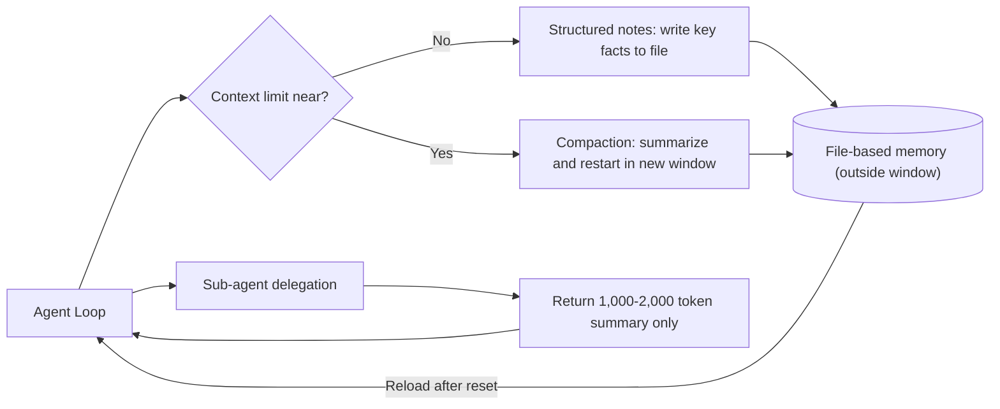

كل من شغّل وكلاء نماذج اللغة الكبيرة لفترات طويلة يصطدم بالعقبة ذاتها: كلما امتد الحوار، بدأ الوكيل ينسى التزاماته السابقة ويتجاهل القواعد التي حُددت في البداية. الحل الشائع هو "نافذة سياق أكبر تحل المشكلة"، لكن هذا التشخيص خاطئ. المشكلة الحقيقية ليست في حجم النافذة، بل في كيفية إدارة الرموز داخلها - وهذا هو جوهر هندسة السياق. يستعرض هذا المقال أربع تقنيات مُثبتة تساعد الوكلاء طويلي الأمد على تجاوز حدود السياق، مع توضيح كيف دمجتها ThakiCloud في تشغيل وكلائها الفعلي.

## نظرة عامة

هندسة السياق هي الخطوة التالية بعد هندسة التلقين. إذا ركزت هندسة التلقين على ما يُكتب، فإن هندسة السياق تُعنى بتحديد أي الرموز ينبغي ملء ميزانية الانتباه المحدودة للنموذج بها لحظة الاستدلال. يشمل ذلك كل شيء: تعليمات النظام، وتعريفات الأدوات، وبروتوكول MCP، والبيانات الخارجية، وسجل الرسائل بأكمله. يولّد الوكيل بيانات جديدة في كل تكرار للحلقة، وتلك المعلومات تحتاج إلى تنقية دورية.

لماذا نوفر الرموز؟ تماما كالإنسان، يفقد النموذج اللغوي الكبير تركيزه بعد نقطة معينة. ويُسمى التراجع في قدرة النموذج على الاسترجاع الدقيق مع زيادة عدد الرموز بـ"تلف السياق"، وهو يظهر في جميع النماذج بدرجات متفاوتة. السبب الجذري هو بنية المحول: كل رمز ينتبه إلى كل رمز آخر، فتكون العلاقات بين n رمزاً بمقدار n تربيع. كلما طال السياق، تمددت ميزانية الانتباه وخفّت. لهذا يجب التعامل مع السياق باعتباره موردا محدودا لا مستودعا لا نهائيا. الهدف هو إيجاد الحد الأدنى من الرموز عالية الإشارة الأكثر قدرة على إنتاج النتيجة المطلوبة.

## بنية مشكلة ذاكرة الوكيل

تتطلب المهام طويلة الأمد الحفاظ على التماسك والتوجه نحو الهدف عبر سلسلة من الإجراءات تتجاوز بكثير نافذة السياق - كترحيل قواعد الكود الضخمة أو جلسات البحث الممتدة لساعات. مجرد تكديس كل شيء في النافذة ينهار تحت وطأة تلف السياق. الحل هو نقل المعلومات خارج النافذة واسترجاعها فقط عند الحاجة. يوضح المخطط التالي هيكل هذا النهج.



هدف هذا الهيكل بسيط: عزل سياق العمل التفصيلي خارج النافذة، والإبقاء داخل نافذة الوكيل الرئيسي فقط على الرموز عالية الإشارة اللازمة لاتخاذ القرارات.

## التقنيات الأربع

### الضغط

الضغط هو تلخيص نافذة السياق حين تقترب من حدودها، ثم إعادة تشغيل نافذة جديدة بدءا من ذلك الملخص. هذا هو الرافعة الأولى لتحسين التماسك على المدى البعيد. المفتاح هو الملخص عالي الدقة: الضغط الكثيف لمحتوى النافذة يتيح للوكيل مواصلة العمل بأدنى قدر من تدهور الأداء. يطبّق Claude Code هذا النهج مثلا بتمرير سجل الرسائل إلى النموذج لتلخيص أهم التفاصيل وضغطها. إذا تم الضغط بصورة صحيحة، يواصل الوكيل عمله دون انقطاع يُذكر.

### تدوين الملاحظات المنظم

يعني تدوين الملاحظات المنظم أن يكتب الوكيل المعلومات الجوهرية في ملف خارج نافذة السياق أثناء العمل، ثم يعود لقراءتها لاحقا. حتى بعد إعادة ضبط السياق، يقرأ الوكيل ملاحظاته ويستأنف مهمة استغرقت ساعات من حيث توقفت. هذا التماسك العابر لعمليات إعادة الضبط يجعل الاستراتيجيات طويلة المدى ممكنة دون الحاجة إلى الاحتفاظ بكل شيء في النافذة في آن واحد. المبدأ مشابه لتدوين شخص ملاحظات خلال اجتماع، ثم استرجاع السياق منها في الاجتماع التالي.

### معمارية الوكلاء الفرعيين

الوكلاء الفرعيون هم مسار آخر للتحايل على حدود السياق. بدلا من أن يحمل وكيل واحد حالة المشروع بأكملها، يتولى وكلاء فرعيون متخصصون مهاما ضيقة بنوافذ سياق نظيفة. يتولى الوكيل الرئيسي التنسيق على مستوى عالٍ، بينما ينفذ الوكلاء الفرعيون العمل التقني العميق أو الاستكشاف. يمكن لكل وكيل فرعي استخدام عشرات الآلاف من الرموز في استكشاف واسع النطاق، لكنه لا يعيد إلى الوكيل الرئيسي إلا ملخصا منقحا يتراوح بين 1,000 و 2,000 رمز. يبقى سياق الاستكشاف التفصيلي معزولا داخل الوكيل الفرعي، وتظل نافذة الوكيل الرئيسي نظيفة ومركزة على اتخاذ القرارات.

### أدوات الذاكرة المستندة إلى الملفات

بالتزامن مع إطلاق Sonnet 4.5، أتاحت Anthropic أدوات ذاكرة مستندة إلى الملفات بوصفها نسخة تجريبية عامة على منصة Claude للمطورين. تستخدم هذه الأدوات نظام الملفات لتخزين المعلومات خارج نافذة السياق واسترجاعها بسهولة لاحقا. بفضلها، يستطيع الوكيل بناء قاعدة معرفية بمرور الوقت، والحفاظ على حالة المشروع عبر جلسات متعددة، والرجوع إلى العمل السابق دون الاحتفاظ بكل شيء في النافذة. إن كانت التقنيات الثلاث السابقة مبادئ، فهذه الأداة هي تنفيذ تلك المبادئ في واجهة موحدة.

## المقارنة مع الأساليب الأبسط

لإدراك قيمة هذه التقنيات، من المفيد مقارنتها بالبدائل الشائعة. البديل الأول هو حشو كل شيء في نافذة سياق كبيرة: بسيط، لكنه ينهار تحت تلف السياق، وإعادة قراءة السجل الضخم كاملا في كل دورة يجعل التكاليف تنمو بصورة خطية. البديل الثاني هو RAG المبني على البحث الاتجاهي: قوي في جلب المعرفة الخارجية، لكنه غير ملائم لمعالجة الحالة التي ينشئها الوكيل ذاته أثناء العمل - القرارات الوسيطة، والتقدم المحرز، والملاحظات الذاتية. RAG مُحسَّن للقراءة لا للكتابة والتحديث.

تسد الذاكرة المستندة إلى الملفات والملاحظات المنظمة هذه الثغرة، لأنها توفر مخزنا للحالة يستطيع الوكيل الكتابة فيه والتحديث منه والقراءة منه بعد إعادة الضبط. مبدأ مكمل هو الاسترجاع في الوقت المناسب: بدلا من تحميل كل المعلومات في النافذة مسبقا، يحتفظ الوكيل بمعرّفات خفيفة فقط - مسارات الملفات، وإدخالات الفهرس - ولا يقرأ المحتوى الكامل إلا عند الحاجة الفعلية. الضغط والملاحظات والوكلاء الفرعيون والاسترجاع في الوقت المناسب لا تتعارض بل تتعاضد وتتقوى معا.

## كيف تطبّق ThakiCloud هذه التقنيات

هذه التقنيات الأربع ليست نظرية مجردة؛ فهي تشكل العمود الفقري للعمليات اليومية لوكلاء ThakiCloud. تنفذ منصتنا الداخلية معمارية ذاكرة مستندة إلى الملفات بثلاث طبقات: فهرس `MEMORY.md` يُحمَّل في كل جلسة ويحتوي على مؤشرات من سطر واحد، وتفاصيل الوقائع في `memory/topics/`، وسجلات العمل الطويلة في `memory/sessions/`. تحميل الفهرس وحده في السياق وسحب التفاصيل عند الطلب هو بالضبط دمج تدوين الملاحظات المنظم والذاكرة المستندة إلى الملفات والاسترجاع في الوقت المناسب.

يبدو الفهرس تقريبا كمجموعة مؤشرات أحادية السطر:

```markdown
- [Model Routing](feedback_model_routing.md) - sub-agent model stacking: low-cost for exploration, mid-tier for implementation, high-cost for architecture
- [Hermes Ecosystem](project_hermes_ecosystem.md) - installation record for the standalone agent framework
```

يحتوي كل إدخال على حقيقة واحدة في ملف واحد، مع روابط إلى ملفات ذاكرة أخرى داخل المحتوى. تقرأ الجلسة هذا الفهرس فقط، وتفتح محتوى أي إدخال ذي صلة في اللحظة التي يصبح فيها ضروريا. عند ظهور حقائق جديدة، تُحدَّث الملفات الموجودة. تُحذف الذكريات التي يتبين خطؤها. هذه الصيانة الدورية تمنع الملاحظات الفاسدة من الانتشار.

التفويض إلى وكلاء فرعيين يسير بالمنهج ذاته. المسح الشامل لقواعد الكود أو عمليات البحث الضخمة لا تُنفَّذ في السياق الرئيسي؛ بل تُفوَّض إلى وكيل فرعي بنموذج منخفض التكلفة يعيد ملخصا للاستنتاجات فحسب. عدم إغراق السياق الرئيسي بالمخرجات الخام يتطابق تماما مع ما أوصت به Anthropic: "يعيد الوكيل الفرعي ملخصا من 1,000 إلى 2,000 رمز فقط." هذا يمنع تكاليف إعادة قراءة ذاكرة التخزين المؤقت من النمو الخطي.

الضغط متأصل أيضا في الانضباط التشغيلي. نحافظ على استخدام السياق أقل من 40% ونوصي بتشغيل الضغط اليدوي قبل بلوغ 60%. الضغط بتركيز مقصود قبل تفعيل الضغط التلقائي يُنتج دقة أعلى. في بيئة متعددة المستأجرين، هذه ليست مسألة جودة فحسب بل مسألة تكلفة أيضا. إعادة قراءة سياق ضخم في كل دورة تجعل رموز ذاكرة التخزين المؤقت تشكل جزءا كبيرا من إجمالي التكلفة. التعامل مع السياق كمورد محدود هو الطريق إلى خفض تكلفة الاستدلال لكل وحدة.

من منظور المنصة، تُعد ذاكرة الوكيل كفاءة أساسية تحتاجها ThakiCloud لتشغيل وكلاء طويلي الأمد لعملاء متعددين بشكل موثوق على بنية تحتية مشتركة. الوكيل الذي يحافظ على حالته عبر جلسات مع إبقاء سياقه خفيفا هو في حد ذاته منتج قابل للنشر. القدرة على عزل طبقة الذاكرة هذه لكل مستأجر على منصة Kubernetes متعددة المستأجرين تمثل ميزة تنافسية محورية في ما نقدمه.

## القيود والاعتراضات

لكل تقنية تكاليفها. الضغط يفقد معلومات في مرحلة التلخيص؛ اختيار ما يُحذف بصورة خاطئة قد يُعطل العمل اللاحق. التلخيص عالي الدقة مشكلة صعبة في حد ذاتها، وتعتمد النتائج اعتمادا كبيرا على جودة تلقين التلخيص.

الملاحظات المنظمة والذاكرة المستندة إلى الملفات تنشر الفساد حين تكون الملاحظات خاطئة. حقيقة مكتوبة بصورة غلط في ملف تُعامَل كحقيقة من قِبل كل جلسة لاحقة. لهذا يلزم وجود بوابة لما يُكتب في الذاكرة، مع صيانة دورية لحذف الوقائع القديمة.

تصبح الوكلاء الفرعيون عبئا حين تُرسم حدود التفويض بصورة خاطئة. تفويض تعديلات الملف الواحد أو الاستعلامات البسيطة إلى وكيل فرعي يضيف تكاليف إرسال بدلا من توفير السياق. التفويض أداة لنظافة السياق الرئيسي، لا الخيار الافتراضي لكل مهمة.

أخيرا، يجب الاعتراف بصدق بأن تحسن النماذج يقلل الحاجة إلى هذه الوصفات. النماذج الأقوى أصلا تُظهر قدرا أكبر من الاستقلالية مع هندسة أقل تقييدا. ومع ذلك، سيبقى مبدأ التعامل مع السياق كمورد محدود حتى مع تطور القدرات. قد تتغير التقنيات، لكن توجه الحفاظ على ميزانية الانتباه يظل صالحا.

## المصادر

- Anthropic، "الهندسة الفعّالة للسياق في وكلاء الذكاء الاصطناعي" (2025-09-29): [https://www.anthropic.com/engineering/effective-context-engineering-for-ai-agents](https://www.anthropic.com/engineering/effective-context-engineering-for-ai-agents)
- Anthropic، كتيب إدارة الذاكرة والسياق: [https://platform.claude.com/cookbook/tool-use-memory-cookbook](https://platform.claude.com/cookbook/tool-use-memory-cookbook)
