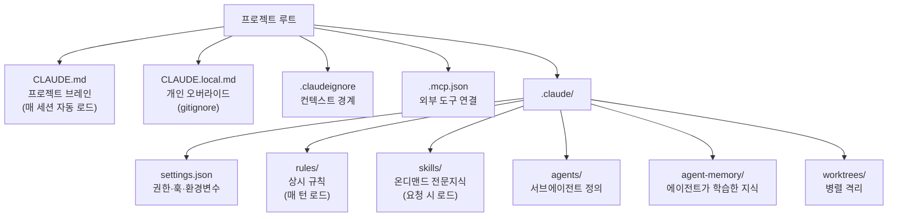
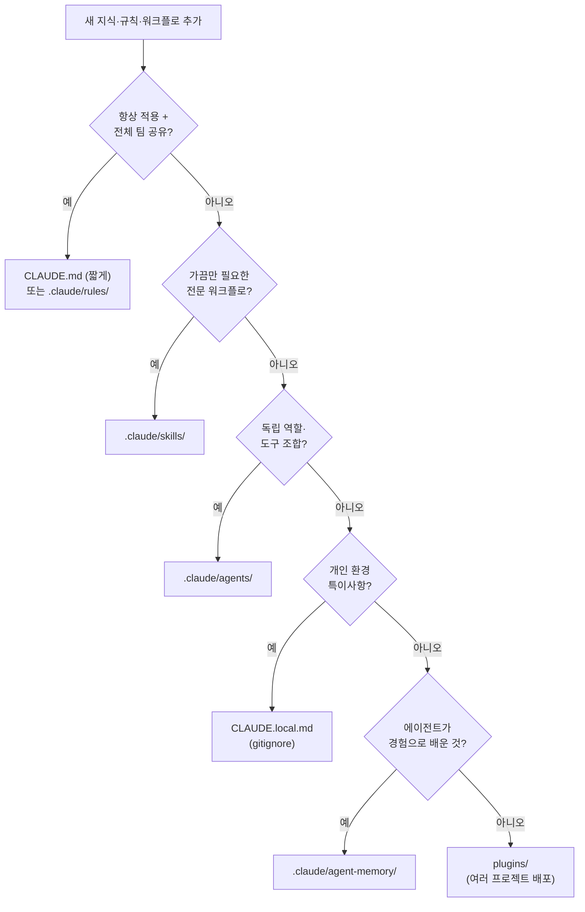

*صورة تجريدية لبنية مشروع Claude Code التي تتشعب من دماغ مشروع واحد إلى قواعد ومهارات ووكلاء وذاكرة.*

## نظرة عامة

يكفي أن تعمل مع Claude Code فترة من الوقت حتى تتحوّل مجلدات `.claude` إلى فوضى من الأشياء المتناثرة. محتوى يستحق أن يكون قاعدة ينتهي في `CLAUDE.md`، ومعرفة متخصصة لا تُحتاج إلا أحياناً تُدفن في قواعد مُحمَّلة دائماً، ومسارات بيئة شخصية تتسلل إلى ملفات مشتركة بين أعضاء الفريق. حين تضبب الحدود بين ما يحتويه كل مكوّن، يصبح المستخدم يدفع رموزاً توكن لسياق لا فائدة منه في كل جلسة.

في يونيو 2026، أثارت مقالة Prakash Bhandari بعنوان "Claude Code Project Structure: The Complete Map" اهتمام مجتمع المطورين. ترسم المقالة خريطة وحيدة لخمسة أنظمة فرعية تتحكم فيها مجلدات `.claude`: التعليمات (CLAUDE.md وrules)، وتدفقات العمل (skills وcommands)، والخبراء (agents)، والصلاحيات (settings.json)، والذاكرة (memory). إذ تُشغّل ThakiCloud مئات المهارات وعشرات الوكلاء على هذه البنية بالفعل، لم نكتفِ بقراءة المقالة بل قسنا مستودعنا عليها مباشرةً.

هذا المقال هو سجلّ تلك المقارنة الميدانية. نُحدد حدود دور كل مكوّن، ونقيس الأرقام الفعلية لمكوّنات مستودع `ai-platform-strategy`، ثم نناقش لماذا تتخطى هذه البنية مجرد التنظيم حين يتعلق الأمر بتشغيل منصة SaaS متعددة المستأجرين لـ AI/ML على Kubernetes.

## ما هي بنية مشروع Claude Code؟

الفكرة الجوهرية بسيطة. يقرأ Claude Code التكوين من موضعين: مجلد `.claude` في دليل المشروع، ومجلد `~/.claude` في الدليل الرئيسي. يُودَع ملفات المشروع في git لمشاركتها بين أعضاء الفريق، بينما تنطبق ملفات الدليل الرئيسي على جميع المشاريع كإعدادات شخصية. يستقر كل مكوّن في موضعه وفق هذين المسارين.

جوهر الخريطة يكمن في سؤال واحد: متى يُحمَّل كل مكوّن في السياق؟ بعضها يدخل السياق تلقائياً مع كل جلسة، وبعضها لا يدخل إلا حين تُفعّله طلب بعينه. هذا الفارق في توقيت التحميل هو الفارق في تكلفة التوكن، وهو ما يجعل قرار توضيع أي شيء في أي مكان مسألة تشغيلية لا مجرد تفضيل شخصي.

*مخطط بنية مشروع Claude Code مُرتَّب وفق توقيت التحميل في السياق.*

## حدود دور كل مكوّن

القيمة الحقيقية للخريطة تتجلى في الإجابة عن: ما الذي يذهب إلى أين؟ فيما يلي ملخص مسؤولية كل مكوّن مقروناً بطريقة تطبيقنا الفعلي.

**CLAUDE.md هو دماغ المشروع.** يُحمَّل تلقائياً مع كل جلسة ويمثّل الموجز المرجعي المشترك بين الفريق. تخيّله كالكرّاس الذي تسلّمه للمتعاقد الجديد في يومه الأول. أربعة أسئلة فحسب ينبغي أن يجيب عنها: ماذا نبني؟ على أي حزمة تعمل؟ أي اتفاقيات نتّبع؟ وما قواعد سير العمل؟ المبدأ الحاسم أن كل سطر يدفع إيجاراً، فـ`CLAUDE.md` المنتفخ هو في حقيقته هدر في السياق.

**CLAUDE.local.md هو تجاوز الإعدادات الشخصية.** يشارك CLAUDE.md تنسيقه ذاته لكنه لا يدخل git أبداً. المسارات المحلية للبيئة، ومختصرات تصحيح الأخطاء، والتفضيلات الشخصية، وخصوصيات جهازك: هذه هي ما يذهب هنا. يجوز أن يختلف بين الزملاء، وهو الصمام الأماني الذي يُبقي `CLAUDE.md` المشترك نظيفاً.

**.claudeignore هو حدود السياق.** يستخدم صياغة `.gitignore` ذاتها ليقيّد نطاق قراءة Claude. بدونه، يستنزف `node_modules` وملفات الترحيل المولّدة وتبعيات البائع والتركيبات الضخمة السياقَ. في مستودعات الأحادي الكبيرة يصبح هذا الملف شرطاً لا خياراً.

**rules هي القواعد الدائمة.** تُحمَّل تلقائياً مع كل دورة، لذا لا ينبغي أن تحتوي إلا على القواعد الثابتة التي تسري على جميع المهام. وضع وثيقة معمارية من 200 سطر في ملف قاعدة يعني استهلاك سياقها في كل جلسة حتى وإن كانت لا صلة لها بما يُنجَز. لهذا يجب أن تنام الوثائق حتى تستدعيها مهارة صريحة.

**skills هي المعرفة المتخصصة عند الطلب.** لا تُحمَّل إلا حين تُفعّلها طلبٌ ما. وصفات العمل المتخصصة وخطوط أنابيب المجالات والمهام المتكررة: هذا مكانها. السؤال الفاصل بين CLAUDE.md وskills: هل يُحتاج هذا دائماً أم أحياناً؟

**agents هي تعريفات الوكلاء الفرعيين.** خبراء مستقلون لكل منهم دوره وأدواته ومستوى نموذجه، يُستدعَون عند الحاجة. المنطق أن تسند مهام الاستكشاف إلى نماذج أرخص، والتنفيذ إلى نماذج متوازنة، والقرارات المعمارية إلى النماذج الأكثر تكلفة، توجيهاً مرناً وفق طبيعة المهمة.

**agent-memory هي المعرفة التي اكتسبها الوكيل بنفسه.** هنا يكمن الفرق الجوهري عن CLAUDE.md: الأخير يحتوي ما أخبرته أنت به، أما agent-memory فتحتوي ما تعلّمه الوكيل من التجربة. الوكلاء طويلو المدى يراكمون الأنماط المتكررة والأخطاء والاتفاقيات غير الموثّقة.

## أين تضع المعرفة الجديدة؟

حتى لو استظهرت الخريطة، يظل السؤال العملي مُحيّراً حين تضيف قاعدة أو تدفق عمل جديداً. شجرة قرار التوضيع التي تقترحها المقالة تبسّط هذا الحكم.

*شجرة القرار لتحديد موضع أي معرفة جديدة: هل تُحتاج دائماً؟ هل تُحتاج أحياناً؟ من صنعها؟*

الأخطاء الشائعة واضحة أيضاً. حشو المعرفة التي "تُحتاج أحياناً" في `CLAUDE.md` يعني هدر توكن في كل جلسة. مستودع أحادي بلا `.claudeignore` يستنزف السياق. إيداع `CLAUDE.local.md` في git يكشف البيانات الشخصية والمسارات. تفعيل أكثر من 10 خوادم MCP دائماً يهدر نحو 10 آلاف توكن بلا استخدام.

## قياس مستودع ThakiCloud على هذه الخريطة

بعد قراءة الخريطة، قسنا مستودعنا عليها فعلاً. هذه هي نتائج قياس مجلد `.claude` في مستودع `ai-platform-strategy`:

| المكوّن | القياس الفعلي | توقيت التحميل |
|---|---|---|
| CLAUDE.md | 94 سطراً | تلقائي مع كل جلسة |
| .claude/rules | 40 ملفاً | تلقائي مع كل دورة |
| .claude/skills | 1655 مجلداً | عند الطلب |
| .claude/agents | 54 تعريفاً | عند الاستدعاء |
| .claude/hooks | 15 ملفاً | عند وقوع الحدث |
| .claudeignore | موجود (442 بايت) | حدود دائمة |
| .mcp.json | موجود (166 بايت) | عند اتصال الخادم |
| .claude/settings.json | موجود (5KB) | مع كل جلسة |

*40 قاعدة و94 سطراً من CLAUDE.md هي تكلفة دائمة تدخل السياق مع كل دورة، بينما 1655 مهارة و54 وكيلاً أصول يدخلون السياق عند الطلب فحسب.*

هذه الأرقام تُثبت جوهر الخريطة بنفسها. لو أُدرجت الـ 1655 مهارة كلها في `CLAUDE.md` أو في القواعد، لتجاوزت كل جلسة حدّ السياق فوراً. في الواقع، تُحمَّل هذه المهارات الـ 1655 عند الطلب فحسب، ويُضيّق موجّه مستقل المرشحين في كل دورة. في المقابل، تُضبط تكلفة الحضور الدائم إرادياً عند 40 قاعدة، وهو نتاج ضبط نظافة يستهدف أقل من 2KB لكل ملف قاعدة مع تخفيض أي ملف يتجاوز ذلك إلى مهارة.

اللافت أننا حين انتهينا من قراءة مصدر هذا المقال، استخلصناه مباشرةً في ملف قاعدة باسم `claude-code-project-anatomy.md` وأدرجناه في المستودع. أي أن "خريطة بنية المشروع" ذاتها اجتازت شجرة القرار لتستقر قاعدةً دائمة الحضور. الخريطة وضعت نفسها على الخريطة.

## دلالات التطبيق على منصة ThakiCloud K8s لـ AI/ML

يتجاوز هذا النظام مجرد التنظيم لأن تكلفة السياق هي تكلفة تشغيل فعلية. تُشغّل ThakiCloud وكلاء متعددي المستأجرين على Kubernetes، وتجدول موارد GPU عبر Kueue، وتخدم النماذج عبر vLLM. في هذه البيئة، تستهلك كل جلسة وكيل توكناً، وكل توكن يترجم إلى تكلفة استنتاج. تقليص السياق الدائم ينعكس مباشرةً على الدقة والتكلفة الوحدوية.

"التوضيع وفق توقيت التحميل" الذي تُركّز عليه الخريطة يتلاقى تماماً مع مبدأين نصغناهما مسبقاً. الأول: تراكم القدرات في المهارة لا في الـ harness، بحيث تعمل المهارة ذاتها عبر بيئات تنفيذ متعددة مع إبقاء الـ harness رفيعاً. الثاني: تأجيل ما يُحتاج أحياناً إلى عند الطلب مع إبقاء ما يُحتاج دائماً في حدوده الدنيا. شجرة القرار تُحوّل هذين المبدأين إلى حكم عملي لحظة إضافة أي مكوّن جديد.

للمنتج متعدد المستأجرين دلالة أعمق. حين تحتاج إلى حقن قواعد ومهارات مختلفة لكل مستأجر، تُبسّط حدودٌ واضحة بين ما هو سياق دائم وما هو عند الطلب كلاً من عزل السياق بين المستأجرين وتوزيع التكاليف. وفصل معرفة agent-memory التي يكتسبها الوكيل عن معرفة `CLAUDE.md` التي يحددها الإنسان يُتيح تشغيل وكلاء ذاتية التعلم بأمان.

## قيود وتحفظات

هذه الخريطة ليست حلاً مطلقاً. إليك تحفظات صريحة.

أولاً، حدود المكوّنات توصيات لا قيود. لا يمنعك Claude Code نفسه من وضع المحتوى الخاطئ في المكان الخاطئ. الالتزام بالحدود يبقى مسؤولية الفريق، وكما في حالتنا، يتطلب تثبيتها قواعد نظافة توكن وبوابات موجّه بالكود. قراءة الخريطة وحدها لا تُنظّف المستودع من تلقاء ذاته.

ثانياً، رقم 1655 مهارة ليس إنجازاً صافياً، بل سيف ذو حدّين. كلما زاد عدد المرشحين، زادت مخاطر توجيه الموجّه مهارةً خاطئة. المهارات عند الطلب لا تستهلك توكن دائمة، لكنها تُنتج تكلفة أخرى هي دقة البحث. "عند الطلب يعني مجاناً" استنتاج مبسّط.

ثالثاً، هذه البنية مُخصصة لـ Claude Code. الانتقال إلى بيئة تنفيذ وكلاء أخرى يغيّر اتفاقيات الدليل وآليات التحميل. لذا من الأجدر صياغة المعرفة ذاتها بحيادية تجاه بيئة التنفيذ، مع إبقاء التوصيل بالبيئة رفيعاً قدر الإمكان.

أخيراً، بعض أرقام المصدر، كـ 1000 توكن تقريباً لكل خادم MCP، تقديرات تتفاوت بحسب البيئة والإصدار. الأجدر قراءتها كاتجاه: "كل ما يُحمَّل دائماً يُكلّف"، لا كأرقام مطلقة.

## المصادر

- [Claude Code Project Structure Explained: The Complete 2026 Guide](https://www.prakashbhandari.com.np/posts/claude-code-project-structure-2026/) (Prakash Bhandari)
- [Explore the .claude directory (التوثيق الرسمي لـ Claude Code)](https://code.claude.com/docs/en/claude-directory)
- المستودع المقيس: مجلد `.claude` في مستودع ThakiCloud `ai-platform-strategy` (القياس بتاريخ 2026-06-27)
