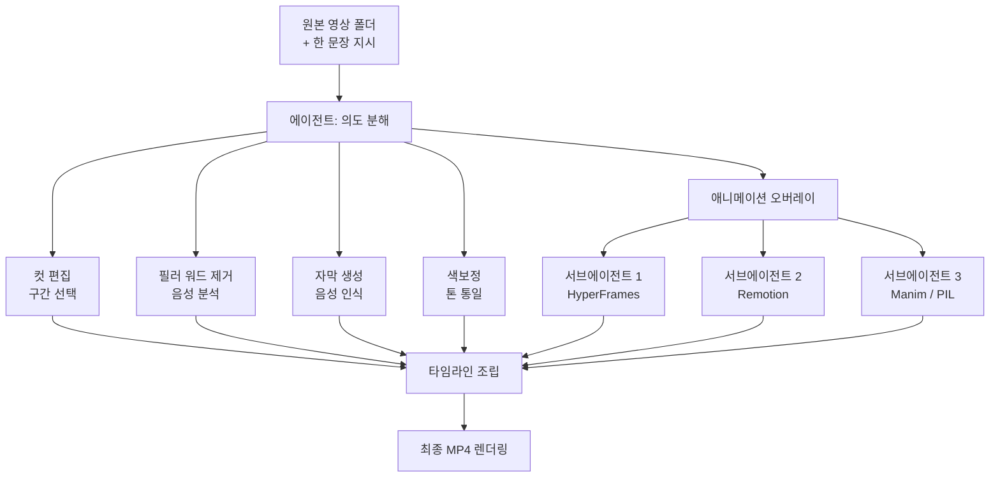

## نظرة عامة

ظل تحرير الفيديو لوقت طويل مجالاً للعمل اليدوي، حيث يقصّ الإنسان المقاطع ويجمعها على الخط الزمني. إنهاء فيديو واحد كان يتطلب أدوات متخصصة ويداً مدربة للقص وإزالة الكلام الزائد وإضافة الترجمات وتدرّج الألوان والرسوم المتحركة. ثم في يونيو 2026، انتشرت بسرعة بين المطورين تغريدة من سطر واحد للمطور الإسباني المؤثر midudev: «بات بإمكان Claude Code تحرير الفيديو أيضاً. هذه المهارة مجانية بنسبة 100% ومفتوحة المصدر».

بطل الضجة هو `video-use` الذي أصدره فريق browser-use. الفريق نفسه المعروف بـ browser-use الذي يقود متصفحاً عبر وكيل برمجي، يقدّم الآن مهارة تسلّم تحرير الفيديو بالكامل إلى وكيل برمجي. الاستخدام بسيط. تضع ملفات الفيديو الخام في مجلد، وتكتب جملة واحدة تصف الفيديو الذي تريده، ويتولى الوكيل الباقي.

تعمل ThakiCloud على تحويل البنية التي يختار فيها الوكيل المهارات ويشغّلها داخل بيئة معزولة إلى منتج باسم السحابة الأصيلة للوكلاء. لذلك قرأنا video-use لا كأداة تحرير فحسب، بل كدراسة حالة لكيفية تفكيك الوكيل البرمجي للأعمال غير البرمجية وتوزيعها على التوازي. يوثّق هذا المقال ما تفعله video-use فعلاً، وكيف يبدو هيكلها الداخلي، وما الذي يوحي به تصميمها من منظور منصتنا.

## ما هذه التقنية

الفكرة الجوهرية لـ video-use هي اختزال تحرير الفيديو إلى أمر واحد بلغة طبيعية. لا يلمس المستخدم الخط الزمني مباشرة. بدلاً من ذلك، يصف النتيجة المرجوة في جملة، ويفكّك الوكيل تلك الجملة إلى عدة إجراءات تحرير ملموسة.

وفقاً للوصف المنشور، تتولى video-use تلقائياً ما يلي.

- قص المقاطع غير الضرورية من اللقطات الخام
- إزالة كلمات الحشو تلقائياً مثل «أم» و«آه»
- التعرّف على الكلام لتوليد الترجمات ودمجها في الفيديو
- تطبيق تدرّج الألوان لتوحيد النغمة
- إضافة طبقات رسوم متحركة عند النقاط التي تحتاج إلى تأكيد
- إخراج كل ما سبق في ملف MP4 نهائي واحد

الجزء المثير هو كيفية التعامل مع الرسوم المتحركة. عند إنشاء طبقات الرسوم المتحركة، لا ترتبط video-use بمحرك واحد، بل تختار من بين HyperFrames وRemotion وManim وPIL حسب طبيعة المهمة. والأهم أنها تطلق وكيلاً فرعياً منفصلاً على التوازي لكل رسم متحرك تنشئه. وكيل واحد لكل رسم متحرك.

يختلف هذا التصميم جوهرياً عن النهج الشائع المتمثل في «توليد فيديو بمطالبة عملاقة واحدة». فهو يقسّم المهمة الكبيرة لتحرير الفيديو إلى مهام فرعية مستقلة مثل القص والترجمات وتدرّج الألوان والرسوم المتحركة، ويشغّل غير المترابطة منها على التوازي، ثم يجمعها أخيراً في خط زمني واحد. ويبدو المسار الكامل كالتالي.

كما يوضح الرسم، لا تكون كتلة الرسوم المتحركة عقدة واحدة بل تتفرّع إلى عدة وكلاء فرعيين. كل وكيل فرعي مسؤول فقط عن الرسم المتحرك المسند إليه ولا يرى النتائج الوسيطة للآخرين. مع هذا الفصل، سواء كان هناك ثلاثة رسوم متحركة أو خمسة، يمكنها أن تسير في آن واحد، ويتقارب إجمالي الوقت الفعلي إلى مدة أطول رسم متحرك منفرد.

## التثبيت والتكامل

تُشحن video-use كمهارة تعمل فوق وكيل برمجي. يمكنك الحصول عليها من المستودع العام لفريق browser-use (‏`browser-use/video-use`)، وتماشياً مع وصفها من سطر واحد، «Edit videos with coding agents»، يكون الوكيل البرمجي هو المضيف. المسار النموذجي هو جلب المستودع، ووضع المهارة حيث يستطيع الوكيل التعرّف عليها، وإسقاط اللقطات الخام في مجلد عمل، وتوجيه الوكيل بجملة واحدة.

لكل محرك رسوم متحركة طابعه المختلف. Remotion إطار لبرمجة الفيديو بواسطة React، قوي في الرسوم المتحركة القائمة على المكوّنات؛ وManim مكتبة بايثون متخصصة في تحريك المعادلات والأشكال؛ وPIL يتولى التركيب الخفيف للصور؛ وHyperFrames يُستخدم لتوليد التسلسلات إطاراً بإطار. ولأن video-use لا تثبّت على محرك واحد بل تختار المناسب لكل مهمة، تحتاج البيئة إلى أوقات التشغيل التي تتطلبها هذه المحركات (Node وPython وffmpeg وغيرها).

> ملاحظة صادقة حول نطاق إعادة الإنتاج: البيئة التي كُتب فيها هذا المقال معزولة وذات شبكة خارجية وتثبيت تبعيات مقيّدين، لذا لم نتمكن من تشغيل خط الأنابيب الكامل مع أصول فيديو خام وتبعيات إخراج ثقيلة (Remotion وManim وffmpeg) لقياس زمن الإخراج أو أرقام الجودة مباشرة. لذلك يستند التحليل هنا إلى وصف المهارة المنشور وبنيتها، ولا ندرج أي أرقام مرجعية لم نقسها.

## ماذا يعني السلوك فعلاً

رغم أننا لم نشغّل الإخراج الكامل بأنفسنا، فإن مواصفات السلوك المنشورة وحدها توضّح ما تهدف إليه هذه المهارة. أكبر تحوّل هو أن وحدة التحرير تصبح النيّة بدلاً من المقاطع.

في أداة تحرير تقليدية، يفكّر المستخدم بوحدات الإجراء: «اقصص من الثانية 3 إلى 7، وأضف تلاشياً هناك، وألصق ترجمة». في video-use، يفكّر المستخدم بوحدات النتيجة: «خذ هذا الفيديو التقديمي، ونظّفه، واصنع مقطعاً من دقيقة واحدة مع ترجمات ورسوم متحركة للتأكيد». والتحويل بين الاثنين، أي تفكيك النيّة إلى عشرات الإجراءات، هو ما يتولاه الوكيل.

التحوّل الثاني هو التوازي. يبدو تحرير الفيديو متسلسلاً بطبيعته، لكنه في الواقع يحتوي على مهام فرعية مستقلة كثيرة. توليد الترجمات لا علاقة له بتدرّج الألوان، ورسم المشهد الثاني المتحرك لا علاقة له برسم الأول. إطلاق video-use وكيلاً فرعياً لكل رسم متحرك تصميم يستغل هذا الاستقلال بنشاط لتقليل الوقت الفعلي. إنها الفكرة نفسها التي تؤكد عليها ThakiCloud دائماً في تنسيق الوكلاء المتعددين: شغّل المهام غير المترابطة على التوازي.

## دلالات على منتجات ThakiCloud

تعالج video-use مجال الفيديو غير البرمجي، لكن مبادئ تصميمها تلامس جوهر **Paxis** الذي تحوّله ThakiCloud إلى منتج بوصفه سحابة أصيلة للوكلاء. Paxis مستوى تحكّم للوكلاء يعمل فوق ai-platform، يتعامل مع المهارات والأدوات والسياسات وسجلات التدقيق كموارد من الدرجة الأولى. وعند إسقاط بنية video-use على طبقات Paxis تظهر ثلاثة أمور.

أولاً، **منظور حزمة المهارات Skill Harness**. video-use هي بذاتها مهارة واحدة، وتختار داخلياً من بين عدة أدوات فرعية (HyperFrames وRemotion وManim وPIL) حسب الموقف. تختار حزمة المهارات في Paxis من أكثر من 960 مهارة عبر BM25 وتحمّل فقط المناسب منها إلى السياق؛ وطريقة video-use في اختيار محرك لكل مهمة رسم متحرك مثال صغير على المبدأ نفسه: «حمّل ما تحتاجه فقط». كما يتوافق ذلك مع خبرتنا في أن ملء هيكل مُتحقَّق منه بتصميم حر يرفع متوسط الجودة.

ثانياً، **منظور التنفيذ المعزول في صندوق الرمل**. يجلب إخراج الفيديو تبعيات ثقيلة مثل ffmpeg وNode وPython، وقد يلوّث بيئة المضيف إن لم يُحسَن التعامل. تعالج Paxis كل تنفيذ مهارة في صندوق رمل معزول لحماية شجرة العمل الرئيسية. وكلما استدعت مهارة عدة أوقات تشغيل خارجية، كما تفعل video-use، صار هذا العزل ضرورة لا خياراً. حين يشغّل وكلاء فرعيون متوازون محركاً مختلفاً لكل منهم، تحتاج إلى حدّ يمنع تصادم ملفاتهم المؤقتة وعملياتهم لتعمل الأمور بثبات.

ثالثاً، **منظور تنسيق الوكلاء المتعددين بصيغة DAG**. مسار video-use هو في الواقع رسم بياني موجّه لا دوري (DAG). تتفرّع عقد القص والترجمة وتدرّج الألوان والرسوم المتحركة على التوازي ثم تتقارب من جديد عند عقدة تجميع الخط الزمني. تعبّر Paxis عن هذا التفرّع والتجمّع كدرجة أولى، وتمرّر تنفيذ كل عقدة عبر بوابات السياسة وسجلات التدقيق. ولأن مَن استدعى أي أداة ومتى مسجّل بالكامل، يمكنك تتبّع كيف أُنتجت النتيجة.

باختصار، video-use عرض واحد لوكيل برمجي يفكّك الأعمال غير البرمجية ويوزّعها على التوازي، وPaxis هو مستوى التحكّم الذي يشغّل مثل هذه الأنماط بأمان وقابلية للتتبّع. سواء كان تحرير فيديو أو خط أنابيب بيانات، فالهيكل واحد: غلّف العمل كمهارة، وشغّله على التوازي داخل صندوق رمل معزول، واترك كل إجراء في سجل تدقيق.

## القيود والاعتراضات

هذا النهج ليس علاجاً لكل شيء. أولاً، لأن حكم الوكيل يدخل في مرحلة تفكيك النيّة إلى إجراءات، قد يتباعد المخرج عمّا تصوّره المستخدم. «نظّفه» تعني أشياء مختلفة لأشخاص مختلفين، وقد يكون المقطع الذي قصّه الوكيل هو الأساسي فعلاً. في النهاية، بدلاً من الانتهاء بجملة واحدة، ستتبادل على الأرجح عدة جولات من تعليمات التعديل.

ثانياً، الكلفة والوقت. إطلاق وكيل فرعي لكل رسم متحرك يقلّل الوقت الفعلي عبر التوازي، لكن على حساب استهلاك حوسبة أكبر بقدر عدد الوكلاء وعمليات الإخراج التي تعمل في آن واحد. لصقل مقطع قصير واحد، قد يكون تصميماً مفرطاً في الهندسة. تشغيل مهمة عبر تنسيق الوكلاء بينما ينهيها محرّر تقليدي في خمس دقائق ليس مكسباً دائماً.

ثالثاً، غياب الحتمية. حتى مع المصدر نفسه والتعليمة نفسها، لا ضمان أن تخرج النتيجة نفسها في كل مرة. القابلية لإعادة الإنتاج مهمة في الإنتاج الاحترافي للفيديو، والتحرير القائم على الوكلاء لا يزال يحتاج إلى تحقّق هنا. ولهذا تؤكد ThakiCloud مبدأ أن «التنسيق والتجميع تملكهما الشيفرة الحتمية بينما يولّد النموذج المحتوى فقط» في المخرجات الدفعية. حتى لو تركت التحرير الإبداعي للنموذج، يبقى النهج الهجين الذي تضمن فيه الشيفرة الأجزاء الحتمية مثل توقيت الترجمة ومواصفات المخرج هو التسوية الواقعية.

ومع ذلك، الاتجاه الذي تبرهنه video-use واضح. نمط تغليف المهام المعقدة في المجالات غير البرمجية كمهارات، وتفكيك المهام الفرعية المستقلة إلى وكلاء متوازين، واستخدام النيّة باللغة الطبيعية كنقطة دخول، سينتشر إلى مجالات أكثر. وما تبنيه ThakiCloud بـ Paxis هو بالضبط الأساس لتشغيل ذلك النمط بأمان.

## المصادر

- [browser-use/video-use (GitHub)](https://github.com/browser-use/video-use): "Edit videos with coding agents"
- [تغريدة ‎@midudev](https://x.com/midudev): تعريف بمهارة video-use (2026-06-27)
- [video-use: Edit Videos with Claude Code (AIBit)](https://aibit.im/en/article/video-use-edit-videos-with-claude-code)
