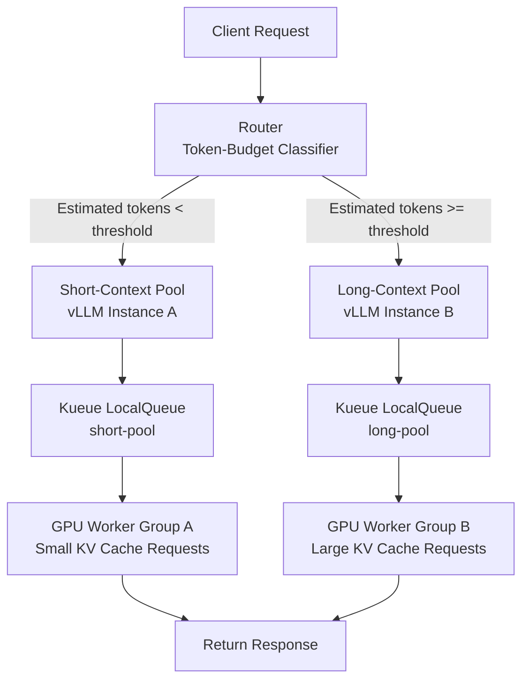

## المشكلة: HoL Blocking يُهدر وقت GPU في صمت

من يدير خدمة استدلال نماذج اللغة الكبيرة في بيئة إنتاجية يلاحظ حتمًا هذا النمط المتكرر: طلب يُنتج عشرات الرموز فحسب — كردّ بسيط في نظام محادثة — يجلس منتظرًا خلف طلب تلخيص وثيقة طويل أو مهمة توليد كود معقدة، مُهدرًا مئات الميلي ثانية. هذا ما يُعرف بـ Head-of-Line (HoL) Blocking.

يرفع نظام vLLM كفاءة المعالجة الدفعية بشكل ملحوظ عبر continuous batching، غير أن البنية ذات المجمّع الواحد تجعل الطلبات الطويلة تستأثر بذاكرة KV Cache لفترات مطوّلة، مما يُجبر الطلبات القصيرة على الانتظار أو إعادة الحساب عند الاستئناف، فيتراجع الاستخدام الفعلي لوقت GPU.

يعالج أسلوب **Dual-Pool Token-Budget Routing** الوارد في arXiv 2604.08075 هذه المشكلة من جذورها: عند وصول كل طلب، يُقدَّر عدد الرموز المتوقع، ويُوجَّه الطلب إما إلى مجمّع السياق القصير أو مجمّع السياق الطويل، فيتعايش النوعان دون تدخّل متبادل.

النتائج التي رصدها البحث:

| المقياس | التأثير |
|---|---|
| توفير وقت GPU | **31–42%** |
| معدل الاستئناف القسري | **تراجع 5.4 أضعاف** |
| تحسين P99 TTFT | **6%** |

## المبدأ الأساسي: التوجيه القائم على ميزانية الرموز

الفكرة وراء Dual-Pool بسيطة. يُقدَّر لكل طلب **أقصى عدد رموز متوقع**، ثم يُعيَّن الطلب لأحد المجمّعَين بناءً على عتبة محددة.

```
الرموز المتوقعة = رموز الإدخال + رموز الإخراج المتوقعة
```

حين يكون عدد رموز الإخراج مجهولًا — وهو الحال في معظم سيناريوهات الإنتاج — تُستخدم إحدى التقريبتين التاليتين:

1. **معاملات الطلب**: استخدام قيمة `max_tokens` حدًّا أعلى.
2. **التصنيف القائم على السجل التاريخي**: تتبّع توزيع أطوال الطلبات السابقة لكل مسار API أو بصمة نظام الرسالة، ثم التصنيف بناءً على قيمة P75 أو P90.

تعتمد العتبة الفاصلة على طبيعة أعباء العمل؛ وفي تجارب البحث استُخدم 512 رمزًا في الإخراج حدًّا بين القصير والطويل.

## المعمارية: هيكل المجمّعَين



يُدير مجمّع السياق القصير دورة KV Cache بسرعة عالية للحفاظ على إنتاجية مرتفعة، فيما يحتجز مجمّع السياق الطويل حجمًا كافيًا من ذاكرة KV Cache لإتمام عمليات التوليد الطويلة دون انقطاع. لا يتدخّل المجمّعان في بعضهما البعض.

## التكامل مع Kueue LocalQueue

تعتمد منصة ai-platform الخاصة بـ ThakiCloud على Kueue لجدولة أعباء عمل GPU على Kubernetes. يتيح دمج Dual-Pool Routing مع Kueue LocalQueue إدارة تخصيص موارد كل مجمّع بأسلوب تصريحي على مستوى الكلاستر.

### الخطوة 1: تعريف ClusterQueue و ResourceFlavor

```yaml
apiVersion: kueue.x-k8s.io/v1beta1
kind: ClusterQueue
metadata:
  name: llm-inference-cq
spec:
  namespaceSelector: {}
  resourceGroups:
    - coveredResources: ["nvidia.com/gpu"]
      flavors:
        - name: gpu-a100
          resources:
            - name: nvidia.com/gpu
              nominalQuota: 8
---
apiVersion: kueue.x-k8s.io/v1beta1
kind: ResourceFlavor
metadata:
  name: gpu-a100
spec:
  nodeLabels:
    gpu.nvidia.com/model: A100
```

### الخطوة 2: تعريف LocalQueue منفصل لكل مجمّع

```yaml
apiVersion: kueue.x-k8s.io/v1beta1
kind: LocalQueue
metadata:
  name: short-pool-queue
  namespace: llm-serving
spec:
  clusterQueue: llm-inference-cq
---
apiVersion: kueue.x-k8s.io/v1beta1
kind: LocalQueue
metadata:
  name: long-pool-queue
  namespace: llm-serving
spec:
  clusterQueue: llm-inference-cq
```

### الخطوة 3: إضافة التعليق التوضيحي للقائمة في vLLM Deployment

```yaml
apiVersion: apps/v1
kind: Deployment
metadata:
  name: vllm-short-pool
  namespace: llm-serving
  annotations:
    kueue.x-k8s.io/queue-name: short-pool-queue
spec:
  replicas: 2
  template:
    spec:
      containers:
        - name: vllm
          image: vllm/vllm-openai:latest
          args:
            - "--model"
            - "meta-llama/Llama-3.1-8B-Instruct"
            - "--max-model-len"
            - "4096"       # مجمّع قصير: حد سياق صغير
            - "--gpu-memory-utilization"
            - "0.7"        # دوران سريع لـ KV Cache
          resources:
            limits:
              nvidia.com/gpu: "1"
---
apiVersion: apps/v1
kind: Deployment
metadata:
  name: vllm-long-pool
  namespace: llm-serving
  annotations:
    kueue.x-k8s.io/queue-name: long-pool-queue
spec:
  replicas: 2
  template:
    spec:
      containers:
        - name: vllm
          image: vllm/vllm-openai:latest
          args:
            - "--model"
            - "meta-llama/Llama-3.1-8B-Instruct"
            - "--max-model-len"
            - "32768"      # مجمّع طويل: نافذة سياق واسعة
            - "--gpu-memory-utilization"
            - "0.90"       # احتجاز كبير لـ KV Cache
          resources:
            limits:
              nvidia.com/gpu: "1"
```

### الخطوة 4: تطبيق الموجِّه (مثال بـ Python)

```python
from fastapi import FastAPI, Request
import httpx

app = FastAPI()

SHORT_POOL_URL = "http://vllm-short-pool-svc:8000/v1/chat/completions"
LONG_POOL_URL  = "http://vllm-long-pool-svc:8000/v1/chat/completions"
TOKEN_THRESHOLD = 512  # اضبط هذه القيمة وفق السجل التاريخي لأعباء العمل

def estimate_output_tokens(payload: dict) -> int:
    """استخدام max_tokens حدًّا أعلى. الافتراضي 256 عند الغياب."""
    return payload.get("max_tokens") or 256

def route_request(payload: dict) -> str:
    """إعادة عنوان URL المستهدف بحسب عدد الرموز المقدَّر."""
    estimated = estimate_output_tokens(payload)
    if estimated < TOKEN_THRESHOLD:
        return SHORT_POOL_URL
    return LONG_POOL_URL

@app.post("/v1/chat/completions")
async def proxy(request: Request):
    payload = await request.json()
    target_url = route_request(payload)
    async with httpx.AsyncClient(timeout=120.0) as client:
        resp = await client.post(target_url, json=payload)
        return resp.json()
```

يُنشر هذا الموجِّه كـ Kubernetes Service ويُوضع أمام نقطة نهاية الاستدلال الحالية.

## اعتبارات التشغيل

### ضبط العتبة الفاصلة

قيمة 512 رمزًا نقطة بداية لا معيار ثابت. في بيئات الإنتاج الفعلية، يُنصح بجمع المقاييس التالية على مدار سبعة أيام على الأقل قبل التعديل:

- توزيع رموز الإخراج الفعلية لكل طلب (P50، P90، P99)
- معدل الاستئناف القسري لكل مجمّع (`vllm:num_preemptions_total` في Prometheus)
- عمق قائمة الانتظار `vllm:num_requests_waiting` لكل مجمّع

إن ظلّ عمق قائمة انتظار المجمّع القصير مرتفعًا باستمرار، فاخفض العتبة أو أضف نسخًا إضافية. وإن تدنّى معدل استخدام GPU في المجمّع الطويل، فارفع العتبة لتقليل الطلبات الموجَّهة إليه.

### التكامل مع KEDA للتوسع التلقائي

تُتيح إضافة ScaledObject من KEDA مستندًا إلى مقاييس Prometheus الخاصة بـ vLLM توسعًا تلقائيًا مستقلًا لكل مجمّع:

```yaml
apiVersion: keda.sh/v1alpha1
kind: ScaledObject
metadata:
  name: vllm-short-pool-scaler
  namespace: llm-serving
spec:
  scaleTargetRef:
    name: vllm-short-pool
  minReplicaCount: 1
  maxReplicaCount: 8
  triggers:
    - type: prometheus
      metadata:
        serverAddress: http://prometheus:9090
        metricName: vllm_requests_waiting_short
        query: vllm:num_requests_waiting{deployment="vllm-short-pool"}
        threshold: "5"
```

التوسع القائم على المقاييس أكثر استجابةً لأحمال الاستدلال مقارنةً بالتوسع القائم على معدل HTTP. عتبة `5` تعني بدء التوسع حين تتجاوز الطلبات المنتظرة خمسة طلبات.

### مشاركة النموذج مقابل فصل النسخ

لا يشترط الأسلوب استخدام نسختين منفصلتين من vLLM. تشغيل النموذج ذاته بإعدادات `--max-model-len` مختلفة هو التكوين الافتراضي، لكن إن توفّرت ميزانية ذاكرة كافية، يمكن لنسخة واحدة من vLLM أن تعرض منفذَي اتصال خارجيَّين بأولوية داخلية مختلفة.

غير أن **فصل النسخ هو الخيار الأوضح** للقضاء الكامل على تداخل الاستئناف، إذ تتشارك ذاكرة KV Cache داخل عملية vLLM الواحدة.

## الأهمية بالنسبة لمنصة ThakiCloud

تُخدِّم منصة ai-platform الخاصة بـ ThakiCloud أعباء استدلال عدة مستأجرين على كلاستر GPU مشترك. يُضيف Dual-Pool Routing ميزتَين ملموستَين في هذا السياق.

أولًا، يُقلّص التداخل بين المستأجرين. حين تتأخر طلبات المستأجر أ — ذات الطابع القصير — خلف مهام التحليل الطويلة للمستأجر ب، ينتج عن ذلك انتهاك لمستويات الخدمة المتفق عليها. فصل المجمّعات يقطع هذا التداخل على مستوى البنية.

ثانيًا، يرفع كفاءة ميزانية GPU. توفير 31–42% من وقت GPU يعني إما استيعاب طلبات أكثر بالميزانية ذاتها، أو تحقيق الإنتاجية نفسها بعدد أقل من وحدات GPU. في بيئات الخوادم المحلية ذات الموارد الثابتة، ينعكس هذا التوفير مباشرةً على تكلفة الخدمة.

بالنسبة لكلاسترات ThakiCloud التي تستخدم Kueue LocalQueue بالفعل، يتطلب تطبيق هذا الأسلوب إعلان قائمتَي انتظار فحسب وتوزيع موجِّه خفيف الوزن. التوافق مع مواصفات vLLM Deployment الحالية مرتفع، مما يُوسّع نطاق التبنّي.

## خلاصة

المشكلة التي يعالجها Dual-Pool Token-Budget Routing واضحة: حين تتشارك الطلبات القصيرة والطويلة قائمة انتظار واحدة، تخسر القصيرة. فصلها على مستوى قائمة الانتظار يُتيح لكل نوع المعالجة بسرعته الطبيعية.

النتائج التي رصدها arXiv 2604.08075 — توفير 31–42% من وقت GPU، وتراجع معدل الاستئناف بمقدار 5.4 أضعاف، وتحسن بنسبة 6% في P99 TTFT — تمثّل عائدًا كبيرًا قياسًا بتعقيد التطبيق. على Kubernetes، يكفي وجود قائمتَي Kueue LocalQueue واثنتَي نشر vLLM Deployment وموجِّه خفيف واحد لبناء هذه البنية.
