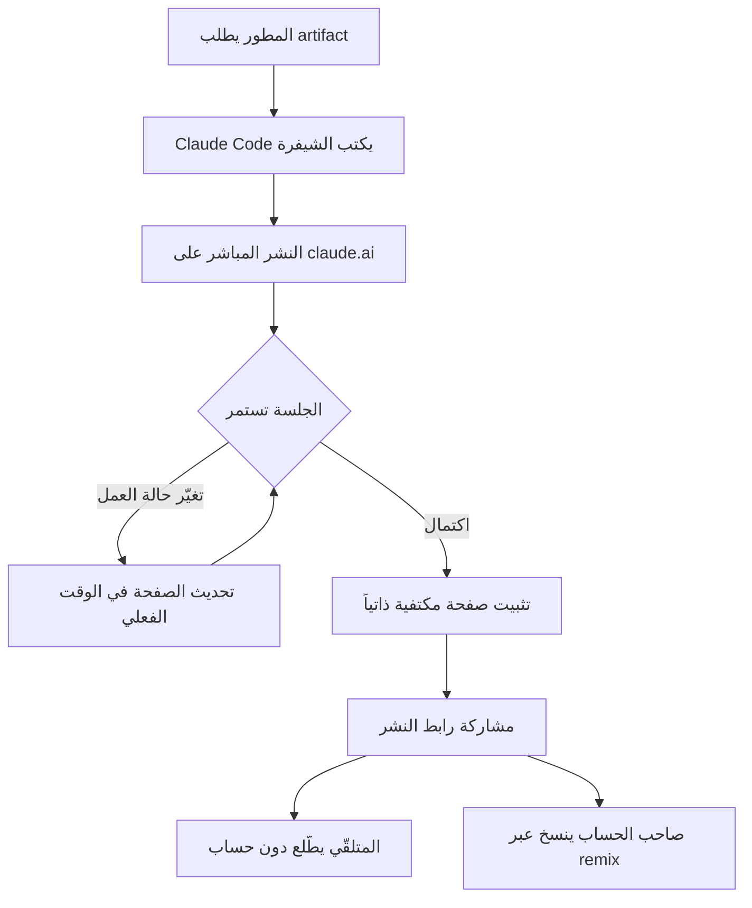

*يتكثّف تقدّم الجلسة البرمجية في صفحة واحدة قابلة للمشاركة تتحدّث في الوقت الفعلي.*

## نظرة عامة

حين ينهي وكيل برمجي ساعات من العمل، يظل عرض النتيجة على شخص آخر أمراً مرهقاً على نحو مفاجئ. تلتقط سجلات الطرفية وتلصقها، أو تلخّص التغييرات يدوياً، أو تبني لوحة معلومات منفصلة. وكثيراً ما يستهلك شرح العمل جهداً أكبر من العمل نفسه.

في يوليو 2026، وسّعت Anthropic ميزة Artifacts في Claude Code لتشمل خطتي Pro وMax. فقدرة كانت محصورة في خطتي Team وEnterprise باتت متاحة الآن للمطورين الأفراد. الفكرة بسيطة: حين تطلب artifact، يكتب Claude الشيفرة وينشرها مباشرةً على claude.ai، ويواصل تحديث تلك الصفحة في الوقت الفعلي بينما تستمر الجلسة. الصفحة خاصة بحسابك ومكتفية ذاتياً بالكامل.

يشرح هذا المقال ما هي Artifacts في Claude Code بدقة، ولماذا يهمّ توسّعها إلى Pro وMax، وكيف يمكن استيعاب هذا النمط من منظور منصة الوكلاء Paxis وبنية الذكاء الاصطناعي ai-platform لدى ThakiCloud.

## ما هي Artifacts في Claude Code

كانت Artifacts في الأصل تعرض الشيفرة أو المستندات في لوحة منفصلة داخل محادثة claude.ai. أما Artifacts التي وصلت للتو إلى Claude Code فمختلفة قليلاً. فبدلاً من مخرَج تبادل واحد، تحوّل تقدّم جلسة برمجية كاملة إلى صفحة بصرية حية واحدة.

تسرد Anthropic أربعة استخدامات نموذجية: شروحات طلبات الدمج (PR walkthroughs)، وصفحات شرح النظام، ولوحات المعلومات، وقوائم مراجعة الإصدار. القاسم المشترك بينها أن كلّاً منها ملخّص يقرأه الإنسان لما يجري الآن. وبينما تواصل الجلسة عملها، تحدّث تلك الصفحة نفسها.

يبدو المسار من العمل إلى النشر على النحو التالي.

يبرز هنا قراران تصميميان. أولاً، الصفحة مكتفية ذاتياً. فدون خط بناء خارجي أو إعداد استضافة، يوجد كل ما تحتاجه داخل الصفحة المنشورة الواحدة. ثانياً، الإعداد الافتراضي خاص. فالصفحة تخصّ حسابك، ولا يستطيع أحد رؤيتها حتى تضغط على زر النشر وتشارك الرابط.

## لماذا يهمّ التوسّع إلى Pro وMax

كانت الميزة نفسها متاحة على Team وEnterprise منذ بضعة أشهر. التغيير الأساسي الآن هو أن حدّ الخطة انخفض.

بدقّة: كانت Artifacts العادية المُنشأة في محادثة claude.ai قابلة للنشر أصلاً على كل الخطط بما فيها Free وPro وMax. أما Artifacts التي تحوّل جلسة Claude Code إلى صفحة حية فكانت حصراً على Team وEnterprise. وقد امتدّ هذا الحدّ الآن إلى Pro وMax. فبدون مقعد مؤسسي، يستطيع المطور الفرد تحويل جلسته إلى صفحة قابلة للمشاركة.

يتّضح سبب الأهمية حين تنظر إلى طريقة عمل المطورين الأفراد فعلياً. حين ينهي مساهم في مشروع مفتوح المصدر إعادة هيكلة طويلة، يحتاج إلى وسيلة لنقل سياق التغيير إلى المراجِع. والأمر نفسه ينطبق على مطور منفرد يدير مشروعاً جانبياً ويريد تتبّع تقدّمه أو عرضه على زميل. حتى الآن، لم يكن بمقدور هؤلاء المستخدمين استعمال الميزة ما لم يكونوا مرتبطين بخطة مؤسسية. والتوسّع إلى Pro وMax يسدّ هذه الفجوة.

ملاحظة إضافية: خلال الفترة نفسها، رفعت Anthropic مؤقتاً الحدود الأسبوعية لاستخدام Claude Code لخطط Pro وMax وTeam. فُتح الوصول والهامش معاً، ما يمنح المطورين الأفراد مساحة حقيقية لتجربة الميزة.

## كيف تعمل عملياً

استخدامها أقرب إلى المحادثة. أثناء الجلسة، حين تقول "حوّل هذا العمل إلى artifact"، يولّد Claude Code صفحة تلتقط التقدّم الحالي وينشرها على claude.ai. افتح الرابط المُعاد وسترى صفحة بصرية تلخّص العمل حتى الآن، وبينما تستمر الجلسة تتحدّث الصفحة دون إعادة تحميل.

تجري المشاركة عبر زر النشر أسفل لوحة artifact. ومن يتلقّى الرابط يستطيع الاطلاع على الصفحة دون حساب Claude. ومن يملك حساباً يمكنه استخدام remix لإنشاء نسخته القابلة للتحرير. بعبارة أخرى، يكون artifact واحد مادةً مشتركة للقراءة فقط ونقطة انطلاق يمكن لشخص آخر التقاطها وتطويرها.

نموذج الخصوصية واضح أيضاً. الصفحة المُنشأة في Claude Code خاصة بحسابك افتراضياً. ولا تُكشف خارجياً إلا لحظة نشرك وتسليمك الرابط، وحتى ذلك الحين أنت وحدك من يراها. وبالنسبة للمطورين الذين يتعاملون مع عمل داخلي حساس، يهمّ هذا الإعداد الافتراضي لأنه لا يوجد مسار للكشف العرضي.

أكثر التركيبات عمليةً في هذا المسار هو شرح طلب الدمج. فبعد إنهاء تغيير طويل، يُنتج طلب artifact صفحةً تغطّي ما تغيّر ولماذا، وأي الملفات تأثّرت، وكيف جرى التحقق. ويستطيع المراجِع فهم السياق من هذه الصفحة قبل قراءة الفرق (diff). وتعمل صفحات الاستجابة للحوادث وقوائم مراجعة الإصدار بالطريقة نفسها، إذ تتيح للوكيل الاحتفاظ بملخّص يقرأه الإنسان من تلقاء نفسه.

## ماذا يعني ذلك لـ ThakiCloud

المغزى الحقيقي لهذه الميزة يتجاوز راحة أداة واحدة. فالنمط نفسه، أي "الاحتفاظ بمخرَج عمل الوكيل كأثر قابل للقراءة والمشاركة وإبقاؤه حياً"، هو تحدٍّ جوهري لأي منصة وكلاء.

**عدسة Paxis (مخرَج الوكيل كمورد من الدرجة الأولى).** إن Paxis من ThakiCloud هي مستوى تحكّم Agent-Native Cloud يعمل فوق ai-platform ويتعامل مع Skills وTools وPolicies وAudit Logs كموارد من الدرجة الأولى. وما تُظهره Artifacts في Claude Code هو طريقة لكشف مخرَج الوكيل الوسيط والنهائي كقناة مراقبة منفصلة. فحين تنفّذ شبكة DAG من وكلاء متعددين في Paxis مهمة طويلة، يتيح تكثيف تقدّم كل عقدة في صفحة حية يقرأها الإنسان للمشغّل أن يستوعب المسار دون تمرير السجلات. وبدمج ذلك مع بوابات السياسات وسجلات التدقيق في Paxis، يصبح الأثر مخرَجاً محكوماً يمكن تتبّعه حتى "مَن أنشأ وشارك ماذا ومتى". وبالروح نفسها لأثر Anthropic الخاص افتراضياً، يمكن لـ Paxis إضافة تحكّم بالوصول قائم على السياسات لمشاركة المخرَجات وتوسيعه إلى مستوى المؤسسة.

**عدسة ai-platform (صفحات التشغيل الداخلية).** على صعيد البنية التحتية، تلائم الصفحات المكتفية ذاتياً لوحات المعلومات الداخلية وصفحات الحوادث. فبنية ai-platform من ThakiCloud تشغّل K8s وجدولة Kueue لوحدات GPU وخدمة vLLM متعددة المستأجرين، وتحتاج أعباء العمل الدفعية والخدمية التي تدور عليها إلى قناة لنقل حالتها إلى البشر. وإذا سمحت للوكيل بالاحتفاظ بقائمة مراجعة إصدار أو صفحة تقدّم نشر من تلقاء نفسه، فإنك تكسب رؤية تشغيلية في البيئات المحلية والسيادية دون إضافة كومة مراقبة منفصلة. ولأن الاكتفاء الذاتي يقلّل الاعتماد على الاستضافة الخارجية، يبقى العبء خفيفاً حتى في بيئات العملاء ذات متطلبات العزل الشبكي الصارمة.

تتكامل العدستان. فإذا شغّلت ai-platform أعباء الوكلاء بتكلفة منخفضة وعاملت Paxis مخرَجاتها كآثار قابلة للمشاركة تحت السياسة والتدقيق، أمكنك إعادة إنتاج تجربة "يعمل الوكيل فيصبح ناتجه فوراً شيئاً يقرأه الإنسان" على منصتك الخاصة.

## القيود والاعتراضات

هناك نقاط واضحة ينبغي فيها تعديل التوقعات.

أولاً، الميزة مرتبطة بالنشر على claude.ai. ولأن الصفحة مستضافة على بنية Anthropic، يصعب استخدامها كما هي في بيئة معزولة شبكياً بالكامل أو حيث يُحظر إخراج البيانات. ويحتاج العملاء ذوو متطلبات السيادة القوية إلى بديل مستضاف ذاتياً، وهذه بالضبط الفجوة التي تستطيع منصة موجّهة للاستضافة المحلية مثل ThakiCloud ملأها.

ثانياً، الصفحات المكتفية ذاتياً ممتازة للملخصات ولوحات المعلومات البسيطة، لكنها محدودة أمام التفاعلات المعقّدة أو تكامل البيانات واسع النطاق. فالأثر المنشور في جوهره واجهة أمامية خفيفة ولا يحلّ محلّ منطق خلفي ثقيل.

ثالثاً، لا تصحّ التحديثات في الوقت الفعلي إلا ما دامت الجلسة حية. وبمجرد انتهاء الجلسة، تتجمّد الصفحة كلقطة من تلك اللحظة. وإن احتجت لوحة تشغيل تتحدّث باستمرار، فلا تزال بحاجة إلى خط أنابيب منفصل.

باختصار، يخفّض توسّع Artifacts في Claude Code إلى Pro وMax حاجز تحويل المطورين الأفراد لعمل الوكيل إلى مخرَج قابل للمشاركة بدرجة كبيرة. وتبقى قيود الاستضافة والاستمرارية، وهنا بالضبط تقدّم منصة وكلاء مزوّدة بالسياسة والتدقيق والاستضافة المحلية قيمة مكمّلة. استوعب راحة الأداة، واملأ المجالات التي تتطلب التحكّم والسيادة بمنصتك الخاصة. هذا هو النهج الواقعي.

## المصادر

- [منشور إعلان ClaudeDevs (@ClaudeDevs)](https://x.com/ClaudeDevs/status/2072770790114914317)
- [Publish and share artifacts (Claude Help Center)](https://support.claude.com/en/articles/9547008-publish-and-share-artifacts)
- [What are artifacts and how do I use them? (Claude Help Center)](https://support.claude.com/en/articles/9487310-what-are-artifacts-and-how-do-i-use-them)
