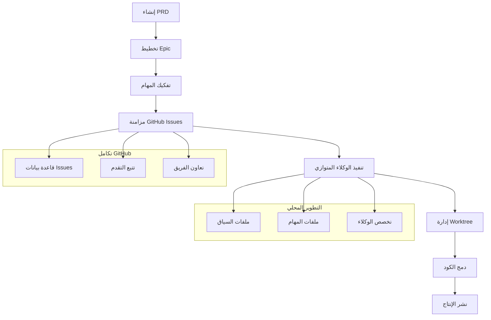

⏱️ **وقت القراءة المتوقع**: 15 دقيقة

## مقدمة: تجاوز البرمجة بالحدس

كل فريق تطوير يواجه نفس قتلة الإنتاجية:

- **اختفاء السياق** بين الجلسات، مما يضطر إلى إعادة الاكتشاف المستمر
- **العمل المتوازي يخلق تضارباً** عندما يعمل مطورون متعددون على نفس الكود
- **انحراف المتطلبات** عندما تتجاوز القرارات الشفهية المواصفات المكتوبة
- **التقدم يصبح غير مرئي** حتى النهاية

[Claude Code Project Management (CCPM)](https://github.com/automazeio/ccpm) يحل كل هذه المشاكل بنهج ثوري يغير طريقة عمل التطوير بمساعدة الذكاء الاصطناعي.

### ما الذي يجعل CCPM ثورياً؟

تدفقات العمل التقليدية لـ Claude Code تعمل في عزلة - مطور واحد يعمل مع AI في بيئته المحلية. CCPM يكسر هذا القيد باستخدام **GitHub Issues كقاعدة بيانات** و**Git worktrees للتنفيذ المتوازي**.

| التطوير التقليدي | نظام CCPM |
|-----------------|-----------|
| فقدان السياق بين الجلسات | **سياق مستمر** عبر كل العمل |
| تنفيذ تسلسلي للمهام | **وكلاء متوازيون** على مهام مستقلة |
| "برمجة بالحدس" من الذاكرة | **موجّه بالمواصفات** مع تتبع كامل |
| تقدم مخفي في الفروع | **مسار تدقيق شفاف** في GitHub |
| تنسيق يدوي للمهام | **تحديد أولويات ذكي** |

## نظرة عامة على هيكل النظام



## المتطلبات المسبقة والإعداد

### متطلبات النظام

- macOS (مُوصى) أو Linux
- Git 2.30+
- Claude Code (مساعد الترميز من Anthropic)
- GitHub CLI (`gh`)
- Node.js 18+ (لبعض نصوص الأتمتة)

### نص اختبار سريع لـ macOS

لمستخدمي macOS، يمكنك استخدام نص الاختبار التلقائي الخاص بنا للتحقق من بيئتك وتجربة CCPM:

```bash
# تحميل وتشغيل نص اختبار CCPM
curl -fsSL https://raw.githubusercontent.com/automazeio/ccpm/main/scripts/test-workflow.sh | bash

# أو إذا كان لديك هذا المستودع محلياً:
./scripts/test-ccpm-workflow.sh
```

سيقوم هذا النص بـ:
- ✅ فحص كل المتطلبات المسبقة للنظام
- ✅ إنشاء مشروع اختبار مع CCPM مُثبت
- ✅ التحقق من التثبيت
- ✅ إنشاء ملفات PRD وEpic نموذجية
- ✅ اختبار تكامل GitHub CLI (إن أمكن)
- ✅ توفير الخطوات التالية لتكامل Claude Code

### التثبيت السريع (دقيقتان)

**الخطوة 1: استنساخ CCPM في مشروعك**

```bash
# الانتقال إلى دليل مشروعك
cd path/to/your/project/

# استنساخ نظام CCPM
git clone https://github.com/automazeio/ccpm.git .
```

> ⚠️ **مهم**: إذا كان لديك بالفعل دليل `.claude`، استنسخ إلى دليل مؤقت ودمج المحتويات يدوياً.

**الخطوة 2: تهيئة نظام PM**

```bash
# في Claude Code، شغّل:
/pm:init
```

هذا الأمر سيقوم بـ:
- تثبيت GitHub CLI (عند الحاجة)
- المصادقة مع GitHub
- تثبيت امتداد `gh-sub-issue` لعلاقات الوالد-الطفل
- إنشاء الأدلة المطلوبة
- تحديث `.gitignore`

**الخطوة 3: تكوين إعدادات المستودع**

إنشاء أو تحديث `CLAUDE.md`:

```bash
# في Claude Code:
/init include rules from .claude/CLAUDE.md

# إذا كان لديك CLAUDE.md بالفعل:
/re-init
```

**الخطوة 4: تحضير النظام**

```bash
# تهيئة نظام السياق
/context:create
```

## سير العمل الأساسي: من الفكرة إلى الإنتاج

### المرحلة 1: إنشاء PRD (وثيقة متطلبات المنتج)

أساس CCPM هو **التطوير المُوجّه بالمواصفات**. كل شيء يبدأ بـ PRD شامل.

**بدء ميزة جديدة:**

```bash
/pm:prd-new memory-system
```

هذا يطلق **جلسة عصف ذهني تفاعلية** تنشئ PRD مفصل يغطي:

- **تعريف المشكلة**: ما الذي نحله بالضبط؟
- **مؤشرات النجاح**: كيف نقيس النجاح؟
- **قصص المستخدم**: من يستفيد وكيف؟
- **القيود التقنية**: ما هي حدودنا؟
- **الحالات الحدية**: ما الذي قد يخطئ؟
- **نقاط التكامل**: كيف يتناسب هذا مع الأنظمة الموجودة؟

**مثال على هيكل PRD:**

```markdown
# PRD نظام الذاكرة

## تعريف المشكلة
المستخدمون يفقدون السياق بين جلسات Claude Code، مما يؤدي إلى تفسيرات متكررة ودورات تطوير أبطأ.

## مؤشرات النجاح
- تقليل وقت إعادة إنشاء السياق بنسبة 90%
- تقليل الأسئلة المتكررة بنسبة 75%
- فهم مستمر للمشروع عبر الجلسات

## قصص المستخدم
- كمطور، أريد Claude أن يتذكر قراراتنا المعمارية السابقة
- كقائد فريق، أريد سياقاً ثابتاً عبر أعضاء الفريق
- كمدير منتج، أريد متطلبات الميزة محفوظة بين الجلسات

## الهيكل التقني
- تخزين ذاكرة قائم على الملفات في `.claude/memory/`
- تحميل سياق تلقائي عند بدء الجلسة
- فئات ذاكرة منظمة (قرارات، أنماط، قيود)

## نقاط التكامل
- هيكل دليل `.claude/` الموجود
- GitHub Issues لتتبع التقدم
- Git hooks لتحديث الذاكرة التلقائي
```

### المرحلة 2: تخطيط Epic وتفكيك المهام

بمجرد اكتمال PRD الخاص بك، حوله إلى epic قابل للتنفيذ مع مهام مفصلة.

**تحليل PRD إلى Epic:**

```bash
/pm:prd-parse memory-system
```

هذا ينشئ:
- **نظرة عامة على Epic** بأهداف واضحة
- **تفكيك تقني** للمكونات المطلوبة
- **قائمة مهام** مع تحديد التبعيات
- **تقديرات الجهد** لكل مكون
- **خطة تنفيذ متوازي** لأقصى كفاءة

**مثال على هيكل Epic:**

```
Epic: تنفيذ نظام الذاكرة

├── المهمة 1: بنية الذاكرة الأساسية
│   ├── إنشاء نظام تخزين الذاكرة
│   ├── تنفيذ تحميل السياق
│   └── إضافة خطافات ثبات الذاكرة
│
├── المهمة 2: واجهة إدارة الذاكرة
│   ├── تصميم عمليات CRUD للذاكرة
│   ├── بناء وظيفة البحث في الذاكرة
│   └── إنشاء أدوات تصور الذاكرة
│
└── المهمة 3: التكامل والاختبار
    ├── التكامل مع تدفقات العمل الموجودة
    ├── إضافة مجموعة اختبار شاملة
    └── إنشاء التوثيق والأمثلة
```

### المرحلة 3: تكامل GitHub وإنشاء Issue

حوّل epic الخاص بك إلى مشروع GitHub منظم مع تتبع كامل.

**Epic واحد إلى GitHub:**

```bash
/pm:epic-oneshot memory-system
```

هذا الأمر:
1. **ينشئ issue epic والد** في GitHub
2. **يولد issues مهام فرعية** مع علاقات صحيحة
3. **يضع تسميات ومعالم** للتنظيم
4. **يهيئ تتبع التقدم** مع مؤشرات الإكمال
5. **ينشئ ملفات مهام محلية** مربوطة بـ GitHub issues

**مثال على هيكل GitHub:**

```
Issue #1234 (Epic): تنفيذ نظام الذاكرة
├── Issue #1235: بنية الذاكرة الأساسية  
├── Issue #1236: واجهة إدارة الذاكرة
└── Issue #1237: التكامل والاختبار
```

كل issue يحتوي على:
- مواصفات تقنية مفصلة
- معايير القبول
- التبعيات والشروط المسبقة
- تقدير الجهد والتعقيد
- روابط للـ issues والتوثيق ذات الصلة

### المرحلة 4: تنفيذ الوكلاء المتوازي

هنا حيث CCMP يتألق حقاً - **وكلاء متخصصون متعددون يعملون بشكل متزامن**.

**بدء العمل على Issues:**

```bash
# بدء عمل البنية
/pm:issue-start 1235

# بالتوازي، بدء عمل الواجهة
/pm:issue-start 1236

# والتحضير للاختبار
/pm:issue-start 1237
```

**ما يحدث خلف الكواليس:**

1. **تخصص الوكيل**: كل وكيل يركز على مجاله المحدد
   - **وكيل البنية**: مخططات قواعد البيانات، أنظمة الملفات، المنطق الأساسي
   - **وكيل الواجهة**: APIs، واجهات المستخدم، نقاط التكامل  
   - **وكيل الاختبار**: مجموعات الاختبار، التحقق، التوثيق

2. **إدارة Worktree**: كل issue يحصل على Git worktree منفصل
   ```
   ../epic-memory-system/
   ├── main/           # فرع التطوير الرئيسي
   ├── issue-1235/     # عمل البنية
   ├── issue-1236/     # تطوير الواجهة  
   └── issue-1237/     # الاختبار والتكامل
   ```

3. **عزل السياق**: الوكلاء يحافظون على سياقات منفصلة
   ```
   .claude/context/
   ├── epic-memory-system/
   │   ├── infrastructure-context.md
   │   ├── interface-context.md
   │   └── testing-context.md
   ```

### المرحلة 5: إدارة التقدم والتنسيق

راقب ونسق العمل عبر كل التدفقات المتوازية.

**فحص الحالة العامة:**

```bash
/pm:status
```

**مثال على مخرجات الحالة:**
```
تقدم Memory System Epic: 67% مكتمل

✅ Issue #1235: البنية الأساسية (مكتمل)
   - نظام تخزين الذاكرة ✅
   - تحميل السياق ✅  
   - خطافات الثبات ✅

🚧 Issue #1236: واجهة الإدارة (قيد التقدم)
   - عمليات CRUD ✅
   - وظيفة البحث 🚧
   - أدوات التصور ⏳

⏳ Issue #1237: التكامل والاختبار (في الانتظار)
   - تكامل تدفق العمل ⏳
   - مجموعة الاختبار ⏳
   - التوثيق ⏳
```

**الحصول على المهمة التالية بالأولوية:**

```bash
/pm:next
```

هذا يقترح بذكاء أهم مهمة تالية بناءً على:
- **التبعيات**: ما الذي يحجب العمل الآخر؟
- **تقديرات الجهد**: انتصارات سريعة مقابل مهام معقدة
- **سعة الفريق**: ما يمكن القيام به بالتوازي؟
- **أولوية العمل**: ما يحقق قيمة أسرع؟

## الميزات المتقدمة والأوامر

### أوامر إدارة تدفق العمل

**تقرير الاجتماع اليومي:**
```bash
/pm:standup
```
ينتج تقرير حالة شامل مثالي لاجتماعات الفريق اليومية.

**العثور على المهام المحجوبة:**
```bash
/pm:blocked
```
يحدد المهام التي تنتظر التبعيات أو العوامل الخارجية.

**عرض العمل قيد التقدم:**
```bash
/pm:in-progress
```
يسرد كل تدفقات التطوير النشطة حالياً.

### أوامر المزامنة

**مزامنة ثنائية الاتجاه كاملة:**
```bash
/pm:sync
```
يزامن كل التغييرات المحلية مع GitHub ويسحب تحديثات أعضاء الفريق.

**استيراد Issues موجودة:**
```bash
/pm:import
```
يجلب GitHub issues الموجودة إلى نظام CCMP للإدارة.

### أوامر الصيانة

**التحقق من سلامة النظام:**
```bash
/pm:validate
```
يفحص التسق بين الملفات المحلية وحالة GitHub.

**تنظيف العمل المكتمل:**
```bash
/pm:clean
```
يؤرشف epics والمهام المكتملة للحفاظ على منطقة العمل منظمة.

**البحث عبر المحتوى:**
```bash
/pm:search "منطق المصادقة"
```
يجد المعلومات ذات الصلة عبر كل PRDs وepics والمهام.

## مثال من العالم الحقيقي: بناء نظام مصادقة المستخدم

لنمر عبر مثال كامل من الفكرة إلى الإنتاج.

### الخطوة 1: إنشاء PRD

```bash
/pm:prd-new user-authentication
```

**PRD المُولَّد (مختصر):**
```markdown
# PRD نظام مصادقة المستخدم

## تعريف المشكلة
تطبيقنا يفتقر إلى مصادقة مستخدم آمنة، مما يمنع التجارب الشخصية وحماية البيانات.

## مؤشرات النجاح
- دعم 10,000+ مستخدم متزامن
- وقت استجابة مصادقة <200ms
- وقت تشغيل 99.9% لخدمات المصادقة
- تكامل OAuth مع Google، GitHub، Apple

## المتطلبات التقنية
- إدارة جلسة قائمة على JWT
- تشفير كلمة المرور باستخدام bcrypt
- تحديد معدل محاولات تسجيل الدخول
- دعم المصادقة متعددة العوامل
- ثبات الجلسة عبر الأجهزة
```

### الخطوة 2: التحليل إلى Epic

```bash
/pm:prd-parse user-authentication
```

**هيكل Epic المُولَّد:**
```
Epic: نظام مصادقة المستخدم

├── مخطط قاعدة البيانات والنماذج (2-3 أيام)
│   ├── تصميم جدول المستخدم
│   ├── جداول إدارة الجلسة  
│   └── جداول مزود OAuth
│
├── خدمة المصادقة (3-4 أيام)  
│   ├── إدارة رمز JWT
│   ├── تشفير/التحقق من كلمة المرور
│   ├── تكامل مزود OAuth
│   └── إدارة دورة حياة الجلسة
│
├── نقاط النهاية API (2-3 أيام)
│   ├── نقاط نهاية تسجيل الدخول/الخروج
│   ├── تدفق التسجيل
│   ├── وظيفة إعادة تعيين كلمة المرور
│   └── APIs إدارة الملف الشخصي
│
├── تكامل الواجهة الأمامية (2-3 أيام)
│   ├── نماذج تسجيل الدخول/التسجيل
│   ├── إدارة حالة المصادقة
│   ├── معالجة المسار المحمي
│   └── أزرار تسجيل دخول OAuth
│
└── الأمان والاختبار (2-3 أيام)
    ├── تدقيق أمني واختبار اختراق
    ├── مجموعة اختبار شاملة
    ├── قياس الأداء
    └── التوثيق وأدلة النشر
```

### الخطوة 3: إنشاء GitHub Issues

```bash
/pm:epic-oneshot user-authentication
```

**Issues المُنشَأة:**
- Issue #1240 (Epic): نظام مصادقة المستخدم
  - Issue #1241: مخطط قاعدة البيانات والنماذج
  - Issue #1242: خدمة المصادقة  
  - Issue #1243: نقاط النهاية API
  - Issue #1244: تكامل الواجهة الأمامية
  - Issue #1245: الأمان والاختبار

### الخطوة 4: التنفيذ المتوازي

```bash
# بدء عمل قاعدة البيانات
/pm:issue-start 1241

# بالتزامن بدء طبقة الخدمة
/pm:issue-start 1242  

# وتحضير هيكل API
/pm:issue-start 1243
```

**تنسيق الوكيل:**
- **وكيل قاعدة البيانات**: ينشئ مخططات، ترحيلات، ونماذج بيانات
- **وكيل الخدمة**: ينفذ منطق JWT، تدفقات OAuth، إدارة الجلسة
- **وكيل API**: يبني نقاط نهاية REST مع التحقق المناسب ومعالجة الأخطاء

كل وكيل يعمل في عزلة لكن ينسق من خلال:
- تعريفات واجهة مشتركة
- هياكل بيانات مشتركة
- استراتيجيات اختبار منسقة

### الخطوة 5: التكامل والنشر

```bash
# فحص نقاط التكامل
/pm:epic-show user-authentication

# التحقق من أن كل المكونات تعمل معاً
/pm:validate

# الحالة الأخيرة قبل النشر
/pm:status
```

**التكامل النهائي:**
كل worktrees تدمج مرة أخرى في الفرع الرئيسي مع:
- نظام مصادقة كامل
- تغطية اختبار شاملة
- توثيق كامل
- تكوين جاهز للنشر

## أفضل الممارسات ونصائح المحترفين

### 1. جودة PRD هي كل شيء

**استثمر الوقت في PRDs مفصلة:**
- اقضي 20-30% من وقت المشروع في إنشاء PRD
- تضمين الحالات الحدية وسيناريوهات الأخطاء
- تعريف مؤشرات النجاح بوضوح
- توثيق متطلبات التكامل بدقة

**أنماط PRD المضادة لتجنبها:**
- متطلبات غامضة ("اجعله سريعاً")
- سيناريوهات معالجة أخطاء مفقودة
- مؤشرات نجاح غير معرفة
- عدم اعتبار قيود النظام الموجود

### 2. استراتيجية تفكيك المهام

**حجم المهمة الأمثل:**
- 1-3 أيام عمل لكل مهمة
- تعريفات مدخل/مخرج واضحة
- تبعيات دنيا بين المهام
- معايير إكمال قابلة للاختبار

**تفكيك ودود للتوازي:**
```bash
# جيد: فصل واضح للاهتمامات
- المهمة A: طبقة قاعدة البيانات
- المهمة B: منطق العمل  
- المهمة C: طبقة API
- المهمة D: مكونات الواجهة الأمامية

# سيء: تبعيات تسلسلية
- المهمة 1: ابدأ كل شيء
- المهمة 2: تابع كل شيء  
- المهمة 3: أنه كل شيء
```

### 3. إدارة السياق

**احتفظ بالسياقات مركزة:**
- كل وكيل يحافظ على سياق خاص بالمجال
- الخيط الرئيسي يبقى استراتيجياً، وليس تكتيكياً
- تنظيف السياق المنتظم يمنع التضخم
- توثيق القرارات الرئيسية في الذاكرة المستمرة

**أنماط السياق المضادة:**
- خلط تفاصيل التنفيذ في الخيط الرئيسي
- الوكلاء يتشاركون سياقات متداخلة
- عدم تنظيف سياقات العمل المكتمل أبداً
- فقدان القرارات المعمارية بين الجلسات

### 4. تعاون الفريق

**نظافة GitHub Issue:**
- عناوين issue واضحة وقابلة للتنفيذ
- معايير قبول مفصلة
- تحديثات تقدم منتظمة في التعليقات
- تسمية وتعيين معالم مناسبة

**تعاون إنسان-AI:**
- الإنسان يمكن أن يقفز إلى أي issue في أي وقت
- تقدم AI مرئي من خلال تعليقات GitHub
- مراجعات الكود تحدث طبيعياً من خلال PRs
- لا حاجة لأدوات خاصة لتنسيق الفريق

## مؤشرات الأداء والنتائج

الفرق التي تستخدم CCMP تبلغ عن تحسينات كبيرة:

### سرعة التطوير
- **5-8 مهام متوازية** مقابل 1 سابقاً
- **أسرع حتى 3 مرات** في تسليم الميزات
- **تقليل 89%** في الوقت المفقود للتبديل بين السياقات
- **تقليل 75%** في معدلات الأخطاء

### جودة الكود
- **تتبع كامل** من المتطلبات إلى الكود
- **تغطية اختبار شاملة** من خلال وكلاء اختبار مخصصة
- **معمارية ثابتة** من خلال التطوير الموجه بالمواصفات
- **توثيق أفضل** كنتيجة طبيعية

### إنتاجية الفريق
- **انتقالات سلسة** بين أعضاء الفريق
- **تقدم شفاف** مرئي لكل أصحاب المصلحة
- **اجتماعات أقل** بسبب التقدم ذاتي التوثيق
- **دقة تقدير محسنة** من خلال تفكيك المهام المفصل

## حل المشاكل الشائعة

### مشاكل الإعداد

**مصادقة GitHub CLI:**
```bash
gh auth status
gh auth login
```

**امتداد gh-sub-issue مفقود:**
```bash
gh extension install HackerNews/gh-sub-issue
```

**تضارب Worktree:**
```bash
# تنظيف worktrees تالفة
git worktree prune
git worktree remove ../epic-name/issue-123/
```

### مشاكل المزامنة

**عدم تطابق محلي-GitHub:**
```bash
/pm:validate
/pm:sync --force
```

**تلف السياق:**
```bash
/context:create --reset
```

### مشاكل الأداء

**وكلاء متوازيون كثيرون جداً:**
- احصر على 3-5 وكلاء متزامنين
- ركز على المهام بفصل واضح
- استخدم `/pm:next` لتحديد الأولويات الذكي

**إدارة حجم السياق:**
```bash
/pm:clean --aggressive
/context:compact
```

## التكوين المتقدم

### تخصص الوكيل المخصص

إنشاء وكلاء متخصصين لمجموعة التقنيات الخاصة بك:

```markdown
# .claude/agents/backend-agent.md
أنت متخصص تطوير backend يركز على:
- تصميم وتحسين قاعدة البيانات
- أمان وأداء API
- بنية الخادم والتوسع
- اختبار التكامل والمراقبة
```

### تخصيص تدفق العمل

تكييف CCMP لاحتياجات فريقك:

```yaml
# .claude/config/workflow.yml
epic_size: medium  # small, medium, large
parallel_limit: 5
auto_sync: true
github_labels:
  - "epic:feature"
  - "task:implementation"
  - "priority:high"
```

## خارطة الطريق المستقبلية والتوسعات

### الميزات المخططة
- **دعم متعدد المستودعات** للخدمات المجهرية
- **تكامل أنابيب CI/CD** للاختبار التلقائي
- **تحليلات متقدمة** حول سرعة التطوير
- **لوحات أداء الفريق** مع تصور المؤشرات

### توسعات المجتمع
- **تكامل Slack/Discord** لإشعارات الفريق
- **مزامنة Jira** للبيئات المؤسسية  
- **قوالب تدفق عمل مخصصة** لأنواع مشاريع مختلفة
- **تكامل مراجعة كود مدعوم بـ AI**

## الخلاصة: تغيير طريقة شحن الفرق للبرمجيات

CCMP يمثل تحولاً جوهرياً في كيفية عمل التطوير بمساعدة AI. بالانتقال من المحادثات المعزولة إلى التنفيذ التعاوني، القابل للتتبع، والمتوازي، يمكن للفرق:

1. **الشحن بشكل أسرع** من خلال التنفيذ المتوازي الذكي
2. **الحفاظ على الجودة** من خلال التطوير الموجه بالمواصفات
3. **تحسين التعاون** مع تتبع التقدم الشفاف
4. **تقليل فقدان السياق** مع ذاكرة المشروع المستمرة
5. **التوسع بفعالية** كلما نمت الفرق والمشاريع

النظام مختبر في المعركة من قبل فرق تشحن برمجيات الإنتاج ويمثل مستقبل التعاون إنسان-AI في تطوير البرمجيات.

### البدء اليوم

1. **استنسخ CCMP** في مشروعك التالي
2. **ابدأ بميزة بسيطة** لتعلم تدفق العمل
3. **توسع إلى epics معقدة** كلما بنيت الثقة
4. **شارك مع فريقك** واختبر التطوير التعاوني مع AI

التحول من البرمجة بالحدس إلى التطوير المتوازي الموجه بالمواصفات يبدأ بأمر واحد:

```bash
/pm:prd-new your-next-feature
```

### الموارد والمجتمع

- **مستودع GitHub**: [https://github.com/automazeio/ccpm](https://github.com/automazeio/ccpm)
- **التوثيق**: أدلة شاملة في المستودع
- **المجتمع**: انضم للمناقشات في GitHub Issues
- **الدعم**: تابع [@aroussi](https://x.com/aroussi) للتحديثات والنصائح

---

*مستعد لثورة في تدفق عمل التطوير؟ ابدأ أول مشروع CCMP اليوم واختبر مستقبل تطوير البرمجيات بمساعدة AI.*
