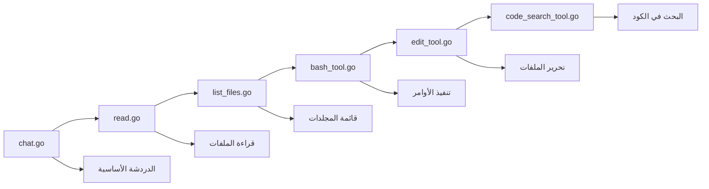

⏱️ **وقت القراءة المتوقع**: ١٥ دقيقة

## مقدمة: صعود وكلاء البرمجة الذكية

لقد شهدت بيئة تطوير الذكاء الاصطناعي ثورة حقيقية بفضل وكلاء البرمجة مثل Cursor وCline وAmp وWindsurf. هذه الأدوات تحول الطريقة التي يكتب بها المطورون الكود ويصححونه ويصونونه من خلال توفير مساعدة ذكية تفهم السياق وتنفذ الأوامر وتدير قواعد الكود بأكملها.

يوفر [مستودع ورشة العمل من Geoffrey Huntley](https://github.com/ghuntley/how-to-build-a-coding-agent) دليلاً شاملاً لبناء وكيل البرمجة الخاص بك من الصفر. سيأخذك هذا البرنامج التعليمي عبر العملية بأكملها، من وظائف الدردشة الأساسية إلى قدرات البحث المتقدمة في الكود.

## لماذا نبني وكيل البرمجة الخاص بنا؟

### فهم الأساس

بناء وكيل البرمجة الخاص بك يوفر عدة مزايا:

- **السيطرة الكاملة**: تخصيص كل جانب من جوانب سلوك الوكيل
- **فرصة للتعلم**: فهم عميق لهندسة الوكلاء الذكية
- **تحسين التكاليف**: تخصيص استخدام الموارد حسب احتياجاتك المحددة
- **الخصوصية**: الاحتفاظ بالكود الحساس على البنية التحتية الخاصة بك
- **القابلية للتوسع**: إضافة أدوات وتكاملات مخصصة

### قدرات وكلاء البرمجة الحديثة

وكلاء البرمجة اليوم عادة ما تتضمن:

١. **واجهة اللغة الطبيعية**: تفاعل قائم على الدردشة مع المطورين
٢. **عمليات نظام الملفات**: قراءة وكتابة وإدارة ملفات المشروع
٣. **البحث في الكود**: مطابقة الأنماط المتقدمة واكتشاف الكود
٤. **تنفيذ الأوامر**: تشغيل أوامر النظام وعمليات البناء
٥. **الوعي بالسياق**: فهم هيكل المشروع والتبعيات

## نظرة عامة على هندسة الورشة

تتبع الورشة نهج التحسين التدريجي مع ستة تطبيقات منفصلة، كل منها يبني على السابق:



## المرحلة الأولى: وكيل الدردشة الأساسي (chat.go)

### الهندسة الأساسية

تبدأ الأسس بواجهة دردشة بسيطة تؤسس نمط حلقة المحادثة:

```go
type Agent struct {
    client      *anthropic.Client
    getUserMessage func() (string, bool)
    tools       []ToolDefinition
    verbose     bool
}
```

### نقاط التعلم الرئيسية

- **تكامل API**: اتصال مباشر بـ Anthropic Claude API
- **إدارة المحادثة**: الحفاظ على تاريخ الدردشة والسياق
- **معالجة الأخطاء**: إدارة قوية للأخطاء لاستدعاءات API
- **واجهة المستخدم**: أنماط التفاعل القائمة على المحطة الطرفية

### أبرز التنفيذ

يُظهر وكيل الدردشة:
- الاستجابات المتدفقة للتفاعل في الوقت الفعلي
- إدارة حالة المحادثة
- آليات الاسترداد الأساسية من الأخطاء
- قدرات التسجيل والتصحيح

## المرحلة الثانية: وكيل قراءة الملفات (read.go)

### أساس تكامل الأدوات

تقدم هذه المرحلة نظام الأدوات الذي يصبح محورياً لجميع الوكلاء اللاحقين:

```go
type ToolDefinition struct {
    Name        string
    Description string
    InputSchema ToolInputSchemaParam
    Function    func(input json.RawMessage) (string, error)
}
```

### تنفيذ أداة قراءة الملفات

```go
type ReadFileInput struct {
    Path string `json:"path" jsonschema:"description=مسار الملف للقراءة"`
}

func ReadFile(input json.RawMessage) (string, error) {
    var params ReadFileInput
    if err := json.Unmarshal(input, &params); err != nil {
        return "", err
    }
    
    content, err := os.ReadFile(params.Path)
    if err != nil {
        return "", fmt.Errorf("فشل في قراءة الملف: %w", err)
    }
    
    return string(content), nil
}
```

### نمط تسجيل الأدوات

تؤسس الورشة نمطاً متسقاً لتسجيل الأدوات:

```go
var readFileTool = ToolDefinition{
    Name:        "read_file",
    Description: "قراءة محتويات الملف",
    InputSchema: GenerateSchema[ReadFileInput](),
    Function:    ReadFile,
}
```

## المرحلة الثالثة: التنقل في نظام الملفات (list_files.go)

### عمليات المجلدات

بناءً على قراءة الملفات، تضيف هذه المرحلة قدرات اجتياز المجلدات:

```go
type ListFilesInput struct {
    Path string `json:"path" jsonschema:"description=مسار المجلد لعرض محتوياته"`
}
```

### إدارة محسنة للملفات

توفر أداة قائمة الملفات:
- مسح المجلدات بشكل تكراري
- تصفية أنواع الملفات
- تطبيع المسارات
- معالجة الأخطاء للصلاحيات ومشاكل الوصول

### تنسيق الأدوات المتعددة

تُظهر هذه المرحلة كيف تعمل الأدوات المتعددة معاً:
- `read_file` للوصول للمحتوى
- `list_files` للاكتشاف
- العمليات المنسقة للمهام المعقدة

## المرحلة الرابعة: تكامل النظام (bash_tool.go)

### قدرات تنفيذ الأوامر

تقدم أداة bash العمليات على مستوى النظام:

```go
type BashInput struct {
    Command string `json:"command" jsonschema:"description=أمر bash للتنفيذ"`
}

func BashCommand(input json.RawMessage) (string, error) {
    var params BashInput
    if err := json.Unmarshal(input, &params); err != nil {
        return "", err
    }
    
    cmd := exec.Command("bash", "-c", params.Command)
    output, err := cmd.CombinedOutput()
    
    return string(output), err
}
```

### اعتبارات الأمان والحماية

تتناول الورشة الجوانب الأمنية الحاسمة:
- تحقق من صحة الأوامر وتعقيمها
- التقاط المخرجات ومعالجة الأخطاء
- إدارة العمليات والمهلة الزمنية
- ضوابط الصلاحيات والوصول

### التطبيقات الواقعية

مع تنفيذ الأوامر، يمكن للوكيل:
- تشغيل عمليات البناء والاختبار
- تثبيت التبعيات والحزم
- تنفيذ عمليات git
- إجراء تشخيصات النظام

## المرحلة الخامسة: تحرير الكود (edit_tool.go)

### محرك تعديل الملفات

تمثل أداة التحرير قفزة كبيرة في القدرات:

```go
type EditFileInput struct {
    Path   string `json:"path" jsonschema:"description=مسار الملف للتحرير"`
    OldStr string `json:"old_str" jsonschema:"description=النص المراد استبداله"`
    NewStr string `json:"new_str" jsonschema:"description=النص البديل"`
}
```

### التحقق والأمان

تنفذ أداة التحرير عدة آليات أمان:
- التحقق من المحتوى قبل التعديل
- إنشاء نسخ احتياطية لإمكانية الاستعادة
- عمليات ذرية لمنع التحريرات الجزئية
- توليد الفروق لتتبع التغييرات

### ميزات التحرير المتقدمة

تشمل القدرات الرئيسية:
- استبدال دقيق للنصوص
- التعامل مع المحتوى متعدد الأسطر
- المحافظة على المسافات البادئة
- إدارة الترميز ومجموعات الأحرف

## المرحلة السادسة: اكتشاف الكود (code_search_tool.go)

### تكامل Ripgrep

تضيف المرحلة الأخيرة بحثاً قوياً في الكود باستخدام ripgrep:

```go
type CodeSearchInput struct {
    Pattern       string `json:"pattern" jsonschema:"description=نمط البحث"`
    Path          string `json:"path,omitempty" jsonschema:"description=مسار البحث"`
    FileType      string `json:"file_type,omitempty" jsonschema:"description=مرشح نوع الملف"`
    CaseSensitive bool   `json:"case_sensitive,omitempty" jsonschema:"description=بحث حساس لحالة الأحرف"`
}
```

### قدرات البحث المتقدمة

توفر أداة البحث في الكود:
- مطابقة أنماط التعبيرات النمطية
- تصفية أنواع الملفات للبحث المستهدف
- خيارات الحساسية لحالة الأحرف
- تضمين أسطر السياق
- تحسين الأداء لقواعد الكود الكبيرة

### أنماط استراتيجيات البحث

الأنماط الشائعة للبحث تشمل:
- تعريفات الدوال والطرق
- إعلانات المتغيرات والثوابت
- تحليل الاستيراد والتبعيات
- اكتشاف تعليقات TODO وFIXME
- تحديد أنماط معالجة الأخطاء

## إعداد بيئة التطوير

### المتطلبات المسبقة والتبعيات

تستخدم الورشة ممارسات التطوير الحديثة:

```yaml
# devenv.yaml
name: coding-agent-workshop
starship: true

imports:
  - devenv-nixpkgs

env:
  ANTHROPIC_API_KEY: "your-api-key-here"

languages:
  go:
    enable: true
    package: "go_1_24"
```

### فوائد البيئة

استخدام devenv يوفر:
- بيئات تطوير قابلة للاستنساخ
- إدارة تلقائية للتبعيات
- التوافق عبر المنصات
- اتساق الإصدارات بين أعضاء الفريق

## غوص عميق في هندسة نظام الأدوات

### توليد المخطط

تُظهر الورشة التوليد التلقائي لمخطط JSON:

```go
func GenerateSchema[T any]() ToolInputSchemaParam {
    schema := jsonschema.Reflect(&struct{ T }{})
    return ToolInputSchemaParam{
        Type:       "object",
        Properties: schema.Properties,
        Required:   schema.Required,
    }
}
```

### نمط حلقة الأحداث

جميع الوكلاء تتبع حلقة أحداث متسقة:

١. **دخل المستخدم**: قبول وتحقق من أوامر المستخدم
٢. **بناء السياق**: تجميع تاريخ المحادثة
٣. **طلب API**: إرسال الطلب إلى Claude مع الأدوات المتاحة
٤. **تنفيذ الأدوات**: معالجة طلبات استخدام الأدوات
٥. **دمج النتائج**: دمج مخرجات الأدوات مع استجابات AI
٦. **تسليم الاستجابة**: تقديم النتائج النهائية للمستخدم

### استراتيجية معالجة الأخطاء

تنفذ الورشة معالجة شاملة للأخطاء:
- تحقق من صحة المدخلات وتعقيمها
- منطق استرداد وإعادة المحاولة لأخطاء API
- إدارة مهلة تنفيذ الأدوات
- رسائل خطأ ودية للمستخدم
- قدرات التصحيح والتسجيل

## الميزات المتقدمة والتوسعات

### التسجيل المفصل

جميع التطبيقات تدعم الوضع المفصل للتصحيح:

```bash
go run edit_tool.go --verbose
```

هذا يوفر رؤى مفصلة في:
- توقيت وأداء استدعاءات API
- تتبع تنفيذ الأدوات
- تفاصيل عمليات الملفات
- معلومات تشخيص الأخطاء

### تطوير أدوات مخصصة

يدعم الإطار توسع الأدوات بسهولة:

```go
func CustomTool(input json.RawMessage) (string, error) {
    // تنفيذ الأداة المخصصة
    return result, nil
}

var customToolDef = ToolDefinition{
    Name:        "custom_tool",
    Description: "وظيفة مخصصة",
    InputSchema: GenerateSchema[CustomInput](),
    Function:    CustomTool,
}
```

## الاختبار والتحقق

### ملفات العينة

يتضمن المستودع ملفات اختبار للتجريب:
- `fizzbuzz.js`: كود JavaScript لممارسة التحرير
- `riddle.txt`: محتوى نصي لاختبارات القراءة
- `AGENT.md`: وثائق للتحليل

### سيناريوهات الاختبار

النهج الموصى به للاختبار:

١. **الوظائف الأساسية**: قراءة الملفات وإدراجها
٢. **تكامل النظام**: تنفيذ الأوامر والتقاط المخرجات
٣. **تعديل الكود**: التحرير الآمن والتحقق
٤. **عمليات البحث**: مطابقة الأنماط والاكتشاف
٥. **حالات الخطأ**: التعامل مع الفشل والحالات الحدية

## اعتبارات الإنتاج

### أفضل ممارسات الأمان

عند نشر وكلاء البرمجة:
- تنفيذ المصادقة والتفويض المناسبين
- تعقيم جميع مدخلات وأوامر المستخدم
- استخدام بيئات تنفيذ معزولة
- مراقبة وتسجيل جميع أنشطة الوكيل
- تنفيذ حدود المعدل وضوابط الاستخدام

### تحسين الأداء

الاستراتيجيات الرئيسية للتحسين:
- تخزين مؤقت للملفات ونتائج البحث المتكررة
- تنفيذ التحميل الكسول لقواعد الكود الكبيرة
- استخدام الاستجابات المتدفقة للعمليات الطويلة
- تحسين ترتيب تنفيذ الأدوات والتوازي
- مراقبة استخدام الذاكرة وتنظيف الموارد

### تخطيط القابلية للتوسع

للنشر على نطاق أوسع:
- تنفيذ التوسع الأفقي مع توزيع الأحمال
- استخدام التخزين المؤقت الموزع للحالة المشتركة
- النظر في هندسة الخدمات الدقيقة لعزل الأدوات
- التخطيط لجلسات المستخدمين المتزامنة
- تنفيذ المراقبة والملاحظة المناسبة

## المشاكل الشائعة والاستكشاف

### مشاكل تكامل API

المشاكل الشائعة والحلول:
- **حدود المعدل**: تنفيذ التراجع الأسي
- **المصادقة**: تحقق من تكوين مفتاح API
- **مشاكل الشبكة**: إضافة منطق إعادة المحاولة مع قواطع الدائرة
- **تحليل الاستجابة**: التحقق من توافق مخطط JSON

### تحديات تنفيذ الأدوات

المشاكل الشائعة:
- **أخطاء الصلاحيات**: فحص صلاحيات نظام الملفات
- **مشاكل المسار**: تطبيع والتحقق من مسارات الملفات
- **فشل الأوامر**: تنفيذ التقاط مناسب للأخطاء
- **حدود الموارد**: مراقبة استخدام الذاكرة والمعالج

## الخطوات التالية والمواضيع المتقدمة

### تحسينات الميزات

اعتبارات إضافية:
- قدرات كشط الويب للمحتوى الخارجي
- تكامل قاعدة البيانات للتخزين الدائم
- تكامل API للخدمات الخارجية
- دعم متعدد اللغات بخلاف Go
- واجهات رسومية للمستخدمين غير التقنيين

### تطور الهندسة

الأنماط المتقدمة للاستكشاف:
- الهندسة القائمة على الأحداث مع قوائم انتظار الرسائل
- أنظمة المكونات الإضافية للوظائف القابلة للتوسع
- تنسيق الوكلاء الموزعة
- تكامل التعلم الآلي لتكيف السلوك
- ميزات التعاون في الوقت الفعلي

## سكريبت اختبار قابل للتنفيذ

### سكريبت إعداد بيئة macOS

```bash
#!/bin/bash
# setup-coding-agent.sh
# إعداد بيئة ورشة عمل وكيل البرمجة

set -e

echo "🚀 بدء إعداد بيئة ورشة عمل وكيل البرمجة..."

# فحص تثبيت Go
if ! command -v go &> /dev/null; then
    echo "❌ Go غير مثبت."
    echo "يرجى تثبيت Go من https://golang.org/dl/"
    exit 1
fi

# فحص إصدار Go
GO_VERSION=$(go version | awk '{print $3}' | sed 's/go//')
REQUIRED_VERSION="1.24.0"

if [[ "$(printf '%s\n' "$REQUIRED_VERSION" "$GO_VERSION" | sort -V | head -n1)" != "$REQUIRED_VERSION" ]]; then
    echo "❌ يجب أن يكون إصدار Go $REQUIRED_VERSION أو أحدث. الحالي: $GO_VERSION"
    exit 1
fi

# استنساخ مستودع الورشة
WORKSHOP_DIR="coding-agent-workshop"
if [ ! -d "$WORKSHOP_DIR" ]; then
    echo "📦 استنساخ مستودع الورشة..."
    git clone https://github.com/ghuntley/how-to-build-a-coding-agent.git "$WORKSHOP_DIR"
fi

cd "$WORKSHOP_DIR"

# تثبيت التبعيات
echo "📚 تثبيت التبعيات..."
go mod tidy

# فحص إعداد مفتاح API
if [ -z "$ANTHROPIC_API_KEY" ]; then
    echo "⚠️  يرجى تعيين متغير البيئة ANTHROPIC_API_KEY."
    echo "export ANTHROPIC_API_KEY='your-api-key-here'"
    echo ""
fi

# إنشاء ملفات الاختبار
echo "📝 إنشاء ملفات الاختبار..."

cat > test-example.py << 'EOF'
# ملف مثال Python
def fibonacci(n):
    """حساب متتالية فيبوناتشي."""
    if n <= 1:
        return n
    return fibonacci(n-1) + fibonacci(n-2)

def main():
    """الدالة الرئيسية"""
    for i in range(10):
        print(f"fibonacci({i}) = {fibonacci(i)}")

if __name__ == "__main__":
    main()
EOF

cat > test-riddle.txt << 'EOF'
لدي عرف لكني لست أسداً،
ولدي أربعة أرجل لكني لست طاولة،
ويمكنني الجري لكني لست إنساناً.
فما أنا؟

الجواب: حصان
EOF

echo "✅ تم إكمال إعداد البيئة!"
echo ""
echo "🎯 طريقة الاستخدام:"
echo "1. الدردشة الأساسية: go run chat.go"
echo "2. قراءة الملفات: go run read.go"
echo "3. قائمة الملفات: go run list_files.go"
echo "4. تنفيذ الأوامر: go run bash_tool.go"
echo "5. تحرير الملفات: go run edit_tool.go"
echo "6. البحث في الكود: go run code_search_tool.go"
echo ""
echo "🔍 التسجيل المفصل: استخدم العلامة --verbose"
echo "مثال: go run edit_tool.go --verbose"
```

## الخلاصة

بناء وكيل البرمجة من الصفر يوفر رؤى لا تقدر بثمن حول التطوير المدعوم بالذكاء الاصطناعي. تقدم [ورشة عمل how-to-build-a-coding-agent](https://github.com/ghuntley/how-to-build-a-coding-agent) نهجاً منظماً ومتدرجاً يأخذك من وظائف الدردشة الأساسية إلى مساعد برمجة كامل الميزات.

التقدم السداسي المراحل—من المحادثة البسيطة إلى البحث المتقدم في الكود—يُظهر كيف يمكن بناء أنظمة الذكاء الاصطناعي المعقدة تدريجياً. كل مرحلة تقدم مفاهيم أساسية بينما تبني على الأسس السابقة، مما يخلق فهماً شاملاً لهندسة الوكلاء.

### النقاط الرئيسية

١. **التطوير التدريجي**: ابدأ بساطة وأضف التعقيد تدريجياً
٢. **التصميم المتمحور حول الأدوات**: بناء أنظمة أدوات قابلة للإعادة الاستخدام والتركيب
٣. **الأمان أولاً**: تنفيذ التحقق ومعالجة الأخطاء في جميع أنحاء
٤. **الاختبار الواقعي**: استخدام أمثلة عملية وحالات حدية
٥. **الاستعداد للإنتاج**: النظر في الأمان والأداء وقابلية التوسع

بيئة التطوير الحديثة تعتمد بشكل متزايد على أدوات مدعومة بالذكاء الاصطناعي. فهم كيفية بناء وتخصيص هذه الوكلاء يضعك في مقدمة هذا التطور التكنولوجي. سواء كنت تبني أدوات داخلية، أو تساهم في مشاريع مفتوحة المصدر، أو تصنع منتجات تجارية، فإن المبادئ والممارسات المُظهرة في هذه الورشة توفر أساساً قوياً للنجاح.

ابدأ بوكيل الدردشة الأساسي، وتقدم خلال كل مرحلة بشكل منهجي، وسرعان ما ستحصل على وكيل برمجة متطور مصمم خصيصاً لاحتياجاتك ومتطلبات عملك المحددة.
