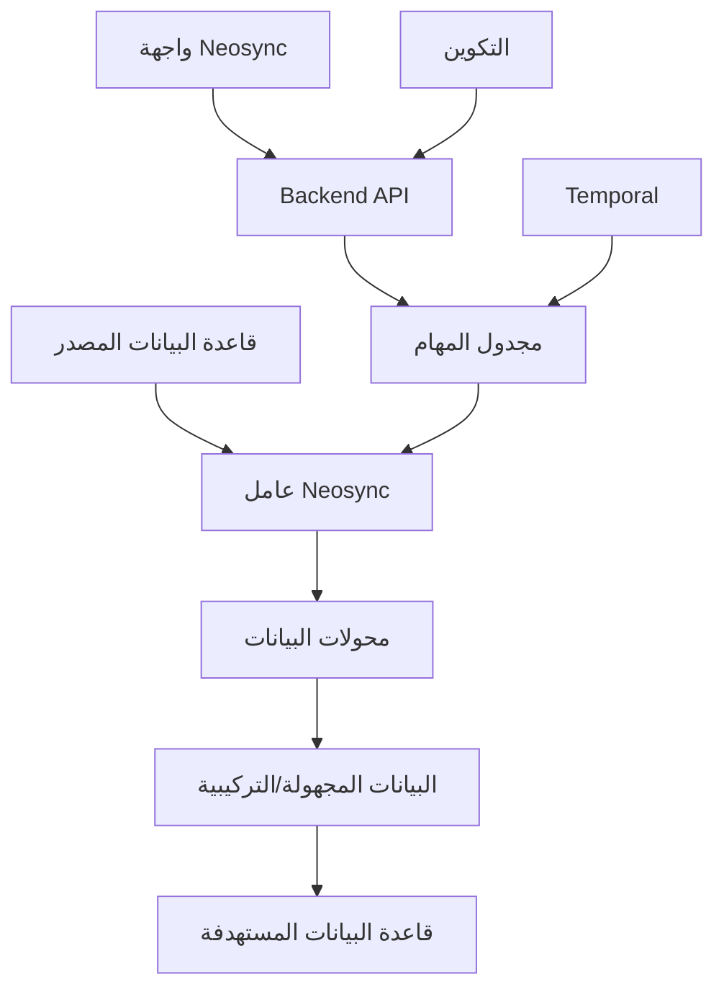

⏱️ **وقت القراءة المتوقع**: 15 دقيقة

## مقدمة إلى Neosync ونظرة عامة

[**Neosync**](https://github.com/nucleuscloud/neosync) هي منصة مفتوحة المصدر وموجهة للمطورين تُحدث ثورة في كيفية تعامل المؤسسات مع البيانات الحساسة. توفر حلولًا شاملة لـ **إخفاء هوية البيانات** و **توليد البيانات التركيبية** و **مزامنة البيئات** لمساعدة الشركات على اختبار البيانات على مستوى الإنتاج بأمان مع الحفاظ على الامتثال للوائح حماية الخصوصية مثل GDPR وHIPAA وFERPA.

### لماذا Neosync مهم؟

في بيئة التطوير الحديثة المدفوعة بالبيانات، يحتاج المطورون إلى الوصول لبيانات واقعية للاختبار والتصحيح والتطوير. ومع ذلك، استخدام بيانات الإنتاج الفعلية يطرح مخاطر أمنية وامتثال كبيرة. Neosync يسد هذه الفجوة من خلال توفير:

1. **اختبار آمن لبيانات الإنتاج** - إخفاء هوية البيانات الحساسة للتطوير المحلي
2. **إعادة إنتاج أخطاء الإنتاج** - إنشاء مجموعات بيانات آمنة وممثلة للتصحيح
3. **بيانات اختبار عالية الجودة** - توليد بيانات على مستوى الإنتاج لبيئات التدريج وضمان الجودة
4. **حل الامتثال** - تقليل نطاق الامتثال للوائح GDPR وHIPAA وFERPA
5. **بذر قواعد بيانات التطوير** - إنشاء بيانات تركيبية للاختبار الوحدوي والعروض التوضيحية

### نظرة عامة على الميزات الرئيسية

- **توليد البيانات التركيبية** بناءً على المخطط الموجود
- **إخفاء هوية بيانات الإنتاج** مع الحفاظ على سلامة المراجع
- **تقسيم قاعدة البيانات** باستخدام استعلامات SQL للاختبار المركز
- **أرشيتيكتة خط أنابيب غير متزامن** مع إعادة المحاولة التلقائية ومعالجة الأخطاء
- **تكامل GitOps** لإدارة التكوين التصريحي
- **محولات مدمجة** لأنواع البيانات الرئيسية (البريد الإلكتروني، الأسماء، العناوين، إلخ)
- **محولات مخصصة** باستخدام JavaScript أو LLMs
- **دعم قواعد بيانات متعددة** - تكامل PostgreSQL وMySQL وS3

## المتطلبات المسبقة وإعداد البيئة

### متطلبات النظام

قبل بدء هذا الدليل، تأكد من وجود:

- **Docker & Docker Compose** (أحدث إصدار)
- **Git** (لاستنساخ المستودع)
- **عميل PostgreSQL** (اختياري، لاختبار الاتصالات)
- **متصفح ويب** (للوصول إلى واجهة Neosync)
- **macOS أو Linux أو Windows** (مع WSL2)

### خطوات التثبيت

لنبدأ بإعداد Neosync على جهازك المحلي:

#### الخطوة 1: استنساخ المستودع

```bash
# استنساخ مستودع Neosync
git clone https://github.com/nucleuscloud/neosync.git
cd neosync

# فحص هيكل المستودع
ls -la
```

#### الخطوة 2: تشغيل خدمات Neosync

يوفر Neosync إعداد Docker Compose جاهز للإنتاج:

```bash
# تشغيل جميع خدمات Neosync
make compose/up

# أو استخدام Docker Compose مباشرة
docker compose up -d
```

ستقوم هذه الأوامر بـ:
- تحميل وتشغيل جميع الحاويات المطلوبة
- إعداد قاعدة بيانات PostgreSQL لبيانات Neosync الوصفية
- تشغيل Neosync backend API
- بدء واجهة الويب الأمامية
- تهيئة الاتصالات والمهام النموذجية

#### الخطوة 3: التحقق من التثبيت

```bash
# فحص الحاويات قيد التشغيل
docker compose ps

# عرض السجلات عند الحاجة
docker compose logs -f neosync-app
```

ادخل إلى Neosync على `http://localhost:3000` في متصفح الويب.

## فهم أرشيتيكتة Neosync

### المكونات الأساسية

يتكون Neosync من عدة مكونات مترابطة:

1. **الواجهة الأمامية (Next.js)** - واجهة ويب للتكوين والمراقبة
2. **Backend API (Go)** - منطق العمل الأساسي وتنسيق المهام
3. **خدمة العامل** - معالجة مهام معالجة وتحويل البيانات
4. **قاعدة بيانات PostgreSQL** - تخزين البيانات الوصفية والتكوينات وحالة المهام
5. **Temporal** - تنسيق سير العمل لتنفيذ المهام الموثوق

### أرشيتيكتة تدفق البيانات



## التكوين والإعداد الأولي

### الوصول إلى لوحة القيادة

1. افتح متصفحك وانتقل إلى `http://localhost:3000`
2. ستظهر لوحة قيادة الترحيب الخاصة بـ Neosync
3. يأتي النظام مع اتصالات نموذجية مُكوّنة مسبقًا للتوضيح

### فهم الاتصالات

**الاتصالات** في Neosync تمثل نقاط نهاية قاعدة البيانات أو التخزين. يتضمن الإعداد الافتراضي:

- **اتصال المصدر** - قاعدة بيانات PostgreSQL مع بيانات نموذجية
- **اتصال الوجهة** - قاعدة البيانات المستهدفة للبيانات المجهولة

### نظرة عامة على البيانات النموذجية

يتضمن Neosync بيانات نموذجية مُعبأة مسبقًا لإظهار إمكانياته:

```sql
-- هيكل المخطط النموذجي
CREATE TABLE users (
    id SERIAL PRIMARY KEY,
    first_name VARCHAR(50),
    last_name VARCHAR(50),
    email VARCHAR(100) UNIQUE,
    phone VARCHAR(20),
    birth_date DATE,
    salary DECIMAL(10,2)
);

CREATE TABLE orders (
    id SERIAL PRIMARY KEY,
    user_id INTEGER REFERENCES users(id),
    order_date TIMESTAMP,
    total_amount DECIMAL(10,2),
    status VARCHAR(20)
);
```

## إنشاء أول مهمة إخفاء هوية

### معالج تكوين المهمة

لننشئ مهمة إخفاء هوية البيانات التي تحول المعلومات الحساسة مع الحفاظ على علاقات البيانات:

#### الخطوة 1: إنشاء مهمة جديدة

1. انقر على **"المهام (Jobs)"** في قائمة التنقل
2. اختر **"إنشاء مهمة (Create Job)"**
3. اختر نوع المهمة **"إخفاء هوية البيانات (Data Anonymization)"**
4. اضبط اسم المهمة: `user-data-anonymization`

#### الخطوة 2: تكوين اتصال المصدر

```yaml
# إعدادات اتصال المصدر
نوع الاتصال: PostgreSQL
المضيف: localhost
المنفذ: 5432
قاعدة البيانات: sample_db
اسم المستخدم: postgres
كلمة المرور: [مقدمة في compose]
```

#### الخطوة 3: تعريف قواعد التحويل

لجدول `users`، قم بتكوين هذه التحويلات:

| العمود | المحول | التكوين |
|--------|---------|----------|
| `first_name` | توليد الاسم الأول | توليد عشوائي |
| `last_name` | توليد اسم العائلة | توليد عشوائي |
| `email` | تحويل البريد الإلكتروني | الحفاظ على هيكل النطاق |
| `phone` | توليد رقم الهاتف | التنسيق: +966-XX-XXX-XXXX |
| `birth_date` | تحويل التاريخ | عشوائية ±5 سنوات |
| `salary` | تحويل رقمي | عشوائية ±20% |

#### الخطوة 4: الحفاظ على سلامة المراجع

تكوين علاقات المفاتيح الخارجية:

```yaml
# الحفاظ على علاقات user_id في جدول orders
المفاتيح الخارجية:
  - الجدول المصدر: orders
    العمود المصدر: user_id
    الجدول المرجعي: users
    العمود المرجعي: id
    الإجراء: preserve_relationship
```

#### الخطوة 5: تنفيذ المهمة

```bash
# مراقبة تنفيذ المهمة عبر CLI (اختياري)
docker compose exec neosync-worker neosync jobs run --job-id=user-data-anonymization

# أو استخدام واجهة الويب
# انقر "تشغيل المهمة" في لوحة القيادة
```

## توليد البيانات التركيبية

### إنشاء مجموعات البيانات التركيبية

يمكن لـ Neosync توليد بيانات تركيبية كاملة تتطابق مع قيود المخطط:

#### الخطوة 1: تحليل المخطط

```sql
-- تحليل المخطط الموجود
SELECT 
    column_name,
    data_type,
    is_nullable,
    column_default
FROM information_schema.columns 
WHERE table_name = 'users';
```

#### الخطوة 2: تكوين التوليد التركيبي

أنشئ مهمة جديدة بهذه الإعدادات:

```yaml
نوع المهمة: توليد البيانات التركيبية
الصفوف المستهدفة: 10000
توزيع البيانات:
  users:
    - first_name: weighted_random([أسماء_عربية_شائعة])
    - last_name: weighted_random([عائلات_عربية])
    - email: generate_email(first_name, last_name)
    - age_distribution: normal(mean=35, std=12)
    - salary_distribution: lognormal(mean=15000, std=5000)  # بالريال السعودي
```

#### الخطوة 3: أنماط تركيبية متقدمة

```javascript
// محول مخصص لتوليد بريد إلكتروني واقعي
function generateEmail(firstName, lastName) {
    const domains = ['gmail.com', 'hotmail.com', 'yahoo.com', 'company.sa'];
    const domain = domains[Math.floor(Math.random() * domains.length)];
    const username = `${firstName.toLowerCase()}.${lastName.toLowerCase()}`;
    return `${username}@${domain}`;
}

// توليد بيانات مترابطة
function generateSalary(experience, education) {
    const baseSalary = 8000;  // راتب أساسي بالريال السعودي
    const experienceMultiplier = experience * 500;
    const educationBonus = education === 'ماجستير' ? 2000 : 
                          education === 'دكتوراه' ? 4000 : 0;
    
    return baseSalary + experienceMultiplier + educationBonus;
}
```

## تحويلات البيانات المتقدمة

### محولات JavaScript المخصصة

يدعم Neosync التحويلات المخصصة باستخدام JavaScript:

```javascript
// إخفاء هوية رقم بطاقة الائتمان
function anonymizeCreditCard(value) {
    if (!value || value.length < 4) return value;
    
    const lastFour = value.slice(-4);
    const masked = '*'.repeat(value.length - 4);
    return masked + lastFour;
}

// إخفاء هوية العنوان مع الحفاظ على المنطقة الجغرافية
function anonymizeAddress(address, city, state) {
    return {
        street: generateRandomStreet(),
        city: city, // الحفاظ على المدينة للتحليل الجغرافي
        state: state,
        zipCode: generateRandomZipInState(state)
    };
}

// إخفاء هوية الطابع الزمني مع الحفاظ على نمط الوقت
function anonymizeTimestamp(timestamp) {
    const date = new Date(timestamp);
    const randomDays = Math.floor(Math.random() * 365) - 182; // ±6 أشهر
    date.setDate(date.getDate() + randomDays);
    return date.toISOString();
}
```

### التحويلات المدعومة بـ LLM

للتحويلات الأكثر تطورًا، يمكن لـ Neosync التكامل مع نماذج اللغة الكبيرة:

```yaml
# تكوين محول LLM
المحول: LLM_Transform
النموذج: gpt-3.5-turbo
المطالبة: |
  حول مراجعة العميل هذه لإزالة المعلومات الشخصية 
  مع الحفاظ على المشاعر وملاحظات المنتج الرئيسية:
  
  الأصل: "{review_text}"
  
  المتطلبات:
  - إزالة الأسماء والمواقع والتواريخ المحددة
  - الحفاظ على ميزات المنتج المذكورة
  - الحفاظ على النبرة العاطفية
  - الحفاظ على طول المراجعة مماثل

Temperature: 0.3
Max_Tokens: 300
```

## تكامل قاعدة البيانات والتقسيم

### تكامل PostgreSQL

تكوين اتصال PostgreSQL لبيانات الإنتاج:

```yaml
# إعداد PostgreSQL للإنتاج
الاتصال:
  type: postgresql
  host: prod-db.company.com
  port: 5432
  database: production_db
  username: neosync_reader
  password: ${NEOSYNC_DB_PASSWORD}
  ssl_mode: require
  
# أذونات القراءة فقط للأمان
الأذونات:
  - SELECT على public.*
  - لا توجد أذونات كتابة
```

### استراتيجيات تقسيم البيانات

إنشاء مجموعات بيانات مركزة للاختبار:

```sql
-- تقسيم قائم على المستخدم
SELECT * FROM users 
WHERE created_at >= '2024-01-01' 
  AND account_type = 'premium'
LIMIT 1000;

-- تقسيم مدرك للعلاقات
WITH sample_users AS (
    SELECT id FROM users 
    WHERE region = 'SA-RIYADH' 
    LIMIT 500
)
SELECT o.* FROM orders o
JOIN sample_users su ON o.user_id = su.id
WHERE o.order_date >= '2024-01-01';

-- تقسيم زمني مع سلامة المراجع
SELECT * FROM events 
WHERE event_date BETWEEN '2024-07-01' AND '2024-07-31'
  AND user_id IN (
    SELECT id FROM users 
    WHERE last_active >= '2024-06-01'
  );
```

### تكامل MySQL

```yaml
# تكوين اتصال MySQL
الاتصال:
  type: mysql
  host: mysql-server.internal
  port: 3306
  database: app_database
  username: neosync_user
  password: ${MYSQL_PASSWORD}
  charset: utf8mb4
  
# إعدادات خاصة بـ MySQL
الخيارات:
  sql_mode: STRICT_TRANS_TABLES
  time_zone: Asia/Riyadh
  max_connections: 10
```

## أتمتة سير العمل وGitOps

### التكوين التصريحي

إنشاء تكوينات مهام قابلة لإعادة الاستخدام:

```yaml
# .neosync/jobs/user-anonymization.yaml
apiVersion: neosync.dev/v1
kind: Job
metadata:
  name: user-data-anonymization
  namespace: development
spec:
  source:
    connection: prod-postgres
    tables:
      - users
      - user_profiles
      - user_preferences
  
  destination:
    connection: dev-postgres
    
  transformations:
    users:
      first_name:
        type: generate_first_name
      last_name:
        type: generate_last_name
      email:
        type: transform_email
        preserve_domain: true
      ssn:
        type: hash_value
        algorithm: sha256
    
    user_profiles:
      bio:
        type: llm_transform
        model: gpt-3.5-turbo
        prompt: "إخفاء هوية التفاصيل الشخصية مع الحفاظ على المعلومات المهنية"
  
  schedule:
    cron: "0 2 * * *"  # يوميًا في الساعة 2 صباحًا
    timezone: Asia/Riyadh
```

### تكامل CI/CD

```yaml
# .github/workflows/data-sync.yml
name: مزامنة بيانات Neosync

on:
  schedule:
    - cron: '0 6 * * 1'  # كل يوم اثنين في الساعة 6 صباحًا
  workflow_dispatch:

jobs:
  sync-development-data:
    runs-on: ubuntu-latest
    steps:
      - uses: actions/checkout@v3
      
      - name: إعداد Neosync CLI
        run: |
          curl -sSL https://install.neosync.dev | sh
          echo "$HOME/.neosync/bin" >> $GITHUB_PATH
      
      - name: تشغيل مهمة الإخفاء
        env:
          NEOSYNC_API_TOKEN: ${{ secrets.NEOSYNC_API_TOKEN }}
          NEOSYNC_API_URL: ${{ secrets.NEOSYNC_API_URL }}
        run: |
          neosync jobs run \
            --job-config .neosync/jobs/user-anonymization.yaml \
            --wait-for-completion \
            --timeout 30m
      
      - name: التحقق من جودة البيانات
        run: |
          neosync validate \
            --connection dev-postgres \
            --check referential-integrity \
            --check data-quality
```

## المراقبة وقابلية الملاحظة

### لوحة قيادة مراقبة المهام

يوفر Neosync إمكانيات مراقبة شاملة:

1. **حالة تنفيذ المهام** - تتبع التقدم في الوقت الفعلي
2. **مقاييس تحويل البيانات** - عدد الصفوف ومعدلات التحويل
3. **تتبع الأخطاء** - التحويلات الفاشلة ومنطق إعادة المحاولة
4. **مقاييس الأداء** - وقت التنفيذ وتحليل الإنتاجية
5. **فحوصات جودة البيانات** - نتائج التحقق واكتشاف الشذوذ

### المقاييس والتنبيهات

```yaml
# تكوين المراقبة
المراقبة:
  المقاييس:
    - job_duration_seconds
    - rows_processed_total
    - transformation_errors_total
    - data_quality_score
  
  التنبيهات:
    - name: job_failure
      condition: job_status == "failed"
      notification: slack_webhook
      
    - name: data_quality_degradation
      condition: data_quality_score < 0.95
      notification: email
      
    - name: long_running_job
      condition: job_duration_seconds > 3600
      notification: pagerduty
```

### تحليل السجلات

```bash
# عرض سجلات تنفيذ المهام
docker compose logs neosync-worker | grep "job_id=user-anonymization"

# مراقبة أداء التحويل
docker compose logs neosync-worker | grep "transformation_stats"

# فحص الأخطاء
docker compose logs neosync-worker | grep "ERROR"
```

## الأمان والامتثال

### أفضل ممارسات خصوصية البيانات

1. **مبدأ أقل امتياز** - منح الحد الأدنى من الأذونات الضرورية
2. **سياسات الاحتفاظ بالبيانات** - حذف البيانات المجهولة القديمة تلقائيًا
3. **تسجيل المراجعة** - تتبع جميع الوصول للبيانات والتحويلات
4. **التشفير** - تشفير البيانات أثناء النقل والتخزين
5. **ضوابط الوصول** - وصول قائم على الأدوار لمستويات حساسية البيانات المختلفة

### ميزات امتثال GDPR

```yaml
# تكوين امتثال GDPR
GDPR:
  حقوق_موضوع_البيانات:
    الحق_في_النسيان:
      enabled: true
      retention_days: 90
      
    حق_الوصول:
      enabled: true
      response_time_days: 30
      
    قابلية_نقل_البيانات:
      enabled: true
      export_formats: [json, csv, xml]
  
  إدارة_الموافقة:
    track_consent_changes: true
    consent_expiry_days: 365
    
  إخطار_الانتهاك:
    enabled: true
    notification_time_hours: 72
```

### امتثال حماية البيانات

```yaml
# امتثال قوانين حماية البيانات العربية
حماية_البيانات:
  تحديد_البيانات_الشخصية:
    automatic_detection: true
    custom_patterns:
      - رقم_الهوية: '\d{10}'
      - رقم_الجوال: '05\d{8}'
      
  طريقة_الإخفاء:
    إزالة_المعرفات_المباشرة: true
    التحكم_في_الإفصاح_الإحصائي: true
    
  ضوابط_المراجعة:
    تسجيل_كل_الوصول: true
    احتفاظ_السجلات_سنوات: 5
```

## تحسين الأداء

### تكوين المعالجة المتوازية

```yaml
# إعدادات تحسين الأداء
الأداء:
  تزامن_العامل: 8
  حجم_الدفعة: 1000
  حد_الذاكرة: "4Gi"
  
  اتصالات_قاعدة_البيانات:
    أقصى_مفتوح: 25
    أقصى_خامل: 5
    عمر_الاتصال: "5m"
  
  ذاكرة_التحويل_المؤقتة:
    enabled: true
    size: "1Gi"
    ttl: "1h"
```

### التعامل مع مجموعات البيانات الكبيرة

```sql
-- معالجة مجزأة للجداول الكبيرة
SELECT * FROM large_table 
WHERE id BETWEEN ? AND ?
ORDER BY id 
LIMIT 10000;

-- تدفق فعال للذاكرة
SET work_mem = '256MB';
SET maintenance_work_mem = '1GB';
```

## دليل استكشاف الأخطاء وإصلاحها

### المشاكل الشائعة والحلول

#### المشكلة 1: انتهاء مهلة المهمة

```yaml
# الحل: زيادة المهلة وتحسين حجم الدفعة
المهمة:
  timeout: 3600s  # ساعة واحدة
  batch_size: 500  # دفعات أصغر
  retry_attempts: 3
```

#### المشكلة 2: مشاكل الذاكرة

```bash
# مراقبة استخدام الذاكرة
docker stats neosync-worker

# زيادة ذاكرة الحاوية
docker compose up -d --scale neosync-worker=2
```

#### المشكلة 3: فشل الاتصال

```yaml
# تكوين اتصال قوي
الاتصال:
  retry_attempts: 5
  retry_delay: 30s
  connection_timeout: 60s
  read_timeout: 300s
```

### وضع التصحيح

```bash
# تفعيل تسجيل التصحيح
export NEOSYNC_LOG_LEVEL=debug
docker compose up -d

# عرض سجلات مفصلة
docker compose logs -f neosync-worker | grep DEBUG
```

## الاختبار والتحقق

لننشئ نص اختبار شامل للتحقق من إعداد Neosync:

```bash
#!/bin/bash
# الملف: test-neosync-setup.sh

echo "🚀 اختبار إعداد Neosync..."

# الاختبار 1: فحص تشغيل الخدمات
echo "📡 فحص خدمات Neosync..."
if curl -f http://localhost:3000/health > /dev/null 2>&1; then
    echo "✅ واجهة Neosync متاحة"
else
    echo "❌ واجهة Neosync غير متاحة"
    exit 1
fi

# الاختبار 2: التحقق من اتصال قاعدة البيانات
echo "🗄️ اختبار اتصال قاعدة البيانات..."
docker compose exec neosync-app neosync connections test --connection-id=sample-postgres
if [ $? -eq 0 ]; then
    echo "✅ اتصال قاعدة البيانات ناجح"
else
    echo "❌ فشل اتصال قاعدة البيانات"
fi

# الاختبار 3: تشغيل مهمة إخفاء هوية نموذجية
echo "🔄 تشغيل مهمة إخفاء هوية نموذجية..."
JOB_ID=$(docker compose exec neosync-app neosync jobs create \
    --name "test-anonymization" \
    --source-connection sample-postgres \
    --destination-connection sample-postgres-dest)

docker compose exec neosync-app neosync jobs run --job-id=$JOB_ID --wait

# الاختبار 4: التحقق من البيانات المجهولة
echo "🔍 التحقق من البيانات المجهولة..."
docker compose exec postgres psql -U postgres -d neosync -c \
    "SELECT COUNT(*) as anonymized_records FROM users_anonymized;"

echo "✅ اكتمل اختبار إعداد Neosync بنجاح!"
```

## الخطوات التالية والاستخدام المتقدم

### النشر للإنتاج

للنشر في الإنتاج، يجب مراعاة:

1. **نشر Kubernetes** - استخدام Helm charts المقدمة
2. **التوفر العالي** - نشر عدة مثيلات عامل
3. **قاعدة بيانات خارجية** - استخدام PostgreSQL مُدار للبيانات الوصفية
4. **إدارة الأسرار** - التكامل مع HashiCorp Vault أو AWS Secrets Manager
5. **توزيع الأحمال** - توزيع طلبات API عبر مثيلات متعددة

### أنماط التكامل

```yaml
# تكامل الخدمات المصغرة
الخدمات:
  خدمة-المستخدم:
    مهمة_الإخفاء: user-data-anonymization
    الجدولة: "0 3 * * *"
    
  خدمة-الطلبات:
    مهمة_الإخفاء: order-data-anonymization
    يعتمد_على: [خدمة-المستخدم]
    
  خدمة-التحليلات:
    مهمة_البيانات_التركيبية: analytics-synthetic-data
    مصدر_المخطط: production_analytics
```

### الإضافات المخصصة

```go
// محول مخصص في Go
package transformers

type CustomTransformer struct {
    config TransformerConfig
}

func (t *CustomTransformer) Transform(value interface{}) (interface{}, error) {
    // تنفيذ منطق التحويل المخصص
    return transformedValue, nil
}
```

## الخلاصة

يوفر Neosync حلًا شاملًا لتحديات خصوصية البيانات والاختبار الحديثة. من خلال تنفيذ إخفاء هوية البيانات المناسب وتوليد البيانات التركيبية، يمكن للمؤسسات:

- **تسريع التطوير** - وصول آمن لبيانات على مستوى الإنتاج
- **تحسين جودة البيانات** - سيناريوهات اختبار واقعية وحالات حدية
- **ضمان الامتثال** - حماية خصوصية آلية للصناعات المنظمة
- **تقليل المخاطر** - إزالة التعرض لبيانات الإنتاج الحساسة
- **توسيع الاختبار** - توليد مجموعات بيانات تركيبية غير محدودة لسيناريوهات مختلفة

خيارات التكوين التصريحي للمنصة وتكامل GitOps وخيارات التخصيص الواسعة تجعلها مناسبة للمؤسسات من جميع الأحجام، من الشركات الناشئة إلى النشر على مستوى المؤسسة.

### النقاط الرئيسية

1. **ابدأ بساطة** - ابدأ بمهام إخفاء هوية أساسية وأضف التعقيد تدريجيًا
2. **احفظ العلاقات** - احفظ دائمًا سلامة المراجع في تحويلاتك
3. **راقب الجودة** - نفذ فحوصات جودة البيانات لضمان فعالية التحويل
4. **أتمت كل شيء** - استخدم تكامل GitOps وCI/CD لتوفير البيانات المتسق
5. **خطط للنطاق** - صمم خطوط أنابيب التحويل مع مراعاة حجم الإنتاج

### موارد للتعلم الإضافي

- [**وثائق Neosync**](https://docs.neosync.dev) - أدلة شاملة ومرجع API
- [**مجتمع Discord**](https://discord.gg/neosync) - تواصل مع مستخدمين آخرين واحصل على الدعم
- [**مستودع GitHub**](https://github.com/nucleuscloud/neosync) - كود المصدر وتتبع المشاكل
- [**المدونة والدروس**](https://www.neosync.dev/blog) - أحدث الميزات وحالات الاستخدام

---

**تحتاج مساعدة؟** انضم إلى مجتمع Neosync على Discord أو افتح مشكلة على GitHub للحصول على الدعم التقني وطلبات الميزات.
