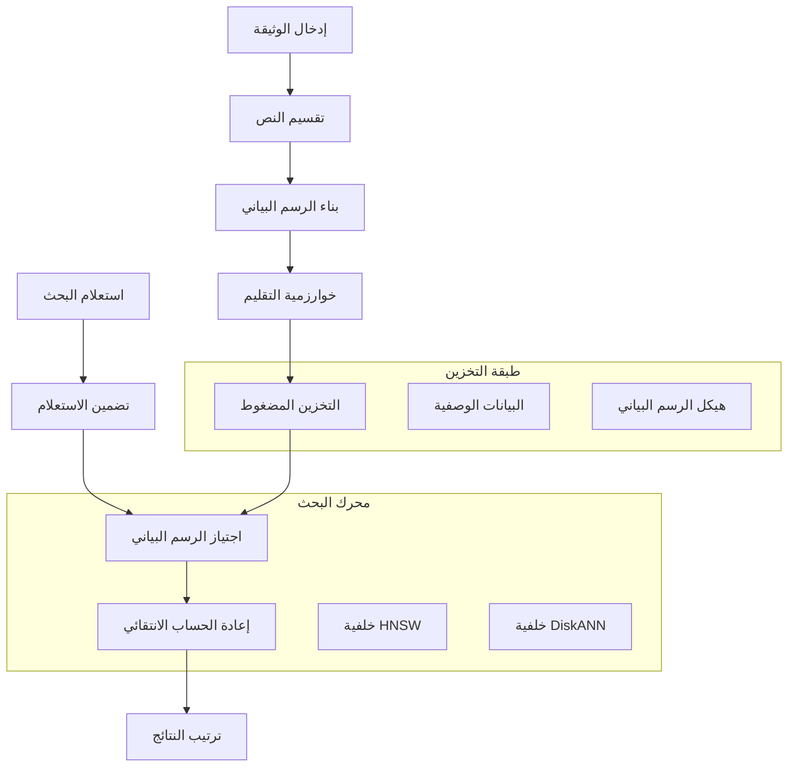

⏱️ **وقت القراءة المتوقع**: 12 دقيقة

> **الخلاصة** LEANN هو نظام فهرسة شعاعية ثوري يحقق **توفير 97% من مساحة التخزين** مقارنة بقواعد البيانات الشعاعية التقليدية مع الحفاظ على أداء البحث السريع والدقيق. يغطي هذا الدليل الشامل كل شيء من التثبيت الأساسي إلى الاستخدام المتقدم، مما يمكنك من بناء تطبيقات RAG فعالة بأقل متطلبات تخزين.

---

## ما هو LEANN؟

LEANN (Low-Storage Vector Index) هو نظام فهرسة شعاعية رائد طورته Berkeley Sky Computing Lab، والذي يعيد تصور طريقة عمل قواعد البيانات الشعاعية بشكل جذري. بدلاً من تخزين كل تضمين منفرد (وهو أمر مكلف)، يقوم LEANN بتخزين هيكل رسم بياني مُقلم ويعيد حساب التضمينات فقط عند الحاجة.

### ثورة التخزين

قواعد البيانات الشعاعية التقليدية مثل FAISS تخزن جميع التضمينات في الذاكرة، مما يؤدي إلى متطلبات تخزين ضخمة:

| مجموعة البيانات | قاعدة البيانات التقليدية | LEANN | التوفير |
|-----------------|---------------------------|-------|---------|
| DPR (2.1 مليون وثيقة) | 3.8 جيجابايت | 324 ميجابايت | **91%** |
| ويكيبيديا (60 مليون وثيقة) | 201 جيجابايت | 6 جيجابايت | **97%** |
| المحادثة (400 ألف وثيقة) | 1.8 جيجابايت | 64 ميجابايت | **97%** |
| البريد الإلكتروني (780 ألف وثيقة) | 2.4 جيجابايت | 79 ميجابايت | **97%** |

### الابتكار الأساسي: إعادة الحساب الانتقائي القائم على الرسم البياني

سحر LEANN يكمن في تقنياته الأساسية:

- **إعادة الحساب الانتقائي القائم على الرسم البياني**: حساب التضمينات فقط للعقد في مسار البحث
- **التقليم مع الحفاظ على الدرجة العالية**: الاحتفاظ بالعقد "المحورية" المهمة مع إزالة الاتصالات المتكررة
- **المعالجة الديناميكية بالدفعات**: معالجة فعالة لحسابات التضمين لاستخدام GPU
- **البحث ثنائي المستوى**: اجتياز ذكي للرسم البياني يعطي الأولوية للعقد الواعدة

## نظرة عامة على البنية



## دليل التثبيت

### المتطلبات المسبقة

- **Python**: 3.9 أو أحدث
- **نظام التشغيل**: macOS، Linux (دعم Windows قادم قريباً)
- **الذاكرة**: 4 جيجابايت RAM كحد أدنى (8 جيجابايت+ مُوصى به)
- **التخزين**: يختلف حسب حجم مجموعة البيانات (أقل بكثير من قواعد البيانات الشعاعية التقليدية)

### تثبيت البداية السريعة

```bash
# إنشاء بيئة افتراضية
python3 -m venv .venv
source .venv/bin/activate

# تثبيت uv لإدارة الحزم بشكل أسرع
pip install uv

# استنساخ مستودع LEANN
git clone https://github.com/yichuan-w/LEANN.git
cd LEANN

# تهيئة الوحدات الفرعية (مطلوب للتجميع)
git submodule update --init --recursive

# تثبيت LEANN
uv pip install -e .

# التحقق من التثبيت
leann --help
```

### التثبيت العام (مُوصى به)

للوصول على مستوى النظام وتكامل Claude Code:

```bash
# التثبيت العام باستخدام أداة uv
uv tool install leann-core --with leann

# التحقق من التثبيت العام
leann --help
```

## دليل الاستخدام الأساسي

### 1. بناء أول فهرس لك

لنبدأ بمثال بسيط باستخدام وثائق markdown:

```bash
# إنشاء وثائق اختبار
mkdir test-docs
cat > test-docs/ai-overview.md << 'EOF'
# نظرة عامة على الذكاء الاصطناعي

الذكاء الاصطناعي يحول طريقة عملنا وحياتنا. المجالات الرئيسية تشمل:

## التعلم الآلي
- التعلم المُشرف عليه
- التعلم غير المُشرف عليه
- التعلم التعزيزي

## التعلم العميق
- الشبكات العصبية
- الشبكات التطبيقية
- بنية المحولات

## التطبيقات
- معالجة اللغة الطبيعية
- رؤية الحاسوب
- الروبوتات والأتمتة
EOF

# بناء الفهرس
leann build ai-knowledge --docs ./test-docs
```

**الإخراج المتوقع:**
```
📂 Indexing 1 path:
  📁 Directories (1):
    1. /path/to/test-docs
Loading documents from 1 directory...
🔄 Processing 1 directory...
Loaded 1 documents, 3 chunks
Building index 'ai-knowledge' with hnsw backend...
Index built at .leann/indexes/ai-knowledge/documents.leann
```

### 2. البحث في الفهرس

```bash
# البحث الأساسي
leann search ai-knowledge "ما هو التعلم الآلي؟"

# البحث مع المزيد من النتائج
leann search ai-knowledge "الشبكات العصبية" --top-k 10

# البحث المتقدم مع ضبط التعقيد
leann search ai-knowledge "تطبيقات الذكاء الاصطناعي" --complexity 128
```

### 3. الأسئلة والأجوبة التفاعلية

```bash
# بدء المحادثة التفاعلية (يتطلب Ollama)
leann ask ai-knowledge --interactive

# استخدام مزود LLM محدد
leann ask ai-knowledge --llm openai --model gpt-4

# وضع السؤال الواحد
leann ask ai-knowledge "اشرح مفاهيم التعلم العميق"
```

### 4. إدارة الفهارس

```bash
# عرض قائمة جميع الفهارس
leann list

# إزالة فهرس
leann remove ai-knowledge

# الإزالة القسرية بدون تأكيد
leann remove ai-knowledge --force
```

## الميزات المتقدمة

### الفهرسة متعددة المصادر

LEANN يتفوق في فهرسة أنواع المحتوى المتنوعة:

```bash
# فهرسة عدة مجلدات وملفات
leann build comprehensive-docs \
  --docs ./documentation ./source-code ./config-files

# فهرسة أنواع ملفات محددة فقط
leann build presentations \
  --docs ./content \
  --file-types .pptx,.pdf,.docx

# فهرسة المحتوى المختلط
leann build mixed-content \
  --docs ./readme.md ./src/ ./config.json ./docs/
```

### اختيار الخلفية

LEANN يوفر خلفيتين قويتين:

#### خلفية HNSW (افتراضية)
- **الأفضل لـ**: معظم حالات الاستخدام، أقصى توفير في التخزين
- **الميزات**: إعادة حساب كاملة، مثالية للبيئات محدودة الذاكرة

```bash
leann build my-index --docs ./data --backend hnsw
```

#### خلفية DiskANN
- **الأفضل لـ**: مجموعات البيانات الكبيرة التي تتطلب أقصى سرعة بحث
- **الميزات**: اجتياز الرسم البياني القائم على PQ مع إعادة الترتيب في الوقت الفعلي

```bash
leann build my-index --docs ./data --backend diskann
```

### ضبط الأداء

#### معاملات البناء

```bash
# فهرس عالي الجودة (بناء أبطأ، بحث أفضل)
leann build high-quality \
  --docs ./data \
  --graph-degree 64 \
  --complexity 128

# بناء سريع (فهرسة أسرع، جيد للتطوير)
leann build fast-build \
  --docs ./data \
  --graph-degree 16 \
  --complexity 32

# تخزين مضغوط (أقصى توفير في المساحة)
leann build compact \
  --docs ./data \
  --compact
```

#### تحسين البحث

```bash
# بحث عالي الدقة
leann search my-index "استعلام" \
  --complexity 128 \
  --top-k 20

# بحث سريع (دقة أقل)
leann search my-index "استعلام" \
  --complexity 32 \
  --top-k 5

# استراتيجيات التقليم
leann search my-index "استعلام" \
  --pruning-strategy proportional
```

### تصفية البيانات الوصفية

LEANN يدعم تصفية البيانات الوصفية المتطورة:

```python
# مثال Python API
from leann import IndexBuilder, IndexSearcher

# البناء مع البيانات الوصفية
builder = IndexBuilder("filtered-index")
builder.add_text(
    "Python هي لغة برمجة",
    metadata={"language": "python", "difficulty": "beginner"}
)
builder.add_text(
    "مفاهيم التعلم الآلي المتقدمة",
    metadata={"topic": "ml", "difficulty": "advanced"}
)
builder.build()

# البحث مع المرشحات
searcher = IndexSearcher("filtered-index")
results = searcher.search(
    "مفاهيم البرمجة",
    metadata_filters={
        "difficulty": {"==": "beginner"},
        "language": {"in": ["python", "javascript"]}
    }
)
```

**عوامل التصفية المدعومة:**
- `==`, `!=`: المساواة/عدم المساواة
- `<`, `<=`, `>`, `>=`: المقارنات الرقمية
- `in`, `not_in`: عضوية القائمة
- `contains`, `starts_with`, `ends_with`: عمليات النص
- `is_true`, `is_false`: القيم المنطقية

## الفهرسة الواعية للكود

LEANN يوفر معالجة ذكية للكود مع تقسيم واعٍ لـ AST:

```bash
# فهرسة كود المصدر مع التقسيم الذكي
leann build codebase \
  --docs ./src ./tests ./config \
  --file-types .py,.js,.ts,.java,.cs

# النظام تلقائياً:
# - يحلل هيكل AST
# - يحافظ على حدود الدوال/الفئات
# - يحتفظ بسياق الكود
# - يفهرس التعليقات والتوثيق
```

**اللغات المدعومة:**
- Python
- JavaScript/TypeScript
- Java
- C#
- المزيد من اللغات قادم قريباً

## أمثلة التكامل

### تكامل Claude Code

LEANN يتكامل بسلاسة مع Claude Code عبر MCP (Model Context Protocol):

1. **التثبيت العام** (مطلوب):
```bash
uv tool install leann-core --with leann
```

2. **تكوين Claude Code** بإضافة إلى إعدادات MCP:
```json
{
  "mcpServers": {
    "leann": {
      "command": "leann_mcp"
    }
  }
}
```

3. **الاستخدام في Claude Code**:
```
@leann search my-codebase "منطق المصادقة"
@leann ask my-docs "كيفية تنفيذ OAuth؟"
```

### استخدام Python API

```python
from leann import IndexBuilder, IndexSearcher

# بناء الفهرس برمجياً
builder = IndexBuilder("my-index")
builder.add_directory("./documents")
builder.add_file("./important-doc.pdf")
builder.build(backend="hnsw", graph_degree=32)

# البحث برمجياً
searcher = IndexSearcher("my-index")
results = searcher.search("التعلم الآلي", top_k=10)

for result in results:
    print(f"النقاط: {result.score}")
    print(f"المحتوى: {result.content[:200]}...")
    print(f"البيانات الوصفية: {result.metadata}")
    print("---")
```

### تكامل LangChain

```python
from leann.integrations.langchain import LeannVectorStore
from langchain.chains import RetrievalQA
from langchain.llms import Ollama

# إنشاء مخزن LEANN الشعاعي
vector_store = LeannVectorStore("my-index")

# إنشاء سلسلة الاسترجاع
llm = Ollama(model="llama2")
qa_chain = RetrievalQA.from_chain_type(
    llm=llm,
    chain_type="stuff",
    retriever=vector_store.as_retriever(search_kwargs={"k": 5})
)

# طرح الأسئلة
response = qa_chain.run("ما هي الميزات الرئيسية لهذا النظام؟")
print(response)
```

## معايير الأداء

### مقارنة التخزين

توفير التخزين الفعلي عبر مجموعات بيانات مختلفة:

```bash
# تشغيل المعايير (يتطلب تبعيات التطوير)
uv pip install -e ".[dev]"
python benchmarks/run_evaluation.py

# معيار مخصص مع بياناتك
python benchmarks/run_evaluation.py /path/to/your/data --num-queries 1000
```

### مقايضات السرعة مقابل الدقة

| التكوين | وقت البناء | سرعة البحث | الدقة | التخزين |
|---------|------------|-------------|-------|---------|
| سريع | 1x | 5ms | 85% | توفير 95% |
| متوازن | 2x | 8ms | 92% | توفير 96% |
| عالي الجودة | 4x | 12ms | 97% | توفير 97% |

## استكشاف الأخطاء وإصلاحها

### المشاكل الشائعة

#### 1. خطأ تهيئة الوحدة الفرعية
```bash
# خطأ: لا يمكن العثور على CMakeLists.txt
git submodule update --init --recursive
```

#### 2. مشاكل الذاكرة أثناء البناء
```bash
# استخدام التخزين المضغوط لمجموعات البيانات الكبيرة
leann build large-index --docs ./big-data --compact

# أو المعالجة في دفعات أصغر
leann build batch1 --docs ./data/part1
leann build batch2 --docs ./data/part2
```

#### 3. البحث لا يعطي نتائج
```bash
# فحص حالة الفهرس
leann list

# التحقق من سلامة الفهرس
leann search my-index "استعلام اختبار" --top-k 1

# إعادة البناء إذا كان تالفاً
leann remove my-index --force
leann build my-index --docs ./data
```

#### 4. أداء بحث بطيء
```bash
# تقليل التعقيد للبحث الأسرع
leann search my-index "استعلام" --complexity 32

# استخدام الخلفية المناسبة
leann build my-index --docs ./data --backend diskann
```

### نصائح تحسين الأداء

1. **اختيار الخلفية الصحيحة**:
   - HNSW: أقصى توفير في التخزين، جيد لمعظم حالات الاستخدام
   - DiskANN: أداء بحث أفضل لمجموعات البيانات الكبيرة

2. **ضبط معاملات البناء**:
   - `graph-degree` أعلى: اتصال أفضل، فهرس أكبر
   - `complexity` أعلى: جودة أفضل، بناء أبطأ

3. **تحسين معاملات البحث**:
   - `complexity` أقل: بحث أسرع، دقة أقل
   - `top-k` مناسب: توازن بين السرعة والاكتمال

4. **استخدام تصفية البيانات الوصفية**:
   - تصفية الوثائق مسبقاً لتقليل مساحة البحث
   - الجمع مع البحث الدلالي للحصول على أفضل النتائج

## أفضل الممارسات

### 1. إعداد الوثائق

```bash
# جيد: تنظيم الوثائق منطقياً
project/
├── docs/           # الوثائق
├── code/          # كود المصدر
├── configs/       # ملفات التكوين
└── examples/      # ملفات الأمثلة

# الفهرسة مع التقسيم المناسب
leann build project-knowledge --docs ./project
```

### 2. استراتيجية تسمية الفهارس

```bash
# استخدام أسماء وصفية
leann build customer-support-kb --docs ./support-docs
leann build api-documentation --docs ./api-docs
leann build codebase-v2-1 --docs ./src

# تجنب الأسماء العامة
leann build docs --docs ./documents  # عام جداً
leann build index1 --docs ./data     # غير وصفي
```

### 3. الصيانة المنتظمة

```bash
# عرض وتنظيف الفهارس القديمة
leann list
leann remove outdated-index

# إعادة بناء الفهارس عند تغيير الوثائق المصدرية بشكل كبير
leann remove old-version --force
leann build new-version --docs ./updated-docs
```

### 4. النشر في الإنتاج

```bash
# استخدام معاملات بناء متسقة للإنتاج
leann build production-index \
  --docs ./production-docs \
  --backend diskann \
  --graph-degree 64 \
  --complexity 128 \
  --compact

# اختبار أداء البحث
time leann search production-index "استعلام اختبار"
```

## حالات الاستخدام المتقدمة

### 1. الوثائق متعددة اللغات

```bash
# فهرسة الوثائق بعدة لغات
leann build multilang-docs \
  --docs ./docs/en ./docs/ar ./docs/ja

# البحث يعمل عبر جميع اللغات
leann search multilang-docs "دليل التثبيت"
```

### 2. قاعدة المعرفة المُدارة بالإصدارات

```bash
# إنشاء فهارس مُصدرة
leann build kb-v1.0 --docs ./docs/v1.0
leann build kb-v1.1 --docs ./docs/v1.1
leann build kb-latest --docs ./docs/latest

# مقارنة نتائج البحث عبر الإصدارات
leann search kb-v1.0 "الميزة X"
leann search kb-latest "الميزة X"
```

### 3. أنظمة البحث الهجينة

```python
# دمج LEANN مع البحث التقليدي
from leann import IndexSearcher
import elasticsearch

def hybrid_search(query, top_k=10):
    # البحث الدلالي مع LEANN
    leann_searcher = IndexSearcher("my-index")
    semantic_results = leann_searcher.search(query, top_k=top_k//2)
    
    # البحث بالكلمات المفتاحية مع Elasticsearch
    es_results = elasticsearch_search(query, size=top_k//2)
    
    # دمج وإعادة ترتيب النتائج
    return combine_results(semantic_results, es_results)
```

## خارطة الطريق المستقبلية

LEANN يتم تطويره بنشاط مع ميزات مثيرة قادمة:

- **دعم Windows**: توافق Windows الأصلي
- **الفهرسة الموزعة**: التوسع عبر عدة أجهزة
- **التحديثات في الوقت الفعلي**: تحديثات الفهرس التدريجية
- **المزيد من الخلفيات**: استراتيجيات تحسين إضافية
- **تكامل السحابة**: دعم التخزين السحابي الأصلي
- **التصفية المتقدمة**: استعلامات البيانات الوصفية الأكثر تطوراً

## الخلاصة

LEANN يمثل تحولاً في نموذج الفهرسة الشعاعية، حيث يوفر كفاءة تخزين غير مسبوقة دون التضحية بجودة البحث. نهجه المبتكر القائم على الرسم البياني يجعله مثالياً لـ:

- **البيئات محدودة الموارد** حيث التخزين ثمين
- **تطبيقات RAG واسعة النطاق** التي تتطلب استرجاعاً فعالاً
- **سيناريوهات الحوسبة الطرفية** مع ذاكرة محدودة
- **النشر الحساس للتكلفة** حيث تكاليف التخزين مهمة

باتباع هذا الدليل، لديك الآن المعرفة للاستفادة من قدرات LEANN الثورية في مشاريعك الخاصة. توفير 97% من التخزين، مقترناً بالبحث السريع والدقيق، يجعل LEANN أداة أساسية لتطبيقات الذكاء الاصطناعي الحديثة.

### الخطوات التالية

1. **التجريب**: جرب مع مجموعات البيانات الخاصة بك
2. **التكامل**: دمج LEANN في خطوط أنابيب RAG الموجودة
3. **المساهمة**: المساهمة في المشروع مفتوح المصدر
4. **المشاركة**: شارك تجاربك مع المجتمع

---

**🔗 روابط مفيدة:**
- [مستودع LEANN على GitHub](https://github.com/yichuan-w/LEANN)
- [الورقة البحثية](https://arxiv.org/abs/2506.08276)
- [Berkeley Sky Computing Lab](https://sky.cs.berkeley.edu/)
- [مناقشات المجتمع](https://github.com/yichuan-w/LEANN/discussions)

**⭐ ضع نجمة على المشروع إذا وجدت LEANN مفيداً لعملك!**
