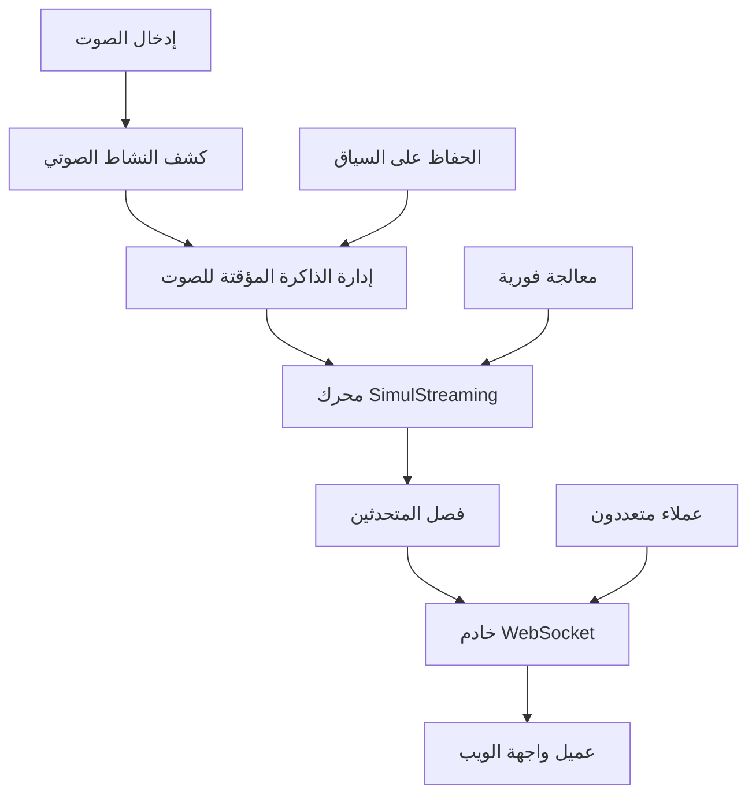

⏱️ **وقت القراءة المقدر**: 15 دقيقة

## مقدمة

شهدت تقنية التعرف على الكلام في الوقت الفعلي تطوراً جذرياً مع ظهور النماذج المحسنة للبث والإنجازات البحثية المتقدمة. يمثل **WhisperLiveKit** أحدث ما توصلت إليه التقنية في مجال النسخ الصوتي الفوري، حيث يجمع بين الأبحاث المتطورة من SimulStreaming (SOTA 2025) و WhisperStreaming (SOTA 2023) وأنظمة فصل المتحدثين المتقدمة.

على عكس الطرق التقليدية للمعالجة المجمعة التي تواجه صعوبات مع القيود الزمنية الفورية، يستفيد WhisperLiveKit من التخزين المؤقت الذكي والمعالجة التدريجية وكشف النشاط الصوتي لتقديم نسخ فوري بزمن استجابة منخفض جداً مباشرة إلى متصفحك.

سيرشدك هذا الدليل الشامل خلال تنفيذ WhisperLiveKit لتطبيقات الكلام الفورية الجاهزة للإنتاج، من الإعداد الأساسي إلى الميزات المتقدمة مثل تحديد المتحدثين ودعم المستخدمين المتعددين.

## لماذا WhisperLiveKit بدلاً من Whisper العادي؟

### تحدي المعالجة الفورية

تم تصميم نماذج Whisper العادية للعبارات الكاملة، وليس لأجزاء الصوت الفورية. معالجة الأجزاء الصغيرة تؤدي إلى:

- **فقدان السياق**: فقدان تدفق المحادثة وحدود الجمل
- **تجزئة الكلمات**: قطع الكلمات في منتصف المقاطع
- **دقة ضعيفة**: تدهور جودة النسخ على الصوت غير المكتمل
- **زمن استجابة عالي**: تأخيرات المعالجة المجمعة

### إبداع WhisperLiveKit

يحل WhisperLiveKit هذه التحديات من خلال:

```python
# الطريقة التقليدية (مشكلة)
def process_audio_chunk(chunk):
    return whisper.transcribe(chunk)  # فقدان السياق، جودة ضعيفة

# طريقة WhisperLiveKit (محسنة)
def process_streaming_audio(stream):
    # تخزين مؤقت ذكي مع الحفاظ على السياق
    # كشف النشاط الصوتي للكفاءة
    # SimulStreaming لزمن استجابة منخفض جداً
    # معالجة تدريجية مع LocalAgreement
    return optimized_transcription
```

## التقنيات الأساسية والهندسة المعمارية

### تكامل الأبحاث المتطورة

**SimulStreaming (SOTA 2025)**:
- نسخ بزمن استجابة منخفض جداً مع سياسة AlignAtt
- إرشاد الانتباه على مستوى الإطار للتوقيت الأمثل للمعالجة
- تحسين البحث الشعاعي المتقدم

**WhisperStreaming (SOTA 2023)**:
- سياسة LocalAgreement للمخرجات المتسقة للبث
- إدارة وتقليم الذاكرة المؤقتة الذكية

**فصل المتحدثين المتقدم**:
- Streaming Sortformer (SOTA 2025) لتحديد المتحدثين في الوقت الفعلي
- تكامل Diart (SOTA 2021) لبيئات الإنتاج

**VAD على مستوى المؤسسات**:
- Silero VAD (2024) لكشف النشاط الصوتي الدقيق
- تقليل العبء الحاسوبي أثناء فترات الصمت

### الهندسة المعمارية للنظام



تدعم الهندسة المعمارية عدة مستخدمين متزامنين مع إدارة ذكية للموارد وكشف النشاط الصوتي لتحسين الأداء.

## التثبيت والإعداد

### المتطلبات المسبقة

**متطلبات النظام**:
- Python 3.8+
- FFmpeg (مطلوب لمعالجة الصوت)
- 4GB+ RAM (8GB+ موصى به للنماذج الأكبر)
- اختياري: GPU NVIDIA للمعالجة المعجلة

### تثبيت FFmpeg

```bash
# macOS
brew install ffmpeg

# Ubuntu/Debian
sudo apt install ffmpeg

# Windows
# تحميل من https://ffmpeg.org/download.html وإضافة إلى PATH
```

### تثبيت WhisperLiveKit

```bash
# إنشاء بيئة معزولة
python3 -m venv whisperlivekit-env
source whisperlivekit-env/bin/activate  # على Windows: whisperlivekit-env\Scripts\activate

# تثبيت WhisperLiveKit
pip install whisperlivekit

# التحقق من التثبيت
whisperlivekit-server --help
```

## دليل البداية السريعة

### تشغيل الخادم الأساسي

```bash
# البدء بالإعدادات الافتراضية (نموذج small، كشف اللغة التلقائي)
whisperlivekit-server --model base --language ar

# يبدأ الخادم على http://localhost:8000
# واجهة الويب متاحة تلقائياً على نفس العنوان
```

### اختبار التثبيت

1. **بدء الخادم**:
```bash
whisperlivekit-server --model tiny --language ar --host localhost --port 8000
```

2. **فتح المتصفح** والانتقال إلى `http://localhost:8000`

3. **منح أذونات الميكروفون** عند الطلب

4. **البدء في التحدث** ومراقبة النسخ الفوري

### سكريبت التحقق

```python
# test_whisperlivekit.py
import asyncio
import websockets
import json
import pyaudio
import wave

async def test_websocket_connection():
    """اختبار اتصال WebSocket بخادم WhisperLiveKit"""
    uri = "ws://localhost:8000/ws"
    
    try:
        async with websockets.connect(uri) as websocket:
            print("✅ اتصال WebSocket ناجح")
            
            # إرسال رسالة اختبار
            test_message = {
                "type": "audio_chunk",
                "data": "test_audio_data"
            }
            
            await websocket.send(json.dumps(test_message))
            response = await websocket.recv()
            print(f"📨 استجابة الخادم: {response}")
            
    except Exception as e:
        print(f"❌ فشل الاتصال: {e}")

# تشغيل الاختبار
asyncio.run(test_websocket_connection())
```

## التكوين المتقدم

### اختيار النموذج والأداء

```bash
# معالجة فائقة السرعة (دقة أقل)
whisperlivekit-server --model tiny --language ar

# أداء متوازن (موصى به لمعظم الحالات)
whisperlivekit-server --model base --language ar

# دقة عالية (يتطلب موارد أكثر)
whisperlivekit-server --model large-v3 --language ar

# دعم متعدد اللغات مع الكشف التلقائي
whisperlivekit-server --model base --language auto
```

### اختيار الخلفية

```bash
# SimulStreaming (SOTA 2025) - زمن استجابة منخفض جداً
whisperlivekit-server --backend simulstreaming --model base

# Faster-Whisper - أداء محسن
whisperlivekit-server --backend faster-whisper --model base

# WhisperStreaming - سياسة LocalAgreement
whisperlivekit-server --backend whisper_timestamped --model base
```

### تكوين SimulStreaming المتقدم

```bash
# ضبط دقيق لزمن الاستجابة مقابل الدقة
whisperlivekit-server \
  --backend simulstreaming \
  --model base \
  --frame-threshold 25 \
  --beams 1 \
  --audio-max-len 30.0 \
  --never-fire
```

**المعاملات الرئيسية**:
- `--frame-threshold`: منخفض = أسرع، عالي = أدق (افتراضي: 25)
- `--beams`: عدد أشعة البحث الشعاعي (1 = جشع، >1 = بحث شعاعي)
- `--audio-max-len`: الحد الأقصى لطول الذاكرة المؤقتة للصوت بالثواني
- `--never-fire`: عدم قطع الكلمات غير المكتملة أبداً

## إعداد فصل المتحدثين

### تحديد المتحدثين الأساسي

```bash
# تفعيل فصل المتحدثين مع Sortformer (SOTA 2025)
whisperlivekit-server \
  --model base \
  --language ar \
  --diarization \
  --diarization-backend sortformer
```

### الفصل المتقدم مع Diart

```bash
# خلفية Diart مع نماذج مخصصة
whisperlivekit-server \
  --model base \
  --language ar \
  --diarization \
  --diarization-backend diart \
  --segmentation-model pyannote/segmentation-3.0 \
  --embedding-model speechbrain/spkrec-ecapa-voxceleb
```

### مصادقة Hugging Face لـ Pyannote

```bash
# مطلوب لنماذج pyannote.audio
pip install huggingface_hub
huggingface-cli login

# قبول شروط المستخدم للنماذج المطلوبة:
# 1. pyannote/segmentation
# 2. pyannote/segmentation-3.0  
# 3. pyannote/embedding
```

## النشر في الإنتاج

### نشر Docker

**حاوية معجلة بـ GPU**:
```dockerfile
# Dockerfile
FROM nvidia/cuda:11.8-runtime-ubuntu20.04

RUN apt-get update && apt-get install -y \
    python3 python3-pip ffmpeg \
    && rm -rf /var/lib/apt/lists/*

RUN pip install whisperlivekit

EXPOSE 8000

CMD ["whisperlivekit-server", "--model", "base", "--language", "ar", "--host", "0.0.0.0"]
```

```bash
# البناء والتشغيل
docker build -t whisperlivekit .
docker run --gpus all -p 8000:8000 whisperlivekit
```

**حاوية CPU فقط**:
```bash
# استخدام صورة CPU مبنية مسبقاً
docker run -p 8000:8000 whisperlivekit/cpu:latest
```

### تكوين خادم الإنتاج

```bash
# تكوين جاهز للإنتاج
whisperlivekit-server \
  --model base \
  --language ar \
  --host 0.0.0.0 \
  --port 8000 \
  --ssl-certfile /path/to/cert.pem \
  --ssl-keyfile /path/to/key.pem \
  --diarization \
  --preloaded_model_count 4 \
  --min-chunk-size 1.0 \
  --buffer_trimming sentence
```

### توزيع الأحمال مع Nginx

```nginx
# /etc/nginx/sites-available/whisperlivekit
upstream whisperlivekit_backend {
    server 127.0.0.1:8000;
    server 127.0.0.1:8001;
    server 127.0.0.1:8002;
    server 127.0.0.1:8003;
}

server {
    listen 80;
    server_name your-domain.com;

    location / {
        proxy_pass http://whisperlivekit_backend;
        proxy_set_header Upgrade $http_upgrade;
        proxy_set_header Connection "upgrade";
        proxy_set_header Host $host;
        proxy_set_header X-Real-IP $remote_addr;
        proxy_set_header X-Forwarded-For $proxy_add_x_forwarded_for;
    }
}
```

## تكامل الويب المخصص

### عميل WebSocket أساسي

```javascript
// whisperlivekit-client.js
class WhisperLiveKitClient {
    constructor(serverUrl = 'ws://localhost:8000/ws') {
        this.serverUrl = serverUrl;
        this.websocket = null;
        this.mediaRecorder = null;
        this.audioContext = null;
    }

    async connect() {
        try {
            this.websocket = new WebSocket(this.serverUrl);
            
            this.websocket.onopen = () => {
                console.log('✅ متصل بـ WhisperLiveKit');
                this.startAudioCapture();
            };

            this.websocket.onmessage = (event) => {
                const data = JSON.parse(event.data);
                this.handleTranscription(data);
            };

            this.websocket.onerror = (error) => {
                console.error('❌ خطأ WebSocket:', error);
            };

        } catch (error) {
            console.error('فشل الاتصال:', error);
        }
    }

    async startAudioCapture() {
        try {
            const stream = await navigator.mediaDevices.getUserMedia({ 
                audio: {
                    sampleRate: 16000,
                    channelCount: 1,
                    echoCancellation: true,
                    noiseSuppression: true
                } 
            });

            this.audioContext = new AudioContext({ sampleRate: 16000 });
            const source = this.audioContext.createMediaStreamSource(stream);
            
            // معالجة الصوت في الوقت الفعلي
            this.processAudioStream(source);

        } catch (error) {
            console.error('تم رفض الوصول للميكروفون:', error);
        }
    }

    processAudioStream(source) {
        const processor = this.audioContext.createScriptProcessor(4096, 1, 1);
        
        processor.onaudioprocess = (event) => {
            const audioData = event.inputBuffer.getChannelData(0);
            
            // تحويل إلى 16-bit PCM
            const pcmData = new Int16Array(audioData.length);
            for (let i = 0; i < audioData.length; i++) {
                pcmData[i] = Math.max(-32768, Math.min(32767, audioData[i] * 32768));
            }

            // إرسال إلى الخادم
            if (this.websocket && this.websocket.readyState === WebSocket.OPEN) {
                this.websocket.send(pcmData.buffer);
            }
        };

        source.connect(processor);
        processor.connect(this.audioContext.destination);
    }

    handleTranscription(data) {
        if (data.type === 'transcription') {
            this.displayTranscription(data.text, data.speaker);
        }
    }

    displayTranscription(text, speaker = null) {
        const transcriptionDiv = document.getElementById('transcription');
        const timestamp = new Date().toLocaleTimeString('ar-SA');
        
        const entry = document.createElement('div');
        entry.className = 'transcription-entry';
        entry.innerHTML = `
            <span class="timestamp">${timestamp}</span>
            ${speaker ? `<span class="speaker">المتحدث ${speaker}:</span>` : ''}
            <span class="text">${text}</span>
        `;
        
        transcriptionDiv.appendChild(entry);
        transcriptionDiv.scrollTop = transcriptionDiv.scrollHeight;
    }
}

// الاستخدام
const client = new WhisperLiveKitClient();
client.connect();
```

### تكامل React

```jsx
// WhisperLiveKitComponent.jsx
import React, { useState, useEffect, useRef } from 'react';

const WhisperLiveKitComponent = () => {
    const [transcriptions, setTranscriptions] = useState([]);
    const [isConnected, setIsConnected] = useState(false);
    const [isRecording, setIsRecording] = useState(false);
    const websocketRef = useRef(null);
    const mediaRecorderRef = useRef(null);

    useEffect(() => {
        connectToServer();
        return () => {
            if (websocketRef.current) {
                websocketRef.current.close();
            }
        };
    }, []);

    const connectToServer = () => {
        const ws = new WebSocket('ws://localhost:8000/ws');
        
        ws.onopen = () => {
            setIsConnected(true);
            console.log('متصل بـ WhisperLiveKit');
        };

        ws.onmessage = (event) => {
            const data = JSON.parse(event.data);
            if (data.type === 'transcription') {
                setTranscriptions(prev => [...prev, {
                    id: Date.now(),
                    text: data.text,
                    speaker: data.speaker,
                    timestamp: new Date().toLocaleTimeString('ar-SA')
                }]);
            }
        };

        ws.onclose = () => {
            setIsConnected(false);
            console.log('انقطع الاتصال مع WhisperLiveKit');
        };

        websocketRef.current = ws;
    };

    const startRecording = async () => {
        try {
            const stream = await navigator.mediaDevices.getUserMedia({ 
                audio: {
                    sampleRate: 16000,
                    channelCount: 1,
                    echoCancellation: true,
                    noiseSuppression: true
                }
            });

            const mediaRecorder = new MediaRecorder(stream, {
                mimeType: 'audio/webm;codecs=opus'
            });

            mediaRecorder.ondataavailable = (event) => {
                if (event.data.size > 0 && websocketRef.current?.readyState === WebSocket.OPEN) {
                    websocketRef.current.send(event.data);
                }
            };

            mediaRecorder.start(100); // إرسال البيانات كل 100ms
            mediaRecorderRef.current = mediaRecorder;
            setIsRecording(true);

        } catch (error) {
            console.error('فشل بدء التسجيل:', error);
        }
    };

    const stopRecording = () => {
        if (mediaRecorderRef.current) {
            mediaRecorderRef.current.stop();
            mediaRecorderRef.current = null;
            setIsRecording(false);
        }
    };

    return (
        <div className="whisperlivekit-container" dir="rtl">
            <div className="controls">
                <div className={`status ${isConnected ? 'connected' : 'disconnected'}`}>
                    {isConnected ? '🟢 متصل' : '🔴 غير متصل'}
                </div>
                
                <button 
                    onClick={isRecording ? stopRecording : startRecording}
                    disabled={!isConnected}
                    className={`record-button ${isRecording ? 'recording' : ''}`}
                >
                    {isRecording ? '⏹️ إيقاف التسجيل' : '🎤 بدء التسجيل'}
                </button>
            </div>

            <div className="transcriptions">
                <h3>النسخ الفوري</h3>
                <div className="transcription-list">
                    {transcriptions.map(item => (
                        <div key={item.id} className="transcription-item">
                            <span className="timestamp">{item.timestamp}</span>
                            {item.speaker && <span className="speaker">المتحدث {item.speaker}:</span>}
                            <span className="text">{item.text}</span>
                        </div>
                    ))}
                </div>
            </div>
        </div>
    );
};

export default WhisperLiveKitComponent;
```

## تحسين الأداء

### استراتيجية اختيار النموذج

```python
# performance_config.py
PERFORMANCE_CONFIGS = {
    'ultra_fast': {
        'model': 'tiny',
        'backend': 'simulstreaming',
        'frame_threshold': 15,
        'beams': 1,
        'min_chunk_size': 0.5
    },
    'balanced': {
        'model': 'base',
        'backend': 'simulstreaming', 
        'frame_threshold': 25,
        'beams': 1,
        'min_chunk_size': 1.0
    },
    'high_accuracy': {
        'model': 'large-v3',
        'backend': 'faster-whisper',
        'beams': 5,
        'min_chunk_size': 2.0
    }
}

def get_optimal_config(use_case):
    """اختيار التكوين الأمثل حسب حالة الاستخدام"""
    if use_case == 'live_streaming':
        return PERFORMANCE_CONFIGS['ultra_fast']
    elif use_case == 'meeting_transcription':
        return PERFORMANCE_CONFIGS['balanced']
    elif use_case == 'legal_documentation':
        return PERFORMANCE_CONFIGS['high_accuracy']
```

### إدارة الموارد

```bash
# نشر متعدد المثيلات للتزامن العالي
# المثيل 1: معالجة فائقة السرعة
whisperlivekit-server --model tiny --port 8001 --preloaded_model_count 2

# المثيل 2: معالجة متوازنة  
whisperlivekit-server --model base --port 8002 --preloaded_model_count 2

# المثيل 3: معالجة عالية الدقة
whisperlivekit-server --model large-v3 --port 8003 --preloaded_model_count 1
```

## دليل استكشاف الأخطاء وإصلاحها

### المشاكل الشائعة والحلول

**1. الخادم لا يبدأ**
```bash
# التحقق من تثبيت FFmpeg
ffmpeg -version

# التحقق من بيئة Python
python -c "import whisperlivekit; print('✅ التثبيت مكتمل')"

# التحقق من توفر المنفذ
lsof -i :8000
```

**2. جودة النسخ ضعيفة**
```bash
# زيادة حجم النموذج
whisperlivekit-server --model base  # بدلاً من tiny

# تعديل حجم الجزء
whisperlivekit-server --min-chunk-size 2.0

# تفعيل التحقق من الثقة
whisperlivekit-server --confidence-validation
```

**3. مشاكل زمن الاستجابة العالي**
```bash
# استخدام خلفية SimulStreaming
whisperlivekit-server --backend simulstreaming --frame-threshold 15

# تقليل الذاكرة المؤقتة للصوت
whisperlivekit-server --audio-max-len 15.0

# تفعيل تحسين VAD
whisperlivekit-server --vac-chunk-size 0.5
```

**4. مشاكل اتصال WebSocket**
```javascript
// إضافة منطق إعادة المحاولة
class RobustWhisperClient {
    constructor(serverUrl) {
        this.serverUrl = serverUrl;
        this.reconnectAttempts = 0;
        this.maxReconnectAttempts = 5;
    }

    connect() {
        this.websocket = new WebSocket(this.serverUrl);
        
        this.websocket.onclose = () => {
            if (this.reconnectAttempts < this.maxReconnectAttempts) {
                setTimeout(() => {
                    this.reconnectAttempts++;
                    this.connect();
                }, 1000 * this.reconnectAttempts);
            }
        };
    }
}
```

### مراقبة الأداء

```python
# monitoring.py
import psutil
import time
import requests

def monitor_whisperlivekit_performance():
    """مراقبة أداء خادم WhisperLiveKit"""
    while True:
        try:
            # فحص صحة الخادم
            response = requests.get('http://localhost:8000/health', timeout=5)
            
            # مراقبة موارد النظام
            cpu_percent = psutil.cpu_percent(interval=1)
            memory_percent = psutil.virtual_memory().percent
            
            print(f"🖥️  المعالج: {cpu_percent}% | 💾 الذاكرة: {memory_percent}%")
            
            if cpu_percent > 80:
                print("⚠️  استخدام عالي للمعالج")
            
            if memory_percent > 80:
                print("⚠️  استخدام عالي للذاكرة")
                
        except Exception as e:
            print(f"❌ فشل فحص الصحة: {e}")
        
        time.sleep(10)

if __name__ == "__main__":
    monitor_whisperlivekit_performance()
```

## حالات الاستخدام الواقعية

### 1. نسخ الاجتماعات المباشر

```python
# meeting_transcriber.py
import asyncio
import websockets
import json
from datetime import datetime

class MeetingTranscriber:
    def __init__(self):
        self.transcriptions = []
        self.meeting_id = datetime.now().strftime("%Y%m%d_%H%M%S")
    
    async def start_meeting_transcription(self):
        uri = "ws://localhost:8000/ws"
        
        async with websockets.connect(uri) as websocket:
            print(f"📝 بدء نسخ الاجتماع: {self.meeting_id}")
            
            async for message in websocket:
                data = json.loads(message)
                
                if data['type'] == 'transcription':
                    entry = {
                        'timestamp': datetime.now().isoformat(),
                        'speaker': data.get('speaker', 'غير معروف'),
                        'text': data['text']
                    }
                    
                    self.transcriptions.append(entry)
                    print(f"[{entry['timestamp']}] المتحدث {entry['speaker']}: {entry['text']}")
    
    def export_meeting_notes(self):
        """تصدير نسخ الاجتماع إلى ملف"""
        filename = f"meeting_{self.meeting_id}.json"
        with open(filename, 'w', encoding='utf-8') as f:
            json.dump(self.transcriptions, f, indent=2, ensure_ascii=False)
        print(f"📄 تم تصدير محضر الاجتماع إلى {filename}")

# الاستخدام
transcriber = MeetingTranscriber()
asyncio.run(transcriber.start_meeting_transcription())
```

### 2. تحليل مكالمات خدمة العملاء

```python
# call_analyzer.py
import re
from collections import Counter

class CallAnalyzer:
    def __init__(self):
        self.sentiment_keywords = {
            'positive': ['ممتاز', 'رائع', 'راضي', 'سعيد', 'شكراً'],
            'negative': ['سيء', 'فظيع', 'محبط', 'غاضب', 'مستاء'],
            'neutral': ['عادي', 'مقبول', 'متوسط', 'طبيعي']
        }
    
    def analyze_call_transcription(self, transcriptions):
        """تحليل مكالمة خدمة العملاء للحصول على رؤى"""
        analysis = {
            'total_duration': len(transcriptions),
            'speaker_distribution': Counter(),
            'sentiment_analysis': {'positive': 0, 'negative': 0, 'neutral': 0},
            'key_topics': [],
            'action_items': []
        }
        
        for entry in transcriptions:
            speaker = entry['speaker']
            text = entry['text'].lower()
            
            # توزيع المتحدثين
            analysis['speaker_distribution'][speaker] += 1
            
            # تحليل المشاعر
            for sentiment, keywords in self.sentiment_keywords.items():
                if any(keyword in text for keyword in keywords):
                    analysis['sentiment_analysis'][sentiment] += 1
            
            # استخراج عناصر العمل
            if any(phrase in text for phrase in ['سأتابع', 'سأرسل', 'سأتصل مرة أخرى']):
                analysis['action_items'].append(entry)
        
        return analysis
    
    def generate_call_summary(self, analysis):
        """إنشاء ملخص تنفيذي للمكالمة"""
        summary = f"""
        📞 ملخص تحليل المكالمة
        ===================
        إجمالي التفاعلات: {analysis['total_duration']}
        
        توزيع المتحدثين:
        {dict(analysis['speaker_distribution'])}
        
        تحليل المشاعر:
        - إيجابي: {analysis['sentiment_analysis']['positive']}
        - سلبي: {analysis['sentiment_analysis']['negative']}  
        - محايد: {analysis['sentiment_analysis']['neutral']}
        
        عناصر العمل: {len(analysis['action_items'])}
        """
        
        return summary
```

### 3. تكامل إمكانية الوصول

```javascript
// accessibility_integration.js
class AccessibilityTranscriber {
    constructor() {
        this.isHighContrast = false;
        this.fontSize = 'medium';
        this.speechRate = 1.0;
    }

    setupAccessibilityFeatures() {
        // وضع التباين العالي
        this.addHighContrastToggle();
        
        // عناصر تحكم حجم الخط
        this.addFontSizeControls();
        
        // تحويل النص إلى كلام للنسخ
        this.addTextToSpeech();
        
        // التنقل بلوحة المفاتيح
        this.addKeyboardShortcuts();
    }

    addHighContrastToggle() {
        const toggle = document.createElement('button');
        toggle.textContent = '🎨 تباين عالي';
        toggle.onclick = () => {
            this.isHighContrast = !this.isHighContrast;
            document.body.classList.toggle('high-contrast', this.isHighContrast);
        };
        document.getElementById('accessibility-controls').appendChild(toggle);
    }

    addTextToSpeech() {
        const speakButton = document.createElement('button');
        speakButton.textContent = '🔊 قراءة بصوت عالي';
        speakButton.onclick = () => {
            const transcriptionText = document.getElementById('transcription').textContent;
            const utterance = new SpeechSynthesisUtterance(transcriptionText);
            utterance.rate = this.speechRate;
            utterance.lang = 'ar-SA';
            speechSynthesis.speak(utterance);
        };
        document.getElementById('accessibility-controls').appendChild(speakButton);
    }

    addKeyboardShortcuts() {
        document.addEventListener('keydown', (event) => {
            // Ctrl+R: بدء/إيقاف التسجيل
            if (event.ctrlKey && event.key === 'r') {
                event.preventDefault();
                this.toggleRecording();
            }
            
            // Ctrl+S: حفظ النسخ
            if (event.ctrlKey && event.key === 's') {
                event.preventDefault();
                this.saveTranscription();
            }
            
            // Ctrl+Plus: زيادة حجم الخط
            if (event.ctrlKey && event.key === '=') {
                event.preventDefault();
                this.increaseFontSize();
            }
        });
    }
}
```

## الميزات المتقدمة والتخصيص

### نماذج اللغة المخصصة

```python
# custom_model_integration.py
from whisperlivekit import WhisperLiveKitServer

class CustomWhisperServer(WhisperLiveKitServer):
    def __init__(self, custom_model_path):
        super().__init__()
        self.custom_model_path = custom_model_path
    
    def load_custom_model(self):
        """تحميل نموذج مضبوط لمجال محدد"""
        # تنفيذ تحميل النموذج المخصص
        pass
    
    def apply_domain_specific_processing(self, transcription):
        """تطبيق معالجة خاصة بالمجال"""
        # تصحيح المصطلحات الطبية
        medical_corrections = {
            'نوبة قلبية': 'احتشاء عضلة القلب',
            'ضغط دم عالي': 'ارتفاع ضغط الدم'
        }
        
        for term, correction in medical_corrections.items():
            transcription = transcription.replace(term, correction)
        
        return transcription
```

### تكامل الخدمات الخارجية

```python
# external_integrations.py
import requests
import json

class ExternalServiceIntegrator:
    def __init__(self):
        self.slack_webhook = "YOUR_SLACK_WEBHOOK_URL"
        self.teams_webhook = "YOUR_TEAMS_WEBHOOK_URL"
    
    async def send_to_slack(self, transcription_data):
        """إرسال النسخ إلى قناة Slack"""
        message = {
            "text": f"🎤 نسخ جديد",
            "attachments": [{
                "color": "good",
                "fields": [{
                    "title": "المتحدث",
                    "value": transcription_data.get('speaker', 'غير معروف'),
                    "short": True
                }, {
                    "title": "النص",
                    "value": transcription_data['text'],
                    "short": False
                }]
            }]
        }
        
        response = requests.post(self.slack_webhook, json=message)
        return response.status_code == 200
    
    async def save_to_database(self, transcription_data):
        """حفظ النسخ في قاعدة البيانات"""
        # منطق تكامل قاعدة البيانات
        pass
    
    async def trigger_workflow(self, transcription_data):
        """تشغيل سير عمل آلي بناءً على محتوى النسخ"""
        # منطق أتمتة سير العمل
        pass
```

## الخلاصة

يمثل WhisperLiveKit تقدماً مهماً في تقنية التعرف على الكلام في الوقت الفعلي، حيث يجمع بين الأبحاث المتطورة والميزات العملية الجاهزة للإنتاج. من خلال هذا الدليل الشامل، تعلمت:

### الإنجازات الرئيسية

1. **إتقان معالجة الكلام الفوري**: فهم الاختلافات الأساسية بين التعرف على الكلام المجمع والمتدفق
2. **تنفيذ أنظمة الإنتاج**: نشر خدمات النسخ الصوتي القابلة للتوسع ومتعددة المستخدمين
3. **تكامل الميزات المتقدمة**: الاستفادة من فصل المتحدثين وكشف النشاط الصوتي والخلفيات المخصصة
4. **تحسين الأداء**: تكوين الأنظمة للحصول على التوازن الأمثل بين زمن الاستجابة والدقة
5. **التطبيقات الواقعية**: بناء أدوات نسخ الاجتماعات وأدوات إمكانية الوصول ومحللات خدمة العملاء

### النقاط البارزة التقنية

- **زمن استجابة منخفض جداً**: خلفية SimulStreaming مع إرشاد الانتباه على مستوى الإطار
- **ميزات على مستوى المؤسسات**: دعم متعدد المستخدمين وتحديد المتحدثين وأمان SSL/TLS
- **هندسة مرنة**: اتصال فوري قائم على WebSocket مع تكامل واجهة الويب
- **جاهز للإنتاج**: نشر Docker وتوزيع الأحمال والمراقبة ومعالجة الأخطاء

### الخطوات التالية

فكر في استكشاف هذه المواضيع المتقدمة:

- **ضبط النماذج المخصصة**: تكييف النماذج للمصطلحات الخاصة بالمجال
- **التكامل متعدد الوسائط**: الجمع مع معالجة الفيديو لتحليل شامل للاجتماعات
- **النشر الطرفي**: التحسين للأجهزة المحمولة وإنترنت الأشياء
- **التحليلات المتقدمة**: تنفيذ تحليل المشاعر وذكاء المحادثة

إن الجمع بين الأبحاث المتطورة والتنفيذ العملي في WhisperLiveKit يجعله خياراً مثالياً لبناء الجيل القادم من التطبيقات المدعومة بالصوت. سواء كنت تطور أدوات إمكانية الوصول أو أنظمة نسخ الاجتماعات أو تحليلات خدمة العملاء، يوفر WhisperLiveKit الأساس للتعرف على الكلام الفوري الموثوق والقابل للتوسع.

---

**الموارد ذات الصلة**:
- [مستودع WhisperLiveKit على GitHub](https://github.com/QuentinFuxa/WhisperLiveKit)
- [ورقة بحث SimulStreaming](https://arxiv.org/abs/2406.03049)
- [وثائق Pyannote.audio](https://github.com/pyannote/pyannote-audio)
- [دليل FastAPI WebSocket](https://fastapi.tiangolo.com/advanced/websockets/)
